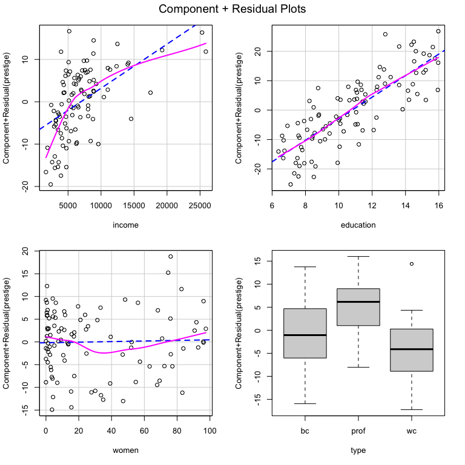

<!-- README.md is generated from README.Rmd. Please edit that file -->

# DAMisc 

The `DAMisc` package has evolved over the past decade to include many of
the functions I use when teaching applied stats to social scientists. I
think many of the functions might be useful more broadly so I thought it
would be worth discussing the functionality in a sort of thematic way
here. The functions do fall into a few different thems.

  - Functions that attempt to figure out whether and what kind of
    unmodeled non-linearities exist.  
  - Functions for investigating interactions in different settings
    (linear models and binomial GLMs).  
  - Functions for post-model evaluation and examination of non-linear
    models (GLMs, ordinal data models and unordered data models).
  - Functions for both frequentist and Bayesian Alternating Least
    Squares Optimal Scaling (ALSOS).

I’ll talk about each of these below.

### Evaluating Un-modeled Non-linearities.

One of the problems I find most interesting in applied regression
analysis is evaluating the extent to which the linear, additive
functional form is sufficient to capture the systematic dependence of
the outcome on the explanatory variables. For the purposes of this
example, we’ll use data from the `carData` package. Here’s a multiple
linear regression model where all covariates enter the model linearly
and additively.

``` r
data(Prestige, package='carData')
lin.mod <- lm(prestige ~ income + education + women + type, data=Prestige)
summary(lin.mod)
#> 
#> Call:
#> lm(formula = prestige ~ income + education + women + type, data = Prestige)
#> 
#> Residuals:
#>      Min       1Q   Median       3Q      Max 
#> -14.7485  -4.4817   0.3119   5.2478  18.4978 
#> 
#> Coefficients:
#>               Estimate Std. Error t value Pr(>|t|)    
#> (Intercept) -0.8139032  5.3311558  -0.153 0.878994    
#> income       0.0010428  0.0002623   3.976 0.000139 ***
#> education    3.6623557  0.6458300   5.671 1.63e-07 ***
#> women        0.0064434  0.0303781   0.212 0.832494    
#> typeprof     5.9051970  3.9377001   1.500 0.137127    
#> typewc      -2.9170720  2.6653961  -1.094 0.276626    
#> ---
#> Signif. codes:  0 '***' 0.001 '**' 0.01 '*' 0.05 '.' 0.1 ' ' 1
#> 
#> Residual standard error: 7.132 on 92 degrees of freedom
#>   (4 observations deleted due to missingness)
#> Multiple R-squared:  0.8349, Adjusted R-squared:  0.826 
#> F-statistic: 93.07 on 5 and 92 DF,  p-value: < 2.2e-16
```

We might wonder whether any of the variables have non-linear trends that
are not captured by the model. We could use the `crPlots` function from
the `car` package to figure this out.

``` r
car::crPlots(lin.mod, layout=c(2,2))
```



There certainly appears to be non-linearity in the relationships between
`income` and `prestige` as well as between `women` and `prestige`. If we
wonder whether that is statistically significant, we could use the
`crTest` function from the `DAMisc` package to test the significance of
the difference between the OLS and local polynomial regressions in the
C+R plots.

``` r
library(DAMisc)
crTest(lin.mod)
#>              RSSp   RSSnp DFnum DFdenom     F     p
#> income    4678.99 4093.63 1.903  94.097 7.069 0.002
#> education 4678.99 4656.86 0.946  95.054 0.478 0.481
#> women     4678.99 4483.03 0.869  95.131 4.785 0.036
```

Here, the test suggests that the `income` and `women` relationships both
have significant non-linear relationships with `prestige`. The next
thing to figure out is what that non-linearity looks like. We could use
the `boxTidwell` function from the `car` package to estimate the
transformation parameter for `income`. There is also a `crSpanTest`
function that looks at the same test as above, but over the reasonable
range of the span parameter in the local polynomial regression.

``` r
car::boxTidwell(prestige ~ income, ~ women + type + education, data=Prestige)
#>  MLE of lambda Score Statistic (z)  Pr(>|z|)    
#>       -0.29939             -4.4858 7.265e-06 ***
#> ---
#> Signif. codes:  0 '***' 0.001 '**' 0.01 '*' 0.05 '.' 0.1 ' ' 1
#> 
#> iterations =  7
```

Here, the MLE of \(\lambda\), the transformation parameter, is -0.299.
We might wonder whether that’s close enough to the log transform, which
is what is used for the 0 power transform. We could figure that out by
imposing the transformation in the `boxTidwell` function.

``` r
car::boxTidwell(prestige ~ log(income), ~ women + type + education, data=Prestige)
#>  MLE of lambda Score Statistic (z) Pr(>|z|)
#>        -1.5441             -1.4096   0.1587
#> 
#> iterations =  4
```

Since the proposed additional transformation parameter is not
significant, we can be confident that the log transform is sufficient.
The `women` variable likely needs a polynomial since the non-linearity
is not simple and monotone. We could use a second degree polynomial, but
the `NKnots` and `NKnotsTest` functions can help figure this out. Let’s
look at the `NKnots` function first.

``` r
NKnots(prestige ~ log(income) + type + education, var="women", 
       data=Prestige, degree=3, includePoly = TRUE, plot=TRUE)
```


The `NKnots` function calculates the AIC for the first up to `degree`
polynomials and the b-splines with 1:(DF - `degree`) internal knots. The
AIC is plotted, and in this case it is clear that the second-order
polynomial generates the smallest AIC value. To see whether these
differences are significant, we can use the `NKnotsTest` function.

``` r
options(width=100)
NKnotsTest(prestige ~ log(income) + type + education, var="women", 
       data=Prestige, degree=3, target=2)
#>                F      DF1 DF2 p(F)  Clarke Pr(Better) p(Clarke) Delta_AIC Delta_AICc Delta_BIC
#> DF=2 vs. DF=1  4.348* 1   91  0.040 41     0.418      0.129     2.574     2.201      -0.011   
#>    Target                                                                                     
#> DF=2 vs. DF=3  0.208  1   90  0.650 77*    0.786      0.000 (T) 1.774     2.202      4.359    
#> DF=2 vs. DF=4  0.200  2   89  0.819 79*    0.806      0.000 (T) 3.561     4.472      8.731    
#> DF=2 vs. DF=5  0.371  3   88  0.774 82*    0.837      0.000 (T) 4.769     6.221      12.524   
#> DF=2 vs. DF=6  0.266  4   87  0.899 88*    0.898      0.000 (T) 6.807     8.860      17.147   
#> DF=2 vs. DF=7  0.337  5   86  0.889 83*    0.847      0.000 (T) 8.096     10.812     21.021   
#> DF=2 vs. DF=8  0.755  6   85  0.607 76*    0.776      0.000 (T) 6.912     10.354     22.422   
#> DF=2 vs. DF=9  1.037  7   84  0.411 80*    0.816      0.000 (T) 5.874     10.109     23.968   
#> DF=2 vs. DF=10 0.808  8   83  0.597 85*    0.867      0.000 (T) 8.649     13.747     29.329   
#> DF=2 vs. DF=11 0.898  9   82  0.531 79*    0.806      0.000 (T) 8.791     14.823     32.055   
#> DF=2 vs. DF=12 0.800  10  81  0.629 83*    0.847      0.000 (T) 10.774    17.814     36.624   
#> DF=2 vs. DF=13 0.656  11  80  0.775 85*    0.867      0.000 (T) 13.531    21.657     41.966
```

In the `NKnotsTest` function, you have to specify a `target` which is
the degrees of freedom of the proposed model. In this case, we pick `2`.
All smaller and bigger models up to the specified degrees of freedom are
tested. If using the \(F\)-test, the idea is that all smaller models
should be significantly worse (i.e., have small p-values) and all bigger
models should not be significantly better (i.e., have big p-values). We
can see that this is true, looking at the `p(F)` column. You could also
use the Clarke test, which is implemented with the `clarke_test`
function from the
[`clarkeTest`](https://github.com/davidaarmstrong/ClarkeTest) package,
which I also built and maintain, or AIC, AIC with a small-sample
correction or BIC. The logic of using these other measures is basically
the same.

Now that we are confident about the correct (additive) functional form
of the variables, we could go on and interpret them as we usually would
(or make an effect plot).

### Evaluating Interactions

Lots has been written recently in Political Science regarding
interactions, in both linear and non-linear (generally binomial GLM)
models. First, we’ll tackle linear model interactions.

#### Linear Model Interactions

We can add an interaction to the model. Here, we can use the same data
as above, though we’ll use the linear, conditional specification. There
are two main functions that work in linear models - one for evaluating
interactions between quantitative and qualitiative variables and one for
evaluating interactions between two quantitative variables. Let’s look
at the quantitative-qualitative interaction first.

``` r
Prestige$income <- Prestige$income/1000
int.mod1 <- lm(prestige ~ education + income*type + women, data=Prestige)
summary(int.mod1)
#> 
#> Call:
#> lm(formula = prestige ~ education + income * type + women, data = Prestige)
#> 
#> Residuals:
#>     Min      1Q  Median      3Q     Max 
#> -12.632  -4.518   1.057   3.850  18.171 
#> 
#> Coefficients:
#>                  Estimate Std. Error t value Pr(>|t|)    
#> (Intercept)     -10.07694    5.01000  -2.011   0.0473 *  
#> education         2.80361    0.59233   4.733 8.18e-06 ***
#> income            3.85495    0.58655   6.572 3.15e-09 ***
#> typeprof         27.54962    5.40962   5.093 1.93e-06 ***
#> typewc            3.43457    5.36630   0.640   0.5238    
#> women             0.07648    0.03117   2.453   0.0161 *  
#> income:typeprof  -3.00851    0.57540  -5.229 1.10e-06 ***
#> income:typewc    -1.09486    0.86374  -1.268   0.2082    
#> ---
#> Signif. codes:  0 '***' 0.001 '**' 0.01 '*' 0.05 '.' 0.1 ' ' 1
#> 
#> Residual standard error: 6.284 on 90 degrees of freedom
#>   (4 observations deleted due to missingness)
#> Multiple R-squared:  0.8746, Adjusted R-squared:  0.8649 
#> F-statistic:  89.7 on 7 and 90 DF,  p-value: < 2.2e-16
```

We can make sure that the interaction is significant with the `Anova`
function from the `car` package:

``` r
car::Anova(int.mod1)
#> Anova Table (Type II tests)
#> 
#> Response: prestige
#>             Sum Sq Df F value    Pr(>F)    
#> education    884.6  1 22.4026 8.176e-06 ***
#> income       803.9  1 20.3606 1.932e-05 ***
#> type         583.1  2  7.3837  0.001073 ** 
#> women        237.7  1  6.0197  0.016074 *  
#> income:type 1125.4  2 14.2514 4.199e-06 ***
#> Residuals   3553.6 90                      
#> ---
#> Signif. codes:  0 '***' 0.001 '**' 0.01 '*' 0.05 '.' 0.1 ' ' 1
```

We see that the interaction is significant. We can use the
`intQualQuant` function from the `DAMisc` package to figure out what the
interaction implies. First, let’s calculate the simple slopes:

``` r
intQualQuant(int.mod1, c("income", "type"), type="slopes", plot=FALSE)
#> Conditional Effect of  income  given  type 
#>         eff     se  tstat pvalue
#> bc   3.8550 0.5865 6.5723  0.000
#> prof 0.8464 0.2340 3.6170  0.000
#> wc   2.7601 0.8255 3.3436  0.001
```

Here, we see that the slope of income (in thousands of dollars) on
prestige is 3.86 for blue collar occupations, 2.76 for white collar
occupations and only 0.85 for professional occupations. We could also
make a plot of the three different lines holding constant all other
variables.

``` r
intQualQuant(int.mod1, c("income", "type"), type="slopes", plot=TRUE)
```


One of the benefits of this function is that it plots a rug for the
quantitative variable at each level of the qualitative variable. This
indicates, particularly in this case, that the density of income depends
very much on occupation type. The other side of the interaction is also
important. We can plot that side of the interaction by specifying
`type='facs'`.

``` r
lattice::trellis.par.set(strip.background=list(col="gray75"))
out <- intQualQuant(int.mod1, c("income", "type"), type="facs", plot=TRUE)
update(out, layout=c(3,1))
```


This shows the effect of moving from every level to every other level in
the qualitative variable for all values of the quantitative variable.
Here, the rug plots at the bottom help identify ranges of the
quantitative variable where inference is safe.

Next, we can look at interactions between two quantitative variables.

``` r
int.mod2 <- lm(prestige ~ income*education + type + women, data=Prestige)
summary(int.mod2)
#> 
#> Call:
#> lm(formula = prestige ~ income * education + type + women, data = Prestige)
#> 
#> Residuals:
#>      Min       1Q   Median       3Q      Max 
#> -15.2186  -5.0131   0.6606   4.8713  16.9888 
#> 
#> Coefficients:
#>                   Estimate Std. Error t value Pr(>|t|)    
#> (Intercept)      -21.53038    8.09938  -2.658  0.00928 ** 
#> income             4.37994    1.04769   4.181 6.68e-05 ***
#> education          5.25108    0.78217   6.713 1.59e-09 ***
#> typeprof           4.57575    3.76607   1.215  0.22751    
#> typewc            -4.81161    2.59942  -1.851  0.06741 .  
#> women              0.03947    0.03059   1.290  0.20019    
#> income:education  -0.24147    0.07363  -3.280  0.00147 ** 
#> ---
#> Signif. codes:  0 '***' 0.001 '**' 0.01 '*' 0.05 '.' 0.1 ' ' 1
#> 
#> Residual standard error: 6.781 on 91 degrees of freedom
#>   (4 observations deleted due to missingness)
#> Multiple R-squared:  0.8524, Adjusted R-squared:  0.8427 
#> F-statistic: 87.58 on 6 and 91 DF,  p-value: < 2.2e-16
```

There are a couple of different things we can do here. The most recent
advice comes from Berry, Golder and Milton’s 2012 piece in the *Journal
of Politics*. First, suggested making conditional effects plots. The
`DAintfun2` function in the `DAMisc` package does this for you.

``` r
DAintfun2(int.mod2, c("income", "education"), hist=TRUE, 
          scale.hist=.3)
```


Here, the conditional effect of one variable is plotted on the
\(y\)-axis and the conditioning variable is plotted on the \(x\)-axis.
The histogram gives the density of the conditioning variable. The
`scale.hist` argument determines vertically how much of the plotting
region the histogram occupies. The axis numbers on the right-hand side
belong to the histogram and the ones on the left belong to the
conditional effect. There are two other visualizations that might be
useful in other circumstances. The first, produced with `DAintfun3`
provides the conditional effect of one variable at the mean and the
mean\(\pm\)SD of the other variable. Here’s what that looks like in this
case.

``` r
DAintfun3(int.mod2, c("income", "education"))
```


The third method, with `DAintfun` produces a single 3-D surface plot
where the areas of higher bivariate density are shaded in lighter
colors.

``` r
DAintfun(int.mod2,c("income", "education"), theta=-45, ticktype="detail", phi=15)
```


Finally, there are two more functions that can be used here. The
`changeSig` function calculates where conditional effects change from
significant to insignificant. Here’s an example using the model above.

``` r
changeSig(int.mod2, c("income", "education"))
#> LB for B(income | education) = 0 when education=15.7712 (97th pctile)
#> UB for B(income | education) = 0 when education=25.5111 (> Maximum Value in Data)
#> LB for B(education | income) = 0 when income=14.6971 (96th pctile)
#> UB for B(education | income) = 0 when income=46.3725 (> Maximum Value in Data)
```

This function shows when the lower and upper confidence bounds cross
zero and what percentile of the conditioning variable’s distribution
that is.

Finally, following Berry, Golder and Milton (2012), the function
`BGMtest` tests all of the hypotheses they specify.

``` r
BGMtest(int.mod2, vars=c("income", "education"))
#>              est    se      t p-value
#> P(X|Zmin)  2.839 0.602  4.717 0.000  
#> P(X|Zmax)  0.524 0.295  1.773 0.080  
#> P(Z|Xmin)  4.851 0.713  6.803 0.000  
#> P(Z|Xmax) -0.998 1.548 -0.645 0.521  
#> P(XZ)     -0.241 0.074 -3.280 0.001
```

#### Non-linear Model Interactions

The work on interactions has a long history. Until quite recently, the
work by Ai, Norton and Wang was the most prominent in this area. In
recent years, political scientists - Bill Berry, Jacqueline DeMeritt,
Justin Esarey and Carlisle Rainey have all made contributions here.

There are two related questions:

1.  Is a product term necessary for an interaction to exist?
2.  How to test for an interaction?

Rainey’s answer to the first problem is compelling. He argues that
unless there is strong theory to suggest that the product term is *not*
necessary, then it should be included. The counterintuitive part of the
argument is that rather than the product term enhancing our ability to
find an interaction, the product term actually can mitigate the effect
of compression reducing the strength of the interaction if the data is
consistent with a more additive process.

The `DAMisc` package has two functions that can help. The `intEff`
function is a more or less direct port of the code that Norton, Wang and
Ai proposed in their article in the Stata Journal. I prefer the
`secondDiff` function that directly calculates second differences and
uses a parametric bootstrap to find confidence intervals for the
calculated quantities. We will demonstrate with the `conflictData` from
the `clarkeTest` package.

``` r
data(conflictData, package="clarkeTest")
conflictData$rgdpna_pc <- conflictData$rgdpna_pc/1000
bin.mod1 <- glm(conflict_binary ~ log(pop) + rgdpna_pc +  
                 polity2, data=conflictData, 
               family=binomial)

bin.mod2 <- glm(conflict_binary ~ log(pop) + rgdpna_pc *
                 polity2, data=conflictData, 
               family=binomial)
```

In the models above, `bin.mod1` has the terms linearly and additively
entered in the model. `bin.mod2` includes a product term between
`rgdpna_pc` and `polity2`. We could test to see whether the second model
fits better than the first.

``` r
anova(bin.mod1, bin.mod2, test='Chisq')
#> Analysis of Deviance Table
#> 
#> Model 1: conflict_binary ~ log(pop) + rgdpna_pc + polity2
#> Model 2: conflict_binary ~ log(pop) + rgdpna_pc * polity2
#>   Resid. Df Resid. Dev Df Deviance Pr(>Chi)
#> 1      4377     3969.2                     
#> 2      4376     3968.5  1  0.68458    0.408
```

The \(\chi^2\) in the analysis of deviance test would suggest that both
models fit pretty much the same. Thus, there may not be a reason to
prefer the product term model. Now, however, we could use the
`secondDiff` function to figure out whether there is a significant
conditional effect (independent of whether the product term is in the
model). The `secondDiff` function, by default, uses the average marginal
effect approach to calculating the difference. Here it is for the model
without the product term.

``` r
sd1 <- secondDiff(bin.mod1, c("rgdpna_pc", "polity2"), conflictData)
summary(sd1)
#> Second Difference Using the Average Marginal Effect Approach
#> 
#> Overall: 
#> Average Second Difference: 0.049, 95% CI: (0.001,0.097)
#> 
#> Individual:
#> Significant Negative Individual Second Differences: 0 
#> Significant Positive Individual Second Differences: 4381 
#> Inignificant Individual Second Differences: 0
```

Here all of the second differences are positive. The average second
difference is 0.049, meaning that the difference in probability of
conflict is .05 bigger for a change in GDP when democracy is high than
when democracy is low. We could plot out all of the individual
confidence intervals as well.

``` r
print(plot(sd1))
```


Now we could do the same thing for the model with the product term

``` r
sd2 <- secondDiff(bin.mod2, c("rgdpna_pc", "polity2"), conflictData)
summary(sd2)
#> Second Difference Using the Average Marginal Effect Approach
#> 
#> Overall: 
#> Average Second Difference: 0.065, 95% CI: (0.000,0.127)
#> 
#> Individual:
#> Significant Negative Individual Second Differences: 0 
#> Significant Positive Individual Second Differences: 4307 
#> Inignificant Individual Second Differences: 74
```

Note here, that some of the individual second differences are
insignificant, but overall, the picture looks pretty similar - the
average second differences is 0.065 (slightly bigger than before) and
significantly different from zero. In this case, including the product
term doesn’t actually change what we think about the interaction much at
all.

``` r
print(plot(sd2))
```


### Non-linear Model Post-Estimation Tools

Probably the largest group of functions in the `DAMisc` package are for
post-estimation evaluation of non-linear models - particularly binomial
(and to a lesser degree, poisson) GLMs and models for ordered and
unordered categorical dependent variables. We’ll talk about each kind in
turn.

#### Binomial GLMs

Using the model discussed above, we can test out the tools for binomial
GLMs. Just to remind, we’ll use the following:

``` r
data(conflictData, package="clarkeTest")
conflictData$rgdpna_pc <- conflictData$rgdpna_pc/1000
bin.mod1 <- glm(conflict_binary ~ log(pop) + rgdpna_pc +  
                 polity2, data=conflictData, 
               family=binomial)
```

One of the first things we can do is to figure out how well the model
fits. We can do this with the `binfit` function:

``` r
binfit(bin.mod1)
#>                    Names1     vals1                       Names2     vals2
#> 1 Log-Lik Intercept Only: -2322.451          Log-Lik Full Model: -1984.578
#> 2                D(4377):  3969.157                       LR(3):   675.745
#> 3                                                     Prob > LR:     0.000
#> 4          McFadden's R2:     0.145           McFadden's Adk R2:     0.144
#> 5      ML (Cox-Snell) R2:     0.143 Cragg-Uhler (Nagelkerke) R2:     0.219
#> 6  McKelvey & Zavoina R2:     0.390                  Efron's R2:     0.145
#> 7               Count R2:     0.783                Adj Count R2:     0.026
#> 8                    BIC:  4002.697                         AIC:  3977.157
```

This function produces a bunch of scalar measures of fit for binary
models. If you are unfamiliar with some of these, see Long (1997) or
Long and Freese (2005) for a discussion. You can also use the `pre`
function to find the proportional reduction in error and the expected
proportional reduction in error (Herron, 1999).

``` r
pre(bin.mod1)
#> mod1:  conflict_binary ~ log(pop) + rgdpna_pc + polity2 
#> mod2:  conflict_binary ~ 1 
#> 
#> Analytical Results
#>  PMC =  0.777 
#>  PCP =  0.783 
#>  PRE =  0.026 
#> ePMC =  0.654 
#> ePCP =  0.705 
#> ePRE =  0.148
```

By default, the `pre` function tests the current model relative to the
null model. However, you can also use it to evaluate two differently
specified models against each other. The `sim` argument allows you to
produce parametric bootstrap confidence intervals for the PRE and ePRE.

``` r
pre(bin.mod1, sim=TRUE, R=1500)
#> mod1:  conflict_binary ~ log(pop) + rgdpna_pc + polity2 
#> mod2:  conflict_binary ~ 1 
#> 
#> Analytical Results
#>  PMC =  0.777 
#>  PCP =  0.783 
#>  PRE =  0.026 
#> ePMC =  0.654 
#> ePCP =  0.705 
#> ePRE =  0.148 
#> 
#> Simulated Results
#>      median lower upper
#>  PRE 0.027  0.009 0.058
#> ePRE 0.147  0.123 0.172
```

The `glmChange` function uses the marginal effects at reasonable values
approach to calculating the change in predicted probability for a change
in each explanatory variable.

``` r
glmChange(bin.mod1, data=conflictData, diffchange="sd", sim=TRUE)
#> $diffs
#>                  min       max        diff       lower        upper
#> pop       0.03179818 0.4568626  0.42506441  0.39457088  0.456223985
#> rgdpna_pc 0.28088911 0.1332726 -0.14761653 -0.17635944 -0.118870924
#> polity2   0.21777594 0.2024958 -0.01528019 -0.03889378  0.009492247
#> 
#> $minmax
#>              pop  rgdpna_pc    polity2
#> typical 10311.00  6.2824424  3.0000000
#> min       250.00  0.1615948 -0.6042397
#> max     79969.46 14.9960241  6.6042397
#> 
#> attr(,"class")
#> [1] "change"
```

What we see above is that the effect of changing population by a
standard deviation (from 250 to 79969.46), hodling `rgdpna_pc` constant
at 6.28 and `polity2` constant at 3, is to make conflict more likely by
0.425. That difference is statistically significant.

For those who would rather have the average marginal effect approach,
the `glmChange2` function has you covered. Here, because of the
computational complexity, the function only does one variable at a time.
The result for population is below:

``` r
glmChange2(bin.mod1, "pop", conflictData, "sd")
#>          mean     lower     upper
#> pop 0.3581361 0.3299457 0.3869225
```

Here, we can see that the effect is attenuated slightly. Changing
population by a standard deviation for each individual observation
produces an average effect of 0.358, which is also significantly bigger
than zero.

Finally, the `probci` function also calculates the difference in
predicted probabilities for any combination of values. For example,
here’s what it looks like for `rgdpna_pc` and `polity2`:

``` r
probci(bin.mod1, conflictData, changeX=c("rgdpna_pc", "polity2"), 
       numQuantVals=2)
#>   rgdpna_pc1 polity21 rgdpna_pc2 polity22 pred_prob   lower   upper
#> 1     0.1616      -10   155.9892      -10   -0.3490 -0.3779 -0.3212
#> 2     0.1616      -10     0.1616       10   -0.0486 -0.0965  0.0000
#> 3     0.1616      -10   155.9892       10   -0.3490 -0.3779 -0.3212
#> 4   155.9892      -10     0.1616       10    0.3005  0.2670  0.3365
#> 5   155.9892      -10   155.9892       10   -0.0000 -0.0001  0.0000
#> 6     0.1616       10   155.9892       10   -0.3005 -0.3365 -0.2671
```

Here, we’re choosing 2 values of both variables. The first two columns
show the values of the two variables we change from and the second two
columns show the values we are changing to. The `pred_prob` column gives
the difference in probabilities moving from the first set of values to
the second. The `lower` and `upper` are the confidence bounds for the
difference in probabilities.

Just like finding predicted probabilities, it’s also easy to plot the
predicted probabilities using the `effects` package or the `DAMisc`
package. The `effects` packages uses the marginal effects at reasonable
values approach.

``` r
library(effects)
plot(effect("rgdpna_pc", bin.mod1, xlevels=list(rgdpna_pc = 100)), 
     type="response")
```


The `aveEffPlot` function in the `DAMisc` package uses the average
marginal effects approach to make the same graph.

``` r
aveEffPlot(bin.mod1, "rgdpna_pc", conflictData, 
           nvals=50)
```


If you don’t like the lattice plot, you can specify `plot=FALSE` and the
data will be returned.

``` r
outDat <- aveEffPlot(bin.mod1, "rgdpna_pc", conflictData, 
           nvals=25, plot=FALSE)
names(outDat)
#> [1] "s"     "mean"  "lower" "upper"
library(ggplot2)
ggplot(outDat) + 
  geom_ribbon(aes(x=s, ymin=lower, ymax=upper), col="gray75", alpha=.5) + 
  geom_line(aes(x=s, y=mean)) + 
  theme_bw() + 
  labs(x="GDP/capita", y="Predicted Probability")
```


As for testing, the `testNL` function allows you to test whether
non-linear transformations or polynomials would be better using the
`clarke_test` function. Below, I test to see whether the log of
`rgdpna_pc` or a cubic polynomial would be better than the original
model.

``` r
testNL(bin.mod1, "rgdpna_pc", 0, 3)
#>            Model1          Model2  pval       preferred
#> 1        Original Power Transform 0.000 Power Transform
#> 2        Original      Polynomial 0.002        Original
#> 3 Power Transform      Polynomial 0.000 Power Transform
```

In the above, the power transform is significanly better than the
original, the original is better than the polynomial model and the power
transform is better than the polynomial. This means we should use the
power transform in our model.

#### Ordinal Dependent Variable Models

The functions that evaluate and interrogate models for ordinal dependent
can use both `polr` (`MASS` package).

``` r
data(conflictData, package="clarkeTest")
conflictData$Amnesty <- as.factor(conflictData$Amnesty)

ol1 <- MASS::polr(Amnesty ~ log(rgdpna_pc) + log(pop) + polity2, 
                  data=conflictData)
```

The `ordfit` function generates measures of fit for ordinal DV models:

``` r
ordfit(ol1)
#>                       Estimate
#> Count R2              0.408   
#> Count R2 (Adj)        0.133   
#> ML R2                 0.284   
#> McFadden R2           0.113   
#> McFadden R2 (Adj)     0.112   
#> McKelvey & Zavoina R2 0.288
```

The `pre` function also works for these models:

``` r
pre(ol1)
#> mod1:  Amnesty ~ log(rgdpna_pc) + log(pop) + polity2 
#> mod2:  Amnesty ~ 1 
#> 
#> Analytical Results
#>  PMC =  0.317 
#>  PCP =  0.408 
#>  PRE =  0.133 
#> ePMC =  0.250 
#> ePCP =  0.308 
#> ePRE =  0.077
```

The `ordChange` and `ordChange2` functions are the analogs of
`glmChange` and `glmChange2` from above.

``` r
print(oc1 <- ordChange(ol1, data=conflictData, diffchange="sd", sim=TRUE))
#>           1       2       3       4       5      
#> rgdpna_pc  0.160*  0.305* -0.046  -0.252* -0.167*
#> pop       -0.361* -0.175   0.253*  0.201*  0.082*
#> polity2    0.059*  0.071  -0.057  -0.053* -0.020*
```

You can also print the result of this as well:

``` r
lattice::trellis.par.set(strip.background=list(col="gray75"))
out <- oc2plot(oc1)
update(out, layout=c(3,1))
```


This shows how the indicated change in the variable changes the
probability of being in each group. You can also use the AME approach
with ordChange2.

``` r
print(oc2 <- ordChange2(ol1, "rgdpna_pc", data=conflictData, diffchange="sd"))
#>           1       2       3       4       5      
#> rgdpna_pc  0.107*  0.167   0.004  -0.134* -0.143*
```

Also, just like above, the `ordAveEffPlot` does something similar to the
`effects` package, but using the AME approach.

``` r
op1 <- ordAveEffPlot(ol1, "rgdpna_pc", conflictData, 
           nvals=25)
update(op1, layout=c(5,1))
```


#### Unordered Dependent Variable Models

We can use the same model specification as above to estimate multinomial
models.

``` r
data(conflictData, package="clarkeTest")
conflictData$Amnesty <- as.factor(conflictData$Amnesty)

ml1 <- nnet::multinom(Amnesty ~ log(rgdpna_pc) + log(pop) + polity2, 
                  data=conflictData)
#> # weights:  25 (16 variable)
#> initial  value 7050.947494 
#> iter  10 value 6003.430441
#> iter  20 value 5533.285659
#> final  value 5532.122608 
#> converged
```

The original model summary function isn’t all that useful because it
prints the coefficient matrix separate from a matrix of standard errors.
The `mnlSig` function prints a more useful summary:

``` r
mnlSig(ml1)
#>   (Intercept) log(rgdpna_pc) log(pop) polity2
#> 2      7.757*        -0.828*   0.177* -0.134*
#> 3      7.246*        -1.131*   0.521* -0.186*
#> 4      3.350*        -1.255*   0.960* -0.198*
#> 5      5.081*        -1.416*   0.826* -0.197*
```

The `mnlfit` function produces scalar measures of fit for the model:

``` r
mnlfit(ml1)
#> $result
#>                                Estimate      p-value
#> Fagerland, Hosmer and Bonfi 379.2187628 5.503904e-61
#> Count R2                      0.4462451           NA
#> Count R2 (Adj)                0.1891711           NA
#> ML R2                         0.3498981           NA
#> McFadden R2                   0.1456721           NA
#> McFadden R2 (Adj)             0.1424291           NA
#> Cragg-Uhler(Nagelkerke) R2    0.3690984           NA
#> 
#> attr(,"class")
#> [1] "mnlfit"
```

The `pre` function also works:

``` r
pre(ml1)
#> mod1:  Amnesty ~ log(rgdpna_pc) + log(pop) + polity2 
#> mod2:  Amnesty ~ 1 
#> 
#> Analytical Results
#>  PMC =  0.317 
#>  PCP =  0.446 
#>  PRE =  0.189 
#> ePMC =  0.250 
#> ePCP =  0.328 
#> ePRE =  0.105
```

The `mnlChange` and `mnlChange2` functions work the same as the
`ordChnge` and `ordChange2` functions and have the same print method and
can be used with the `oc2plot` function just as above.

``` r
print(mnlChange(ml1, conflictData, diffchange="sd"))
#>           1       2       3       4       5      
#> rgdpna_pc  0.152*  0.271* -0.125* -0.151* -0.147*
#> pop       -0.185* -0.422*  0.196*  0.318*  0.093*
#> polity2    0.080*  0.056* -0.079* -0.041* -0.016*
```

``` r
print(mnlChange2(ml1, "rgdpna_pc", conflictData, diffchange="sd"))
#>           1       2       3       4       5      
#> rgdpna_pc  0.119*  0.132* -0.071* -0.088* -0.090*
```

The `ordAveEffPlot` function works here as well just as it did above.

## References

Ai, Chunrong and Edward C. Norton. 2003. Interaction Terms in Logit and
Probit Models. Economics Letters 80(1): 123-129.

Berry, W.D., DeMeritt, J.H.R. and Esarey, J. (2010) “Testing for
Interaction in Binary Logit and Probit Models: Is a Product Term
Essential?” *American Journal of Political Science* 54: 248-266.

Berry, W., DeMeritt, J., & Esarey, J. (2016). “Bias and Overconfidence
in Parametric Models of Interactive Processes” *American Journal of
Political Science* 60(2): 521-539.

Berry, William D., Matt Golder and Daniel Milton. (2012) “Improving
Tests of Theories Positing Interaction” *The Journal of Politics* 74(3):
653-671.

Herron, M. 1999. “Postestimation Uncertainty in Limited Dependent
Variable Models” *Political Analysis* 8(1): 83–98.

Long, J.S. 1997. Regression Models for Categorical and Limited Dependent
Variables. Thousand Oaks, CA: Sage.

Long, J.S. and J. Freese. 2005. Regression Models for Categorical
Outcomes Using Stata, 2nd ed. College Station, TX: Stata Press.

Norton, Edward C., Hua Wang and Chunrong Ai. 2004. Computing Interaction
Effects and Standard Errors in Logit and Probit Models. The Stata
Journal 4(2): 154-167.

Rainey, Carlisle. 2016. “Compression and Conditional Effects: A Product
Term Is Essential When Using Logistic Regression to Test for
Interaction.” *Political Science Research and Methods* 4(3): 621-639.
