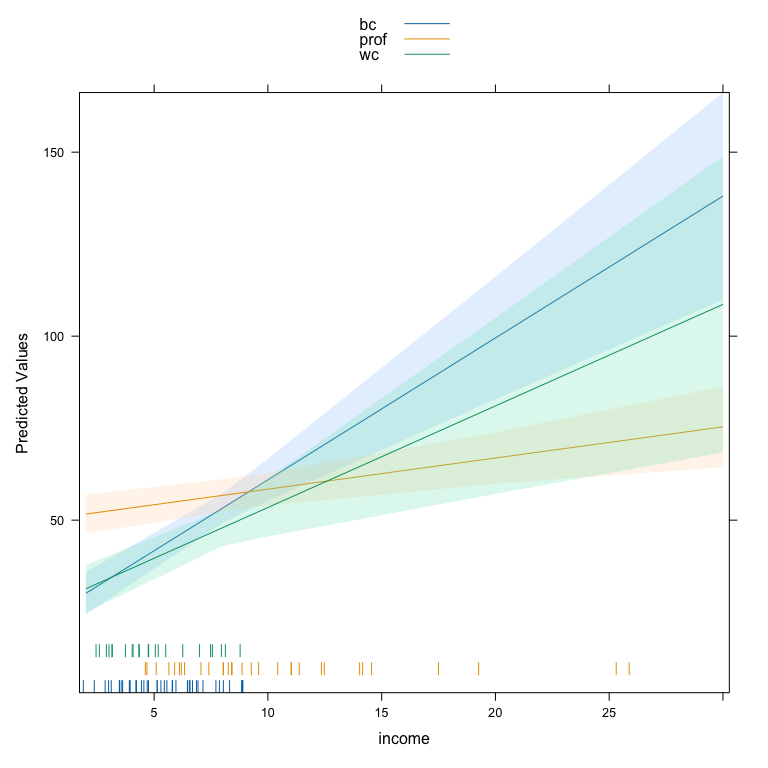

<!-- README.md is generated from README.Rmd. Please edit that file -->

# DAMisc 

The `DAMisc` package has evolved over the past decade to include many of
the functions I use when teaching applied stats to social scientists. I
think many of the functions might be useful more broadly so I thought it
would be worth discussing the functionality in a sort of thematic way
here. The functions do fall into a few different themes.

- Functions that attempt to figure out whether and what kind of
  unmodeled non-linearities exist.  
- Functions for investigating interactions in different settings (linear
  models and binomial GLMs).  
- Functions for post-model evaluation and examination of non-linear
  models (GLMs, ordinal data models and unordered data models).

I will talk about each of these below.

### Evaluating Un-modeled Non-linearities.

One of the problems I find most interesting in applied regression
analysis is evaluating the extent to which the linear, additive
functional form is sufficient to capture the systematic dependence of
the outcome on the explanatory variables. For the purposes of this
example, we will use data from the `carData` package. Here is a multiple
linear regression model where all covariates enter the model linearly
and additively.

``` r
data(Prestige, package= "carData")
lin.mod <- lm(prestige ~ income + education + women + type, data=Prestige)
summary(lin.mod)
#> 
#> Call:
#> lm(formula = prestige ~ income + education + women + type, data = Prestige)
#> 
#> Residuals:
#>      Min       1Q   Median       3Q      Max 
#> -14.7485  -4.4817   0.3119   5.2478  18.4978 
#> 
#> Coefficients:
#>               Estimate Std. Error t value Pr(>|t|)    
#> (Intercept) -0.8139032  5.3311558  -0.153 0.878994    
#> income       0.0010428  0.0002623   3.976 0.000139 ***
#> education    3.6623557  0.6458300   5.671 1.63e-07 ***
#> women        0.0064434  0.0303781   0.212 0.832494    
#> typeprof     5.9051970  3.9377001   1.500 0.137127    
#> typewc      -2.9170720  2.6653961  -1.094 0.276626    
#> ---
#> Signif. codes:  0 '***' 0.001 '**' 0.01 '*' 0.05 '.' 0.1 ' ' 1
#> 
#> Residual standard error: 7.132 on 92 degrees of freedom
#>   (4 observations deleted due to missingness)
#> Multiple R-squared:  0.8349, Adjusted R-squared:  0.826 
#> F-statistic: 93.07 on 5 and 92 DF,  p-value: < 2.2e-16
```

We might wonder whether any of the variables have non-linear trends that
are not captured by the model. We could use the `crPlots` function from
the `car` package to figure this out.

``` r
car::crPlots(lin.mod, layout=c(2,2))
```


There certainly appears to be non-linearity in the relationships between
`income` and `prestige` as well as between `women` and `prestige`. If we
wonder whether that is statistically significant, we could use the
`crTest` function from the `DAMisc` package to test the significance of
the difference between the OLS and local polynomial regressions in the
C+R plots.

``` r
library(DAMisc)
crTest(lin.mod)
#>              RSSp   RSSnp DFnum DFdenom     F     p
#> income    4678.99 4050.80 2.254  93.746 6.450 0.002
#> education 4678.99 4649.38 1.178  94.822 0.513 0.505
#> women     4678.99 4475.55 1.331  94.669 3.233 0.063
```

Here, the test suggests that the `income` and `women` relationships both
have significant non-linear relationships with `prestige`. The next
thing to figure out is what that non-linearity looks like. We could use
the `boxTidwell` function from the `car` package to estimate the
transformation parameter for `income`. There is also a `crSpanTest`
function that looks at the same test as above, but over the reasonable
range of the span parameter in the local polynomial regression.

``` r
car::boxTidwell(prestige ~ income, ~ women + type + education, data=Prestige)
#>  MLE of lambda Score Statistic (t)  Pr(>|t|)    
#>       -0.29939             -4.4858 2.117e-05 ***
#> ---
#> Signif. codes:  0 '***' 0.001 '**' 0.01 '*' 0.05 '.' 0.1 ' ' 1
#> 
#> iterations =  7
```

Here, the MLE of $\lambda$, the transformation parameter, is -0.299. We
might wonder whether that is close enough to the log transform, which is
what is used for the 0 power transform. We could figure that out by
imposing the transformation in the `boxTidwell` function.

``` r
car::boxTidwell(prestige ~ log(income), ~ women + type + education, data=Prestige)
#>  MLE of lambda Score Statistic (t) Pr(>|t|)
#>        -1.5441             -1.4096   0.1621
#> 
#> iterations =  4
```

Since the proposed additional transformation parameter is not
significant, we can be confident that the log transform is sufficient.
The `women` variable likely needs a polynomial since the non-linearity
is not simple and monotone. We could use a second degree polynomial, but
the `NKnots` and `NKnotsTest` functions can help figure this out. Let us
look at the `NKnots` function first.

``` r
NKnots(prestige ~ log(income) + type + education, var="women", 
       data=Prestige, degree=3, includePoly = TRUE, plot=TRUE)
```


The `NKnots` function calculates the AIC for the first up to `degree`
polynomials and the b-splines with 1:(DF - `degree`) internal knots. The
AIC is plotted, and in this case it is clear that the second-order
polynomial generates the smallest AIC value. To see whether these
differences are significant, we can use the `NKnotsTest` function.

``` r
options(width=100)
NKnotsTest(prestige ~ log(income) + type + education, var="women", 
       data=Prestige, degree=3, target=2)
#>                F      DF1 DF2 p(F)  Clarke Pr(Better) p(Clarke) Delta_AIC Delta_AICc Delta_BIC
#> DF=2 vs. DF=1  4.348* 1   91  0.040 41     0.418      0.129     2.574     2.201      -0.011   
#>    Target                                                                                     
#> DF=2 vs. DF=3  0.208  1   90  0.650 77*    0.786      0.000 (T) 1.774     2.202      4.359    
#> DF=2 vs. DF=4  0.200  2   89  0.819 79*    0.806      0.000 (T) 3.561     4.472      8.731    
#> DF=2 vs. DF=5  0.371  3   88  0.774 82*    0.837      0.000 (T) 4.769     6.221      12.524   
#> DF=2 vs. DF=6  0.266  4   87  0.899 88*    0.898      0.000 (T) 6.807     8.860      17.147   
#> DF=2 vs. DF=7  0.337  5   86  0.889 83*    0.847      0.000 (T) 8.096     10.812     21.021   
#> DF=2 vs. DF=8  0.755  6   85  0.607 76*    0.776      0.000 (T) 6.912     10.354     22.422   
#> DF=2 vs. DF=9  1.037  7   84  0.411 80*    0.816      0.000 (T) 5.874     10.109     23.968   
#> DF=2 vs. DF=10 0.808  8   83  0.597 85*    0.867      0.000 (T) 8.649     13.747     29.329   
#> DF=2 vs. DF=11 0.898  9   82  0.531 79*    0.806      0.000 (T) 8.791     14.823     32.055   
#> DF=2 vs. DF=12 0.800  10  81  0.629 83*    0.847      0.000 (T) 10.774    17.814     36.624   
#> DF=2 vs. DF=13 0.656  11  80  0.775 85*    0.867      0.000 (T) 13.531    21.657     41.966
```

In the `NKnotsTest` function, you have to specify a `target` which is
the degrees of freedom of the proposed model. In this case, we pick `2`.
All smaller and bigger models up to the specified degrees of freedom are
tested. If using the $F$-test, the idea is that all smaller models
should be significantly worse (i.e., have small p-values) and all bigger
models should not be significantly better (i.e., have big p-values). We
can see that this is true, looking at the `p(F)` column. You could also
use the Clarke test, which is implemented with the `clarke_test`
function from the
[`clarkeTest`](https://github.com/davidaarmstrong/ClarkeTest) package,
which I also built and maintain, or AIC, AIC with a small-sample
correction or BIC. The logic of using these other measures is basically
the same.

Now that we are confident about the correct (additive) functional form
of the variables, we could go on and interpret them as we usually would
(or make an effect plot).

### Evaluating Interactions

Lots has been written recently in Political Science regarding
interactions, in both linear and non-linear (generally binomial GLM)
models. First, we will tackle linear model interactions.

#### Linear Model Interactions

We can add an interaction to the model. Here, we can use the same data
as above, though we will use the linear, conditional specification.
There are two main functions that work in linear models - one for
evaluating interactions between quantitative and qualitiative variables
and one for evaluating interactions between two quantitative variables.
Let us look at the quantitative-qualitative interaction first.

``` r
Prestige$income <- Prestige$income/1000
int.mod1 <- lm(prestige ~ education + income*type + women, data=Prestige)
summary(int.mod1)
#> 
#> Call:
#> lm(formula = prestige ~ education + income * type + women, data = Prestige)
#> 
#> Residuals:
#>     Min      1Q  Median      3Q     Max 
#> -12.632  -4.518   1.057   3.850  18.171 
#> 
#> Coefficients:
#>                  Estimate Std. Error t value Pr(>|t|)    
#> (Intercept)     -10.07694    5.01000  -2.011   0.0473 *  
#> education         2.80361    0.59233   4.733 8.18e-06 ***
#> income            3.85495    0.58655   6.572 3.15e-09 ***
#> typeprof         27.54962    5.40962   5.093 1.93e-06 ***
#> typewc            3.43457    5.36630   0.640   0.5238    
#> women             0.07648    0.03117   2.453   0.0161 *  
#> income:typeprof  -3.00851    0.57540  -5.229 1.10e-06 ***
#> income:typewc    -1.09486    0.86374  -1.268   0.2082    
#> ---
#> Signif. codes:  0 '***' 0.001 '**' 0.01 '*' 0.05 '.' 0.1 ' ' 1
#> 
#> Residual standard error: 6.284 on 90 degrees of freedom
#>   (4 observations deleted due to missingness)
#> Multiple R-squared:  0.8746, Adjusted R-squared:  0.8649 
#> F-statistic:  89.7 on 7 and 90 DF,  p-value: < 2.2e-16
```

We can make sure that the interaction is significant with the `Anova`
function from the `car` package:

``` r
car::Anova(int.mod1)
#> Anova Table (Type II tests)
#> 
#> Response: prestige
#>             Sum Sq Df F value    Pr(>F)    
#> education    884.6  1 22.4026 8.176e-06 ***
#> income       803.9  1 20.3606 1.932e-05 ***
#> type         583.1  2  7.3837  0.001073 ** 
#> women        237.7  1  6.0197  0.016074 *  
#> income:type 1125.4  2 14.2514 4.199e-06 ***
#> Residuals   3553.6 90                      
#> ---
#> Signif. codes:  0 '***' 0.001 '**' 0.01 '*' 0.05 '.' 0.1 ' ' 1
```

We see that the interaction is significant. We can use the
`intQualQuant` function from the `DAMisc` package to figure out what the
interaction implies. First, let us calculate the simple slopes:

``` r
intQualQuant(int.mod1, c("income", "type"), type="slopes", plot=FALSE)
#> Conditional Effect of  income  given  type 
#>         eff     se  tstat pvalue
#> bc   3.8550 0.5865 6.5723  0.000
#> prof 0.8464 0.2340 3.6170  0.000
#> wc   2.7601 0.8255 3.3436  0.001
```

Here, we see that the slope of income (in thousands of dollars) on
prestige is 3.86 for blue collar occupations, 2.76 for white collar
occupations and only 0.85 for professional occupations. We could also
make a plot of the three different lines holding constant all other
variables.

``` r
intQualQuant(int.mod1, c("income", "type"), type="slopes", plot=TRUE)
```



One of the benefits of this function is that it plots a rug for the
quantitative variable at each level of the qualitative variable. This
indicates, particularly in this case, that the density of income depends
very much on occupation type. The other side of the interaction is also
important. We can plot that side of the interaction by specifying
`type= "facs"`.

``` r
lattice::trellis.par.set(strip.background=list(col="gray75"))
out <- intQualQuant(int.mod1, c("income", "type"), type="facs", plot=TRUE)
update(out, layout=c(3,1))
```


This shows the effect of moving from every level to every other level in
the qualitative variable for all values of the quantitative variable.
Here, the rug plots at the bottom help identify ranges of the
quantitative variable where inference is safe.

Next, we can look at interactions between two quantitative variables.

``` r
int.mod2 <- lm(prestige ~ income*education + type + women, data=Prestige)
summary(int.mod2)
#> 
#> Call:
#> lm(formula = prestige ~ income * education + type + women, data = Prestige)
#> 
#> Residuals:
#>      Min       1Q   Median       3Q      Max 
#> -15.2186  -5.0131   0.6606   4.8713  16.9888 
#> 
#> Coefficients:
#>                   Estimate Std. Error t value Pr(>|t|)    
#> (Intercept)      -21.53038    8.09938  -2.658  0.00928 ** 
#> income             4.37994    1.04769   4.181 6.68e-05 ***
#> education          5.25108    0.78217   6.713 1.59e-09 ***
#> typeprof           4.57575    3.76607   1.215  0.22751    
#> typewc            -4.81161    2.59942  -1.851  0.06741 .  
#> women              0.03947    0.03059   1.290  0.20019    
#> income:education  -0.24147    0.07363  -3.280  0.00147 ** 
#> ---
#> Signif. codes:  0 '***' 0.001 '**' 0.01 '*' 0.05 '.' 0.1 ' ' 1
#> 
#> Residual standard error: 6.781 on 91 degrees of freedom
#>   (4 observations deleted due to missingness)
#> Multiple R-squared:  0.8524, Adjusted R-squared:  0.8427 
#> F-statistic: 87.58 on 6 and 91 DF,  p-value: < 2.2e-16
```

There are a couple of different things we can do here. The most recent
advice comes from Berry, Golder and Milton 2012 in the Journal of
Politics. First, suggested making conditional effects plots. The
`DAintfun2` function in the `DAMisc` package does this for you.

``` r
DAintfun2(int.mod2, c("income", "education"), hist=TRUE, 
          scale.hist=.3)
```


Here, the conditional effect of one variable is plotted on the $y$-axis
and the conditioning variable is plotted on the $x$-axis. The histogram
gives the density of the conditioning variable. The `scale.hist`
argument determines vertically how much of the plotting region the
histogram occupies. The axis numbers on the right-hand side belong to
the histogram and the ones on the left belong to the conditional effect.
There are two other visualizations that might be useful in other
circumstances. The first, produced with `DAintfun3` provides the
conditional effect of one variable at the mean and the mean$\pm$SD of
the other variable. Here is what that looks like in this case.

``` r
DAintfun3(int.mod2, c("income", "education"))
```


The third method, with `DAintfun` produces a single 3-D surface plot
where the areas of higher bivariate density are shaded in lighter
colors.

``` r
DAintfun(int.mod2,c("income", "education"), theta=-45, ticktype="detail", phi=15)
```


Finally, there are two more functions that can be used here. The
`changeSig` function calculates where conditional effects change from
significant to insignificant. Here is an example using the model above.

``` r
changeSig(int.mod2, c("income", "education"))
#> LB for B(income | education) = 0 when education=15.7712 (97th pctile)
#> UB for B(income | education) = 0 when education=25.5111 (> Maximum Value in Data)
#> LB for B(education | income) = 0 when income=14.6971 (96th pctile)
#> UB for B(education | income) = 0 when income=46.3725 (> Maximum Value in Data)
```

This function shows when the lower and upper confidence bounds cross
zero and what percentile of the conditioning variable distribution that
is.

Finally, following Berry, Golder and Milton (2012), the function
`BGMtest` tests all of the hypotheses they specify.

``` r
BGMtest(int.mod2, vars=c("income", "education"))
#>              est    se      t p-value
#> P(X|Zmin)  2.839 0.602  4.717 0.000  
#> P(X|Zmax)  0.524 0.295  1.773 0.080  
#> P(Z|Xmin)  4.851 0.713  6.803 0.000  
#> P(Z|Xmax) -0.998 1.548 -0.645 0.521  
#> P(XZ)     -0.241 0.074 -3.280 0.001
```

#### Non-linear Model Interactions

The work on interactions has a long history. Until quite recently, the
work by Ai, Norton and Wang was the most prominent in this area. In
recent years, political scientists - Bill Berry, Jacqueline DeMeritt,
Justin Esarey and Carlisle Rainey have all made contributions here.

There are two related questions:

1.  Is a product term necessary for an interaction to exist?
2.  How to test for an interaction?

The answer to the first problem is compelling. He argues that unless
there is strong theory to suggest that the product term is not
necessary, then it should be included. The counterintuitive part of the
argument is that rather than the product term enhancing our ability to
find an interaction, the product term actually can mitigate the effect
of compression reducing the strength of the interaction if the data is
consistent with a more additive process.

The `DAMisc` package has two functions that can help. The `intEff`
function is a more or less direct port of the code that Norton, Wang and
Ai proposed in their article in the Stata Journal. I prefer the
`secondDiff` function that directly calculates second differences and
uses a parametric bootstrap to find confidence intervals for the
calculated quantities. We will demonstrate with the `conflictData` from
the `clarkeTest` package.

``` r
data(conflictData, package="clarkeTest")
conflictData$rgdpna_pc <- conflictData$rgdpna_pc/1000
bin.mod1 <- glm(conflict_binary ~ log(pop) + rgdpna_pc +  
                 polity2, data=conflictData, 
               family=binomial)

bin.mod2 <- glm(conflict_binary ~ log(pop) + rgdpna_pc *
                 polity2, data=conflictData, 
               family=binomial)
```

In the models above, `bin.mod1` has the terms linearly and additively
entered in the model. `bin.mod2` includes a product term between
`rgdpna_pc` and `polity2`. We could test to see whether the second model
fits better than the first.

``` r
anova(bin.mod1, bin.mod2, test="Chisq")
#> Analysis of Deviance Table
#> 
#> Model 1: conflict_binary ~ log(pop) + rgdpna_pc + polity2
#> Model 2: conflict_binary ~ log(pop) + rgdpna_pc * polity2
#>   Resid. Df Resid. Dev Df Deviance Pr(>Chi)
#> 1      4377     3969.2                     
#> 2      4376     3968.5  1  0.68458    0.408
```

The $\chi^2$ in the analysis of deviance test would suggest that both
models fit pretty much the same. Thus, there may not be a reason to
prefer the product term model. Now, however, we could use the
`secondDiff` function to figure out whether there is a significant
conditional effect (independent of whether the product term is in the
model). The `secondDiff` function, by default, uses the average marginal
effect approach to calculating the difference. Here it is for the model
without the product term.

``` r
sd1 <- secondDiff(bin.mod1, c("rgdpna_pc", "polity2"), conflictData)
summary(sd1)
#> Second Difference Using the Average Marginal Effect Approach
#> 
#> Overall: 
#> Average Second Difference: 0.049, 95% CI: (0.001,0.096)
#> 
#> Individual:
#> Significant Negative Individual Second Differences: 0 
#> Significant Positive Individual Second Differences: 4381 
#> Inignificant Individual Second Differences: 0
```

Here all of the second differences are positive. The average second
difference is 0.049, meaning that the difference in probability of
conflict is .05 bigger for a change in GDP when democracy is high than
when democracy is low. We could plot out all of the individual
confidence intervals as well.

``` r
print(plot(sd1))
```


Now we could do the same thing for the model with the product term

``` r
sd2 <- secondDiff(bin.mod2, c("rgdpna_pc", "polity2"), conflictData)
summary(sd2)
#> Second Difference Using the Average Marginal Effect Approach
#> 
#> Overall: 
#> Average Second Difference: 0.066, 95% CI: (0.003,0.129)
#> 
#> Individual:
#> Significant Negative Individual Second Differences: 0 
#> Significant Positive Individual Second Differences: 4381 
#> Inignificant Individual Second Differences: 0
```

Note here, that some of the individual second differences are
insignificant, but overall, the picture looks pretty similar - the
average second differences is 0.065 (slightly bigger than before) and
significantly different from zero. In this case, including the product
term does not actually change what we think about the interaction much
at all.

``` r
print(plot(sd2))
```


### Non-linear Model Post-Estimation Tools

Probably the largest group of functions in the `DAMisc` package are for
post-estimation evaluation of non-linear models - particularly binomial
(and to a lesser degree, poisson) GLMs and models for ordered and
unordered categorical dependent variables. We will talk about each kind
in turn.

#### Binomial GLMs

Using the model discussed above, we can test out the tools for binomial
GLMs. Just to remind, we will use the following:

``` r
data(conflictData, package="clarkeTest")
conflictData$rgdpna_pc <- conflictData$rgdpna_pc/1000
bin.mod1 <- glm(conflict_binary ~ log(pop) + rgdpna_pc +  
                 polity2, data=conflictData, 
               family=binomial)
```

One of the first things we can do is to figure out how well the model
fits. We can do this with the `binfit` function:

``` r
binfit(bin.mod1)
#>                    Names1     vals1                       Names2     vals2
#> 1 Log-Lik Intercept Only: -2322.451          Log-Lik Full Model: -1984.578
#> 2                D(4377):  3969.157                       LR(3):   675.745
#> 3                                                     Prob > LR:     0.000
#> 4          McFadden's R2:     0.145           McFadden's Adk R2:     0.144
#> 5      ML (Cox-Snell) R2:     0.143 Cragg-Uhler (Nagelkerke) R2:     0.219
#> 6  McKelvey & Zavoina R2:     0.390                  Efron's R2:     0.145
#> 7               Count R2:     0.783                Adj Count R2:     0.026
#> 8                    BIC:  4002.697                         AIC:  3977.157
```

This function produces a bunch of scalar measures of fit for binary
models. If you are unfamiliar with some of these, see Long (1997) or
Long and Freese (2005) for a discussion. You can also use the `pre`
function to find the proportional reduction in error and the expected
proportional reduction in error (Herron, 1999).

``` r
pre(bin.mod1)
#> mod1:  conflict_binary ~ log(pop) + rgdpna_pc + polity2 
#> mod2:  conflict_binary ~ 1 
#> 
#> Analytical Results
#>  PMC =  0.777 
#>  PCP =  0.783 
#>  PRE =  0.026 
#> ePMC =  0.654 
#> ePCP =  0.705 
#> ePRE =  0.148
```

By default, the `pre` function tests the current model relative to the
null model. However, you can also use it to evaluate two differently
specified models against each other. The `sim` argument allows you to
produce parametric bootstrap confidence intervals for the PRE and ePRE.

``` r
pre(bin.mod1, sim=TRUE, R=1500)
#> mod1:  conflict_binary ~ log(pop) + rgdpna_pc + polity2 
#> mod2:  conflict_binary ~ 1 
#> 
#> Analytical Results
#>  PMC =  0.777 
#>  PCP =  0.783 
#>  PRE =  0.026 
#> ePMC =  0.654 
#> ePCP =  0.705 
#> ePRE =  0.148 
#> 
#> Simulated Results
#>      median lower upper
#>  PRE 0.027  0.010 0.056
#> ePRE 0.147  0.124 0.169
```

The `probci` function also calculates the difference in predicted
probabilities for any combination of values. For example, here iss what
it looks like for `rgdpna_pc` and `polity2`:

``` r
probci(bin.mod1, conflictData, changeX=c("rgdpna_pc", "polity2"), 
       numQuantVals=2)
#>   rgdpna_pc polity2    50%   2.5%  97.5%
#> 1    0.1616     -10 0.3488 0.3217 0.3785
#> 2  155.9892     -10 0.0000 0.0000 0.0002
#> 3    0.1616      10 0.3006 0.2680 0.3349
#> 4  155.9892      10 0.0000 0.0000 0.0001
```

Here, we are choosing 2 values of both variables. The first two columns
show the values of the two variables we change from and the second two
columns show the values we are changing to. The `pred_prob` column gives
the difference in probabilities moving from the first set of values to
the second. The `lower` and `upper` are the confidence bounds for the
difference in probabilities.

Just like finding predicted probabilities, it is also easy to plot the
predicted probabilities using the `effects` package or the `DAMisc`
package. The `effects` packages uses the marginal effects at reasonable
values approach.

``` r
library(effects)
plot(effect("rgdpna_pc", bin.mod1, xlevels=list(rgdpna_pc = 100)), 
     type="response")
```


The `aveEffPlot` function in the `DAMisc` package uses the average
marginal effects approach to make the same graph.

``` r
aveEffPlot(bin.mod1, "rgdpna_pc", conflictData, 
           nvals=50)
#> $ci
#>              s         mean        lower        upper
#> 1    0.1615948 3.212066e-01 3.005572e-01 0.3428633202
#> 2    3.3417500 2.842782e-01 2.686333e-01 0.3007753172
#> 3    6.5219053 2.498685e-01 2.371614e-01 0.2631013319
#> 4    9.7020606 2.181897e-01 2.058522e-01 0.2307292493
#> 5   12.8822159 1.893556e-01 1.764047e-01 0.2027563638
#> 6   16.0623711 1.633891e-01 1.489643e-01 0.1777807689
#> 7   19.2425264 1.402352e-01 1.249127e-01 0.1562206312
#> 8   22.4226817 1.197760e-01 1.038601e-01 0.1366886005
#> 9   25.6028370 1.018469e-01 8.582100e-02 0.1193874178
#> 10  28.7829922 8.625273e-02 7.048883e-02 0.1039250381
#> 11  31.9631475 7.278091e-02 5.754768e-02 0.0904645742
#> 12  35.1433028 6.121330e-02 4.684359e-02 0.0784454074
#> 13  38.3234580 5.133492e-02 3.797254e-02 0.0678054814
#> 14  41.5036133 4.294025e-02 3.066610e-02 0.0584773801
#> 15  44.6837686 3.583750e-02 2.476359e-02 0.0503056662
#> 16  47.8639239 2.985107e-02 1.987765e-02 0.0432027964
#> 17  51.0440791 2.482273e-02 1.589975e-02 0.0370801378
#> 18  54.2242344 2.061176e-02 1.271789e-02 0.0317561848
#> 19  57.4043897 1.709447e-02 1.019291e-02 0.0271537770
#> 20  60.5845449 1.416316e-02 8.114992e-03 0.0231808913
#> 21  63.7647002 1.172486e-02 6.452482e-03 0.0197231022
#> 22  66.9448555 9.699934e-03 5.134513e-03 0.0167745035
#> 23  70.1250108 8.020554e-03 4.081368e-03 0.0142331002
#> 24  73.3051660 6.629302e-03 3.242437e-03 0.0120682179
#> 25  76.4853213 5.477785e-03 2.577812e-03 0.0102532106
#> 26  79.6654766 4.525381e-03 2.048842e-03 0.0087084938
#> 27  82.8456319 3.738108e-03 1.628012e-03 0.0073928345
#> 28  86.0257871 3.087617e-03 1.291062e-03 0.0062729645
#> 29  89.2059424 2.550316e-03 1.022369e-03 0.0053205547
#> 30  92.3860977 2.106607e-03 8.103873e-04 0.0045111584
#> 31  95.5662529 1.740240e-03 6.429586e-04 0.0038229168
#> 32  98.7464082 1.437755e-03 5.100755e-04 0.0032373824
#> 33 101.9265635 1.188018e-03 4.046272e-04 0.0027409045
#> 34 105.1067188 9.818224e-04 3.209361e-04 0.0023201128
#> 35 108.2868740 8.115647e-04 2.545418e-04 0.0019635957
#> 36 111.4670293 6.709658e-04 2.018759e-04 0.0016629351
#> 37 114.6471846 5.548433e-04 1.601023e-04 0.0014078241
#> 38 117.8273399 4.589208e-04 1.269700e-04 0.0011911264
#> 39 121.0074951 3.796701e-04 1.007129e-04 0.0010071112
#> 40 124.1876504 3.141808e-04 7.980956e-05 0.0008520249
#> 41 127.3678057 2.600518e-04 6.324403e-05 0.0007213356
#> 42 130.5479609 2.153026e-04 5.013061e-05 0.0006106617
#> 43 133.7281162 1.782993e-04 3.974794e-05 0.0005169465
#> 44 136.9082715 1.476939e-04 3.151318e-05 0.0004377039
#> 45 140.0884268 1.223739e-04 2.498689e-05 0.0003709224
#> 46 143.2685820 1.014213e-04 1.982541e-05 0.0003143874
#> 47 146.4487373 8.407852e-05 1.572690e-05 0.0002665621
#> 48 149.6288926 6.971983e-05 1.246718e-05 0.0002258209
#> 49 152.8090479 5.782872e-05 9.883085e-06 0.0001911349
#> 50 155.9892031 4.797854e-05 7.834592e-06 0.0001616485
#> 
#> $plot
```


    #> 
    #> $sim
    #>              [,1]      [,2]      [,3]      [,4]      [,5]      [,6]      [,7]       [,8]       [,9]
    #>    [1,] 0.3255252 0.2834640 0.2446400 0.2093446 0.1777133 0.1497417 0.1253088 0.10420531 0.08616171
    #>    [2,] 0.3215220 0.2845531 0.2501006 0.2183711 0.1894756 0.1634376 0.1402045 0.11966231 0.10165118
    #>    [3,] 0.3135103 0.2810439 0.2505754 0.2222478 0.1961444 0.1722934 0.1506732 0.13122083 0.11383956
    #>    [4,] 0.3331311 0.2999042 0.2685216 0.2391566 0.2119252 0.1868881 0.1640548 0.14339000 0.12482122
    #>    [5,] 0.3025493 0.2670330 0.2341246 0.2039791 0.1766606 0.1521523 0.1303700 0.11117639 0.09439688
    #>    [6,] 0.3263577 0.2896473 0.2553304 0.2236202 0.1946405 0.1684307 0.1449564 0.12412172 0.10578377
    #>    [7,] 0.2998878 0.2717485 0.2452144 0.2203741 0.1972802 0.1759517 0.1563769 0.13851762 0.12231404
    #>    [8,] 0.2960105 0.2679237 0.2414702 0.2167356 0.1937690 0.1725858 0.1531704 0.13548122 0.11945465
    #>    [9,] 0.3158543 0.2804578 0.2474181 0.2169162 0.1890516 0.1638478 0.1412622 0.12119707 0.10351296
    #>   [10,] 0.3170373 0.2809601 0.2473296 0.2163348 0.1880766 0.1625749 0.1397793 0.11958200 0.10183219
    #>   [11,] 0.3194193 0.2837963 0.2505193 0.2197763 0.1916728 0.1662369 0.1434293 0.12315466 0.10527515
    #>   [12,] 0.3338568 0.2925031 0.2541240 0.2190161 0.1873353 0.1591090 0.1342551 0.11260603 0.09393314
    #>   [13,] 0.3291006 0.2914148 0.2562180 0.2237416 0.1941188 0.1673915 0.1435207 0.12240145 0.10387830
    #>   [14,] 0.3380621 0.3003879 0.2650762 0.2323701 0.2024184 0.1752807 0.1509373 0.12930269 0.11023973
    #>   [15,] 0.3215121 0.2841438 0.2493551 0.2173581 0.1882644 0.1620944 0.1387890 0.11822606 0.10023631
    #>   [16,] 0.3308586 0.2909455 0.2538185 0.2197471 0.1888790 0.1612487 0.1367931 0.11537047 0.09678157
    #>   [17,] 0.3283473 0.2884832 0.2514516 0.2175142 0.1868088 0.1593598 0.1350945 0.11386329 0.09546065
    #>   [18,] 0.3174021 0.2819425 0.2488548 0.2183182 0.1904287 0.1652053 0.1426011 0.12251525 0.10480619
    #>   [19,] 0.3205604 0.2832861 0.2485937 0.2166918 0.1876896 0.1616049 0.1383774 0.11788398 0.09995521
    #>   [20,] 0.2934785 0.2615139 0.2317504 0.2042976 0.1792022 0.1564548 0.1359977 0.11773479 0.10154096
    #>   [21,] 0.3204327 0.2825468 0.2473229 0.2149798 0.1856310 0.1592936 0.1359019 0.11532410 0.09737943
    #>   [22,] 0.3087354 0.2787647 0.2505122 0.2240931 0.1995794 0.1770018 0.1563537 0.13759547 0.12066018
    #>   [23,] 0.3423522 0.2986406 0.2580990 0.2210890 0.1878054 0.1582892 0.1324506 0.11009740 0.09096600
    #>   [24,] 0.3199382 0.2865778 0.2552583 0.2261385 0.1993128 0.1748159 0.1526290 0.13268818 0.11489385
    #>   [25,] 0.3192105 0.2829598 0.2491405 0.2179485 0.1894920 0.1637970 0.1408182 0.12045160 0.10254861
    #>   [26,] 0.3097185 0.2778010 0.2478541 0.2200101 0.1943451 0.1708826 0.1495994 0.13043286 0.11328898
    #>   [27,] 0.2917181 0.2625645 0.2352273 0.2097954 0.1863145 0.1647904 0.1451936 0.12746504 0.11152200
    #>   [28,] 0.3132327 0.2805559 0.2499029 0.2214190 0.1951888 0.1712402 0.1495507 0.13005523 0.11265453
    #>   [29,] 0.3180171 0.2833849 0.2509891 0.2210011 0.1935174 0.1685646 0.1461087 0.12606502 0.10830986
    #>   [30,] 0.3112852 0.2759420 0.2430259 0.2127080 0.1850758 0.1601400 0.1378450 0.11808186 0.10070114
    #>   [31,] 0.3104703 0.2776916 0.2469830 0.2184872 0.1922855 0.1684011 0.1468060 0.12742929 0.11016595
    #>   [32,] 0.3251903 0.2856040 0.2488633 0.2152208 0.1848066 0.1576381 0.1336370 0.11264919 0.09446627
    #>   [33,] 0.3335232 0.2945747 0.2582340 0.2247570 0.1942897 0.1668763 0.1424721 0.12096013 0.10216926
    #>   [34,] 0.3354597 0.2927539 0.2531953 0.2171100 0.1846668 0.1558904 0.1306835 0.10885435 0.09014544
    #>   [35,] 0.3172454 0.2837648 0.2523594 0.2231895 0.1963504 0.1718758 0.1497449 0.12989024 0.11220754
    #>   [36,] 0.3185839 0.2859710 0.2553155 0.2267666 0.2004150 0.1762959 0.1543948 0.13465522 0.11698670
    #>   [37,] 0.3194354 0.2858169 0.2542747 0.2249705 0.1980005 0.1733988 0.1511448 0.13117138 0.11337473
    #>   [38,] 0.3031322 0.2733601 0.2453552 0.2192237 0.1950279 0.1727883 0.1524885 0.13408020 0.11748894
    #>   [39,] 0.3123446 0.2763788 0.2429306 0.2121788 0.1842116 0.1590348 0.1365838 0.11673817 0.09933573
    #>   [40,] 0.3161249 0.2777810 0.2422468 0.2097383 0.1803586 0.1541082 0.1309013 0.11058390 0.09295395
    #>   [41,] 0.3498213 0.3070597 0.2671710 0.2305151 0.1973060 0.1676195 0.1414100 0.11853380 0.09877455
    #>   [42,] 0.3292438 0.2882526 0.2502529 0.2155270 0.1842194 0.1563488 0.1318270 0.11048253 0.09208479
    #>   [43,] 0.3502848 0.3108412 0.2738242 0.2395262 0.2081310 0.1797196 0.1542812 0.13172890 0.11191616
    #>   [44,] 0.3276046 0.2901946 0.2552445 0.2229805 0.1935343 0.1669486 0.1431878 0.12215089 0.10368657
    #>   [45,] 0.3147187 0.2783761 0.2445346 0.2133870 0.1850361 0.1595008 0.1367267 0.11659974 0.09896079
    #>   [46,] 0.3161770 0.2814181 0.2489209 0.2188579 0.1913259 0.1663519 0.1439008 0.12388605 0.10618127
    #>   [47,] 0.3278752 0.2874273 0.2499071 0.2155850 0.1846004 0.1569727 0.1326194 0.11137799 0.09302850
    #>   [48,] 0.3142952 0.2781928 0.2445944 0.2136831 0.1855516 0.1602101 0.1375982 0.11759896 0.10005312
    #>   [49,] 0.3111613 0.2771098 0.2452887 0.2158576 0.1889044 0.1644505 0.1424580 0.12284053 0.10547339
    #>   [50,] 0.3363544 0.2964836 0.2593122 0.2251174 0.1940566 0.1661764 0.1414265 0.11967876 0.10074704
    #>   [51,] 0.3233989 0.2854071 0.2500466 0.2175423 0.1880143 0.1614864 0.1378989 0.11712550 0.09899033
    #>   [52,] 0.3201037 0.2850454 0.2522492 0.2218957 0.1940879 0.1688562 0.1461677 0.12593644 0.10803575
    #>   [53,] 0.3407883 0.2972842 0.2569641 0.2201782 0.1871103 0.1577924 0.1321285 0.10992377 0.09091428
    #>   [54,] 0.3212740 0.2856508 0.2523404 0.2215339 0.1933410 0.1677953 0.1448631 0.12445502 0.10643821
    #>   [55,] 0.3143967 0.2756931 0.2398913 0.2072065 0.1777354 0.1514685 0.1283077 0.10808642 0.09059022
    #>   [56,] 0.3199596 0.2883207 0.2584983 0.2306323 0.2048113 0.1810747 0.1594181 0.13979823 0.12214075
    #>   [57,] 0.3191731 0.2842508 0.2515724 0.2213179 0.1935911 0.1684245 0.1457876 0.12559715 0.10772852
    #>   [58,] 0.3116142 0.2768452 0.2444066 0.2144651 0.1871096 0.1623568 0.1401612 0.12042539 0.10301257
    #>   [59,] 0.3236058 0.2858229 0.2506314 0.2182541 0.1888119 0.1623316 0.1387586 0.11797227 0.09980260
    #>   [60,] 0.3230904 0.2912203 0.2611542 0.2330386 0.2069678 0.1829869 0.1610957 0.14125501 0.12339274
    #>   [61,] 0.3071520 0.2748592 0.2446228 0.2165755 0.1907899 0.1672829 0.1460228 0.12693670 0.10991994
    #>   [62,] 0.3122046 0.2826032 0.2546562 0.2284761 0.2041336 0.1816608 0.1610538 0.14227792 0.12527234
    #>   [63,] 0.3255044 0.2876033 0.2523021 0.2198270 0.1902999 0.1637466 0.1401105 0.11926823 0.10104741
    #>   [64,] 0.3173745 0.2824487 0.2498068 0.2196231 0.1919942 0.1669451 0.1444377 0.12438214 0.10664869
    #>   [65,] 0.3054366 0.2752218 0.2468114 0.2203162 0.1958004 0.1732852 0.1527527 0.13415223 0.11740614
    #>   [66,] 0.3081009 0.2750640 0.2441727 0.2155688 0.1893282 0.1654668 0.1439472 0.12468844 0.10757556
    #>   [67,] 0.3268401 0.2908779 0.2572186 0.2260632 0.1975287 0.1716536 0.1484075 0.12770279 0.10940795
    #>   [68,] 0.3275117 0.2911342 0.2570940 0.2255994 0.1967722 0.1706536 0.1472135 0.12636299 0.10796718
    #>   [69,] 0.3238764 0.2862757 0.2512405 0.2189899 0.1896430 0.1632268 0.1396884 0.11891046 0.10072723
    #>   [70,] 0.3439178 0.3039964 0.2666472 0.2321612 0.2007150 0.1723772 0.1471208 0.12483991 0.10536844
    #>   [71,] 0.3302234 0.2898227 0.2522810 0.2178762 0.1867592 0.1589630 0.1344186 0.11297539 0.09442290
    #>   [72,] 0.3378973 0.2980913 0.2609303 0.2266959 0.1955535 0.1675597 0.1426747 0.12078005 0.10169767
    #>   [73,] 0.3209572 0.2866877 0.2545584 0.2247409 0.1973367 0.1723813 0.1498517 0.12967600 0.11174320
    #>   [74,] 0.3337960 0.2959074 0.2604713 0.2277279 0.1978193 0.1707954 0.1466251 0.12521012 0.10640067
    #>   [75,] 0.3135463 0.2777522 0.2444205 0.2137312 0.1857771 0.1605708 0.1380557 0.11811958 0.10060840
    #>   [76,] 0.3233708 0.2854944 0.2502375 0.2178234 0.1883710 0.1619038 0.1383623 0.11762091 0.09950482
    #>   [77,] 0.3112371 0.2796728 0.2500229 0.2224161 0.1969278 0.1735828 0.1523617 0.13320705 0.11603133
    #>   [78,] 0.3257900 0.2886224 0.2539054 0.2218602 0.1926149 0.1662103 0.1426095 0.12171155 0.10336579
    #>   [79,] 0.3224549 0.2874133 0.2545816 0.2241453 0.1962149 0.1708300 0.1479669 0.12754883 0.10945696
    #>   [80,] 0.3292670 0.2887023 0.2510441 0.2165695 0.1854254 0.1576391 0.1331346 0.11175415 0.09328074
    #>   [81,] 0.3214482 0.2853355 0.2516083 0.2204625 0.1920078 0.1662740 0.1432209 0.12275067 0.10472144
    #>   [82,] 0.3169405 0.2840724 0.2532186 0.2245288 0.1980911 0.1739362 0.1520440 0.13235146 0.11476098
    #>   [83,] 0.3164632 0.2778576 0.2421102 0.2094386 0.1799435 0.1536204 0.1303768 0.11005207 0.09243744
    #>   [84,] 0.3196162 0.2811462 0.2454372 0.2127146 0.1830924 0.1565823 0.1331087 0.11252717 0.09464280
    #>   [85,] 0.3124146 0.2763297 0.2427744 0.2119277 0.1838773 0.1586289 0.1361181 0.11622428 0.09878550
    #>   [86,] 0.3183854 0.2844180 0.2525820 0.2230431 0.1958986 0.1711811 0.1488660 0.12888064 0.11111417
    #>   [87,] 0.3247098 0.2877329 0.2532181 0.2213766 0.1923265 0.1661000 0.1426540 0.12188424 0.10363984
    #>   [88,] 0.3288800 0.2854430 0.2454187 0.2091273 0.1767139 0.1481674 0.1233481 0.10202050 0.08388593
    #>   [89,] 0.2982981 0.2704750 0.2442175 0.2196131 0.1967152 0.1755449 0.1560942 0.13832911 0.12219386
    #>   [90,] 0.3295215 0.2894733 0.2522661 0.2181670 0.1873175 0.1597440 0.1353742 0.11405776 0.09558764
    #>   [91,] 0.3162168 0.2790617 0.2445426 0.2128584 0.1841075 0.1582966 0.1353549 0.11515013 0.09750499
    #>   [92,] 0.3067017 0.2705545 0.2370368 0.2063194 0.1784784 0.1535049 0.1313187 0.11178306 0.09472108
    #>   [93,] 0.3244650 0.2854903 0.2492939 0.2161148 0.1860750 0.1591902 0.1353855 0.11451502 0.09638102
    #>   [94,] 0.3165209 0.2818128 0.2493671 0.2193551 0.1918719 0.1669426 0.1445302 0.12454687 0.10686537
    #>   [95,] 0.3359659 0.2913468 0.2501822 0.2128346 0.1794791 0.1501221 0.1246293 0.10276113 0.08420780
    #>   [96,] 0.3005464 0.2684743 0.2385152 0.2107908 0.1853624 0.1622354 0.1413673 0.12267583 0.10604795
    #>   [97,] 0.2984252 0.2652536 0.2343762 0.2059239 0.1799571 0.1564729 0.1354132 0.11667574 0.10012485
    #>   [98,] 0.3082443 0.2765459 0.2468039 0.2191473 0.1936497 0.1703338 0.1491762 0.13011537 0.11305842
    #>   [99,] 0.3367021 0.3001019 0.2657238 0.2337942 0.2044562 0.1777737 0.1537385 0.13228132 0.11328438
    #>  [100,] 0.3190304 0.2839635 0.2511787 0.2208551 0.1930927 0.1679190 0.1452976 0.12513930 0.10731448
    #>  [101,] 0.3131155 0.2787338 0.2466223 0.2169424 0.1897806 0.1651545 0.1430222 0.12329246 0.10583651
    #>  [102,] 0.3250297 0.2875244 0.2525544 0.2203413 0.1910076 0.1645839 0.1410210 0.12020467 0.10197190
    #>  [103,] 0.3092837 0.2763747 0.2455830 0.2170499 0.1908526 0.1670084 0.1454828 0.12619765 0.10904131
    #>  [104,] 0.3285178 0.2894311 0.2530608 0.2196555 0.1893494 0.1621710 0.1380586 0.11687783 0.09844101
    #>  [105,] 0.3168052 0.2845762 0.2542827 0.2260671 0.2000148 0.1761578 0.1544804 0.13492633 0.11740661
    #>  [106,] 0.3188364 0.2860150 0.2551713 0.2264579 0.1999674 0.1757359 0.1537486 0.13394763 0.11624027
    #>  [107,] 0.3095419 0.2763460 0.2452956 0.2165362 0.1901473 0.1661473 0.1445011 0.12512885 0.10791603
    #>  [108,] 0.3306538 0.2905620 0.2532999 0.2191376 0.1882197 0.1605750 0.1361336 0.11474689 0.09620918
    #>  [109,] 0.3370453 0.2929217 0.2521495 0.2150836 0.1819008 0.1526163 0.1271100 0.10515932 0.08647240
    #>  [110,] 0.3387347 0.2962661 0.2568330 0.2207634 0.1882357 0.1592904 0.1338497 0.11174235 0.09273022
    #>  [111,] 0.3283544 0.2914012 0.2568628 0.2249569 0.1958082 0.1694555 0.1458619 0.12492866 0.10650967
    #>  [112,] 0.3235907 0.2824659 0.2444595 0.2098424 0.1787426 0.1511586 0.1269814 0.10601910 0.08802269
    #>  [113,] 0.3378546 0.2954394 0.2560738 0.2200837 0.1876444 0.1587927 0.1334467 0.11143125 0.09250500
    #>  [114,] 0.3168039 0.2789065 0.2437418 0.2115193 0.1823408 0.1562109 0.1330515 0.11271968 0.09502551
    #>  [115,] 0.3099160 0.2757453 0.2438347 0.2143430 0.1873566 0.1628942 0.1409152 0.12133004 0.10401060
    #>  [116,] 0.3217914 0.2834499 0.2478041 0.2150851 0.1854151 0.1588160 0.1352226 0.11450001 0.09646186
    #>  [117,] 0.3334940 0.2931702 0.2556687 0.2212674 0.1901172 0.1622515 0.1376039 0.11602794 0.09731926
    #>  [118,] 0.3265331 0.2865167 0.2493842 0.2153967 0.1846888 0.1572794 0.1330889 0.11195992 0.09367942
    #>  [119,] 0.3360076 0.2959255 0.2585703 0.2242236 0.1930455 0.1650831 0.1402849 0.11851961 0.09959681
    #>  [120,] 0.3157627 0.2826872 0.2516695 0.2228597 0.1963446 0.1721520 0.1502576 0.13059312 0.11305594
    #>  [121,] 0.3165180 0.2795424 0.2451596 0.2135680 0.1848685 0.1590728 0.1361162 0.11587307 0.09817253
    #>  [122,] 0.3153663 0.2791589 0.2454453 0.2144121 0.1861560 0.1606914 0.1379614 0.11785196 0.10020627
    #>  [123,] 0.3156860 0.2792733 0.2453895 0.2142242 0.1858735 0.1603492 0.1375902 0.11747705 0.09984730
    #>  [124,] 0.3111298 0.2751177 0.2416362 0.2108632 0.1828863 0.1577109 0.1352721 0.11544869 0.09807771
    #>  [125,] 0.3145107 0.2786731 0.2452970 0.2145631 0.1865646 0.1613141 0.1387552 0.11877579 0.10122193
    #>  [126,] 0.3121672 0.2800127 0.2498308 0.2217588 0.1958768 0.1722113 0.1507412 0.13140533 0.11410990
    #>  [127,] 0.3220501 0.2835799 0.2478380 0.2150526 0.1853408 0.1587187 0.1351156 0.11439228 0.09635924
    #>  [128,] 0.3226517 0.2846218 0.2492504 0.2167618 0.1872732 0.1608039 0.1372896 0.11659836 0.09854947
    #>  [129,] 0.3193284 0.2855433 0.2538530 0.2244224 0.1973495 0.1726694 0.1503609 0.13035529 0.11254656
    #>  [130,] 0.3176238 0.2833454 0.2512496 0.2215048 0.1942081 0.1693895 0.1470202 0.12702202 0.10927788
    #>  [131,] 0.3355957 0.2950354 0.2572851 0.2226339 0.1912425 0.1631528 0.1383038 0.11655218 0.09769426
    #>  [132,] 0.3390940 0.2956334 0.2553842 0.2186915 0.1857333 0.1565357 0.1309972 0.10891785 0.09002992
    #>  [133,] 0.3285741 0.2914305 0.2567214 0.2246678 0.1953962 0.1689459 0.1452794 0.12429628 0.10584811
    #>  [134,] 0.3144586 0.2815367 0.2506667 0.2219960 0.1956097 0.1715344 0.1497452 0.13017387 0.11271785
    #>  [135,] 0.3285330 0.2892110 0.2526455 0.2190893 0.1886770 0.1614346 0.1372957 0.11611945 0.09771155
    #>  [136,] 0.3054776 0.2738985 0.2442834 0.2167593 0.1913985 0.1682224 0.1472066 0.12828794 0.11137217
    #>  [137,] 0.3216251 0.2834636 0.2479803 0.2154015 0.1858460 0.1593343 0.1358016 0.11511468 0.09709034
    #>  [138,] 0.3231808 0.2853172 0.2500722 0.2176689 0.1882261 0.1617673 0.1382334 0.11749883 0.09938903
    #>  [139,] 0.3024149 0.2708954 0.2413771 0.2139811 0.1887734 0.1657684 0.1449350 0.12620399 0.10947592
    #>  [140,] 0.3372493 0.2973011 0.2600345 0.2257304 0.1945520 0.1665513 0.1416837 0.11982546 0.10079372
    #>  [141,] 0.3335128 0.2977241 0.2641025 0.2328568 0.2041179 0.1779429 0.1543219 0.13318873 0.11443202
    #>  [142,] 0.3207391 0.2828149 0.2475601 0.2151940 0.1858295 0.1594826 0.1360861 0.11550682 0.09756263
    #>  [143,] 0.3167720 0.2783148 0.2426799 0.2100847 0.1806322 0.1543220 0.1310669 0.11071147 0.09305224
    #>  [144,] 0.3259101 0.2868164 0.2504800 0.2171468 0.1869463 0.1599015 0.1359438 0.11493168 0.09667053
    #>  [145,] 0.3269215 0.2872254 0.2503470 0.2165443 0.1859542 0.1586019 0.1344168 0.11325155 0.09490320
    #>  [146,] 0.3463362 0.3016831 0.2602626 0.2224646 0.1885024 0.1584257 0.1321444 0.10945954 0.09009562
    #>  [147,] 0.3260477 0.2900583 0.2563750 0.2251983 0.1966454 0.1707553 0.1474985 0.12678837 0.10849401
    #>  [148,] 0.3235739 0.2859693 0.2509330 0.2186849 0.1893446 0.1629392 0.1394155 0.11865557 0.10049255
    #>  [149,] 0.3098369 0.2783020 0.2486886 0.2211243 0.1956829 0.1723884 0.1512205 0.13212095 0.11500148
    #>  [150,] 0.3368523 0.2959311 0.2578449 0.2228925 0.1912413 0.1629369 0.1379186 0.11604118 0.09709672
    #>  [151,] 0.3404951 0.3006918 0.2634875 0.2291684 0.1979066 0.1697663 0.1447160 0.12264481 0.10338169
    #>  [152,] 0.3313689 0.2918205 0.2549804 0.2211142 0.1903718 0.1627952 0.1383323 0.11685364 0.09817244
    #>  [153,] 0.3152878 0.2746088 0.2371294 0.2030954 0.1726101 0.1456498 0.1220860 0.10171144 0.08426552
    #>  [154,] 0.3281551 0.2912139 0.2566805 0.2247730 0.1956175 0.1692546 0.1456492 0.12470405 0.10627427
    #>  [155,] 0.3194304 0.2844147 0.2516760 0.2213928 0.1936647 0.1685188 0.1459181 0.12577351 0.10795524
    #>  [156,] 0.3084774 0.2753261 0.2443460 0.2156776 0.1893943 0.1655083 0.1439788 0.12472124 0.10761740
    #>  [157,] 0.3423457 0.2974304 0.2559069 0.2181568 0.1843727 0.1545757 0.1286450 0.10635214 0.08739606
    #>  [158,] 0.3218974 0.2821642 0.2453567 0.2117225 0.1813829 0.1543443 0.1305161 0.10973215 0.09177263
    #>  [159,] 0.3065193 0.2707415 0.2375191 0.2070205 0.1793252 0.1544317 0.1322694 0.11271271 0.09559552
    #>  [160,] 0.3047159 0.2726485 0.2426495 0.2148440 0.1892975 0.1660207 0.1449768 0.12608956 0.10925211
    #>  [161,] 0.3066345 0.2752478 0.2458134 0.2184526 0.1932328 0.1701709 0.1492398 0.13037535 0.11348402
    #>  [162,] 0.3102345 0.2764468 0.2448797 0.2156859 0.1889473 0.1646807 0.1428458 0.12335500 0.10608472
    #>  [163,] 0.3278685 0.2875921 0.2502172 0.2160112 0.1851128 0.1575427 0.1332213 0.11198936 0.09363118
    #>  [164,] 0.3336379 0.2945309 0.2580510 0.2244578 0.1938993 0.1664200 0.1419738 0.12044120 0.10164764
    #>  [165,] 0.3045716 0.2722658 0.2420474 0.2140468 0.1883337 0.1649215 0.1437742 0.12481478 0.10793435
    #>  [166,] 0.3203549 0.2827507 0.2477573 0.2155907 0.1863659 0.1601042 0.1367464 0.11616789 0.09819542
    #>  [167,] 0.3202259 0.2753914 0.2344026 0.1975766 0.1650249 0.1366810 0.1123374 0.09168693 0.07436301
    #>  [168,] 0.3121142 0.2757746 0.2420183 0.2110255 0.1828819 0.1575884 0.1350736 0.11520914 0.09782516
    #>  [169,] 0.3087772 0.2752648 0.2439542 0.2149925 0.1884580 0.1643657 0.1426750 0.12329988 0.10611890
    #>  [170,] 0.3223586 0.2857354 0.2515620 0.2200424 0.1912891 0.1653304 0.1421208 0.12155521 0.10348273
    #>  [171,] 0.3367513 0.2932062 0.2529176 0.2162282 0.1833126 0.1541921 0.1287591 0.10680707 0.08806124
    #>  [172,] 0.3291783 0.2887196 0.2511804 0.2168324 0.1858158 0.1581502 0.1337536 0.11246382 0.09406166
    #>  [173,] 0.3281122 0.2860315 0.2471441 0.2117463 0.1799804 0.1518495 0.1272410 0.10595340 0.08772459
    #>  [174,] 0.3396724 0.2967951 0.2570168 0.2206762 0.1879543 0.1588872 0.1333877 0.11127258 0.09229056
    #>  [175,] 0.3336829 0.2925208 0.2542918 0.2192889 0.1876692 0.1594646 0.1346000 0.11291592 0.09419169
    #>  [176,] 0.3213916 0.2845575 0.2502183 0.2185786 0.1897494 0.1637556 0.1405469 0.12001241 0.10199545
    #>  [177,] 0.2943907 0.2626009 0.2329781 0.2056312 0.1806079 0.1579007 0.1374551 0.11917893 0.10295090
    #>  [178,] 0.3173249 0.2857374 0.2559840 0.2282017 0.2024761 0.1788441 0.1572984 0.13779380 0.12025377
    #>  [179,] 0.3197903 0.2849859 0.2524073 0.2222316 0.1945608 0.1694270 0.1468004 0.12659965 0.10870315
    #>  [180,] 0.3217010 0.2864288 0.2534184 0.2228547 0.1948444 0.1694216 0.1465563 0.12616513 0.10812301
    #>  [181,] 0.3256619 0.2859115 0.2490296 0.2152695 0.1847600 0.1575165 0.1334582 0.11242898 0.09421822
    #>  [182,] 0.3123280 0.2738155 0.2382057 0.2057092 0.1764190 0.1503230 0.1273209 0.10724466 0.08987860
    #>  [183,] 0.3342666 0.2910039 0.2510055 0.2146038 0.1819644 0.1531012 0.1279012 0.10615464 0.08758519
    #>  [184,] 0.3345595 0.2917059 0.2520280 0.2158545 0.1833555 0.1545552 0.1293539 0.10755607 0.08889911
    #>  [185,] 0.3356277 0.2933038 0.2540722 0.2182512 0.1860061 0.1573628 0.1322290 0.11042071 0.09168944
    #>  [186,] 0.3305755 0.2923692 0.2567217 0.2238722 0.1939555 0.1670093 0.1429875 0.12177604 0.10320917
    #>  [187,] 0.3127708 0.2795500 0.2484423 0.2195960 0.1930939 0.1689585 0.1471589 0.12762028 0.11023281
    #>  [188,] 0.3129467 0.2802148 0.2495256 0.2210226 0.1947876 0.1708457 0.1491714 0.12969697 0.11232120
    #>  [189,] 0.3141786 0.2790200 0.2462142 0.2159359 0.1882795 0.1632647 0.1408461 0.12092512 0.10336218
    #>  [190,] 0.3261268 0.2870947 0.2508058 0.2175054 0.1873239 0.1602853 0.1363229 0.11529727 0.09701604
    #>  [191,] 0.3420437 0.2989873 0.2590067 0.2224505 0.1895094 0.1602281 0.1345262 0.11222495 0.09307610
    #>  [192,] 0.2891892 0.2583995 0.2296904 0.2031586 0.1788453 0.1567422 0.1367980 0.11892697 0.10301670
    #>  [193,] 0.3210662 0.2816301 0.2450957 0.2117029 0.1815678 0.1546946 0.1309930 0.11029920 0.09239735
    #>  [194,] 0.3178831 0.2824333 0.2493225 0.2187338 0.1907690 0.1654543 0.1427500 0.12256166 0.10475274
    #>  [195,] 0.3150831 0.2751662 0.2383114 0.2047550 0.1746024 0.1478414 0.1243615 0.10397608 0.08644643
    #>  [196,] 0.3134545 0.2793846 0.2475294 0.2180490 0.1910318 0.1664996 0.1444162 0.12469685 0.10721949
    #>  [197,] 0.3245477 0.2858957 0.2499615 0.2169807 0.1870765 0.1602695 0.1364926 0.11560869 0.09742936
    #>  [198,] 0.3244222 0.2855778 0.2494712 0.2163410 0.1863129 0.1594090 0.1355619 0.11463320 0.09643234
    #>  [199,] 0.3272977 0.2913319 0.2576413 0.2264281 0.1978134 0.1718410 0.1484870 0.12767009 0.10926453
    #>  [200,] 0.3092244 0.2740509 0.2413135 0.2111777 0.1837258 0.1589639 0.1368330 0.11722144 0.09997834
    #>  [201,] 0.3333144 0.2922082 0.2540390 0.2190992 0.1875444 0.1594047 0.1346028 0.11297689 0.09430441
    #>  [202,] 0.3352268 0.2966499 0.2606033 0.2273408 0.1970111 0.1696641 0.1452635 0.12370190 0.10481799
    #>  [203,] 0.3134095 0.2804931 0.2496429 0.2210053 0.1946638 0.1706431 0.1489159 0.12941164 0.11202556
    #>  [204,] 0.3137319 0.2768660 0.2426002 0.2111312 0.1825592 0.1568956 0.1340750 0.11397047 0.09640923
    #>  [205,] 0.3111738 0.2740623 0.2396423 0.2081058 0.1795438 0.1539556 0.1312622 0.11132323 0.09395361
    #>  [206,] 0.3112043 0.2790752 0.2489307 0.2209066 0.1950808 0.1714779 0.1500744 0.13080682 0.11357970
    #>  [207,] 0.3240408 0.2863784 0.2512992 0.2190240 0.1896718 0.1632674 0.1397546 0.11901180 0.10086905
    #>  [208,] 0.3282979 0.2893676 0.2531351 0.2198470 0.1896369 0.1625338 0.1384772 0.11733415 0.09891911
    #>  [209,] 0.3283032 0.2913725 0.2568401 0.2249247 0.1957535 0.1693687 0.1457371 0.12476356 0.10630477
    #>  [210,] 0.3189174 0.2825715 0.2486854 0.2174541 0.1889827 0.1632933 0.1403364 0.12000346 0.10214206
    #>  [211,] 0.3119175 0.2743924 0.2396063 0.2077586 0.1789436 0.1531606 0.1303276 0.11029895 0.09288276
    #>  [212,] 0.3066489 0.2729804 0.2415713 0.2125655 0.1860355 0.1619892 0.1403785 0.12110984 0.10405497
    #>  [213,] 0.3072653 0.2753297 0.2454036 0.2176158 0.1920375 0.1686867 0.1475344 0.12851216 0.11152061
    #>  [214,] 0.3126882 0.2760736 0.2420653 0.2108505 0.1825198 0.1570761 0.1344480 0.11450473 0.09707261
    #>  [215,] 0.3334630 0.2922797 0.2540325 0.2190150 0.1873848 0.1591741 0.1343080 0.11262667 0.09390900
    #>  [216,] 0.3207116 0.2841903 0.2501256 0.2187180 0.1900770 0.1642282 0.1411243 0.12065882 0.10267980
    #>  [217,] 0.3067829 0.2733329 0.2420884 0.2131957 0.1867328 0.1627146 0.1411008 0.12180485 0.10470494
    #>  [218,] 0.3112537 0.2758210 0.2428365 0.2124710 0.1848102 0.1598623 0.1375687 0.11781724 0.10045588
    #>  [219,] 0.3229663 0.2881703 0.2555599 0.2253168 0.1975485 0.1722925 0.1495250 0.12916977 0.11111026
    #>  [220,] 0.3235869 0.2848058 0.2487754 0.2157317 0.1857965 0.1589878 0.1352345 0.11439497 0.09627610
    #>  [221,] 0.3245273 0.2832949 0.2452006 0.2105161 0.1793672 0.1517493 0.1275491 0.10657100 0.08856290
    #>  [222,] 0.3271164 0.2861030 0.2481429 0.2135109 0.1823405 0.1546378 0.1303023 0.10915173 0.09094643
    #>  [223,] 0.3222211 0.2850130 0.2503431 0.2184232 0.1893675 0.1632004 0.1398687 0.11925628 0.10119995
    #>  [224,] 0.3190010 0.2767763 0.2379539 0.2028082 0.1714504 0.1438476 0.1198500 0.09922153 0.08166958
    #>  [225,] 0.3367971 0.2977455 0.2612603 0.2276076 0.1969443 0.1693243 0.1447115 0.12299494 0.10400765
    #>  [226,] 0.3327803 0.2916375 0.2534602 0.2185372 0.1870190 0.1589294 0.1341859 0.11262210 0.09401214
    #>  [227,] 0.3223583 0.2846983 0.2496321 0.2173782 0.1880539 0.1616833 0.1382100 0.11751241 0.09942031
    #>  [228,] 0.3135980 0.2741549 0.2377514 0.2046102 0.1748254 0.1483771 0.1251509 0.10496063 0.08757123
    #>  [229,] 0.3205668 0.2835229 0.2490265 0.2172836 0.1884029 0.1624039 0.1392293 0.11876009 0.10083127
    #>  [230,] 0.3410062 0.2989287 0.2597815 0.2238926 0.1914472 0.1624972 0.1369792 0.11473744 0.09554867
    #>  [231,] 0.3297507 0.2847330 0.2433669 0.2060044 0.1727991 0.1437282 0.1186246 0.09721587 0.07916200
    #>  [232,] 0.3326357 0.2921274 0.2544889 0.2200000 0.1888095 0.1609462 0.1363368 0.11482705 0.09620461
    #>  [233,] 0.3165544 0.2785783 0.2433555 0.2110963 0.1819021 0.1557752 0.1326345 0.11233345 0.09467823
    #>  [234,] 0.3036431 0.2717826 0.2419625 0.2143080 0.1888862 0.1657106 0.1447474 0.12592333 0.10913426
    #>  [235,] 0.3336615 0.2934994 0.2561259 0.2218170 0.1907241 0.1628839 0.1382344 0.11663479 0.09788635
    #>  [236,] 0.3118146 0.2767852 0.2441406 0.2140468 0.1865886 0.1617767 0.1395581 0.11982791 0.10244273
    #>  [237,] 0.3447004 0.3012332 0.2608546 0.2239258 0.1906470 0.1610685 0.1351127 0.11260058 0.09328184
    #>  [238,] 0.3094502 0.2739470 0.2409194 0.2105379 0.1828870 0.1579731 0.1357348 0.11605651 0.09878231
    #>  [239,] 0.3262349 0.2885806 0.2534649 0.2211118 0.1916457 0.1650986 0.1414225 0.12050418 0.10218132
    #>  [240,] 0.3342823 0.2919396 0.2527165 0.2169284 0.1847367 0.1561629 0.1311102 0.10939012 0.09075057
    #>  [241,] 0.3167198 0.2786548 0.2433569 0.2110371 0.1817958 0.1556340 0.1324693 0.11215351 0.09449140
    #>  [242,] 0.3217215 0.2833713 0.2477214 0.2150018 0.1853340 0.1587386 0.1351498 0.11443209 0.09639860
    #>  [243,] 0.3317088 0.2916242 0.2543494 0.2201567 0.1891939 0.1614933 0.1369884 0.11553358 0.09692593
    #>  [244,] 0.3293543 0.2888444 0.2512589 0.2168720 0.1858253 0.1581390 0.1337304 0.11243611 0.09403529
    #>  [245,] 0.3219101 0.2847078 0.2500339 0.2181009 0.1890256 0.1628352 0.1394793 0.11884428 0.10076870
    #>  [246,] 0.3120056 0.2784838 0.2471298 0.2180942 0.1914591 0.1672437 0.1454121 0.12588270 0.10853870
    #>  [247,] 0.3095666 0.2747953 0.2423949 0.2125277 0.1852767 0.1606517 0.1385998 0.11901679 0.10175996
    #>  [248,] 0.3188079 0.2833974 0.2503021 0.2197085 0.1917224 0.1663742 0.1436280 0.12339251 0.10553368
    #>  [249,] 0.3205619 0.2861710 0.2539351 0.2240274 0.1965506 0.1715407 0.1489744 0.12877878 0.11084138
    #>  [250,] 0.3317164 0.2952068 0.2609981 0.2293067 0.2002622 0.1739132 0.1502361 0.12914762 0.11051765
    #>  [251,] 0.3440343 0.3004920 0.2600674 0.2231216 0.1898518 0.1603042 0.1343958 0.11194289 0.09269017
    #>  [252,] 0.3161432 0.2814304 0.2489841 0.2189752 0.1914990 0.1665799 0.1441808 0.12421334 0.10654971
    #>  [253,] 0.3067075 0.2730945 0.2417175 0.2127224 0.1861851 0.1621178 0.1404764 0.12117114 0.10407662
    #>  [254,] 0.3271649 0.2895260 0.2544215 0.2220757 0.1926125 0.1660633 0.1423792 0.12144679 0.10310374
    #>  [255,] 0.3077785 0.2755226 0.2453067 0.2172650 0.1914718 0.1679463 0.1466590 0.12753932 0.11048455
    #>  [256,] 0.3180050 0.2858961 0.2556857 0.2275170 0.2014777 0.1776036 0.1558833 0.13626562 0.11866646
    #>  [257,] 0.3321787 0.2925309 0.2556233 0.2217212 0.1909704 0.1634062 0.1389687 0.11752168 0.09887287
    #>  [258,] 0.3252339 0.2887122 0.2545672 0.2230077 0.1941549 0.1680478 0.1446533 0.12387783 0.10558147
    #>  [259,] 0.3138544 0.2800083 0.2483353 0.2189934 0.1920714 0.1675939 0.1455289 0.12579714 0.10828237
    #>  [260,] 0.3245029 0.2886944 0.2551913 0.2241897 0.1958030 0.1700674 0.1469511 0.12636619 0.10818132
    #>  [261,] 0.3220655 0.2809185 0.2429172 0.2083305 0.1772834 0.1497708 0.1256794 0.10481268 0.08691734
    #>  [262,] 0.3090810 0.2746580 0.2425675 0.2129653 0.1859303 0.1614719 0.1395389 0.12003121 0.10281151
    #>  [263,] 0.3288940 0.2901033 0.2539907 0.2208002 0.1906632 0.1636081 0.1395751 0.11843372 0.10000120
    #>  [264,] 0.3175553 0.2791217 0.2434783 0.2108467 0.1813359 0.1549522 0.1316146 0.11117338 0.09342924
    #>  [265,] 0.3211462 0.2841637 0.2497173 0.2180121 0.1891557 0.1631678 0.1399916 0.11950945 0.10155809
    #>  [266,] 0.3017893 0.2664656 0.2337235 0.2037149 0.1765035 0.1520741 0.1303454 0.11118421 0.09442008
    #>  [267,] 0.3277857 0.2883934 0.2517584 0.2181369 0.1876675 0.1603802 0.1362111 0.11502076 0.09661437
    #>  [268,] 0.3009485 0.2671657 0.2357401 0.2068081 0.1804320 0.1566070 0.1352710 0.11631662 0.09960197
    #>  [269,] 0.3303370 0.2916331 0.2555441 0.2223176 0.1920934 0.1649111 0.1407230 0.11941022 0.10080036
    #>  [270,] 0.3058324 0.2724062 0.2412176 0.2124081 0.1860494 0.1621494 0.1406606 0.12149063 0.10451245
    #>  [271,] 0.3307418 0.2880173 0.2485386 0.2126185 0.1804092 0.1519168 0.1270265 0.10553065 0.08715835
    #>  [272,] 0.3369970 0.2971506 0.2599757 0.2257523 0.1946430 0.1667001 0.1418793 0.12005761 0.10105267
    #>  [273,] 0.3215493 0.2857358 0.2522744 0.2213570 0.1930915 0.1675069 0.1445642 0.12416787 0.10617927
    #>  [274,] 0.3294415 0.2926874 0.2582887 0.2264634 0.1973402 0.1709648 0.1473091 0.12628368 0.10775129
    #>  [275,] 0.3212380 0.2817058 0.2450688 0.2115719 0.1813368 0.1543726 0.1305928 0.10983580 0.09188640
    #>  [276,] 0.3280401 0.2871976 0.2493387 0.2147403 0.1835437 0.1557664 0.1313211 0.11003783 0.09168843
    #>  [277,] 0.3173362 0.2802881 0.2458238 0.2141470 0.1853635 0.1594890 0.1364616 0.11615699 0.09840462
    #>  [278,] 0.3275076 0.2874185 0.2502239 0.2161857 0.1854377 0.1579968 0.1337808 0.11263007 0.09432947
    #>  [279,] 0.3226953 0.2829728 0.2461706 0.2125348 0.1821850 0.1551269 0.1312701 0.11044967 0.09244773
    #>  [280,] 0.3107531 0.2780446 0.2473983 0.2189557 0.1927968 0.1689441 0.1473696 0.12800277 0.11073950
    #>  [281,] 0.3292216 0.2932338 0.2594932 0.2282059 0.1994971 0.1734158 0.1499429 0.12900181 0.11047058
    #>  [282,] 0.3081234 0.2760581 0.2460045 0.2180933 0.1923980 0.1689382 0.1476860 0.12857434 0.11150420
    #>  [283,] 0.3274092 0.2886393 0.2525524 0.2193932 0.1892945 0.1622859 0.1383078 0.11722875 0.09886453
    #>  [284,] 0.3226014 0.2821042 0.2446392 0.2104660 0.1797087 0.1523696 0.1283483 0.10746517 0.08948496
    #>  [285,] 0.3225295 0.2858182 0.2515734 0.2199993 0.1912075 0.1652241 0.1420016 0.12143252 0.10336384
    #>  [286,] 0.3349540 0.2928084 0.2537434 0.2180711 0.1859528 0.1574123 0.1323573 0.11060542 0.09191111
    #>  [287,] 0.3008421 0.2709405 0.2428619 0.2167094 0.1925400 0.1703678 0.1501690 0.13188780 0.11544247
    #>  [288,] 0.3128048 0.2787964 0.2469941 0.2175578 0.1905761 0.1660724 0.1440115 0.12431043 0.10684823
    #>  [289,] 0.3321204 0.2903124 0.2515815 0.2162270 0.1844011 0.1561216 0.1312938 0.10973534 0.09120270
    #>  [290,] 0.3264678 0.2868913 0.2501325 0.2164460 0.1859654 0.1587128 0.1346151 0.11352352 0.09523436
    #>  [291,] 0.3246565 0.2864754 0.2509370 0.2182701 0.1885973 0.1619433 0.1382486 0.11738600 0.09917826
    #>  [292,] 0.3192483 0.2828952 0.2490130 0.2177957 0.1893464 0.1636841 0.1407560 0.12045129 0.10261514
    #>  [293,] 0.3178843 0.2814618 0.2475368 0.2163024 0.1878593 0.1622243 0.1393414 0.11909608 0.10133041
    #>  [294,] 0.3152629 0.2754327 0.2386766 0.2052247 0.1751749 0.1485080 0.1251080 0.10478548 0.08730090
    #>  [295,] 0.3260435 0.2906136 0.2574064 0.2266167 0.1983611 0.1726830 0.1495602 0.12891533 0.11062811
    #>  [296,] 0.3096179 0.2715616 0.2364036 0.2043393 0.1754489 0.1497108 0.1270188 0.10720270 0.09004770
    #>  [297,] 0.3063918 0.2728904 0.2416201 0.2127261 0.1862834 0.1623032 0.1407407 0.12150510 0.10447035
    #>  [298,] 0.3323917 0.2930084 0.2563218 0.2225927 0.1919660 0.1644791 0.1400765 0.11862829 0.09994924
    #>  [299,] 0.3136350 0.2767266 0.2424543 0.2110088 0.1824821 0.1568768 0.1341198 0.11407834 0.09657583
    #>  [300,] 0.3422796 0.3011743 0.2628400 0.2275892 0.1956037 0.1669430 0.1415595 0.11931881 0.10002230
    #>  [301,] 0.3052151 0.2717053 0.2404380 0.2115563 0.1851338 0.1611801 0.1396492 0.12044934 0.10345372
    #>  [302,] 0.3239472 0.2864202 0.2514554 0.2192713 0.1899864 0.1636264 0.1401374 0.11940089 0.10125024
    #>  [303,] 0.3222948 0.2854719 0.2511390 0.2195028 0.1906750 0.1646804 0.1414686 0.12092774 0.10290052
    #>  [304,] 0.3207611 0.2838980 0.2495332 0.2178738 0.1890329 0.1630367 0.1398358 0.11931883 0.10132784
    #>  [305,] 0.3057221 0.2742229 0.2446895 0.2172461 0.1919617 0.1688545 0.1478977 0.12902643 0.11214559
    #>  [306,] 0.3336674 0.2954177 0.2596532 0.2266230 0.1964759 0.1692661 0.1449631 0.12346658 0.10462196
    #>  [307,] 0.3265807 0.2866056 0.2495232 0.2155910 0.1849392 0.1575826 0.1334384 0.11234722 0.09409533
    #>  [308,] 0.3288282 0.2853723 0.2453156 0.2089776 0.1765059 0.1478935 0.1230063 0.10161409 0.08342299
    #>  [309,] 0.3184305 0.2812295 0.2466195 0.2148053 0.1858932 0.1598994 0.1367626 0.11635903 0.09851896
    #>  [310,] 0.3340135 0.2942321 0.2571754 0.2231151 0.1922035 0.1644814 0.1398935 0.11830681 0.09953115
    #>  [311,] 0.3231145 0.2836011 0.2469743 0.2134770 0.1832283 0.1562352 0.1324103 0.11159274 0.09356965
    #>  [312,] 0.3236458 0.2846420 0.2484182 0.2152138 0.1851523 0.1582508 0.1344364 0.11356404 0.09543662
    #>  [313,] 0.3220385 0.2831451 0.2470422 0.2139662 0.1840373 0.1572696 0.1335868 0.11284090 0.09483202
    #>  [314,] 0.3261267 0.2901727 0.2565171 0.2253606 0.1968209 0.1709379 0.1476830 0.12697064 0.10867065
    #>  [315,] 0.3196063 0.2864130 0.2552354 0.2262310 0.1994951 0.1750640 0.1529215 0.13300688 0.11522334
    #>  [316,] 0.3192950 0.2825538 0.2483092 0.2167651 0.1880331 0.1621384 0.1390311 0.11859997 0.10068698
    #>  [317,] 0.3167572 0.2836957 0.2526589 0.2238002 0.1972116 0.1729271 0.1509285 0.13115354 0.11350456
    #>  [318,] 0.3205726 0.2881225 0.2575796 0.2290933 0.2027565 0.1786088 0.1566416 0.13680493 0.11901525
    #>  [319,] 0.3077969 0.2746877 0.2437550 0.2151387 0.1889114 0.1650839 0.1436139 0.12441531 0.10736851
    #>  [320,] 0.3253078 0.2888017 0.2546846 0.2231637 0.1943570 0.1683000 0.1449559 0.12422801 0.10597412
    #>  [321,] 0.3078160 0.2700063 0.2350688 0.2031945 0.1744629 0.1488538 0.1262644 0.10652850 0.08943567
    #>  [322,] 0.3192831 0.2864331 0.2555506 0.2267898 0.2002454 0.1759559 0.1539090 0.13404907 0.11628542
    #>  [323,] 0.3036880 0.2692317 0.2371967 0.2077309 0.1809021 0.1567065 0.1350789 0.11590519 0.09903523
    #>  [324,] 0.3256683 0.2920836 0.2604874 0.2310486 0.2038732 0.1790072 0.1564426 0.13612519 0.11796349
    #>  [325,] 0.3159626 0.2821126 0.2503919 0.2209629 0.1939208 0.1692981 0.1470709 0.12716769 0.10947885
    #>  [326,] 0.3336240 0.2937172 0.2565670 0.2224455 0.1915025 0.1637752 0.1392036 0.11764991 0.09891918
    #>  [327,] 0.3408683 0.2987802 0.2596238 0.2237276 0.1912775 0.1623260 0.1368100 0.11457320 0.09539203
    #>  [328,] 0.3134389 0.2792931 0.2473682 0.2178259 0.1907557 0.1661805 0.1440642 0.12432188 0.10683085
    #>  [329,] 0.3336221 0.2938311 0.2567653 0.2226964 0.1917771 0.1640488 0.1394572 0.11786977 0.09909682
    #>  [330,] 0.3148250 0.2804024 0.2482391 0.2184988 0.1912705 0.1665738 0.1443680 0.12456345 0.10703220
    #>  [331,] 0.3197996 0.2849443 0.2523367 0.2221531 0.1944930 0.1693848 0.1467947 0.12663735 0.10878747
    #>  [332,] 0.3060276 0.2758808 0.2475228 0.2210654 0.1965742 0.1740717 0.1535417 0.13493497 0.11817533
    #>  [333,] 0.3436950 0.3025830 0.2642212 0.2289237 0.1968745 0.1681359 0.1426640 0.12032799 0.10093309
    #>  [334,] 0.3146214 0.2814329 0.2503185 0.2214310 0.1948592 0.1706320 0.1487250 0.12906908 0.11155934
    #>  [335,] 0.3309593 0.2939092 0.2592325 0.2271535 0.1978055 0.1712368 0.1474197 0.12626384 0.10762985
    #>  [336,] 0.2977504 0.2633238 0.2313884 0.2020835 0.1754677 0.1515271 0.1301862 0.11132097 0.09477206
    #>  [337,] 0.3170773 0.2798659 0.2452814 0.2135252 0.1846981 0.1588096 0.1357913 0.11551319 0.09779960
    #>  [338,] 0.3297661 0.2922954 0.2572875 0.2249688 0.1954695 0.1688297 0.1450110 0.12391093 0.10537786
    #>  [339,] 0.3116247 0.2771467 0.2449637 0.2152390 0.1880602 0.1634446 0.1413481 0.12167648 0.10429684
    #>  [340,] 0.3256407 0.2929853 0.2621945 0.2334267 0.2067845 0.1823171 0.1600248 0.13986563 0.12176236
    #>  [341,] 0.3298365 0.2895894 0.2522012 0.2179442 0.1869635 0.1592873 0.1348432 0.11347867 0.09498364
    #>  [342,] 0.3201263 0.2826851 0.2478532 0.2158413 0.1867592 0.1606235 0.1373718 0.11687762 0.09896773
    #>  [343,] 0.3206104 0.2839487 0.2497655 0.2182634 0.1895525 0.1636578 0.1405302 0.12006008 0.10209234
    #>  [344,] 0.3287575 0.2898614 0.2536285 0.2203085 0.1900405 0.1628610 0.1387170 0.11748257 0.09897742
    #>  [345,] 0.3234542 0.2857107 0.2505470 0.2181868 0.1887528 0.1622745 0.1386994 0.11790868 0.09973368
    #>  [346,] 0.3067376 0.2728245 0.2411929 0.2119930 0.1853021 0.1611306 0.1394308 0.12010701 0.10302731
    #>  [347,] 0.3221628 0.2848030 0.2499952 0.2179541 0.1887964 0.1625478 0.1391554 0.11850239 0.10042397
    #>  [348,] 0.3137543 0.2818949 0.2519505 0.2240579 0.1982991 0.1747045 0.1532584 0.13390534 0.11655826
    #>  [349,] 0.3151930 0.2801508 0.2474430 0.2172424 0.1896420 0.1646610 0.1422546 0.12232536 0.10473629
    #>  [350,] 0.3240724 0.2907600 0.2594231 0.2302255 0.2032690 0.1785973 0.1562010 0.13602594 0.11798149
    #>  [351,] 0.3331615 0.2956102 0.2604765 0.2279954 0.1983060 0.1714575 0.1474205 0.12609950 0.10734892
    #>  [352,] 0.3144014 0.2797516 0.2473893 0.2174814 0.1901182 0.1653196 0.1430439 0.12319894 0.10565396
    #>  [353,] 0.3068122 0.2675326 0.2314003 0.1986178 0.1692563 0.1432729 0.1205320 0.10082939 0.08391547
    #>  [354,] 0.3072183 0.2723091 0.2398354 0.2099546 0.1827417 0.1581976 0.1362600 0.11681571 0.09971399
    #>  [355,] 0.3240789 0.2853130 0.2493010 0.2162771 0.1863609 0.1595680 0.1358255 0.11499084 0.09687074
    #>  [356,] 0.3291136 0.2909679 0.2553853 0.2226034 0.1927557 0.1658798 0.1419292 0.12078879 0.10229237
    #>  [357,] 0.3383736 0.2967102 0.2579710 0.2224711 0.1903851 0.1617572 0.1365191 0.11451307 0.09551668
    #>  [358,] 0.3142939 0.2816629 0.2510347 0.2225557 0.1963126 0.1723359 0.1506058 0.13105997 0.11360190
    #>  [359,] 0.3268821 0.2893525 0.2543334 0.2220491 0.1926256 0.1660975 0.1424198 0.12148257 0.10312688
    #>  [360,] 0.3134222 0.2796185 0.2480002 0.2187229 0.1918722 0.1674692 0.1454786 0.12581818 0.10836951
    #>  [361,] 0.3212886 0.2840424 0.2493456 0.2174100 0.1883500 0.1621901 0.1388763 0.11829159 0.10027126
    #>  [362,] 0.3165049 0.2816133 0.2490034 0.2188491 0.1912476 0.1662244 0.1437422 0.12371197 0.10600433
    #>  [363,] 0.3240806 0.2865863 0.2516508 0.2194914 0.1902252 0.1638775 0.1403943 0.11965745 0.10150135
    #>  [364,] 0.3157114 0.2812220 0.2489789 0.2191486 0.1918233 0.1670263 0.1447204 0.12481907 0.10719699
    #>  [365,] 0.3059996 0.2731389 0.2424183 0.2139754 0.1878837 0.1641579 0.1427602 0.12361028 0.10659378
    #>  [366,] 0.3396129 0.3001136 0.2631982 0.2291444 0.1981178 0.1701776 0.1452899 0.12334368 0.10416985
    #>  [367,] 0.3210364 0.2843008 0.2500385 0.2184551 0.1896644 0.1636943 0.1404981 0.11996810 0.10194998
    #>  [368,] 0.3254742 0.2845604 0.2467047 0.2121781 0.1811112 0.1535086 0.1292687 0.10820826 0.09008741
    #>  [369,] 0.3272500 0.2892128 0.2537646 0.2211363 0.1914541 0.1647481 0.1409650 0.11998482 0.10163724
    #>  [370,] 0.3183238 0.2773008 0.2394896 0.2051473 0.1743841 0.1471794 0.1234048 0.10285115 0.08525473
    #>  [371,] 0.3443056 0.3024036 0.2633667 0.2275242 0.1950647 0.1660456 0.1404109 0.11801326 0.09863920
    #>  [372,] 0.3023199 0.2701873 0.2401502 0.2123336 0.1868021 0.1635649 0.1425829 0.12377681 0.10703626
    #>  [373,] 0.3212554 0.2875612 0.2559158 0.2264857 0.1993727 0.1746171 0.1522045 0.13207335 0.11412420
    #>  [374,] 0.3181576 0.2841872 0.2523769 0.2228893 0.1958164 0.1711845 0.1489628 0.12907245 0.11139794
    #>  [375,] 0.3348801 0.2894623 0.2476892 0.2099306 0.1763512 0.1469333 0.1215119 0.09981414 0.08149882
    #>  [376,] 0.3335825 0.2952335 0.2594101 0.2263605 0.1962290 0.1690626 0.1448227 0.12340108 0.10463625
    #>  [377,] 0.3171329 0.2811407 0.2475795 0.2166379 0.1884174 0.1629390 0.1401542 0.11995710 0.10219887
    #>  [378,] 0.3367363 0.2978676 0.2615412 0.2280176 0.1974502 0.1698926 0.1453103 0.12359653 0.10458949
    #>  [379,] 0.2989656 0.2668008 0.2367865 0.2090424 0.1836262 0.1605391 0.1397338 0.12112284 0.10458854
    #>  [380,] 0.3072545 0.2760182 0.2467089 0.2194472 0.1943006 0.1712872 0.1503817 0.13152239 0.11461857
    #>  [381,] 0.3399659 0.2967758 0.2567318 0.2201768 0.1872923 0.1581111 0.1325412 0.11039302 0.09140907
    #>  [382,] 0.3279666 0.2900755 0.2547363 0.2221794 0.1925328 0.1658303 0.1420235 0.12099775 0.10258843
    #>  [383,] 0.3012669 0.2708120 0.2422540 0.2157000 0.1912075 0.1687878 0.1484119 0.13001707 0.11351369
    #>  [384,] 0.3295565 0.2949723 0.2624517 0.2321811 0.2042774 0.1787923 0.1557180 0.13499628 0.11652809
    #>  [385,] 0.3258632 0.2855479 0.2481781 0.2140184 0.1832022 0.1557434 0.1315546 0.11046907 0.09226383
    #>  [386,] 0.3380882 0.2960204 0.2569385 0.2211628 0.1888690 0.1600987 0.1347784 0.11274267 0.09376072
    #>  [387,] 0.3292399 0.2929719 0.2589888 0.2275022 0.1986403 0.1724517 0.1489147 0.12794822 0.10942443
    #>  [388,] 0.2893612 0.2640739 0.2401505 0.2176529 0.1966178 0.1770587 0.1589678 0.14231858 0.12706869
    #>  [389,] 0.3236955 0.2868170 0.2523962 0.2206444 0.1916802 0.1655361 0.1421690 0.12147422 0.10329978
    #>  [390,] 0.3391922 0.2988459 0.2612095 0.2265760 0.1951159 0.1668849 0.1418374 0.11984614 0.10072225
    #>  [391,] 0.3107989 0.2756932 0.2429963 0.2128742 0.1854104 0.1606133 0.1384270 0.11874364 0.10141616
    #>  [392,] 0.3312501 0.2902005 0.2521229 0.2173038 0.1858914 0.1579079 0.1332685 0.11180505 0.09328955
    #>  [393,] 0.3191256 0.2848245 0.2526850 0.2228775 0.1955018 0.1705917 0.1481220 0.12801809 0.11016660
    #>  [394,] 0.3260933 0.2896513 0.2555792 0.2240836 0.1952832 0.1692150 0.1458443 0.12507720 0.10677448
    #>  [395,] 0.3183971 0.2860409 0.2556204 0.2272810 0.2011104 0.1771423 0.1553619 0.13571349 0.11810833
    #>  [396,] 0.3137729 0.2784398 0.2455121 0.2151633 0.1874828 0.1624832 0.1401109 0.12025900 0.10278014
    #>  [397,] 0.2949243 0.2664008 0.2395858 0.2145653 0.1913861 0.1700588 0.1505616 0.13284534 0.11683866
    #>  [398,] 0.3393106 0.3007986 0.2647414 0.2313986 0.2009274 0.1733887 0.1487580 0.12693990 0.10778423
    #>  [399,] 0.3056208 0.2726010 0.2417745 0.2132768 0.1871760 0.1634791 0.1421404 0.12307098 0.10614897
    #>  [400,] 0.3332317 0.2953753 0.2599822 0.2272912 0.1974421 0.1704821 0.1463771 0.12502649 0.10627813
    #>  [401,] 0.2766124 0.2517336 0.2282821 0.2063092 0.1858405 0.1668787 0.1494051 0.13338313 0.11876122
    #>  [402,] 0.3311722 0.2902287 0.2522293 0.2174597 0.1860706 0.1580883 0.1334331 0.11194171 0.09339101
    #>  [403,] 0.3256686 0.2883602 0.2535591 0.2214825 0.1922500 0.1658917 0.1423597 0.12154323 0.10328404
    #>  [404,] 0.3210095 0.2827317 0.2471590 0.2145177 0.1849255 0.1584004 0.1348745 0.11421117 0.09622361
    #>  [405,] 0.3081389 0.2755483 0.2450443 0.2167638 0.1907814 0.1671141 0.1457286 0.12654965 0.10946884
    #>  [406,] 0.3237366 0.2855985 0.2501232 0.2175368 0.1879579 0.1614063 0.1378177 0.11706017 0.09895251
    #>  [407,] 0.3270962 0.2905731 0.2564121 0.2248233 0.1959292 0.1697698 0.1463131 0.12546695 0.10709309
    #>  [408,] 0.3086400 0.2735865 0.2409485 0.2108918 0.1835003 0.1587830 0.1366837 0.11709369 0.09986434
    #>  [409,] 0.3021303 0.2694149 0.2388878 0.2106781 0.1848495 0.1614058 0.1402995 0.12144113 0.10470879
    #>  [410,] 0.3327826 0.2903627 0.2510974 0.2152996 0.1831273 0.1545977 0.1296091 0.10796856 0.08941939
    #>  [411,] 0.3187872 0.2823958 0.2484718 0.2172110 0.1887190 0.1630178 0.1400569 0.11972699 0.10187434
    #>  [412,] 0.3202822 0.2799624 0.2427109 0.2087775 0.1782754 0.1511950 0.1274256 0.10677861 0.08901273
    #>  [413,] 0.3269899 0.2881693 0.2520428 0.2188555 0.1887404 0.1617265 0.1377532 0.11668775 0.09834432
    #>  [414,] 0.3333268 0.2952163 0.2596062 0.2267397 0.1967584 0.1697080 0.1455513 0.12418229 0.10544322
    #>  [415,] 0.3133361 0.2791952 0.2472872 0.2177715 0.1907346 0.1661961 0.1441170 0.12441029 0.10695158
    #>  [416,] 0.3154968 0.2780592 0.2433017 0.2114275 0.1825364 0.1566343 0.1336470 0.11343693 0.09582054
    #>  [417,] 0.3223799 0.2840488 0.2484067 0.2156835 0.1860005 0.1593796 0.1357563 0.11499702 0.09691717
    #>  [418,] 0.3303475 0.2907647 0.2539534 0.2201732 0.1895632 0.1621510 0.1378699 0.11657755 0.09807674
    #>  [419,] 0.3267140 0.2882387 0.2524264 0.2195136 0.1896266 0.1627913 0.1389472 0.11796423 0.09966168
    #>  [420,] 0.3126346 0.2791085 0.2477384 0.2186766 0.1920075 0.1677524 0.1458777 0.12630358 0.10891478
    #>  [421,] 0.3269933 0.2880766 0.2518727 0.2186268 0.1884706 0.1614312 0.1374455 0.11637838 0.09804161
    #>  [422,] 0.3315638 0.2868438 0.2456962 0.2084710 0.1753247 0.1462420 0.1210670 0.09954020 0.08133518
    #>  [423,] 0.3289853 0.2865455 0.2473365 0.2116640 0.1796758 0.1513761 0.1266494 0.10528881 0.08702509
    #>  [424,] 0.3227027 0.2867788 0.2532001 0.2221618 0.1937748 0.1680715 0.1450155 0.12451353 0.10642885
    #>  [425,] 0.3172583 0.2814514 0.2480611 0.2172716 0.1891810 0.1638079 0.1411029 0.12096061 0.10323386
    #>  [426,] 0.3261409 0.2872348 0.2510536 0.2178407 0.1877258 0.1607336 0.1367990 0.11578486 0.09750141
    #>  [427,] 0.3060654 0.2731953 0.2424761 0.2140442 0.1879716 0.1642704 0.1429007 0.12377987 0.10679189
    #>  [428,] 0.3244723 0.2883937 0.2546528 0.2234514 0.1949061 0.1690537 0.1458612 0.12523710 0.10704517
    #>  [429,] 0.3275140 0.2908178 0.2565000 0.2247742 0.1957648 0.1695129 0.1459857 0.12508986 0.10668472
    #>  [430,] 0.3322054 0.2949977 0.2601753 0.2279651 0.1985015 0.1718325 0.1479296 0.12670107 0.10800623
    #>  [431,] 0.3154582 0.2823874 0.2513626 0.2225357 0.1959961 0.1717746 0.1498499 0.13015639 0.11259314
    #>  [432,] 0.3230022 0.2819268 0.2439712 0.2094040 0.1783515 0.1508116 0.1266744 0.10574783 0.08778315
    #>  [433,] 0.3110363 0.2787509 0.2484694 0.2203289 0.1944078 0.1707301 0.1492715 0.12996729 0.11272009
    #>  [434,] 0.3280785 0.2892930 0.2531762 0.2199745 0.1898233 0.1627553 0.1387140 0.11757097 0.09914435
    #>  [435,] 0.3212245 0.2827500 0.2470266 0.2142816 0.1846293 0.1580817 0.1345634 0.11393022 0.09598808
    #>  [436,] 0.3286720 0.2882287 0.2507171 0.2164070 0.1854358 0.1578204 0.1334758 0.11223751 0.09388434
    #>  [437,] 0.3219005 0.2861963 0.2528275 0.2219854 0.1937774 0.1682333 0.1453151 0.12492880 0.10693754
    #>  [438,] 0.3400540 0.3005807 0.2636808 0.2296322 0.1986007 0.1706469 0.1457381 0.12376496 0.10456015
    #>  [439,] 0.3145887 0.2811138 0.2497577 0.2206747 0.1939526 0.1696176 0.1476412 0.12794939 0.11043217
    #>  [440,] 0.3075653 0.2792169 0.2524263 0.2272895 0.2038665 0.1821839 0.1622377 0.14399697 0.12740844
    #>  [441,] 0.2972617 0.2666347 0.2379627 0.2113515 0.1868553 0.1644811 0.1441944 0.12592612 0.10958001
    #>  [442,] 0.3248127 0.2894668 0.2563579 0.2256761 0.1975330 0.1719672 0.1489524 0.12840872 0.11021370
    #>  [443,] 0.3373759 0.2989161 0.2629373 0.2296951 0.1993422 0.1719343 0.1474416 0.12576382 0.10674659
    #>  [444,] 0.3290202 0.2904281 0.2544446 0.2213170 0.1911857 0.1640916 0.1399877 0.11875549 0.10022203
    #>  [445,] 0.3089714 0.2756891 0.2445733 0.2157690 0.1893549 0.1653473 0.1437089 0.12435720 0.10717511
    #>  [446,] 0.3236719 0.2865474 0.2518945 0.2199322 0.1907860 0.1644937 0.1410150 0.12024541 0.10203084
    #>  [447,] 0.3226915 0.2864441 0.2526044 0.2213700 0.1928500 0.1670711 0.1439894 0.12350257 0.10546478
    #>  [448,] 0.3182207 0.2838512 0.2516874 0.2218972 0.1945751 0.1697475 0.1473815 0.12739479 0.10966701
    #>  [449,] 0.3093657 0.2765999 0.2459335 0.2175054 0.1913914 0.1676089 0.1461241 0.12686076 0.10970951
    #>  [450,] 0.3354135 0.2926505 0.2530592 0.2169633 0.1845270 0.1557699 0.1305898 0.10879119 0.09011362
    #>  [451,] 0.3274438 0.2912666 0.2574047 0.2260627 0.1973602 0.1713379 0.1479664 0.12715879 0.10878309
    #>  [452,] 0.2986607 0.2694403 0.2419738 0.2163575 0.1926452 0.1708514 0.1509555 0.13290670 0.11663017
    #>  [453,] 0.3213118 0.2826453 0.2467551 0.2138725 0.1841139 0.1574912 0.1339269 0.11327344 0.09533258
    #>  [454,] 0.3301278 0.2894355 0.2516553 0.2170675 0.1858217 0.1579461 0.1333653 0.11192112 0.09339584
    #>  [455,] 0.3149844 0.2780407 0.2437154 0.2122039 0.1836026 0.1579181 0.1350807 0.11495965 0.09737997
    #>  [456,] 0.3388812 0.2976792 0.2593259 0.2241268 0.1922536 0.1637533 0.1385657 0.11654459 0.09748062
    #>  [457,] 0.3322322 0.2874188 0.2461731 0.2088488 0.1756070 0.1464359 0.1211822 0.09958789 0.08132719
    #>  [458,] 0.3315070 0.2896831 0.2509391 0.2155758 0.1837465 0.1554705 0.1306534 0.10911260 0.09060339
    #>  [459,] 0.3094462 0.2732943 0.2397268 0.2089194 0.1809550 0.1558322 0.1334783 0.11376402 0.09651895
    #>  [460,] 0.3200440 0.2838402 0.2500465 0.2188601 0.1903913 0.1646688 0.1416506 0.12123570 0.10327827
    #>  [461,] 0.3176370 0.2823334 0.2493422 0.2188466 0.1909505 0.1656830 0.1430080 0.12283440 0.10502892
    #>  [462,] 0.3211381 0.2846132 0.2505365 0.2191095 0.1904433 0.1645654 0.1414301 0.12093220 0.10292104
    #>  [463,] 0.3149908 0.2769223 0.2416289 0.2093208 0.1800992 0.1539660 0.1308394 0.11057099 0.09296490
    #>  [464,] 0.3198947 0.2861257 0.2544476 0.2250249 0.1979551 0.1732728 0.1509567 0.13093837 0.11311210
    #>  [465,] 0.3348120 0.2927833 0.2538091 0.2182004 0.1861204 0.1575960 0.1325394 0.11077285 0.09205488
    #>  [466,] 0.3231914 0.2842219 0.2480419 0.2148899 0.1848874 0.1580492 0.1342994 0.11349015 0.09542199
    #>  [467,] 0.3184268 0.2790615 0.2426345 0.2093788 0.1794031 0.1527036 0.1291829 0.10867088 0.09094661
    #>  [468,] 0.3208098 0.2852649 0.2520335 0.2213034 0.1931813 0.1676986 0.1448202 0.12445596 0.10647339
    #>  [469,] 0.3154120 0.2774439 0.2422323 0.2099881 0.1808134 0.1547116 0.1316023 0.11133853 0.09372598
    #>  [470,] 0.3179633 0.2796195 0.2440515 0.2114796 0.1820123 0.1556561 0.1323308 0.11188829 0.09413112
    #>  [471,] 0.3173581 0.2803247 0.2458860 0.2142416 0.1854929 0.1596516 0.1366528 0.11637046 0.09863364
    #>  [472,] 0.3169641 0.2797522 0.2451529 0.2133701 0.1845081 0.1585805 0.1355227 0.11520743 0.09746116
    #>  [473,] 0.3303327 0.2915759 0.2554481 0.2221986 0.1919673 0.1647925 0.1406238 0.11933934 0.10076330
    #>  [474,] 0.3426809 0.3003830 0.2610534 0.2250235 0.1924758 0.1634558 0.1378924 0.11562209 0.09641542
    #>  [475,] 0.3215976 0.2847376 0.2503677 0.2186948 0.1898320 0.1638058 0.1405678 0.12000771 0.10196930
    #>  [476,] 0.3229076 0.2815724 0.2434176 0.2087140 0.1775844 0.1500188 0.1258979 0.10501926 0.08712418
    #>  [477,] 0.2955544 0.2654969 0.2373138 0.2111087 0.1869381 0.1648146 0.1447114 0.12656827 0.11029812
    #>  [478,] 0.3274182 0.2893795 0.2538979 0.2212104 0.1914520 0.1646618 0.1407949 0.11973714 0.10132227
    #>  [479,] 0.3140124 0.2831331 0.2540329 0.2268389 0.2016307 0.1784428 0.1572688 0.13806641 0.12076413
    #>  [480,] 0.3183071 0.2851211 0.2539665 0.2249995 0.1983135 0.1739425 0.1518681 0.13202697 0.11432014
    #>  [481,] 0.3210208 0.2824362 0.2466317 0.2138337 0.1841537 0.1575998 0.1340924 0.11348295 0.09557364
    #>  [482,] 0.3319949 0.2898199 0.2507868 0.2152023 0.1832197 0.1548525 0.1299975 0.10846131 0.08998839
    #>  [483,] 0.3358073 0.2948693 0.2568049 0.2219080 0.1903390 0.1621348 0.1372267 0.11546234 0.09662831
    #>  [484,] 0.3198275 0.2827948 0.2483192 0.2166049 0.1877587 0.1617981 0.1386642 0.11823677 0.10034968
    #>  [485,] 0.3357142 0.2944524 0.2560957 0.2209465 0.1891710 0.1608096 0.1357933 0.11396694 0.09511188
    #>  [486,] 0.3386144 0.2981248 0.2603840 0.2256849 0.1941951 0.1659649 0.1409432 0.11899651 0.09993056
    #>  [487,] 0.3344686 0.2916036 0.2519137 0.2157273 0.1832146 0.1544004 0.1291862 0.10737700 0.08871100
    #>  [488,] 0.3170524 0.2804592 0.2464025 0.2150767 0.1865817 0.1609309 0.1380639 0.11786066 0.10015730
    #>  [489,] 0.3235510 0.2832929 0.2460147 0.2119747 0.1812995 0.1539956 0.1299690 0.10904692 0.09100139
    #>  [490,] 0.3287760 0.2900695 0.2539975 0.2208067 0.1906355 0.1635215 0.1394144 0.11819199 0.09967839
    #>  [491,] 0.3267044 0.2884836 0.2528724 0.2201060 0.1903137 0.1635274 0.1396939 0.11869128 0.10034639
    #>  [492,] 0.3248821 0.2854127 0.2487759 0.2152209 0.1848756 0.1577575 0.1337890 0.11281844 0.09464006
    #>  [493,] 0.3260835 0.2881506 0.2528086 0.2202855 0.1907052 0.1640959 0.1404030 0.11950542 0.10123228
    #>  [494,] 0.3235837 0.2866592 0.2522008 0.2204192 0.1914322 0.1652713 0.1418929 0.12119137 0.10301435
    #>  [495,] 0.3265357 0.2872110 0.2506779 0.2171857 0.1868640 0.1597334 0.1357209 0.11468019 0.09641124
    #>  [496,] 0.3210128 0.2892202 0.2592542 0.2312574 0.2053199 0.1814820 0.1597390 0.14004724 0.12233118
    #>  [497,] 0.3054517 0.2705507 0.2381080 0.2082789 0.1811361 0.1566774 0.1348368 0.11549747 0.09850489
    #>  [498,] 0.3298776 0.2915617 0.2558232 0.2229024 0.1929342 0.1659562 0.1419215 0.12071395 0.10216592
    #>  [499,] 0.3166356 0.2782486 0.2426653 0.2101042 0.1806707 0.1543677 0.1311110 0.11074797 0.09307729
    #>  [500,] 0.3107874 0.2775699 0.2464936 0.2177038 0.1912795 0.1672388 0.1455467 0.12612376 0.10885656
    #>  [501,] 0.3133476 0.2779138 0.2448848 0.2144362 0.1866602 0.1615725 0.1391226 0.11920583 0.10167673
    #>  [502,] 0.3135340 0.2788986 0.2465722 0.2167186 0.1894239 0.1647034 0.1425112 0.12275141 0.10528993
    #>  [503,] 0.3208393 0.2866109 0.2545038 0.2246902 0.1972735 0.1722923 0.1497275 0.12951060 0.11153419
    #>  [504,] 0.3421188 0.3016730 0.2639081 0.2291224 0.1974917 0.1690770 0.1438385 0.12165401 0.10233995
    #>  [505,] 0.3168184 0.2845213 0.2541487 0.2258450 0.1996985 0.1757448 0.1539720 0.13432724 0.11672464
    #>  [506,] 0.3079443 0.2711500 0.2370650 0.2058708 0.1776478 0.1523856 0.1299977 0.11033789 0.09321756
    #>  [507,] 0.3121244 0.2781970 0.2464733 0.2171099 0.1901935 0.1657458 0.1437314 0.12406746 0.10663391
    #>  [508,] 0.3195262 0.2848674 0.2524266 0.2223778 0.1948207 0.1697854 0.1472412 0.12710627 0.10925945
    #>  [509,] 0.3267250 0.2907726 0.2571252 0.2259826 0.1974604 0.1715964 0.1483593 0.12766158 0.10937177
    #>  [510,] 0.3148264 0.2822594 0.2516880 0.2232576 0.1970538 0.1731064 0.1513953 0.13185826 0.11439933
    #>  [511,] 0.3239146 0.2852432 0.2492833 0.2162707 0.1863308 0.1594874 0.1356767 0.11476430 0.09656409
    #>  [512,] 0.3321278 0.2884605 0.2481921 0.2116525 0.1789943 0.1502117 0.1251692 0.10363410 0.08530966
    #>  [513,] 0.3331994 0.2955270 0.2602801 0.2276961 0.1979164 0.1709921 0.1468946 0.12552875 0.10674817
    #>  [514,] 0.3289335 0.2911427 0.2558655 0.2233338 0.1936794 0.1669413 0.1430773 0.12197848 0.10348570
    #>  [515,] 0.3326423 0.2911330 0.2526409 0.2174631 0.1857539 0.1575365 0.1327235 0.11114092 0.09255347
    #>  [516,] 0.3132908 0.2812012 0.2510639 0.2230168 0.1971415 0.1734664 0.1519726 0.13260106 0.11526041
    #>  [517,] 0.3354662 0.2961063 0.2593774 0.2255481 0.1947738 0.1671039 0.1424949 0.12082747 0.10192531
    #>  [518,] 0.3082677 0.2734638 0.2410676 0.2112377 0.1840512 0.1595117 0.1375596 0.11808477 0.10093936
    #>  [519,] 0.3112954 0.2754838 0.2421716 0.2115351 0.1836624 0.1585604 0.1361669 0.11636401 0.09899258
    #>  [520,] 0.3159507 0.2808078 0.2479856 0.2176620 0.1899352 0.1648301 0.1423063 0.12227047 0.10458761
    #>  [521,] 0.3336461 0.2965162 0.2617212 0.2294911 0.1999662 0.1732028 0.1491813 0.12781861 0.10898179
    #>  [522,] 0.3070417 0.2751606 0.2452767 0.2175185 0.1919578 0.1686140 0.1474598 0.12842875 0.11142345
    #>  [523,] 0.3074300 0.2729429 0.2408197 0.2112148 0.1842044 0.1597943 0.1379291 0.11850436 0.10137869
    #>  [524,] 0.3133471 0.2763185 0.2419370 0.2103970 0.1817934 0.1561306 0.1333359 0.11327548 0.09577056
    #>  [525,] 0.3203194 0.2861441 0.2540974 0.2243495 0.1970015 0.1720893 0.1495915 0.12943768 0.11151882
    #>  [526,] 0.3236662 0.2844288 0.2480123 0.2146578 0.1844873 0.1575148 0.1336626 0.11278054 0.09466628
    #>  [527,] 0.3304097 0.2884133 0.2495664 0.2141679 0.1823639 0.1541625 0.1294565 0.10805059 0.08968867
    #>  [528,] 0.3124420 0.2744983 0.2393878 0.2073102 0.1783525 0.1525017 0.1296615 0.10967171 0.09232679
    #>  [529,] 0.3288896 0.2923073 0.2580685 0.2263873 0.1973898 0.1711200 0.1475495 0.12658938 0.10810389
    #>  [530,] 0.3260844 0.2871902 0.2510370 0.2178660 0.1878030 0.1608684 0.1369925 0.11603453 0.09780168
    #>  [531,] 0.3205231 0.2827816 0.2476782 0.2154299 0.1861502 0.1598579 0.1364896 0.11591662 0.09796157
    #>  [532,] 0.3271576 0.2864612 0.2487567 0.2143153 0.1832723 0.1556396 0.1313251 0.11015577 0.09190182
    #>  [533,] 0.3233871 0.2851535 0.2495816 0.2169006 0.1872331 0.1606027 0.1369483 0.11614002 0.09799759
    #>  [534,] 0.3260089 0.2849038 0.2469016 0.2122743 0.1811494 0.1535244 0.1292899 0.10825433 0.09017028
    #>  [535,] 0.3268181 0.2921021 0.2595090 0.2292242 0.2013607 0.1759640 0.1530184 0.13245691 0.11417173
    #>  [536,] 0.3272996 0.2888553 0.2530280 0.2200602 0.1900878 0.1631476 0.1391894 0.11809188 0.09968057
    #>  [537,] 0.3194119 0.2774617 0.2388847 0.2039480 0.1727576 0.1452782 0.1213604 0.10077091 0.08322194
    #>  [538,] 0.3150856 0.2778854 0.2433329 0.2116284 0.1828712 0.1570685 0.1341493 0.11397986 0.09638090
    #>  [539,] 0.3253627 0.2876581 0.2525159 0.2201601 0.1907138 0.1642061 0.1405854 0.11973412 0.10148579
    #>  [540,] 0.3259867 0.2909534 0.2580909 0.2275886 0.1995612 0.1740527 0.1510444 0.13046451 0.11219907
    #>  [541,] 0.3244694 0.2868723 0.2518257 0.2195506 0.1901691 0.1637111 0.1401266 0.11930072 0.10106946
    #>  [542,] 0.3209975 0.2828592 0.2474082 0.2148672 0.1853523 0.1588810 0.1353866 0.11473515 0.09674292
    #>  [543,] 0.3291960 0.2870720 0.2481298 0.2126701 0.1808390 0.1526426 0.1279701 0.10662143 0.08833483
    #>  [544,] 0.3228606 0.2847345 0.2492658 0.2166787 0.1870917 0.1605265 0.1369213 0.11614717 0.09802609
    #>  [545,] 0.3251799 0.2858209 0.2492619 0.2157513 0.1854194 0.1582876 0.1342842 0.11326298 0.09502415
    #>  [546,] 0.3265296 0.2919908 0.2595442 0.2293729 0.2015904 0.1762443 0.1533225 0.13276270 0.11446152
    #>  [547,] 0.3341910 0.2930539 0.2548434 0.2198534 0.1882417 0.1600402 0.1351740 0.11348334 0.09474782
    #>  [548,] 0.3275263 0.2915552 0.2578694 0.2266713 0.1980807 0.1721392 0.1488203 0.12803991 0.10966972
    #>  [549,] 0.3241510 0.2878525 0.2539488 0.2226399 0.1940373 0.1681704 0.1449976 0.12441925 0.10629148
    #>  [550,] 0.3195648 0.2801476 0.2436359 0.2102692 0.1801642 0.1533262 0.1296658 0.10901942 0.09117084
    #>  [551,] 0.3430745 0.2992414 0.2585894 0.2214823 0.1881156 0.1585298 0.1326338 0.11023438 0.09106664
    #>  [552,] 0.3099663 0.2788686 0.2496320 0.2223809 0.1971891 0.1740830 0.1530463 0.13402633 0.11694120
    #>  [553,] 0.3141741 0.2801341 0.2482775 0.2187672 0.1916964 0.1670928 0.1449264 0.12511788 0.10755004
    #>  [554,] 0.3085183 0.2721048 0.2383312 0.2073747 0.1793160 0.1541496 0.1317962 0.11211944 0.09494089
    #>  [555,] 0.3117880 0.2756342 0.2420143 0.2111102 0.1830128 0.1577302 0.1351991 0.11529903 0.09786676
    #>  [556,] 0.3185731 0.2807424 0.2455896 0.2133297 0.1840728 0.1578333 0.1345427 0.11406684 0.09622304
    #>  [557,] 0.3274644 0.2918186 0.2584050 0.2274227 0.1989917 0.1731573 0.1498981 0.12913713 0.11075311
    #>  [558,] 0.2977196 0.2678746 0.2398764 0.2138249 0.1897732 0.1677319 0.1476736 0.12953921 0.11324396
    #>  [559,] 0.3420212 0.2986363 0.2583934 0.2216451 0.1885793 0.1592336 0.1335178 0.11124245 0.09214887
    #>  [560,] 0.3139063 0.2783724 0.2452389 0.2146850 0.1868066 0.1616232 0.1390870 0.11909509 0.10150285
    #>  [561,] 0.3149672 0.2777952 0.2432703 0.2115916 0.1828572 0.1570736 0.1341694 0.11401098 0.09641939
    #>  [562,] 0.3205227 0.2793021 0.2413022 0.2067846 0.1758610 0.1485111 0.1246056 0.10393410 0.08623205
    #>  [563,] 0.3406587 0.2964170 0.2554918 0.2182472 0.1848681 0.1553760 0.1296570 0.10749346 0.08859792
    #>  [564,] 0.3298241 0.2896815 0.2523980 0.2182418 0.1873533 0.1597568 0.1353769 0.11406034 0.09559713
    #>  [565,] 0.3285048 0.2896348 0.2534460 0.2201837 0.1899815 0.1628702 0.1387916 0.11761638 0.09916252
    #>  [566,] 0.3163410 0.2830737 0.2518724 0.2228910 0.1962195 0.1718884 0.1498750 0.13011174 0.11249580
    #>  [567,] 0.3343941 0.2912339 0.2513297 0.2150095 0.1824353 0.1536190 0.1284474 0.10671200 0.08813940
    #>  [568,] 0.3132888 0.2782360 0.2455358 0.2153598 0.1877996 0.1628727 0.1405326 0.12067985 0.10317511
    #>  [569,] 0.3308598 0.2957285 0.2627371 0.2320798 0.2038752 0.1781714 0.1549534 0.13415323 0.11566099
    #>  [570,] 0.3157843 0.2840749 0.2542371 0.2264082 0.2006719 0.1770623 0.1555677 0.13613823 0.11869205
    #>  [571,] 0.3240405 0.2874726 0.2533198 0.2217879 0.1929927 0.1669670 0.1436705 0.12300330 0.10481957
    #>  [572,] 0.3128873 0.2813169 0.2516444 0.2240005 0.1984620 0.1750561 0.1537655 0.13453506 0.11727915
    #>  [573,] 0.3247904 0.2887223 0.2549894 0.2237916 0.1952441 0.1693832 0.1461754 0.12553026 0.10731261
    #>  [574,] 0.3172543 0.2807598 0.2467696 0.2154774 0.1869851 0.1613102 0.1383979 0.11813414 0.10036106
    #>  [575,] 0.3353012 0.2948635 0.2572286 0.2226807 0.1913766 0.1633560 0.1385573 0.11683835 0.09799759
    #>  [576,] 0.3088730 0.2777447 0.2484989 0.2212590 0.1960968 0.1730359 0.1520573 0.13310510 0.11609428
    #>  [577,] 0.3263945 0.2887238 0.2535958 0.2212349 0.1917657 0.1652194 0.1415473 0.12063492 0.10231896
    #>  [578,] 0.3356103 0.2936599 0.2547151 0.2190894 0.1869529 0.1583425 0.1331805 0.11129853 0.09246311
    #>  [579,] 0.3060787 0.2738738 0.2437343 0.2157902 0.1901107 0.1667098 0.1455527 0.12656459 0.10963872
    #>  [580,] 0.2965432 0.2680211 0.2411862 0.2161276 0.1928952 0.1715029 0.1519320 0.13413630 0.11804684
    #>  [581,] 0.3193013 0.2812182 0.2458434 0.2133978 0.1839939 0.1576456 0.1342817 0.11376360 0.09590320
    #>  [582,] 0.3064521 0.2764342 0.2481777 0.2217939 0.1973498 0.1748701 0.1543416 0.13571831 0.11892754
    #>  [583,] 0.3011264 0.2702342 0.2412828 0.2143849 0.1896011 0.1669442 0.1463846 0.12785701 0.11126820
    #>  [584,] 0.3165789 0.2803157 0.2465432 0.2154509 0.1871372 0.1616174 0.1388351 0.11867638 0.10098388
    #>  [585,] 0.3269567 0.2880828 0.2519168 0.2187023 0.1885696 0.1615452 0.1375666 0.11649942 0.09815708
    #>  [586,] 0.3108170 0.2735158 0.2389507 0.2073144 0.1786957 0.1530888 0.1304087 0.11050824 0.09319552
    #>  [587,] 0.3304658 0.2885637 0.2497683 0.2143805 0.1825527 0.1543019 0.1295299 0.10805002 0.08961288
    #>  [588,] 0.3271849 0.2892395 0.2538605 0.2212781 0.1916199 0.1649188 0.1411255 0.12012368 0.10174689
    #>  [589,] 0.3195986 0.2831975 0.2492492 0.2179516 0.1894127 0.1636572 0.1406374 0.12024659 0.10233313
    #>  [590,] 0.3236743 0.2818509 0.2432658 0.2082003 0.1767825 0.1490024 0.1247360 0.10377326 0.08584582
    #>  [591,] 0.3147416 0.2793127 0.2462699 0.2157913 0.1879722 0.1628313 0.1403206 0.12033797 0.10273979
    #>  [592,] 0.3263804 0.2867777 0.2500049 0.2163154 0.1858404 0.1585996 0.1345174 0.11344320 0.09517190
    #>  [593,] 0.3204300 0.2830386 0.2482342 0.2162279 0.1871314 0.1609648 0.1376696 0.11712370 0.09915786
    #>  [594,] 0.3209471 0.2832590 0.2482021 0.2159911 0.1867376 0.1604589 0.1370919 0.11650861 0.09853382
    #>  [595,] 0.3289378 0.2897640 0.2532969 0.2197918 0.1893892 0.1621237 0.1379371 0.11669706 0.09821577
    #>  [596,] 0.3303678 0.2895543 0.2517165 0.2171313 0.1859375 0.1581497 0.1336778 0.11235101 0.09394130
    #>  [597,] 0.3061513 0.2714683 0.2391902 0.2094733 0.1823943 0.1579567 0.1361016 0.11671919 0.09966204
    #>  [598,] 0.3257747 0.2853798 0.2479491 0.2137480 0.1829096 0.1554457 0.1312661 0.11020072 0.09202310
    #>  [599,] 0.3279308 0.2857118 0.2467052 0.2112094 0.1793677 0.1511832 0.1265421 0.10524090 0.08701495
    #>  [600,] 0.3173669 0.2776336 0.2409106 0.2074352 0.1773153 0.1505424 0.1270110 0.10654057 0.08889923
    #>  [601,] 0.3211087 0.2820167 0.2457758 0.2126212 0.1826677 0.1559215 0.1322968 0.11163583 0.09373005
    #>  [602,] 0.3040768 0.2702104 0.2386650 0.2095848 0.1830399 0.1590332 0.1375096 0.11836689 0.10146756
    #>  [603,] 0.3313723 0.2927167 0.2566695 0.2234795 0.1932865 0.1661293 0.1419588 0.12065484 0.10204403
    #>  [604,] 0.3206457 0.2805337 0.2434314 0.2095877 0.1791201 0.1520273 0.1282083 0.10748512 0.08962636
    #>  [605,] 0.3352201 0.2971915 0.2616205 0.2287530 0.1987344 0.1716164 0.1473676 0.12588852 0.10702727
    #>  [606,] 0.2998220 0.2673178 0.2370014 0.2089978 0.1833667 0.1601096 0.1391766 0.12047698 0.10388815
    #>  [607,] 0.3240131 0.2862643 0.2511009 0.2187453 0.1893181 0.1628460 0.1392744 0.11848322 0.10030300
    #>  [608,] 0.3131840 0.2755883 0.2407500 0.2088670 0.1800300 0.1542334 0.1313906 0.11135221 0.09392382
    #>  [609,] 0.3170712 0.2792691 0.2441745 0.2119973 0.1828411 0.1567135 0.1335403 0.11318215 0.09545274
    #>  [610,] 0.3312094 0.2925747 0.2565326 0.2233320 0.1931151 0.1659240 0.1417137 0.12036794 0.10171655
    #>  [611,] 0.3148076 0.2815433 0.2503689 0.2214367 0.1948339 0.1705875 0.1486706 0.12901203 0.11150493
    #>  [612,] 0.3229580 0.2889248 0.2569719 0.2272711 0.1999267 0.1749793 0.1524124 0.13216149 0.11412324
    #>  [613,] 0.3187157 0.2825808 0.2488772 0.2177976 0.1894463 0.1638469 0.1409517 0.12065549 0.10280941
    #>  [614,] 0.3441346 0.3004860 0.2599599 0.2229203 0.1895677 0.1599508 0.1339880 0.11149578 0.09221832
    #>  [615,] 0.3017912 0.2724280 0.2447972 0.2189998 0.1950947 0.1731014 0.1530039 0.13475552 0.11828501
    #>  [616,] 0.3472584 0.3023347 0.2606913 0.2227253 0.1886500 0.1585094 0.1322046 0.10952629 0.09018898
    #>  [617,] 0.3082978 0.2766584 0.2469839 0.2194004 0.1939787 0.1707378 0.1496515 0.13065530 0.11365470
    #>  [618,] 0.3209062 0.2889788 0.2589014 0.2308170 0.2048149 0.1809338 0.1591666 0.13946713 0.12175700
    #>  [619,] 0.3195595 0.2834753 0.2498111 0.2187580 0.1904196 0.1648187 0.1419084 0.12158495 0.10370146
    #>  [620,] 0.3112472 0.2779809 0.2468560 0.2180204 0.1915551 0.1674797 0.1457598 0.12631594 0.10903372
    #>  [621,] 0.3219655 0.2833405 0.2474732 0.2145942 0.1848206 0.1581660 0.1345560 0.11384665 0.09584352
    #>  [622,] 0.3080697 0.2754213 0.2448573 0.2165166 0.1904764 0.1667561 0.1453243 0.12610680 0.10899607
    #>  [623,] 0.3002618 0.2688148 0.2393801 0.2120770 0.1869693 0.1640697 0.1433451 0.12472475 0.10810732
    #>  [624,] 0.3292907 0.2887419 0.2511032 0.2166513 0.1855318 0.1577703 0.1332894 0.11192987 0.09347389
    #>  [625,] 0.3080450 0.2732152 0.2407770 0.2108915 0.1836402 0.1590313 0.1370103 0.11747096 0.10026847
    #>  [626,] 0.3039442 0.2723775 0.2428200 0.2153925 0.1901595 0.1671331 0.1462799 0.12752879 0.11077863
    #>  [627,] 0.3216239 0.2852369 0.2512545 0.2198805 0.1912312 0.1653406 0.1421704 0.12162183 0.10354994
    #>  [628,] 0.3369759 0.2958943 0.2576704 0.2226043 0.1908636 0.1624923 0.1374281 0.11552295 0.09656665
    #>  [629,] 0.3339730 0.2966980 0.2617839 0.2294634 0.1998769 0.1730785 0.1490449 0.12768863 0.10887217
    #>  [630,] 0.3282407 0.2881021 0.2508427 0.2167265 0.1858906 0.1583560 0.1340451 0.11280224 0.09441604
    #>  [631,] 0.3128602 0.2736922 0.2375252 0.2045792 0.1749487 0.1486165 0.1254722 0.10533458 0.08797318
    #>  [632,] 0.3191229 0.2818581 0.2471952 0.2153399 0.1863981 0.1603841 0.1372346 0.11682347 0.09897875
    #>  [633,] 0.3288155 0.2956171 0.2643113 0.2350673 0.2079952 0.1831492 0.1605316 0.14010008 0.12177515
    #>  [634,] 0.3212236 0.2845822 0.2504161 0.2189272 0.1902249 0.1643333 0.1412027 0.12072349 0.10274094
    #>  [635,] 0.3194940 0.2840315 0.2508959 0.2202725 0.1922648 0.1669005 0.1441410 0.12389281 0.10602061
    #>  [636,] 0.3299438 0.2910116 0.2547649 0.2214522 0.1912081 0.1640624 0.1399551 0.11875419 0.10027509
    #>  [637,] 0.3103621 0.2767720 0.2453757 0.2163221 0.1896912 0.1654996 0.1437088 0.12423436 0.10695678
    #>  [638,] 0.3291252 0.2892194 0.2521182 0.2180890 0.1872778 0.1597172 0.1353419 0.11400763 0.09551249
    #>  [639,] 0.3229768 0.2872168 0.2537782 0.2228554 0.1945594 0.1689236 0.1459134 0.12543752 0.10736146
    #>  [640,] 0.3266958 0.2889443 0.2537584 0.2213628 0.1918797 0.1653370 0.1416815 0.12079440 0.10250840
    #>  [641,] 0.3145460 0.2810511 0.2496817 0.2205925 0.1938712 0.1695435 0.1475798 0.12790473 0.11040708
    #>  [642,] 0.3161524 0.2832063 0.2522857 0.2235419 0.1970645 0.1728853 0.1509840 0.13129694 0.11372510
    #>  [643,] 0.3159539 0.2815299 0.2493370 0.2195432 0.1922421 0.1674587 0.1451581 0.12525498 0.10762552
    #>  [644,] 0.3207855 0.2843215 0.2503103 0.2189508 0.1903515 0.1645373 0.1414603 0.12101391 0.10304659
    #>  [645,] 0.3316394 0.2921028 0.2552956 0.2214811 0.1908043 0.1633007 0.1389112 0.11750082 0.09887876
    #>  [646,] 0.3164650 0.2807300 0.2474010 0.2166616 0.1886102 0.1632671 0.1405845 0.12045900 0.10274537
    #>  [647,] 0.3114660 0.2771019 0.2450278 0.2154035 0.1883131 0.1637715 0.1417335 0.12210455 0.10475262
    #>  [648,] 0.3205953 0.2827810 0.2476184 0.2153231 0.1860068 0.1596859 0.1362958 0.11570654 0.09774050
    #>  [649,] 0.3349785 0.2979664 0.2632659 0.2311068 0.2016303 0.1748931 0.1508768 0.12949989 0.11063156
    #>  [650,] 0.3129236 0.2763886 0.2424269 0.2112271 0.1828835 0.1574044 0.1347243 0.11471865 0.09721888
    #>  [651,] 0.3239037 0.2849938 0.2488416 0.2156866 0.1856536 0.1587624 0.1349428 0.11405320 0.09589936
    #>  [652,] 0.3277733 0.2902377 0.2552053 0.2229006 0.1934497 0.1668875 0.1431699 0.12218808 0.10378453
    #>  [653,] 0.3172107 0.2811286 0.2474768 0.2164464 0.1881416 0.1625864 0.1397343 0.11948129 0.10167903
    #>  [654,] 0.3107925 0.2784619 0.2481351 0.2199507 0.1939888 0.1702752 0.1487869 0.12945992 0.11219723
    #>  [655,] 0.3164804 0.2789295 0.2440663 0.2120955 0.1831172 0.1571373 0.1340809 0.11381023 0.09614103
    #>  [656,] 0.3142003 0.2808135 0.2495375 0.2205258 0.1938658 0.1695839 0.1476518 0.12799625 0.11050776
    #>  [657,] 0.3346416 0.2974105 0.2625247 0.2302167 0.2006279 0.1738135 0.1497525 0.12835964 0.10949977
    #>  [658,] 0.3168739 0.2817005 0.2488591 0.2185258 0.1907962 0.1656913 0.1431678 0.12312975 0.10544061
    #>  [659,] 0.3041084 0.2729572 0.2437563 0.2166222 0.1916179 0.1687574 0.1480115 0.12931505 0.11257410
    #>  [660,] 0.3202659 0.2841265 0.2504084 0.2193051 0.1909215 0.1652812 0.1423374 0.12198560 0.10407809
    #>  [661,] 0.3205965 0.2806583 0.2437067 0.2099881 0.1796188 0.1525979 0.1288261 0.10812818 0.09027574
    #>  [662,] 0.3124197 0.2776181 0.2451536 0.2151928 0.1878237 0.1630615 0.1408584 0.12111560 0.10369486
    #>  [663,] 0.3259288 0.2880996 0.2528250 0.2203333 0.1907525 0.1641169 0.1403792 0.11942505 0.10108993
    #>  [664,] 0.3289860 0.2902683 0.2541972 0.2210188 0.1908691 0.1637827 0.1397056 0.11851280 0.10002616
    #>  [665,] 0.3096527 0.2783404 0.2489052 0.2214747 0.1961257 0.1728865 0.1517422 0.13264072 0.11549911
    #>  [666,] 0.3269792 0.2893779 0.2542986 0.2219658 0.1925048 0.1659491 0.1422525 0.12130362 0.10294251
    #>  [667,] 0.3205883 0.2832724 0.2485436 0.2166116 0.1875860 0.1614847 0.1382471 0.11774917 0.09982063
    #>  [668,] 0.3330341 0.2953159 0.2600216 0.2273907 0.1975674 0.1706053 0.1464775 0.12509015 0.10629702
    #>  [669,] 0.3102729 0.2765915 0.2451171 0.2159989 0.1893167 0.1650865 0.1432688 0.12377824 0.10649397
    #>  [670,] 0.3260384 0.2895201 0.2553791 0.2238238 0.1949744 0.1688686 0.1454718 0.12468944 0.10638115
    #>  [671,] 0.3184377 0.2840827 0.2519024 0.2220695 0.1946850 0.1697827 0.1473365 0.12727011 0.10946732
    #>  [672,] 0.3218162 0.2836851 0.2482471 0.2157237 0.1862281 0.1597749 0.1362946 0.11565104 0.09765943
    #>  [673,] 0.3233719 0.2886200 0.2560436 0.2258228 0.1980639 0.1728045 0.1500213 0.12964014 0.11154645
    #>  [674,] 0.3333550 0.2936922 0.2567374 0.2227617 0.1919181 0.1642494 0.1397028 0.11814761 0.09939565
    #>  [675,] 0.3259405 0.2864098 0.2497048 0.2160767 0.1856553 0.1584595 0.1344138 0.11336808 0.09511834
    #>  [676,] 0.3193501 0.2842452 0.2514044 0.2210109 0.1931705 0.1679162 0.1452166 0.12498666 0.10709909
    #>  [677,] 0.3272498 0.2878369 0.2512117 0.2176267 0.1872151 0.1600001 0.1359111 0.11480298 0.09647634
    #>  [678,] 0.3388264 0.2995025 0.2627394 0.2288105 0.1978794 0.1700068 0.1451614 0.12323687 0.10406848
    #>  [679,] 0.3083655 0.2748318 0.2435080 0.2145410 0.1880083 0.1639238 0.1422461 0.12288801 0.10572727
    #>  [680,] 0.3318720 0.2930818 0.2568953 0.2235647 0.1932339 0.1659463 0.1416566 0.12024798 0.10154902
    #>  [681,] 0.3181149 0.2804740 0.2455114 0.2134362 0.1843521 0.1582679 0.1351111 0.11474504 0.09698653
    #>  [682,] 0.3249915 0.2873290 0.2522183 0.2198828 0.1904460 0.1639389 0.1403118 0.11944998 0.10118902
    #>  [683,] 0.3109662 0.2782383 0.2475879 0.2191553 0.1930182 0.1691961 0.1476578 0.12832973 0.11110503
    #>  [684,] 0.3172589 0.2812895 0.2477510 0.2168313 0.1886311 0.1631707 0.1404006 0.12021488 0.10246430
    #>  [685,] 0.3259633 0.2880075 0.2526403 0.2200899 0.1904815 0.1638444 0.1401257 0.11920520 0.10091325
    #>  [686,] 0.3130831 0.2768304 0.2431124 0.2121145 0.1839301 0.1585686 0.1359670 0.11600445 0.09851710
    #>  [687,] 0.3038241 0.2765974 0.2508283 0.2266022 0.2039734 0.1829673 0.1635822 0.14579280 0.12955353
    #>  [688,] 0.3177299 0.2812396 0.2472635 0.2159947 0.1875327 0.1618925 0.1390156 0.11878531 0.10104113
    #>  [689,] 0.3060897 0.2727046 0.2415483 0.2127619 0.1864168 0.1625212 0.1410285 0.12184739 0.10485230
    #>  [690,] 0.3241339 0.2854596 0.2494938 0.2164735 0.1865252 0.1596735 0.1358548 0.11493518 0.09672808
    #>  [691,] 0.3311511 0.2950475 0.2611959 0.2298060 0.2010046 0.1748407 0.1512941 0.13028680 0.11169516
    #>  [692,] 0.3210562 0.2821951 0.2461486 0.2131468 0.1833034 0.1566260 0.1330329 0.11237261 0.09444299
    #>  [693,] 0.3240568 0.2866423 0.2517551 0.2196141 0.1903410 0.1639668 0.1404435 0.11965867 0.10145122
    #>  [694,] 0.3127526 0.2782944 0.2461082 0.2163577 0.1891319 0.1644507 0.1422739 0.12251111 0.10503382
    #>  [695,] 0.3252560 0.2858672 0.2492718 0.2157216 0.1853499 0.1581816 0.1341472 0.11310181 0.09484570
    #>  [696,] 0.3361123 0.2972161 0.2608725 0.2273425 0.1967796 0.1692368 0.1446787 0.12299670 0.10402717
    #>  [697,] 0.3316366 0.2889840 0.2495584 0.2136733 0.1814812 0.1529896 0.1280849 0.10656134 0.08815005
    #>  [698,] 0.3190702 0.2850999 0.2532597 0.2237157 0.1965648 0.1718393 0.1495141 0.12951614 0.11173454
    #>  [699,] 0.3327160 0.2952420 0.2601791 0.2277593 0.1981199 0.1713099 0.1472999 0.12599597 0.10725424
    #>  [700,] 0.3247844 0.2897865 0.2569736 0.2265317 0.1985715 0.1731340 0.1501974 0.12968774 0.11148966
    #>  [701,] 0.3464478 0.3007496 0.2584789 0.2200442 0.1856561 0.1553462 0.1289963 0.10637469 0.08717316
    #>  [702,] 0.3208444 0.2818797 0.2457460 0.2126762 0.1827851 0.1560804 0.1324788 0.11182585 0.09391625
    #>  [703,] 0.3318028 0.2961335 0.2626439 0.2315383 0.2029432 0.1769113 0.1534292 0.13242748 0.11379269
    #>  [704,] 0.3163103 0.2776009 0.2417592 0.2090062 0.1794447 0.1530719 0.1297955 0.10945377 0.09183605
    #>  [705,] 0.3154093 0.2810364 0.2489002 0.2191663 0.1919263 0.1672032 0.1449599 0.12511002 0.10752857
    #>  [706,] 0.3286115 0.2915365 0.2568703 0.2248335 0.1955552 0.1690785 0.1453710 0.12433711 0.10583316
    #>  [707,] 0.3168341 0.2830348 0.2513686 0.2219963 0.1950104 0.1704400 0.1482581 0.12839055 0.11072627
    #>  [708,] 0.3181942 0.2802983 0.2451063 0.2128324 0.1835841 0.1573713 0.1341213 0.11369511 0.09590621
    #>  [709,] 0.3284359 0.2851805 0.2452987 0.2091076 0.1767545 0.1482336 0.1234127 0.10206397 0.08389614
    #>  [710,] 0.3153230 0.2840509 0.2546014 0.2271066 0.2016480 0.1782597 0.1569324 0.13761985 0.12024548
    #>  [711,] 0.3286974 0.2890788 0.2522550 0.2184852 0.1879071 0.1605468 0.1363345 0.11512445 0.09671582
    #>  [712,] 0.3427918 0.3008520 0.2617770 0.2258977 0.1934067 0.1643666 0.1387254 0.11633850 0.09699242
    #>  [713,] 0.3075805 0.2756672 0.2457508 0.2179613 0.1923717 0.1690017 0.1478244 0.12877344 0.11175096
    #>  [714,] 0.3298503 0.2898173 0.2526215 0.2185297 0.1876829 0.1601074 0.1357309 0.11440365 0.09591923
    #>  [715,] 0.3196185 0.2807259 0.2446594 0.2116481 0.1818051 0.1551385 0.1315667 0.11093787 0.09304942
    #>  [716,] 0.3288021 0.2918344 0.2572571 0.2252901 0.1960631 0.1696204 0.1459311 0.12490206 0.10639155
    #>  [717,] 0.3321867 0.2926553 0.2558346 0.2219896 0.1912686 0.1637110 0.1392616 0.11778932 0.09910623
    #>  [718,] 0.3137505 0.2813339 0.2508987 0.2225875 0.1964845 0.1726194 0.1509732 0.13148542 0.11406217
    #>  [719,] 0.3195616 0.2805572 0.2443925 0.2113019 0.1814024 0.1547031 0.1311213 0.11050221 0.09263873
    #>  [720,] 0.3240102 0.2860295 0.2506810 0.2181882 0.1886692 0.1621456 0.1385567 0.11777572 0.09962712
    #>  [721,] 0.3332749 0.2947374 0.2587497 0.2255626 0.1953216 0.1680737 0.1437792 0.12232794 0.10355561
    #>  [722,] 0.3158241 0.2804512 0.2474364 0.2169599 0.1891201 0.1639395 0.1413745 0.12132678 0.10365658
    #>  [723,] 0.3393332 0.2968799 0.2574621 0.2214074 0.1888927 0.1599567 0.1345199 0.11241033 0.09338974
    #>  [724,] 0.3280299 0.2890220 0.2527138 0.2193547 0.1890812 0.1619250 0.1378272 0.11665603 0.09822553
    #>  [725,] 0.3361151 0.2917924 0.2508672 0.2136975 0.1804592 0.1511638 0.1256852 0.10379317 0.08518758
    #>  [726,] 0.3189093 0.2822615 0.2481021 0.2166331 0.1879646 0.1621216 0.1390543 0.11865226 0.10075893
    #>  [727,] 0.3142337 0.2784015 0.2450306 0.2143001 0.1863018 0.1610480 0.1384826 0.11849458 0.10093143
    #>  [728,] 0.3080011 0.2727192 0.2399216 0.2097705 0.1823425 0.1576369 0.1355871 0.11607414 0.09894047
    #>  [729,] 0.3199462 0.2811755 0.2452302 0.2123364 0.1826037 0.1560357 0.1325476 0.11198483 0.09414365
    #>  [730,] 0.3305572 0.2857414 0.2445424 0.2073092 0.1741945 0.1451758 0.1200888 0.09866524 0.08057032
    #>  [731,] 0.3152118 0.2791114 0.2454909 0.2145368 0.1863461 0.1609339 0.1382444 0.11816465 0.10053879
    #>  [732,] 0.3100140 0.2742017 0.2409234 0.2103513 0.1825673 0.1575717 0.1352955 0.11561466 0.09836465
    #>  [733,] 0.3041474 0.2725325 0.2429294 0.2154598 0.1901886 0.1671285 0.1462463 0.12747074 0.11070070
    #>  [734,] 0.3187571 0.2783150 0.2409920 0.2070361 0.1765553 0.1495335 0.1258519 0.10531371 0.08766992
    #>  [735,] 0.3221368 0.2842800 0.2490409 0.2166424 0.1872046 0.1607525 0.1372287 0.11650913 0.09841966
    #>  [736,] 0.3260494 0.2882676 0.2530347 0.2205789 0.1910283 0.1644172 0.1406984 0.11975769 0.10143073
    #>  [737,] 0.3192882 0.2840434 0.2510896 0.2206102 0.1927092 0.1674171 0.1446993 0.12446694 0.10658965
    #>  [738,] 0.3255584 0.2887999 0.2544553 0.2227370 0.1937663 0.1675804 0.1441419 0.12335192 0.10506484
    #>  [739,] 0.3183846 0.2837609 0.2513554 0.2213418 0.1938201 0.1688210 0.1463140 0.12621778 0.10841121
    #>  [740,] 0.3123086 0.2737180 0.2380453 0.2054993 0.1761711 0.1500467 0.1270243 0.10693486 0.08956221
    #>  [741,] 0.3261683 0.2891371 0.2545545 0.2226362 0.1935045 0.1671951 0.1436676 0.12281925 0.10450004
    #>  [742,] 0.3316397 0.2991332 0.2683991 0.2396004 0.2128474 0.1881996 0.1656689 0.14522552 0.12680453
    #>  [743,] 0.3321829 0.2912616 0.2532735 0.2185046 0.1871057 0.1591035 0.1344189 0.11288989 0.09429474
    #>  [744,] 0.3195441 0.2808281 0.2449101 0.2120195 0.1822711 0.1556751 0.1321527 0.11155455 0.09368026
    #>  [745,] 0.3334642 0.2943831 0.2579188 0.2243311 0.1937700 0.1662822 0.1418241 0.12027838 0.10147188
    #>  [746,] 0.3075657 0.2795711 0.2530828 0.2281951 0.2049687 0.1834326 0.1635864 0.14540427 0.12883813
    #>  [747,] 0.3358275 0.2929153 0.2531761 0.2169400 0.1843772 0.1555116 0.1302438 0.10837863 0.08965467
    #>  [748,] 0.3265172 0.2883209 0.2527355 0.2199931 0.1902208 0.1634487 0.1396234 0.11862327 0.10027655
    #>  [749,] 0.3138705 0.2812435 0.2506313 0.2221780 0.1959675 0.1720272 0.1503350 0.13082640 0.11340352
    #>  [750,] 0.3176387 0.2790002 0.2431711 0.2103780 0.1807338 0.1542469 0.1308367 0.11035136 0.09258847
    #>  [751,] 0.3426589 0.2989742 0.2584383 0.2214143 0.1881006 0.1585429 0.1326563 0.11025275 0.09107192
    #>  [752,] 0.3323239 0.2907720 0.2522535 0.2170644 0.1853567 0.1571511 0.1323574 0.11079945 0.09224014
    #>  [753,] 0.3167616 0.2796989 0.2452436 0.2135960 0.1848571 0.1590376 0.1360708 0.11582831 0.09813666
    #>  [754,] 0.3289082 0.2865936 0.2474916 0.2119052 0.1799812 0.1517245 0.1270215 0.10566819 0.08739855
    #>  [755,] 0.3249063 0.2867693 0.2512592 0.2186067 0.1889369 0.1622771 0.1385704 0.11769148 0.09946462
    #>  [756,] 0.3237589 0.2850105 0.2490064 0.2159827 0.1860618 0.1592622 0.1355133 0.11467389 0.09655149
    #>  [757,] 0.3271089 0.2907670 0.2567821 0.2253594 0.1966160 0.1705878 0.1472398 0.12647829 0.10816520
    #>  [758,] 0.3275293 0.2930505 0.2606466 0.2305006 0.2027263 0.1773725 0.1544286 0.13383414 0.11548809
    #>  [759,] 0.3021803 0.2706601 0.2411478 0.2137631 0.1885699 0.1655809 0.1447637 0.12604814 0.10933421
    #>  [760,] 0.3360636 0.2963844 0.2593678 0.2252885 0.1943050 0.1664678 0.1417322 0.11997619 0.10101947
    #>  [761,] 0.2979916 0.2669063 0.2378218 0.2108497 0.1860477 0.1634237 0.1429418 0.12452991 0.10808719
    #>  [762,] 0.3186845 0.2871179 0.2573645 0.2295627 0.2038003 0.1801168 0.1585079 0.13893139 0.12131347
    #>  [763,] 0.3274857 0.2877145 0.2507776 0.2169335 0.1863179 0.1589530 0.1347648 0.11360260 0.09526036
    #>  [764,] 0.3167787 0.2830645 0.2514677 0.2221495 0.1952035 0.1706604 0.1484952 0.12863540 0.11097178
    #>  [765,] 0.3287030 0.2882864 0.2507937 0.2164962 0.1855331 0.1579228 0.1335815 0.11234513 0.09399273
    #>  [766,] 0.3159773 0.2813066 0.2489202 0.2189852 0.1915919 0.1667593 0.1444454 0.12455771 0.10696557
    #>  [767,] 0.3180997 0.2861820 0.2561303 0.2280862 0.2021381 0.1783237 0.1566350 0.13702433 0.11941196
    #>  [768,] 0.3191832 0.2807323 0.2450727 0.2124254 0.1828973 0.1564919 0.1331262 0.11264912 0.09486101
    #>  [769,] 0.3221857 0.2872297 0.2544922 0.2241543 0.1963215 0.1710285 0.1482480 0.12790049 0.10986593
    #>  [770,] 0.3185020 0.2814772 0.2470069 0.2152970 0.1864570 0.1605074 0.1373916 0.11699048 0.09913810
    #>  [771,] 0.3422773 0.3001105 0.2608826 0.2249253 0.1924244 0.1634305 0.1378775 0.11560642 0.09639135
    #>  [772,] 0.3396265 0.2976511 0.2586212 0.2228598 0.1905473 0.1617307 0.1363418 0.11422119 0.09514296
    #>  [773,] 0.3093082 0.2751348 0.2432467 0.2137999 0.1868763 0.1624892 0.1405928 0.12109261 0.10385662
    #>  [774,] 0.3131046 0.2788342 0.2468141 0.2172061 0.1900983 0.1655106 0.1434032 0.12368714 0.10623543
    #>  [775,] 0.3261138 0.2866096 0.2499243 0.2163109 0.1859010 0.1587147 0.1346772 0.11363844 0.09539380
    #>  [776,] 0.3201021 0.2821153 0.2468117 0.2144091 0.1850193 0.1586572 0.1352550 0.11467858 0.09674540
    #>  [777,] 0.3185785 0.2807138 0.2455438 0.2132832 0.1840403 0.1578262 0.1345689 0.11413070 0.09632577
    #>  [778,] 0.3269055 0.2926355 0.2604251 0.2304542 0.2028347 0.1776138 0.1547809 0.13427594 0.11599889
    #>  [779,] 0.3130308 0.2770702 0.2435924 0.2127808 0.1847303 0.1594544 0.1368963 0.11694181 0.09943429
    #>  [780,] 0.3189466 0.2814244 0.2465087 0.2144157 0.1852616 0.1590697 0.1357819 0.11527413 0.09737280
    #>  [781,] 0.3261594 0.2841237 0.2453086 0.2100052 0.1783503 0.1503419 0.1258619 0.10470444 0.08660359
    #>  [782,] 0.3207730 0.2824674 0.2468804 0.2142371 0.1846527 0.1581428 0.1346369 0.11399660 0.09603331
    #>  [783,] 0.3035419 0.2685487 0.2360670 0.2062491 0.1791617 0.1547951 0.1330750 0.11387592 0.09703560
    #>  [784,] 0.3163887 0.2802478 0.2465968 0.2156205 0.1874132 0.1619868 0.1392827 0.11918597 0.10153955
    #>  [785,] 0.3276512 0.2897855 0.2544619 0.2219111 0.1922629 0.1655533 0.1417363 0.12069942 0.10227956
    #>  [786,] 0.3087246 0.2762971 0.2459198 0.2177297 0.1918035 0.1681615 0.1467745 0.12757192 0.11044995
    #>  [787,] 0.3153375 0.2781718 0.2436674 0.2120202 0.1833241 0.1575812 0.1347159 0.11459153 0.09702719
    #>  [788,] 0.3347133 0.2979947 0.2635368 0.2315663 0.2022251 0.1755741 0.1516012 0.13023218 0.11134371
    #>  [789,] 0.3301396 0.2935819 0.2593378 0.2276237 0.1985699 0.1722255 0.1485674 0.12751163 0.10892703
    #>  [790,] 0.3541614 0.3111630 0.2710003 0.2340467 0.2005285 0.1705319 0.1440198 0.12085511 0.10082601
    #>  [791,] 0.3232455 0.2860697 0.2514149 0.2194939 0.1904220 0.1642256 0.1408535 0.12019192 0.10208005
    #>  [792,] 0.3328716 0.2976597 0.2645434 0.2337230 0.2053264 0.1794118 0.1559742 0.13495503 0.11625172
    #>  [793,] 0.3205142 0.2839946 0.2499440 0.2185612 0.1899529 0.1641421 0.1410785 0.12065303 0.10271211
    #>  [794,] 0.3318878 0.2939655 0.2585309 0.2258220 0.1959771 0.1690412 0.1449778 0.12368287 0.10500137
    #>  [795,] 0.3047535 0.2746389 0.2463259 0.2199238 0.1954954 0.1730606 0.1526009 0.13406487 0.11737491
    #>  [796,] 0.3269356 0.2879550 0.2516940 0.2183997 0.1882053 0.1611384 0.1371358 0.11606161 0.09772624
    #>  [797,] 0.3043919 0.2720237 0.2417637 0.2137412 0.1880238 0.1646219 0.1434965 0.12456743 0.10772276
    #>  [798,] 0.3214244 0.2842695 0.2496559 0.2177935 0.1887948 0.1626829 0.1394037 0.11884018 0.10082899
    #>  [799,] 0.3342290 0.2957577 0.2597930 0.2265883 0.1962952 0.1689683 0.1445766 0.12301753 0.10413368
    #>  [800,] 0.3281756 0.2916347 0.2574417 0.2258097 0.1968640 0.1706477 0.1471313 0.12622461 0.10779089
    #>  [801,] 0.3372530 0.2942895 0.2544769 0.2181505 0.1854860 0.1565127 0.1311361 0.10916480 0.09034014
    #>  [802,] 0.3088931 0.2750310 0.2434051 0.2141686 0.1874038 0.1631275 0.1412990 0.12182971 0.10459446
    #>  [803,] 0.3120027 0.2785894 0.2473216 0.2183504 0.1917603 0.1675728 0.1457552 0.12622847 0.10887836
    #>  [804,] 0.3270477 0.2905885 0.2564701 0.2249035 0.1960135 0.1698440 0.1463668 0.12549350 0.10708897
    #>  [805,] 0.3160584 0.2793811 0.2452658 0.2139059 0.1853992 0.1597564 0.1369142 0.11674958 0.09909555
    #>  [806,] 0.3190242 0.2837953 0.2508622 0.2204071 0.1925330 0.1672690 0.1445791 0.12437378 0.10652164
    #>  [807,] 0.3143823 0.2796398 0.2471987 0.2172279 0.1898186 0.1649902 0.1427000 0.12285392 0.10531879
    #>  [808,] 0.3162873 0.2793010 0.2449241 0.2133547 0.1846916 0.1589434 0.1360418 0.11585706 0.09821499
    #>  [809,] 0.3287756 0.2895107 0.2529976 0.2194870 0.1891119 0.1618971 0.1377757 0.11660737 0.09819859
    #>  [810,] 0.3169344 0.2828240 0.2508916 0.2213019 0.1941483 0.1694583 0.1472009 0.12729712 0.10962974
    #>  [811,] 0.3197398 0.2836685 0.2500124 0.2189629 0.1906236 0.1650182 0.1421002 0.12176669 0.10387131
    #>  [812,] 0.3112698 0.2796909 0.2500150 0.2223744 0.1968479 0.1734641 0.1522063 0.13301941 0.11581713
    #>  [813,] 0.3290929 0.2900115 0.2536385 0.2202236 0.1899020 0.1627034 0.1385669 0.11735907 0.09889323
    #>  [814,] 0.3263295 0.2882597 0.2527648 0.2200797 0.1903371 0.1635738 0.1397429 0.11872819 0.10036151
    #>  [815,] 0.3405571 0.2997238 0.2616519 0.2266433 0.1948721 0.1663934 0.1411581 0.11903348 0.09982418
    #>  [816,] 0.3185266 0.2848926 0.2533342 0.2240140 0.1970296 0.1724170 0.1501570 0.13018390 0.11239428
    #>  [817,] 0.3354123 0.2967173 0.2605522 0.2271751 0.1967392 0.1692984 0.1448192 0.12319575 0.10426678
    #>  [818,] 0.3110693 0.2758110 0.2429727 0.2127237 0.1851498 0.1602610 0.1380019 0.11826398 0.10089904
    #>  [819,] 0.3220084 0.2868048 0.2538568 0.2233482 0.1953849 0.1700003 0.1471637 0.12679185 0.10875992
    #>  [820,] 0.3308618 0.2882652 0.2488829 0.2130248 0.1808434 0.1523486 0.1274313 0.10589062 0.08746288
    #>  [821,] 0.3279903 0.2942582 0.2625103 0.2329201 0.2055973 0.1805905 0.1578935 0.13745313 0.11917819
    #>  [822,] 0.3348924 0.2975137 0.2624974 0.2300786 0.2004000 0.1735170 0.1494074 0.12798397 0.10910921
    #>  [823,] 0.3175775 0.2836171 0.2517962 0.2222794 0.1951626 0.1704772 0.1481973 0.12824913 0.11052105
    #>  [824,] 0.3156791 0.2793618 0.2455561 0.2144504 0.1861416 0.1606427 0.1378945 0.11778027 0.10013996
    #>  [825,] 0.3086912 0.2782451 0.2495940 0.2228554 0.1980993 0.1753517 0.1545989 0.13579267 0.11885723
    #>  [826,] 0.3175737 0.2820765 0.2489183 0.2182835 0.1902760 0.1649241 0.1421894 0.12197868 0.10415580
    #>  [827,] 0.3114319 0.2781014 0.2469231 0.2180444 0.1915458 0.1674456 0.1457079 0.12625209 0.10896274
    #>  [828,] 0.3262708 0.2842539 0.2454743 0.2102208 0.1786253 0.1506799 0.1262615 0.10515955 0.08710510
    #>  [829,] 0.3327216 0.2903914 0.2511923 0.2154372 0.1832868 0.1547620 0.1297654 0.10810790 0.08953605
    #>  [830,] 0.3015919 0.2683150 0.2373023 0.2086890 0.1825406 0.1588597 0.1375940 0.11864682 0.10188764
    #>  [831,] 0.3373328 0.2947094 0.2551682 0.2190389 0.1864986 0.1575837 0.1322098 0.11019756 0.09130030
    #>  [832,] 0.3413548 0.2987747 0.2592032 0.2229790 0.1902900 0.1611839 0.1355879 0.11333361 0.09418394
    #>  [833,] 0.3178511 0.2831604 0.2507091 0.2206699 0.1931406 0.1681492 0.1456624 0.12559593 0.10782597
    #>  [834,] 0.3325151 0.2888067 0.2484891 0.2118945 0.1791785 0.1503381 0.1252406 0.10365566 0.08528790
    #>  [835,] 0.3145371 0.2812491 0.2500551 0.2211077 0.1944944 0.1702421 0.1483241 0.12866874 0.11116874
    #>  [836,] 0.3037889 0.2715560 0.2414232 0.2135168 0.1879017 0.1645870 0.1435332 0.12466045 0.10785808
    #>  [837,] 0.3251762 0.2867427 0.2510009 0.2181827 0.1884088 0.1616987 0.1379856 0.11713418 0.09895910
    #>  [838,] 0.3314756 0.2904514 0.2523999 0.2176049 0.1862120 0.1582415 0.1336079 0.11214327 0.09362110
    #>  [839,] 0.3252500 0.2845851 0.2469208 0.2125265 0.1815375 0.1539660 0.1297200 0.10862598 0.09045282
    #>  [840,] 0.3149466 0.2798490 0.2470930 0.2168517 0.1892185 0.1642124 0.1417887 0.12184964 0.10425754
    #>  [841,] 0.3107293 0.2743638 0.2406027 0.2096260 0.1815185 0.1562788 0.1338325 0.11404779 0.09675080
    #>  [842,] 0.3104909 0.2752514 0.2424400 0.2122245 0.1846894 0.1598431 0.1376285 0.11793557 0.10061473
    #>  [843,] 0.3277645 0.2899427 0.2546704 0.2221767 0.1925884 0.1659381 0.1421769 0.12118931 0.10281056
    #>  [844,] 0.3193959 0.2841249 0.2511395 0.2206236 0.1926828 0.1673489 0.1445892 0.12431677 0.10640246
    #>  [845,] 0.3031486 0.2713095 0.2415166 0.2138936 0.1885062 0.1653663 0.1444389 0.12564954 0.10889345
    #>  [846,] 0.3122295 0.2761225 0.2425286 0.2116320 0.1835268 0.1582247 0.1356657 0.11573243 0.09826391
    #>  [847,] 0.3191762 0.2835914 0.2503393 0.2196075 0.1915019 0.1660527 0.1432232 0.12292109 0.10501129
    #>  [848,] 0.3334781 0.2976982 0.2640790 0.2328297 0.2040822 0.1778945 0.1542584 0.13310912 0.11433634
    #>  [849,] 0.3073961 0.2717028 0.2385489 0.2081026 0.1804432 0.1555696 0.1334120 0.11384592 0.09670690
    #>  [850,] 0.3227511 0.2846748 0.2492432 0.2166818 0.1871112 0.1605553 0.1369544 0.11618120 0.09805851
    #>  [851,] 0.3385203 0.2955720 0.2557651 0.2194338 0.1867526 0.1577500 0.1323315 0.11030730 0.09142126
    #>  [852,] 0.3285758 0.2933944 0.2603634 0.2296770 0.2014549 0.1757467 0.1525388 0.13176404 0.11331234
    #>  [853,] 0.3146677 0.2799296 0.2474956 0.2175337 0.1901338 0.1653140 0.1430305 0.12318855 0.10565449
    #>  [854,] 0.3136393 0.2804016 0.2492635 0.2203745 0.1938198 0.1696240 0.1477591 0.12815254 0.11069675
    #>  [855,] 0.3363707 0.2943281 0.2552983 0.2195994 0.1874036 0.1587481 0.1335537 0.11164979 0.09280017
    #>  [856,] 0.3164588 0.2779940 0.2423636 0.2097849 0.1803594 0.1540846 0.1308705 0.11055922 0.09294446
    #>  [857,] 0.3227012 0.2874521 0.2544522 0.2238889 0.1958713 0.1704354 0.1475525 0.12713997 0.10907312
    #>  [858,] 0.3263111 0.2868690 0.2502405 0.2166765 0.1863065 0.1591494 0.1351301 0.11409872 0.09585198
    #>  [859,] 0.3224057 0.2822324 0.2450494 0.2111112 0.1805404 0.1533400 0.1294128 0.10858355 0.09062267
    #>  [860,] 0.3295202 0.2856711 0.2452825 0.2086837 0.1760243 0.1472932 0.1223472 0.10094474 0.08277951
    #>  [861,] 0.3019207 0.2701660 0.2404568 0.2129152 0.1876054 0.1645387 0.1436795 0.12495324 0.10825518
    #>  [862,] 0.3207954 0.2810703 0.2442982 0.2107227 0.1804599 0.1535103 0.1297777 0.10909104 0.09122665
    #>  [863,] 0.3267837 0.2920997 0.2595413 0.2292927 0.2014656 0.1761037 0.1531901 0.13265685 0.11439530
    #>  [864,] 0.3202224 0.2819040 0.2463390 0.2137483 0.1842410 0.1578246 0.1344211 0.11388487 0.09602204
    #>  [865,] 0.3267425 0.2846157 0.2457210 0.2103519 0.1786456 0.1505989 0.1260919 0.10491618 0.08680357
    #>  [866,] 0.3252210 0.2875740 0.2524540 0.2200874 0.1906026 0.1640367 0.1403460 0.11942059 0.10109965
    #>  [867,] 0.3118901 0.2777195 0.2457830 0.2162426 0.1891885 0.1646433 0.1425704 0.12288367 0.10545851
    #>  [868,] 0.3237614 0.2854859 0.2498777 0.2171661 0.1874732 0.1608219 0.1371500 0.11632682 0.09817151
    #>  [869,] 0.3058828 0.2767775 0.2493289 0.2236398 0.1997734 0.1777553 0.1575770 0.13920015 0.12256215
    #>  [870,] 0.3043118 0.2728964 0.2434459 0.2160826 0.1908745 0.1678394 0.1469501 0.12814186 0.11131986
    #>  [871,] 0.3466141 0.3048063 0.2657952 0.2299130 0.1973556 0.1681912 0.1423761 0.11977613 0.10018943
    #>  [872,] 0.3106377 0.2742271 0.2404089 0.2093658 0.1811864 0.1558738 0.1333578 0.11351001 0.09615911
    #>  [873,] 0.3255540 0.2859553 0.2492077 0.2155619 0.1851454 0.1579733 0.1339658 0.11296821 0.09477233
    #>  [874,] 0.3290330 0.2892827 0.2523424 0.2184722 0.1878098 0.1603804 0.1361134 0.11486196 0.09642408
    #>  [875,] 0.3218557 0.2866460 0.2537068 0.2232219 0.1952957 0.1699592 0.1471786 0.12686687 0.10889576
    #>  [876,] 0.3183383 0.2812174 0.2466689 0.2148966 0.1860075 0.1600200 0.1368756 0.11645399 0.09858872
    #>  [877,] 0.3307202 0.2928934 0.2575483 0.2249200 0.1951454 0.1682698 0.1442573 0.12300566 0.10436124
    #>  [878,] 0.3241385 0.2868892 0.2521273 0.2200706 0.1908427 0.1644795 0.1409392 0.12011612 0.10185545
    #>  [879,] 0.3270833 0.2873814 0.2504998 0.2166981 0.1861142 0.1587731 0.1346032 0.11345566 0.09512561
    #>  [880,] 0.3332587 0.2938705 0.2571658 0.2234075 0.1927429 0.1652117 0.1407607 0.11926171 0.10053110
    #>  [881,] 0.3256461 0.2860831 0.2493366 0.2156599 0.1851866 0.1579400 0.1338484 0.11276454 0.09448595
    #>  [882,] 0.3331074 0.2953009 0.2599353 0.2272498 0.1973868 0.1703978 0.1462536 0.12485798 0.10606297
    #>  [883,] 0.3159527 0.2782573 0.2432670 0.2111901 0.1821298 0.1560930 0.1330049 0.11272565 0.09506810
    #>  [884,] 0.3294911 0.2928096 0.2584809 0.2267210 0.1976571 0.1713332 0.1477201 0.12672775 0.10821885
    #>  [885,] 0.3229939 0.2844003 0.2485317 0.2156219 0.1857935 0.1590662 0.1353718 0.11457197 0.09647665
    #>  [886,] 0.3135337 0.2784896 0.2458044 0.2156475 0.1881075 0.1631994 0.1408746 0.12103261 0.10353355
    #>  [887,] 0.3098190 0.2740579 0.2408202 0.2102768 0.1825098 0.1575204 0.1352412 0.11555053 0.09828620
    #>  [888,] 0.3073249 0.2738635 0.2426115 0.2137143 0.1872487 0.1632283 0.1416112 0.12231012 0.10520262
    #>  [889,] 0.3188605 0.2828267 0.2492094 0.2181995 0.1899009 0.1643371 0.1414617 0.12117119 0.10331875
    #>  [890,] 0.3329512 0.2916387 0.2533201 0.2182880 0.1866935 0.1585587 0.1337968 0.11223658 0.09364642
    #>  [891,] 0.3260896 0.2863565 0.2494645 0.2156711 0.1851111 0.1578065 0.1336825 0.11258760 0.09431446
    #>  [892,] 0.3245815 0.2859561 0.2500451 0.2170846 0.1871987 0.1604085 0.1366468 0.11577629 0.09760822
    #>  [893,] 0.3189788 0.2815759 0.2467796 0.2147994 0.1857445 0.1596329 0.1364034 0.11593111 0.09804410
    #>  [894,] 0.3194683 0.2839151 0.2506868 0.2199721 0.1918784 0.1664369 0.1436119 0.12331161 0.10540122
    #>  [895,] 0.3178927 0.2801973 0.2451716 0.2130288 0.1838780 0.1577325 0.1345237 0.11411730 0.09633088
    #>  [896,] 0.3175606 0.2804022 0.2458399 0.2140781 0.1852224 0.1592882 0.1362129 0.11587137 0.09809211
    #>  [897,] 0.3132415 0.2782214 0.2455568 0.2154180 0.1878950 0.1630040 0.1406969 0.12087324 0.10339294
    #>  [898,] 0.3287736 0.2880557 0.2502916 0.2157586 0.1846001 0.1568366 0.1323839 0.11107578 0.09268744
    #>  [899,] 0.3075529 0.2733204 0.2414198 0.2120018 0.1851412 0.1608440 0.1390565 0.11967734 0.10256894
    #>  [900,] 0.3167174 0.2796158 0.2451162 0.2134203 0.1846316 0.1587632 0.1357510 0.11546848 0.09774351
    #>  [901,] 0.3210161 0.2848220 0.2510258 0.2198240 0.1913262 0.1655621 0.1424907 0.12201357 0.10398758
    #>  [902,] 0.3260598 0.2869783 0.2506404 0.2172917 0.1870631 0.1599802 0.1359775 0.11491701 0.09660745
    #>  [903,] 0.3246564 0.2831100 0.2447408 0.2098267 0.1784968 0.1507462 0.1264590 0.10543496 0.08741593
    #>  [904,] 0.3511313 0.3060704 0.2642164 0.2259785 0.1915857 0.1611000 0.1344400 0.11141222 0.09174405
    #>  [905,] 0.3153398 0.2790449 0.2452662 0.2141920 0.1859181 0.1604565 0.1377468 0.11767087 0.10006734
    #>  [906,] 0.3207136 0.2852645 0.2521147 0.2214504 0.1933780 0.1679294 0.1450707 0.12471379 0.10672836
    #>  [907,] 0.3340918 0.2937422 0.2561782 0.2216837 0.1904185 0.1624267 0.1376513 0.11595352 0.09713435
    #>  [908,] 0.3048219 0.2715408 0.2404970 0.2118270 0.1855980 0.1618146 0.1404274 0.12134329 0.10443588
    #>  [909,] 0.3102841 0.2748604 0.2418967 0.2115634 0.1839450 0.1590480 0.1368121 0.11712289 0.09982609
    #>  [910,] 0.3184214 0.2872953 0.2579328 0.2304676 0.2049851 0.1815250 0.1600851 0.14062687 0.12308135
    #>  [911,] 0.3117482 0.2762019 0.2431171 0.2126656 0.1849332 0.1599271 0.1375877 0.11780157 0.10041511
    #>  [912,] 0.3387513 0.2966349 0.2575250 0.2217431 0.1894620 0.1607181 0.1354316 0.11343164 0.09448244
    #>  [913,] 0.3211485 0.2868484 0.2547051 0.2248896 0.1975010 0.1725720 0.1500760 0.12993763 0.11204310
    #>  [914,] 0.3389914 0.2980619 0.2599318 0.2249041 0.1931523 0.1647281 0.1395774 0.11756043 0.09847451
    #>  [915,] 0.3204573 0.2854287 0.2526599 0.2223305 0.1945423 0.1693250 0.1466450 0.12641618 0.10851224
    #>  [916,] 0.3225274 0.2844540 0.2490451 0.2165237 0.1870063 0.1605119 0.1369758 0.11626660 0.09820389
    #>  [917,] 0.3345401 0.2926331 0.2537820 0.2182932 0.1863250 0.1579003 0.1329281 0.11122892 0.09256113
    #>  [918,] 0.3227233 0.2874587 0.2544444 0.2238669 0.1958346 0.1703832 0.1474841 0.12705491 0.10897162
    #>  [919,] 0.3493223 0.3027049 0.2595932 0.2204269 0.1854361 0.1546583 0.1279705 0.10512747 0.08580250
    #>  [920,] 0.3302785 0.2957749 0.2633018 0.2330476 0.2051332 0.1796150 0.1564907 0.13570741 0.11717049
    #>  [921,] 0.3381479 0.2950769 0.2551608 0.2187388 0.1859891 0.1569422 0.1315033 0.10948044 0.09061358
    #>  [922,] 0.3260203 0.2861492 0.2491485 0.2152766 0.1846668 0.1573379 0.1332108 0.11212949 0.09388246
    #>  [923,] 0.3264265 0.2878080 0.2518557 0.2188105 0.1888040 0.1618665 0.1379408 0.11689845 0.09855847
    #>  [924,] 0.3207135 0.2829754 0.2478722 0.2156206 0.1863336 0.1600300 0.1366470 0.11605658 0.09808259
    #>  [925,] 0.3189574 0.2846921 0.2525863 0.2228104 0.1954640 0.1705805 0.1481348 0.12805207 0.11021887
    #>  [926,] 0.3114619 0.2772799 0.2453580 0.2158542 0.1888527 0.1643704 0.1423650 0.12274577 0.10538463
    #>  [927,] 0.3237600 0.2863128 0.2514322 0.2193336 0.1901316 0.1638485 0.1404276 0.11974874 0.10164427
    #>  [928,] 0.3024114 0.2696407 0.2390596 0.2107980 0.1849203 0.1614311 0.1402835 0.12138829 0.10462411
    #>  [929,] 0.3231007 0.2863492 0.2520563 0.2204285 0.1915798 0.1655392 0.1422612 0.12163977 0.10352317
    #>  [930,] 0.3128336 0.2769160 0.2435105 0.2127946 0.1848551 0.1596971 0.1372557 0.11741050 0.10000015
    #>  [931,] 0.3262814 0.2891731 0.2545262 0.2225577 0.1933905 0.1670592 0.1435220 0.12267420 0.10436339
    #>  [932,] 0.3277888 0.2891181 0.2531214 0.2200398 0.1900035 0.1630400 0.1390892 0.11802048 0.09965126
    #>  [933,] 0.3101712 0.2771809 0.2462917 0.2176489 0.1913341 0.1673697 0.1457255 0.12632736 0.10906658
    #>  [934,] 0.3342464 0.2957747 0.2598290 0.2266604 0.1964162 0.1691458 0.1448126 0.12330980 0.10447659
    #>  [935,] 0.3182342 0.2814465 0.2471978 0.2156874 0.1870194 0.1612109 0.1382038 0.11787959 0.10007467
    #>  [936,] 0.3156718 0.2825404 0.2514696 0.2226117 0.1960550 0.1718287 0.1499091 0.13022817 0.11268261
    #>  [937,] 0.3435256 0.3043897 0.2677211 0.2337969 0.2027887 0.1747674 0.1497145 0.12753693 0.10808343
    #>  [938,] 0.3205888 0.2857798 0.2531953 0.2230123 0.1953325 0.1701873 0.1475464 0.12732803 0.10941067
    #>  [939,] 0.3462184 0.3046973 0.2659444 0.2302860 0.1979147 0.1688977 0.1431922 0.12066643 0.10112204
    #>  [940,] 0.3271536 0.2881762 0.2519169 0.2186212 0.1884208 0.1613426 0.1373235 0.11622853 0.09786948
    #>  [941,] 0.3367562 0.2937929 0.2540067 0.2177298 0.1851328 0.1562385 0.1309455 0.10905708 0.09031014
    #>  [942,] 0.3176052 0.2826678 0.2500163 0.2198243 0.1921879 0.1671310 0.1446153 0.12455083 0.10680786
    #>  [943,] 0.3024234 0.2676861 0.2354411 0.2058354 0.1789324 0.1547208 0.1331266 0.11402579 0.09725871
    #>  [944,] 0.3159205 0.2753723 0.2379799 0.2039908 0.1735134 0.1465306 0.1229213 0.10248482 0.08496681
    #>  [945,] 0.3322858 0.2904978 0.2517863 0.2164508 0.1846433 0.1563810 0.1315682 0.11002170 0.09149715
    #>  [946,] 0.3268612 0.2848104 0.2459689 0.2106291 0.1789295 0.1508702 0.1263358 0.10512264 0.08696703
    #>  [947,] 0.3373255 0.2957489 0.2571128 0.2217265 0.1897579 0.1612454 0.1361157 0.11420804 0.09529795
    #>  [948,] 0.3143556 0.2772861 0.2428599 0.2112714 0.1826159 0.1568980 0.1340458 0.11392656 0.09636301
    #>  [949,] 0.3246081 0.2896656 0.2568971 0.2264882 0.1985506 0.1731265 0.1501959 0.12968644 0.11148429
    #>  [950,] 0.3213531 0.2827131 0.2468458 0.2139807 0.1842331 0.1576145 0.1340478 0.11338636 0.09543337
    #>  [951,] 0.3079203 0.2765637 0.2471289 0.2197400 0.1944684 0.1713357 0.1503197 0.13136083 0.11436983
    #>  [952,] 0.3117112 0.2730028 0.2372529 0.2046692 0.1753389 0.1492421 0.1262705 0.10624807 0.08895252
    #>  [953,] 0.3316941 0.2919579 0.2549646 0.2209835 0.1901647 0.1625471 0.1380729 0.11660669 0.09795526
    #>  [954,] 0.3103003 0.2755540 0.2431644 0.2132930 0.1860229 0.1613653 0.1392691 0.11963273 0.10231646
    #>  [955,] 0.3177644 0.2831469 0.2507673 0.2207963 0.1933296 0.1683933 0.1459531 0.12592399 0.10818224
    #>  [956,] 0.3121006 0.2793248 0.2486022 0.2200770 0.1938319 0.1698918 0.1482308 0.12878028 0.11143726
    #>  [957,] 0.3368873 0.2939187 0.2541049 0.2177788 0.1851147 0.1561412 0.1307637 0.10879195 0.08996827
    #>  [958,] 0.3179403 0.2804089 0.2455329 0.2135203 0.1844761 0.1584115 0.1352574 0.11488105 0.09710295
    #>  [959,] 0.3332022 0.2968028 0.2626567 0.2309818 0.2019121 0.1755024 0.1517367 0.13053900 0.11178637
    #>  [960,] 0.3105251 0.2768020 0.2452756 0.2160994 0.1893577 0.1650708 0.1432021 0.12366818 0.10634879
    #>  [961,] 0.3070716 0.2688518 0.2335759 0.2014396 0.1725225 0.1468006 0.1241636 0.10443589 0.08739644
    #>  [962,] 0.3009146 0.2704282 0.2418422 0.2152636 0.1907498 0.1683122 0.1479221 0.12951680 0.11300682
    #>  [963,] 0.3229558 0.2900949 0.2591679 0.2303318 0.2036846 0.1792686 0.1570754 0.13705370 0.11911698
    #>  [964,] 0.3320073 0.2960335 0.2622599 0.2308975 0.2020782 0.1758588 0.1522278 0.13111597 0.11240788
    #>  [965,] 0.3005268 0.2701905 0.2417411 0.2152844 0.1908769 0.1685300 0.1482149 0.12986973 0.11340598
    #>  [966,] 0.3208891 0.2819172 0.2457705 0.2126828 0.1827705 0.1560429 0.1324182 0.11174352 0.09381446
    #>  [967,] 0.3370927 0.2958881 0.2575642 0.2224234 0.1906328 0.1622342 0.1371620 0.11526407 0.09632630
    #>  [968,] 0.3313179 0.2914483 0.2543710 0.2203526 0.1895363 0.1619524 0.1375341 0.11613755 0.09756299
    #>  [969,] 0.3220547 0.2833396 0.2474033 0.2144758 0.1846720 0.1580028 0.1343907 0.11368854 0.09569935
    #>  [970,] 0.3090597 0.2768202 0.2465997 0.2185319 0.1926925 0.1691027 0.1477360 0.12852554 0.11137232
    #>  [971,] 0.3194449 0.2809513 0.2452250 0.2124917 0.1828649 0.1563559 0.1328882 0.11231643 0.09444469
    #>  [972,] 0.3227972 0.2845842 0.2490523 0.2164282 0.1868305 0.1602781 0.1367051 0.11597748 0.09791162
    #>  [973,] 0.3171964 0.2836319 0.2521607 0.2229428 0.1960720 0.1715802 0.1494440 0.12959379 0.11192283
    #>  [974,] 0.3073919 0.2746456 0.2440371 0.2157008 0.1897064 0.1660645 0.1447343 0.12563281 0.10864476
    #>  [975,] 0.3245101 0.2877419 0.2533941 0.2216779 0.1927148 0.1665416 0.1431213 0.12235509 0.10409698
    #>  [976,] 0.3371592 0.2951941 0.2562199 0.2205532 0.1883663 0.1596976 0.1344706 0.11251855 0.09360937
    #>  [977,] 0.3015773 0.2694271 0.2393820 0.2115666 0.1860449 0.1628250 0.1418668 0.12308986 0.10638266
    #>  [978,] 0.3321661 0.2923768 0.2553266 0.2212834 0.1903969 0.1627070 0.1381581 0.11661730 0.09789457
    #>  [979,] 0.3188521 0.2813632 0.2465136 0.2145114 0.1854622 0.1593785 0.1361931 0.11577544 0.09794842
    #>  [980,] 0.3175824 0.2843060 0.2530836 0.2240702 0.1973570 0.1729758 0.1509055 0.13108048 0.11339946
    #>  [981,] 0.3247661 0.2879759 0.2536155 0.2218957 0.1929362 0.1667718 0.1433631 0.12260914 0.10436259
    #>  [982,] 0.3155941 0.2767185 0.2407379 0.2078742 0.1782305 0.1518032 0.1284982 0.10815161 0.09054974
    #>  [983,] 0.3103758 0.2744637 0.2410882 0.2104241 0.1825552 0.1574835 0.1351412 0.11540482 0.09811020
    #>  [984,] 0.3133504 0.2798880 0.2485540 0.2195018 0.1928184 0.1685290 0.1466040 0.12696797 0.10950975
    #>  [985,] 0.3181961 0.2827527 0.2496577 0.2190938 0.1911612 0.1658836 0.1432183 0.12306810 0.10529421
    #>  [986,] 0.3265904 0.2856127 0.2476963 0.2131134 0.1819949 0.1543446 0.1300599 0.10895674 0.09079456
    #>  [987,] 0.3309336 0.2928452 0.2572904 0.2245077 0.1946327 0.1677056 0.1436832 0.12245490 0.10385848
    #>  [988,] 0.3391859 0.3010868 0.2653908 0.2323498 0.2021170 0.1747533 0.1502374 0.12847996 0.10933837
    #>  [989,] 0.3102743 0.2759858 0.2439870 0.2144358 0.1874151 0.1629392 0.1409626 0.12139082 0.10409192
    #>  [990,] 0.3546307 0.3067738 0.2624981 0.2222889 0.1864061 0.1549012 0.1276504 0.10439703 0.08479535
    #>  [991,] 0.3266381 0.2887994 0.2535302 0.2210582 0.1915081 0.1649096 0.1412106 0.12029263 0.10198778
    #>  [992,] 0.3199865 0.2841922 0.2507613 0.2198839 0.1916659 0.1661351 0.1432510 0.12291706 0.10499359
    #>  [993,] 0.3048946 0.2699562 0.2374848 0.2076353 0.1804798 0.1560156 0.1341760 0.11484382 0.09786389
    #>  [994,] 0.3197409 0.2844820 0.2515130 0.2210160 0.1930938 0.1677761 0.1450281 0.12476175 0.10684785
    #>  [995,] 0.3085401 0.2738405 0.2415236 0.2117479 0.1845920 0.1600622 0.1381020 0.11860504 0.10142691
    #>  [996,] 0.3047211 0.2716159 0.2407110 0.2121441 0.1859858 0.1622450 0.1408771 0.12179359 0.10487201
    #>  [997,] 0.3241799 0.2820269 0.2431640 0.2078771 0.1762935 0.1483993 0.1240644 0.10307131 0.08514420
    #>  [998,] 0.3485347 0.3043992 0.2633720 0.2258374 0.1920130 0.1619603 0.1356065 0.11277246 0.09320327
    #>  [999,] 0.3195178 0.2837596 0.2503639 0.2195210 0.1913372 0.1658406 0.1429908 0.12269095 0.10480091
    #> [1000,] 0.3027943 0.2713566 0.2419215 0.2146075 0.1894773 0.1665425 0.1457696 0.12708757 0.11039623
    #> [1001,] 0.3161568 0.2789135 0.2442971 0.2125109 0.1836582 0.1577511 0.1347236 0.11444619 0.09674353
    #> [1002,] 0.3266230 0.2902975 0.2563049 0.2248536 0.1960666 0.1699864 0.1465841 0.12577135 0.10741346
    #> [1003,] 0.3132153 0.2784111 0.2459203 0.2159123 0.1884793 0.1636413 0.1413556 0.12152733 0.10402223
    #> [1004,] 0.3198248 0.2819125 0.2466770 0.2143360 0.1850014 0.1586883 0.1353287 0.11478858 0.09688524
    #> [1005,] 0.2994289 0.2713962 0.2449541 0.2201911 0.1971606 0.1758823 0.1563460 0.13851530 0.12233166
    #> [1006,] 0.3185426 0.2839355 0.2515400 0.2215301 0.1940060 0.1689993 0.1464808 0.12637007 0.10854703
    #> [1007,] 0.3112002 0.2774651 0.2459332 0.2167574 0.1900204 0.1657403 0.1438785 0.12434974 0.10703250
    #> [1008,] 0.3232260 0.2843276 0.2482170 0.2151290 0.1851821 0.1583888 0.1346720 0.11388403 0.09582626
    #> [1009,] 0.3284246 0.2869107 0.2484972 0.2134720 0.1819762 0.1540182 0.1294953 0.10821888 0.08994124
    #> [1010,] 0.3342529 0.2960016 0.2602636 0.2272846 0.1972066 0.1700751 0.1458514 0.12442827 0.10564613
    #> [1011,] 0.3296819 0.2886095 0.2505537 0.2157961 0.1844773 0.1566110 0.1321037 0.11077911 0.09240289
    #> [1012,] 0.3444632 0.3013987 0.2613617 0.2247064 0.1916315 0.1621907 0.1363130 0.11382843 0.09449605
    #> [1013,] 0.3249428 0.2863893 0.2505346 0.2176130 0.1877483 0.1609622 0.1371895 0.11629552 0.09809454
    #> [1014,] 0.3141723 0.2814183 0.2506799 0.2221050 0.1957810 0.1717390 0.1499589 0.13037795 0.11289837
    #> [1015,] 0.3283362 0.2872364 0.2491730 0.2144258 0.1831343 0.1553098 0.1308569 0.10959641 0.09129145
    #> [1016,] 0.3203995 0.2833987 0.2489191 0.2171703 0.1882664 0.1622333 0.1390195 0.11851076 0.10054541
    #> [1017,] 0.3223309 0.2783221 0.2379487 0.2015240 0.1691739 0.1408581 0.1164021 0.09553394 0.07792017
    #> [1018,] 0.3110897 0.2772627 0.2456559 0.2164225 0.1896443 0.1653379 0.1434630 0.12393219 0.10662206
    #> [1019,] 0.3178021 0.2825116 0.2495454 0.2190842 0.1912280 0.1660023 0.1433671 0.12322880 0.10545225
    #> [1020,] 0.3195243 0.2830197 0.2489968 0.2176540 0.1890971 0.1633474 0.1403524 0.12000034 0.10213481
    #> [1021,] 0.3192857 0.2851459 0.2531354 0.2234249 0.1961167 0.1712476 0.1487968 0.12869357 0.11082836
    #> [1022,] 0.3123227 0.2753580 0.2410499 0.2095898 0.1810693 0.1554898 0.1327762 0.11279261 0.09535897
    #> [1023,] 0.3182105 0.2824799 0.2491381 0.2183701 0.1902758 0.1648772 0.1421285 0.12192842 0.10413392
    #> [1024,] 0.3309532 0.2915184 0.2547990 0.2210561 0.1904345 0.1629713 0.1386095 0.11721698 0.09860550
    #> [1025,] 0.3344205 0.2944135 0.2571583 0.2229319 0.1918889 0.1640701 0.1394177 0.11779523 0.09900774
    #> [1026,] 0.3243304 0.2864272 0.2511089 0.2186035 0.1890373 0.1624422 0.1387672 0.11789383 0.09965280
    #> [1027,] 0.3069400 0.2729122 0.2411880 0.2119168 0.1851740 0.1609673 0.1392460 0.11991164 0.10282992
    #> [1028,] 0.3466360 0.3071075 0.2700464 0.2357428 0.2043787 0.1760330 0.1506924 0.12826600 0.10860255
    #> [1029,] 0.3282052 0.2861030 0.2471941 0.2117754 0.1799897 0.1518408 0.1272164 0.10591543 0.08767593
    #> [1030,] 0.3050610 0.2751643 0.2470279 0.2207605 0.1964268 0.1740501 0.1536160 0.13507819 0.11836373
    #> [1031,] 0.3038428 0.2709758 0.2402918 0.2119242 0.1859402 0.1623472 0.1411002 0.12211161 0.10526090
    #> [1032,] 0.3141620 0.2793899 0.2469266 0.2169399 0.1895199 0.1646852 0.1423922 0.12254616 0.10501358
    #> [1033,] 0.3236521 0.2843022 0.2477863 0.2143503 0.1841194 0.1571087 0.1332395 0.11235882 0.09426042
    #> [1034,] 0.3127937 0.2810836 0.2512862 0.2235344 0.1979071 0.1744321 0.1530917 0.13382989 0.11655930
    #> [1035,] 0.3236380 0.2852268 0.2494928 0.2166699 0.1868837 0.1601597 0.1364367 0.11558353 0.09741725
    #> [1036,] 0.3049404 0.2727262 0.2425803 0.2146333 0.1889557 0.1655623 0.1444193 0.12545191 0.10855340
    #> [1037,] 0.3278436 0.2890381 0.2529187 0.2197296 0.1896031 0.1625680 0.1385641 0.11745998 0.09907152
    #> [1038,] 0.3271252 0.2871913 0.2501264 0.2161904 0.1855172 0.1581259 0.1339376 0.11279679 0.09449248
    #> [1039,] 0.3170336 0.2772907 0.2405739 0.2071171 0.1770242 0.1502828 0.1267844 0.10634651 0.08873610
    #> [1040,] 0.3122151 0.2794093 0.2486527 0.2200917 0.1938113 0.1698386 0.1481493 0.12867566 0.11131517
    #> [1041,] 0.3157455 0.2811745 0.2488605 0.2189723 0.1916034 0.1667771 0.1444558 0.12455115 0.10693598
    #> [1042,] 0.3067661 0.2741220 0.2435819 0.2152823 0.1892976 0.1656438 0.1442865 0.12514834 0.10811914
    #> [1043,] 0.3088555 0.2747003 0.2428592 0.2134834 0.1866483 0.1623605 0.1405674 0.12116876 0.10402830
    #> [1044,] 0.3180462 0.2858321 0.2555156 0.2272429 0.2011049 0.1771402 0.1553402 0.13565529 0.11800230
    #> [1045,] 0.3125082 0.2802023 0.2498847 0.2216946 0.1957131 0.1719669 0.1504343 0.13105265 0.11372672
    #> [1046,] 0.3088086 0.2784850 0.2499401 0.2232899 0.1986039 0.1759081 0.1551896 0.13640191 0.11947084
    #> [1047,] 0.3480683 0.3030766 0.2613573 0.2233092 0.1891479 0.1589201 0.1325298 0.10977069 0.09036027
    #> [1048,] 0.3326270 0.2931396 0.2563572 0.2225430 0.1918432 0.1642958 0.1398455 0.11836197 0.09965893
    #> [1049,] 0.3472688 0.3018110 0.2597149 0.2213888 0.1870492 0.1567363 0.1303422 0.10764520 0.08834621
    #> [1050,] 0.3258506 0.2889786 0.2545468 0.2227678 0.1937611 0.1675602 0.1441233 0.12334733 0.10508251
    #> [1051,] 0.3524591 0.3066475 0.2641375 0.2253605 0.1905558 0.1597837 0.1329523 0.10985124 0.09018799
    #> [1052,] 0.3167465 0.2815181 0.2486270 0.2182514 0.1904883 0.1653599 0.1428230 0.12278108 0.10509639
    #> [1053,] 0.3100565 0.2756090 0.2434717 0.2138045 0.1866914 0.1621465 0.1401235 0.12052595 0.10321969
    #> [1054,] 0.3146371 0.2763324 0.2408802 0.2084888 0.1792511 0.1531573 0.1301118 0.10995320 0.09247342
    #> [1055,] 0.3327886 0.2917089 0.2535890 0.2187172 0.1872434 0.1591911 0.1344773 0.11293535 0.09433943
    #> [1056,] 0.3139014 0.2802492 0.2487595 0.2195862 0.1928144 0.1684658 0.1465064 0.12685641 0.10940000
    #> [1057,] 0.3194699 0.2823897 0.2478559 0.2160755 0.1871593 0.1611298 0.1379326 0.11745055 0.09951997
    #> [1058,] 0.3134833 0.2773812 0.2437908 0.2128948 0.1847853 0.1594719 0.1368934 0.11693161 0.09942620
    #> [1059,] 0.3123241 0.2797151 0.2491399 0.2207404 0.1945978 0.1707369 0.1491322 0.12971640 0.11238875
    #> [1060,] 0.2999484 0.2705095 0.2428315 0.2170144 0.1931153 0.1711511 0.1511027 0.13292043 0.11652947
    #> [1061,] 0.3110950 0.2760854 0.2434435 0.2133383 0.1858591 0.1610217 0.1387773 0.11902498 0.10162324
    #> [1062,] 0.3128362 0.2793731 0.2480448 0.2190035 0.1923347 0.1680623 0.1461559 0.12653939 0.10910108
    #> [1063,] 0.3287873 0.2905012 0.2548073 0.2219433 0.1920417 0.1651371 0.1411795 0.12005014 0.10157901
    #> [1064,] 0.3071024 0.2745525 0.2441120 0.2159140 0.1900282 0.1664667 0.1451913 0.12612225 0.10914757
    #> [1065,] 0.3305034 0.2906922 0.2536703 0.2197026 0.1889320 0.1613890 0.1370074 0.11564422 0.09710027
    #> [1066,] 0.3220550 0.2849405 0.2503434 0.2184760 0.1894547 0.1633070 0.1399829 0.11936932 0.10130556
    #> [1067,] 0.3312732 0.2910219 0.2536047 0.2192981 0.1882516 0.1604982 0.1359694 0.11451663 0.09593263
    #> [1068,] 0.2987895 0.2679516 0.2390715 0.2122594 0.1875731 0.1650227 0.1445758 0.12616471 0.10969390
    #> [1069,] 0.3178136 0.2805378 0.2458809 0.2140478 0.1851429 0.1591787 0.1360895 0.11574675 0.09797571
    #> [1070,] 0.3356639 0.2976263 0.2620327 0.2291296 0.1990644 0.1718913 0.1475822 0.12604066 0.10711786
    #> [1071,] 0.3130103 0.2795284 0.2481955 0.2191636 0.1925166 0.1682761 0.1464085 0.12683474 0.10944002
    #> [1072,] 0.3188086 0.2833235 0.2501719 0.2195386 0.1915266 0.1661634 0.1434102 0.12317326 0.10531689
    #> [1073,] 0.3116837 0.2732920 0.2377939 0.2053957 0.1761877 0.1501567 0.1272033 0.10716111 0.08981704
    #> [1074,] 0.3366364 0.2980244 0.2619183 0.2285756 0.1981497 0.1706957 0.1461823 0.12450680 0.10551166
    #> [1075,] 0.3126417 0.2792857 0.2480589 0.2191118 0.1925287 0.1683326 0.1464921 0.12693066 0.10953659
    #> [1076,] 0.3088194 0.2779699 0.2489577 0.2219049 0.1968840 0.1739218 0.1530033 0.13407770 0.11706543
    #> [1077,] 0.3287958 0.2863870 0.2472238 0.2116066 0.1796769 0.1514333 0.1267564 0.10543728 0.08720635
    #> [1078,] 0.3183119 0.2883658 0.2600398 0.2334544 0.2086896 0.1857863 0.1647493 0.14555152 0.12813911
    #> [1079,] 0.3150845 0.2824470 0.2518129 0.2233276 0.1970761 0.1730876 0.1513415 0.13177480 0.11429116
    #> [1080,] 0.3025255 0.2723927 0.2440901 0.2177246 0.1933561 0.1710013 0.1506377 0.13221030 0.11563763
    #> [1081,] 0.3448851 0.3000199 0.2584633 0.2206046 0.1866503 0.1566387 0.1304665 0.10792115 0.08871499
    #> [1082,] 0.3078575 0.2746327 0.2435745 0.2148276 0.1884701 0.1645185 0.1429352 0.12363763 0.10650848
    #> [1083,] 0.3298303 0.2887661 0.2507094 0.2159420 0.1846056 0.1567157 0.1321810 0.11082740 0.09242254
    #> [1084,] 0.3232020 0.2853236 0.2500742 0.2176746 0.1882413 0.1617948 0.1382739 0.11755173 0.09945290
    #> [1085,] 0.3287138 0.2871811 0.2487287 0.2136483 0.1820866 0.1540581 0.1294656 0.10812476 0.08979034
    #> [1086,] 0.3307300 0.2906990 0.2534747 0.2193286 0.1884085 0.1607477 0.1362806 0.11486258 0.09629109
    #> [1087,] 0.3171023 0.2813694 0.2480475 0.2173193 0.1892814 0.1639519 0.1412809 0.12116366 0.10345367
    #> [1088,] 0.3079607 0.2752636 0.2446504 0.2162615 0.1901758 0.1664144 0.1449471 0.12570095 0.10856858
    #> [1089,] 0.3413119 0.2990562 0.2597588 0.2237491 0.1912117 0.1621961 0.1366353 0.11437000 0.09517358
    #> [1090,] 0.3244609 0.2888507 0.2554945 0.2245876 0.1962471 0.1705157 0.1473699 0.12673045 0.10847398
    #> [1091,] 0.3157949 0.2798115 0.2462906 0.2154157 0.1872821 0.1619043 0.1392275 0.11914088 0.10149157
    #> [1092,] 0.3297637 0.2861128 0.2458850 0.2094065 0.1768269 0.1481379 0.1232013 0.10178149 0.08357860
    #> [1093,] 0.3541097 0.3071763 0.2636771 0.2240731 0.1886175 0.1573708 0.1302298 0.10696455 0.08725869
    #> [1094,] 0.3187965 0.2829665 0.2495229 0.2186550 0.1904671 0.1649846 0.1421636 0.12190410 0.10406261
    #> [1095,] 0.3310009 0.2924277 0.2564421 0.2232912 0.1931159 0.1659579 0.1417723 0.12044317 0.10180166
    #> [1096,] 0.3600642 0.3153159 0.2735554 0.2352054 0.2005197 0.1695929 0.1423801 0.11872477 0.09838853
    #> [1097,] 0.3201163 0.2855303 0.2531298 0.2230904 0.1955147 0.1704376 0.1478337 0.12762679 0.10970058
    #> [1098,] 0.3254078 0.2887851 0.2545507 0.2229169 0.1940069 0.1678607 0.1444444 0.12366276 0.10537321
    #> [1099,] 0.3302217 0.2898323 0.2523389 0.2180140 0.1869992 0.1593166 0.1348868 0.11355049 0.09509171
    #> [1100,] 0.3194178 0.2820907 0.2473584 0.2154302 0.1864159 0.1603337 0.1371227 0.11665889 0.09877087
    #> [1101,] 0.3077544 0.2780425 0.2500478 0.2238791 0.1996025 0.1772434 0.1567906 0.13820162 0.12140814
    #> [1102,] 0.3229737 0.2823491 0.2447848 0.2105427 0.1797457 0.1523926 0.1283777 0.10751557 0.08956539
    #> [1103,] 0.3055053 0.2719815 0.2407047 0.2118172 0.1853918 0.1614369 0.1399056 0.12070518 0.10370832
    #> [1104,] 0.3169215 0.2793716 0.2445084 0.2125379 0.1835610 0.1575831 0.1345292 0.11426024 0.09659123
    #> [1105,] 0.3429280 0.3004038 0.2608741 0.2246757 0.1919941 0.1628752 0.1372461 0.11493964 0.09572188
    #> [1106,] 0.2983853 0.2656649 0.2351773 0.2070470 0.1813322 0.1580308 0.1370893 0.11841200 0.10187152
    #> [1107,] 0.3415816 0.3028897 0.2666303 0.2330704 0.2023753 0.1746138 0.1497682 0.12774884 0.10840950
    #> [1108,] 0.3392678 0.2937221 0.2517280 0.2136725 0.1797421 0.1499419 0.1241281 0.10204599 0.08336807
    #> [1109,] 0.3035368 0.2712195 0.2410128 0.2130443 0.1873797 0.1640282 0.1429499 0.12406432 0.10725945
    #> [1110,] 0.3287567 0.2891523 0.2523390 0.2185756 0.1879995 0.1606371 0.1364192 0.11520093 0.09678226
    #> [1111,] 0.3333246 0.2959739 0.2609979 0.2286280 0.1990034 0.1721770 0.1481251 0.12675967 0.10794281
    #> [1112,] 0.3113891 0.2769773 0.2448694 0.2152247 0.1881260 0.1635864 0.1415585 0.12194574 0.10461405
    #> [1113,] 0.3096127 0.2734449 0.2398513 0.2090097 0.1810054 0.1558399 0.1334431 0.11368798 0.09640566
    #> [1114,] 0.3275858 0.2917835 0.2582368 0.2271473 0.1986355 0.1727454 0.1494537 0.12867998 0.11029975
    #> [1115,] 0.3287473 0.2910506 0.2558622 0.2234109 0.1938263 0.1671458 0.1433263 0.12225935 0.10378684
    #> [1116,] 0.3216464 0.2851839 0.2511572 0.2197680 0.1911280 0.1652653 0.1421352 0.12163351 0.10361071
    #> [1117,] 0.3442001 0.2965315 0.2526848 0.2131035 0.1779937 0.1473502 0.1209968 0.09863299 0.07988009
    #> [1118,] 0.3165475 0.2820210 0.2497401 0.2198726 0.1925114 0.1676798 0.1453411 0.12540818 0.10775580
    #> [1119,] 0.3244258 0.2846435 0.2477461 0.2139876 0.1834971 0.1562893 0.1322818 0.11131539 0.09317638
    #> [1120,] 0.3439721 0.3016691 0.2622763 0.2261315 0.1934291 0.1642290 0.1384740 0.11601293 0.09662545
    #> [1121,] 0.3384252 0.2940163 0.2529751 0.2156663 0.1822733 0.1528143 0.1271693 0.10511366 0.08635149
    #> [1122,] 0.3144413 0.2787394 0.2454693 0.2148114 0.1868603 0.1616319 0.1390740 0.11907892 0.10149717
    #> [1123,] 0.3075198 0.2766953 0.2477209 0.2207168 0.1957539 0.1728568 0.1520084 0.13315610 0.11621831
    #> [1124,] 0.3456257 0.3066523 0.2700969 0.2362375 0.2052487 0.1772060 0.1520963 0.12983264 0.11027023
    #> [1125,] 0.3254985 0.2864463 0.2501378 0.2168191 0.1866218 0.1595720 0.1356042 0.11458005 0.09630708
    #> [1126,] 0.3242204 0.2877763 0.2537193 0.2222547 0.1935001 0.1674914 0.1441920 0.12350603 0.10529172
    #> [1127,] 0.3214113 0.2832720 0.2478206 0.2152804 0.1857670 0.1592973 0.1358039 0.11515197 0.09715720
    #> [1128,] 0.3145054 0.2816361 0.2508202 0.2222038 0.1958703 0.1718446 0.1501003 0.13056795 0.11314428
    #> [1129,] 0.3134268 0.2807444 0.2500759 0.2215674 0.1953049 0.1713184 0.1495878 0.13004995 0.11260748
    #> [1130,] 0.3371397 0.2922932 0.2509082 0.2133515 0.1798020 0.1502693 0.1246222 0.10262349 0.08396512
    #> [1131,] 0.3148856 0.2749581 0.2381181 0.2045985 0.1744990 0.1478009 0.1243874 0.10406716 0.08659789
    #> [1132,] 0.3086365 0.2778934 0.2489898 0.2220447 0.1971280 0.1742633 0.1534330 0.13458477 0.11763766
    #> [1133,] 0.3259816 0.2864408 0.2497220 0.2160771 0.1856370 0.1584220 0.1343576 0.11329483 0.09503020
    #> [1134,] 0.3062378 0.2761798 0.2479044 0.2215215 0.1970952 0.1746468 0.1541595 0.13558381 0.11884403
    #> [1135,] 0.3263008 0.2899502 0.2559487 0.2245025 0.1957312 0.1696736 0.1462980 0.12551340 0.10718359
    #> [1136,] 0.2975459 0.2661825 0.2368785 0.2097451 0.1848366 0.1621553 0.1416587 0.12326722 0.10687286
    #> [1137,] 0.2946149 0.2637438 0.2348963 0.2081760 0.1836322 0.1612655 0.1410336 0.12285952 0.10663905
    #> [1138,] 0.3284324 0.2906070 0.2553039 0.2227541 0.1930891 0.1663471 0.1424853 0.12139432 0.10291439
    #> [1139,] 0.3118679 0.2806085 0.2512293 0.2238564 0.1985632 0.1753743 0.1542710 0.13519765 0.11806930
    #> [1140,] 0.3112585 0.2776425 0.2462072 0.2171053 0.1904207 0.1661733 0.1443273 0.12480018 0.10747325
    #> [1141,] 0.3218776 0.2842401 0.2492048 0.2169893 0.1877098 0.1613886 0.1379672 0.11732182 0.09928046
    #> [1142,] 0.3183660 0.2823253 0.2487058 0.2176975 0.1894039 0.1638481 0.1409833 0.12070582 0.10286863
    #> [1143,] 0.3205470 0.2859686 0.2535830 0.2235655 0.1960176 0.1709721 0.1484011 0.12822594 0.11032843
    #> [1144,] 0.2976927 0.2665153 0.2373704 0.2103674 0.1855602 0.1629522 0.1425028 0.12413522 0.10774457
    #> [1145,] 0.3092029 0.2726264 0.2387034 0.2076145 0.1794424 0.1541820 0.1317538 0.11201983 0.09479995
    #> [1146,] 0.3125270 0.2809473 0.2512444 0.2235526 0.1979536 0.1744803 0.1531207 0.13382421 0.11650887
    #> [1147,] 0.3251094 0.2843887 0.2467062 0.2123278 0.1813817 0.1538716 0.1296971 0.10867760 0.09057674
    #> [1148,] 0.3215847 0.2797236 0.2411648 0.2061821 0.1748919 0.1472715 0.1231844 0.10240924 0.08466888
    #> [1149,] 0.3182183 0.2813611 0.2470427 0.2154639 0.1867306 0.1608615 0.1378006 0.11743060 0.09958892
    #> [1150,] 0.3209343 0.2850155 0.2514550 0.2204467 0.1921005 0.1664480 0.1434517 0.12301719 0.10500607
    #> [1151,] 0.3236214 0.2908927 0.2600684 0.2313053 0.2047025 0.1803045 0.1581065 0.13806062 0.12008417
    #> [1152,] 0.3079918 0.2708527 0.2364687 0.2050261 0.1766072 0.1512007 0.1287167 0.10900414 0.09186814
    #> [1153,] 0.3484773 0.3041597 0.2630018 0.2253911 0.1915415 0.1615068 0.1352038 0.11244272 0.09295860
    #> [1154,] 0.3154987 0.2777663 0.2427659 0.2107035 0.1816776 0.1556900 0.1326606 0.11244468 0.09485137
    #> [1155,] 0.3227239 0.2858194 0.2513977 0.2196680 0.1907458 0.1646594 0.1413615 0.12074292 0.10264812
    #> [1156,] 0.3214722 0.2845850 0.2502073 0.2185439 0.1897045 0.1637117 0.1405128 0.11999432 0.10199725
    #> [1157,] 0.3053859 0.2730861 0.2428656 0.2148548 0.1891234 0.1656851 0.1445049 0.12550690 0.10858345
    #> [1158,] 0.3100216 0.2756121 0.2435187 0.2138995 0.1868360 0.1623401 0.1403629 0.12080656 0.10353545
    #> [1159,] 0.3017923 0.2696371 0.2395949 0.2117885 0.1862793 0.1630735 0.1421289 0.12336382 0.10666601
    #> [1160,] 0.3035706 0.2705465 0.2397182 0.2112216 0.1851262 0.1614409 0.1401214 0.12108006 0.10419555
    #> [1161,] 0.3054160 0.2720382 0.2408924 0.2121197 0.1857921 0.1619178 0.1404500 0.12129702 0.10433259
    #> [1162,] 0.3277284 0.2863131 0.2480011 0.2130765 0.1816767 0.1538073 0.1293632 0.10815487 0.08993396
    #> [1163,] 0.3166153 0.2798541 0.2456592 0.2142251 0.1856505 0.1599468 0.1370508 0.11683962 0.09914627
    #> [1164,] 0.3220084 0.2830540 0.2469131 0.2138186 0.1838863 0.1571256 0.1334561 0.11272688 0.09473643
    #> [1165,] 0.3198383 0.2794529 0.2421511 0.2081807 0.1776528 0.1505562 0.1267791 0.10613263 0.08837517
    #> [1166,] 0.3209005 0.2860041 0.2533454 0.2231025 0.1953769 0.1701991 0.1475373 0.12730797 0.10938758
    #> [1167,] 0.3003777 0.2666735 0.2353149 0.2064399 0.1801129 0.1563312 0.1350342 0.11611546 0.09943340
    #> [1168,] 0.3251978 0.2895411 0.2561363 0.2251810 0.1967942 0.1710198 0.1478351 0.12716096 0.10887384
    #> [1169,] 0.3221269 0.2850094 0.2504128 0.2185468 0.1895254 0.1633744 0.1400429 0.11941804 0.10133995
    #> [1170,] 0.3217073 0.2818742 0.2449715 0.2112496 0.1808325 0.1537293 0.1298512 0.10903259 0.09105324
    #> [1171,] 0.3405930 0.2987785 0.2598569 0.2241526 0.1918506 0.1630055 0.1375579 0.11535670 0.09618380
    #> [1172,] 0.3139958 0.2790582 0.2464489 0.2163387 0.1888195 0.1639105 0.1415674 0.12169373 0.10415342
    #> [1173,] 0.3363762 0.2992598 0.2644465 0.2321695 0.2025731 0.1757168 0.1515851 0.13009883 0.11112883
    #> [1174,] 0.3130394 0.2789169 0.2470240 0.2175208 0.1904951 0.1659674 0.1438995 0.12420464 0.10675858
    #> [1175,] 0.3261953 0.2908471 0.2577185 0.2270018 0.1988110 0.1731874 0.1501073 0.12949305 0.11122438
    #> [1176,] 0.3202892 0.2883078 0.2581948 0.2300927 0.2040896 0.1802220 0.1584805 0.13881649 0.12114904
    #> [1177,] 0.3031648 0.2687588 0.2367667 0.2073358 0.1805344 0.1563594 0.1347470 0.11558447 0.09872284
    #> [1178,] 0.2992203 0.2712174 0.2448024 0.2200633 0.1970529 0.1757910 0.1562673 0.13844542 0.12226746
    #> [1179,] 0.3247948 0.2839132 0.2460842 0.2115790 0.1805300 0.1529436 0.1287199 0.10767699 0.08957527
    #> [1180,] 0.3292427 0.2933198 0.2596517 0.2284434 0.1998178 0.1738205 0.1504290 0.12956349 0.11109935
    #> [1181,] 0.3298413 0.2900242 0.2530029 0.2190426 0.1882859 0.1607633 0.1364080 0.11507612 0.09656703
    #> [1182,] 0.3117412 0.2750770 0.2410495 0.2098431 0.1815438 0.1561495 0.1335837 0.11371128 0.09635456
    #> [1183,] 0.3237099 0.2869108 0.2525715 0.2208998 0.1920109 0.1659337 0.1426231 0.12197269 0.10383035
    #> [1184,] 0.3082397 0.2794351 0.2522279 0.2267193 0.2029730 0.1810172 0.1608478 0.14243228 0.12571459
    #> [1185,] 0.3253693 0.2871463 0.2515727 0.2188789 0.1891873 0.1625216 0.1388203 0.11795423 0.09974398
    #> [1186,] 0.3333488 0.2938702 0.2570801 0.2232435 0.1925095 0.1649191 0.1404201 0.11888458 0.10012848
    #> [1187,] 0.3078311 0.2741630 0.2427203 0.2136531 0.1870413 0.1629004 0.1411889 0.12181864 0.10466491
    #> [1188,] 0.3244396 0.2842358 0.2469837 0.2129427 0.1822420 0.1548923 0.1308041 0.10980978 0.09168597
    #> [1189,] 0.3124080 0.2772489 0.2444766 0.2142612 0.1866911 0.1617796 0.1394753 0.11967421 0.10223247
    #> [1190,] 0.3155671 0.2797267 0.2463286 0.2155563 0.1875059 0.1621935 0.1395663 0.11951491 0.10188822
    #> [1191,] 0.3338682 0.2931588 0.2553160 0.2206256 0.1892423 0.1612004 0.1364305 0.11478144 0.09604228
    #> [1192,] 0.3141566 0.2767035 0.2419443 0.2100818 0.1812153 0.1553499 0.1324102 0.11225698 0.09470448
    #> [1193,] 0.3289625 0.2878927 0.2498490 0.2151112 0.1838189 0.1559841 0.1315119 0.11022508 0.09188806
    #> [1194,] 0.3456853 0.3040801 0.2652714 0.2295846 0.1972093 0.1682085 0.1425348 0.12005210 0.10055834
    #> [1195,] 0.3348300 0.2943959 0.2567628 0.2222151 0.1909113 0.1628924 0.1380980 0.11638651 0.09755653
    #> [1196,] 0.3163437 0.2834201 0.2525373 0.2238436 0.1974243 0.1733066 0.1514662 0.13183575 0.11431380
    #> [1197,] 0.3335002 0.2925167 0.2544568 0.2196089 0.1881261 0.1600370 0.1352647 0.11364920 0.09497099
    #> [1198,] 0.3048495 0.2690043 0.2357765 0.2053295 0.1777339 0.1529777 0.1309787 0.11160044 0.09466705
    #> [1199,] 0.3222854 0.2860350 0.2521898 0.2209478 0.1924185 0.1666299 0.1435390 0.12304490 0.10500249
    #> [1200,] 0.3162669 0.2821009 0.2501252 0.2205052 0.1933344 0.1686398 0.1463898 0.12650388 0.10886331
    #> [1201,] 0.3310684 0.2941644 0.2596135 0.2276387 0.1983731 0.1718654 0.1480896 0.12695714 0.10833092
    #> [1202,] 0.3296715 0.2913305 0.2555595 0.2226009 0.1925932 0.1655774 0.1415094 0.12027518 0.10170791
    #> [1203,] 0.3152383 0.2777455 0.2429473 0.2110466 0.1821425 0.1562390 0.1332600 0.11306600 0.09547129
    #> [1204,] 0.3233270 0.2880509 0.2550252 0.2244367 0.1963940 0.1709323 0.1480224 0.12758178 0.10948582
    #> [1205,] 0.3330240 0.2909669 0.2520063 0.2164494 0.1844533 0.1560381 0.1311080 0.10947792 0.09090001
    #> [1206,] 0.3249879 0.2843816 0.2467865 0.2124698 0.1815622 0.1540716 0.1299017 0.10887578 0.09076048
    #> [1207,] 0.3325721 0.2923595 0.2549543 0.2206338 0.1895498 0.1617383 0.1371350 0.11559600 0.09691843
    #> [1208,] 0.3350338 0.2949010 0.2574918 0.2230896 0.1918585 0.1638506 0.1390188 0.11723499 0.09830947
    #> [1209,] 0.3305456 0.2909419 0.2541014 0.2202867 0.1896398 0.1621917 0.1378775 0.11655650 0.09803200
    #> [1210,] 0.3169675 0.2810884 0.2476345 0.2167920 0.1886598 0.1632574 0.1405351 0.12038680 0.10266401
    #> [1211,] 0.3255836 0.2870083 0.2511225 0.2181635 0.1882573 0.1614282 0.1376127 0.11667735 0.09843729
    #> [1212,] 0.3089118 0.2783704 0.2496303 0.2228102 0.1979814 0.1751705 0.1543640 0.13551402 0.11854424
    #> [1213,] 0.3308928 0.2905572 0.2530748 0.2187213 0.1876450 0.1598764 0.1353452 0.11390065 0.09533343
    #> [1214,] 0.3177092 0.2827773 0.2501300 0.2199418 0.1923091 0.1672564 0.1447452 0.12468530 0.10694664
    #> [1215,] 0.3107933 0.2764890 0.2444836 0.2149336 0.1879201 0.1634548 0.1414899 0.12192901 0.10463866
    #> [1216,] 0.3187440 0.2815449 0.2469327 0.2151120 0.1861896 0.1601819 0.1370283 0.11660579 0.09874544
    #> [1217,] 0.3140389 0.2783196 0.2450464 0.2143982 0.1864675 0.1612678 0.1387443 0.11878690 0.10124423
    #> [1218,] 0.3030770 0.2733034 0.2452993 0.2191703 0.1949775 0.1727409 0.1524436 0.13403683 0.11744604
    #> [1219,] 0.3253097 0.2894622 0.2559255 0.2248960 0.1964866 0.1707322 0.1475996 0.12699971 0.10879993
    #> [1220,] 0.3306219 0.2908999 0.2539530 0.2200455 0.1893202 0.1618085 0.1374454 0.11608950 0.09754313
    #> [1221,] 0.3066915 0.2720444 0.2397826 0.2100645 0.1829695 0.1585047 0.1366143 0.11719143 0.10009106
    #> [1222,] 0.3165377 0.2799503 0.2458924 0.2145583 0.1860489 0.1603797 0.1374927 0.11727008 0.09955002
    #> [1223,] 0.3093082 0.2734275 0.2400943 0.2094812 0.1816704 0.1566616 0.1343852 0.11471580 0.09748743
    #> [1224,] 0.3047530 0.2746950 0.2464244 0.2200507 0.1956379 0.1732076 0.1527432 0.13419553 0.11748858
    #> [1225,] 0.3218100 0.2866967 0.2538153 0.2233496 0.1954076 0.1700260 0.1471781 0.12678450 0.10872393
    #> [1226,] 0.3237411 0.2876315 0.2538749 0.2226706 0.1941322 0.1682940 0.1451207 0.12451941 0.10635288
    #> [1227,] 0.3315438 0.2922926 0.2557292 0.2221117 0.1915833 0.1641811 0.1398499 0.11846064 0.09982897
    #> [1228,] 0.3192636 0.2807918 0.2451051 0.2124249 0.1828593 0.1564141 0.1330082 0.11249279 0.09467003
    #> [1229,] 0.2865801 0.2551903 0.2260039 0.1991173 0.1745669 0.1523350 0.1323584 0.11453725 0.09874473
    #> [1230,] 0.3283622 0.2876825 0.2499587 0.2154673 0.1843507 0.1566284 0.1322153 0.11094421 0.09258961
    #> [1231,] 0.3039741 0.2750152 0.2477210 0.2221900 0.1984811 0.1766163 0.1565838 0.13834332 0.12183039
    #> [1232,] 0.3139254 0.2794649 0.2472627 0.2174847 0.1902223 0.1654976 0.1432725 0.12345829 0.10592768
    #> [1233,] 0.3233028 0.2854539 0.2502124 0.2178016 0.1883421 0.1618592 0.1382964 0.11753041 0.09938880
    #> [1234,] 0.3138214 0.2798304 0.2480265 0.2185697 0.1915504 0.1669938 0.1448679 0.12509288 0.10755111
    #> [1235,] 0.2978220 0.2653298 0.2350671 0.2071526 0.1816391 0.1585199 0.1377379 0.11919548 0.10276435
    #> [1236,] 0.3149631 0.2770364 0.2418754 0.2096882 0.1805735 0.1545316 0.1314791 0.11126741 0.09370087
    #> [1237,] 0.3032073 0.2743283 0.2471119 0.2216550 0.1980154 0.1762139 0.1562384 0.13804822 0.12157912
    #> [1238,] 0.3036643 0.2731778 0.2445542 0.2179049 0.1932921 0.1707326 0.1502032 0.13164667 0.11497831
    #> [1239,] 0.3044931 0.2746015 0.2464779 0.2202301 0.1959215 0.1735738 0.1531715 0.13466679 0.11798596
    #> [1240,] 0.3135758 0.2785342 0.2458599 0.2157226 0.1882102 0.1633362 0.1410498 0.12124810 0.10378872
    #> [1241,] 0.3104003 0.2735478 0.2393754 0.2080678 0.1797095 0.1542952 0.1317439 0.11191507 0.09462556
    #> [1242,] 0.3156398 0.2748364 0.2372737 0.2031948 0.1726969 0.1457480 0.1222117 0.10187362 0.08446789
    #> [1243,] 0.3217425 0.2823695 0.2458783 0.2125087 0.1823774 0.1554903 0.1317598 0.11102531 0.09307438
    #> [1244,] 0.3130290 0.2779247 0.2451969 0.2150154 0.1874682 0.1625689 0.1402666 0.12045803 0.10300041
    #> [1245,] 0.3115459 0.2788401 0.2481936 0.2197478 0.1935826 0.1697202 0.1481324 0.12874874 0.11146520
    #> [1246,] 0.3233862 0.2856280 0.2504729 0.2181423 0.1887545 0.1623333 0.1388204 0.11809235 0.09997652
    #> [1247,] 0.3245760 0.2884957 0.2547508 0.2235409 0.1949812 0.1691083 0.1458893 0.12523435 0.10700885
    #> [1248,] 0.3331587 0.2924471 0.2546301 0.2199920 0.1886833 0.1607324 0.1360634 0.11451859 0.09588124
    #> [1249,] 0.3189075 0.2831386 0.2497383 0.2188959 0.1907166 0.1652278 0.1423886 0.12210178 0.10422699
    #> [1250,] 0.3342090 0.2929889 0.2547104 0.2196703 0.1880269 0.1598114 0.1349466 0.11326974 0.09455671
    #> [1251,] 0.3194783 0.2847351 0.2522295 0.2221353 0.1945506 0.1695034 0.1469601 0.12683632 0.10900822
    #> [1252,] 0.3211333 0.2790384 0.2402670 0.2050989 0.1736560 0.1459192 0.1217530 0.10093491 0.08318412
    #> [1253,] 0.3336474 0.2950892 0.2590716 0.2258459 0.1955592 0.1682606 0.1439130 0.12240836 0.10358489
    #> [1254,] 0.3320316 0.2933474 0.2572635 0.2240300 0.1937882 0.1665786 0.1423540 0.12099594 0.10233282
    #> [1255,] 0.3265158 0.2875980 0.2514147 0.2182093 0.1881095 0.1611375 0.1372253 0.11623299 0.09796864
    #> [1256,] 0.3147526 0.2823909 0.2519958 0.2237100 0.1976179 0.1737502 0.1520888 0.13257467 0.11511571
    #> [1257,] 0.3372103 0.2949070 0.2556487 0.2197603 0.1874167 0.1586539 0.1333889 0.11144559 0.09258156
    #> [1258,] 0.3279257 0.2878333 0.2506212 0.2165530 0.1857650 0.1582772 0.1340106 0.11280838 0.09445805
    #> [1259,] 0.2991642 0.2667649 0.2365337 0.2085958 0.1830131 0.1597893 0.1388779 0.12019086 0.10360818
    #> [1260,] 0.3171147 0.2821157 0.2494308 0.2192328 0.1916149 0.1665974 0.1441371 0.12413895 0.10646866
    #> [1261,] 0.3045988 0.2708303 0.2393623 0.2103380 0.1838278 0.1598357 0.1383086 0.11914697 0.10221624
    #> [1262,] 0.3138151 0.2774812 0.2436767 0.2125892 0.1843143 0.1588636 0.1361767 0.11613466 0.09857520
    #> [1263,] 0.3156939 0.2769334 0.2410550 0.2082791 0.1787083 0.1523385 0.1290758 0.10875703 0.09116954
    #> [1264,] 0.3092825 0.2766474 0.2460900 0.2177483 0.1916988 0.1679602 0.1465010 0.12724750 0.11009315
    #> [1265,] 0.3203736 0.2818122 0.2460295 0.2132517 0.1835910 0.1570562 0.1335683 0.11297944 0.09509179
    #> [1266,] 0.3224022 0.2836910 0.2477214 0.2147307 0.1848435 0.1580807 0.1343736 0.11358183 0.09551236
    #> [1267,] 0.3230750 0.2833950 0.2466231 0.2130066 0.1826666 0.1556102 0.1317483 0.11091706 0.09289943
    #> [1268,] 0.3437663 0.3013829 0.2619351 0.2257624 0.1930577 0.1638774 0.1381594 0.11574705 0.09641492
    #> [1269,] 0.3146864 0.2807569 0.2490123 0.2196126 0.1926472 0.1681399 0.1460567 0.12631605 0.10879913
    #> [1270,] 0.3081519 0.2742229 0.2425690 0.2133400 0.1866126 0.1623969 0.1406452 0.12126278 0.10411898
    #> [1271,] 0.3216737 0.2837379 0.2484592 0.2160583 0.1866500 0.1602523 0.1368004 0.11616281 0.09815950
    #> [1272,] 0.3395543 0.2996279 0.2623543 0.2280167 0.1967802 0.1686997 0.1437340 0.12176328 0.10260889
    #> [1273,] 0.3427385 0.3066870 0.2727103 0.2410326 0.2118019 0.1850924 0.1609116 0.13920900 0.11988689
    #> [1274,] 0.3130243 0.2781728 0.2456679 0.2156759 0.1882835 0.1635045 0.1412892 0.12153706 0.10410848
    #> [1275,] 0.3330189 0.2913834 0.2527906 0.2175396 0.1857831 0.1575412 0.1327220 0.11114668 0.09257560
    #> [1276,] 0.3097967 0.2777183 0.2476315 0.2196703 0.1939114 0.1703777 0.1490448 0.12984798 0.11269077
    #> [1277,] 0.3171549 0.2787318 0.2431166 0.2105283 0.1810725 0.1547511 0.1314789 0.11110244 0.09341946
    #> [1278,] 0.3324481 0.2941669 0.2583998 0.2253944 0.1952966 0.1681557 0.1439366 0.12253370 0.10378776
    #> [1279,] 0.3264018 0.2871645 0.2507085 0.2172812 0.1870114 0.1599195 0.1359335 0.11490811 0.09664521
    #> [1280,] 0.3237963 0.2862662 0.2512898 0.2190873 0.1897789 0.1633932 0.1398784 0.11911815 0.10094717
    #> [1281,] 0.3091653 0.2749234 0.2429924 0.2135261 0.1866027 0.1622315 0.1403623 0.12089654 0.10369907
    #> [1282,] 0.3112435 0.2761879 0.2435262 0.2134252 0.1859698 0.1611704 0.1389728 0.11927099 0.10191960
    #> [1283,] 0.3207985 0.2850479 0.2516524 0.2208007 0.1925973 0.1670692 0.1441761 0.12382217 0.10586925
    #> [1284,] 0.3284908 0.2896946 0.2535650 0.2203478 0.1901778 0.1630874 0.1390202 0.11784880 0.09939232
    #> [1285,] 0.3109048 0.2758283 0.2431654 0.2130814 0.1856584 0.1609032 0.1387579 0.11911275 0.10181901
    #> [1286,] 0.3148389 0.2824183 0.2519724 0.2236447 0.1975204 0.1736297 0.1519540 0.13243346 0.11497462
    #> [1287,] 0.3318652 0.2938199 0.2582802 0.2254868 0.1955793 0.1686024 0.1445179 0.12321929 0.10454840
    #> [1288,] 0.3177239 0.2788195 0.2427797 0.2098307 0.1800808 0.1535316 0.1300945 0.10961048 0.09187048
    #> [1289,] 0.3165587 0.2802332 0.2464023 0.2152563 0.1868951 0.1613347 0.1385195 0.11833561 0.10062562
    #> [1290,] 0.3280511 0.2902796 0.2550244 0.2225174 0.1928913 0.1661854 0.1423577 0.12129894 0.10284923
    #> [1291,] 0.3314436 0.2955356 0.2618413 0.2305676 0.2018415 0.1757147 0.1521713 0.13113897 0.11250022
    #> [1292,] 0.3085616 0.2726459 0.2392885 0.2086623 0.1808492 0.1558490 0.1335908 0.11394799 0.09675316
    #> [1293,] 0.3336695 0.2910249 0.2515663 0.2156113 0.1833185 0.1547025 0.1296573 0.10798454 0.08942191
    #> [1294,] 0.3118010 0.2734546 0.2379838 0.2055979 0.1763917 0.1503557 0.1273935 0.10734052 0.08998477
    #> [1295,] 0.3292294 0.2942331 0.2613737 0.2308424 0.2027562 0.1771620 0.1540444 0.13333545 0.11492542
    #> [1296,] 0.3277628 0.2848853 0.2453355 0.2094221 0.1772886 0.1489298 0.1242174 0.10293024 0.08478464
    #> [1297,] 0.3379281 0.2970506 0.2589905 0.2240468 0.1923879 0.1640604 0.1390056 0.11708027 0.09807920
    #> [1298,] 0.3234964 0.2855292 0.2501711 0.2176492 0.1880879 0.1615161 0.1378793 0.11705555 0.09887212
    #> [1299,] 0.3231980 0.2846843 0.2488877 0.2160401 0.1862622 0.1595729 0.1359038 0.11511688 0.09702344
    #> [1300,] 0.3446457 0.3013523 0.2611173 0.2242984 0.1910955 0.1615611 0.1356216 0.11310332 0.09376121
    #> [1301,] 0.3020452 0.2713067 0.2424671 0.2156391 0.1908856 0.1682233 0.1476276 0.12903900 0.11237010
    #> [1302,] 0.3230083 0.2833809 0.2466545 0.2130745 0.1827613 0.1557222 0.1318690 0.11103903 0.09301705
    #> [1303,] 0.3323231 0.2925879 0.2556028 0.2216338 0.1908267 0.1632164 0.1387426 0.11726840 0.09860111
    #> [1304,] 0.3134319 0.2776623 0.2443548 0.2136886 0.1857560 0.1605691 0.1380709 0.11814910 0.10064956
    #> [1305,] 0.3124447 0.2781417 0.2460924 0.2164594 0.1893318 0.1647303 0.1426159 0.12289983 0.10545516
    #> [1306,] 0.3201626 0.2848910 0.2519215 0.2214365 0.1935373 0.1682511 0.1455399 0.12531252 0.10743640
    #> [1307,] 0.3103261 0.2770477 0.2459179 0.2170836 0.1906253 0.1665620 0.1448588 0.12543577 0.10817825
    #> [1308,] 0.3113094 0.2779585 0.2467429 0.2178128 0.1912525 0.1670846 0.1452780 0.12575583 0.10840575
    #> [1309,] 0.3202672 0.2841815 0.2505114 0.2194487 0.1910975 0.1654812 0.1425530 0.12220924 0.10430323
    #> [1310,] 0.3176364 0.2831504 0.2508873 0.2210163 0.1936327 0.1687629 0.1463732 0.12637984 0.10866055
    #> [1311,] 0.3144410 0.2785859 0.2452001 0.2144641 0.1864700 0.1612292 0.1386840 0.11872070 0.10118417
    #> [1312,] 0.3279074 0.2894597 0.2536251 0.2206460 0.1906583 0.1636988 0.1397173 0.11859304 0.10015219
    #> [1313,] 0.3152340 0.2836269 0.2538861 0.2261464 0.2004901 0.1769496 0.1555133 0.13613091 0.11872145
    #> [1314,] 0.3162036 0.2757063 0.2383911 0.2044976 0.1741233 0.1472409 0.1237209 0.10335765 0.08589460
    #> [1315,] 0.3059304 0.2726376 0.2415457 0.2127968 0.1864655 0.1625642 0.1410508 0.12183845 0.10480571
    #> [1316,] 0.3221566 0.2875438 0.2550963 0.2249927 0.1973391 0.1721738 0.1494743 0.12916705 0.11113834
    #> [1317,] 0.3105720 0.2790569 0.2494502 0.2218809 0.1964251 0.1731087 0.1519132 0.13278223 0.11562864
    #> [1318,] 0.3170740 0.2844469 0.2537915 0.2252565 0.1989315 0.1748506 0.1529983 0.13331635 0.11571249
    #> [1319,] 0.3178508 0.2803764 0.2455424 0.2135586 0.1845324 0.1584778 0.1353282 0.11495255 0.09717264
    #> [1320,] 0.3121463 0.2812593 0.2521752 0.2250191 0.1998682 0.1767538 0.1556663 0.13656003 0.11936029
    #> [1321,] 0.3241763 0.2854245 0.2494103 0.2163699 0.1864264 0.1595993 0.1358192 0.11494659 0.09679023
    #> [1322,] 0.3370322 0.2959345 0.2576992 0.2226259 0.1908811 0.1625081 0.1374433 0.11553833 0.09658256
    #> [1323,] 0.3231940 0.2858181 0.2509875 0.2189179 0.1897266 0.1634403 0.1400064 0.11930888 0.10118387
    #> [1324,] 0.3168045 0.2816714 0.2488662 0.2185637 0.1908583 0.1657708 0.1432580 0.12322457 0.10553516
    #> [1325,] 0.3226682 0.2880689 0.2556413 0.2255622 0.1979352 0.1727956 0.1501186 0.12982867 0.11181112
    #> [1326,] 0.3257748 0.2866652 0.2503093 0.2169526 0.1867253 0.1596518 0.1356652 0.11462589 0.09634078
    #> [1327,] 0.3218542 0.2873755 0.2550558 0.2250701 0.1975213 0.1724451 0.1498179 0.12956607 0.11157658
    #> [1328,] 0.3199728 0.2832354 0.2489800 0.2174125 0.1886464 0.1627096 0.1395548 0.11907320 0.10110895
    #> [1329,] 0.3339156 0.2908233 0.2509925 0.2147483 0.1822494 0.1535047 0.1283986 0.10672075 0.08819658
    #> [1330,] 0.3386766 0.2979281 0.2599757 0.2251163 0.1935170 0.1652243 0.1401807 0.11824526 0.09921581
    #> [1331,] 0.3220931 0.2857449 0.2518221 0.2205230 0.1919562 0.1661476 0.1430521 0.12256598 0.10454155
    #> [1332,] 0.3179583 0.2802672 0.2452696 0.2131734 0.1840807 0.1579980 0.1348504 0.11449944 0.09675998
    #> [1333,] 0.3151079 0.2771732 0.2420227 0.2098618 0.1807855 0.1547890 0.1317844 0.11161920 0.09409462
    #> [1334,] 0.3368678 0.2979515 0.2615941 0.2280570 0.1974925 0.1699515 0.1453960 0.12371567 0.10474500
    #> [1335,] 0.3292040 0.2916783 0.2566190 0.2242542 0.1947156 0.1680451 0.1442056 0.12309501 0.10456141
    #> [1336,] 0.3033266 0.2722589 0.2431307 0.2160588 0.1911073 0.1682913 0.1475832 0.12891892 0.11220572
    #> [1337,] 0.3199916 0.2855843 0.2533529 0.2234701 0.1960359 0.1710828 0.1485838 0.12846169 0.11060037
    #> [1338,] 0.3131299 0.2764330 0.2423388 0.2110361 0.1826175 0.1570883 0.1343794 0.11436242 0.09686531
    #> [1339,] 0.3238185 0.2866515 0.2519747 0.2200052 0.1908651 0.1645879 0.1411294 0.12038144 0.10218744
    #> [1340,] 0.3114330 0.2791409 0.2488476 0.2206902 0.1947477 0.1710450 0.1495588 0.13022506 0.11294755
    #> [1341,] 0.2996217 0.2687268 0.2397869 0.2129136 0.1881665 0.1655566 0.1450529 0.12658837 0.11006791
    #> [1342,] 0.3306829 0.2938617 0.2593939 0.2275001 0.1983113 0.1718743 0.1481615 0.12708328 0.10850215
    #> [1343,] 0.3188384 0.2803944 0.2447338 0.2120791 0.1825391 0.1561204 0.1327419 0.11225430 0.09445918
    #> [1344,] 0.3139763 0.2780205 0.2445470 0.2137371 0.1856834 0.1603976 0.1378214 0.11784080 0.10029971
    #> [1345,] 0.3302015 0.2909579 0.2544166 0.2208339 0.1903513 0.1630039 0.1387348 0.11741266 0.09885143
    #> [1346,] 0.3253837 0.2866102 0.2505579 0.2174646 0.1874551 0.1605516 0.1366879 0.11572771 0.09748332
    #> [1347,] 0.3247298 0.2886399 0.2548853 0.2236671 0.1951015 0.1692255 0.1460065 0.12535390 0.10713257
    #> [1348,] 0.3284775 0.2928401 0.2593969 0.2283514 0.1998306 0.1738881 0.1505109 0.12962926 0.11112773
    #> [1349,] 0.3329798 0.2895986 0.2495226 0.2130830 0.1804419 0.1516085 0.1264641 0.10479294 0.08631290
    #> [1350,] 0.3163123 0.2807876 0.2476417 0.2170551 0.1891251 0.1638726 0.1412518 0.12116235 0.10346241
    #> [1351,] 0.3126516 0.2781610 0.2459597 0.2162098 0.1889978 0.1643408 0.1421952 0.12246778 0.10502740
    #> [1352,] 0.3074074 0.2715124 0.2381911 0.2076138 0.1798593 0.1549242 0.1327348 0.11316222 0.09603713
    #> [1353,] 0.3164291 0.2795576 0.2452505 0.2137079 0.1850347 0.1592472 0.1362856 0.11602816 0.09830747
    #> [1354,] 0.3186147 0.2816502 0.2472263 0.2155478 0.1867243 0.1607778 0.1376536 0.11723482 0.09935812
    #> [1355,] 0.3300745 0.2890849 0.2510732 0.2163236 0.1849829 0.1570722 0.1325055 0.11111307 0.09266604
    #> [1356,] 0.3303443 0.2919606 0.2561555 0.2231715 0.1931460 0.1661179 0.1420407 0.12079848 0.10222302
    #> [1357,] 0.3456162 0.2993007 0.2565069 0.2176589 0.1829750 0.1524851 0.1260615 0.10345691 0.08434403
    #> [1358,] 0.3350881 0.2955609 0.2587039 0.2247859 0.1939598 0.1662702 0.1416681 0.12002849 0.10116979
    #> [1359,] 0.3137334 0.2801441 0.2487020 0.2195615 0.1928090 0.1684680 0.1465071 0.12684862 0.10937892
    #> [1360,] 0.3268132 0.2908416 0.2571615 0.2259762 0.1974059 0.1714923 0.1482083 0.12746873 0.10914368
    #> [1361,] 0.3201772 0.2846960 0.2515309 0.2208690 0.1928162 0.1674025 0.1445915 0.12429174 0.10636946
    #> [1362,] 0.3286252 0.2878742 0.2501034 0.2155865 0.1844610 0.1567410 0.1323366 0.11107726 0.09273528
    #> [1363,] 0.3206804 0.2880598 0.2573567 0.2287244 0.2022594 0.1780035 0.1559497 0.13604823 0.11821463
    #> [1364,] 0.3286259 0.2884744 0.2511933 0.2170490 0.1861812 0.1586132 0.1342692 0.11299492 0.09457947
    #> [1365,] 0.3461697 0.3031842 0.2631914 0.2265450 0.1934449 0.1639477 0.1379870 0.11539887 0.09594906
    #> [1366,] 0.3264748 0.2870295 0.2503961 0.2168253 0.1864463 0.1592784 0.1352466 0.11420170 0.09594102
    #> [1367,] 0.3222838 0.2814776 0.2437648 0.2094100 0.1785371 0.1511433 0.1271200 0.10627717 0.08836873
    #> [1368,] 0.3061672 0.2755162 0.2467231 0.2199024 0.1951194 0.1723934 0.1517034 0.13299379 0.11618139
    #> [1369,] 0.3257039 0.2884437 0.2536764 0.2216197 0.1923952 0.1660350 0.1424938 0.12166279 0.10338570
    #> [1370,] 0.3224398 0.2866715 0.2532289 0.2223053 0.1940112 0.1683794 0.1453749 0.12490674 0.10684032
    #> [1371,] 0.3211608 0.2828618 0.2472801 0.2146409 0.1850594 0.1585507 0.1350439 0.11440016 0.09643081
    #> [1372,] 0.3256060 0.2868551 0.2508239 0.2177529 0.1877686 0.1608933 0.1370601 0.11613075 0.09791502
    #> [1373,] 0.3153468 0.2831811 0.2529519 0.2247997 0.1988089 0.1750107 0.1533894 0.13388869 0.11641997
    #> [1374,] 0.3373170 0.2946600 0.2550870 0.2189308 0.1863714 0.1574467 0.1320723 0.11006804 0.09118505
    #> [1375,] 0.3281222 0.2848762 0.2450177 0.2088613 0.1765508 0.1480765 0.1233028 0.10199913 0.08387241
    #> [1376,] 0.3176888 0.2812740 0.2473609 0.2161420 0.1877173 0.1621025 0.1392407 0.11901644 0.10127103
    #> [1377,] 0.3061556 0.2720398 0.2402531 0.2109440 0.1841860 0.1599839 0.1382841 0.11898477 0.10194856
    #> [1378,] 0.3400622 0.2977224 0.2583706 0.2223382 0.1898097 0.1608327 0.1353362 0.11315529 0.09405702
    #> [1379,] 0.3262090 0.2836775 0.2444491 0.2088230 0.1769368 0.1487827 0.1242331 0.10306944 0.08501233
    #> [1380,] 0.3161963 0.2831301 0.2521068 0.2232779 0.1967323 0.1725004 0.1505606 0.13084741 0.11326034
    #> [1381,] 0.3388760 0.2956522 0.2555862 0.2190216 0.1861407 0.1569770 0.1314380 0.10933257 0.09040077
    #> [1382,] 0.3261131 0.2872201 0.2510512 0.2178491 0.1877430 0.1607574 0.1368270 0.11581503 0.09753195
    #> [1383,] 0.3278870 0.2923038 0.2589459 0.2280102 0.1996146 0.1738031 0.1505541 0.12979085 0.11139378
    #> [1384,] 0.3121986 0.2777067 0.2454929 0.2157212 0.1884811 0.1637931 0.1416169 0.12186199 0.10439902
    #> [1385,] 0.3123379 0.2780298 0.2459802 0.2163519 0.1892336 0.1646457 0.1425482 0.12285145 0.10542728
    #> [1386,] 0.3292844 0.2910233 0.2553330 0.2224528 0.1925183 0.1655679 0.1415559 0.12036753 0.10183601
    #> [1387,] 0.3214186 0.2859756 0.2528195 0.2221391 0.1940437 0.1685674 0.1456788 0.12529093 0.10727444
    #> [1388,] 0.3238932 0.2871935 0.2529353 0.2213263 0.1924819 0.1664329 0.1431358 0.12248643 0.10433479
    #> [1389,] 0.3085557 0.2768482 0.2470950 0.2194257 0.1939150 0.1705858 0.1494153 0.13034216 0.11327360
    #> [1390,] 0.3156439 0.2831890 0.2526939 0.2243023 0.1981007 0.1741218 0.1523503 0.13272966 0.11517008
    #> [1391,] 0.3241108 0.2846826 0.2481114 0.2146422 0.1843967 0.1573857 0.1335254 0.11265887 0.09457646
    #> [1392,] 0.3411713 0.2997159 0.2611055 0.2256561 0.1935476 0.1648333 0.1394566 0.11727229 0.09807042
    #> [1393,] 0.3124321 0.2794488 0.2485348 0.2198385 0.1934457 0.1693835 0.1476266 0.12810545 0.11071562
    #> [1394,] 0.3296884 0.2888917 0.2510592 0.2164678 0.1852586 0.1574496 0.1329547 0.11160664 0.09318056
    #> [1395,] 0.3074887 0.2738574 0.2424571 0.2134354 0.1868704 0.1627752 0.1411066 0.12177505 0.10465527
    #> [1396,] 0.3222734 0.2805103 0.2420227 0.2070837 0.1758108 0.1481838 0.1240700 0.10325268 0.08545891
    #> [1397,] 0.3096674 0.2730742 0.2391158 0.2079747 0.1797372 0.1544026 0.1318958 0.11208311 0.09478793
    #> [1398,] 0.3245687 0.2867461 0.2515150 0.2190984 0.1896172 0.1630976 0.1394846 0.11865746 0.10044665
    #> [1399,] 0.3097303 0.2732206 0.2393387 0.2082662 0.1800890 0.1548056 0.1323408 0.11256052 0.09528823
    #> [1400,] 0.3201585 0.2831241 0.2486336 0.2168930 0.1880116 0.1620103 0.1388331 0.11836193 0.10043285
    #> [1401,] 0.3169093 0.2824373 0.2501884 0.2203316 0.1929620 0.1681065 0.1457318 0.12575474 0.10805309
    #> [1402,] 0.3177166 0.2825507 0.2497045 0.2193552 0.1915997 0.1664609 0.1438971 0.12381410 0.10607710
    #> [1403,] 0.3152912 0.2799938 0.2470713 0.2166980 0.1889656 0.1638904 0.1414234 0.12146312 0.10386768
    #> [1404,] 0.3221320 0.2848960 0.2502004 0.2182580 0.1891838 0.1630029 0.1396622 0.11904546 0.10098908
    #> [1405,] 0.3169941 0.2809977 0.2474363 0.2164995 0.1882892 0.1628264 0.1400617 0.11988818 0.10215565
    #> [1406,] 0.3099908 0.2765413 0.2452636 0.2163076 0.1897551 0.1656254 0.1438823 0.12444361 0.10719166
    #> [1407,] 0.3086130 0.2712244 0.2366219 0.2049941 0.1764238 0.1508982 0.1283251 0.10855008 0.09137504
    #> [1408,] 0.3278480 0.2921032 0.2586032 0.2275476 0.1990557 0.1731718 0.1498733 0.12908179 0.11067488
    #> [1409,] 0.3118729 0.2784051 0.2470774 0.2180422 0.1913856 0.1671319 0.1452507 0.12566551 0.10826382
    #> [1410,] 0.3121126 0.2750489 0.2406672 0.2091606 0.1806205 0.1550458 0.1323576 0.11241531 0.09503382
    #> [1411,] 0.3280948 0.2854382 0.2460726 0.2103025 0.1782701 0.1499716 0.1252826 0.10398761 0.08580932
    #> [1412,] 0.3273165 0.2902362 0.2555976 0.2236192 0.1944256 0.1680541 0.1444657 0.12355850 0.10518301
    #> [1413,] 0.3284584 0.2911051 0.2562115 0.2240017 0.1946042 0.1680584 0.1443257 0.12330364 0.10484057
    #> [1414,] 0.3216472 0.2815177 0.2443772 0.2104781 0.1799423 0.1527727 0.1288728 0.10806826 0.09013039
    #> [1415,] 0.3291645 0.2886555 0.2510651 0.2166671 0.1856035 0.1578961 0.1334642 0.11214676 0.09372476
    #> [1416,] 0.3170744 0.2823731 0.2499188 0.2198841 0.1923660 0.1673921 0.1449284 0.12488990 0.10715180
    #> [1417,] 0.3384358 0.2957269 0.2561162 0.2199345 0.1873568 0.1584154 0.1330217 0.11099259 0.09207878
    #> [1418,] 0.3144802 0.2823190 0.2521004 0.2239646 0.1979955 0.1742239 0.1526332 0.13316669 0.11573480
    #> [1419,] 0.3325035 0.2961093 0.2619952 0.2303759 0.2013809 0.1750592 0.1513889 0.13028877 0.11163135
    #> [1420,] 0.3117862 0.2810431 0.2520942 0.2250631 0.2000256 0.1770120 0.1560118 0.13697938 0.11984005
    #> [1421,] 0.3095537 0.2768536 0.2462360 0.2178401 0.1917429 0.1679636 0.1464708 0.12719049 0.11001558
    #> [1422,] 0.3069961 0.2743148 0.2437459 0.2154257 0.1894273 0.1657657 0.1444048 0.12526620 0.10823844
    #> [1423,] 0.3303723 0.2902555 0.2529730 0.2187960 0.1878699 0.1602240 0.1357881 0.11441286 0.09589136
    #> [1424,] 0.3235469 0.2882836 0.2552429 0.2246155 0.1965158 0.1709858 0.1480026 0.12748905 0.10932450
    #> [1425,] 0.3238115 0.2847417 0.2484514 0.2151847 0.1850689 0.1581244 0.1342793 0.11338840 0.09525318
    #> [1426,] 0.3315123 0.2923496 0.2558531 0.2222798 0.1917738 0.1643748 0.1400312 0.11861781 0.09995434
    #> [1427,] 0.3186381 0.2811665 0.2463251 0.2143231 0.1852681 0.1591745 0.1359773 0.11554777 0.09770995
    #> [1428,] 0.3188446 0.2865747 0.2562163 0.2279149 0.2017599 0.1777872 0.1559853 0.13630191 0.11865172
    #> [1429,] 0.3214176 0.2814164 0.2444073 0.2106375 0.1802229 0.1531617 0.1293535 0.10862221 0.09073883
    #> [1430,] 0.3201927 0.2841180 0.2504569 0.2194020 0.1910581 0.1654491 0.1425284 0.12219253 0.10429439
    #> [1431,] 0.3158976 0.2833533 0.2527813 0.2243286 0.1980837 0.1740799 0.1523007 0.13268763 0.11514809
    #> [1432,] 0.3139331 0.2809394 0.2500166 0.2213117 0.1949083 0.1708311 0.1490530 0.12950332 0.11207725
    #> [1433,] 0.3316318 0.2925786 0.2561897 0.2227188 0.1923064 0.1649888 0.1407120 0.11934948 0.10072092
    #> [1434,] 0.3032156 0.2692794 0.2376910 0.2085915 0.1820471 0.1580568 0.1365617 0.11745668 0.10060173
    #> [1435,] 0.3286952 0.2859664 0.2465189 0.2106630 0.1785464 0.1501700 0.1254125 0.10405953 0.08583390
    #> [1436,] 0.3180517 0.2817532 0.2479230 0.2167537 0.1883480 0.1627255 0.1398344 0.11956471 0.10176268
    #> [1437,] 0.3284352 0.2870595 0.2487732 0.2138599 0.1824575 0.1545723 0.1301012 0.10885654 0.09059267
    #> [1438,] 0.3189097 0.2829580 0.2494283 0.2185084 0.1902986 0.1648186 0.1420188 0.12179315 0.10399331
    #> [1439,] 0.3061832 0.2749737 0.2456914 0.2184571 0.1933388 0.1703555 0.1494823 0.13065764 0.11379067
    #> [1440,] 0.3340876 0.2918951 0.2528000 0.2171134 0.1849953 0.1564679 0.1314373 0.10971946 0.09106686
    #> [1441,] 0.3343549 0.2921475 0.2530403 0.2173455 0.1852231 0.1566949 0.1316658 0.10995028 0.09129981
    #> [1442,] 0.3015933 0.2637029 0.2288099 0.1970918 0.1686102 0.1433249 0.1211122 0.10178635 0.08511936
    #> [1443,] 0.3275894 0.2876485 0.2505676 0.2166070 0.1859018 0.1584727 0.1342429 0.11305903 0.09471194
    #> [1444,] 0.3145524 0.2782983 0.2445528 0.2135049 0.1852525 0.1598096 0.1371179 0.11706056 0.09947708
    #> [1445,] 0.3204294 0.2809326 0.2443636 0.2109606 0.1808363 0.1539906 0.1303292 0.10968420 0.09183658
    #> [1446,] 0.3144684 0.2764223 0.2411665 0.2089099 0.1797512 0.1536888 0.1306370 0.11044364 0.09290949
    #> [1447,] 0.3064930 0.2726487 0.2410927 0.2119720 0.1853606 0.1612656 0.1396363 0.12037488 0.10334815
    #> [1448,] 0.3172996 0.2809496 0.2470864 0.2159024 0.1874993 0.1618948 0.1390348 0.11880653 0.10105348
    #> [1449,] 0.3178712 0.2796647 0.2442336 0.2117932 0.1824469 0.1561969 0.1329601 0.11258664 0.09487900
    #> [1450,] 0.3162831 0.2770540 0.2407720 0.2076647 0.1778361 0.1512795 0.1278948 0.10751052 0.08990472
    #> [1451,] 0.3203692 0.2822997 0.2469104 0.2144258 0.1849636 0.1585432 0.1350987 0.11449617 0.09655126
    #> [1452,] 0.3200877 0.2805291 0.2439148 0.2104833 0.1803465 0.1535029 0.1298554 0.10923396 0.09141660
    #> [1453,] 0.3174969 0.2815546 0.2480457 0.2171561 0.1889843 0.1635486 0.1407980 0.12062575 0.10288249
    #> [1454,] 0.3262474 0.2888389 0.2539445 0.2217843 0.1924800 0.1660625 0.1424837 0.12163196 0.10334737
    #> [1455,] 0.3106636 0.2768531 0.2452663 0.2160565 0.1893055 0.1650293 0.1431870 0.12369042 0.10641500
    #> [1456,] 0.3139217 0.2737290 0.2367402 0.2031813 0.1731365 0.1465660 0.1233307 0.10321794 0.08596713
    #> [1457,] 0.3226404 0.2861850 0.2521543 0.2207504 0.1920855 0.1661888 0.1430167 0.12246666 0.10439086
    #> [1458,] 0.3090961 0.2782495 0.2492462 0.2222066 0.1972019 0.1742568 0.1533547 0.13444352 0.11744268
    #> [1459,] 0.3189068 0.2839062 0.2511603 0.2208498 0.1930785 0.1678788 0.1452199 0.12501750 0.10714614
    #> [1460,] 0.3416426 0.3008959 0.2628890 0.2279243 0.1961767 0.1677024 0.1424541 0.12030097 0.10104996
    #> [1461,] 0.3135698 0.2772515 0.2434654 0.2123973 0.1841417 0.1587092 0.1360387 0.11601102 0.09846389
    #> [1462,] 0.2958903 0.2658681 0.2377547 0.2116469 0.1875921 0.1655936 0.1456160 0.12759180 0.11142857
    #> [1463,] 0.3217013 0.2848445 0.2504721 0.2187918 0.1899184 0.1638800 0.1406291 0.12005671 0.10200699
    #> [1464,] 0.3205279 0.2837979 0.2495637 0.2180281 0.1892999 0.1634020 0.1402826 0.11982935 0.10188464
    #> [1465,] 0.3287990 0.2928095 0.2590822 0.2278227 0.1991543 0.1731231 0.1497068 0.12882573 0.11035496
    #> [1466,] 0.3310392 0.2887628 0.2496732 0.2140743 0.1821134 0.1537967 0.1290133 0.10756256 0.08918281
    #> [1467,] 0.3074362 0.2714090 0.2379724 0.2072990 0.1794688 0.1544786 0.1322535 0.11266284 0.09553452
    #> [1468,] 0.3302376 0.2915821 0.2555498 0.2223863 0.1922285 0.1651124 0.1409870 0.11973069 0.10116932
    #> [1469,] 0.3191178 0.2824412 0.2482857 0.2168496 0.1882360 0.1624619 0.1394697 0.11914237 0.10131816
    #> [1470,] 0.3132313 0.2776503 0.2445025 0.2139651 0.1861302 0.1610117 0.1385556 0.11865320 0.10115433
    #> [1471,] 0.3074097 0.2708864 0.2370526 0.2060822 0.1780501 0.1529431 0.1306739 0.11109817 0.09403044
    #> [1472,] 0.3274665 0.2912043 0.2572623 0.2258478 0.1970829 0.1710098 0.1476001 0.12676656 0.10837631
    #> [1473,] 0.3085913 0.2749046 0.2434500 0.2143756 0.1877590 0.1636128 0.1418936 0.12251171 0.10534208
    #> [1474,] 0.3017000 0.2727263 0.2454438 0.2199488 0.1962973 0.1745080 0.1545658 0.13642672 0.12002330
    #> [1475,] 0.3169752 0.2809067 0.2472825 0.2162913 0.1880343 0.1625318 0.1397337 0.11953301 0.10177923
    #> [1476,] 0.3179736 0.2796930 0.2441864 0.2116718 0.1822556 0.1559424 0.1326513 0.11223358 0.09449221
    #> [1477,] 0.3419115 0.3006804 0.2622627 0.2269693 0.1949776 0.1663399 0.1410010 0.11881955 0.09959052
    #> [1478,] 0.3310515 0.2883855 0.2489714 0.2131189 0.1809754 0.1525427 0.1277021 0.10624366 0.08789572
    #> [1479,] 0.3112240 0.2755291 0.2423055 0.2117302 0.1838935 0.1588060 0.1364099 0.11659143 0.09919526
    #> [1480,] 0.3186379 0.2804846 0.2450728 0.2126203 0.1832353 0.1569256 0.1336145 0.11315794 0.09536373
    #> [1481,] 0.3326282 0.2919073 0.2540723 0.2194088 0.1880705 0.1600894 0.1353933 0.11382714 0.09517597
    #> [1482,] 0.3382535 0.2961476 0.2570273 0.2212126 0.1888797 0.1600707 0.1347131 0.11264311 0.09363096
    #> [1483,] 0.3093834 0.2715381 0.2365470 0.2046026 0.1757862 0.1500807 0.1273869 0.10754268 0.09034176
    #> [1484,] 0.3005692 0.2682830 0.2381363 0.2102530 0.1846952 0.1614679 0.1405271 0.12178823 0.10513552
    #> [1485,] 0.3271336 0.2894506 0.2542855 0.2218662 0.1923217 0.1656892 0.1419253 0.12092061 0.10251571
    #> [1486,] 0.3263944 0.2900197 0.2559993 0.2245390 0.1957578 0.1696936 0.1463137 0.12552671 0.10719583
    #> [1487,] 0.3382111 0.2945104 0.2540796 0.2172653 0.1842429 0.1550322 0.1295234 0.10750757 0.08870803
    #> [1488,] 0.3269331 0.2869545 0.2498555 0.2158948 0.1852051 0.1578042 0.1336123 0.11247296 0.09417465
    #> [1489,] 0.3226926 0.2871001 0.2538140 0.2230255 0.1948431 0.1692994 0.1463596 0.12593365 0.10788892
    #> [1490,] 0.3162532 0.2785272 0.2435323 0.2114738 0.1824493 0.1564593 0.1334228 0.11319458 0.09558377
    #> [1491,] 0.3300124 0.2913630 0.2553424 0.2221957 0.1920590 0.1649674 0.1408685 0.11963934 0.10110455
    #> [1492,] 0.3043616 0.2694086 0.2369390 0.2071066 0.1799816 0.1555585 0.1337678 0.11448900 0.09756443
    #> [1493,] 0.3200590 0.2838588 0.2500850 0.2189319 0.1905058 0.1648309 0.1418609 0.12149152 0.10357457
    #> [1494,] 0.3233479 0.2915515 0.2615379 0.2334530 0.2073928 0.1834044 0.1614907 0.14161564 0.12371052
    #> [1495,] 0.2955340 0.2655244 0.2374055 0.2112757 0.1871855 0.1651415 0.1451123 0.12703389 0.11081715
    #> [1496,] 0.3155633 0.2789871 0.2449490 0.2136431 0.1851699 0.1595441 0.1367065 0.11653801 0.09887483
    #> [1497,] 0.3350996 0.2920901 0.2523070 0.2160771 0.1835628 0.1547776 0.1296111 0.10785832 0.08924944
    #> [1498,] 0.3166200 0.2808218 0.2474417 0.2166629 0.1885828 0.1632202 0.1405257 0.12039460 0.10268013
    #> [1499,] 0.3415789 0.2996842 0.2606990 0.2249467 0.1926087 0.1637349 0.1382615 0.11603472 0.09683480
    #> [1500,] 0.3228382 0.2855802 0.2508636 0.2189008 0.1898058 0.1636028 0.1402380 0.11959502 0.10151051
    #>              [,10]      [,11]      [,12]      [,13]      [,14]      [,15]      [,16]      [,17]
    #>    [1,] 0.07087488 0.05802958 0.04731503 0.03843650 0.03112256 0.02512891 0.02023984 0.01626785
    #>    [2,] 0.08597999 0.07243982 0.06081505 0.05089210 0.04246587 0.03534414 0.02935026 0.02432453
    #>    [3,] 0.09840798 0.08478785 0.07283128 0.06238687 0.05330454 0.04543917 0.03865328 0.03281874
    #>    [4,] 0.10824656 0.09354276 0.08057261 0.06919146 0.05925262 0.05061168 0.04312969 0.03667539
    #>    [5,] 0.07983286 0.06727400 0.05650791 0.04732763 0.03953687 0.03295352 0.02741156 0.02276195
    #>    [6,] 0.08976634 0.07587310 0.06389861 0.05363727 0.04488991 0.03746852 0.03119913 0.02592344
    #>    [7,] 0.10768894 0.09455240 0.08280599 0.07234642 0.06306870 0.05486875 0.04764534 0.04130162
    #>    [8,] 0.10501021 0.09205500 0.08048797 0.07020366 0.06109536 0.05305764 0.04598835 0.03979004
    #>    [9,] 0.08804093 0.07459443 0.06297925 0.05300148 0.04447355 0.03721834 0.03107183 0.02588448
    #>   [10,] 0.08634940 0.07293597 0.06138743 0.05150068 0.04308015 0.03594188 0.02991621 0.02484911
    #>   [11,] 0.08962273 0.07601115 0.06424596 0.05413264 0.04548266 0.03811776 0.03187272 0.02659683
    #>   [12,] 0.07797008 0.06443265 0.05303468 0.04349969 0.03556885 0.02900572 0.02359865 0.01916133
    #>   [13,] 0.08776074 0.07383764 0.06188925 0.05169672 0.04304920 0.03574859 0.02961254 0.02447594
    #>   [14,] 0.09357456 0.07911008 0.06663773 0.05594698 0.04683257 0.03909972 0.03256757 0.02707109
    #>   [15,] 0.08461918 0.07115680 0.05962554 0.04980501 0.04148458 0.03446775 0.02857474 0.02364370
    #>   [16,] 0.08078988 0.06713939 0.05556926 0.04582480 0.03766514 0.03086798 0.02523223 0.02057893
    #>   [17,] 0.07964564 0.06615937 0.05473929 0.04512984 0.03708988 0.03039732 0.02485166 0.02027480
    #>   [18,] 0.08930412 0.07582241 0.06416723 0.05414519 0.04556923 0.03826263 0.03206177 0.02681754
    #>   [19,] 0.08439071 0.07097313 0.05947955 0.04969037 0.04139577 0.03440000 0.02852397 0.02360650
    #>   [20,] 0.08727112 0.07476845 0.06387131 0.05441878 0.04625490 0.03923173 0.03321138 0.02806717
    #>   [21,] 0.08185545 0.06852268 0.05714692 0.04749861 0.03935943 0.03252668 0.02681572 0.02206103
    #>   [22,] 0.10545936 0.09188879 0.07983384 0.06917432 0.05978851 0.05155640 0.04436214 0.03809583
    #>   [23,] 0.07474967 0.06112321 0.04976186 0.04035489 0.03261438 0.02628013 0.02112178 0.01693879
    #>   [24,] 0.09911958 0.08522096 0.07304323 0.06242782 0.05321746 0.04526014 0.03841194 0.03253883
    #>   [25,] 0.08692970 0.07339719 0.06174590 0.05177164 0.04327754 0.03607832 0.03000295 0.02489610
    #>   [26,] 0.09805012 0.08458273 0.07274411 0.06238807 0.05336955 0.04554811 0.03879040 0.03297186
    #>   [27,] 0.09726394 0.08457823 0.07334509 0.06344188 0.05474660 0.04714055 0.04051036 0.03474930
    #>   [28,] 0.09722410 0.08362248 0.07169858 0.06129798 0.05226782 0.04446060 0.03773672 0.03196628
    #>   [29,] 0.09269157 0.07904084 0.06717960 0.05692827 0.04811139 0.04056167 0.03412275 0.02865092
    #>   [30,] 0.08552616 0.07236448 0.06101772 0.05128924 0.04298987 0.03594173 0.02998077 0.02495795
    #>   [31,] 0.09488594 0.08144275 0.06968094 0.05944240 0.05057134 0.04291795 0.03634095 0.03070925
    #>   [32,] 0.07884549 0.06552742 0.05425003 0.04475917 0.03681578 0.03020027 0.02471484 0.02018413
    #>   [33,] 0.08589129 0.07189685 0.05994840 0.04981055 0.04125752 0.03407828 0.02807960 0.02308761
    #>   [34,] 0.07425999 0.06088472 0.04970748 0.04042979 0.03277500 0.02649288 0.02136149 0.01718727
    #>   [35,] 0.09656505 0.08281276 0.07079055 0.06033497 0.05128469 0.04348450 0.03678812 0.03105992
    #>   [36,] 0.10127303 0.08738033 0.07516419 0.06447569 0.05516638 0.04709202 0.04011535 0.03410792
    #>   [37,] 0.09762375 0.08376922 0.07165169 0.06110827 0.05197790 0.04410533 0.03734396 0.03155766
    #>   [38,] 0.10262023 0.08936531 0.07760646 0.06722158 0.05808800 0.05008550 0.04309860 0.03701806
    #>   [39,] 0.08418700 0.07108744 0.05982778 0.05020198 0.04201303 0.03507692 0.02922493 0.02430478
    #>   [40,] 0.07777913 0.06481279 0.05380650 0.04451956 0.03672536 0.03021545 0.02480160 0.02031647
    #>   [41,] 0.08186837 0.06752635 0.05545286 0.04535920 0.03697304 0.03004428 0.02434804 0.01968562
    #>   [42,] 0.07636695 0.06304565 0.05183653 0.04246560 0.03467680 0.02823651 0.02293574 0.01859054
    #>   [43,] 0.09465429 0.07972806 0.06690935 0.05596804 0.04668041 0.03883501 0.03223649 0.02670772
    #>   [44,] 0.08760871 0.07371011 0.06177460 0.05158657 0.04293800 0.03563324 0.02949191 0.02435045
    #>   [45,] 0.08362020 0.07037101 0.05900019 0.04929734 0.04106107 0.03410315 0.02825093 0.02334844
    #>   [46,] 0.09063144 0.07706368 0.06529643 0.05514696 0.04643711 0.03899734 0.03266946 0.02730823
    #>   [47,] 0.07731532 0.06396590 0.05270557 0.04326863 0.03540575 0.02888852 0.02351177 0.01909416
    #>   [48,] 0.08477338 0.07155663 0.06019428 0.05048031 0.04221724 0.03522010 0.02931894 0.02436008
    #>   [49,] 0.09020495 0.07686663 0.06528179 0.05527291 0.04666717 0.03930036 0.03301942 0.02768394
    #>   [50,] 0.08440656 0.07041125 0.05850798 0.04844762 0.03999282 0.03292325 0.02703853 0.02215953
    #>   [51,] 0.08328463 0.06978165 0.05824898 0.04845796 0.04019050 0.03324358 0.02743184 0.02258879
    #>   [52,] 0.09230968 0.07858394 0.06667527 0.05639906 0.04757521 0.04003232 0.03361053 0.02816316
    #>   [53,] 0.07479514 0.06124379 0.04993832 0.04057068 0.03285540 0.02653451 0.02137970 0.01719242
    #>   [54,] 0.09064917 0.07690530 0.06501498 0.05478572 0.04603030 0.03857118 0.03224333 0.02689580
    #>   [55,] 0.07557547 0.06278562 0.05196392 0.04286279 0.03525020 0.02891361 0.02366185 0.01932576
    #>   [56,] 0.10634667 0.09229950 0.07987144 0.06892889 0.05933700 0.05096327 0.04368024 0.03736746
    #>   [57,] 0.09202765 0.07832171 0.06642858 0.05616463 0.04735060 0.03981591 0.03340143 0.02796110
    #>   [58,] 0.08775859 0.07448273 0.06299715 0.05311437 0.04465289 0.03744113 0.03131996 0.02614402
    #>   [59,] 0.08404660 0.07048274 0.05888314 0.04902290 0.04068694 0.03367447 0.02780172 0.02290320
    #>   [60,] 0.10741157 0.09319572 0.08061740 0.06954247 0.05983515 0.05136178 0.04399359 0.03760876
    #>   [61,] 0.09484434 0.08156645 0.06993458 0.05979474 0.05099532 0.04339050 0.03684276 0.03122440
    #>   [62,] 0.10995587 0.09623209 0.08399428 0.07312987 0.06352410 0.05506311 0.04763628 0.04113793
    #>   [63,] 0.08524276 0.07163093 0.05998254 0.05007162 0.04168241 0.03461387 0.02868240 0.02372300
    #>   [64,] 0.09107937 0.07749868 0.06572283 0.05556713 0.04685178 0.03940589 0.03307027 0.02769898
    #>   [65,] 0.10241632 0.08907021 0.07724623 0.06681854 0.05766088 0.04964969 0.04266637 0.03659887
    #>   [66,] 0.09246903 0.07921386 0.06764725 0.05760493 0.04892614 0.04145720 0.03505400 0.02958348
    #>   [67,] 0.09335996 0.07937623 0.06726465 0.05683183 0.04788934 0.04025824 0.03377205 0.02827848
    #>   [68,] 0.09185881 0.07785032 0.06574436 0.05534234 0.04645084 0.03888633 0.03247812 0.02707024
    #>   [69,] 0.08494030 0.07133274 0.05968079 0.04976306 0.04136725 0.03429469 0.02836314 0.02340815
    #>   [70,] 0.08849840 0.07399692 0.06162045 0.05112607 0.04227979 0.03486227 0.02867225 0.02352844
    #>   [71,] 0.07851260 0.06497684 0.05354426 0.04395128 0.03594982 0.02931204 0.02383264 0.01932955
    #>   [72,] 0.08520901 0.07107255 0.05903838 0.04885950 0.04029992 0.03313994 0.02717924 0.02223817
    #>   [73,] 0.09591399 0.08203034 0.06992408 0.05942399 0.05036141 0.04257436 0.03591045 0.03022866
    #>   [74,] 0.09001101 0.07583348 0.06365057 0.05324453 0.04440459 0.03693199 0.03064319 0.02537160
    #>   [75,] 0.08533988 0.07211568 0.06073160 0.05098560 0.04268365 0.03564374 0.02969835 0.02469571
    #>   [76,] 0.08380665 0.07030122 0.05875764 0.04894880 0.04065807 0.03368379 0.02784188 0.02296699
    #>   [77,] 0.10072403 0.08715891 0.07520030 0.06470845 0.05554396 0.04757115 0.04066060 0.03469085
    #>   [78,] 0.08738715 0.07356984 0.06169931 0.05156170 0.04295086 0.03567299 0.02954961 0.02441888
    #>   [79,] 0.09354178 0.07963401 0.06755408 0.05711993 0.04815313 0.04048322 0.03395064 0.02840850
    #>   [80,] 0.07746008 0.06401973 0.05268448 0.04318767 0.03527883 0.02872828 0.02332943 0.01889942
    #>   [81,] 0.08896056 0.07527670 0.06347028 0.05334170 0.04469758 0.03735515 0.03114505 0.02591289
    #>   [82,] 0.09914963 0.08537715 0.07329334 0.06274425 0.05357715 0.04564426 0.03880547 0.03293017
    #>   [83,] 0.07729449 0.06437122 0.05341465 0.04418022 0.03643826 0.02997802 0.02460963 0.02016481
    #>   [84,] 0.07922885 0.06604241 0.05483732 0.04537384 0.03742536 0.03078264 0.02525613 0.02067675
    #>   [85,] 0.08361224 0.07049972 0.05923810 0.04962039 0.04144836 0.03453649 0.02871441 0.02382820
    #>   [86,] 0.09542804 0.08166546 0.06965984 0.05924181 0.05024474 0.04250878 0.03588362 0.03023031
    #>   [87,] 0.08773760 0.07397508 0.06214153 0.05202673 0.04342752 0.03615241 0.03002450 0.02488319
    #>   [88,] 0.06861175 0.05585528 0.04528161 0.03657576 0.02945009 0.02364798 0.01894488 0.01514741
    #>   [89,] 0.10761540 0.09450764 0.08277550 0.07231870 0.06303490 0.05482233 0.04758185 0.04121846
    #>   [90,] 0.07972077 0.06619592 0.05474817 0.04511975 0.03706755 0.03036780 0.02481860 0.02024078
    #>   [91,] 0.08221305 0.06905249 0.05779740 0.04822644 0.04012908 0.03330968 0.02758987 0.02280957
    #>   [92,] 0.07992984 0.06719345 0.05629338 0.04701639 0.03916016 0.03253693 0.02697561 0.02232264
    #>   [93,] 0.08075309 0.06738416 0.05602363 0.04642734 0.03836453 0.03162226 0.02600789 0.02134994
    #>   [94,] 0.09133044 0.07776935 0.06600098 0.05584322 0.04711856 0.03965817 0.03330462 0.02791344
    #>   [95,] 0.06862159 0.05564307 0.04492071 0.03612413 0.02895211 0.02313648 0.01844316 0.01467111
    #>   [96,] 0.09134885 0.07842995 0.06713589 0.05731029 0.04880024 0.04145951 0.03515086 0.02974739
    #>   [97,] 0.08560219 0.07293624 0.06195042 0.05246958 0.04432480 0.03735674 0.03141780 0.02637320
    #>   [98,] 0.09788953 0.08447713 0.07268054 0.06235560 0.05335921 0.04555267 0.03880425 0.03299078
    #>   [99,] 0.09659385 0.08203226 0.06940928 0.05853070 0.04920542 0.04125051 0.03449466 0.02878025
    #>  [100,] 0.09166465 0.07801347 0.06617607 0.05596665 0.04720431 0.03971719 0.03334521 0.02794175
    #>  [101,] 0.09049905 0.07710842 0.06548530 0.05544980 0.04682679 0.03944986 0.03316389 0.02782659
    #>  [102,] 0.08612660 0.07245379 0.06073141 0.05073966 0.04226774 0.03511846 0.02911093 0.02408199
    #>  [103,] 0.09387762 0.08055479 0.06891299 0.05879059 0.05002908 0.04247666 0.03599075 0.03043953
    #>  [104,] 0.08252557 0.06889015 0.05728783 0.04747638 0.03922542 0.03232130 0.02656976 0.02179714
    #>  [105,] 0.10180772 0.08799913 0.07584013 0.06518564 0.05589094 0.04781533 0.04082473 0.03479358
    #>  [106,] 0.10050766 0.08661295 0.07440867 0.06374300 0.05446479 0.04642746 0.03949173 0.03352748
    #>  [107,] 0.09272305 0.07939435 0.06776624 0.05767340 0.04895387 0.04145281 0.03502494 0.02953612
    #>  [108,] 0.08027833 0.06669368 0.05519057 0.04551132 0.03741274 0.03067090 0.02508370 0.02047175
    #>  [109,] 0.07071819 0.05755185 0.04663374 0.03764260 0.03028379 0.02429351 0.01944027 0.01552431
    #>  [110,] 0.07653368 0.06285335 0.05138755 0.04184492 0.03395296 0.02746309 0.02215314 0.01782793
    #>  [111,] 0.09042578 0.07647792 0.06445819 0.05415876 0.04537850 0.03792771 0.03163105 0.02632919
    #>  [112,] 0.07270996 0.05978532 0.04895530 0.03993958 0.03247812 0.02633524 0.02130136 0.01719306
    #>  [113,] 0.07638573 0.06277238 0.05136240 0.04186430 0.03400609 0.02754017 0.02224568 0.01792887
    #>  [114,] 0.07974915 0.06665555 0.05550643 0.04606937 0.03812419 0.03146718 0.02591337 0.02129750
    #>  [115,] 0.08880197 0.07553249 0.06402281 0.05409314 0.04556878 0.03828395 0.03208438 0.02682861
    #>  [116,] 0.08088813 0.06754116 0.05617871 0.04656395 0.03847243 0.03169649 0.02604761 0.02135732
    #>  [117,] 0.08123624 0.06751789 0.05589864 0.04611932 0.03793498 0.03111982 0.02546993 0.02080426
    #>  [118,] 0.07799918 0.06465400 0.05337615 0.04390605 0.03599958 0.02943264 0.02400345 0.01953326
    #>  [119,] 0.08328676 0.06933836 0.05749384 0.04750002 0.03911627 0.03211963 0.02630769 0.02149980
    #>  [120,] 0.09751775 0.08383329 0.07184777 0.06140320 0.05234341 0.04451776 0.03778388 0.03200941
    #>  [121,] 0.08281408 0.06958108 0.05825190 0.04860862 0.04044327 0.03356196 0.02778738 0.02295988
    #>  [122,] 0.08483842 0.07154609 0.06012088 0.05035652 0.04205484 0.03502993 0.02911068 0.02414209
    #>  [123,] 0.08450961 0.07125664 0.05987566 0.05015684 0.04189926 0.03491505 0.02903185 0.02409401
    #>  [124,] 0.08296874 0.06991622 0.05870981 0.04914237 0.04101584 0.03414508 0.02836025 0.02350795
    #>  [125,] 0.08591164 0.07264690 0.06122376 0.05144034 0.04310268 0.03602877 0.03005107 0.02501772
    #>  [126,] 0.09873719 0.08515301 0.07321364 0.06277163 0.05368053 0.04579839 0.03899039 0.03313055
    #>  [127,] 0.08079470 0.06745998 0.05611222 0.04651396 0.03843999 0.03168173 0.02604971 0.02137463
    #>  [128,] 0.08292976 0.06950890 0.05805175 0.04832777 0.04011781 0.03321846 0.02744462 0.02263047
    #>  [129,] 0.09680069 0.08296531 0.07087784 0.06037245 0.05128550 0.04345956 0.03674627 0.03100816
    #>  [130,] 0.09364281 0.07995377 0.06803835 0.05772203 0.04883370 0.04120974 0.03469680 0.02915349
    #>  [131,] 0.08148721 0.06766785 0.05596792 0.04612551 0.03789312 0.03104267 0.02536819 0.02068678
    #>  [132,] 0.07402553 0.06058009 0.04937057 0.04008849 0.03244845 0.02619294 0.02109440 0.01695510
    #>  [133,] 0.08975299 0.07580893 0.06380517 0.05353115 0.04478332 0.03736981 0.03111345 0.02585336
    #>  [134,] 0.09724937 0.08362384 0.07168736 0.06128288 0.05225526 0.04445494 0.03774060 0.03198087
    #>  [135,] 0.08184258 0.06826496 0.05672648 0.04698061 0.03879377 0.03195005 0.02625379 0.02153063
    #>  [136,] 0.09634178 0.08306352 0.07139517 0.06119128 0.05230780 0.04460552 0.03795254 0.03222590
    #>  [137,] 0.08151235 0.06814706 0.05675611 0.04710606 0.03897526 0.03215819 0.02646792 0.02173712
    #>  [138,] 0.08369678 0.07019701 0.05865896 0.04885559 0.04057035 0.03360160 0.02776527 0.02289601
    #>  [139,] 0.09462916 0.08152737 0.07002617 0.05997874 0.05124022 0.04367108 0.03713939 0.03152236
    #>  [140,] 0.08436569 0.07029626 0.05833254 0.04822509 0.03973588 0.03264360 0.02674661 0.02186440
    #>  [141,] 0.09790688 0.08344618 0.07087035 0.05999563 0.05064053 0.04263066 0.03580198 0.03000294
    #>  [142,] 0.08203998 0.06870851 0.05733332 0.04768434 0.03954292 0.03270618 0.02698945 0.02222733
    #>  [143,] 0.07785556 0.06487352 0.05385656 0.04456281 0.03676462 0.03025261 0.02483776 0.02035213
    #>  [144,] 0.08093146 0.06746782 0.05602870 0.04636913 0.03825721 0.03147869 0.02583941 0.02116630
    #>  [145,] 0.07913293 0.06568387 0.05429530 0.04471335 0.03669838 0.03002954 0.02450721 0.01995382
    #>  [146,] 0.07373172 0.06002754 0.04864369 0.03925606 0.03156500 0.02530044 0.02022389 0.01612845
    #>  [147,] 0.09245292 0.07848271 0.06639124 0.05598485 0.04707460 0.03948087 0.03303633 0.02758773
    #>  [148,] 0.08472698 0.07114084 0.05950951 0.04961098 0.04123260 0.03417561 0.02825781 0.02331492
    #>  [149,] 0.09975094 0.08624253 0.07434007 0.06390345 0.05479296 0.04687270 0.04001307 0.03409248
    #>  [150,] 0.08083716 0.06699357 0.05529199 0.04546530 0.03726141 0.03044836 0.02481699 0.02018181
    #>  [151,] 0.08671389 0.07240444 0.06020676 0.04987611 0.04117784 0.03389286 0.02782088 0.02278185
    #>  [152,] 0.08206364 0.06828128 0.05657293 0.04669073 0.03839906 0.03147946 0.02573333 0.02098302
    #>  [153,] 0.06945850 0.05699077 0.04656777 0.03791034 0.03076114 0.02488815 0.02008593 0.01617530
    #>  [154,] 0.09018156 0.07622732 0.06420393 0.05390364 0.04512531 0.03767912 0.03138953 0.02609696
    #>  [155,] 0.09230506 0.07864702 0.06679677 0.05656914 0.04778392 0.04027002 0.03386814 0.02843247
    #>  [156,] 0.09252526 0.07928773 0.06774031 0.05771736 0.04905699 0.04160458 0.03521530 0.02975563
    #>  [157,] 0.07143516 0.05811345 0.04708051 0.03800530 0.03058484 0.02454867 0.01966027 0.01571626
    #>  [158,] 0.07638497 0.06330158 0.05225405 0.04298346 0.03524741 0.02882417 0.02351471 0.01914323
    #>  [159,] 0.08072513 0.06789466 0.05689331 0.04751414 0.03955976 0.03284600 0.02720409 0.02248170
    #>  [160,] 0.09433544 0.08119621 0.06968355 0.05964470 0.05092948 0.04339363 0.03690116 0.03132588
    #>  [161,] 0.09845057 0.08514506 0.07342915 0.06316136 0.05420135 0.04641320 0.03966778 0.03384434
    #>  [162,] 0.09088546 0.07759173 0.06603045 0.05602775 0.04741422 0.04002867 0.03372064 0.02835187
    #>  [163,] 0.07789528 0.06451299 0.05321309 0.04373277 0.03582502 0.02926323 0.02384353 0.01938550
    #>  [164,] 0.08538115 0.07140865 0.05948927 0.04938483 0.04086733 0.03372409 0.02776071 0.02280254
    #>  [165,] 0.09300067 0.07986664 0.06837744 0.05837655 0.04971037 0.04223169 0.03580208 0.03029333
    #>  [166,] 0.08262353 0.06922910 0.05778337 0.04806136 0.03984846 0.03294484 0.02716790 0.02235344
    #>  [167,] 0.05997335 0.04812631 0.03844920 0.03059965 0.02427169 0.01919779 0.01514834 0.01192930
    #>  [168,] 0.08272456 0.06969576 0.05852310 0.04899491 0.04090933 0.03407829 0.02832981 0.02350911
    #>  [169,] 0.09098564 0.07773803 0.06620644 0.05622030 0.04761321 0.04022656 0.03391207 0.02853324
    #>  [170,] 0.08772128 0.07407030 0.06232154 0.05226775 0.04370899 0.03645712 0.03033853 0.02519566
    #>  [171,] 0.07220739 0.05891557 0.04785860 0.03872497 0.03122716 0.02510622 0.02013358 0.01611087
    #>  [172,] 0.07829251 0.06488472 0.05356450 0.04406682 0.03614295 0.02956506 0.02412855 0.01965267
    #>  [173,] 0.07225748 0.05924144 0.04836881 0.03934662 0.03190405 0.02579663 0.02080790 0.01674929
    #>  [174,] 0.07614948 0.06253887 0.05114786 0.04167812 0.03385230 0.02741894 0.02215464 0.01786422
    #>  [175,] 0.07816834 0.06456793 0.05310923 0.04351935 0.03554172 0.02894102 0.02350576 0.01904907
    #>  [176,] 0.08630816 0.07274462 0.06109189 0.05113866 0.04268163 0.03552999 0.02950806 0.02445677
    #>  [177,] 0.08863011 0.07606369 0.06509361 0.05556215 0.04731607 0.04020969 0.03410693 0.02888252
    #>  [178,] 0.10457758 0.09064720 0.07833363 0.06750231 0.05801769 0.04974680 0.04256187 0.03634226
    #>  [179,] 0.09296029 0.07920196 0.06724963 0.05692286 0.04804502 0.04044755 0.03397272 0.02847538
    #>  [180,] 0.09227499 0.07844708 0.06645568 0.05611532 0.04724454 0.03967030 0.03323081 0.02777733
    #>  [181,] 0.07858153 0.06525789 0.05398366 0.04450305 0.03657526 0.02997902 0.02451498 0.02000639
    #>  [182,] 0.07497862 0.06228823 0.05155131 0.04252137 0.03496785 0.02867982 0.02346781 0.01916416
    #>  [183,] 0.07187865 0.05870642 0.04774356 0.03868148 0.03123588 0.02515113 0.02020184 0.01619253
    #>  [184,] 0.07308094 0.05978325 0.04868957 0.03949798 0.03192927 0.02573129 0.02068076 0.01658311
    #>  [185,] 0.07574810 0.06229259 0.05101881 0.04163505 0.03387004 0.02747770 0.02223918 0.01796314
    #>  [186,] 0.08708653 0.07318770 0.06128451 0.05115079 0.04256943 0.03533728 0.02926810 0.02419402
    #>  [187,] 0.09486154 0.08135503 0.06955312 0.05929324 0.05041549 0.04276631 0.03620112 0.03058600
    #>  [188,] 0.09691802 0.08334490 0.07145001 0.06107840 0.05207677 0.04429719 0.03759965 0.03185388
    #>  [189,] 0.08798953 0.07462240 0.06306874 0.05313699 0.04464186 0.03740837 0.03127445 0.02609231
    #>  [190,] 0.08125227 0.06776113 0.05629324 0.04660485 0.03846502 0.03166015 0.02599654 0.02130137
    #>  [191,] 0.07678846 0.06305140 0.05155304 0.04199352 0.03409372 0.02760031 0.02228800 0.01795982
    #>  [192,] 0.08893627 0.07654341 0.06569062 0.05623026 0.04801842 0.04091776 0.03479947 0.02954446
    #>  [193,] 0.07703977 0.06396397 0.05290642 0.04361259 0.03584381 0.02938147 0.02402908 0.01961286
    #>  [194,] 0.08915741 0.07559176 0.06386372 0.05378097 0.04515692 0.03781488 0.03159079 0.02633474
    #>  [195,] 0.07150323 0.05886512 0.04825299 0.03940017 0.03205895 0.02600418 0.02103490 0.01697443
    #>  [196,] 0.09183532 0.07837870 0.06667573 0.05655128 0.04783436 0.04036199 0.03398187 0.02855390
    #>  [197,] 0.08173309 0.06828083 0.05682886 0.04713862 0.03898370 0.03215430 0.02645982 0.02172993
    #>  [198,] 0.08073488 0.06729860 0.05587664 0.04622752 0.03812211 0.03134822 0.02571313 0.02104460
    #>  [199,] 0.09311212 0.07903406 0.06684097 0.05634120 0.04734719 0.03968006 0.03317271 0.02767168
    #>  [200,] 0.08492623 0.07187268 0.06061980 0.05097179 0.04274053 0.03574935 0.02983540 0.02485086
    #>  [201,] 0.07832479 0.06475910 0.05332572 0.04375198 0.03578199 0.02918152 0.02374036 0.01927304
    #>  [202,] 0.08841338 0.07426772 0.06215163 0.05183678 0.04310340 0.03574535 0.02957332 0.02441640
    #>  [203,] 0.09662773 0.08307169 0.07120200 0.06086041 0.05189093 0.04414348 0.03747650 0.03175863
    #>  [204,] 0.08118844 0.06808910 0.05688765 0.04736488 0.03931217 0.03253558 0.02685811 0.02212065
    #>  [205,] 0.07893985 0.06605418 0.05506602 0.04575068 0.03789541 0.03130326 0.02579520 0.02121097
    #>  [206,] 0.09827362 0.08475309 0.07287337 0.06248633 0.05344505 0.04560739 0.03883848 0.03301247
    #>  [207,] 0.08512392 0.07155598 0.05993877 0.05004900 0.04167331 0.03461270 0.02868525 0.02372729
    #>  [208,] 0.08301151 0.06937211 0.05775615 0.04792345 0.03964566 0.03271094 0.02692665 0.02212053
    #>  [209,] 0.09018388 0.07620345 0.06415668 0.05383638 0.04504174 0.03758304 0.03128467 0.02598681
    #>  [210,] 0.08656949 0.07308549 0.06148280 0.05155565 0.04310587 0.03594720 0.02990796 0.02483242
    #>  [211,] 0.07785815 0.06498998 0.05404080 0.04477983 0.03698918 0.03046766 0.02503290 0.02052201
    #>  [212,] 0.08906132 0.07596148 0.06458134 0.05474655 0.04628756 0.03904327 0.03286344 0.02761015
    #>  [213,] 0.09643740 0.08312503 0.07143756 0.06122629 0.05234430 0.04464983 0.03800873 0.03229606
    #>  [214,] 0.08194987 0.06891999 0.05776265 0.04826198 0.04021262 0.03342364 0.02772077 0.02294744
    #>  [215,] 0.07789526 0.06430679 0.05286172 0.04328665 0.03532464 0.02874005 0.02332113 0.01888077
    #>  [216,] 0.08700462 0.07343245 0.06175515 0.05176573 0.04326473 0.03606452 0.02999207 0.02489039
    #>  [217,] 0.08965372 0.07648807 0.06503737 0.05513022 0.04659961 0.03928661 0.03304281 0.02773171
    #>  [218,] 0.08530543 0.07217140 0.06085371 0.05115430 0.04288287 0.03586069 0.02992306 0.02492057
    #>  [219,] 0.09520007 0.08127366 0.06915534 0.05866691 0.04963341 0.04188749 0.03527228 0.02964321
    #>  [220,] 0.08065175 0.06727869 0.05590962 0.04630310 0.03823044 0.03148015 0.02586047 0.02120029
    #>  [221,] 0.07324012 0.06030517 0.04946309 0.04043246 0.03295260 0.02678762 0.02172816 0.01759137
    #>  [222,] 0.07541288 0.06226291 0.05120895 0.04197513 0.03430462 0.02796396 0.02274505 0.01846541
    #>  [223,] 0.08550482 0.07195800 0.06034006 0.05043397 0.04203167 0.03493848 0.02897577 0.02398232
    #>  [224,] 0.06687234 0.05450028 0.04423242 0.03576723 0.02882928 0.02317262 0.01858163 0.01487024
    #>  [225,] 0.08754386 0.07337529 0.06126476 0.05097678 0.04228539 0.03497935 0.02886522 0.02376892
    #>  [226,] 0.07809316 0.06458461 0.05320366 0.04367667 0.03574708 0.02918026 0.02376595 0.01931897
    #>  [227,] 0.08373112 0.07022410 0.05867237 0.04885212 0.04054933 0.03356423 0.02771392 0.02283369
    #>  [228,] 0.07271920 0.06012998 0.04953130 0.04066290 0.03328284 0.02717118 0.02213167 0.01799186
    #>  [229,] 0.08524718 0.07179491 0.06025566 0.05041342 0.04206144 0.03500648 0.02907149 0.02409678
    #>  [230,] 0.07914677 0.06524409 0.05354871 0.04377720 0.03566328 0.02896304 0.02345760 0.01895381
    #>  [231,] 0.06408974 0.05161946 0.04138474 0.03304502 0.02629280 0.02085670 0.01650174 0.01302775
    #>  [232,] 0.08022030 0.06660659 0.05509252 0.04541489 0.03732590 0.03059798 0.02502634 0.02042969
    #>  [233,] 0.07944536 0.06639664 0.05529125 0.04589490 0.03798626 0.03136098 0.02583396 0.02124013
    #>  [234,] 0.09425352 0.08113973 0.06964374 0.05961435 0.05090282 0.04336629 0.03687007 0.03128918
    #>  [235,] 0.08175279 0.06797790 0.05630005 0.04646316 0.03822454 0.03135988 0.02566608 0.02096236
    #>  [236,] 0.08723236 0.07401102 0.06258655 0.05276787 0.04437042 0.03722014 0.03115592 0.02603103
    #>  [237,] 0.07686186 0.06302568 0.05145668 0.04185016 0.03392235 0.02741562 0.02210089 0.01777800
    #>  [238,] 0.08372908 0.07069863 0.05948759 0.04989524 0.04172915 0.03480908 0.02896925 0.02405951
    #>  [239,] 0.08625832 0.07252030 0.06074496 0.05071184 0.04220915 0.03503841 0.02901734 0.02398128
    #>  [240,] 0.07490119 0.06153537 0.05034720 0.04104369 0.03335279 0.02702803 0.02185046 0.01762882
    #>  [241,] 0.07925823 0.06621455 0.05511837 0.04573427 0.03783986 0.03122982 0.02571824 0.02113941
    #>  [242,] 0.08082925 0.06748643 0.05612801 0.04651728 0.03842987 0.03165812 0.02601346 0.02132735
    #>  [243,] 0.08092539 0.06727296 0.05570521 0.04596526 0.03781047 0.03101723 0.02538354 0.02072995
    #>  [244,] 0.07827135 0.06487086 0.05355854 0.04406828 0.03615069 0.02957763 0.02414446 0.01967058
    #>  [245,] 0.08505875 0.07150208 0.05987947 0.04997387 0.04157707 0.03449414 0.02854607 0.02357112
    #>  [246,] 0.09323781 0.07982160 0.06812353 0.05797549 0.04921289 0.04167844 0.03522466 0.02971555
    #>  [247,] 0.08666011 0.07353260 0.06218668 0.05243280 0.04408816 0.03698052 0.03095056 0.02585323
    #>  [248,] 0.08988728 0.07627041 0.06449154 0.05435864 0.04568533 0.03829515 0.03202438 0.02672349
    #>  [249,] 0.09502092 0.08115723 0.06907995 0.05861582 0.04959435 0.04185199 0.03523500 0.02960125
    #>  [250,] 0.09418257 0.07995756 0.06764709 0.05705368 0.04798442 0.04025584 0.03369705 0.02815162
    #>  [251,] 0.07633904 0.06257127 0.05106775 0.04152201 0.03364913 0.02719090 0.02191813 0.01763086
    #>  [252,] 0.09103401 0.07749295 0.06574488 0.05560723 0.04690215 0.03946059 0.03312495 0.02775066
    #>  [253,] 0.08904256 0.07590326 0.06448587 0.05461704 0.04612807 0.03885849 0.03265850 0.02739041
    #>  [254,] 0.08715476 0.07338548 0.06157425 0.05150126 0.04295541 0.03573891 0.02967024 0.02458551
    #>  [255,] 0.09536819 0.08204816 0.07037388 0.06019223 0.05135225 0.04370866 0.03712434 0.03147188
    #>  [256,] 0.10297701 0.08907098 0.07681137 0.06605622 0.05666334 0.04849399 0.04141555 0.03530343
    #>  [257,] 0.08279332 0.06903449 0.05734228 0.04746770 0.03917446 0.03224382 0.02647741 0.02169829
    #>  [258,] 0.08959131 0.07571427 0.06374799 0.05348957 0.04474218 0.03731962 0.03104928 0.02577376
    #>  [259,] 0.09284162 0.07931483 0.06753311 0.05732563 0.04852496 0.04097093 0.03451331 0.02901342
    #>  [260,] 0.09223401 0.07834248 0.06631555 0.05596078 0.04709065 0.03952700 0.03310398 0.02766976
    #>  [261,] 0.07170717 0.05888337 0.04815009 0.03922539 0.03184832 0.02578277 0.02081910 0.01677404
    #>  [262,] 0.08771701 0.07456966 0.06318493 0.05337887 0.04497339 0.03780007 0.03170254 0.02653794
    #>  [263,] 0.08406063 0.07037637 0.05870695 0.04881502 0.04047454 0.03347553 0.02762682 0.02275732
    #>  [264,] 0.07815158 0.06509459 0.05401002 0.04465687 0.03680792 0.03025389 0.02480553 0.02029438
    #>  [265,] 0.08594381 0.07245573 0.06087682 0.05099266 0.04259774 0.03549983 0.02952260 0.02450695
    #>  [266,] 0.07985873 0.06729379 0.05651630 0.04732208 0.03951698 0.03292037 0.02736716 0.02270876
    #>  [267,] 0.08076103 0.06721102 0.05570988 0.04600900 0.03787307 0.03108470 0.02544697 0.02078433
    #>  [268,] 0.08496235 0.07221989 0.06119179 0.05169694 0.04356081 0.03661883 0.03071868 0.02572144
    #>  [269,] 0.08468494 0.07083491 0.05901370 0.04898734 0.04053182 0.03343792 0.02751421 0.02258843
    #>  [270,] 0.08957508 0.07651287 0.06515365 0.05532516 0.04686008 0.03959956 0.03339559 0.02811235
    #>  [271,] 0.07160252 0.05854231 0.04766029 0.03865466 0.03124693 0.02518625 0.02025101 0.01624867
    #>  [272,] 0.08464245 0.07058266 0.05862128 0.04850982 0.04001129 0.03290547 0.02699183 0.02209090
    #>  [273,] 0.09042967 0.07673195 0.06489071 0.05471040 0.04600139 0.03858436 0.03229303 0.02697576
    #>  [274,] 0.09154101 0.07746081 0.06530862 0.05488123 0.04598099 0.03842058 0.03202616 0.02663902
    #>  [275,] 0.07649625 0.06340150 0.05233698 0.04304649 0.03528982 0.02884694 0.02351998 0.01913382
    #>  [276,] 0.07600874 0.06271798 0.05153415 0.04218516 0.03441641 0.02799528 0.02271330 0.01838672
    #>  [277,] 0.08300324 0.06973493 0.05837663 0.04870908 0.04052322 0.03362439 0.02783475 0.02299438
    #>  [278,] 0.07862941 0.06526366 0.05396368 0.04446932 0.03653614 0.02993997 0.02447922 0.01997556
    #>  [279,] 0.07701401 0.06388311 0.05278834 0.04347199 0.03569233 0.02922790 0.02387974 0.01947196
    #>  [280,] 0.09545108 0.08199251 0.07020989 0.05994659 0.05104810 0.04336567 0.03675888 0.03109725
    #>  [281,] 0.09419432 0.07999673 0.06769026 0.05708455 0.04799286 0.04023676 0.03364933 0.02807699
    #>  [282,] 0.09635355 0.08298482 0.07125172 0.06100499 0.05209695 0.04438499 0.03773397 0.03201793
    #>  [283,] 0.08299603 0.06938541 0.05778930 0.04796898 0.03969754 0.03276454 0.02697868 0.02216880
    #>  [284,] 0.07413943 0.06114612 0.05022312 0.04109986 0.03352412 0.02726623 0.02212096 0.01790786
    #>  [285,] 0.08761161 0.07397363 0.06224028 0.05220307 0.04366103 0.03642516 0.03032120 0.02519113
    #>  [286,] 0.07599064 0.06254334 0.05126829 0.04187646 0.03409875 0.02769076 0.02243494 0.01814090
    #>  [287,] 0.10073201 0.08764190 0.07604956 0.06582890 0.05685409 0.04900246 0.04215672 0.03620644
    #>  [288,] 0.09147712 0.07803221 0.06634022 0.05622645 0.04752029 0.04005910 0.03369083 0.02827553
    #>  [289,] 0.07541536 0.06207645 0.05088899 0.04156763 0.03384657 0.02748418 0.02226520 0.01800105
    #>  [290,] 0.07950906 0.06609149 0.05472206 0.04514820 0.03713167 0.03045306 0.02491425 0.02033918
    #>  [291,] 0.08341498 0.06986760 0.05830178 0.04848693 0.04020312 0.03324563 0.02742762 0.02258136
    #>  [292,] 0.08706331 0.07359450 0.06200089 0.05207644 0.04362303 0.03645470 0.03040028 0.02530475
    #>  [293,] 0.08585685 0.07247119 0.06096310 0.05112444 0.04275542 0.03566879 0.02969238 0.02467046
    #>  [294,] 0.07238578 0.05976028 0.04914694 0.04028054 0.03291466 0.02682552 0.02181361 0.01770395
    #>  [295,] 0.09454664 0.08049874 0.06830170 0.05777023 0.04872273 0.04098574 0.03439702 0.02880735
    #>  [296,] 0.07531277 0.06274583 0.05209581 0.04312146 0.03559728 0.02931711 0.02409587 0.01976993
    #>  [297,] 0.08948571 0.07638524 0.06499607 0.05514513 0.04666420 0.03939357 0.03318444 0.02790026
    #>  [298,] 0.08381754 0.06999136 0.05822246 0.04826674 0.03989171 0.03288147 0.02703960 0.02219040
    #>  [299,] 0.08140744 0.06835343 0.05719013 0.04769838 0.03966958 0.03290976 0.02724192 0.02250711
    #>  [300,] 0.08342871 0.06927380 0.05728639 0.04720053 0.03876407 0.03174413 0.02593005 0.02113454
    #>  [301,] 0.08851096 0.07545461 0.06411143 0.05430803 0.04587588 0.03865497 0.03249610 0.02726231
    #>  [302,] 0.08548650 0.07189256 0.06024481 0.05032241 0.04191385 0.03482157 0.02886457 0.02387974
    #>  [303,] 0.08719831 0.07361466 0.06193632 0.05195198 0.04345867 0.03626616 0.03019961 0.02510098
    #>  [304,] 0.08567310 0.07214658 0.06053331 0.05062030 0.04220304 0.03508992 0.02910485 0.02408859
    #>  [305,] 0.09713777 0.08387048 0.07220272 0.06199050 0.05309121 0.04536703 0.03868724 0.03292989
    #>  [306,] 0.08823687 0.07409618 0.06197495 0.05164867 0.04290084 0.03552806 0.02934318 0.02417678
    #>  [307,] 0.07843475 0.06510099 0.05382714 0.04435437 0.03643926 0.02985838 0.02441065 0.01991813
    #>  [308,] 0.06810394 0.05531650 0.04472666 0.03601909 0.02890480 0.02312508 0.01845286 0.01469219
    #>  [309,] 0.08304180 0.06971011 0.05830094 0.04859470 0.04038149 0.03346544 0.02766721 0.02282525
    #>  [310,] 0.08333851 0.06948047 0.05770247 0.04775468 0.03939977 0.03241785 0.02660938 0.02179623
    #>  [311,] 0.07809573 0.06491033 0.05375107 0.04436394 0.03651025 0.02997105 0.02454933 0.02007070
    #>  [312,] 0.07982368 0.06647773 0.05514754 0.04558816 0.03756790 0.03087279 0.02530906 0.02070400
    #>  [313,] 0.07932751 0.06607835 0.05483247 0.04534477 0.03738404 0.03073727 0.02521192 0.02063672
    #>  [314,] 0.09262134 0.07864098 0.06653798 0.05611916 0.04719606 0.03958943 0.03313228 0.02767165
    #>  [315,] 0.09944742 0.08553740 0.07334095 0.06270162 0.05346404 0.04547781 0.03860038 0.03269882
    #>  [316,] 0.08510261 0.07163909 0.06008182 0.05021830 0.04184464 0.03476993 0.02881880 0.02383269
    #>  [317,] 0.09785724 0.08406926 0.07198796 0.06145682 0.05232055 0.04442906 0.03764014 0.03182132
    #>  [318,] 0.10316318 0.08912118 0.07675049 0.06590702 0.05644625 0.04822700 0.04111424 0.03498098
    #>  [319,] 0.09233003 0.07914165 0.06763802 0.05765304 0.04902461 0.04159828 0.03522958 0.02978550
    #>  [320,] 0.09001984 0.07617131 0.06422591 0.05398078 0.04523930 0.03781566 0.03153774 0.02624878
    #>  [321,] 0.07474904 0.06222034 0.05160184 0.04265500 0.03515642 0.02890138 0.02370565 0.01940594
    #>  [322,] 0.10050059 0.08655874 0.07431303 0.06361195 0.05430445 0.04624384 0.03929062 0.03331434
    #>  [323,] 0.08429475 0.07149614 0.06044728 0.05095857 0.04284811 0.03594515 0.03009238 0.02514698
    #>  [324,] 0.10183752 0.08760763 0.07512236 0.06422509 0.05475944 0.04657343 0.03952247 0.03347137
    #>  [325,] 0.09386691 0.08017593 0.06824005 0.05789053 0.04896132 0.04129310 0.03473598 0.02915123
    #>  [326,] 0.08277933 0.06897840 0.05725891 0.04736869 0.03906861 0.03213750 0.02637498 0.02160251
    #>  [327,] 0.07899962 0.06510753 0.05342317 0.04366259 0.03555919 0.02886891 0.02337280 0.01887771
    #>  [328,] 0.09144127 0.07798630 0.06629078 0.05617838 0.04747697 0.04002267 0.03366236 0.02825530
    #>  [329,] 0.08291042 0.06906212 0.05729714 0.04736538 0.03902917 0.03206821 0.02628245 0.02149327
    #>  [330,] 0.09161976 0.07815506 0.06645921 0.05635266 0.04766058 0.04021679 0.03386641 0.02846739
    #>  [331,] 0.09309141 0.07937763 0.06746573 0.05717393 0.04832470 0.04074896 0.03428887 0.02879947
    #>  [332,] 0.10316592 0.08979526 0.07794270 0.06748319 0.05829121 0.05024383 0.04322305 0.03711744
    #>  [333,] 0.08424149 0.06999190 0.05791536 0.04774741 0.03923672 0.03215062 0.02627825 0.02143183
    #>  [334,] 0.09606469 0.08243667 0.07051722 0.06014535 0.05116221 0.04341504 0.03675978 0.03106284
    #>  [335,] 0.09134387 0.07721052 0.06502425 0.05457839 0.04567213 0.03811529 0.03173151 0.02636001
    #>  [336,] 0.08035699 0.06788128 0.05714737 0.04796159 0.04013911 0.03350734 0.02790782 0.02319725
    #>  [337,] 0.08244538 0.06922950 0.05792643 0.04831486 0.04018397 0.03333763 0.02759680 0.02280067
    #>  [338,] 0.08922622 0.07525007 0.06323460 0.05296536 0.04423509 0.03684857 0.03062567 0.02540300
    #>  [339,] 0.08904924 0.07575736 0.06423756 0.05430628 0.04578551 0.03850677 0.03231358 0.02706287
    #>  [340,] 0.10561064 0.09128649 0.07865340 0.06756855 0.05788784 0.04946995 0.04217925 0.03588789
    #>  [341,] 0.07911117 0.06559600 0.05416946 0.04457046 0.03655318 0.02989166 0.02438230 0.01984459
    #>  [342,] 0.08343779 0.07006658 0.05862767 0.04889842 0.04066645 0.03373400 0.02792039 0.02306323
    #>  [343,] 0.08644080 0.07290124 0.06126243 0.05131475 0.04285659 0.03569871 0.02966691 0.02460339
    #>  [344,] 0.08298511 0.06926915 0.05758660 0.04769836 0.03937662 0.03240958 0.02660418 0.02178731
    #>  [345,] 0.08397213 0.07040289 0.05879823 0.04893341 0.04059351 0.03357798 0.02770328 0.02280408
    #>  [346,] 0.08803431 0.07495539 0.06361129 0.05382307 0.04541736 0.03823006 0.03210872 0.02691385
    #>  [347,] 0.08472307 0.07118430 0.05958572 0.04970794 0.04134078 0.03428770 0.02836848 0.02342049
    #>  [348,] 0.10110581 0.08741995 0.07536253 0.06479112 0.05556358 0.04754166 0.04059363 0.03459604
    #>  [349,] 0.08932238 0.07590196 0.06428596 0.05428557 0.04571781 0.03840964 0.03220053 0.02694390
    #>  [350,] 0.10194932 0.08779195 0.07536034 0.06450041 0.05505832 0.04688447 0.03983645 0.03378106
    #>  [351,] 0.09098760 0.07681271 0.06461150 0.05417075 0.04528382 0.03775564 0.03140584 0.02607053
    #>  [352,] 0.09025087 0.07681485 0.06516333 0.05511329 0.04648676 0.03911479 0.03284010 0.02751859
    #>  [353,] 0.06951581 0.05734824 0.04713577 0.03861568 0.03154545 0.02570602 0.02090302 0.01696667
    #>  [354,] 0.08477886 0.07182004 0.06064222 0.05105222 0.04286440 0.03590435 0.03001124 0.02503904
    #>  [355,] 0.08123940 0.06785418 0.05646846 0.04684137 0.03874475 0.03196759 0.02631866 0.02162742
    #>  [356,] 0.08623863 0.07240633 0.06056671 0.05049319 0.04196858 0.03478975 0.02877062 0.02374347
    #>  [357,] 0.07926629 0.06547806 0.05386451 0.04414690 0.03606359 0.02937511 0.02386666 0.01934880
    #>  [358,] 0.09810945 0.08444322 0.07245385 0.06198830 0.05289481 0.04502668 0.03824496 0.03242019
    #>  [359,] 0.08716016 0.07337034 0.06153759 0.05144365 0.04287860 0.03564560 0.02956370 0.02446931
    #>  [360,] 0.09298809 0.07951289 0.06777456 0.05760214 0.04882832 0.04129326 0.03484720 0.02935208
    #>  [361,] 0.08461872 0.07111933 0.05955203 0.04969841 0.04134929 0.03430912 0.02839858 0.02345592
    #>  [362,] 0.09046145 0.07690783 0.06515954 0.05503183 0.04634479 0.03892750 0.03262074 0.02727849
    #>  [363,] 0.08572816 0.07212193 0.06046015 0.05052284 0.04209914 0.03499192 0.02902042 0.02402172
    #>  [364,] 0.09170166 0.07816338 0.06640411 0.05624461 0.04750997 0.04003357 0.03365983 0.02824577
    #>  [365,] 0.09157243 0.07839250 0.06689257 0.05690972 0.04828448 0.04086434 0.03450615 0.02907767
    #>  [366,] 0.08755915 0.07327900 0.06108749 0.05074435 0.04201900 0.03469590 0.02857777 0.02348716
    #>  [367,] 0.08625770 0.07268660 0.06102468 0.05106145 0.04259439 0.03543340 0.02940346 0.02434601
    #>  [368,] 0.07463244 0.06155526 0.05056860 0.04139703 0.03378417 0.02749698 0.02232768 0.01809401
    #>  [369,] 0.08571864 0.07200650 0.06027164 0.05028773 0.04183818 0.03472083 0.02875073 0.02376148
    #>  [370,] 0.07032195 0.05774911 0.04723768 0.03850488 0.03129036 0.02535971 0.02050576 0.01654820
    #>  [371,] 0.08203201 0.06791260 0.05599627 0.04600524 0.03767744 0.03077198 0.02507211 0.02038614
    #>  [372,] 0.09222855 0.07920669 0.06781647 0.05790223 0.04931145 0.04189800 0.03552453 0.03006385
    #>  [373,] 0.09822942 0.08424212 0.07200433 0.06135394 0.05213013 0.04417753 0.03734911 0.03150806
    #>  [374,] 0.09579686 0.08210971 0.07016817 0.05980191 0.05084395 0.04313458 0.03652405 0.03087428
    #>  [375,] 0.06619034 0.05350619 0.04307684 0.03455879 0.02764217 0.02205396 0.01755826 0.01395449
    #>  [376,] 0.08833039 0.07426431 0.06221016 0.05194148 0.04324053 0.03590328 0.02974250 0.02458925
    #>  [377,] 0.08670095 0.07326744 0.06169541 0.05178312 0.04333611 0.03617137 0.03011998 0.02502845
    #>  [378,] 0.08808932 0.07387354 0.06171013 0.05136780 0.04262372 0.03526868 0.02911040 0.02397526
    #>  [379,] 0.08999170 0.07717992 0.06599460 0.05627669 0.04787114 0.04063009 0.03441513 0.02909856
    #>  [380,] 0.09955784 0.08621315 0.07444885 0.06412598 0.05510642 0.04725616 0.04044768 0.03456154
    #>  [381,] 0.07529081 0.06172186 0.05038591 0.04097977 0.03322193 0.02685751 0.02166043 0.01743360
    #>  [382,] 0.08659708 0.07280583 0.06098942 0.05092468 0.04239745 0.03520726 0.02917027 0.02412066
    #>  [383,] 0.09879232 0.08573010 0.07419646 0.06405793 0.05518210 0.04744057 0.04071118 0.03487951
    #>  [384,] 0.10018381 0.08581282 0.07325216 0.06233390 0.05289095 0.04476155 0.03779241 0.03184082
    #>  [385,] 0.07668117 0.06344740 0.05228757 0.04293635 0.03514531 0.02868728 0.02335855 0.01897930
    #>  [386,] 0.07756030 0.06384935 0.05233293 0.04272578 0.03476068 0.02819346 0.02280554 0.01840446
    #>  [387,] 0.09318192 0.07903780 0.06679836 0.05626775 0.04725467 0.03957711 0.03306549 0.02756446
    #>  [388,] 0.11316278 0.10053551 0.08911431 0.07882192 0.06957859 0.06130402 0.05391887 0.04734599
    #>  [389,] 0.08746131 0.07375522 0.06196999 0.05189514 0.04332777 0.03607712 0.02996737 0.02483908
    #>  [390,] 0.08423606 0.07013527 0.05816016 0.04805522 0.03957743 0.03250154 0.02662306 0.02175950
    #>  [391,] 0.08627115 0.07311983 0.06176746 0.05202083 0.04369374 0.03661093 0.03061045 0.02554504
    #>  [392,] 0.07745760 0.06402760 0.05271638 0.04325056 0.03537428 0.02885385 0.02348000 0.01906846
    #>  [393,] 0.09442551 0.08063427 0.06862248 0.05821704 0.04924776 0.04155153 0.03497512 0.02937691
    #>  [394,] 0.09076476 0.07685699 0.06485096 0.05454579 0.04574633 0.03826782 0.03193879 0.02660284
    #>  [395,] 0.10243266 0.08855555 0.07633568 0.06562729 0.05628494 0.04816718 0.04113924 0.03507493
    #>  [396,] 0.08749982 0.07422767 0.06276717 0.05292329 0.04450823 0.03734534 0.03127159 0.02613893
    #>  [397,] 0.10245319 0.08958842 0.07813623 0.06798472 0.05902143 0.05113593 0.04422174 0.03817782
    #>  [398,] 0.09110250 0.07668264 0.06430173 0.05373626 0.04476971 0.03719790 0.03083236 0.02550220
    #>  [399,] 0.09122935 0.07815286 0.06675355 0.05686501 0.04832512 0.04097957 0.03468413 0.02930615
    #>  [400,] 0.08994457 0.07581693 0.06367692 0.05330644 0.04449474 0.03704334 0.03076925 0.02550660
    #>  [401,] 0.10547582 0.09345457 0.08261907 0.07288743 0.06417643 0.05640331 0.04948725 0.04335039
    #>  [402,] 0.07752045 0.06405162 0.05270382 0.04320551 0.03530201 0.02876027 0.02337113 0.01895001
    #>  [403,] 0.08739146 0.07365597 0.06186056 0.05178971 0.04323605 0.03600494 0.02991737 0.02481141
    #>  [404,] 0.08069220 0.06738028 0.05604686 0.04645633 0.03838527 0.03162678 0.02599284 0.02131533
    #>  [405,] 0.09435410 0.08105786 0.06942441 0.05929602 0.05051768 0.04294065 0.03642495 0.03084089
    #>  [406,] 0.08328122 0.06981550 0.05831963 0.04856243 0.04032401 0.03340026 0.02760537 0.02277292
    #>  [407,] 0.09102046 0.07705788 0.06500467 0.05465933 0.04582611 0.03831958 0.03196769 0.02661346
    #>  [408,] 0.08482016 0.07177019 0.06051775 0.05086804 0.04263385 0.03563931 0.02972228 0.02473553
    #>  [409,] 0.08995824 0.07703139 0.06576382 0.05599083 0.04755212 0.04029515 0.03407739 0.02876773
    #>  [410,] 0.07366733 0.06040240 0.04931591 0.04011266 0.03251882 0.02628653 0.02119583 0.01705473
    #>  [411,] 0.08631491 0.07284710 0.06126248 0.05135426 0.04292347 0.03578329 0.02976161 0.02470247
    #>  [412,] 0.07385562 0.06102269 0.05023159 0.04121257 0.03371528 0.02751263 0.02240249 0.01820772
    #>  [413,] 0.08250210 0.06892160 0.05735802 0.04757140 0.03933386 0.03243421 0.02668057 0.02190140
    #>  [414,] 0.08914046 0.07505921 0.06297587 0.05266781 0.04392059 0.03653296 0.03031990 0.02511421
    #>  [415,] 0.09159019 0.07815894 0.06648267 0.05638521 0.04769470 0.04024748 0.03389070 0.02848384
    #>  [416,] 0.08058454 0.06750045 0.05633628 0.04686546 0.03887314 0.03216023 0.02654570 0.02186747
    #>  [417,] 0.08129890 0.06790664 0.05650005 0.04684375 0.03871427 0.03190443 0.02622582 0.02150980
    #>  [418,] 0.08213497 0.06850132 0.05692032 0.04714244 0.03893150 0.03206944 0.02635890 0.02162423
    #>  [419,] 0.08382509 0.07022179 0.05861356 0.04876635 0.04045729 0.03347928 0.02764372 0.02278163
    #>  [420,] 0.09357017 0.08011217 0.06837483 0.05819039 0.04939450 0.04182998 0.03534939 0.02981668
    #>  [421,] 0.08221240 0.06864958 0.05710688 0.04734312 0.03912931 0.03225338 0.02652268 0.02176510
    #>  [422,] 0.06609102 0.05343859 0.04301971 0.03449988 0.02757584 0.02197902 0.01747612 0.01386784
    #>  [423,] 0.07155332 0.05855535 0.04771680 0.03873909 0.03134695 0.02529253 0.02035686 0.01634964
    #>  [424,] 0.09059381 0.07682191 0.06491791 0.05468598 0.04593593 0.03848759 0.03217368 0.02684143
    #>  [425,] 0.08774665 0.07430607 0.06271230 0.05276653 0.04427695 0.03706285 0.03095728 0.02580849
    #>  [426,] 0.08172452 0.06821201 0.05671693 0.04699761 0.03882485 0.03198642 0.02628971 0.02156269
    #>  [427,] 0.09179707 0.07864071 0.06716070 0.05719373 0.04858007 0.04116712 0.03481181 0.02938206
    #>  [428,] 0.09111736 0.07726602 0.06529437 0.05500494 0.04620596 0.03871587 0.03236624 0.02700338
    #>  [429,] 0.09059664 0.07663163 0.06458627 0.05425653 0.04544444 0.03796269 0.03163772 0.02631130
    #>  [430,] 0.09166990 0.07749542 0.06527596 0.05480360 0.04587620 0.03830237 0.03190460 0.02652112
    #>  [431,] 0.09703312 0.08333171 0.07133439 0.06088316 0.05182169 0.04399916 0.03727295 0.03151039
    #>  [432,] 0.07249837 0.05959829 0.04878989 0.03979328 0.03234883 0.02622117 0.02120097 0.01710499
    #>  [433,] 0.09740861 0.08389536 0.07203365 0.06167341 0.05266594 0.04486744 0.03814156 0.03236109
    #>  [434,] 0.08321702 0.06955254 0.05790849 0.04804666 0.03974029 0.03277880 0.02697051 0.02214370
    #>  [435,] 0.08051115 0.06725754 0.05598208 0.04644593 0.03842329 0.03170573 0.02610448 0.02145129
    #>  [436,] 0.07816023 0.06479258 0.05350706 0.04403845 0.03613813 0.02957857 0.02415566 0.01968925
    #>  [437,] 0.09117443 0.07745425 0.06558341 0.05536801 0.04661998 0.03916131 0.03282692 0.02746621
    #>  [438,] 0.08791606 0.07360158 0.06137605 0.05100017 0.04224402 0.03489250 0.02874854 0.02363475
    #>  [439,] 0.09495344 0.08135998 0.06948948 0.05917706 0.05026054 0.04258422 0.03600156 0.03037690
    #>  [440,] 0.11240093 0.09888970 0.08678061 0.07597377 0.06636676 0.05785719 0.05034486 0.04373331
    #>  [441,] 0.09503992 0.08217655 0.07085341 0.06093185 0.05227500 0.04475080 0.03823414 0.03260830
    #>  [442,] 0.09421463 0.08023925 0.06810522 0.05762793 0.04862651 0.04092826 0.03437161 0.02880796
    #>  [443,] 0.09019784 0.07590281 0.06363673 0.05317495 0.04430048 0.03680921 0.03051314 0.02524213
    #>  [444,] 0.08417787 0.07039282 0.05862942 0.04865325 0.04024040 0.03318230 0.02728846 0.02238771
    #>  [445,] 0.09202057 0.07873575 0.06715498 0.05711122 0.04844112 0.04098868 0.03460774 0.02916349
    #>  [446,] 0.08618281 0.07249252 0.06074293 0.05071833 0.04221134 0.03502759 0.02898850 0.02393260
    #>  [447,] 0.08969970 0.07601295 0.06420248 0.05406680 0.04541121 0.03805216 0.03182004 0.02656067
    #>  [448,] 0.09405027 0.08037928 0.06847999 0.05817660 0.04929711 0.04167731 0.03516355 0.02961440
    #>  [449,] 0.09453693 0.08119407 0.06952386 0.05936717 0.05056765 0.04297530 0.03644895 0.03085782
    #>  [450,] 0.07425860 0.06091165 0.04975973 0.04050367 0.03286629 0.02659706 0.02147404 0.01730393
    #>  [451,] 0.09267546 0.07865196 0.06651872 0.05608032 0.04714612 0.03953487 0.03307780 0.02762042
    #>  [452,] 0.10203241 0.08900682 0.07743870 0.06720946 0.05820022 0.05029457 0.04338070 0.03735286
    #>  [453,] 0.07987389 0.06665102 0.05541475 0.04592281 0.03794665 0.03127578 0.02571992 0.02110984
    #>  [454,] 0.07753406 0.06406209 0.05270336 0.04318985 0.03526977 0.02871223 0.02330958 0.01887806
    #>  [455,] 0.08213758 0.06901311 0.05778306 0.04822834 0.04014050 0.03332570 0.02760709 0.02282583
    #>  [456,] 0.08112386 0.06720317 0.05544213 0.04557101 0.03733502 0.03049958 0.02485316 0.02020822
    #>  [457,] 0.06603896 0.05335333 0.04291108 0.03437650 0.02744500 0.02184663 0.01734678 0.01374490
    #>  [458,] 0.07484388 0.06153584 0.05038114 0.04109363 0.03340697 0.02707916 0.02189459 0.01766435
    #>  [459,] 0.08154574 0.06863296 0.05756543 0.04813224 0.04013253 0.03337923 0.02770137 0.02294502
    #>  [460,] 0.08760137 0.07400941 0.06229890 0.05226696 0.04371771 0.03646659 0.03034309 0.02519216
    #>  [461,] 0.08942821 0.07585044 0.06410520 0.05400157 0.04535418 0.03798750 0.03173853 0.02645827
    #>  [462,] 0.08721480 0.07361326 0.06190867 0.05189429 0.04337080 0.03615063 0.03006075 0.02494407
    #>  [463,] 0.07779511 0.06482080 0.05379869 0.04449227 0.03667815 0.03015017 0.02472149 0.02022542
    #>  [464,] 0.09734467 0.08348453 0.07137002 0.06083613 0.05171995 0.04386463 0.03712228 0.03135571
    #>  [465,] 0.07610551 0.06262715 0.05132138 0.04190105 0.03409840 0.02766979 0.02239794 0.01809233
    #>  [466,] 0.07986240 0.06656240 0.05526988 0.04573955 0.03773989 0.03105751 0.02549954 0.02089436
    #>  [467,] 0.07575845 0.06284120 0.05192959 0.04276821 0.03511818 0.02876116 0.02350132 0.01916573
    #>  [468,] 0.09070983 0.07698395 0.06510551 0.05488338 0.04613152 0.03867335 0.03234452 0.02699458
    #>  [469,] 0.07854001 0.06554117 0.05448752 0.04514384 0.03728812 0.03071548 0.02524041 0.02069747
    #>  [470,] 0.07883088 0.06574390 0.05462393 0.04523166 0.03734132 0.03074482 0.02525387 0.02070084
    #>  [471,] 0.08324155 0.06997731 0.05861906 0.04894859 0.04075765 0.03385208 0.02805433 0.02320463
    #>  [472,] 0.08207986 0.06884304 0.05752535 0.04790542 0.03977226 0.03292943 0.02719747 0.02241498
    #>  [473,] 0.08468399 0.07086954 0.05908108 0.04908300 0.04065025 0.03357319 0.02766045 0.02274020
    #>  [474,] 0.08000130 0.06608819 0.05438107 0.04459406 0.03645911 0.02973128 0.02419148 0.01964707
    #>  [475,] 0.08626460 0.07268732 0.06102402 0.05106293 0.04260037 0.03544521 0.02942156 0.02437013
    #>  [476,] 0.07192187 0.05910974 0.04838882 0.03947477 0.03210491 0.02604210 0.02107631 0.01702448
    #>  [477,] 0.09579344 0.08293291 0.07158715 0.06162372 0.05291122 0.04532231 0.03873599 0.03303898
    #>  [478,] 0.08534833 0.07159296 0.05982625 0.04982079 0.04135888 0.03423740 0.02827057 0.02329118
    #>  [479,] 0.10526737 0.09146494 0.07923486 0.06844957 0.05898017 0.05069986 0.04348650 0.03722437
    #>  [480,] 0.09862203 0.08478909 0.07266748 0.06209958 0.05292913 0.04500520 0.03818489 0.03233519
    #>  [481,] 0.08013540 0.06692369 0.05569113 0.04619711 0.03821447 0.03153377 0.02596559 0.02134133
    #>  [482,] 0.07428659 0.06104871 0.04996921 0.04075622 0.03313929 0.02687380 0.02174281 0.01755705
    #>  [483,] 0.08047273 0.06672415 0.05510710 0.04535366 0.03721144 0.03044865 0.02485664 0.02025079
    #>  [484,] 0.08480653 0.07139391 0.05989266 0.05008651 0.04176855 0.03474541 0.02883995 0.02389243
    #>  [485,] 0.07896970 0.06526202 0.05370680 0.04403030 0.03597525 0.02930583 0.02381013 0.01930086
    #>  [486,] 0.08351090 0.06948124 0.05757870 0.04754521 0.03913578 0.03212370 0.02630348 0.02149205
    #>  [487,] 0.07288658 0.05958572 0.04849207 0.03930369 0.03174112 0.02555189 0.02051222 0.01642699
    #>  [488,] 0.08476048 0.07146067 0.06004293 0.05029535 0.04201523 0.03501322 0.02911576 0.02416632
    #>  [489,] 0.07557102 0.06247949 0.05145022 0.04221705 0.03453135 0.02816625 0.02291866 0.01860963
    #>  [490,] 0.08366154 0.06990920 0.05818222 0.04824478 0.03987172 0.03285333 0.02699816 0.02213418
    #>  [491,] 0.08445168 0.07078045 0.05909951 0.04917888 0.04079892 0.03375495 0.02785997 0.02294591
    #>  [492,] 0.07901424 0.06568453 0.05439156 0.04488332 0.03692235 0.03029017 0.02478961 0.02024561
    #>  [493,] 0.08537964 0.07172502 0.06003954 0.05009741 0.04168276 0.03459425 0.02864776 0.02367772
    #>  [494,] 0.08717703 0.07347551 0.06169800 0.05163365 0.04307920 0.03584343 0.02974999 0.02463890
    #>  [495,] 0.08068009 0.06723549 0.05582249 0.04619274 0.03811166 0.03136293 0.02575101 0.02110199
    #>  [496,] 0.10649050 0.09240719 0.07995188 0.06898946 0.05938363 0.05100059 0.04371173 0.03739561
    #>  [497,] 0.08367969 0.07082867 0.05975424 0.05026155 0.04216392 0.03528642 0.02946812 0.02456316
    #>  [498,] 0.08607462 0.07221717 0.06036309 0.05028408 0.04176117 0.03458958 0.02858165 0.02356832
    #>  [499,] 0.07786695 0.06487029 0.05383868 0.04453105 0.03672038 0.03019781 0.02477465 0.02028311
    #>  [500,] 0.09360672 0.08022004 0.06853411 0.05838468 0.04961060 0.04205750 0.03558037 0.03004512
    #>  [501,] 0.08636155 0.07307009 0.06160544 0.05177177 0.04338010 0.03625231 0.03022372 0.02514438
    #>  [502,] 0.08996631 0.07660401 0.06501929 0.05502838 0.04645294 0.03912395 0.03288432 0.02759036
    #>  [503,] 0.09566168 0.08173720 0.06959422 0.05906269 0.04997478 0.04216905 0.03549331 0.02980651
    #>  [504,] 0.08567096 0.07139822 0.05926445 0.04901552 0.04040884 0.03321883 0.02724016 0.02228918
    #>  [505,] 0.10105288 0.08718299 0.07497515 0.06428468 0.05496683 0.04688050 0.03989096 0.03387172
    #>  [506,] 0.07842143 0.06572151 0.05488817 0.04569850 0.03794216 0.03142497 0.02597094 0.02142292
    #>  [507,] 0.09128426 0.07785512 0.06617473 0.05606981 0.04737094 0.03991640 0.03355474 0.02814640
    #>  [508,] 0.09355111 0.07981349 0.06786969 0.05754091 0.04865219 0.04103652 0.03453762 0.02901170
    #>  [509,] 0.09332729 0.07934604 0.06723642 0.05680541 0.04786484 0.04023589 0.03375208 0.02826107
    #>  [510,] 0.09889726 0.08521380 0.07320087 0.06270668 0.05358066 0.04567717 0.03885818 0.03299498
    #>  [511,] 0.08085573 0.06740076 0.05595560 0.04628149 0.03815151 0.03135507 0.02570049 0.02101612
    #>  [512,] 0.06986403 0.05695431 0.04624457 0.03741830 0.03018612 0.02428973 0.01950305 0.01563146
    #>  [513,] 0.09037054 0.07619145 0.06399640 0.05357039 0.04470515 0.03720408 0.03088545 0.02558416
    #>  [514,] 0.08740519 0.07352299 0.06161696 0.05146637 0.04285886 0.03559523 0.02949237 0.02438478
    #>  [515,] 0.07668860 0.06325660 0.05196673 0.04253891 0.03471163 0.02824658 0.02293089 0.01857754
    #>  [516,] 0.09983503 0.08619273 0.07419155 0.06368557 0.05452962 0.04658284 0.03971132 0.03378979
    #>  [517,] 0.08557364 0.07153584 0.05956742 0.04942680 0.04088307 0.03372117 0.02774484 0.02277803
    #>  [518,] 0.08595002 0.07292898 0.06168313 0.05202130 0.04375967 0.03672540 0.03075906 0.02571577
    #>  [519,] 0.08386584 0.07078180 0.05953339 0.04991643 0.04173541 0.03480742 0.02896448 0.02405471
    #>  [520,] 0.08909395 0.07560797 0.06394014 0.05390075 0.04530578 0.03798104 0.03176482 0.02650936
    #>  [521,] 0.09250198 0.07818747 0.06583521 0.05524003 0.04620177 0.03853026 0.03204860 0.02659504
    #>  [522,] 0.09632344 0.08299288 0.07128726 0.06105903 0.05216220 0.04445566 0.03780567 0.03208747
    #>  [523,] 0.08638525 0.07334248 0.06206290 0.05236017 0.04405439 0.03697577 0.03096706 0.02588484
    #>  [524,] 0.08061360 0.06758196 0.05644924 0.04699395 0.03900564 0.03228889 0.02666556 0.02197579
    #>  [525,] 0.09569750 0.08181741 0.06971194 0.05921123 0.05014773 0.04236037 0.03569739 0.03001818
    #>  [526,] 0.07908441 0.06578284 0.05450619 0.04500578 0.03704677 0.03041256 0.02490734 0.02035697
    #>  [527,] 0.07407922 0.06091639 0.04989642 0.04072939 0.03314681 0.02690594 0.02179160 0.01761612
    #>  [528,] 0.07739407 0.06462841 0.05378422 0.04462430 0.03692597 0.03048478 0.02511655 0.02065783
    #>  [529,] 0.09192414 0.07786043 0.06571312 0.05528129 0.04636939 0.03879198 0.03237674 0.02696631
    #>  [530,] 0.08206789 0.06858982 0.05711994 0.04741654 0.03925075 0.03241101 0.02670564 0.02196373
    #>  [531,] 0.08241537 0.06905170 0.05763916 0.04795056 0.03976960 0.03289513 0.02714370 0.02235064
    #>  [532,] 0.07629869 0.06306617 0.05192339 0.04259983 0.03484269 0.02842128 0.02312922 0.01878486
    #>  [533,] 0.08230727 0.06883735 0.05735074 0.04761474 0.03940783 0.03252424 0.02677646 0.02199637
    #>  [534,] 0.07475754 0.06172279 0.05077476 0.04163526 0.03404628 0.02777420 0.02261147 0.01837667
    #>  [535,] 0.09802466 0.08385737 0.07150030 0.06078010 0.05152552 0.04357182 0.03676381 0.03095779
    #>  [536,] 0.08374502 0.07005479 0.05837267 0.04846487 0.04010842 0.03309585 0.02723792 0.02236474
    #>  [537,] 0.06839729 0.05597322 0.04563417 0.03708355 0.03005040 0.02429268 0.01959826 0.01578404
    #>  [538,] 0.08114357 0.06804355 0.05685267 0.04734770 0.03931664 0.03256274 0.02690684 0.02218828
    #>  [539,] 0.08564078 0.07198069 0.06028041 0.05031737 0.04187841 0.03476432 0.02879259 0.02379879
    #>  [540,] 0.09610331 0.08201221 0.06974982 0.05913705 0.04999765 0.04216274 0.03547378 0.02978449
    #>  [541,] 0.08523587 0.07158393 0.05989055 0.04993479 0.04150469 0.03440177 0.02844386 0.02346649
    #>  [542,] 0.08119401 0.06785533 0.05648917 0.04686265 0.03875445 0.03195921 0.02628997 0.02157923
    #>  [543,] 0.07281328 0.05974591 0.04882481 0.03975676 0.03227088 0.02612273 0.02109595 0.01700211
    #>  [544,] 0.08234714 0.06888153 0.05739485 0.04765645 0.03944628 0.03255943 0.02680880 0.02202635
    #>  [545,] 0.07933308 0.06593756 0.05458159 0.04501565 0.03700395 0.03032890 0.02479359 0.02022266
    #>  [546,] 0.09828539 0.08408016 0.07167997 0.06091459 0.05161537 0.04361958 0.03677351 0.03093445
    #>  [547,] 0.07870855 0.06508784 0.05360490 0.04398738 0.03597936 0.02934630 0.02387751 0.01938693
    #>  [548,] 0.09354944 0.07949860 0.06732666 0.05684120 0.04785432 0.04018714 0.03367290 0.02815876
    #>  [549,] 0.09043980 0.07667123 0.06478469 0.05457924 0.04586041 0.03844460 0.03216190 0.02685776
    #>  [550,] 0.07587138 0.06285744 0.05186442 0.04263694 0.03493565 0.02854134 0.02325695 0.01890801
    #>  [551,] 0.07482281 0.06117649 0.04980167 0.04038626 0.03264099 0.02630444 0.02114520 0.01696195
    #>  [552,] 0.10168634 0.08814155 0.07617694 0.06565823 0.05645102 0.04842411 0.04145197 0.03541648
    #>  [553,] 0.09207764 0.07853766 0.06675800 0.05656464 0.04778731 0.04026342 0.03384080 0.02837922
    #>  [554,] 0.08005570 0.06724552 0.05628915 0.04697068 0.03908526 0.03244281 0.02687017 0.02221200
    #>  [555,] 0.08271094 0.06962460 0.05839584 0.04881590 0.04068519 0.03381714 0.02804064 0.02320109
    #>  [556,] 0.08079720 0.06755862 0.05627225 0.04670805 0.03864751 0.03188794 0.02624478 0.02155267
    #>  [557,] 0.09459292 0.08048279 0.06823815 0.05767182 0.04860030 0.04084829 0.03425184 0.02866017
    #>  [558,] 0.09868418 0.08574312 0.07429635 0.06421636 0.05537624 0.04765259 0.04092764 0.03509068
    #>  [559,] 0.07593653 0.06228674 0.05088091 0.04141388 0.03360249 0.02719061 0.02195128 0.01768674
    #>  [560,] 0.08613651 0.07280518 0.06131093 0.05145679 0.04305269 0.03591953 0.02989167 0.02481831
    #>  [561,] 0.08118636 0.06808824 0.05689751 0.04739149 0.03935864 0.03260252 0.02694418 0.02222307
    #>  [562,] 0.07120467 0.05854709 0.04795948 0.03915775 0.03188029 0.02589167 0.02098395 0.01697631
    #>  [563,] 0.07264276 0.05928547 0.04818776 0.03902900 0.03151465 0.02538083 0.02039584 0.01635968
    #>  [564,] 0.07974168 0.06623062 0.05479729 0.04518250 0.03714211 0.03045168 0.02490898 0.02033477
    #>  [565,] 0.08321294 0.06953143 0.05787562 0.04800702 0.03969828 0.03273795 0.02693336 0.02211182
    #>  [566,] 0.09689797 0.08317153 0.07115992 0.06070327 0.05164343 0.04382793 0.03711262 0.03136349
    #>  [567,] 0.07241850 0.05922378 0.04823288 0.03913918 0.03165986 0.02554034 0.02055605 0.01651221
    #>  [568,] 0.08785105 0.07452375 0.06300222 0.05309596 0.04462073 0.03740251 0.03128006 0.02610630
    #>  [569,] 0.09933582 0.08501636 0.07252981 0.06169958 0.05235126 0.04431715 0.03743941 0.03157211
    #>  [570,] 0.10312333 0.08930922 0.07711631 0.06640626 0.05704039 0.04888325 0.04180525 0.03568450
    #>  [571,] 0.08894188 0.07517364 0.06330985 0.05314576 0.04448323 0.03713529 0.03092901 0.02570705
    #>  [572,] 0.10188925 0.08824083 0.07619962 0.06562707 0.05638468 0.04833747 0.04135647 0.03532052
    #>  [573,] 0.09135605 0.07747466 0.06547327 0.05515576 0.04633128 0.03881884 0.03245017 0.02707147
    #>  [574,] 0.08489083 0.07151862 0.06003324 0.05022555 0.04189464 0.03485200 0.02892421 0.02395420
    #>  [575,] 0.08179517 0.06797101 0.05625967 0.04640161 0.03815109 0.03128131 0.02558711 0.02088617
    #>  [576,] 0.10091750 0.08745202 0.07556583 0.06512289 0.05598744 0.04802728 0.04111621 0.03513574
    #>  [577,] 0.08640279 0.07267070 0.06089975 0.05086904 0.04236654 0.03519377 0.02916855 0.02412650
    #>  [578,] 0.07640006 0.06281612 0.05141585 0.04191409 0.03404416 0.02756268 0.02225189 0.01792012
    #>  [579,] 0.09464572 0.08144136 0.06987364 0.05978857 0.05103480 0.04346697 0.03694820 0.03135149
    #>  [580,] 0.10357719 0.09062841 0.07909355 0.06886156 0.05982066 0.05186090 0.04487619 0.03876577
    #>  [581,] 0.08048069 0.06725984 0.05600062 0.04646876 0.03844241 0.03171638 0.02610445 0.02144027
    #>  [582,] 0.10387581 0.09045476 0.07854654 0.06802855 0.05877731 0.05067161 0.04359479 0.03743644
    #>  [583,] 0.09650398 0.08343616 0.07192865 0.06184259 0.05304042 0.04538909 0.03876223 0.03304172
    #>  [584,] 0.08557130 0.07223579 0.06076848 0.05096269 0.04262003 0.03555448 0.02959501 0.02458679
    #>  [585,] 0.08231841 0.06874387 0.05718860 0.04741249 0.03918729 0.03230131 0.02656204 0.02179733
    #>  [586,] 0.07825087 0.06544107 0.05453102 0.04529241 0.03750977 0.03098426 0.02553573 0.02100340
    #>  [587,] 0.07393215 0.06070569 0.04963228 0.04042350 0.03281147 0.02655328 0.02143285 0.01726107
    #>  [588,] 0.08579487 0.07204794 0.06027925 0.05026422 0.04178751 0.03464770 0.02866018 0.02365849
    #>  [589,] 0.08671470 0.07319099 0.06155446 0.05159889 0.04312566 0.03594803 0.02989384 0.02480691
    #>  [590,] 0.07065270 0.05788146 0.04722427 0.03838923 0.03110743 0.02513680 0.02026350 0.01630162
    #>  [591,] 0.08735399 0.07399160 0.06245667 0.05255409 0.04409544 0.03690308 0.03081271 0.02567474
    #>  [592,] 0.07946410 0.06606316 0.05470912 0.04514916 0.03714477 0.03047638 0.02494573 0.02037673
    #>  [593,] 0.08357124 0.07014551 0.05865647 0.04888306 0.04061388 0.03365157 0.02781539 0.02294251
    #>  [594,] 0.08296072 0.06956540 0.05811861 0.04839485 0.04017898 0.03327059 0.02748662 0.02266259
    #>  [595,] 0.08226918 0.06861370 0.05700012 0.04718414 0.03893386 0.03203453 0.02629114 0.02152948
    #>  [596,] 0.07818575 0.06480537 0.05352002 0.04405955 0.03617135 0.02962490 0.02421402 0.01975737
    #>  [597,] 0.08475699 0.07181636 0.06064716 0.05105841 0.04286652 0.03589896 0.02999651 0.02501452
    #>  [598,] 0.07647244 0.06327234 0.05214567 0.04282546 0.03506218 0.02862810 0.02331928 0.01895605
    #>  [599,] 0.07156433 0.05857561 0.04773853 0.03875775 0.03136042 0.02530026 0.02035929 0.01634766
    #>  [600,] 0.07382435 0.06104072 0.05027450 0.04126330 0.03376284 0.02755078 0.02242849 0.01822121
    #>  [601,] 0.07833901 0.06520722 0.05407748 0.04470077 0.03684307 0.03028952 0.02484661 0.02034281
    #>  [602,] 0.08664985 0.07373788 0.06255009 0.05290608 0.04463169 0.03756249 0.03154614 0.02644357
    #>  [603,] 0.08591730 0.07204546 0.06019217 0.05012408 0.04161810 0.03446627 0.02847866 0.02348469
    #>  [604,] 0.07436840 0.06143386 0.05054598 0.04143896 0.03386494 0.02759799 0.02243608 0.01820137
    #>  [605,] 0.09059557 0.07638312 0.06417000 0.05373641 0.04487001 0.03737099 0.03105522 0.02575595
    #>  [606,] 0.08926566 0.07645168 0.06528240 0.05559402 0.04722734 0.04003104 0.03386391 0.02859611
    #>  [607,] 0.08453160 0.07094843 0.05932646 0.04944159 0.04107940 0.03403970 0.02813922 0.02321293
    #>  [608,] 0.07888305 0.06599394 0.05501866 0.04572628 0.03789890 0.03133553 0.02585422 0.02129281
    #>  [609,] 0.08013536 0.06699767 0.05580368 0.04632277 0.03833622 0.03164130 0.02605367 0.02140839
    #>  [610,] 0.08555310 0.07165028 0.05977305 0.04968875 0.04117457 0.03402236 0.02804167 0.02306104
    #>  [611,] 0.09601667 0.08239756 0.07048864 0.06012818 0.05115676 0.04342110 0.03677671 0.03108964
    #>  [612,] 0.09816576 0.08413790 0.07187755 0.06121875 0.05199716 0.04405432 0.03724053 0.03141675
    #>  [613,] 0.08723438 0.07373370 0.06210346 0.05214084 0.04365032 0.03644786 0.03036361 0.02524333
    #>  [614,] 0.07585554 0.06208745 0.05059307 0.04106417 0.03321417 0.02678333 0.02154103 0.01728603
    #>  [615,] 0.10350164 0.09030096 0.07856971 0.06819022 0.05904403 0.05101480 0.04399045 0.03786476
    #>  [616,] 0.07386287 0.06020023 0.04885590 0.03950165 0.03183532 0.02558576 0.02051462 0.01641598
    #>  [617,] 0.09853266 0.08515711 0.07338733 0.06307950 0.05409100 0.04628381 0.03952695 0.03369805
    #>  [618,] 0.10593328 0.09187550 0.07945206 0.06852587 0.05895890 0.05061589 0.04336699 0.03708976
    #>  [619,] 0.08808132 0.07453033 0.06284685 0.05282994 0.04428550 0.03703047 0.03089565 0.02572717
    #>  [620,] 0.09377368 0.08038026 0.06868970 0.05853655 0.04975873 0.04220127 0.03571879 0.03017714
    #>  [621,] 0.08031990 0.06703271 0.05573535 0.04618740 0.03816147 0.03144752 0.02585524 0.02121498
    #>  [622,] 0.09386001 0.08055061 0.06891147 0.05878395 0.05001216 0.04244651 0.03594624 0.03038095
    #>  [623,] 0.09336956 0.08037366 0.06897399 0.05902277 0.05037449 0.04288925 0.03643501 0.03088908
    #>  [624,] 0.07766669 0.06423570 0.05290573 0.04341027 0.03549911 0.02894289 0.02353546 0.01909447
    #>  [625,] 0.08523158 0.07217371 0.06090230 0.05122628 0.04296151 0.03593458 0.02998517 0.02496728
    #>  [626,] 0.09590671 0.08277606 0.07124206 0.06115785 0.05237870 0.04476530 0.03818601 0.03251840
    #>  [627,] 0.08777734 0.07410711 0.06233391 0.05225282 0.04366591 0.03638679 0.03024333 0.02507912
    #>  [628,] 0.08030861 0.06647758 0.05479738 0.04499881 0.03682785 0.03005073 0.02445668 0.01985885
    #>  [629,] 0.09242223 0.07814320 0.06582863 0.05527060 0.04626679 0.03862545 0.03216867 0.02673421
    #>  [630,] 0.07863964 0.06520867 0.05385556 0.04432032 0.03635796 0.02974326 0.02427321 0.01976790
    #>  [631,] 0.07312921 0.06053243 0.04991455 0.04101887 0.03360657 0.02746033 0.02238596 0.01821253
    #>  [632,] 0.08349806 0.07016246 0.05874783 0.04903369 0.04080961 0.03387946 0.02806396 0.02320183
    #>  [633,] 0.10544861 0.09099168 0.07826251 0.06711278 0.05739304 0.04895696 0.04166443 0.03538366
    #>  [634,] 0.08706953 0.07350589 0.06183969 0.05186212 0.04337229 0.03618155 0.03011621 0.02501893
    #>  [635,] 0.09035945 0.07672632 0.06492990 0.05477851 0.04608608 0.03867635 0.03238570 0.02706462
    #>  [636,] 0.08429842 0.07058609 0.05889447 0.04898443 0.04062855 0.03361589 0.02775468 0.02287348
    #>  [637,] 0.09173120 0.07839688 0.06678519 0.05672619 0.04805369 0.04060900 0.03424349 0.02882013
    #>  [638,] 0.07961705 0.06606276 0.05458667 0.04493260 0.03685872 0.03014228 0.02458198 0.01999884
    #>  [639,] 0.09151994 0.07772876 0.06579489 0.05552458 0.04672959 0.03923157 0.03286491 0.02747836
    #>  [640,] 0.08662346 0.07292110 0.06117627 0.05116659 0.04267913 0.03551501 0.02949215 0.02444661
    #>  [641,] 0.09494931 0.08137693 0.06952652 0.05923235 0.05033157 0.04266809 0.03609520 0.03047726
    #>  [642,] 0.09814363 0.08441005 0.07237192 0.06187316 0.05275917 0.04488064 0.03809629 0.03227461
    #>  [643,] 0.09211818 0.07856404 0.06678572 0.05660454 0.04784619 0.04034468 0.03394505 0.02850495
    #>  [644,] 0.08737633 0.07380311 0.06211964 0.05211980 0.04360492 0.03638813 0.03029707 0.02517533
    #>  [645,] 0.08281757 0.06907017 0.05738389 0.04751103 0.03921649 0.03228256 0.02651170 0.02172763
    #>  [646,] 0.08726915 0.07383870 0.06225526 0.05232086 0.04384426 0.03664517 0.03055680 0.02542734
    #>  [647,] 0.08951936 0.07623052 0.06470467 0.05476036 0.04622148 0.03892109 0.03270394 0.02742792
    #>  [648,] 0.08218842 0.06882395 0.05741553 0.04773555 0.03956697 0.03270776 0.02697344 0.02219836
    #>  [649,] 0.09410529 0.07973190 0.06731080 0.05663910 0.04751869 0.03976123 0.03319143 0.02764901
    #>  [650,] 0.08202767 0.06893205 0.05771434 0.04816062 0.04006677 0.03324247 0.02751351 0.02272289
    #>  [651,] 0.08025355 0.06687063 0.05550137 0.04590247 0.03784358 0.03111178 0.02551403 0.02087810
    #>  [652,] 0.08776832 0.07392888 0.06204764 0.05190726 0.04329843 0.03602458 0.02990483 0.02477553
    #>  [653,] 0.08614895 0.07269449 0.06111176 0.05119795 0.04275751 0.03560637 0.02957459 0.02450768
    #>  [654,] 0.09687732 0.08336213 0.07150415 0.06115249 0.05215764 0.04437508 0.03766786 0.03190828
    #>  [655,] 0.08085964 0.06773707 0.05654073 0.04704332 0.03902915 0.03229828 0.02666882 0.02197799
    #>  [656,] 0.09505096 0.08147334 0.06961328 0.05930664 0.05039192 0.04271413 0.03612740 0.03049672
    #>  [657,] 0.09300196 0.07867271 0.06630745 0.05569971 0.04664832 0.03896230 0.03246426 0.02699220
    #>  [658,] 0.08993591 0.07643408 0.06474592 0.05468219 0.04605931 0.03870350 0.03245341 0.02716162
    #>  [659,] 0.09767376 0.08448488 0.07287022 0.06268968 0.05380434 0.04607974 0.03938814 0.03361013
    #>  [660,] 0.08843720 0.07486763 0.06316678 0.05313298 0.04457156 0.03729922 0.03114666 0.02596009
    #>  [661,] 0.07500857 0.06205259 0.05113409 0.04198996 0.03437466 0.02806423 0.02285822 0.01858009
    #>  [662,] 0.08843108 0.07514298 0.06364240 0.05374170 0.04525935 0.03802384 0.03187620 0.02667136
    #>  [663,] 0.08517489 0.07146131 0.05972323 0.04973692 0.04128780 0.03417517 0.02821494 0.02324100
    #>  [664,] 0.08403210 0.07029746 0.05858263 0.04865159 0.04027916 0.03325584 0.02739050 0.02251170
    #>  [665,] 0.10021129 0.08665479 0.07469707 0.06420109 0.05502978 0.04704947 0.04013247 0.03415872
    #>  [666,] 0.08697560 0.07318992 0.06136484 0.05128129 0.04272861 0.03550920 0.02944142 0.02436113
    #>  [667,] 0.08426005 0.07084906 0.05936384 0.04958400 0.04129913 0.03431302 0.02844631 0.02353759
    #>  [668,] 0.08991518 0.07573910 0.06355296 0.05314046 0.04429218 0.03681064 0.03051342 0.02523488
    #>  [669,] 0.09127003 0.07794447 0.06634750 0.05630801 0.04765869 0.04023977 0.03390164 0.02850637
    #>  [670,] 0.09037408 0.07647554 0.06448373 0.05419634 0.04541706 0.03796016 0.03165346 0.02633998
    #>  [671,] 0.09378314 0.08005383 0.06810593 0.05776365 0.04885466 0.04121429 0.03468834 0.02913477
    #>  [672,] 0.08210348 0.06875027 0.05736249 0.04770778 0.03956545 0.03273083 0.02701779 0.02225978
    #>  [673,] 0.09559650 0.08162730 0.06946557 0.05893505 0.04986223 0.04208069 0.03543404 0.02977781
    #>  [674,] 0.08322046 0.06937486 0.05760531 0.04766294 0.03931131 0.03233140 0.02652438 0.02171274
    #>  [675,] 0.07942629 0.06603648 0.05469008 0.04513521 0.03713416 0.03046794 0.02493870 0.02037067
    #>  [676,] 0.09139669 0.07770329 0.06583353 0.05560077 0.04682313 0.03932784 0.03295401 0.02755423
    #>  [677,] 0.08069721 0.06721386 0.05577062 0.04611827 0.03802125 0.03126234 0.02564503 0.02099454
    #>  [678,] 0.08745162 0.07315794 0.06094916 0.05058804 0.04184630 0.03451004 0.02838293 0.02328792
    #>  [679,] 0.09061651 0.07739288 0.06588606 0.05592494 0.04734262 0.03998014 0.03368892 0.02833223
    #>  [680,] 0.08535173 0.07142706 0.05953816 0.04945061 0.04093987 0.03379626 0.02782787 0.02286203
    #>  [681,] 0.08162218 0.06842302 0.05715621 0.04759412 0.03952067 0.03273555 0.02705656 0.02232062
    #>  [682,] 0.08533131 0.07166006 0.05995138 0.04998358 0.04154400 0.03443360 0.02846977 0.02348767
    #>  [683,] 0.09585281 0.08242643 0.07067079 0.06042847 0.05154449 0.04386996 0.03726454 0.03159810
    #>  [684,] 0.08697039 0.07353745 0.06196284 0.05204516 0.04359030 0.03641560 0.03035249 0.02524786
    #>  [685,] 0.08504652 0.07138289 0.05969360 0.04975273 0.04134409 0.03426584 0.02833324 0.02338002
    #>  [686,] 0.08331251 0.07018261 0.05891431 0.04929784 0.04113271 0.03423173 0.02842335 0.02355278
    #>  [687,] 0.11480254 0.10146532 0.08945829 0.07869210 0.06907441 0.06051237 0.05291452 0.04619227
    #>  [688,] 0.08559342 0.07223610 0.06075726 0.05094749 0.04260601 0.03554487 0.02959143 0.02458975
    #>  [689,] 0.08989374 0.07680757 0.06542293 0.05556871 0.04707847 0.03979400 0.03356769 0.02826397
    #>  [690,] 0.08101299 0.06755111 0.05609859 0.04641651 0.03827789 0.03147223 0.02580803 0.02111385
    #>  [691,] 0.09536275 0.08111192 0.06875397 0.05809754 0.04895511 0.04114766 0.03450791 0.02888223
    #>  [692,] 0.07901046 0.06582581 0.05463715 0.04519966 0.03728240 0.03067258 0.02517791 0.02062746
    #>  [693,] 0.08562689 0.07197233 0.06026692 0.05029202 0.04183774 0.03470746 0.02872060 0.02371399
    #>  [694,] 0.08968617 0.07629556 0.06468148 0.05466281 0.04606327 0.03871539 0.03246306 0.02716305
    #>  [695,] 0.07914356 0.06574207 0.05438403 0.04481896 0.03681040 0.03014034 0.02461165 0.02004881
    #>  [696,] 0.08756813 0.07339513 0.06127448 0.05097367 0.04226900 0.03495078 0.02882656 0.02372267
    #>  [697,] 0.07254615 0.05943087 0.04848873 0.03941969 0.03194689 0.02582094 0.02082153 0.01675728
    #>  [698,] 0.09603072 0.08224807 0.07022024 0.05977817 0.05075553 0.04299276 0.03633986 0.03065813
    #>  [699,] 0.09089568 0.07671958 0.06451506 0.05407046 0.04518028 0.03765017 0.03130014 0.02596636
    #>  [700,] 0.09545759 0.08142622 0.06921966 0.05865899 0.04956824 0.04177869 0.03513194 0.02948177
    #>  [701,] 0.07103994 0.05760752 0.04651368 0.03741614 0.03000178 0.02399148 0.01914163 0.01524332
    #>  [702,] 0.07851286 0.06536317 0.05421252 0.04481391 0.03693484 0.03036153 0.02490110 0.02038231
    #>  [703,] 0.09737855 0.08301723 0.07052901 0.05973041 0.05044049 0.04248559 0.03570252 0.02994065
    #>  [704,] 0.07670166 0.06379614 0.05286425 0.04365944 0.03595046 0.02952521 0.02419281 0.01978410
    #>  [705,] 0.09206355 0.07854587 0.06679822 0.05664222 0.04790394 0.04041782 0.03402939 0.02859678
    #>  [706,] 0.08968126 0.07568272 0.06362928 0.05331224 0.04452926 0.03708910 0.03081468 0.02554477
    #>  [707,] 0.09512714 0.08143745 0.06949206 0.05912321 0.05016584 0.04246157 0.03586141 0.03022750
    #>  [708,] 0.08053703 0.06735413 0.05612039 0.04660419 0.03858598 0.03186245 0.02624886 0.02157999
    #>  [709,] 0.06858286 0.05578657 0.04517629 0.03643973 0.02929078 0.02347333 0.01876252 0.01496407
    #>  [710,] 0.10470916 0.09089406 0.07867275 0.06791259 0.05848011 0.05024449 0.04308014 0.03686857
    #>  [711,] 0.08087223 0.06733931 0.05585872 0.04617874 0.03806166 0.03128840 0.02566102 0.02100356
    #>  [712,] 0.08042900 0.06636670 0.05451814 0.04460315 0.03635774 0.02953943 0.02393001 0.01933635
    #>  [713,] 0.09663604 0.08329225 0.07157448 0.06133465 0.05242627 0.04470790 0.03804560 0.03231451
    #>  [714,] 0.08003546 0.06649197 0.05502457 0.04537607 0.03730377 0.03058421 0.02501570 0.02041922
    #>  [715,] 0.07766685 0.06453988 0.05341550 0.04404775 0.03620451 0.02967174 0.02425587 0.01978459
    #>  [716,] 0.09022386 0.07620227 0.06412032 0.05377094 0.04495318 0.03747704 0.03116650 0.02586119
    #>  [717,] 0.08298718 0.06918675 0.05745330 0.04753979 0.03921134 0.03225020 0.02645850 0.02165944
    #>  [718,] 0.09858471 0.08491723 0.07291396 0.06242525 0.05330235 0.04540114 0.03858475 0.03272530
    #>  [719,] 0.07729138 0.06420507 0.05312272 0.04379537 0.03598899 0.02948863 0.02410054 0.01965270
    #>  [720,] 0.08390297 0.07037758 0.05881951 0.04900090 0.04070421 0.03372681 0.02788367 0.02300862
    #>  [721,] 0.08726132 0.07322265 0.06120861 0.05098979 0.04234580 0.03507027 0.02897389 0.02388596
    #>  [722,] 0.08819491 0.07475541 0.06314417 0.05316765 0.04463862 0.03738029 0.03122894 0.02603533
    #>  [723,] 0.07717894 0.06347923 0.05198955 0.04241907 0.03449578 0.02797163 0.02262509 0.01826175
    #>  [724,] 0.08231419 0.06868136 0.05708068 0.04727047 0.03902101 0.03211922 0.02637136 0.02160409
    #>  [725,] 0.06952964 0.05646772 0.04565669 0.03677116 0.02951358 0.02361826 0.01885257 0.01501615
    #>  [726,] 0.08518619 0.07172786 0.06017084 0.05030401 0.04192469 0.03484293 0.02888411 0.02389022
    #>  [727,] 0.08561274 0.07234188 0.06091599 0.05113382 0.04280163 0.03573718 0.02977242 0.02475480
    #>  [728,] 0.08400303 0.07106474 0.05992403 0.05038228 0.04224930 0.03534705 0.02951193 0.02459591
    #>  [729,] 0.07878928 0.06567200 0.05453998 0.04514884 0.03726837 0.03068675 0.02521279 0.02067669
    #>  [730,] 0.06543629 0.05288872 0.04256578 0.03413091 0.02728004 0.02174477 0.01729262 0.01372547
    #>  [731,] 0.08518191 0.07189264 0.06046359 0.05068949 0.04237327 0.03533014 0.02939006 0.02439906
    #>  [732,] 0.08335468 0.07037967 0.05923042 0.04970141 0.04159648 0.03473261 0.02894220 0.02407407
    #>  [733,] 0.09581319 0.08267092 0.07112884 0.06103970 0.05225836 0.04464506 0.03806778 0.03240372
    #>  [734,] 0.07264136 0.05993782 0.04927260 0.04037278 0.03298591 0.02688373 0.02186364 0.01774857
    #>  [735,] 0.08275314 0.06928411 0.05778128 0.04801705 0.03977431 0.03285094 0.02706231 0.02224243
    #>  [736,] 0.08551886 0.07180382 0.06006005 0.05006424 0.04160232 0.03447411 0.02849611 0.02350280
    #>  [737,] 0.09090715 0.07724073 0.06540288 0.05520519 0.04646430 0.03900620 0.03266895 0.02730430
    #>  [738,] 0.08910206 0.07526524 0.06334729 0.05314129 0.04444712 0.03707602 0.03085351 0.02562097
    #>  [739,] 0.09274437 0.07904910 0.06714798 0.05686179 0.04801524 0.04044109 0.03398293 0.02849688
    #>  [740,] 0.07466192 0.06197715 0.05125124 0.04223696 0.03470273 0.02843649 0.02324762 0.01896744
    #>  [741,] 0.08852692 0.07469725 0.06279997 0.05262457 0.04396774 0.03663799 0.03045856 0.02526900
    #>  [742,] 0.11031291 0.09563691 0.08264883 0.07121310 0.06119146 0.05244703 0.04484747 0.03826715
    #>  [743,] 0.07837464 0.06485283 0.05345005 0.04389588 0.03593656 0.02933973 0.02389684 0.01942382
    #>  [744,] 0.07829737 0.06515755 0.05400974 0.04461004 0.03672848 0.03015317 0.02469255 0.02017611
    #>  [745,] 0.08519369 0.07121131 0.05928426 0.04917459 0.04065451 0.03351144 0.02755102 0.02259846
    #>  [746,] 0.11382229 0.10027742 0.08811446 0.07723826 0.06755064 0.05895303 0.05134853 0.04464353
    #>  [747,] 0.07377119 0.06041109 0.04925873 0.04001255 0.03239326 0.02614845 0.02105448 0.01691651
    #>  [748,] 0.08437730 0.07070055 0.05901457 0.04909048 0.04070921 0.03366621 0.02777431 0.02286503
    #>  [749,] 0.09794343 0.08430642 0.07234320 0.06190095 0.05282821 0.04497856 0.03821324 0.03240289
    #>  [750,] 0.07731329 0.06427556 0.05322285 0.04391045 0.03610815 0.02960430 0.02420783 0.01974889
    #>  [751,] 0.07480940 0.06114145 0.04974426 0.04030763 0.03254385 0.02619260 0.02102312 0.01683421
    #>  [752,] 0.07640538 0.06300428 0.05174510 0.04234693 0.03454759 0.02810822 0.02281563 0.01848261
    #>  [753,] 0.08279254 0.06957682 0.05826576 0.04863980 0.04048976 0.03362105 0.02785598 0.02303491
    #>  [754,] 0.07191099 0.05889039 0.04802501 0.03901839 0.03159687 0.02551376 0.02055090 0.01651847
    #>  [755,] 0.08368039 0.07011084 0.05852212 0.04868407 0.04037723 0.03339735 0.02755805 0.02269201
    #>  [756,] 0.08092032 0.06753761 0.05615650 0.04653599 0.03844787 0.03168115 0.02604453 0.02136734
    #>  [757,] 0.09213077 0.07818588 0.06613231 0.05577111 0.04690895 0.03936273 0.03296254 0.02755340
    #>  [758,] 0.09925923 0.08499575 0.07253393 0.06170544 0.05234318 0.04428562 0.03737995 0.03148407
    #>  [759,] 0.09450010 0.08140959 0.06991858 0.05988059 0.05115108 0.04359072 0.03706769 0.03145919
    #>  [760,] 0.08464269 0.07060442 0.05865547 0.04854985 0.04005267 0.03294535 0.02702860 0.02212378
    #>  [761,] 0.09349202 0.08060920 0.06929624 0.05940875 0.05080458 0.04334699 0.03690680 0.03136386
    #>  [762,] 0.10555598 0.09154309 0.07914759 0.06823642 0.05867517 0.05033172 0.04307893 0.03679656
    #>  [763,] 0.07949705 0.06605405 0.05466930 0.04508796 0.03706972 0.03039340 0.02485940 0.02029049
    #>  [764,] 0.09536767 0.08166857 0.06971037 0.05932620 0.05035177 0.04262943 0.03601084 0.03035871
    #>  [765,] 0.07826804 0.06489828 0.05360898 0.04413498 0.03622789 0.02966056 0.02422931 0.01975440
    #>  [766,] 0.09151124 0.07802045 0.06631127 0.05620127 0.04751304 0.04007817 0.03373992 0.02835470
    #>  [767,] 0.10369317 0.08974560 0.07743584 0.06662509 0.05717388 0.04894574 0.04180990 0.03564317
    #>  [768,] 0.07953183 0.06641668 0.05526842 0.04584706 0.03792633 0.03129784 0.02577330 0.02118525
    #>  [769,] 0.09399488 0.08011895 0.06805998 0.05763745 0.04867432 0.04100134 0.03445990 0.02890394
    #>  [770,] 0.08363715 0.07027286 0.05882454 0.04907460 0.04081504 0.03385171 0.02800685 0.02312018
    #>  [771,] 0.07996387 0.06603457 0.05431018 0.04450640 0.03635647 0.02961647 0.02406794 0.01951849
    #>  [772,] 0.07883930 0.06502174 0.05339826 0.04368587 0.03561916 0.02895535 0.02347689 0.01899204
    #>  [773,] 0.08872698 0.07553004 0.06408518 0.05421188 0.04573505 0.03848884 0.03231910 0.02708473
    #>  [774,] 0.09089437 0.07749362 0.06585505 0.05579982 0.04715384 0.03975171 0.03343929 0.02807515
    #>  [775,] 0.07970437 0.06631400 0.05496342 0.04540061 0.03738811 0.03070743 0.02516147 0.02057524
    #>  [776,] 0.08124131 0.06793538 0.05659202 0.04698032 0.03888064 0.03208898 0.02641951 0.02170562
    #>  [777,] 0.08093741 0.06773291 0.05647575 0.04693491 0.03889134 0.03214223 0.02650328 0.02180968
    #>  [778,] 0.09982007 0.08558952 0.07314550 0.06232174 0.05295316 0.04488020 0.03795189 0.03202785
    #>  [779,] 0.08418800 0.07100098 0.05966546 0.04997619 0.04173640 0.03476185 0.02888323 0.02394734
    #>  [780,] 0.08187139 0.06854528 0.05716430 0.04750237 0.03934428 0.03249014 0.02675768 0.02198328
    #>  [781,] 0.07125929 0.05835879 0.04759314 0.03866874 0.03131463 0.02528653 0.02036839 0.01637219
    #>  [782,] 0.08052640 0.06723847 0.05592805 0.04635915 0.03830803 0.03156752 0.02594943 0.02128551
    #>  [783,] 0.08236761 0.06967290 0.05874921 0.04939822 0.04143087 0.03467082 0.02895654 0.02414227
    #>  [784,] 0.08615820 0.07284060 0.06137960 0.05157022 0.04321564 0.03613128 0.03014741 0.02511046
    #>  [785,] 0.08627943 0.07248191 0.06066218 0.05059735 0.04207335 0.03488973 0.02886248 0.02382549
    #>  [786,] 0.09528086 0.08192102 0.07021818 0.06001753 0.05116648 0.04351827 0.03693441 0.03128634
    #>  [787,] 0.08181356 0.06872666 0.05753904 0.04802838 0.03998363 0.03320900 0.02752636 0.02277610
    #>  [788,] 0.09477631 0.08034706 0.06786074 0.05711900 0.04792746 0.04010074 0.03346587 0.02786418
    #>  [789,] 0.09264824 0.07848839 0.06624987 0.05573324 0.04674396 0.03909714 0.03262073 0.02715733
    #>  [790,] 0.08367154 0.06910419 0.05682842 0.04655470 0.03800927 0.03094022 0.02512079 0.02035047
    #>  [791,] 0.08632523 0.07271658 0.06103636 0.05106892 0.04260720 0.03545728 0.02944104 0.02439757
    #>  [792,] 0.09972921 0.08523006 0.07258393 0.06161550 0.05215073 0.04402161 0.03706945 0.03114698
    #>  [793,] 0.08707176 0.07353032 0.06187916 0.05191106 0.04342648 0.03623788 0.03017246 0.02507357
    #>  [794,] 0.08874272 0.07469516 0.06263794 0.05235089 0.04362160 0.03625032 0.03005308 0.02486330
    #>  [795,] 0.10243296 0.08912678 0.07733527 0.06693318 0.05779491 0.04979759 0.04282328 0.03676064
    #>  [796,] 0.08190526 0.06835578 0.05682992 0.04708514 0.03889138 0.03203574 0.02632503 0.02158675
    #>  [797,] 0.09282782 0.07973343 0.06828314 0.05831911 0.04968679 0.04223829 0.03583474 0.03034772
    #>  [798,] 0.08517505 0.07166548 0.06008103 0.05020493 0.04182942 0.03476012 0.02881873 0.02384428
    #>  [799,] 0.08772925 0.07358555 0.06147420 0.05116754 0.04244630 0.03510473 0.02895373 0.02382234
    #>  [800,] 0.09166011 0.07764168 0.06553525 0.05513948 0.04625869 0.03870748 0.03231385 0.02692087
    #>  [801,] 0.07436321 0.06091791 0.04968901 0.04037499 0.03269629 0.02640004 0.02126202 0.01708670
    #>  [802,] 0.08944180 0.07620410 0.06470614 0.05477210 0.04623085 0.03891979 0.03268728 0.02739407
    #>  [803,] 0.09356464 0.08013060 0.06841109 0.05823916 0.04945122 0.04189085 0.03541137 0.02987743
    #>  [804,] 0.09098462 0.07699104 0.06490883 0.05453741 0.04568171 0.03815678 0.03179088 0.02642713
    #>  [805,] 0.08375613 0.07051936 0.05916821 0.04948895 0.04127737 0.03434281 0.02851066 0.02362356
    #>  [806,] 0.09086197 0.07721579 0.06539548 0.05521265 0.04648404 0.03903576 0.03270606 0.02734688
    #>  [807,] 0.08993393 0.07652196 0.06489800 0.05487701 0.04627943 0.03893515 0.03268612 0.02738780
    #>  [808,] 0.08291196 0.06972885 0.05844230 0.04883329 0.04069339 0.03382883 0.02806285 0.02323672
    #>  [809,] 0.08232132 0.06872942 0.05717202 0.04740377 0.03919206 0.03232180 0.02659802 0.02184694
    #>  [810,] 0.09405445 0.08040939 0.06852371 0.05822457 0.04934259 0.04171582 0.03519247 0.02963259
    #>  [811,] 0.08823816 0.07467358 0.06297642 0.05294611 0.04438884 0.03712176 0.03097579 0.02579713
    #>  [812,] 0.10048941 0.08690975 0.07494179 0.06444491 0.05527881 0.04730704 0.04039961 0.03443464
    #>  [813,] 0.08294752 0.06928122 0.05764798 0.04780597 0.03952523 0.03259238 0.02681343 0.02201493
    #>  [814,] 0.08443934 0.07073799 0.05902655 0.04907682 0.04067056 0.03360418 0.02769145 0.02276476
    #>  [815,] 0.08329358 0.06918243 0.05722433 0.04715747 0.03873304 0.03172066 0.02591140 0.02111909
    #>  [816,] 0.09665709 0.08282262 0.07073070 0.06021761 0.05112148 0.04328637 0.03656507 0.03082088
    #>  [817,] 0.08783289 0.07367202 0.06155275 0.05124470 0.04252623 0.03518961 0.02904411 0.02391757
    #>  [818,] 0.08573179 0.07257135 0.06122083 0.05148496 0.04317569 0.03611607 0.03014274 0.02510719
    #>  [819,] 0.09291361 0.07907981 0.06707586 0.05671726 0.04782350 0.04022241 0.03375304 0.02826746
    #>  [820,] 0.07184731 0.05872823 0.04779198 0.03873913 0.03129231 0.02520081 0.02024249 0.01622386
    #>  [821,] 0.10294857 0.08862415 0.07605274 0.06507688 0.05553931 0.04728720 0.04017518 0.03406745
    #>  [822,] 0.09260953 0.07828876 0.06593977 0.05535383 0.04632778 0.03866902 0.03219886 0.02675430
    #>  [823,] 0.09487370 0.08114969 0.06918197 0.05880083 0.04983940 0.04213764 0.03554516 0.02992286
    #>  [824,] 0.08478471 0.07150945 0.06010340 0.05035837 0.04207473 0.03506560 0.02915927 0.02420053
    #>  [825,] 0.10369520 0.09019395 0.07823129 0.06768031 0.05841351 0.05030596 0.04323771 0.03709547
    #>  [826,] 0.08855459 0.07499041 0.06327025 0.05320083 0.04459467 0.03727433 0.03107512 0.02584655
    #>  [827,] 0.09369939 0.08030572 0.06861734 0.05846827 0.04969594 0.04214492 0.03566943 0.03013495
    #>  [828,] 0.07179619 0.05891917 0.04816492 0.03924027 0.03187522 0.02582691 0.02088099 0.01685132
    #>  [829,] 0.07375816 0.06046629 0.04935340 0.04012562 0.03251018 0.02625992 0.02115520 0.01700403
    #>  [830,] 0.08716267 0.07430416 0.06313843 0.05349237 0.04519822 0.03809708 0.03204110 0.02689480
    #>  [831,] 0.07523008 0.06168031 0.05034357 0.04092439 0.03314758 0.02676313 0.02154829 0.01730792
    #>  [832,] 0.07785905 0.06405872 0.05248019 0.04283120 0.03483871 0.02825395 0.02285487 0.01844657
    #>  [833,] 0.09220041 0.07854923 0.06669353 0.05645286 0.04765092 0.04011965 0.03370200 0.02825358
    #>  [834,] 0.06980642 0.05686863 0.04613846 0.03729884 0.03005957 0.02416133 0.01937700 0.01551091
    #>  [835,] 0.09569086 0.08208476 0.07019082 0.05984670 0.05089246 0.04317439 0.03654765 0.03087802
    #>  [836,] 0.09299298 0.07991785 0.06847817 0.05851797 0.04988434 0.04243076 0.03601949 0.03052299
    #>  [837,] 0.08324245 0.06974913 0.05823936 0.04847835 0.04024308 0.03332687 0.02754188 0.02272020
    #>  [838,] 0.07777848 0.06433532 0.05300954 0.04352842 0.03563641 0.02909987 0.02370956 0.01928125
    #>  [839,] 0.07493427 0.06178845 0.05073312 0.04149676 0.03382590 0.02748936 0.02228026 0.01801641
    #>  [840,] 0.08884679 0.07543498 0.06383228 0.05384910 0.04530173 0.03801641 0.03183193 0.02660107
    #>  [841,] 0.08174074 0.06880277 0.05771858 0.04827457 0.04026765 0.03350909 0.02782669 0.02306577
    #>  [842,] 0.08548960 0.07236845 0.06105382 0.05135004 0.04306892 0.03603354 0.03008067 0.02506207
    #>  [843,] 0.08684222 0.07306667 0.06125915 0.05119714 0.04266721 0.03546979 0.02942190 0.02435861
    #>  [844,] 0.09068715 0.07699289 0.06513264 0.05491820 0.04616624 0.03870257 0.03236493 0.02700460
    #>  [845,] 0.09404340 0.08095776 0.06948730 0.05948087 0.05078984 0.04327151 0.03679134 0.03122450
    #>  [846,] 0.08307049 0.06994637 0.05868040 0.04906442 0.04089933 0.03399901 0.02819272 0.02332621
    #>  [847,] 0.08932835 0.07568813 0.06389792 0.05376446 0.04510009 0.03772705 0.03148017 0.02620848
    #>  [848,] 0.09779610 0.08332187 0.07073449 0.05985044 0.05048837 0.04247394 0.03564312 0.02984425
    #>  [849,] 0.08180407 0.06893249 0.05788315 0.04845077 0.04043939 0.03366612 0.02796332 0.02317970
    #>  [850,] 0.08237586 0.06890471 0.05741088 0.04766411 0.03944486 0.03254885 0.02678959 0.02199955
    #>  [851,] 0.07537728 0.06186194 0.05056211 0.04117769 0.03343003 0.02706684 0.02186431 0.01762730
    #>  [852,] 0.09704213 0.08279070 0.07038359 0.05964245 0.05039118 0.04246046 0.03569094 0.02993516
    #>  [853,] 0.09026762 0.07685075 0.06521931 0.05518862 0.04657948 0.03922210 0.03295871 0.02764505
    #>  [854,] 0.09525871 0.08168858 0.06982739 0.05951344 0.05058733 0.04289575 0.03629413 0.03064835
    #>  [855,] 0.07672799 0.06313745 0.05173104 0.04222198 0.03434253 0.02784883 0.02252307 0.01817394
    #>  [856,] 0.07779035 0.06484718 0.05386409 0.04459848 0.03682244 0.03032674 0.02492284 0.02044347
    #>  [857,] 0.09319701 0.07933753 0.06731098 0.05693186 0.04801892 0.04039953 0.03391252 0.02840994
    #>  [858,] 0.08015248 0.06674583 0.05537439 0.04578762 0.03774918 0.03104154 0.02546828 0.02085496
    #>  [859,] 0.07526771 0.06224194 0.05126884 0.04208267 0.03443547 0.02810124 0.02287781 0.01858721
    #>  [860,] 0.06751072 0.05478770 0.04426825 0.03563095 0.02858269 0.02286233 0.01824171 0.01452466
    #>  [861,] 0.09345829 0.08042122 0.06899508 0.05902912 0.05037515 0.04289085 0.03644209 0.03090438
    #>  [862,] 0.07592906 0.06292872 0.05195595 0.04275120 0.03507185 0.02869635 0.02342618 0.01908621
    #>  [863,] 0.09826702 0.08411366 0.07176586 0.06105058 0.05179699 0.04384077 0.03702716 0.03121290
    #>  [864,] 0.08060777 0.06740181 0.05616088 0.04664804 0.03863930 0.03192787 0.02632647 0.02166819
    #>  [865,] 0.07145176 0.05854614 0.04777621 0.03884721 0.03148742 0.02545217 0.02052536 0.01651914
    #>  [866,] 0.08518771 0.07146909 0.05972026 0.04971960 0.04125443 0.03412565 0.02815050 0.02316385
    #>  [867,] 0.09014272 0.07676693 0.06515351 0.05512391 0.04650425 0.03912933 0.03284514 0.02751041
    #>  [868,] 0.08246994 0.06899013 0.05749476 0.04775089 0.03953675 0.03264630 0.02689180 0.02210493
    #>  [869,] 0.10758083 0.09415979 0.08219314 0.07156968 0.06217650 0.05390188 0.04663748 0.04028002
    #>  [870,] 0.09636690 0.08315076 0.07153078 0.06136327 0.05250599 0.04482144 0.03817925 0.03245773
    #>  [871,] 0.08336951 0.06904545 0.05693855 0.04677507 0.03829518 0.03125872 0.02544845 0.02067135
    #>  [872,] 0.08110585 0.06813617 0.05703192 0.04757927 0.03957450 0.03282796 0.02716631 0.02243346
    #>  [873,] 0.07913624 0.06580150 0.05450697 0.04499916 0.03703931 0.03040796 0.02490724 0.02036171
    #>  [874,] 0.08056236 0.06702130 0.05554129 0.04586926 0.03776599 0.03101089 0.02540459 0.02076982
    #>  [875,] 0.09310778 0.07932712 0.06736911 0.05704784 0.04818210 0.04059961 0.03413980 0.02865555
    #>  [876,] 0.08308232 0.06972000 0.05828102 0.04854747 0.04031067 0.03337547 0.02756284 0.02271115
    #>  [877,] 0.08813503 0.07411671 0.06208675 0.05182603 0.04312298 0.03577845 0.02960882 0.02444757
    #>  [878,] 0.08596860 0.07224700 0.06047392 0.05043384 0.04191928 0.03473543 0.02870286 0.02365895
    #>  [879,] 0.07937253 0.06593797 0.05455996 0.04498384 0.03696961 0.03029654 0.02476548 0.02019961
    #>  [880,] 0.08434823 0.07047214 0.05865526 0.04865395 0.04023607 0.03318597 0.02730736 0.02242463
    #>  [881,] 0.07877480 0.06537545 0.05402851 0.04448147 0.03649593 0.02985214 0.02435138 0.01981681
    #>  [882,] 0.08968433 0.07551561 0.06334025 0.05294134 0.04410883 0.03664454 0.03036537 0.02510494
    #>  [883,] 0.07981496 0.06673344 0.05558742 0.04614658 0.03819279 0.03152420 0.02595747 0.02132866
    #>  [884,] 0.09202291 0.07794865 0.06579496 0.05535961 0.04644597 0.03886767 0.03245176 0.02704040
    #>  [885,] 0.08086266 0.06748945 0.05611218 0.04649162 0.03840110 0.03163090 0.02599072 0.02131058
    #>  [886,] 0.08821045 0.07488009 0.06335227 0.05343725 0.04495137 0.03772099 0.03158511 0.02639680
    #>  [887,] 0.08325967 0.07026789 0.05910329 0.04956154 0.04144718 0.03457752 0.02878490 0.02391787
    #>  [888,] 0.09014122 0.07696297 0.06549759 0.05557404 0.04702564 0.03969373 0.03343006 0.02809826
    #>  [889,] 0.08772775 0.07420387 0.06254538 0.05255140 0.04402796 0.03679227 0.03067540 0.02552375
    #>  [890,] 0.07775812 0.06428637 0.05294453 0.04345611 0.03556265 0.02902837 0.02364251 0.01921981
    #>  [891,] 0.07862060 0.06524603 0.05392763 0.04440984 0.03645200 0.02983281 0.02435268 0.01983445
    #>  [892,] 0.08192049 0.06847358 0.05702352 0.04733172 0.03917197 0.03233488 0.02663043 0.02188892
    #>  [893,] 0.08253907 0.06919552 0.05778753 0.04809270 0.03989872 0.03300761 0.02723826 0.02242763
    #>  [894,] 0.08971535 0.07606981 0.06427173 0.05412777 0.04545024 0.03806150 0.03179669 0.02650524
    #>  [895,] 0.08095073 0.06774679 0.05648481 0.04693570 0.03888208 0.03212247 0.02647365 0.02177151
    #>  [896,] 0.08267301 0.06939528 0.05803497 0.04837190 0.04019604 0.03331171 0.02754002 0.02272002
    #>  [897,] 0.08808837 0.07477556 0.06326367 0.05336250 0.04488818 0.03766711 0.03153850 0.02635574
    #>  [898,] 0.07695789 0.06360923 0.05236196 0.04294625 0.03510943 0.02862056 0.02327262 0.01888303
    #>  [899,] 0.08756881 0.07449980 0.06317865 0.05342286 0.04505588 0.03791082 0.03183282 0.02668043
    #>  [900,] 0.08237355 0.06913974 0.05781824 0.04818917 0.04004285 0.03318399 0.02743410 0.02263263
    #>  [901,] 0.08823890 0.07457489 0.06279466 0.05269738 0.04408850 0.03678416 0.03061403 0.02542280
    #>  [902,] 0.08082268 0.06731828 0.05584492 0.04615861 0.03802781 0.03123810 0.02559475 0.02092379
    #>  [903,] 0.07211081 0.05921578 0.04843011 0.03946731 0.03206237 0.02597582 0.02099543 0.01693609
    #>  [904,] 0.07511507 0.06118352 0.04960715 0.04005809 0.03223251 0.02585619 0.02068685 0.01651428
    #>  [905,] 0.08474619 0.07150142 0.06012161 0.05039820 0.04213152 0.03513485 0.02923686 0.02428285
    #>  [906,] 0.09095400 0.07721158 0.06531288 0.05506848 0.04629376 0.03881322 0.03246329 0.02709405
    #>  [907,] 0.08095507 0.06715605 0.05547201 0.04564360 0.03742535 0.03059069 0.02493458 0.02027450
    #>  [908,] 0.08955544 0.07653807 0.06521346 0.05541113 0.04696530 0.03971840 0.03352341 0.02824534
    #>  [909,] 0.08474042 0.07166954 0.06041187 0.05076827 0.04254776 0.03557131 0.02967422 0.02470729
    #>  [910,] 0.10735593 0.09334068 0.08091427 0.06994923 0.06031635 0.05188819 0.04454169 0.03816012
    #>  [911,] 0.08524782 0.07210390 0.06078196 0.05108275 0.04281480 0.03579834 0.02986778 0.02487296
    #>  [912,] 0.07830823 0.06461448 0.05310477 0.04349316 0.03551252 0.02891949 0.02349681 0.01905383
    #>  [913,] 0.09625061 0.08240022 0.07032236 0.05984485 0.05079847 0.04302099 0.03636008 0.03067505
    #>  [914,] 0.08207564 0.06809801 0.05626984 0.04632543 0.03801348 0.03110232 0.02538273 0.02066892
    #>  [915,] 0.09277778 0.07903931 0.06711442 0.05681929 0.04797452 0.04040932 0.03396430 0.02849318
    #>  [916,] 0.08257507 0.06915026 0.05769449 0.04797713 0.03977861 0.03289485 0.02713988 0.02234695
    #>  [917,] 0.07664543 0.06318560 0.05188487 0.04245795 0.03463891 0.02818603 0.02288388 0.01854377
    #>  [918,] 0.09308005 0.07920687 0.06716905 0.05678159 0.04786352 0.04024222 0.03375634 0.02825758
    #>  [919,] 0.06962380 0.05620471 0.04516616 0.03615198 0.02883802 0.02293672 0.01819816 0.01440890
    #>  [920,] 0.10075395 0.08630988 0.07367732 0.06268978 0.05318126 0.04499089 0.03796608 0.03196467
    #>  [921,] 0.07460233 0.06112908 0.04987714 0.04054371 0.03284821 0.02653700 0.02138533 0.01719736
    #>  [922,] 0.07822331 0.06488875 0.05361289 0.04413794 0.03622145 0.02964083 0.02419560 0.01970812
    #>  [923,] 0.08270499 0.06910313 0.05751214 0.04769544 0.03942780 0.03249997 0.02672131 0.02192097
    #>  [924,] 0.08251696 0.06913439 0.05770432 0.04800016 0.03980592 0.03292052 0.02716043 0.02236072
    #>  [925,] 0.09449314 0.08071433 0.06871206 0.05831334 0.04934816 0.04165364 0.03507682 0.02947640
    #>  [926,] 0.09012739 0.07680365 0.06523551 0.05524454 0.04665716 0.03930844 0.03304467 0.02772481
    #>  [927,] 0.08591522 0.07234495 0.06071072 0.05079268 0.04238046 0.03527763 0.02930434 0.02429866
    #>  [928,] 0.08984683 0.07689839 0.06561425 0.05582949 0.04738344 0.04012313 0.03390555 0.02859900
    #>  [929,] 0.08772801 0.07405230 0.06228641 0.05222169 0.04365691 0.03640276 0.03028463 0.02514410
    #>  [930,] 0.08483614 0.07171513 0.06042905 0.05077301 0.04255108 0.03558015 0.02969231 0.02473596
    #>  [931,] 0.08840431 0.07459220 0.06271417 0.05255822 0.04391988 0.03660686 0.03044193 0.02526442
    #>  [932,] 0.08376496 0.07012648 0.05849511 0.04863445 0.04031948 0.03334126 0.02750961 0.02265428
    #>  [933,] 0.09380899 0.08040402 0.06869232 0.05851228 0.04970503 0.04211819 0.03560839 0.03004291
    #>  [934,] 0.08811529 0.07400636 0.06192124 0.05163246 0.04292109 0.03558180 0.02942600 0.02428335
    #>  [935,] 0.08459535 0.07123107 0.05976544 0.04998483 0.04168469 0.03467372 0.02877649 0.02383462
    #>  [936,] 0.09714327 0.08346367 0.07148779 0.06105643 0.05201232 0.04420399 0.03748838 0.03173265
    #>  [937,] 0.09116199 0.07655527 0.06403421 0.05336877 0.04433596 0.03672554 0.03034347 0.02501389
    #>  [938,] 0.09364397 0.07985923 0.06787842 0.05752154 0.04861238 0.04098270 0.03447505 0.02894454
    #>  [939,] 0.08431680 0.06998425 0.05785018 0.04764507 0.03911298 0.03201725 0.02614367 0.02130176
    #>  [940,] 0.08202367 0.06844988 0.05690166 0.04713738 0.03892749 0.03205915 0.02633889 0.02159379
    #>  [941,] 0.07440269 0.06101675 0.04983607 0.04055884 0.03290583 0.02662501 0.02149337 0.01731684
    #>  [942,] 0.09122873 0.07763831 0.06585313 0.05568872 0.04696539 0.03951222 0.03316991 0.02779240
    #>  [943,] 0.08264206 0.06998018 0.05907415 0.04972878 0.04175779 0.03498724 0.02925759 0.02442472
    #>  [944,] 0.07008240 0.05753592 0.04703590 0.03830552 0.03108920 0.02515603 0.02030117 0.01634554
    #>  [945,] 0.07571352 0.06237370 0.05118077 0.04184973 0.03411536 0.02773677 0.02249951 0.01821581
    #>  [946,] 0.07157075 0.05862241 0.04781387 0.03885189 0.03146548 0.02541004 0.02046907 0.01645397
    #>  [947,] 0.07912140 0.06539494 0.05383193 0.04415469 0.03610266 0.02943743 0.02394524 0.01943767
    #>  [948,] 0.08114906 0.06806334 0.05688041 0.04737930 0.03934966 0.03259590 0.02693949 0.02222011
    #>  [949,] 0.09544520 0.08140492 0.06918843 0.05861754 0.04951690 0.04171830 0.03506375 0.02940731
    #>  [950,] 0.07995996 0.06672133 0.05546957 0.04596338 0.03797486 0.03129376 0.02572983 0.02111365
    #>  [951,] 0.09923494 0.08582914 0.07401635 0.06365686 0.05461163 0.04674563 0.03993029 0.03404512
    #>  [952,] 0.07413394 0.06153096 0.05088342 0.04194148 0.03447190 0.02826174 0.02312016 0.01887880
    #>  [953,] 0.08188761 0.06815263 0.05649355 0.04665901 0.03841075 0.03152852 0.02581267 0.02108522
    #>  [954,] 0.08715410 0.07396380 0.06255720 0.05274659 0.04435042 0.03719713 0.03112760 0.02599660
    #>  [955,] 0.09257619 0.07893664 0.06708562 0.05684367 0.04803542 0.04049366 0.03406211 0.02859706
    #>  [956,] 0.09607397 0.08254591 0.07069942 0.06037787 0.05142661 0.04369664 0.03704724 0.03134763
    #>  [957,] 0.07399486 0.06055654 0.04933860 0.04003956 0.03237951 0.02610489 0.02099058 0.01684011
    #>  [958,] 0.08171318 0.06848573 0.05719023 0.04760094 0.03950318 0.03269748 0.02700208 0.02225392
    #>  [959,] 0.09532148 0.08096478 0.06852507 0.05780816 0.04862365 0.04078973 0.03413650 0.02850795
    #>  [960,] 0.09109758 0.07775162 0.06613985 0.05608996 0.04743366 0.04001058 0.03367071 0.02827599
    #>  [961,] 0.07279776 0.06038175 0.04989203 0.04108291 0.03372525 0.02760993 0.02254945 0.01837817
    #>  [962,] 0.09828284 0.08522200 0.07369368 0.06356426 0.05470107 0.04697538 0.04026463 0.03445390
    #>  [963,] 0.10315207 0.08902706 0.07659860 0.06571812 0.05623688 0.04800988 0.04089879 0.03477386
    #>  [964,] 0.09595388 0.08158179 0.06910717 0.05834184 0.04910059 0.04120600 0.03449172 0.02880445
    #>  [965,] 0.09871538 0.08567636 0.07415960 0.06403284 0.05516475 0.04742791 0.04070099 0.03487025
    #>  [966,] 0.07839458 0.06523174 0.05407144 0.04466667 0.03678480 0.03021178 0.02475438 0.02024094
    #>  [967,] 0.08009439 0.06629382 0.05464573 0.04487877 0.03673729 0.02998647 0.02441492 0.01983560
    #>  [968,] 0.08157430 0.06791665 0.05633057 0.04656269 0.03837330 0.03154119 0.02586625 0.02117055
    #>  [969,] 0.08019420 0.06692816 0.05565308 0.04612724 0.03812218 0.03142705 0.02585100 0.02122412
    #>  [970,] 0.09615376 0.08273139 0.07095779 0.06068241 0.05175621 0.04403516 0.03738276 0.03167169
    #>  [971,] 0.07904530 0.06587451 0.05468545 0.04523780 0.03730454 0.03067617 0.02516292 0.02059563
    #>  [972,] 0.08229128 0.06888311 0.05744905 0.04775594 0.03958227 0.03272264 0.02699023 0.02221785
    #>  [973,] 0.09629737 0.08256572 0.07056639 0.06013483 0.05110885 0.04333252 0.03665899 0.03095218
    #>  [974,] 0.09363177 0.08044092 0.06891215 0.05888427 0.05019966 0.04270776 0.03626742 0.03074840
    #>  [975,] 0.08816789 0.07436880 0.06249192 0.05232966 0.04368130 0.03635757 0.03018350 0.02499994
    #>  [976,] 0.07747055 0.06381024 0.05233412 0.04275780 0.03481512 0.02826311 0.02288433 0.01848752
    #>  [977,] 0.09161131 0.07862773 0.06727675 0.05740193 0.04885006 0.04147453 0.03513757 0.02971174
    #>  [978,] 0.08176189 0.06797064 0.05626588 0.04639721 0.03812644 0.03123265 0.02551491 0.02079363
    #>  [979,] 0.08250456 0.06922006 0.05786644 0.04821943 0.04006544 0.03320580 0.02745926 0.02266309
    #>  [980,] 0.09773499 0.08394188 0.07186492 0.06134524 0.05222550 0.04435369 0.03758594 0.03178835
    #>  [981,] 0.08844334 0.07465181 0.06277994 0.05262002 0.04397124 0.03664431 0.03046428 0.02527212
    #>  [982,] 0.07544874 0.06259098 0.05171817 0.04258101 0.03494569 0.02859783 0.02334445 0.01901456
    #>  [983,] 0.08306618 0.07006708 0.05890289 0.04936710 0.04126249 0.03440492 0.02862567 0.02377250
    #>  [984,] 0.09409181 0.08055965 0.06874982 0.05849653 0.04963688 0.04201472 0.03548323 0.02990659
    #>  [985,] 0.08972886 0.07618676 0.06447497 0.05440069 0.04577721 0.03842808 0.03218975 0.02691310
    #>  [986,] 0.07529918 0.06218219 0.05115603 0.04194503 0.03429271 0.02796605 0.02275748 0.01848506
    #>  [987,] 0.08769695 0.07375291 0.06180087 0.05161685 0.04298557 0.03570527 0.02959070 0.02447465
    #>  [988,] 0.09263254 0.07815888 0.06570240 0.05504662 0.04598093 0.03830595 0.03183696 0.02640584
    #>  [989,] 0.08890783 0.07566455 0.06418103 0.05427616 0.04577420 0.03850854 0.03232421 0.02707934
    #>  [990,] 0.06845123 0.05495515 0.04390675 0.03493116 0.02768865 0.02187907 0.01724272 0.01355888
    #>  [991,] 0.08609490 0.07239412 0.06065885 0.05066522 0.04219894 0.03505990 0.02906492 0.02404908
    #>  [992,] 0.08931088 0.07568096 0.06390771 0.05379497 0.04515265 0.03780100 0.03157335 0.02631773
    #>  [993,] 0.08305628 0.07022726 0.05917861 0.04971490 0.04164879 0.03480469 0.02902097 0.02415112
    #>  [994,] 0.09112771 0.07742431 0.06555168 0.05532260 0.04655448 0.03907364 0.03271807 0.02733916
    #>  [995,] 0.08639760 0.07333225 0.06204025 0.05233247 0.04402665 0.03695111 0.03094716 0.02587034
    #>  [996,] 0.08996622 0.07691534 0.06555165 0.05570699 0.04721755 0.03992752 0.03369134 0.02837514
    #>  [997,] 0.06997492 0.05724446 0.04663920 0.03786229 0.03064079 0.02472953 0.01991248 0.01600229
    #>  [998,] 0.07659704 0.06263008 0.05097664 0.04132319 0.03337786 0.02687582 0.02158185 0.01729061
    #>  [999,] 0.08915023 0.07555021 0.06380407 0.05371514 0.04509307 0.03775809 0.03154374 0.02629837
    #> [1000,] 0.09557383 0.08248456 0.07098497 0.06092937 0.05217413 0.04458086 0.03801878 0.03236611
    #> [1001,] 0.08140963 0.06822228 0.05695465 0.04738423 0.03929916 0.03250239 0.02681403 0.02207243
    #> [1002,] 0.09134285 0.07737135 0.06530098 0.05493264 0.04607263 0.03853735 0.03215628 0.02677369
    #> [1003,] 0.08867791 0.07531509 0.06374695 0.05378665 0.04525307 0.03797479 0.03179266 0.02656119
    #> [1004,] 0.08140438 0.06811507 0.05678192 0.04717447 0.03907378 0.03227671 0.02659837 0.02187313
    #> [1005,] 0.10771935 0.09458976 0.08284557 0.07238449 0.06310240 0.05489597 0.04766465 0.04131218
    #> [1006,] 0.09286269 0.07914965 0.06723115 0.05692849 0.04806674 0.04047893 0.03400880 0.02851254
    #> [1007,] 0.09177968 0.07842802 0.06680643 0.05674271 0.04806884 0.04062466 0.03426050 0.02883864
    #> [1008,] 0.08026785 0.06696169 0.05565741 0.04611118 0.03809268 0.03138941 0.02580918 0.02118095
    #> [1009,] 0.07437942 0.06123588 0.05021444 0.04103168 0.03342450 0.02715438 0.02200926 0.01780362
    #> [1010,] 0.08930981 0.07520296 0.06310054 0.05277853 0.04402122 0.03662623 0.03040757 0.02519729
    #> [1011,] 0.07670545 0.06340145 0.05220513 0.04284154 0.03505414 0.02860925 0.02329819 0.01893772
    #> [1012,] 0.07803075 0.06412630 0.05247379 0.04277507 0.03475170 0.02815021 0.02274462 0.01833685
    #> [1013,] 0.08236764 0.06887824 0.05738484 0.04765077 0.03945114 0.03257739 0.02683989 0.02206902
    #> [1014,] 0.09739673 0.08373204 0.07175334 0.06130599 0.05223677 0.04439765 0.03764850 0.03185882
    #> [1015,] 0.07566983 0.06244395 0.05132620 0.04204019 0.03432825 0.02795583 0.02271364 0.01841789
    #> [1016,] 0.08492974 0.07145179 0.05989296 0.05003715 0.04167735 0.03462009 0.02868799 0.02372098
    #> [1017,] 0.06319766 0.05099891 0.04097008 0.03278277 0.02614048 0.02078142 0.01647866 0.01303851
    #> [1018,] 0.09138355 0.07805167 0.06645376 0.05641631 0.04777011 0.04035406 0.03401767 0.02862258
    #> [1019,] 0.08987340 0.07631041 0.06457336 0.05447201 0.04582168 0.03844743 0.03218680 0.02689126
    #> [1020,] 0.08656913 0.07309929 0.06151478 0.05160709 0.04317594 0.03603362 0.03000752 0.02494150
    #> [1021,] 0.09506246 0.08123810 0.06918712 0.05873832 0.04972313 0.04197989 0.03535661 0.02971281
    #> [1022,] 0.08026692 0.06729344 0.05621209 0.04680157 0.03885177 0.03216771 0.02657175 0.02190457
    #> [1023,] 0.08857273 0.07505524 0.06338441 0.05336365 0.04480277 0.03752224 0.03135581 0.02615206
    #> [1024,] 0.08255001 0.06880552 0.05712106 0.04725033 0.03895924 0.03203076 0.02626768 0.02149372
    #> [1025,] 0.08282227 0.06898557 0.05723866 0.04732799 0.03901317 0.03207202 0.02630328 0.02152773
    #> [1026,] 0.08384057 0.07023427 0.05860428 0.04872395 0.04037659 0.03336009 0.02748951 0.02259833
    #> [1027,] 0.08784151 0.07477217 0.06344138 0.05366911 0.04528104 0.03811219 0.03200933 0.02683229
    #> [1028,] 0.09150807 0.07676207 0.06413157 0.05338240 0.04428754 0.03663296 0.03022126 0.02487361
    #> [1029,] 0.07220079 0.05917926 0.04830348 0.03928022 0.03183835 0.02573309 0.02074763 0.01669308
    #> [1030,] 0.10337942 0.09001742 0.07816058 0.06768709 0.05847436 0.05040198 0.04335411 0.03722102
    #> [1031,] 0.09040448 0.07738439 0.06603595 0.05619388 0.04769708 0.04039206 0.03413529 0.02879459
    #> [1032,] 0.08963360 0.07622875 0.06461409 0.05460447 0.04602013 0.03869070 0.03245774 0.02717630
    #> [1033,] 0.07870449 0.06543477 0.05419236 0.04472602 0.03679921 0.03019446 0.02471566 0.02018871
    #> [1034,] 0.10116918 0.08753253 0.07551262 0.06496852 0.05575964 0.04774921 0.04080680 0.03481010
    #> [1035,] 0.08172084 0.06825904 0.05679135 0.04708199 0.03890694 0.03205837 0.02634724 0.02160422
    #> [1036,] 0.09359379 0.08042798 0.06890296 0.05886373 0.05015801 0.04263967 0.03617115 0.03062493
    #> [1037,] 0.08318000 0.06954803 0.05793263 0.04809528 0.03980907 0.03286341 0.02706670 0.02224748
    #> [1038,] 0.07877897 0.06539347 0.05407040 0.04455200 0.03659567 0.02997846 0.02449956 0.01998098
    #> [1039,] 0.07369011 0.06093320 0.05019151 0.04120257 0.03372193 0.02752709 0.02241926 0.01822368
    #> [1040,] 0.09593984 0.08240461 0.07055497 0.06023338 0.05128430 0.04355805 0.03691335 0.03121906
    #> [1041,] 0.09145535 0.07793717 0.06620115 0.05606615 0.04735575 0.03990226 0.03354942 0.02815388
    #> [1042,] 0.09306458 0.07983488 0.06827226 0.05821715 0.04951299 0.04200978 0.03556655 0.03005284
    #> [1043,] 0.08898503 0.07586332 0.06448150 0.05465862 0.04621970 0.03899935 0.03284414 0.02761400
    #> [1044,] 0.10227250 0.08833900 0.07606374 0.06530344 0.05591452 0.04775689 0.04069670 0.03460827
    #> [1045,] 0.09833678 0.08474661 0.07281046 0.06237898 0.05330395 0.04544187 0.03865660 0.03282105
    #> [1046,] 0.10430116 0.09078247 0.07879473 0.06821310 0.05891190 0.05076780 0.04366218 0.03748281
    #> [1047,] 0.07397069 0.06025541 0.04886952 0.03948422 0.03179619 0.02553278 0.02045407 0.01635260
    #> [1048,] 0.08351339 0.06968215 0.05791557 0.04796811 0.03960597 0.03261203 0.02678877 0.02195954
    #> [1049,] 0.07210155 0.05855074 0.04733752 0.03812447 0.03060211 0.02449377 0.01955714 0.01558366
    #> [1050,] 0.08914681 0.07533902 0.06344981 0.05327051 0.04459968 0.03724766 0.03103945 0.02581628
    #> [1051,] 0.07362177 0.05979212 0.04834083 0.03892737 0.03123852 0.02499358 0.01994621 0.01588397
    #> [1052,] 0.08960287 0.07611723 0.06444858 0.05440619 0.04580533 0.03847133 0.03224227 0.02697041
    #> [1053,] 0.08804384 0.07482161 0.06336919 0.05350297 0.04504501 0.03782683 0.03169192 0.02649709
    #> [1054,] 0.07743627 0.06459263 0.05369279 0.04449556 0.03677453 0.03032198 0.02495086 0.02049537
    #> [1055,] 0.07842686 0.06491756 0.05352948 0.04398998 0.03604360 0.02945689 0.02402072 0.01955088
    #> [1056,] 0.09399568 0.08048544 0.06870279 0.05847938 0.04965018 0.04205726 0.03555244 0.02999894
    #> [1057,] 0.08394544 0.07051374 0.05900532 0.04920329 0.04089985 0.03390069 0.02802750 0.02311925
    #> [1058,] 0.08418864 0.07101470 0.05969485 0.05002236 0.04179923 0.03484015 0.02897498 0.02404992
    #> [1059,] 0.09702390 0.08348010 0.07160639 0.06124872 0.05225475 0.04447751 0.03777799 0.03202681
    #> [1060,] 0.10183589 0.08873216 0.07710227 0.06682612 0.05778320 0.04985550 0.04292963 0.03689835
    #> [1061,] 0.08640299 0.07317866 0.06175789 0.05194917 0.04356758 0.03643870 0.03040109 0.02530760
    #> [1062,] 0.09370327 0.08019139 0.06840201 0.05816938 0.04933062 0.04172952 0.03521914 0.02966352
    #> [1063,] 0.08556142 0.07177305 0.05998246 0.04996077 0.04148881 0.03436186 0.02839257 0.02341228
    #> [1064,] 0.09413241 0.08092721 0.06937499 0.05931730 0.05059890 0.04307117 0.03659456 0.03104002
    #> [1065,] 0.08114003 0.06750913 0.05594854 0.04620530 0.03804001 0.03123168 0.02558032 0.02090795
    #> [1066,] 0.08559872 0.07203742 0.06040338 0.05048055 0.04206166 0.03495274 0.02897577 0.02396993
    #> [1067,] 0.07997263 0.06637293 0.05486584 0.04519095 0.03710281 0.03037573 0.02480623 0.02021385
    #> [1068,] 0.09504709 0.08209434 0.07069817 0.06071861 0.05201738 0.04446095 0.03792272 0.03228451
    #> [1069,] 0.08257147 0.06931281 0.05797378 0.04833252 0.04017764 0.03331246 0.02755737 0.02275101
    #> [1070,] 0.09062794 0.07636259 0.06410327 0.05363103 0.04473391 0.03721202 0.03088078 0.02557272
    #> [1071,] 0.09408409 0.08061023 0.06885334 0.05864650 0.04982609 0.04223558 0.03572815 0.03016822
    #> [1072,] 0.08967576 0.07606637 0.06429695 0.05417532 0.04551492 0.03813903 0.03188350 0.02659830
    #> [1073,] 0.07492990 0.06224598 0.05151157 0.04248212 0.03492838 0.02864027 0.02342873 0.01912625
    #> [1074,] 0.08900139 0.07475771 0.06255257 0.05215838 0.04335562 0.03593804 0.02971590 0.02451763
    #> [1075,] 0.09417236 0.08068390 0.06890846 0.05868111 0.04983988 0.04222953 0.03570416 0.03012881
    #> [1076,] 0.10186447 0.08835714 0.07641604 0.06590923 0.05670449 0.04867261 0.04168990 0.03563982
    #> [1077,] 0.07175940 0.05877930 0.04795261 0.03898143 0.03159097 0.02553374 0.02059126 0.01657375
    #> [1078,] 0.11243633 0.09835094 0.08577922 0.07461043 0.06473068 0.05602616 0.04838559 0.04170212
    #> [1079,] 0.09876905 0.08507000 0.07304576 0.06254435 0.05341493 0.04551152 0.03869564 0.03283807
    #> [1080,] 0.10081822 0.08763673 0.07596943 0.06568887 0.05666770 0.04878175 0.04191214 0.03594696
    #> [1081,] 0.07251663 0.05897735 0.04775135 0.03850990 0.03095039 0.02480123 0.01982364 0.01581133
    #> [1082,] 0.09140526 0.07816969 0.06663568 0.05663588 0.04800677 0.04059232 0.03424646 0.02883457
    #> [1083,] 0.07669851 0.06337120 0.05215562 0.04277716 0.03497925 0.02852789 0.02321392 0.01885346
    #> [1084,] 0.08377000 0.07027807 0.05874653 0.04894846 0.04066732 0.03370142 0.02786657 0.02299736
    #> [1085,] 0.07418082 0.06099914 0.04994905 0.04074681 0.03312874 0.02685557 0.02171427 0.01751825
    #> [1086,] 0.08032631 0.06670920 0.05517626 0.04547061 0.03734967 0.03058987 0.02498924 0.02036826
    #> [1087,] 0.08797596 0.07453878 0.06294344 0.05299219 0.04449415 0.03726942 0.03115170 0.02598980
    #> [1088,] 0.09341792 0.08010055 0.06845938 0.05833504 0.04957088 0.04201662 0.03553088 0.02998271
    #> [1089,] 0.07877693 0.06488968 0.05321740 0.04347431 0.03539192 0.02872437 0.02325114 0.01877784
    #> [1090,] 0.09244508 0.07846782 0.06635575 0.05592016 0.04697641 0.03934849 0.03287193 0.02739562
    #> [1091,] 0.08609820 0.07276296 0.06128170 0.05145189 0.04307859 0.03597857 0.02998288 0.02493828
    #> [1092,] 0.06825790 0.05547411 0.04488943 0.03618592 0.02907302 0.02329135 0.01861389 0.01484512
    #> [1093,] 0.07074609 0.05704199 0.04576649 0.03656051 0.02909567 0.02307930 0.01825602 0.01440693
    #> [1094,] 0.08846590 0.07492282 0.06323459 0.05320295 0.04463631 0.03735396 0.03118879 0.02598871
    #> [1095,] 0.08564249 0.07173965 0.05985930 0.04976988 0.04124938 0.03409034 0.02810272 0.02311538
    #> [1096,] 0.08108035 0.06648207 0.05426898 0.04412516 0.03575406 0.02888492 0.02327609 0.01871590
    #> [1097,] 0.09390983 0.08009040 0.06806823 0.05766671 0.04871247 0.04103954 0.03449224 0.02892689
    #> [1098,] 0.08939983 0.07554638 0.06360750 0.05337771 0.04465807 0.03726089 0.03101265 0.02575551
    #> [1099,] 0.07925867 0.06578235 0.05439119 0.04482203 0.03682766 0.03018143 0.02467966 0.02014231
    #> [1100,] 0.08325626 0.06989549 0.05846361 0.04873922 0.04051103 0.03358212 0.02777244 0.02292000
    #> [1101,] 0.10632159 0.09283881 0.08084719 0.07022906 0.06086549 0.05263927 0.04543716 0.03915163
    #> [1102,] 0.07425391 0.06129450 0.05040205 0.04130375 0.03374614 0.02749910 0.02235767 0.01814216
    #> [1103,] 0.08876332 0.07570364 0.06435603 0.05454713 0.04610849 0.03888009 0.03271277 0.02746961
    #> [1104,] 0.08130753 0.06817937 0.05697370 0.04746304 0.03943186 0.03268062 0.02702810 0.02231222
    #> [1105,] 0.07931677 0.06542796 0.05375608 0.04401157 0.03592332 0.02924403 0.02375274 0.01925548
    #> [1106,] 0.08731850 0.07459049 0.06351943 0.05393779 0.04568309 0.03860123 0.03254862 0.02739347
    #> [1107,] 0.09156405 0.07700141 0.06449868 0.05383160 0.04478243 0.03714544 0.03073042 0.02536456
    #> [1108,] 0.06772823 0.05474961 0.04406506 0.03533093 0.02823524 0.02250164 0.01789013 0.01419575
    #> [1109,] 0.09240080 0.07933953 0.06791963 0.05798372 0.04937764 0.04195382 0.03557361 0.03010875
    #> [1110,] 0.08092773 0.06738376 0.05589268 0.04620323 0.03807796 0.03129793 0.02566516 0.02100361
    #> [1111,] 0.09150105 0.07723845 0.06494819 0.05442174 0.04545599 0.03785817 0.03144921 0.02606559
    #> [1112,] 0.08940340 0.07613808 0.06463553 0.05471338 0.04619484 0.03891248 0.03271079 0.02744753
    #> [1113,] 0.08139984 0.06845966 0.05737023 0.04792066 0.03990997 0.03315082 0.02747181 0.02271850
    #> [1114,] 0.09415631 0.08007249 0.06786067 0.05733097 0.04829764 0.04058362 0.03402359 0.02846583
    #> [1115,] 0.08771655 0.07383626 0.06192564 0.05176556 0.04314500 0.03586586 0.02974588 0.02462023
    #> [1116,] 0.08788607 0.07426048 0.06252719 0.05248042 0.04392176 0.03666448 0.03053636 0.02538107
    #> [1117,] 0.06432111 0.05153257 0.04110735 0.03266936 0.02588187 0.02045073 0.01612418 0.01269032
    #> [1118,] 0.09223117 0.07866437 0.06687717 0.05669018 0.04792835 0.04042501 0.03402456 0.02858408
    #> [1119,] 0.07761672 0.06437213 0.05317632 0.04377156 0.03591584 0.02938723 0.02398609 0.01953567
    #> [1120,] 0.08004690 0.06598984 0.05416159 0.04427730 0.03606880 0.02929010 0.02372017 0.01916379
    #> [1121,] 0.07054715 0.05735099 0.04641881 0.03742535 0.03007258 0.02409397 0.01925589 0.01535690
    #> [1122,] 0.08615085 0.07284546 0.06138004 0.05155510 0.04317853 0.03606964 0.03006170 0.02500325
    #> [1123,] 0.10109148 0.08765660 0.07578521 0.06534456 0.05620186 0.04822755 0.04129773 0.03529583
    #> [1124,] 0.09322306 0.07847936 0.06581490 0.05500367 0.04582604 0.03807435 0.03155660 0.02609845
    #> [1125,] 0.08055801 0.06708720 0.05564441 0.04598508 0.03787753 0.03110753 0.02548076 0.02082375
    #> [1126,] 0.08937515 0.07556278 0.06365225 0.05344094 0.04473250 0.03734131 0.03109542 0.02583814
    #> [1127,] 0.08160327 0.06825685 0.05688015 0.04724029 0.03911613 0.03230255 0.02661297 0.02188036
    #> [1128,] 0.09770106 0.08409364 0.07216826 0.06176828 0.05273906 0.04493162 0.03820534 0.03242955
    #> [1129,] 0.09713743 0.08349943 0.07154323 0.06111490 0.05206190 0.04423685 0.03750015 0.03172172
    #> [1130,] 0.06829980 0.05526725 0.04451384 0.03570612 0.02853915 0.02274087 0.01807346 0.01433260
    #> [1131,] 0.07170818 0.05911539 0.04853974 0.03971415 0.03239081 0.02634485 0.02137594 0.01730838
    #> [1132,] 0.10248925 0.08902203 0.07710919 0.06661970 0.05742238 0.04938913 0.04239733 0.03633152
    #> [1133,] 0.07932583 0.06592647 0.05457331 0.04501441 0.03701190 0.03034659 0.02482036 0.02025708
    #> [1134,] 0.10384405 0.09047346 0.07861289 0.06813862 0.05892643 0.05085459 0.04380615 0.03767062
    #> [1135,] 0.09114009 0.07719442 0.06514857 0.05480348 0.04596550 0.03845090 0.03208900 0.02672380
    #> [1136,] 0.09234713 0.07954862 0.06832945 0.05854059 0.05003605 0.04267597 0.03632877 0.03087252
    #> [1137,] 0.09224845 0.07955153 0.06840573 0.05866710 0.05019436 0.04285178 0.03651135 0.03105408
    #> [1138,] 0.08685117 0.07299012 0.06110855 0.05098512 0.04240690 0.03517410 0.02910299 0.02402748
    #> [1139,] 0.10277860 0.08920286 0.07721008 0.06666422 0.05742947 0.04937353 0.04237015 0.03630074
    #> [1140,] 0.09220200 0.07882549 0.06717462 0.05707894 0.04837185 0.04089440 0.03449787 0.02904526
    #> [1141,] 0.08363874 0.07017462 0.05866027 0.04887136 0.04059372 0.03362775 0.02779100 0.02291940
    #> [1142,] 0.08729483 0.07378983 0.06215168 0.05217923 0.04367827 0.03646574 0.03037243 0.02524444
    #> [1143,] 0.09456165 0.08076030 0.06874956 0.05835243 0.04939543 0.04171276 0.03514913 0.02956150
    #> [1144,] 0.09320577 0.08038080 0.06912497 0.05929215 0.05073887 0.04332740 0.03692788 0.03141976
    #> [1145,] 0.07988709 0.06706057 0.05609698 0.04677837 0.03889807 0.03226449 0.02670321 0.02205787
    #> [1146,] 0.10106830 0.08737907 0.07530721 0.06471390 0.05546012 0.04741029 0.04043485 0.03441208
    #> [1147,] 0.07512467 0.06203716 0.05103043 0.04183200 0.03418798 0.02786726 0.02266360 0.01839589
    #> [1148,] 0.06965548 0.05705168 0.04654641 0.03784586 0.03068037 0.02480808 0.02001614 0.01612014
    #> [1149,] 0.08408229 0.07070017 0.05922588 0.04944525 0.04115296 0.03415681 0.02828030 0.02336391
    #> [1150,] 0.08924903 0.07555785 0.06373572 0.05358553 0.04491611 0.03754657 0.03130910 0.02605055
    #> [1151,] 0.10406762 0.08988248 0.07738842 0.06643947 0.05688908 0.04859407 0.04141750 0.03523069
    #> [1152,] 0.07708704 0.06442644 0.05365084 0.04453209 0.03685537 0.03042276 0.02505523 0.02059318
    #> [1153,] 0.07644118 0.06256003 0.05098444 0.04139754 0.03350560 0.02704331 0.02177602 0.01749975
    #> [1154,] 0.07966036 0.06663677 0.05554300 0.04614775 0.03823237 0.03159481 0.02605188 0.02144007
    #> [1155,] 0.08688954 0.07326111 0.06154947 0.05154276 0.04303722 0.03584161 0.02977993 0.02469286
    #> [1156,] 0.08633167 0.07279000 0.06115793 0.05122314 0.04278163 0.03564212 0.02962878 0.02458258
    #> [1157,] 0.09360384 0.08042244 0.06888580 0.05883852 0.05012792 0.04260741 0.03613893 0.03059446
    #> [1158,] 0.08838818 0.07518776 0.06375051 0.05389314 0.04543813 0.03821750 0.03207528 0.02686891
    #> [1159,] 0.09190130 0.07892174 0.06757239 0.05769708 0.04914284 0.04176318 0.03542042 0.02998714
    #> [1160,] 0.08932278 0.07630193 0.06496627 0.05514848 0.04668551 0.03942206 0.03321294 0.02792443
    #> [1161,] 0.08940639 0.07635340 0.06500197 0.05518030 0.04672146 0.03946691 0.03326887 0.02799169
    #> [1162,] 0.07441779 0.06130952 0.05031391 0.04114870 0.03355198 0.02728643 0.02214116 0.01793175
    #> [1163,] 0.08377455 0.07051216 0.05914151 0.04944827 0.04122744 0.03428757 0.02845327 0.02356641
    #> [1164,] 0.07925119 0.06602168 0.05479550 0.04532710 0.03738469 0.03075462 0.02524378 0.02068045
    #> [1165,] 0.07323420 0.06042474 0.04966369 0.04068013 0.03322231 0.02706159 0.02199435 0.01784212
    #> [1166,] 0.09362384 0.07984627 0.06787525 0.05752945 0.04863154 0.04101243 0.03451408 0.02899124
    #> [1167,] 0.08482314 0.07210643 0.06110012 0.05162293 0.04350040 0.03656835 0.03067501 0.02568213
    #> [1168,] 0.09281792 0.07881667 0.06668297 0.05622746 0.04726492 0.03961883 0.03312443 0.02763040
    #> [1169,] 0.08561716 0.07203984 0.06039115 0.05045608 0.04202798 0.03491303 0.02893298 0.02392657
    #> [1170,] 0.07565929 0.06258152 0.05154972 0.04230330 0.03459829 0.02821151 0.02294258 0.01861434
    #> [1171,] 0.07977777 0.06585524 0.05412811 0.04431638 0.03615680 0.02940814 0.02385374 0.01930223
    #> [1172,] 0.08878249 0.07540021 0.06381846 0.05384923 0.04531031 0.03802928 0.03184609 0.02661452
    #> [1173,] 0.09450994 0.08005380 0.06756018 0.05682615 0.04765323 0.03985245 0.03324770 0.02767777
    #> [1174,] 0.09141038 0.07799245 0.06632921 0.05624412 0.04756506 0.04012827 0.03378090 0.02838254
    #> [1175,] 0.09515043 0.08110043 0.06889326 0.05834522 0.04927614 0.04151382 0.03489704 0.02927739
    #> [1176,] 0.10537296 0.09136568 0.07899382 0.06811879 0.05860137 0.05030534 0.04310018 0.03686299
    #> [1177,] 0.08398903 0.07119637 0.06015357 0.05067164 0.04256912 0.03567553 0.02983364 0.02490059
    #> [1178,] 0.10765808 0.09452920 0.08278406 0.07232090 0.06303611 0.05482679 0.04759276 0.04123807
    #> [1179,] 0.07414106 0.06108606 0.05012278 0.04097565 0.03338821 0.02712734 0.02198510 0.01777896
    #> [1180,] 0.09487969 0.08072695 0.06845295 0.05786719 0.04878326 0.04102340 0.03442170 0.02882588
    #> [1181,] 0.08064387 0.06705094 0.05552813 0.04582164 0.03769156 0.03091661 0.02529664 0.02065366
    #> [1182,] 0.08130865 0.06835461 0.05727023 0.04783825 0.03985232 0.03312085 0.02746924 0.02274085
    #> [1183,] 0.08801221 0.07431583 0.06253111 0.05244896 0.04386783 0.03659811 0.03046501 0.02531001
    #> [1184,] 0.11061968 0.09705834 0.08493161 0.07413473 0.06456052 0.05610219 0.04865551 0.04212044
    #> [1185,] 0.08397734 0.07042426 0.05884929 0.04902120 0.04071982 0.03374054 0.02789700 0.02302215
    #> [1186,] 0.08393046 0.07004852 0.05823391 0.04824175 0.03983869 0.03280789 0.02695194 0.02209417
    #> [1187,] 0.08957749 0.07639018 0.06492935 0.05502083 0.04649510 0.03919112 0.03295872 0.02766004
    #> [1188,] 0.07617538 0.06300505 0.05190095 0.04259871 0.03485079 0.02843082 0.02313571 0.01878620
    #> [1189,] 0.08697895 0.07372648 0.06228136 0.05245092 0.04404919 0.03690081 0.03084352 0.02572957
    #> [1190,] 0.08650627 0.07317260 0.06168439 0.05184053 0.04344753 0.03632362 0.03030127 0.02522855
    #> [1191,] 0.07996413 0.06627874 0.05471370 0.04500375 0.03689874 0.03016850 0.02460560 0.02002620
    #> [1192,] 0.07953723 0.06652459 0.05543273 0.04603360 0.03811128 0.03146595 0.02591607 0.02129923
    #> [1193,] 0.07623039 0.06296598 0.05180849 0.04248252 0.03473115 0.02832041 0.02304141 0.01871074
    #> [1194,] 0.08380815 0.06953256 0.05745527 0.04730506 0.03882463 0.03177631 0.02594524 0.02114060
    #> [1195,] 0.08136785 0.06755987 0.05586663 0.04602818 0.03779850 0.03095054 0.02527897 0.02060119
    #> [1196,] 0.09877388 0.08507274 0.07305779 0.06257320 0.05346486 0.04558406 0.03879022 0.03295258
    #> [1197,] 0.07897287 0.06537930 0.05391164 0.04429959 0.03628909 0.02964723 0.02416479 0.01965705
    #> [1198,] 0.07997785 0.06731964 0.05647692 0.04723949 0.03940798 0.03279739 0.02723913 0.02258186
    #> [1199,] 0.08923610 0.07555177 0.06374760 0.05362208 0.04498031 0.03763841 0.03142629 0.02618922
    #> [1200,] 0.09332193 0.07971606 0.06787309 0.05761865 0.04878206 0.04120035 0.03472096 0.02920339
    #> [1201,] 0.09203942 0.07788957 0.06567801 0.05520011 0.04625686 0.03865972 0.03223377 0.02681942
    #> [1202,] 0.08560484 0.07174249 0.05988956 0.04981695 0.04130499 0.03414833 0.02815881 0.02316684
    #> [1203,] 0.08026084 0.06720460 0.05606926 0.04662721 0.03866276 0.03197621 0.02638611 0.02173014
    #> [1204,] 0.09358016 0.07969134 0.06763631 0.05723010 0.04829180 0.04064892 0.03414030 0.02861785
    #> [1205,] 0.07508883 0.06174267 0.05056014 0.04125223 0.03355021 0.02721020 0.02201526 0.01777559
    #> [1206,] 0.07528850 0.06217765 0.05114590 0.04192231 0.03425424 0.02791162 0.02268889 0.01840529
    #> [1207,] 0.08086181 0.06716609 0.05556646 0.04580461 0.03763641 0.03083686 0.02520264 0.02055310
    #> [1208,] 0.08201180 0.06808904 0.05628120 0.04633303 0.03800222 0.03106453 0.02531643 0.02057619
    #> [1209,] 0.08207139 0.06842331 0.05683167 0.04704638 0.03883082 0.03196652 0.02625584 0.02152287
    #> [1210,] 0.08718917 0.07376765 0.06219797 0.05227987 0.04382027 0.03663748 0.03056374 0.02544669
    #> [1211,] 0.08267390 0.06915065 0.05762596 0.04786304 0.03963691 0.03273896 0.02697951 0.02218890
    #> [1212,] 0.10335676 0.08983820 0.07786550 0.06731082 0.05804575 0.04994447 0.04288621 0.03675694
    #> [1213,] 0.07939714 0.06582659 0.05435280 0.04471419 0.03666422 0.02997615 0.02444556 0.01989112
    #> [1214,] 0.09137105 0.07778294 0.06599845 0.05583294 0.04710665 0.03964879 0.03330029 0.02791539
    #> [1215,] 0.08945980 0.07621793 0.06473171 0.05482000 0.04630714 0.03902669 0.03282399 0.02755752
    #> [1216,] 0.08324752 0.06989534 0.05846653 0.04874190 0.04051180 0.03358043 0.02776845 0.02291420
    #> [1217,] 0.08593678 0.07266882 0.06123853 0.05144577 0.04309802 0.03601433 0.03002789 0.02498730
    #> [1218,] 0.10257680 0.08932060 0.07756001 0.06717327 0.05803804 0.05003437 0.04304695 0.03696665
    #> [1219,] 0.09283703 0.07892869 0.06688338 0.05650846 0.04761628 0.04002871 0.03357999 0.02811855
    #> [1220,] 0.08157244 0.06792468 0.05634229 0.04657368 0.03838069 0.03154342 0.02586282 0.02116170
    #> [1221,] 0.08514190 0.07215764 0.06094624 0.05131741 0.04308803 0.03608591 0.03015210 0.02514208
    #> [1222,] 0.08414079 0.07083404 0.05941556 0.04967382 0.04140610 0.03442268 0.02854938 0.02362877
    #> [1223,] 0.08250757 0.06956946 0.05846227 0.04897903 0.04092228 0.03410787 0.02836720 0.02354829
    #> [1224,] 0.10252611 0.08919730 0.07738229 0.06695680 0.05779605 0.04977779 0.04278458 0.03670542
    #> [1225,] 0.09284514 0.07897747 0.06694027 0.05655062 0.04762930 0.04000512 0.03351778 0.02801968
    #> [1226,] 0.09045262 0.07663083 0.06469073 0.05443483 0.04567121 0.03821798 0.03190622 0.02658161
    #> [1227,] 0.08373434 0.06993620 0.05818770 0.04824610 0.03988025 0.03287547 0.02703643 0.02218831
    #> [1228,] 0.07931140 0.06617305 0.05500836 0.04557741 0.03765359 0.03102787 0.02551108 0.02093475
    #> [1229,] 0.08483559 0.07265411 0.06204064 0.05283693 0.04489008 0.03805538 0.03219814 0.02719478
    #> [1230,] 0.07688993 0.06356690 0.05234089 0.04294213 0.03511825 0.02863872 0.02329704 0.01891116
    #> [1231,] 0.10696214 0.09364198 0.08176435 0.07121874 0.06189313 0.05367676 0.04646231 0.04014740
    #> [1232,] 0.09052585 0.07708092 0.06541291 0.05534106 0.04668939 0.03929068 0.03298907 0.02764161
    #> [1233,] 0.08366604 0.07013836 0.05857595 0.04875238 0.04045141 0.03347146 0.02762829 0.02275617
    #> [1234,] 0.09209801 0.07857154 0.06680083 0.05661312 0.04783917 0.04031724 0.03389569 0.02843461
    #> [1235,] 0.08829548 0.07562758 0.06459436 0.05503035 0.04677538 0.03967773 0.03359622 0.02840146
    #> [1236,] 0.07855437 0.06558844 0.05456138 0.04523839 0.03739790 0.03083555 0.02536637 0.02082549
    #> [1237,] 0.10674851 0.09346033 0.08160962 0.07108655 0.06177974 0.05357907 0.04637776 0.04007391
    #> [1238,] 0.10009310 0.08687176 0.07518659 0.06490627 0.05589988 0.04803993 0.04120467 0.03527965
    #> [1239,] 0.10303495 0.08970533 0.07787957 0.06743559 0.05825063 0.05020421 0.04318041 0.03706951
    #> [1240,] 0.08850241 0.07520403 0.06370196 0.05380558 0.04533088 0.03810436 0.03196554 0.02676831
    #> [1241,] 0.07966493 0.06680908 0.05583126 0.04651034 0.03863674 0.03201630 0.02647239 0.02184683
    #> [1242,] 0.06970061 0.05726913 0.04687665 0.03824239 0.03110811 0.02524151 0.02043751 0.01651785
    #> [1243,] 0.07766255 0.06453023 0.05341619 0.04406763 0.03624709 0.02973667 0.02434027 0.01988420
    #> [1244,] 0.08772387 0.07444255 0.06296400 0.05309673 0.04465576 0.03746665 0.03136794 0.02621256
    #> [1245,] 0.09615337 0.08266869 0.07085774 0.06056435 0.05163442 0.04391959 0.03727977 0.03158478
    #> [1246,] 0.08426806 0.07074421 0.05917636 0.04933934 0.04101819 0.03401255 0.02813939 0.02323414
    #> [1247,] 0.09104693 0.07716305 0.06516231 0.05484863 0.04603114 0.03852857 0.03217234 0.02680821
    #> [1248,] 0.07989778 0.06629649 0.05480272 0.04515013 0.03708843 0.03038821 0.02484335 0.02027174
    #> [1249,] 0.08859367 0.07501303 0.06328824 0.05322257 0.04462556 0.03731722 0.03113081 0.02591430
    #> [1250,] 0.07854511 0.06495417 0.05350053 0.04391006 0.03592571 0.02931242 0.02385946 0.01938102
    #> [1251,] 0.09332392 0.07961371 0.06769899 0.05739960 0.04853942 0.04095054 0.03447602 0.02897163
    #> [1252,] 0.06818837 0.05562552 0.04517990 0.03655349 0.02947284 0.02369261 0.01899673 0.01519792
    #> [1253,] 0.08724341 0.07316288 0.06111324 0.05086560 0.04219968 0.03490890 0.02880347 0.02371197
    #> [1254,] 0.08615687 0.07223994 0.06034642 0.05024328 0.04170751 0.03453095 0.02852328 0.02351343
    #> [1255,] 0.08220649 0.06870326 0.05721136 0.04748892 0.03930685 0.03245339 0.02673663 0.02198542
    #> [1256,] 0.09959494 0.08587835 0.07382192 0.06327751 0.05409773 0.04613954 0.03926691 0.03335264
    #> [1257,] 0.07651370 0.06294042 0.05155914 0.04207898 0.03422900 0.02776308 0.02246203 0.01813382
    #> [1258,] 0.07871181 0.06530475 0.05396919 0.04444538 0.03648893 0.02987540 0.02440268 0.01989179
    #> [1259,] 0.08898757 0.07617291 0.06500173 0.05531128 0.04694319 0.03974678 0.03358131 0.02831724
    #> [1260,] 0.09096427 0.07744706 0.06573068 0.05562858 0.04695966 0.03955228 0.03324698 0.02789797
    #> [1261,] 0.08735773 0.07439848 0.06315958 0.05346289 0.04513604 0.03801599 0.03195133 0.02680363
    #> [1262,] 0.08330705 0.07012279 0.05880965 0.04915776 0.04096623 0.03404722 0.02822829 0.02335364
    #> [1263,] 0.07607085 0.06320485 0.05231483 0.04315306 0.03548726 0.02910454 0.02381339 0.01944412
    #> [1264,] 0.09490723 0.08154337 0.06984680 0.05966042 0.05082961 0.04320576 0.03664880 0.03102879
    #> [1265,] 0.07967627 0.06648816 0.05527990 0.04581070 0.03785327 0.03119800 0.02565530 0.02105638
    #> [1266,] 0.07993826 0.06661511 0.05529446 0.04573407 0.03770488 0.03099549 0.02541439 0.02079085
    #> [1267,] 0.07744587 0.06429162 0.05317072 0.04382620 0.03601711 0.02952280 0.02414504 0.01970860
    #> [1268,] 0.07989379 0.06589253 0.05411563 0.04427623 0.03610503 0.02935558 0.02380702 0.01926477
    #> [1269,] 0.09336043 0.07983749 0.06805938 0.05785357 0.04905138 0.04149180 0.03502418 0.02950984
    #> [1270,] 0.08905813 0.07590944 0.06449538 0.05463846 0.04616643 0.03891589 0.03273478 0.02748377
    #> [1271,] 0.08257846 0.06919062 0.05776207 0.04806336 0.03987621 0.03299789 0.02724370 0.02244810
    #> [1272,] 0.08605235 0.07185244 0.05975945 0.04952627 0.04091648 0.03370971 0.02770491 0.02272180
    #> [1273,] 0.10281199 0.08782616 0.07475645 0.06342346 0.05364813 0.04525689 0.03808527 0.03198032
    #> [1274,] 0.08883727 0.07554134 0.06403199 0.05412121 0.04562723 0.03837844 0.03221586 0.02699454
    #> [1275,] 0.07673213 0.06332325 0.05205561 0.04264724 0.03483540 0.02838117 0.02307161 0.01872003
    #> [1276,] 0.09745291 0.08399819 0.07218135 0.06185384 0.05286853 0.04508316 0.03836289 0.03258197
    #> [1277,] 0.07819726 0.06518860 0.05414444 0.04482339 0.03699830 0.03046023 0.02502057 0.02051175
    #> [1278,] 0.08750236 0.07345909 0.06143050 0.05119025 0.04252063 0.03521753 0.02909356 0.02397944
    #> [1279,] 0.08091258 0.06746071 0.05603630 0.04639239 0.03829553 0.03153031 0.02590187 0.02123680
    #> [1280,] 0.08516737 0.07156202 0.05990761 0.04998320 0.04157708 0.03449134 0.02854459 0.02357322
    #> [1281,] 0.08860946 0.07545216 0.06404515 0.05420689 0.04576154 0.03854273 0.03239596 0.02717999
    #> [1282,] 0.08674658 0.07356438 0.06217931 0.05239906 0.04403823 0.03692221 0.03088964 0.02579372
    #> [1283,] 0.09014960 0.07647732 0.06465824 0.05449785 0.04580731 0.03840778 0.03213321 0.02683201
    #> [1284,] 0.08343491 0.06974137 0.05807031 0.04818419 0.03985660 0.03287702 0.02705352 0.02221408
    #> [1285,] 0.08670194 0.07357181 0.06223336 0.05249321 0.04416539 0.03707514 0.03106130 0.02597754
    #> [1286,] 0.09945925 0.08575203 0.07370768 0.06317694 0.05401145 0.04606741 0.03920821 0.03330624
    #> [1287,] 0.08831125 0.07429285 0.06226946 0.05201843 0.04332540 0.03598919 0.02982488 0.02466531
    #> [1288,] 0.07663430 0.06364716 0.05265278 0.04340312 0.03566497 0.02922409 0.02388732 0.01948322
    #> [1289,] 0.08520277 0.07186359 0.06039846 0.05059992 0.04226877 0.03521824 0.02927651 0.02428806
    #> [1290,] 0.08681363 0.07297688 0.06111565 0.05100826 0.04244171 0.03521647 0.02914935 0.02407490
    #> [1291,] 0.09610473 0.08178058 0.06934412 0.05860822 0.04938868 0.04150896 0.03480341 0.02911932
    #> [1292,] 0.08181204 0.06891619 0.05785331 0.04841518 0.04040336 0.03363297 0.02793487 0.02315668
    #> [1293,] 0.07366993 0.06041392 0.04934118 0.04015329 0.03257409 0.02635413 0.02127259 0.01713724
    #> [1294,] 0.07508518 0.06238791 0.05163913 0.04259433 0.03502464 0.02872048 0.02349341 0.01917648
    #> [1295,] 0.09867392 0.08442013 0.07199191 0.06121341 0.05191101 0.04391781 0.03707675 0.03124256
    #> [1296,] 0.06946244 0.05663383 0.04597469 0.03717856 0.02996409 0.02407889 0.01930093 0.01543798
    #> [1297,] 0.08175698 0.06784718 0.05607795 0.04618389 0.03791416 0.03103770 0.02534598 0.02065393
    #> [1298,] 0.08312236 0.06958077 0.05801557 0.04819845 0.03991147 0.03295160 0.02713332 0.02228977
    #> [1299,] 0.08140186 0.06801336 0.05661485 0.04696865 0.03884941 0.03204850 0.02637651 0.02166421
    #> [1300,] 0.07730586 0.06342690 0.05181159 0.04215830 0.03418551 0.02763714 0.02228502 0.01792936
    #> [1301,] 0.09751227 0.08434246 0.07272911 0.06253719 0.05363230 0.04588384 0.03916728 0.03336569
    #> [1302,] 0.07755522 0.06439038 0.05325786 0.04390169 0.03608157 0.02957725 0.02419066 0.01974660
    #> [1303,] 0.08251115 0.06874928 0.05706055 0.04719497 0.03891512 0.03200113 0.02625350 0.02149429
    #> [1304,] 0.08539010 0.07217259 0.06079307 0.05104974 0.04274884 0.03570862 0.02976180 0.02475683
    #> [1305,] 0.09012766 0.07674628 0.06513203 0.05510522 0.04649098 0.03912318 0.03284701 0.02752047
    #> [1306,] 0.09175024 0.07807485 0.06622273 0.05600566 0.04724065 0.03975405 0.03338440 0.02798396
    #> [1307,] 0.09294635 0.07958410 0.06792737 0.05781033 0.04907054 0.04155259 0.03511072 0.02961027
    #> [1308,] 0.09308951 0.07965213 0.06792992 0.05775712 0.04897106 0.04141594 0.03494541 0.02942418
    #> [1309,] 0.08865852 0.07508110 0.06336957 0.05332324 0.04474831 0.03746206 0.03129566 0.02609562
    #> [1310,] 0.09306518 0.07942613 0.06756707 0.05731011 0.04848137 0.04091503 0.03445608 0.02896194
    #> [1311,] 0.08589134 0.07264331 0.06123549 0.05146550 0.04313910 0.03607416 0.03010313 0.02507429
    #> [1312,] 0.08418524 0.07046272 0.05874830 0.04880894 0.04042217 0.03338081 0.02749578 0.02259722
    #> [1313,] 0.10318001 0.08938494 0.07720417 0.06650072 0.05713716 0.04897916 0.04189807 0.03577275
    #> [1314,] 0.07104673 0.05851932 0.04802225 0.03928010 0.03203868 0.02606867 0.02116703 0.01715680
    #> [1315,] 0.08980644 0.07667920 0.06525527 0.05536521 0.04684381 0.03953373 0.03328789 0.02797090
    #> [1316,] 0.09524490 0.08132421 0.06920344 0.05870690 0.04966182 0.04190265 0.03527395 0.02963217
    #> [1317,] 0.10034233 0.08679719 0.07485756 0.06438369 0.05523617 0.04727943 0.04038417 0.03442909
    #> [1318,] 0.10006870 0.08624925 0.07410804 0.06349465 0.05425940 0.04625708 0.03934973 0.03340842
    #> [1319,] 0.08177921 0.06854656 0.05724454 0.04764763 0.03954144 0.03272694 0.02702281 0.02226642
    #> [1320,] 0.10396958 0.09027412 0.07814980 0.06746731 0.05809638 0.04990922 0.04278298 0.03660152
    #> [1321,] 0.08112578 0.06771155 0.05630151 0.04665518 0.03854458 0.03175871 0.02610608 0.02141573
    #> [1322,] 0.08032533 0.06649537 0.05481650 0.04501947 0.03685009 0.03007444 0.02448157 0.01988449
    #> [1323,] 0.08543517 0.07184826 0.06020194 0.05027738 0.04186479 0.03476788 0.02880661 0.02381846
    #> [1324,] 0.09002647 0.07651817 0.06482218 0.05475013 0.04611910 0.03875572 0.03249885 0.02720114
    #> [1325,] 0.09592234 0.08200003 0.06987189 0.05936288 0.05030087 0.04252088 0.03586797 0.03019909
    #> [1326,] 0.08058230 0.06710472 0.05565770 0.04599642 0.03788882 0.03112013 0.02549548 0.02084088
    #> [1327,] 0.09570776 0.08179914 0.06968007 0.05917701 0.05011910 0.04234241 0.03569280 0.03002778
    #> [1328,] 0.08547414 0.07196225 0.06035955 0.05045412 0.04204242 0.03493369 0.02895261 0.02394051
    #> [1329,] 0.07251463 0.05934947 0.04837930 0.03929833 0.03182478 0.02570527 0.02071644 0.01666465
    #> [1330,] 0.08285044 0.06888624 0.05705462 0.04709301 0.03875295 0.03180529 0.02604304 0.02128239
    #> [1331,] 0.08880067 0.07514714 0.06337710 0.05328733 0.04468153 0.03737469 0.03119586 0.02598973
    #> [1332,] 0.08141726 0.06824112 0.05699777 0.04745872 0.03940725 0.03264249 0.02698187 0.02226209
    #> [1333,] 0.07898350 0.06604506 0.05503692 0.04572409 0.03788523 0.03131656 0.02583399 0.02127374
    #> [1334,] 0.08828099 0.07409860 0.06196385 0.05164415 0.04291591 0.03556975 0.02941368 0.02427469
    #> [1335,] 0.08841847 0.07445909 0.06246723 0.05222724 0.04353080 0.03618176 0.02999911 0.02481866
    #> [1336,] 0.09732942 0.08416149 0.07256517 0.06240072 0.05352965 0.04581788 0.03913809 0.03337123
    #> [1337,] 0.09485526 0.08106349 0.06905261 0.05864783 0.04967764 0.04197797 0.03539495 0.02978671
    #> [1338,] 0.08168761 0.06861361 0.05742321 0.04790035 0.03983901 0.03304726 0.02734958 0.02258799
    #> [1339,] 0.08635744 0.07268202 0.06094408 0.05092810 0.04242690 0.03524630 0.02920778 0.02414989
    #> [1340,] 0.09760589 0.08406340 0.07217406 0.06178833 0.05275785 0.04493902 0.03819555 0.03240016
    #> [1341,] 0.09537558 0.08238153 0.07094819 0.06093544 0.05220476 0.04462231 0.03806122 0.03240300
    #> [1342,] 0.09224657 0.07812388 0.06593136 0.05546517 0.04652718 0.03892975 0.03249883 0.02707572
    #> [1343,] 0.07912698 0.06601300 0.05486999 0.04545776 0.03754975 0.03093718 0.02543128 0.02086405
    #> [1344,] 0.08501390 0.07178316 0.06040149 0.05066511 0.04237833 0.03535761 0.02943405 0.02445463
    #> [1345,] 0.08282864 0.06910219 0.05742395 0.04755025 0.03924933 0.03230612 0.02652503 0.02173112
    #> [1346,] 0.08173337 0.06823860 0.05675467 0.04704207 0.03887311 0.03203660 0.02634052 0.02161318
    #> [1347,] 0.09117564 0.07729664 0.06529981 0.05498844 0.04617126 0.03866689 0.03230683 0.02693709
    #> [1348,] 0.09485724 0.08064642 0.06831186 0.05766674 0.04852746 0.04071847 0.03407546 0.02844725
    #> [1349,] 0.07070459 0.05763498 0.04677556 0.03781495 0.03046676 0.02447385 0.01960979 0.01567851
    #> [1350,] 0.08798142 0.07453157 0.06291764 0.05294487 0.04442480 0.03717942 0.03104380 0.02586757
    #> [1351,] 0.08971628 0.07636031 0.06477791 0.05478718 0.04621128 0.03888240 0.03264428 0.02735374
    #> [1352,] 0.08116383 0.06833291 0.05733143 0.04795076 0.03999222 0.03327083 0.02761744 0.02287974
    #> [1353,] 0.08292538 0.06966693 0.05831172 0.04864284 0.04045318 0.03354965 0.02775557 0.02291178
    #> [1354,] 0.08382860 0.07043365 0.05895446 0.04917494 0.04088820 0.03390086 0.02803553 0.02313207
    #> [1355,] 0.07689881 0.06352900 0.05227298 0.04285725 0.03502612 0.02854623 0.02320876 0.01882985
    #> [1356,] 0.08611061 0.07223732 0.06037157 0.05028412 0.04175520 0.03457943 0.02856868 0.02355356
    #> [1357,] 0.06835204 0.05509622 0.04420010 0.03531032 0.02810546 0.02230029 0.01764676 0.01393286
    #> [1358,] 0.08487252 0.07089611 0.05899275 0.04891808 0.04043897 0.03333855 0.02741927 0.02250419
    #> [1359,] 0.09395836 0.08043046 0.06863000 0.05838965 0.04954516 0.04193921 0.03542401 0.02986298
    #> [1360,] 0.09307109 0.07906868 0.06694421 0.05650393 0.04755893 0.03992978 0.03344947 0.02796523
    #> [1361,] 0.09066079 0.07698346 0.06514659 0.05495871 0.04623378 0.03879551 0.03248010 0.02713785
    #> [1362,] 0.07704798 0.06373651 0.05252080 0.04313060 0.03531299 0.02883696 0.02349566 0.01910698
    #> [1363,] 0.10233776 0.08828768 0.07592291 0.06509660 0.05566163 0.04747457 0.04039849 0.03430490
    #> [1364,] 0.07877620 0.06532069 0.05394530 0.04439003 0.03640992 0.02977980 0.02429669 0.01978064
    #> [1365,] 0.07935890 0.06532784 0.05355143 0.04373462 0.03560089 0.02889778 0.02339959 0.01890814
    #> [1366,] 0.08022784 0.06680833 0.05542528 0.04582838 0.03778140 0.03106673 0.02548784 0.02087008
    #> [1367,] 0.07311599 0.06022717 0.04941272 0.04039620 0.03292123 0.02675553 0.02169252 0.01755134
    #> [1368,] 0.10116211 0.08781732 0.07601962 0.06563768 0.05654029 0.04859946 0.04169277 0.03570497
    #> [1369,] 0.08747330 0.07371726 0.06190152 0.05181136 0.04324002 0.03599336 0.02989266 0.02477617
    #> [1370,] 0.09101053 0.07723330 0.06531568 0.05506395 0.04628976 0.03881455 0.03247240 0.02711163
    #> [1371,] 0.08091515 0.06761588 0.05629167 0.04670678 0.03863772 0.03187765 0.02623874 0.02155317
    #> [1372,] 0.08218914 0.06871174 0.05723707 0.04752499 0.03934799 0.03249574 0.02677751 0.02202316
    #> [1373,] 0.10087002 0.08710867 0.07499555 0.06438590 0.05513526 0.04710312 0.04015554 0.03416699
    #> [1374,] 0.07513295 0.06160270 0.05028481 0.04088233 0.03311933 0.02674557 0.02153851 0.01730346
    #> [1375,] 0.06859522 0.05582944 0.04524381 0.03652605 0.02939024 0.02358071 0.01887320 0.01507418
    #> [1376,] 0.08581633 0.07244767 0.06095445 0.05112837 0.04276963 0.03569102 0.02972056 0.02470271
    #> [1377,] 0.08701319 0.07400190 0.06273195 0.05302146 0.04469458 0.03758511 0.03153888 0.02641505
    #> [1378,] 0.07776586 0.06398573 0.05241766 0.04277264 0.03478032 0.02819399 0.02279306 0.01838354
    #> [1379,] 0.06974868 0.05695394 0.04630906 0.03751222 0.03028615 0.02438190 0.01958025 0.01569120
    #> [1380,] 0.09767299 0.08394156 0.07191238 0.06142826 0.05233355 0.04447792 0.03771912 0.03192472
    #> [1381,] 0.07434133 0.06083523 0.04956407 0.04022315 0.03252988 0.02622865 0.02109279 0.01692471
    #> [1382,] 0.08175408 0.06823970 0.05674224 0.04702037 0.03884509 0.03200431 0.02630548 0.02157658
    #> [1383,] 0.09521175 0.08107325 0.06879594 0.05819457 0.04908712 0.04129939 0.03466810 0.02904287
    #> [1384,] 0.08907119 0.07570476 0.06411813 0.05412914 0.04556071 0.03824469 0.03202450 0.02675652
    #> [1385,] 0.09012054 0.07675925 0.06516362 0.05515334 0.04655308 0.03919646 0.03292859 0.02760755
    #> [1386,] 0.08575936 0.07191529 0.06007379 0.05000699 0.04149633 0.03433734 0.02834260 0.02334314
    #> [1387,] 0.09146929 0.07769635 0.06576725 0.05549238 0.04668704 0.03917579 0.03279525 0.02739581
    #> [1388,] 0.08849914 0.07477894 0.06296582 0.05285224 0.04423797 0.03693455 0.03076811 0.02558090
    #> [1389,] 0.09809378 0.08467105 0.07286458 0.06253008 0.05352426 0.04570833 0.03895050 0.03312756
    #> [1390,] 0.09955670 0.08575716 0.07362863 0.06302369 0.05379520 0.04579995 0.03890136 0.03297136
    #> [1391,] 0.07903593 0.06577930 0.05454649 0.04508546 0.03715921 0.03055014 0.02506229 0.02052205
    #> [1392,] 0.08159906 0.06758435 0.05574689 0.04581400 0.03752827 0.03065287 0.02497439 0.02030379
    #> [1393,] 0.09532667 0.08179103 0.06995181 0.05964920 0.05072565 0.04302966 0.03641843 0.03075950
    #> [1394,] 0.07741579 0.06403481 0.05275822 0.04331591 0.03545464 0.02894277 0.02357264 0.01916119
    #> [1395,] 0.08959670 0.07643326 0.06499167 0.05509822 0.04658390 0.03928814 0.03306117 0.02776548
    #> [1396,] 0.07038507 0.05771733 0.04714740 0.03838357 0.03115764 0.02522869 0.02038443 0.01644073
    #> [1397,] 0.07980592 0.06691845 0.05590339 0.04654350 0.03863228 0.03197783 0.02640500 0.02175641
    #> [1398,] 0.08464965 0.07104557 0.05940700 0.04950934 0.04113756 0.03409083 0.02818522 0.02325510
    #> [1399,] 0.08031994 0.06743749 0.05641942 0.04704931 0.03912156 0.03244530 0.02684649 0.02216885
    #> [1400,] 0.08485072 0.07140303 0.05987113 0.05003904 0.04169991 0.03466030 0.02874285 0.02378748
    #> [1401,] 0.09247697 0.07885879 0.06702216 0.05678908 0.04798554 0.04044557 0.03401394 0.02854783
    #> [1402,] 0.09052309 0.07697178 0.06523502 0.05512437 0.04645687 0.03905913 0.03277004 0.02744235
    #> [1403,] 0.08846771 0.07507733 0.06350366 0.05355437 0.04504340 0.03779499 0.03164631 0.02644895
    #> [1404,] 0.08529750 0.07175709 0.06014768 0.05025162 0.04186030 0.03477863 0.02882769 0.02384601
    #> [1405,] 0.08668405 0.07327603 0.06172739 0.05183543 0.04340506 0.03625297 0.03021028 0.02512377
    #> [1406,] 0.09198292 0.07865770 0.06704820 0.05698530 0.04830369 0.04084564 0.03446356 0.02902147
    #> [1407,] 0.07657471 0.06391132 0.05314613 0.04404800 0.03639935 0.02999984 0.02466828 0.02024331
    #> [1408,] 0.09449856 0.08037824 0.06812865 0.05756189 0.04849365 0.04074784 0.03415968 0.02857758
    #> [1409,] 0.09290681 0.07943861 0.06769448 0.05750756 0.04871406 0.04115714 0.03468950 0.02917494
    #> [1410,] 0.07999990 0.06708617 0.05606255 0.04670503 0.03880165 0.03215649 0.02659166 0.02194818
    #> [1411,] 0.07043606 0.05754390 0.04681368 0.03794290 0.03065320 0.02469444 0.01984615 0.01591720
    #> [1412,] 0.08915646 0.07527624 0.06333123 0.05311077 0.04441140 0.03704148 0.03082415 0.02559894
    #> [1413,] 0.08875114 0.07482970 0.06286192 0.05263398 0.04393941 0.03658382 0.03038792 0.02518908
    #> [1414,] 0.07479764 0.06179403 0.05084362 0.04168107 0.03405863 0.02775025 0.02255353 0.01829011
    #> [1415,] 0.07794337 0.06453043 0.05321140 0.04372049 0.03580816 0.02924573 0.02382773 0.01937259
    #> [1416,] 0.09156104 0.07794665 0.06612883 0.05592641 0.04716251 0.03966862 0.03328734 0.02787403
    #> [1417,] 0.07599067 0.06242065 0.05106054 0.04161429 0.03380637 0.02738667 0.02213277 0.01785024
    #> [1418,] 0.10022354 0.08650192 0.07442883 0.06385886 0.05464703 0.04665245 0.03974092 0.03378672
    #> [1419,] 0.09525599 0.08098078 0.06861299 0.05795756 0.04882370 0.04102965 0.03440590 0.02879709
    #> [1420,] 0.10449682 0.09083667 0.07873641 0.06806775 0.05870155 0.05051108 0.04337457 0.03717697
    #> [1421,] 0.09481476 0.08144092 0.06973854 0.05954980 0.05071938 0.04309806 0.03654524 0.03093052
    #> [1422,] 0.09318638 0.07995960 0.06839988 0.05834729 0.04964502 0.04214288 0.03569973 0.03018502
    #> [1423,] 0.07998010 0.06641707 0.05493645 0.04527961 0.03720276 0.03048157 0.02491377 0.02031987
    #> [1424,] 0.09335711 0.07941471 0.06731465 0.05687193 0.04790536 0.04024211 0.03372067 0.02819256
    #> [1425,] 0.07964090 0.06630153 0.05498148 0.04543390 0.03742578 0.03074240 0.02518964 0.02059475
    #> [1426,] 0.08382375 0.06998854 0.05820431 0.04823017 0.03983624 0.03280858 0.02695209 0.02209180
    #> [1427,] 0.08225718 0.06896616 0.05760865 0.04796056 0.03980836 0.03295335 0.02721413 0.02242774
    #> [1428,] 0.10292420 0.08899130 0.07671424 0.06594933 0.05655278 0.04838438 0.04131028 0.03520478
    #> [1429,] 0.07544268 0.06245936 0.05151477 0.04234550 0.03470566 0.02837105 0.02314113 0.01883936
    #> [1430,] 0.08865720 0.07508654 0.06338067 0.05333869 0.04476673 0.03748214 0.03131625 0.02611581
    #> [1431,] 0.09956381 0.08579898 0.07370745 0.06313890 0.05394383 0.04597731 0.03910170 0.03318845
    #> [1432,] 0.09664490 0.08305977 0.07116631 0.06080608 0.05182274 0.04406577 0.03739308 0.03167273
    #> [1433,] 0.08461008 0.07078083 0.05899040 0.04899955 0.04058001 0.03351938 0.02762407 0.02272061
    #> [1434,] 0.08583337 0.07297434 0.06184199 0.05225489 0.04403788 0.03702556 0.03106464 0.02601518
    #> [1435,] 0.07042287 0.05750120 0.04674847 0.03786111 0.03055998 0.02459427 0.01974291 0.01581416
    #> [1436,] 0.08624485 0.07281054 0.06125238 0.05136461 0.04294928 0.03582038 0.02980657 0.02475247
    #> [1437,] 0.07502929 0.06187170 0.05082642 0.04161248 0.03396888 0.02765891 0.02247205 0.01822408
    #> [1438,] 0.08844194 0.07494468 0.06330031 0.05330877 0.04477717 0.03752394 0.03138151 0.02619771
    #> [1439,] 0.09876865 0.08546395 0.07374033 0.06345825 0.05447909 0.04666848 0.03989866 0.03405003
    #> [1440,] 0.07519404 0.06179868 0.05057837 0.04124273 0.03352149 0.02716919 0.02196737 0.01772486
    #> [1441,] 0.07542781 0.06203115 0.05080696 0.04146470 0.03373419 0.02737032 0.02215512 0.01789799
    #> [1442,] 0.07085976 0.05874767 0.04852666 0.03995213 0.03279683 0.02685406 0.02193906 0.01788913
    #> [1443,] 0.07895763 0.06553466 0.05417831 0.04463130 0.03665110 0.03001458 0.02452053 0.01999044
    #> [1444,] 0.08417774 0.07095641 0.05960138 0.04990376 0.04166360 0.03469400 0.02882348 0.02389720
    #> [1445,] 0.07653582 0.06351722 0.05251547 0.04327469 0.03555521 0.02913773 0.02382539 0.01944429
    #> [1446,] 0.07780581 0.06488980 0.05391682 0.04464969 0.03686494 0.03035683 0.02493936 0.02044700
    #> [1447,] 0.08839817 0.07535235 0.06403188 0.05425853 0.04585974 0.03867230 0.03254464 0.02733816
    #> [1448,] 0.08558950 0.07221149 0.06071003 0.05087775 0.04251546 0.03543635 0.02946854 0.02445644
    #> [1449,] 0.07960978 0.06653697 0.05541635 0.04601074 0.03809645 0.03146739 0.02593721 0.02134008
    #> [1450,] 0.07482540 0.06200742 0.05118592 0.04210614 0.03452996 0.02823977 0.02304042 0.01875957
    #> [1451,] 0.08104687 0.06774859 0.05641753 0.04682007 0.03873466 0.03195622 0.02629849 0.02159486
    #> [1452,] 0.07615036 0.06316840 0.05220363 0.04299882 0.03531337 0.02892736 0.02364362 0.01928814
    #> [1453,] 0.08739014 0.07395369 0.06237131 0.05244237 0.04397340 0.03678229 0.03070089 0.02557650
    #> [1454,] 0.08743743 0.07369071 0.06188848 0.05181374 0.04325796 0.03602570 0.02993738 0.02483076
    #> [1455,] 0.09121066 0.07791139 0.06634372 0.05633345 0.04771100 0.04031509 0.03399527 0.02861339
    #> [1456,] 0.07129190 0.05889828 0.04849859 0.03982101 0.03261575 0.02665827 0.02175032 0.01771949
    #> [1457,] 0.08861041 0.07492789 0.06313806 0.05303632 0.04442509 0.03711822 0.03094379 0.02574559
    #> [1458,] 0.10224969 0.08874673 0.07680656 0.06629753 0.05708781 0.04904854 0.04205635 0.03599497
    #> [1459,] 0.09145053 0.07775663 0.06588113 0.05563927 0.04685083 0.03934433 0.03295984 0.02755062
    #> [1460,] 0.08446682 0.07029466 0.05826928 0.04813085 0.03963235 0.03254495 0.02666115 0.02179600
    #> [1461,] 0.08320634 0.07003136 0.05872655 0.04908239 0.04089821 0.03398627 0.02817415 0.02330601
    #> [1462,] 0.09701536 0.08422909 0.07293991 0.06301584 0.05432638 0.04674536 0.04015298 0.03443723
    #> [1463,] 0.08629220 0.07270603 0.06103495 0.05106700 0.04259842 0.03543801 0.02940988 0.02435477
    #> [1464,] 0.08625993 0.07274903 0.06113910 0.05121923 0.04278687 0.03565209 0.02964029 0.02459350
    #> [1465,] 0.09413714 0.07999404 0.06773666 0.05717366 0.04811769 0.04039011 0.03382404 0.02826628
    #> [1466,] 0.07357685 0.06043348 0.04944412 0.04031471 0.03277331 0.02657455 0.02150127 0.01736446
    #> [1467,] 0.08067010 0.06785731 0.05688058 0.04752901 0.03960204 0.03291324 0.02729236 0.02258629
    #> [1468,] 0.08509329 0.07127312 0.05947226 0.04945707 0.04100408 0.03390482 0.02796878 0.02302476
    #> [1469,] 0.08580570 0.07239687 0.06087766 0.05103668 0.04267135 0.03559214 0.02962517 0.02461341
    #> [1470,] 0.08588082 0.07263829 0.06122616 0.05144555 0.04310512 0.03602506 0.03003956 0.02499811
    #> [1471,] 0.07925988 0.06656325 0.05571557 0.04649814 0.03870421 0.03214263 0.02663984 0.02204067
    #> [1472,] 0.09226403 0.07824396 0.06612046 0.05569643 0.04677987 0.03918846 0.03275261 0.02731720
    #> [1473,] 0.09023458 0.07702368 0.06553665 0.05560018 0.04704550 0.03971208 0.03345006 0.02812175
    #> [1474,] 0.10526964 0.09206658 0.08030634 0.06987657 0.06066376 0.05255601 0.04544506 0.03922792
    #> [1475,] 0.08629240 0.07287522 0.06132351 0.05143440 0.04301244 0.03587375 0.02984865 0.02478307
    #> [1476,] 0.07919958 0.06611309 0.05498760 0.04558491 0.03768024 0.03106635 0.02555578 0.02098159
    #> [1477,] 0.08306784 0.06898348 0.05706343 0.04703962 0.03865842 0.03168603 0.02591138 0.02114727
    #> [1478,] 0.07235122 0.05928996 0.04839550 0.03936725 0.03192813 0.02582886 0.02084960 0.01679964
    #> [1479,] 0.08403794 0.07092017 0.05963706 0.04998615 0.04177331 0.03481666 0.02894891 0.02401858
    #> [1480,] 0.08000867 0.06685408 0.05565814 0.04618529 0.03821276 0.03153477 0.02596478 0.02133640
    #> [1481,] 0.07918702 0.06558870 0.05410607 0.04447222 0.03643612 0.02976741 0.02425890 0.01972724
    #> [1482,] 0.07740555 0.06367554 0.05214633 0.04253255 0.03456650 0.02800328 0.02262332 0.01823318
    #> [1483,] 0.07555082 0.06292438 0.05221649 0.04318948 0.03562001 0.02930290 0.02405312 0.01970647
    #> [1484,] 0.09043102 0.07752295 0.06625287 0.05646152 0.04799336 0.04069991 0.03444195 0.02909093
    #> [1485,] 0.08651681 0.07271013 0.06087387 0.05078776 0.04223997 0.03503185 0.02898077 0.02392160
    #> [1486,] 0.09115235 0.07720761 0.06516346 0.05482066 0.04598534 0.03847355 0.03211433 0.02675147
    #> [1487,] 0.07280852 0.05947717 0.04838486 0.03921830 0.03168852 0.02553558 0.02053045 0.01647474
    #> [1488,] 0.07847122 0.06509946 0.05379324 0.04429415 0.03635882 0.02976353 0.02430669 0.01980968
    #> [1489,] 0.09206251 0.07827282 0.06632946 0.05604117 0.04722195 0.03969536 0.03329739 0.02787808
    #> [1490,] 0.08037038 0.06732003 0.05619574 0.04676685 0.03881531 0.03213974 0.02655760 0.02190601
    #> [1491,] 0.08505347 0.07125579 0.05947440 0.04947535 0.04103509 0.03394528 0.02801570 0.02307551
    #> [1492,] 0.08281166 0.07003499 0.05903470 0.04961430 0.04158584 0.03477347 0.02901565 0.02416620
    #> [1493,] 0.08793182 0.07436718 0.06267716 0.05265916 0.04411763 0.03686839 0.03074134 0.02558193
    #> [1494,] 0.10768100 0.09341391 0.08078370 0.06965804 0.05990260 0.05138485 0.04397683 0.03755729
    #> [1495,] 0.09635387 0.08352313 0.07219675 0.06224384 0.05353460 0.04594311 0.03934947 0.03364118
    #> [1496,] 0.08352351 0.07027399 0.05891069 0.04922102 0.04100165 0.03406256 0.02822955 0.02334536
    #> [1497,] 0.07347731 0.06022008 0.04915884 0.03999003 0.03243349 0.02623694 0.02117766 0.01706231
    #> [1498,] 0.08720684 0.07378221 0.06220669 0.05228158 0.04381498 0.03662596 0.03054719 0.02542645
    #> [1499,] 0.08040021 0.06644809 0.05469096 0.04484922 0.03665965 0.02988083 0.02429586 0.01971322
    #> [1500,] 0.08578949 0.07221902 0.06057961 0.05065407 0.04223410 0.03512475 0.02914711 0.02413970
    #>               [,18]       [,19]       [,20]       [,21]       [,22]       [,23]       [,24]
    #>    [1,] 0.013052162 0.010456553 0.008366756 0.006687779 0.005341249 0.004262917 0.003400398
    #>    [2,] 0.020124565 0.016624938 0.013716299 0.011304183 0.009307626 0.007657713 0.006296137
    #>    [3,] 0.027817725 0.023543179 0.019898792 0.016798683 0.014166868 0.011936583 0.010049525
    #>    [4,] 0.031126711 0.026371503 0.022307916 0.018844313 0.015898960 0.013399508 0.011282357
    #>    [5,] 0.018872535 0.015627419 0.012925938 0.010681361 0.008819498 0.007277268 0.006001323
    #>    [6,] 0.021499390 0.017801013 0.014717776 0.012153571 0.010025513 0.008262632 0.006804547
    #>    [7,] 0.035746143 0.030893583 0.026665075 0.022988367 0.019797770 0.017033970 0.014643741
    #>    [8,] 0.034370943 0.029645629 0.025535304 0.021967915 0.018878064 0.016206791 0.013901266
    #>    [9,] 0.021521776 0.017864072 0.014805999 0.012255588 0.010133198 0.008370355 0.006908562
    #>   [10,] 0.020602637 0.017054682 0.014098280 0.011640573 0.009601594 0.007912967 0.006516589
    #>   [11,] 0.022154497 0.018425116 0.015302506 0.012694010 0.010519403 0.008709707 0.007205977
    #>   [12,] 0.015532107 0.012572360 0.010164506 0.008209681 0.006625388 0.005343237 0.004306836
    #>   [13,] 0.020191437 0.016629052 0.013675389 0.011232429 0.009216155 0.007555072 0.006188734
    #>   [14,] 0.022462015 0.018608794 0.015396014 0.012723391 0.010504520 0.008665490 0.007143482
    #>   [15,] 0.019530961 0.016110439 0.013272628 0.010923260 0.008981804 0.007379921 0.006059950
    #>   [16,] 0.016750991 0.013612232 0.011045824 0.008952485 0.007248543 0.005863985 0.004740596
    #>   [17,] 0.016510808 0.013424796 0.010901312 0.008842456 0.007165877 0.005802779 0.004696025
    #>   [18,] 0.022395939 0.018677966 0.015558997 0.012947860 0.010765716 0.008944836 0.007427369
    #>   [19,] 0.019504467 0.016092278 0.013260863 0.010916323 0.008978440 0.007379139 0.006060978
    #>   [20,] 0.023684194 0.019959350 0.016800969 0.014128237 0.011870421 0.009966003 0.008361779
    #>   [21,] 0.018116200 0.014853289 0.012161608 0.009946272 0.008126590 0.006634417 0.005412548
    #>   [22,] 0.032654626 0.027943405 0.023875051 0.020370449 0.017358286 0.014774713 0.012562910
    #>   [23,] 0.013559104 0.010836977 0.008650245 0.006897477 0.005495122 0.004374813 0.003480926
    #>   [24,] 0.027517812 0.023237353 0.019597381 0.016508936 0.013893579 0.011682633 0.009816352
    #>   [25,] 0.020618561 0.017047011 0.014073327 0.011603568 0.009556782 0.007863713 0.006465490
    #>   [26,] 0.027977688 0.023703303 0.020054377 0.016946583 0.014305130 0.012064147 0.010165986
    #>   [27,] 0.029758167 0.025445744 0.021728932 0.018532653 0.015789584 0.013439754 0.011430069
    #>   [28,] 0.027029990 0.022819583 0.019237774 0.016197923 0.013623469 0.011447239 0.009610665
    #>   [29,] 0.024015844 0.020100796 0.016802278 0.014029364 0.011702816 0.009754057 0.008124103
    #>   [30,] 0.020739676 0.017207556 0.014257711 0.011799806 0.009755890 0.008059167 0.006652748
    #>   [31,] 0.025902775 0.021812833 0.018341982 0.015403640 0.012921481 0.010828693 0.009067166
    #>   [32,] 0.016454745 0.013394097 0.010888728 0.008842410 0.007174156 0.005816262 0.004712445
    #>   [33,] 0.018948182 0.015526396 0.012705461 0.010385255 0.008480661 0.006919841 0.005642538
    #>   [34,] 0.013803761 0.011069526 0.008865687 0.007093211 0.005670241 0.004529566 0.003616304
    #>   [35,] 0.026175893 0.022023943 0.018503768 0.015526395 0.013013519 0.010896700 0.009116495
    #>   [36,] 0.028951245 0.024537324 0.020768733 0.017558393 0.014829097 0.012512875 0.010550267
    #>   [37,] 0.026621736 0.022423412 0.018861698 0.015847001 0.013300484 0.011153264 0.009345537
    #>   [38,] 0.031742027 0.027176510 0.023235672 0.019841764 0.016924901 0.014422691 0.012279768
    #>   [39,] 0.020180802 0.016733497 0.013858633 0.011466056 0.009478367 0.007829538 0.006463561
    #>   [40,] 0.016613264 0.013564661 0.011061346 0.009010285 0.007332906 0.005963290 0.004846448
    #>   [41,] 0.015884100 0.012794874 0.010291692 0.008268335 0.006636191 0.005321883 0.004265025
    #>   [42,] 0.015041214 0.012150851 0.009803256 0.007900728 0.006361758 0.005118806 0.004116226
    #>   [43,] 0.022090611 0.018245872 0.015052193 0.012404918 0.010214494 0.008404827 0.006911636
    #>   [44,] 0.020062491 0.016498654 0.013545746 0.011105677 0.009094166 0.007439353 0.006080389
    #>   [45,] 0.019256601 0.015852677 0.013029450 0.010694057 0.008766709 0.007179343 0.005874283
    #>   [46,] 0.022782036 0.018973030 0.015776763 0.013101508 0.010867375 0.009005301 0.007455976
    #>   [47,] 0.015477689 0.012526329 0.010124232 0.008173650 0.006592765 0.005313577 0.004279898
    #>   [48,] 0.020206363 0.016736862 0.013845987 0.011442369 0.009447546 0.007794588 0.006426737
    #>   [49,] 0.023166753 0.019353976 0.016144591 0.013449752 0.011191918 0.009303881 0.007727747
    #>   [50,] 0.018128470 0.014808069 0.012080182 0.009844081 0.008014578 0.006520130 0.005301007
    #>   [51,] 0.018566976 0.015237311 0.012488000 0.010223099 0.008360929 0.006832442 0.005579619
    #>   [52,] 0.023557484 0.019674824 0.016410148 0.013671351 0.011378300 0.009461770 0.007862328
    #>   [53,] 0.013802475 0.011065807 0.008861755 0.007090147 0.005668441 0.004529042 0.003616881
    #>   [54,] 0.022392398 0.018611727 0.015446638 0.012803434 0.010600844 0.008768886 0.007247680
    #>   [55,] 0.015757551 0.012829682 0.010433161 0.008475673 0.006879621 0.005580200 0.004523591
    #>   [56,] 0.031912672 0.027212580 0.023173120 0.019709424 0.016745549 0.014214026 0.012055305
    #>   [57,] 0.023362701 0.019487874 0.016231768 0.013502307 0.011219277 0.009313297 0.007724734
    #>   [58,] 0.021782309 0.018118045 0.015048186 0.012482593 0.010343047 0.008562150 0.007082195
    #>   [59,] 0.018831892 0.015458818 0.012671971 0.010375008 0.008485734 0.006934538 0.005662831
    #>   [60,] 0.032093660 0.027343668 0.023263437 0.019766892 0.016776966 0.014225163 0.012050999
    #>   [61,] 0.026418407 0.022318804 0.018830520 0.015869031 0.013359766 0.011237383 0.009444981
    #>   [62,] 0.035468597 0.030535723 0.026254110 0.022546017 0.019341074 0.016576025 0.014194371
    #>   [63,] 0.019589482 0.016153796 0.013304942 0.010947528 0.009000193 0.007393993 0.006070831
    #>   [64,] 0.023160073 0.019335694 0.016121622 0.013426544 0.011171092 0.009286764 0.007714800
    #>   [65,] 0.031342828 0.026802088 0.022888978 0.019524256 0.016636856 0.014163492 0.012048157
    #>   [66,] 0.024924424 0.020967632 0.017615714 0.014782559 0.012392611 0.010380033 0.008687802
    #>   [67,] 0.023640235 0.019734956 0.016454782 0.013705465 0.011405302 0.009483941 0.007881159
    #>   [68,] 0.022522118 0.018708659 0.015519728 0.012859271 0.010644202 0.008803180 0.007275328
    #>   [69,] 0.019283429 0.015860430 0.013027401 0.010688104 0.008760341 0.007174411 0.005871572
    #>   [70,] 0.019269964 0.015755954 0.012864480 0.010491048 0.008546889 0.006957160 0.005659166
    #>   [71,] 0.015643528 0.012636922 0.010192036 0.008209201 0.006604741 0.005308942 0.004264104
    #>   [72,] 0.018157985 0.014800075 0.012044772 0.009789741 0.007948224 0.006447217 0.005225699
    #>   [73,] 0.025400324 0.021309481 0.017852704 0.014938599 0.012487070 0.010428429 0.008702436
    #>   [74,] 0.020968207 0.017301433 0.014256324 0.011733428 0.009647421 0.007925632 0.006506556
    #>   [75,] 0.020500085 0.016991502 0.014064956 0.011629347 0.009606252 0.007928611 0.006539427
    #>   [76,] 0.018912653 0.015550652 0.012769878 0.010474918 0.008584479 0.007029763 0.005752888
    #>   [77,] 0.029549480 0.025133678 0.021350382 0.018116114 0.015356593 0.013006188 0.011007275
    #>   [78,] 0.020136092 0.016573276 0.013618449 0.011174502 0.009157921 0.007497425 0.006132581
    #>   [79,] 0.023723407 0.019775649 0.016458889 0.013679541 0.011355916 0.009417241 0.007802614
    #>   [80,] 0.015278647 0.012329465 0.009934480 0.007994537 0.006426596 0.005161641 0.004142679
    #>   [81,] 0.021519918 0.017842871 0.014773437 0.012217308 0.010093049 0.008330842 0.006871219
    #>   [82,] 0.027898297 0.023600770 0.019939556 0.016827328 0.014186927 0.011950655 0.010059489
    #>   [83,] 0.016496320 0.013476863 0.010997440 0.008965526 0.007303158 0.005945049 0.004836822
    #>   [84,] 0.016895723 0.013783668 0.011229232 0.009137449 0.007427983 0.006033348 0.004897200
    #>   [85,] 0.019740657 0.016330894 0.013493528 0.011137490 0.009184697 0.007568648 0.006233038
    #>   [86,] 0.025422080 0.021344683 0.017896183 0.014986453 0.012536437 0.010477281 0.008749397
    #>   [87,] 0.020584680 0.017001872 0.014023634 0.011553723 0.009509489 0.007820470 0.006426974
    #>   [88,] 0.012091320 0.009638736 0.007675068 0.006105889 0.004853939 0.003856381 0.003062361
    #>   [89,] 0.035642331 0.030769495 0.026522198 0.022829026 0.019624860 0.016850706 0.014453433
    #>   [90,] 0.016477547 0.013393371 0.010872343 0.008816238 0.007142482 0.005782135 0.004677973
    #>   [91,] 0.018827087 0.015518400 0.012776065 0.010507800 0.008634936 0.007090847 0.005819415
    #>   [92,] 0.018441954 0.015214355 0.012536419 0.010319177 0.008486666 0.006974443 0.005728144
    #>   [93,] 0.017497857 0.014321054 0.011707376 0.009561355 0.007802329 0.006362587 0.005185592
    #>   [94,] 0.023353863 0.019508927 0.016275060 0.013561387 0.011288804 0.009388940 0.007803062
    #>   [95,] 0.011650133 0.009237835 0.007316343 0.005788928 0.004576805 0.003616206 0.002855779
    #>   [96,] 0.025133301 0.021204046 0.017866175 0.015036857 0.012643228 0.010621624 0.008916747
    #>   [97,] 0.022101446 0.018494125 0.015455411 0.012901289 0.010758631 0.008964194 0.007463600
    #>   [98,] 0.027998615 0.023724135 0.020073763 0.016963747 0.014319712 0.012076079 0.010175387
    #>   [99,] 0.023964341 0.019918981 0.016530836 0.013700508 0.011341560 0.009379403 0.007750109
    #>  [100,] 0.023374273 0.019524456 0.016287706 0.013572410 0.011298947 0.009398599 0.007812415
    #>  [101,] 0.023309210 0.019496599 0.016286846 0.013590548 0.011329895 0.009437635 0.007855990
    #>  [102,] 0.019886426 0.016396540 0.013501202 0.011104555 0.009124574 0.007491550 0.006146598
    #>  [103,] 0.025702720 0.021671858 0.018250067 0.015351577 0.012901025 0.010832639 0.009089358
    #>  [104,] 0.017850427 0.014596426 0.011920451 0.009724658 0.007926239 0.006455593 0.005254563
    #>  [105,] 0.029605887 0.025155793 0.021347694 0.018096018 0.015324783 0.012966990 0.010963927
    #>  [106,] 0.028414886 0.024044870 0.020319194 0.017150169 0.014460148 0.012180866 0.010252684
    #>  [107,] 0.024864114 0.020898813 0.017541992 0.014706806 0.012317059 0.010306364 0.008617233
    #>  [108,] 0.016678010 0.013566714 0.011021701 0.008944493 0.007252263 0.005875822 0.004757701
    #>  [109,] 0.012375620 0.009851347 0.007832659 0.006221598 0.004938022 0.003916768 0.003105134
    #>  [110,] 0.014318530 0.011480594 0.009192201 0.007351382 0.005873575 0.004689172 0.003741220
    #>  [111,] 0.021879405 0.018155370 0.015046450 0.012456630 0.010303236 0.008515569 0.007033521
    #>  [112,] 0.013852018 0.011143230 0.008952743 0.007185263 0.005761710 0.004616901 0.003697408
    #>  [113,] 0.014422272 0.011582929 0.009290130 0.007442921 0.005957561 0.004765066 0.003808948
    #>  [114,] 0.017473966 0.014315932 0.011714100 0.009575106 0.007819824 0.006381637 0.005204785
    #>  [115,] 0.022388642 0.018649878 0.015510737 0.012881940 0.010685645 0.008854465 0.007330449
    #>  [116,] 0.017477060 0.014277255 0.011646064 0.009487800 0.007721246 0.006277959 0.005100617
    #>  [117,] 0.016964358 0.013813257 0.011233827 0.009126805 0.007408723 0.006009865 0.004872322
    #>  [118,] 0.015865896 0.012866594 0.010420269 0.008429561 0.006812765 0.005501795 0.004440250
    #>  [119,] 0.017537007 0.014281199 0.011613648 0.009433267 0.007654692 0.006206360 0.005028645
    #>  [120,] 0.027073017 0.022864771 0.019286133 0.016249560 0.013677904 0.011503650 0.009668082
    #>  [121,] 0.018937694 0.015596399 0.012827895 0.010539119 0.008650577 0.007094834 0.005815024
    #>  [122,] 0.019985648 0.016519066 0.013635472 0.011242331 0.009260163 0.007621183 0.006267934
    #>  [123,] 0.019962890 0.016516403 0.013648139 0.011266154 0.009291616 0.007657382 0.006306595
    #>  [124,] 0.019451447 0.016070239 0.013259223 0.010927526 0.008997192 0.007401813 0.006085147
    #>  [125,] 0.020792984 0.017256870 0.014304387 0.011844462 0.009798698 0.008100057 0.006691542
    #>  [126,] 0.028102744 0.023801165 0.020130407 0.017005204 0.014349953 0.012098099 0.010191422
    #>  [127,] 0.017507292 0.014317760 0.011694097 0.009540735 0.007776734 0.006334016 0.005155656
    #>  [128,] 0.018629511 0.015313815 0.012572770 0.010311582 0.008449623 0.006918765 0.005661765
    #>  [129,] 0.026119516 0.021966828 0.018448593 0.015474881 0.012966649 0.010854910 0.009079836
    #>  [130,] 0.024451187 0.020474277 0.017119903 0.014297374 0.011927369 0.009941012 0.008278874
    #>  [131,] 0.016838335 0.013684393 0.011106487 0.009004191 0.007293055 0.005902550 0.004774121
    #>  [132,] 0.013605769 0.010903269 0.008727803 0.006980001 0.005578045 0.004454978 0.003556284
    #>  [133,] 0.021445563 0.017762730 0.014693471 0.012141221 0.010022936 0.008267700 0.006815311
    #>  [134,] 0.027055351 0.022854919 0.019281731 0.016248825 0.013679520 0.011506671 0.009671845
    #>  [135,] 0.017627349 0.014410907 0.011767007 0.009598322 0.007822619 0.006370876 0.005185483
    #>  [136,] 0.027312381 0.023108965 0.019522735 0.016470610 0.013878846 0.011682432 0.009824406
    #>  [137,] 0.017817968 0.014581406 0.011915906 0.009725955 0.007930412 0.006460828 0.005259817
    #>  [138,] 0.018847306 0.015490883 0.012715568 0.010425886 0.008540486 0.006990521 0.005718077
    #>  [139,] 0.026707151 0.022591205 0.019082200 0.016097728 0.013564786 0.011419146 0.009604647
    #>  [140,] 0.017837625 0.014527450 0.011814222 0.009595836 0.007785901 0.006311875 0.005113232
    #>  [141,] 0.025095557 0.020955788 0.017473343 0.014551105 0.012104288 0.010059426 0.008353291
    #>  [142,] 0.018273657 0.015000791 0.012298388 0.010071906 0.008240972 0.006737712 0.005505145
    #>  [143,] 0.016648475 0.013599222 0.011094923 0.009042511 0.007363448 0.005991881 0.004872906
    #>  [144,] 0.017307223 0.014129984 0.011520947 0.009383298 0.007635212 0.006207999 0.005044338
    #>  [145,] 0.016213642 0.013151690 0.010652262 0.008617117 0.006963542 0.005622412 0.004536331
    #>  [146,] 0.012837225 0.010200991 0.008095238 0.006417098 0.005082283 0.004022208 0.003181391
    #>  [147,] 0.022996706 0.019139882 0.015908408 0.013207152 0.010953657 0.009076963 0.007516395
    #>  [148,] 0.019200857 0.015787290 0.012962647 0.010630840 0.008709790 0.007129885 0.005832456
    #>  [149,] 0.028998397 0.024627886 0.020887779 0.017694499 0.014973678 0.012659616 0.010694647
    #>  [150,] 0.016380647 0.013273476 0.010740655 0.008680935 0.007009329 0.005655010 0.004559311
    #>  [151,] 0.018616292 0.015184650 0.012366183 0.010057425 0.008170491 0.006631299 0.005377823
    #>  [152,] 0.017071764 0.013862924 0.011238682 0.009098449 0.007357097 0.005943148 0.004797006
    #>  [153,] 0.013002095 0.010435190 0.008364196 0.006697013 0.005357394 0.004282637 0.003421470
    #>  [154,] 0.021658328 0.017946931 0.014851725 0.012276288 0.010137564 0.008364514 0.006896748
    #>  [155,] 0.023831273 0.019946980 0.016675693 0.013926402 0.011619996 0.009688158 0.008072238
    #>  [156,] 0.025104070 0.021151396 0.017800360 0.014965141 0.012570580 0.010551291 0.008850718
    #>  [157,] 0.012544273 0.009999914 0.007963455 0.006336433 0.005038433 0.004004149 0.003180794
    #>  [158,] 0.015556478 0.012622442 0.010228563 0.008279717 0.006696139 0.005411389 0.004370443
    #>  [159,] 0.018543072 0.015268589 0.012553940 0.010308971 0.008456401 0.006930462 0.005675546
    #>  [160,] 0.026552257 0.022475728 0.019002586 0.016049593 0.013543375 0.011419684 0.009622597
    #>  [161,] 0.028831513 0.024527746 0.020841377 0.017690393 0.015001984 0.012711946 0.010764006
    #>  [162,] 0.023797014 0.019943679 0.016692097 0.013954470 0.011654127 0.009724568 0.008108464
    #>  [163,] 0.015731684 0.012746365 0.010313784 0.008336135 0.006731444 0.005431481 0.004379798
    #>  [164,] 0.018694927 0.015302660 0.012508803 0.010213198 0.008330765 0.006789762 0.005530063
    #>  [165,] 0.025588262 0.021580969 0.018176632 0.015291099 0.012850249 0.010789237 0.009051683
    #>  [166,] 0.018355754 0.015047074 0.012316491 0.010068634 0.008222168 0.006708228 0.005468887
    #>  [167,] 0.009378932 0.007363966 0.005775646 0.004525974 0.003544230 0.002773907 0.002170060
    #>  [168,] 0.019478742 0.016118053 0.013322186 0.011000785 0.009076569 0.007483854 0.006167117
    #>  [169,] 0.023966097 0.020099287 0.016833814 0.014082426 0.011768826 0.009826757 0.008199033
    #>  [170,] 0.020887484 0.017289284 0.014291919 0.011800745 0.009734352 0.008023206 0.006608275
    #>  [171,] 0.012868431 0.010262982 0.008174812 0.006504835 0.005171681 0.004108970 0.003262848
    #>  [172,] 0.015980025 0.012975138 0.010522642 0.008525157 0.006901108 0.005582607 0.004513465
    #>  [173,] 0.013458814 0.010798980 0.008654295 0.006928606 0.005542474 0.004430682 0.003539985
    #>  [174,] 0.014379622 0.011557845 0.009278525 0.007441239 0.005962848 0.004774960 0.003821622
    #>  [175,] 0.015408239 0.012443381 0.010035565 0.008084640 0.006506967 0.005233193 0.004206150
    #>  [176,] 0.020234058 0.016714604 0.013788981 0.011362536 0.009354051 0.007694326 0.006324762
    #>  [177,] 0.024422648 0.020624946 0.017398266 0.014662090 0.012345812 0.010387905 0.008735052
    #>  [178,] 0.030975630 0.026358640 0.022397224 0.019006543 0.016110702 0.013642308 0.011541916
    #>  [179,] 0.023823791 0.019899821 0.016598629 0.013828037 0.011507659 0.009567905 0.007948916
    #>  [180,] 0.023175070 0.019303335 0.016055237 0.013337008 0.011067089 0.009175069 0.007600564
    #>  [181,] 0.016298822 0.013258893 0.010772644 0.008743568 0.007090581 0.005746003 0.004653665
    #>  [182,] 0.015622502 0.012716431 0.010337907 0.008395366 0.006811800 0.005522864 0.004475095
    #>  [183,] 0.012956068 0.010351271 0.008260121 0.006584847 0.005245070 0.004175126 0.003321664
    #>  [184,] 0.013271190 0.010603094 0.008459674 0.006741815 0.005367737 0.004270434 0.003395330
    #>  [185,] 0.014484577 0.011662970 0.009379858 0.007536272 0.006050147 0.004853870 0.003892033
    #>  [186,] 0.019965876 0.016452791 0.013541110 0.011133049 0.009145143 0.007506631 0.006157872
    #>  [187,] 0.025798588 0.021728378 0.018276616 0.015355837 0.012889188 0.010809618 0.009058986
    #>  [188,] 0.026940238 0.022750201 0.019186325 0.016161916 0.013600460 0.011434912 0.009606893
    #>  [189,] 0.021728977 0.018066130 0.014999563 0.012438295 0.010303512 0.008527419 0.007052061
    #>  [190,] 0.017422586 0.014227972 0.011603781 0.009453038 0.007693724 0.006256946 0.005085181
    #>  [191,] 0.014446003 0.011602017 0.009306134 0.007456758 0.005969756 0.004775920 0.003818638
    #>  [192,] 0.025043953 0.021199659 0.017923560 0.015137484 0.012772504 0.010768235 0.009072077
    #>  [193,] 0.015981154 0.013003186 0.010567291 0.008578975 0.006958872 0.005640753 0.004569654
    #>  [194,] 0.021911609 0.018201008 0.015096799 0.012506249 0.010349003 0.008555936 0.007067965
    #>  [195,] 0.013669477 0.010988632 0.008820445 0.007071289 0.005663178 0.004531629 0.003623663
    #>  [196,] 0.023950940 0.020058949 0.016776640 0.014014862 0.011695762 0.009751820 0.008124847
    #>  [197,] 0.017814527 0.014582901 0.011922424 0.009736929 0.007944944 0.006477918 0.005278501
    #>  [198,] 0.017190906 0.014019945 0.011417978 0.009287983 0.007547885 0.006128750 0.004973042
    #>  [199,] 0.023038037 0.019147564 0.015890402 0.013170329 0.010903787 0.009018767 0.007453630
    #>  [200,] 0.020663333 0.017155529 0.014224600 0.011781137 0.009748013 0.008059147 0.006658258
    #>  [201,] 0.015618183 0.012637130 0.010211984 0.008243430 0.006648465 0.005358188 0.004315732
    #>  [202,] 0.020122534 0.016558132 0.013607074 0.011169384 0.009159688 0.007505592 0.006146090
    #>  [203,] 0.026869648 0.022700765 0.019154550 0.016144499 0.013594407 0.011437592 0.009616060
    #>  [204,] 0.018181960 0.014918080 0.012221266 0.009998707 0.008171094 0.006671145 0.005442146
    #>  [205,] 0.017408939 0.014265380 0.011673284 0.009540933 0.007790327 0.006355605 0.005181483
    #>  [206,] 0.028013491 0.023736096 0.020085293 0.016976271 0.014333898 0.012092079 0.010193034
    #>  [207,] 0.019593635 0.016156951 0.013306729 0.010947891 0.008999258 0.007391980 0.006067991
    #>  [208,] 0.018140665 0.014854715 0.012148599 0.009924860 0.008100904 0.006607204 0.005385573
    #>  [209,] 0.021546020 0.017835161 0.014742709 0.012171756 0.010038787 0.008272349 0.006811692
    #>  [210,] 0.020581224 0.017031180 0.014074470 0.011617600 0.009580142 0.007893397 0.006499041
    #>  [211,] 0.016791416 0.013715970 0.011187710 0.009114328 0.007417536 0.006031405 0.004900763
    #>  [212,] 0.023158512 0.019396709 0.016225670 0.013558390 0.011319060 0.009442077 0.007871016
    #>  [213,] 0.027396971 0.023207130 0.019632684 0.016589945 0.014004870 0.011812396 0.009955702
    #>  [214,] 0.018964800 0.015651125 0.012900728 0.010622644 0.008739158 0.007184312 0.005902434
    #>  [215,] 0.015256009 0.012306730 0.009913798 0.007976892 0.006412250 0.005150435 0.004134248
    #>  [216,] 0.020618965 0.017053537 0.014085369 0.011620174 0.009576854 0.007886152 0.006489290
    #>  [217,] 0.023229365 0.019424454 0.016217972 0.013522614 0.011261996 0.009369762 0.007788637
    #>  [218,] 0.020719467 0.017201380 0.014262606 0.011813081 0.009775193 0.008082507 0.006678492
    #>  [219,] 0.024868897 0.020831372 0.017425795 0.014559849 0.012152888 0.010134963 0.008445773
    #>  [220,] 0.017349058 0.014175884 0.011568154 0.009429864 0.007679814 0.006249796 0.005082845
    #>  [221,] 0.014219748 0.011479206 0.009256700 0.007457746 0.006003936 0.004830590 0.003884621
    #>  [222,] 0.014967229 0.012115601 0.009796389 0.007913840 0.006388204 0.005153468 0.004155267
    #>  [223,] 0.019814593 0.016346311 0.013467535 0.011083410 0.009112741 0.007486505 0.006146377
    #>  [224,] 0.011880081 0.009477890 0.007552695 0.006012863 0.004783284 0.003802770 0.003021728
    #>  [225,] 0.019535998 0.016031109 0.013136905 0.010752594 0.008792306 0.007183406 0.005864828
    #>  [226,] 0.015678497 0.012706630 0.010286332 0.008319162 0.006722943 0.005429509 0.004382617
    #>  [227,] 0.018777224 0.015416107 0.012638837 0.010349495 0.008466247 0.006919784 0.005651769
    #>  [228,] 0.014602252 0.011834690 0.009580439 0.007748012 0.006261009 0.005056025 0.004080720
    #>  [229,] 0.019940344 0.016477332 0.013599109 0.011211971 0.009235717 0.007602151 0.006253619
    #>  [230,] 0.015283690 0.012303011 0.009889274 0.007939468 0.006367701 0.005102878 0.004086524
    #>  [231,] 0.010266548 0.008078567 0.006349196 0.004985150 0.003911078 0.003066493 0.002403093
    #>  [232,] 0.016649854 0.013550447 0.011015090 0.008945355 0.007258621 0.005885979 0.004770268
    #>  [233,] 0.017434272 0.014290100 0.011698878 0.009567801 0.007818258 0.006384086 0.005209913
    #>  [234,] 0.026509108 0.022426127 0.018947153 0.015989367 0.013479626 0.011353761 0.009555814
    #>  [235,] 0.017090177 0.013912173 0.011310678 0.009185813 0.007453488 0.006043394 0.004897085
    #>  [236,] 0.021713616 0.018086556 0.015046891 0.012504902 0.010383007 0.008614578 0.007142724
    #>  [237,] 0.014274554 0.011444001 0.009163077 0.007329083 0.005857129 0.004677521 0.003733359
    #>  [238,] 0.019945622 0.016508935 0.013645598 0.011265516 0.009291143 0.007656188 0.006304334
    #>  [239,] 0.019783622 0.016295387 0.013404346 0.011013735 0.009040813 0.007415324 0.006077982
    #>  [240,] 0.014198405 0.011419063 0.009172786 0.007361095 0.005902429 0.004729669 0.003787878
    #>  [241,] 0.017347649 0.014216370 0.011636682 0.009515737 0.007774959 0.006348277 0.005180436
    #>  [242,] 0.017451095 0.014255054 0.011627308 0.009472124 0.007708271 0.006267311 0.005091946
    #>  [243,] 0.016899292 0.013755527 0.011182179 0.009080414 0.007367029 0.005972461 0.004838881
    #>  [244,] 0.015998786 0.012993882 0.010540736 0.008542176 0.006916797 0.005596843 0.004526217
    #>  [245,] 0.019425129 0.015981083 0.013128276 0.010771088 0.008827618 0.007228226 0.005914078
    #>  [246,] 0.025027307 0.021048600 0.017680277 0.014834830 0.012435623 0.010415997 0.008718317
    #>  [247,] 0.021558138 0.017949415 0.014925089 0.012396194 0.010285705 0.008527382 0.007064603
    #>  [248,] 0.022257760 0.018507179 0.015365905 0.012741404 0.010553406 0.008732767 0.007220304
    #>  [249,] 0.024821161 0.020778000 0.017367702 0.014498359 0.012089466 0.010071033 0.008382610
    #>  [250,] 0.023478424 0.019551740 0.016260751 0.013508691 0.011211748 0.009297847 0.007705380
    #>  [251,] 0.014157184 0.011351147 0.009090162 0.007272209 0.005813038 0.004643533 0.003707297
    #>  [252,] 0.023206924 0.019376750 0.016156575 0.013455540 0.011194567 0.009305316 0.007729095
    #>  [253,] 0.022929296 0.019163088 0.015992255 0.013329187 0.011097385 0.009230534 0.007671514
    #>  [254,] 0.020338887 0.016802169 0.013863828 0.011427716 0.009411589 0.007745566 0.006370610
    #>  [255,] 0.026634495 0.022506292 0.018992237 0.016007761 0.013478180 0.011337998 0.009530122
    #>  [256,] 0.030042196 0.025526219 0.021659820 0.018357134 0.015541729 0.013146050 0.011110775
    #>  [257,] 0.017750874 0.014500055 0.011829703 0.009640929 0.007850185 0.006387359 0.005193950
    #>  [258,] 0.021351492 0.017656670 0.014578687 0.012021200 0.009901006 0.008146787 0.006697824
    #>  [259,] 0.024344986 0.020394338 0.017060216 0.014253224 0.011895078 0.009917725 0.008262385
    #>  [260,] 0.023087329 0.019234503 0.016003497 0.013300088 0.011042578 0.009160626 0.007594045
    #>  [261,] 0.013489574 0.010831052 0.008684956 0.006956441 0.005566897 0.004451609 0.003557609
    #>  [262,] 0.022177485 0.018506372 0.015423339 0.012839839 0.010679047 0.008874769 0.007370309
    #>  [263,] 0.018716057 0.015371428 0.012609910 0.010334449 0.008462698 0.006925248 0.005663915
    #>  [264,] 0.016572470 0.013511276 0.011000347 0.008945595 0.007267514 0.005899380 0.004785542
    #>  [265,] 0.020311284 0.016811068 0.013897896 0.011478215 0.009471907 0.007810799 0.006437210
    #>  [266,] 0.018813131 0.015564259 0.012861198 0.010616863 0.008756686 0.007217226 0.005944810
    #>  [267,] 0.016942398 0.013787068 0.011203027 0.009092058 0.007371195 0.005970860 0.004833070
    #>  [268,] 0.021502102 0.017949382 0.014965221 0.012463954 0.010371305 0.008623310 0.007165202
    #>  [269,] 0.018507754 0.015138343 0.012364232 0.010085935 0.008218833 0.006691492 0.005444000
    #>  [270,] 0.023626865 0.019828980 0.016621017 0.013917083 0.011642215 0.009731420 0.008128680
    #>  [271,] 0.013014313 0.010408414 0.008314157 0.006634630 0.005290051 0.004215162 0.003356874
    #>  [272,] 0.018044303 0.014714003 0.011981000 0.009743674 0.007915977 0.006425572 0.005212041
    #>  [273,] 0.022496137 0.018732914 0.015579414 0.012942611 0.010742021 0.008908480 0.007382905
    #>  [274,] 0.022116416 0.018331450 0.015172561 0.012542573 0.010357546 0.008545505 0.007045129
    #>  [275,] 0.015535495 0.012592947 0.010193360 0.008241225 0.006656334 0.005371809 0.004332218
    #>  [276,] 0.014855828 0.011983537 0.009653420 0.007767548 0.006244220 0.005015752 0.004026416
    #>  [277,] 0.018961306 0.015610973 0.012835143 0.010540596 0.008647666 0.007088729 0.005806728
    #>  [278,] 0.016273480 0.013238916 0.010757524 0.008732617 0.007083064 0.005741218 0.004650984
    #>  [279,] 0.015851264 0.012885577 0.010462319 0.008486361 0.006877927 0.005570553 0.004509164
    #>  [280,] 0.026261217 0.022142418 0.018643678 0.015678615 0.013171051 0.011054286 0.009270286
    #>  [281,] 0.023380538 0.019435292 0.016130814 0.013370222 0.011069256 0.009155201 0.007565730
    #>  [282,] 0.027120965 0.022937738 0.019373419 0.016343432 0.013772941 0.011596195 0.009755799
    #>  [283,] 0.018183922 0.014892426 0.012180732 0.009951720 0.008122989 0.006625102 0.005399892
    #>  [284,] 0.014470414 0.011674526 0.009406494 0.007570801 0.006087841 0.004891722 0.003928221
    #>  [285,] 0.020893687 0.017304071 0.014313214 0.011826645 0.009763191 0.008053583 0.006639058
    #>  [286,] 0.014644366 0.011805320 0.009505665 0.007646667 0.006146401 0.004937313 0.003963995
    #>  [287,] 0.031048991 0.026590121 0.022744055 0.019433420 0.016588936 0.014148986 0.012059088
    #>  [288,] 0.023686149 0.019808595 0.016541463 0.013795412 0.011492348 0.009564503 0.007953435
    #>  [289,] 0.014528875 0.011709785 0.009426545 0.007581096 0.006092041 0.004892248 0.003926646
    #>  [290,] 0.016573537 0.013483714 0.010955207 0.008890792 0.007208576 0.005840053 0.004728260
    #>  [291,] 0.018558377 0.015228832 0.012480371 0.010216666 0.008355787 0.006828535 0.005576811
    #>  [292,] 0.021029597 0.017452562 0.014466769 0.011979630 0.009911537 0.008194493 0.006770747
    #>  [293,] 0.020464076 0.016950671 0.014023262 0.011589281 0.009569249 0.007895378 0.006510187
    #>  [294,] 0.014345108 0.011607578 0.009381709 0.007575472 0.006112192 0.004928385 0.003971764
    #>  [295,] 0.024081379 0.020097875 0.016749341 0.013941353 0.011591645 0.009629060 0.007992447
    #>  [296,] 0.016196443 0.013252098 0.010831447 0.008845046 0.007217551 0.005885869 0.004797429
    #>  [297,] 0.023417379 0.019625030 0.016424946 0.013730689 0.011466795 0.009567822 0.007977356
    #>  [298,] 0.018178982 0.014870479 0.012148713 0.009914536 0.008084007 0.006586548 0.005363164
    #>  [299,] 0.018564504 0.015290808 0.012579169 0.010337800 0.008488462 0.006964903 0.005711342
    #>  [300,] 0.017193475 0.013964837 0.011327039 0.009176976 0.007427926 0.006007459 0.004855448
    #>  [301,] 0.022829455 0.019086250 0.015933933 0.013285608 0.011065420 0.009207621 0.007655579
    #>  [302,] 0.019722150 0.016264511 0.013396197 0.011021921 0.009060241 0.007442026 0.006108930
    #>  [303,] 0.020829304 0.017260325 0.014285623 0.011811410 0.009757170 0.008054235 0.006644369
    #>  [304,] 0.019899028 0.016410864 0.013514693 0.011115874 0.009133183 0.007497413 0.006149959
    #>  [305,] 0.027982635 0.023743184 0.020119294 0.017028500 0.014397635 0.012162225 0.010265797
    #>  [306,] 0.019877703 0.016312645 0.013365328 0.010935276 0.008936414 0.007295568 0.005950951
    #>  [307,] 0.016225564 0.013199099 0.010724566 0.008705438 0.007060725 0.005722912 0.004636022
    #>  [308,] 0.011676383 0.009265452 0.007343112 0.005813661 0.004598960 0.003635631 0.002872549
    #>  [309,] 0.018795976 0.015453324 0.012687766 0.010405016 0.008524571 0.006978184 0.005708357
    #>  [310,] 0.017821690 0.014549582 0.011862795 0.009661561 0.007861559 0.006392014 0.005193870
    #>  [311,] 0.016382937 0.013354708 0.010873875 0.008845510 0.007189845 0.005840275 0.004741480
    #>  [312,] 0.016905869 0.013782899 0.011221904 0.009126545 0.007415480 0.006020512 0.004884802
    #>  [313,] 0.016861318 0.013755299 0.011206664 0.009120093 0.007415090 0.006024140 0.004890943
    #>  [314,] 0.023069397 0.019202283 0.015961541 0.013252065 0.010991373 0.009108455 0.007542555
    #>  [315,] 0.027650991 0.023345939 0.019683962 0.016576266 0.013944416 0.011719620 0.009841933
    #>  [316,] 0.019670115 0.016206254 0.013332097 0.010953290 0.008988820 0.007369629 0.006037229
    #>  [317,] 0.026850839 0.022618100 0.019023685 0.015979019 0.013405828 0.011235455 0.009408068
    #>  [318,] 0.029709569 0.025192285 0.021331570 0.018039896 0.015239383 0.012861255 0.010845173
    #>  [319,] 0.025145184 0.021200067 0.017853556 0.015020443 0.012626113 0.010605652 0.008902900
    #>  [320,] 0.021808017 0.018090543 0.014986718 0.012401179 0.010251652 0.008467660 0.006989203
    #>  [321,] 0.015859356 0.012942323 0.010548973 0.008589410 0.006987865 0.005680888 0.004615637
    #>  [322,] 0.028194733 0.023822207 0.020097951 0.016933664 0.014251083 0.011981342 0.010064236
    #>  [323,] 0.020980995 0.017481009 0.014547495 0.012093833 0.010045192 0.008337346 0.006915479
    #>  [324,] 0.028295564 0.023881714 0.020127777 0.016942761 0.014246205 0.011967487 0.010045032
    #>  [325,] 0.024412113 0.020404166 0.017025032 0.014184012 0.011801399 0.009807679 0.008142649
    #>  [326,] 0.017663313 0.014421383 0.011759978 0.009579808 0.007797077 0.006341544 0.005154661
    #>  [327,] 0.015215693 0.012242535 0.009835757 0.007892357 0.006326447 0.005066940 0.004055373
    #>  [328,] 0.023673804 0.019803385 0.016542392 0.013801377 0.011502245 0.009577293 0.007968194
    #>  [329,] 0.017543387 0.014296070 0.011633708 0.009456096 0.007678563 0.006230076 0.005051412
    #>  [330,] 0.023891202 0.020022922 0.016760816 0.014015619 0.011709603 0.009775542 0.008155625
    #>  [331,] 0.024149498 0.020221515 0.016911521 0.014128249 0.011792230 0.009834747 0.008196730
    #>  [332,] 0.031823158 0.027244587 0.023294512 0.019894089 0.016972578 0.014466943 0.012321353
    #>  [333,] 0.017446615 0.014179872 0.011509321 0.009331196 0.007558168 0.006117263 0.004947870
    #>  [334,] 0.026201965 0.022066573 0.018557655 0.015587327 0.013078200 0.010962596 0.009181705
    #>  [335,] 0.021856252 0.018091967 0.014954494 0.012345836 0.010181460 0.008388983 0.006906828
    #>  [336,] 0.019247552 0.015945581 0.013192296 0.010901765 0.008999998 0.007423721 0.006119148
    #>  [337,] 0.018806761 0.015490298 0.012743125 0.010472322 0.008598668 0.007055072 0.005785034
    #>  [338,] 0.021034511 0.017391262 0.014360639 0.011845213 0.009761370 0.008037861 0.006614336
    #>  [339,] 0.022625569 0.018886521 0.015743976 0.013108809 0.010903545 0.009061290 0.007524636
    #>  [340,] 0.030477100 0.025837920 0.021871424 0.018488655 0.015610279 0.013166076 0.011094310
    #>  [341,] 0.016120751 0.013074476 0.010589302 0.008566625 0.006923641 0.005591303 0.004512383
    #>  [342,] 0.019018518 0.015660088 0.012878493 0.010579650 0.008683303 0.007121453 0.005836816
    #>  [343,] 0.020367184 0.016833812 0.013894490 0.011455011 0.009434437 0.007763724 0.006384329
    #>  [344,] 0.017805868 0.014526070 0.011832281 0.009625504 0.007821701 0.006350075 0.005151374
    #>  [345,] 0.018733499 0.015362520 0.012579031 0.010286498 0.008402494 0.006857155 0.005591650
    #>  [346,] 0.022519460 0.018813024 0.015694970 0.013077960 0.010885958 0.009053222 0.007523249
    #>  [347,] 0.019298998 0.015876714 0.013042844 0.010701850 0.008772019 0.007183961 0.005879122
    #>  [348,] 0.029434776 0.025005595 0.021214233 0.017976195 0.015216334 0.012868279 0.010873772
    #>  [349,] 0.022507760 0.018774563 0.015640718 0.013015721 0.010821111 0.008989325 0.007462531
    #>  [350,] 0.028595463 0.024167803 0.020397295 0.017193985 0.014478247 0.012180120 0.010238534
    #>  [351,] 0.021602928 0.017873163 0.014767591 0.012187677 0.010048687 0.008278274 0.006815047
    #>  [352,] 0.023020001 0.019228005 0.016039735 0.013365053 0.011125594 0.009253703 0.007691327
    #>  [353,] 0.013750530 0.011129734 0.008998823 0.007269456 0.005868148 0.004734128 0.003817386
    #>  [354,] 0.020856922 0.017349002 0.014413669 0.011962595 0.009919582 0.008219331 0.006806207
    #>  [355,] 0.017743952 0.014538019 0.011897657 0.009727451 0.007946703 0.006487600 0.005293465
    #>  [356,] 0.019559302 0.016087330 0.013213957 0.010841429 0.008886304 0.007277853 0.005956486
    #>  [357,] 0.015656791 0.012649124 0.010205550 0.008224819 0.006622361 0.005328028 0.004283975
    #>  [358,] 0.027433371 0.023176402 0.019552053 0.016473639 0.013864482 0.011657229 0.009793087
    #>  [359,] 0.020216630 0.016677232 0.013739212 0.011305944 0.009294663 0.007634974 0.006267367
    #>  [360,] 0.024682347 0.020725174 0.017380183 0.014558878 0.012183849 0.010187851 0.008512828
    #>  [361,] 0.019337149 0.015915613 0.013081066 0.010738409 0.008806278 0.007215552 0.005907877
    #>  [362,] 0.022768702 0.018973344 0.015787969 0.013121014 0.010892849 0.009034726 0.007487674
    #>  [363,] 0.019850942 0.016380845 0.013500830 0.011115622 0.009143792 0.007516210 0.006174526
    #>  [364,] 0.023661811 0.019791899 0.016533173 0.013795287 0.011499520 0.009577764 0.007971458
    #>  [365,] 0.024458247 0.020539079 0.017222992 0.014423966 0.012066452 0.010084567 0.008421223
    #>  [366,] 0.019266796 0.015778987 0.012904538 0.010541230 0.008602138 0.007013874 0.005714871
    #>  [367,] 0.020119299 0.016598127 0.013673004 0.011249061 0.009244772 0.007590578 0.006227512
    #>  [368,] 0.014638282 0.011825667 0.009542089 0.007691862 0.006195335 0.004986627 0.004011535
    #>  [369,] 0.019605488 0.016153390 0.013292995 0.010927870 0.008975774 0.007367033 0.006042957
    #>  [370,] 0.013332122 0.010726004 0.008619224 0.006919543 0.005550605 0.004449586 0.003565067
    #>  [371,] 0.016547051 0.013411146 0.010856116 0.008778818 0.007092959 0.005726823 0.004621146
    #>  [372,] 0.025399709 0.021427063 0.018051875 0.015190709 0.012770092 0.010725765 0.009001874
    #>  [373,] 0.026528848 0.022297657 0.018712349 0.015682116 0.013126883 0.010976562 0.009170218
    #>  [374,] 0.026059647 0.021967244 0.018496585 0.015559028 0.013076967 0.010982901 0.009218453
    #>  [375,] 0.011074386 0.008778358 0.006951707 0.005500907 0.004350183 0.003438468 0.002716753
    #>  [376,] 0.020293274 0.016722530 0.013762230 0.011313476 0.009291745 0.007625293 0.006253586
    #>  [377,] 0.020759240 0.017190476 0.014215307 0.011740884 0.009687176 0.007985690 0.006578173
    #>  [378,] 0.019708772 0.016175248 0.013256852 0.010852238 0.008874992 0.007251968 0.005921653
    #>  [379,] 0.024564144 0.020707177 0.017434285 0.014662893 0.012320526 0.010343991 0.008678516
    #>  [380,] 0.029487436 0.025124623 0.021382039 0.018178086 0.015440213 0.013104348 0.011114247
    #>  [381,] 0.014007694 0.011239037 0.009007019 0.007211297 0.005769027 0.004612247 0.003685497
    #>  [382,] 0.019911010 0.016411813 0.013510526 0.011110224 0.009128104 0.007493904 0.006148362
    #>  [383,] 0.029839746 0.025495177 0.021758233 0.018550301 0.015801336 0.013449329 0.011439706
    #>  [384,] 0.026775846 0.022478906 0.018843752 0.015776125 0.013193118 0.011022368 0.009201145
    #>  [385,] 0.015393032 0.012465122 0.010080984 0.008143964 0.006573178 0.005301390 0.004273038
    #>  [386,] 0.014823232 0.011918795 0.009569939 0.007674965 0.006149258 0.004922928 0.003938601
    #>  [387,] 0.022933684 0.019047960 0.015796718 0.013083233 0.010823592 0.008945532 0.007387233
    #>  [388,] 0.041511312 0.036344571 0.031779697 0.027755097 0.024213775 0.021103335 0.018375896
    #>  [389,] 0.020549626 0.016972983 0.013998895 0.011531808 0.009489577 0.007802086 0.006409870
    #>  [390,] 0.017750289 0.014455918 0.011756440 0.009549717 0.007749480 0.006283386 0.005091146
    #>  [391,] 0.021282541 0.017705758 0.014711765 0.012210982 0.010126043 0.008390577 0.006947981
    #>  [392,] 0.015459197 0.012514933 0.010119114 0.008173674 0.006596730 0.005320359 0.004288523
    #>  [393,] 0.024627838 0.020611669 0.017224801 0.014375752 0.011984405 0.009981113 0.008305735
    #>  [394,] 0.022119295 0.018363207 0.015224770 0.012608391 0.010431525 0.008623407 0.007123744
    #>  [395,] 0.029857680 0.025381160 0.021549353 0.018276353 0.015485897 0.013110760 0.011092041
    #>  [396,] 0.021814612 0.018181020 0.015134928 0.012586519 0.010458216 0.008683444 0.007205387
    #>  [397,] 0.032909462 0.028328923 0.024355692 0.020916524 0.017945294 0.015382709 0.013175926
    #>  [398,] 0.021054737 0.017355284 0.014286357 0.011746451 0.009648603 0.007918850 0.006494681
    #>  [399,] 0.024725176 0.020833071 0.017533704 0.014742340 0.012384836 0.010396739 0.008722336
    #>  [400,] 0.021107190 0.017440312 0.014391866 0.011863200 0.009769703 0.008039317 0.006611045
    #>  [401,] 0.037918684 0.033122421 0.028896529 0.025180754 0.021919675 0.019062632 0.016563571
    #>  [402,] 0.015336248 0.012391759 0.009999108 0.008059361 0.006489845 0.005221961 0.004199121
    #>  [403,] 0.020542718 0.016984134 0.014024845 0.011569151 0.009535059 0.007852792 0.006463318
    #>  [404,] 0.017445865 0.014255059 0.011631218 0.009478815 0.007716812 0.006276951 0.005102095
    #>  [405,] 0.026069886 0.022004776 0.018549642 0.015619387 0.013139087 0.011043222 0.009274843
    #>  [406,] 0.018755906 0.015425986 0.012672244 0.010399659 0.008527440 0.006987336 0.005722014
    #>  [407,] 0.022115664 0.018348823 0.015202619 0.012580967 0.010400870 0.008591146 0.007091139
    #>  [408,] 0.020547014 0.017039687 0.014110743 0.011670686 0.009642203 0.007958973 0.006564448
    #>  [409,] 0.024247049 0.020408375 0.017156526 0.014407550 0.012087943 0.010133773 0.008489755
    #>  [410,] 0.013698087 0.010985566 0.008799197 0.007040715 0.005628909 0.004497105 0.003590867
    #>  [411,] 0.020466398 0.016930140 0.013985894 0.011540213 0.009512741 0.007834862 0.006448342
    #>  [412,] 0.014775170 0.011973874 0.009692957 0.007839321 0.006335345 0.005116703 0.004130353
    #>  [413,] 0.017945440 0.014680873 0.011994020 0.009787719 0.007979581 0.006500225 0.005291572
    #>  [414,] 0.020766941 0.017147022 0.014140329 0.011648393 0.009586929 0.007884277 0.006479873
    #>  [415,] 0.023899521 0.020023572 0.016754727 0.014003955 0.011693598 0.009756383 0.008134387
    #>  [416,] 0.017982379 0.014765370 0.012108336 0.009918623 0.008117436 0.006638211 0.005425041
    #>  [417,] 0.017607422 0.014388700 0.011741351 0.009569277 0.007790907 0.006337493 0.005151461
    #>  [418,] 0.017711312 0.014486494 0.011835092 0.009659549 0.007877508 0.006419886 0.005229049
    #>  [419,] 0.018743753 0.015399819 0.012637295 0.010359840 0.008485602 0.006945498 0.005681552
    #>  [420,] 0.025107957 0.021111713 0.017728591 0.014870838 0.012461552 0.010433801 0.008729680
    #>  [421,] 0.017828976 0.014582271 0.011911213 0.009718665 0.007922346 0.006453031 0.005252830
    #>  [422,] 0.010986223 0.008691471 0.006868361 0.005422757 0.004278294 0.003373397 0.002658653
    #>  [423,] 0.013107695 0.010492797 0.008389063 0.006700203 0.005346821 0.004263873 0.003398367
    #>  [424,] 0.022353265 0.018586793 0.015434243 0.012801600 0.010607505 0.008782052 0.007265547
    #>  [425,] 0.021480405 0.017852437 0.014818829 0.012287641 0.010179572 0.008426681 0.006971102
    #>  [426,] 0.017653836 0.014431303 0.011781540 0.009607644 0.007827574 0.006372351 0.005184315
    #>  [427,] 0.024757569 0.020829945 0.017502531 0.014689871 0.012316989 0.010318560 0.008638010
    #>  [428,] 0.022488994 0.018700086 0.015528406 0.012879521 0.010671710 0.008834736 0.007308607
    #>  [429,] 0.021841312 0.018101561 0.014981237 0.012383919 0.010226403 0.008437404 0.006956236
    #>  [430,] 0.022006652 0.018232362 0.015085238 0.012467098 0.010293346 0.008491621 0.007000414
    #>  [431,] 0.026589767 0.022400692 0.018844085 0.015831810 0.013286095 0.011138807 0.009330646
    #>  [432,] 0.013775062 0.011076254 0.008894702 0.007135178 0.005718671 0.004580064 0.003665997
    #>  [433,] 0.027408971 0.023178734 0.019574522 0.016510817 0.013911930 0.011711355 0.009851022
    #>  [434,] 0.018146723 0.014847225 0.012130893 0.009899910 0.008071245 0.006574914 0.005352291
    #>  [435,] 0.017598225 0.014416700 0.011796073 0.009641963 0.007874467 0.006426372 0.005241456
    #>  [436,] 0.016022575 0.013020833 0.010569265 0.008571044 0.006945074 0.005623861 0.004551532
    #>  [437,] 0.022943620 0.019138623 0.015945097 0.013270437 0.011034445 0.009168131 0.007612489
    #>  [438,] 0.019393803 0.015887870 0.012997576 0.010620499 0.008669500 0.007070986 0.005763192
    #>  [439,] 0.025586330 0.021517996 0.018071982 0.015159822 0.012703820 0.010636218 0.008898298
    #>  [440,] 0.037931026 0.032852170 0.028417105 0.024552601 0.021191859 0.018274384 0.015745739
    #>  [441,] 0.027765747 0.023608515 0.020048176 0.017005597 0.014410481 0.012200799 0.010322140
    #>  [442,] 0.024102596 0.020134853 0.016797834 0.013997706 0.011652780 0.009692455 0.008056092
    #>  [443,] 0.020844445 0.017186443 0.014151701 0.011639740 0.009564556 0.007853051 0.006443479
    #>  [444,] 0.018328304 0.014977318 0.012219507 0.009955900 0.008102218 0.006587231 0.005351141
    #>  [445,] 0.024533228 0.020606538 0.017285051 0.014481891 0.012120929 0.010135915 0.008469548
    #>  [446,] 0.019715742 0.016210723 0.013306359 0.010906340 0.008927906 0.007300468 0.005964216
    #>  [447,] 0.022135867 0.018423223 0.015315424 0.012719211 0.010554158 0.008751358 0.007252109
    #>  [448,] 0.024901448 0.020909542 0.017536436 0.014692165 0.012298184 0.010286382 0.008598044
    #>  [449,] 0.026082416 0.022014803 0.018558442 0.015627756 0.013147471 0.011051821 0.009283694
    #>  [450,] 0.013920755 0.011183741 0.008974707 0.007195312 0.005764328 0.004615074 0.003693095
    #>  [451,] 0.023023333 0.019162349 0.015927995 0.013224685 0.010969644 0.009091703 0.007530050
    #>  [452,] 0.032112396 0.027568213 0.023637066 0.020243503 0.017319643 0.014804826 0.012645167
    #>  [453,] 0.017296959 0.014152367 0.011565286 0.009441353 0.007700778 0.006276530 0.005112606
    #>  [454,] 0.015257325 0.012309171 0.009915789 0.007977724 0.006411740 0.005148692 0.004131512
    #>  [455,] 0.018841140 0.015529682 0.012784472 0.010513511 0.008638287 0.007092241 0.005819261
    #>  [456,] 0.016400942 0.013290035 0.010754944 0.008693795 0.007021202 0.005666093 0.004569671
    #>  [457,] 0.010871941 0.008587167 0.006774617 0.005339595 0.004205336 0.003309998 0.002604013
    #>  [458,] 0.014225211 0.011437907 0.009184854 0.007367702 0.005904841 0.004729009 0.003785088
    #>  [459,] 0.018973462 0.015666589 0.012919969 0.010643568 0.008760361 0.007204883 0.005921817
    #>  [460,] 0.020874724 0.017267461 0.014262120 0.011764552 0.009693528 0.007979483 0.006563219
    #>  [461,] 0.022012387 0.018281049 0.015158476 0.012552099 0.010381561 0.008577607 0.007080942
    #>  [462,] 0.020659969 0.017084011 0.014107250 0.011635172 0.009586446 0.007891586 0.006491602
    #>  [463,] 0.016515283 0.013463461 0.010960129 0.008911633 0.007238766 0.005875019 0.004764894
    #>  [464,] 0.026439471 0.022260203 0.018716533 0.015718628 0.013187520 0.011054281 0.009259123
    #>  [465,] 0.014588303 0.011745248 0.009444418 0.007586427 0.006088750 0.004883318 0.003914298
    #>  [466,] 0.017091383 0.013960008 0.011388101 0.009280247 0.007555870 0.006147381 0.004998398
    #>  [467,] 0.015603765 0.012685707 0.010300989 0.008356169 0.006772871 0.005485777 0.004440747
    #>  [468,] 0.022487723 0.018702779 0.015532809 0.012884285 0.010676087 0.008838371 0.007311381
    #>  [469,] 0.016941034 0.013844434 0.011298563 0.009210290 0.007500739 0.006103569 0.004963311
    #>  [470,] 0.016938389 0.013838526 0.011291192 0.009202579 0.007493344 0.006096838 0.004957391
    #>  [471,] 0.019161129 0.015799413 0.013011433 0.010704200 0.008798300 0.007226368 0.005931584
    #>  [472,] 0.018438737 0.015143130 0.012419128 0.010172950 0.008324579 0.006806232 0.005560841
    #>  [473,] 0.018660348 0.015287882 0.012507717 0.010221204 0.008344467 0.006806703 0.005548505
    #>  [474,] 0.015931213 0.012901125 0.010435921 0.008434143 0.006811263 0.005497299 0.004434600
    #>  [475,] 0.020148701 0.016631739 0.013709611 0.011287445 0.009283803 0.007629279 0.006265090
    #>  [476,] 0.013729187 0.011056626 0.008894211 0.007148006 0.005740212 0.004606778 0.003695250
    #>  [477,] 0.028126593 0.023903087 0.020281660 0.017184236 0.014541082 0.012290306 0.010377306
    #>  [478,] 0.019150786 0.015719108 0.012882950 0.010544848 0.008621549 0.007042446 0.005748032
    #>  [479,] 0.031805452 0.027130017 0.023106974 0.019653847 0.016696552 0.014169028 0.012012745
    #>  [480,] 0.027334018 0.023070616 0.019445565 0.016370411 0.013767091 0.011567195 0.009711154
    #>  [481,] 0.017513000 0.014352172 0.011748507 0.009608025 0.007851266 0.006411465 0.005232820
    #>  [482,] 0.014153687 0.011394274 0.009162294 0.007360533 0.005908475 0.004739849 0.003800389
    #>  [483,] 0.016470079 0.013375748 0.010849510 0.008791429 0.007117726 0.005758634 0.004656375
    #>  [484,] 0.019760819 0.016320309 0.013462325 0.011093265 0.009133051 0.007513635 0.006177518
    #>  [485,] 0.015614831 0.012611601 0.010171584 0.008193931 0.006594291 0.005302618 0.004261103
    #>  [486,] 0.017528647 0.014273861 0.011608095 0.009429707 0.007653015 0.006206291 0.005029848
    #>  [487,] 0.013128434 0.010474122 0.008344420 0.006639828 0.005278282 0.004192584 0.003328052
    #>  [488,] 0.020025575 0.016570975 0.013695763 0.011307757 0.009327958 0.007689102 0.006334242
    #>  [489,] 0.015083622 0.012207070 0.009866428 0.007966048 0.006425981 0.005179848 0.004172847
    #>  [490,] 0.018109024 0.014789309 0.012059565 0.009820765 0.007988719 0.006492387 0.005272228
    #>  [491,] 0.018863847 0.015483318 0.012691274 0.010390634 0.008498697 0.006945510 0.005672258
    #>  [492,] 0.016504840 0.013434619 0.010921317 0.008868499 0.007194966 0.005832811 0.004725574
    #>  [493,] 0.019537291 0.016097771 0.013247538 0.010890632 0.008945197 0.007341868 0.006022204
    #>  [494,] 0.020367030 0.016807874 0.013850786 0.011399904 0.009372863 0.007699409 0.006320005
    #>  [495,] 0.017263317 0.014102789 0.011506977 0.009379433 0.007638769 0.006216754 0.005056501
    #>  [496,] 0.031939165 0.027238473 0.023198982 0.019735478 0.016771782 0.014240282 0.012081352
    #>  [497,] 0.020441097 0.016986550 0.014098448 0.011689022 0.009682620 0.008014462 0.006629398
    #>  [498,] 0.019399420 0.015943249 0.013085516 0.010727977 0.008786866 0.007191268 0.005881515
    #>  [499,] 0.016575936 0.013525357 0.011021648 0.008971397 0.007295700 0.005928358 0.004814153
    #>  [500,] 0.025329461 0.021323184 0.017927950 0.015056810 0.012633484 0.010591523 0.008873385
    #>  [501,] 0.020879607 0.017309836 0.014329987 0.011848562 0.009786529 0.008076118 0.006659583
    #>  [502,] 0.023112409 0.019334872 0.016155693 0.013485580 0.011247003 0.009373089 0.007806492
    #>  [503,] 0.024979650 0.020896212 0.017452004 0.014554749 0.012123407 0.010087355 0.008385473
    #>  [504,] 0.018204034 0.014843905 0.012087626 0.009831935 0.007989560 0.006487271 0.005263999
    #>  [505,] 0.028705630 0.024285531 0.020514381 0.017305125 0.014580311 0.012271549 0.010318860
    #>  [506,] 0.017642345 0.014508399 0.011916727 0.009777946 0.008016056 0.006566841 0.005376340
    #>  [507,] 0.023564446 0.019694791 0.016435911 0.013698299 0.011403685 0.009484132 0.007881058
    #>  [508,] 0.024328249 0.020370254 0.017033869 0.014227779 0.011872328 0.009898516 0.008246943
    #>  [509,] 0.023625420 0.019722693 0.016444923 0.013697793 0.011399555 0.009479841 0.007878430
    #>  [510,] 0.027969227 0.023673361 0.020010624 0.016894733 0.014249351 0.012007404 0.010110323
    #>  [511,] 0.017150363 0.013970959 0.011363786 0.009231325 0.007490964 0.006073248 0.004920170
    #>  [512,] 0.012509699 0.009999044 0.007984200 0.006370109 0.005078932 0.004047283 0.003223785
    #>  [513,] 0.021152308 0.017459062 0.014389935 0.011845689 0.009741026 0.008003165 0.006570411
    #>  [514,] 0.020124966 0.016583066 0.013645969 0.011216056 0.009209768 0.007556085 0.006195017
    #>  [515,] 0.015024558 0.012133335 0.009786512 0.007885603 0.006348602 0.005107665 0.004106978
    #>  [516,] 0.028702706 0.024344725 0.020620773 0.017445806 0.014744354 0.012449904 0.010504207
    #>  [517,] 0.018665012 0.015269766 0.012474735 0.010179274 0.008297926 0.006758647 0.005501079
    #>  [518,] 0.021465641 0.017893496 0.014898214 0.012391762 0.010298065 0.008551810 0.007097235
    #>  [519,] 0.019942550 0.016508415 0.013647818 0.011270277 0.009298028 0.007664699 0.006313964
    #>  [520,] 0.022081430 0.018362274 0.015247087 0.012644200 0.010474072 0.008668169 0.007167825
    #>  [521,] 0.022023779 0.018205037 0.015024549 0.012382687 0.010193342 0.008382666 0.006887764
    #>  [522,] 0.027186192 0.022997319 0.019426683 0.016390194 0.013813362 0.011630667 0.009784846
    #>  [523,] 0.021600067 0.017997904 0.014977222 0.012449735 0.010338965 0.008579124 0.007113950
    #>  [524,] 0.018078005 0.014848251 0.012179116 0.009978349 0.008167341 0.006679572 0.005459092
    #>  [525,] 0.025194290 0.021109746 0.017660974 0.014756326 0.012315388 0.010268132 0.008553985
    #>  [526,] 0.016608767 0.013530526 0.011008955 0.008947878 0.007266291 0.005896435 0.004781953
    #>  [527,] 0.014218098 0.011460298 0.009227234 0.007422532 0.005966344 0.004792910 0.003848348
    #>  [528,] 0.016965519 0.013915676 0.011402011 0.009334099 0.007635558 0.006242242 0.005100559
    #>  [529,] 0.022418989 0.018608765 0.015424760 0.012770330 0.010561929 0.008727862 0.007206985
    #>  [530,] 0.018035033 0.014788970 0.012113219 0.009911992 0.008104203 0.006621649 0.005407273
    #>  [531,] 0.018370125 0.015074536 0.012353324 0.010111598 0.008268556 0.006755871 0.005516118
    #>  [532,] 0.015230504 0.012330929 0.009971351 0.008055207 0.006501882 0.005244509 0.004227926
    #>  [533,] 0.018035269 0.014763200 0.012067766 0.009852658 0.008036021 0.006548782 0.005333013
    #>  [534,] 0.014913334 0.012088053 0.009788150 0.007919238 0.006402781 0.005173803 0.004178800
    #>  [535,] 0.026022620 0.021840070 0.018304696 0.015323320 0.012814280 0.010706526 0.008938631
    #>  [536,] 0.018325854 0.014989552 0.012241722 0.009984397 0.008134164 0.006620520 0.005384259
    #>  [537,] 0.012694088 0.010197031 0.008183248 0.006561961 0.005258492 0.004211736 0.003371916
    #>  [538,] 0.018264887 0.015012283 0.012322734 0.010103743 0.008276502 0.006774320 0.005541088
    #>  [539,] 0.019636754 0.016178170 0.013311516 0.010940761 0.008983856 0.007371186 0.006044027
    #>  [540,] 0.024961788 0.020886067 0.017450951 0.014562707 0.012139410 0.010109978 0.008413129
    #>  [541,] 0.019323195 0.015885160 0.013040278 0.010691910 0.008757443 0.007166766 0.005860761
    #>  [542,] 0.017678971 0.014459961 0.011810530 0.009635094 0.007852501 0.006394345 0.005203326
    #>  [543,] 0.013679347 0.010990216 0.008819214 0.007070110 0.005663324 0.004533461 0.003627061
    #>  [544,] 0.018063307 0.014789583 0.012092646 0.009876084 0.008057979 0.006569232 0.005351918
    #>  [545,] 0.016462114 0.013378365 0.010856761 0.008799840 0.007125442 0.005764811 0.004660766
    #>  [546,] 0.025971769 0.021767366 0.018215594 0.015222841 0.012706862 0.010595941 0.008827970
    #>  [547,] 0.015712618 0.012715347 0.010276718 0.008296971 0.006692725 0.005394757 0.004345932
    #>  [548,] 0.023506629 0.019593281 0.016309909 0.013561334 0.011264977 0.009349695 0.007754581
    #>  [549,] 0.022393513 0.018646249 0.015508159 0.012885512 0.010697442 0.008874641 0.007358043
    #>  [550,] 0.015342166 0.012427894 0.010052842 0.008121921 0.006555310 0.005286477 0.004260311
    #>  [551,] 0.013582146 0.010859716 0.008672368 0.006918650 0.005515053 0.004393287 0.003497810
    #>  [552,] 0.030207940 0.025725722 0.021878404 0.018583678 0.015768026 0.013366240 0.011320854
    #>  [553,] 0.023751193 0.019842087 0.016549842 0.013784395 0.011466898 0.009528824 0.007911010
    #>  [554,] 0.018330724 0.015105880 0.012433020 0.010222363 0.008397312 0.006892941 0.005654535
    #>  [555,] 0.019160666 0.015797909 0.013006839 0.010695833 0.008786307 0.007211342 0.005914310
    #>  [556,] 0.017665357 0.014455071 0.011811294 0.009639329 0.007858691 0.006401464 0.005210699
    #>  [557,] 0.023936572 0.019958616 0.016617818 0.013818946 0.011479095 0.009526619 0.007900004
    #>  [558,] 0.030039008 0.025678395 0.021923199 0.018696254 0.015928542 0.013558753 0.011532739
    #>  [559,] 0.014227209 0.011428646 0.009170141 0.007351078 0.005888352 0.004713741 0.003771533
    #>  [560,] 0.020563926 0.017008109 0.014044953 0.011582163 0.009539973 0.007849956 0.006453807
    #>  [561,] 0.018297107 0.015041950 0.012349895 0.010128468 0.008298881 0.006794460 0.005559114
    #>  [562,] 0.013713598 0.011064178 0.008917411 0.007181068 0.005778780 0.004647673 0.003736226
    #>  [563,] 0.013102072 0.010479822 0.008373661 0.006685097 0.005333351 0.004252555 0.003389254
    #>  [564,] 0.016572472 0.013486890 0.010962554 0.008901700 0.007222197 0.005855495 0.004744703
    #>  [565,] 0.018120829 0.014827379 0.012116696 0.009890684 0.008066180 0.006573179 0.005353105
    #>  [566,] 0.026457697 0.022283913 0.018742346 0.015744342 0.013211791 0.011076367 0.009278695
    #>  [567,] 0.013242249 0.010605477 0.008484262 0.006781113 0.005415823 0.004322804 0.003448692
    #>  [568,] 0.021748831 0.018089844 0.015025547 0.012465307 0.010330604 0.008553886 0.007077398
    #>  [569,] 0.026582257 0.022350214 0.018769489 0.015746177 0.013198142 0.011054038 0.009252267
    #>  [570,] 0.030407928 0.025871923 0.021982482 0.018655103 0.015814418 0.013393685 0.011334171
    #>  [571,] 0.021328281 0.017667654 0.014615514 0.012076611 0.009968873 0.008222094 0.006776590
    #>  [572,] 0.030117367 0.025644252 0.021808075 0.018525258 0.015721373 0.013330602 0.011295108
    #>  [573,] 0.022544170 0.018744874 0.015564915 0.012909463 0.010696440 0.008855316 0.007325858
    #>  [574,] 0.019801689 0.016342890 0.013469691 0.011088556 0.009119221 0.007493301 0.006152900
    #>  [575,] 0.017018735 0.013846586 0.011251434 0.009132978 0.007406850 0.006002569 0.004861597
    #>  [576,] 0.029976059 0.025536626 0.021726280 0.018463097 0.015674022 0.013294359 0.011267164
    #>  [577,] 0.019921348 0.016424488 0.013524070 0.011123682 0.009140889 0.007505690 0.006158994
    #>  [578,] 0.014401074 0.011552268 0.009252998 0.007402019 0.005915145 0.004722903 0.003768335
    #>  [579,] 0.026560665 0.022470564 0.018986975 0.016026203 0.013514458 0.011387116 0.009587914
    #>  [580,] 0.033435181 0.028796829 0.024770290 0.021282330 0.018266762 0.015664164 0.013421505
    #>  [581,] 0.017577141 0.014387236 0.011760239 0.009601803 0.007831868 0.006382957 0.005198538
    #>  [582,] 0.032093440 0.027470629 0.023481014 0.020045776 0.017094045 0.014562533 0.012395076
    #>  [583,] 0.028118543 0.023893227 0.020275871 0.017185931 0.014551791 0.012310210 0.010405686
    #>  [584,] 0.020391619 0.016887529 0.013967980 0.011540732 0.009526542 0.007857795 0.006477129
    #>  [585,] 0.017855377 0.014603946 0.011929076 0.009733453 0.007934643 0.006463301 0.005261437
    #>  [586,] 0.017245651 0.014139135 0.011577466 0.009469681 0.007738591 0.006319126 0.005156744
    #>  [587,] 0.013874771 0.011134835 0.008923932 0.007144026 0.005713862 0.004566558 0.003647382
    #>  [588,] 0.019494691 0.016038888 0.013178243 0.010815640 0.008868173 0.007265560 0.005948587
    #>  [589,] 0.020547456 0.016991826 0.014031778 0.011573408 0.009535908 0.007850233 0.006457759
    #>  [590,] 0.013091725 0.010498687 0.008409138 0.006728803 0.005379866 0.004298507 0.003432656
    #>  [591,] 0.021354778 0.017733484 0.014705931 0.012180692 0.010078729 0.008332191 0.006883189
    #>  [592,] 0.016615180 0.013527629 0.010999825 0.008934827 0.007251028 0.005880199 0.004765618
    #>  [593,] 0.018888220 0.015525458 0.012743834 0.010448325 0.008557806 0.007003510 0.005727508
    #>  [594,] 0.018652738 0.015329480 0.012582288 0.010316294 0.008450718 0.006917245 0.005658447
    #>  [595,] 0.017596057 0.014357200 0.011697724 0.009519280 0.007738573 0.006285563 0.005101717
    #>  [596,] 0.016097609 0.013099848 0.010649570 0.008650357 0.007021592 0.005696264 0.004618937
    #>  [597,] 0.020823157 0.017307256 0.014365598 0.011910012 0.009864269 0.008162914 0.006750082
    #>  [598,] 0.015382205 0.012463584 0.010086095 0.008153575 0.006585595 0.005315322 0.004287530
    #>  [599,] 0.013102367 0.010485158 0.008380012 0.006690467 0.005336952 0.004254268 0.003389291
    #>  [600,] 0.014777241 0.011966405 0.009678104 0.007819201 0.006311856 0.005091432 0.004104559
    #>  [601,] 0.016628088 0.013572736 0.011065733 0.009012861 0.007334758 0.005964997 0.004848278
    #>  [602,] 0.022129451 0.018492078 0.015432852 0.012865468 0.010714951 0.008916594 0.007414879
    #>  [603,] 0.019333314 0.015892373 0.013047465 0.010700436 0.008767734 0.007178714 0.005873990
    #>  [604,] 0.014739466 0.011917880 0.009624132 0.007763572 0.006257174 0.005039402 0.004056212
    #>  [605,] 0.021324291 0.017628977 0.014555470 0.012004749 0.009891888 0.008144546 0.006701470
    #>  [606,] 0.024109780 0.020299079 0.017069874 0.014339127 0.012034126 0.010091612 0.008456860
    #>  [607,] 0.019114218 0.015714479 0.012902022 0.010580766 0.008668718 0.007096400 0.005805299
    #>  [608,] 0.017508665 0.014377776 0.011793355 0.009664232 0.007913136 0.006474985 0.005295252
    #>  [609,] 0.017559822 0.014380943 0.011762096 0.009609478 0.007843491 0.006397052 0.005213965
    #>  [610,] 0.018928352 0.015510277 0.012691199 0.010371820 0.008467569 0.006906940 0.005629864
    #>  [611,] 0.026237321 0.022109003 0.018605575 0.015639156 0.013132435 0.011017875 0.009236844
    #>  [612,] 0.026455718 0.022242289 0.018673424 0.015657754 0.013114925 0.010974787 0.009176492
    #>  [613,] 0.020948789 0.017357611 0.014362529 0.011870370 0.009800848 0.008085265 0.006665196
    #>  [614,] 0.013845244 0.011071758 0.008842193 0.007053937 0.005622337 0.004478037 0.003564542
    #>  [615,] 0.032538389 0.027919474 0.023923890 0.020475256 0.017504748 0.014950770 0.012758530
    #>  [616,] 0.013114480 0.010462620 0.008337599 0.006638079 0.005281042 0.004198891 0.003336864
    #>  [617,] 0.028684357 0.024383183 0.020701919 0.017557789 0.014877370 0.012595981 0.010656979
    #>  [618,] 0.031670361 0.027004304 0.022996663 0.019562019 0.016624132 0.014115439 0.011976451
    #>  [619,] 0.021387021 0.017752940 0.014717722 0.012188223 0.010084157 0.008336801 0.006887681
    #>  [620,] 0.025454128 0.021439728 0.018035864 0.015155850 0.012723651 0.010673018 0.008946570
    #>  [621,] 0.017377552 0.014213290 0.011610673 0.009474624 0.007724714 0.006293357 0.005124085
    #>  [622,] 0.025631420 0.021589864 0.018159793 0.015255564 0.012801742 0.010732345 0.008990015
    #>  [623,] 0.026138888 0.022082213 0.018627120 0.015691597 0.013203026 0.011097538 0.009319309
    #>  [624,] 0.015460877 0.012497646 0.010087948 0.008133134 0.006550592 0.005271636 0.004239513
    #>  [625,] 0.020749701 0.017215800 0.014262957 0.011801673 0.009754522 0.008054996 0.006646335
    #>  [626,] 0.027650106 0.023479113 0.019913729 0.016872227 0.014282298 0.012080390 0.010210966
    #>  [627,] 0.020753911 0.017143348 0.014138283 0.011643772 0.009577886 0.007870451 0.006461753
    #>  [628,] 0.016093991 0.013021240 0.010520406 0.008489914 0.006844639 0.005513759 0.004438715
    #>  [629,] 0.022176254 0.018365337 0.015187786 0.012544713 0.010350814 0.008533039 0.007029231
    #>  [630,] 0.016070182 0.013044457 0.010575005 0.008563975 0.006929286 0.005602558 0.004527151
    #>  [631,] 0.014791578 0.011995572 0.009716046 0.007861543 0.006355524 0.005134343 0.004145369
    #>  [632,] 0.019150002 0.015783039 0.012992082 0.010683508 0.008777414 0.007206062 0.005912357
    #>  [633,] 0.029992543 0.025379311 0.021442780 0.018092192 0.015246819 0.012835393 0.010795414
    #>  [634,] 0.020749172 0.017182840 0.014211516 0.011741317 0.009691576 0.007993457 0.006588565
    #>  [635,] 0.022578398 0.018807068 0.015644880 0.012999445 0.010790687 0.008949678 0.007417448
    #>  [636,] 0.018821156 0.015466048 0.012694645 0.010409924 0.008529576 0.006984215 0.005715666
    #>  [637,] 0.024214292 0.020313973 0.017019523 0.014243088 0.011907831 0.009947021 0.008303066
    #>  [638,] 0.016235839 0.013156868 0.010645193 0.008601650 0.006942712 0.005598554 0.004511187
    #>  [639,] 0.022935662 0.019115550 0.015911166 0.013229193 0.010988775 0.009120326 0.007564317
    #>  [640,] 0.020232834 0.016723130 0.013806604 0.011387800 0.009385163 0.007729458 0.006362234
    #>  [641,] 0.025690537 0.021623494 0.018176573 0.015261707 0.012801592 0.010728845 0.008985079
    #>  [642,] 0.027294899 0.023047631 0.019434455 0.016367827 0.013770438 0.011574498 0.009720933
    #>  [643,] 0.023895359 0.020000731 0.016718589 0.013958866 0.011643017 0.009703015 0.008080303
    #>  [644,] 0.020882993 0.017296292 0.014306940 0.011821029 0.009757772 0.008048151 0.006633559
    #>  [645,] 0.017775255 0.014519774 0.011845245 0.009652867 0.007859105 0.006393818 0.005198451
    #>  [646,] 0.021120482 0.017515263 0.014505456 0.011998618 0.009914953 0.008186071 0.006753727
    #>  [647,] 0.022964671 0.019199583 0.016031331 0.013371124 0.011141751 0.009276528 0.007718200
    #>  [648,] 0.018235848 0.014957600 0.012252586 0.010025619 0.008195753 0.006694636 0.005464902
    #>  [649,] 0.022989502 0.019084333 0.015820292 0.013098635 0.010833951 0.008952897 0.007392899
    #>  [650,] 0.018730977 0.015414980 0.012668024 0.010397926 0.008525804 0.006984646 0.005717872
    #>  [651,] 0.017052469 0.013905402 0.011323590 0.009210466 0.007484399 0.006076874 0.004930733
    #>  [652,] 0.020490730 0.016921854 0.013956843 0.011498930 0.009465222 0.007785204 0.006399249
    #>  [653,] 0.020267030 0.016729755 0.013787989 0.011347933 0.009328707 0.007661087 0.006286232
    #>  [654,] 0.026978832 0.022772634 0.019193439 0.016155340 0.013582273 0.011407370 0.009572233
    #>  [655,] 0.018081995 0.014855341 0.012189596 0.009991896 0.008183321 0.006697237 0.005477705
    #>  [656,] 0.025698730 0.021622114 0.018167378 0.015246402 0.012781755 0.010705875 0.008960176
    #>  [657,] 0.022400362 0.018559213 0.015354902 0.012688305 0.010473849 0.008638198 0.007118915
    #>  [658,] 0.022695352 0.018936328 0.015780317 0.013136259 0.010925223 0.009079256 0.007540199
    #>  [659,] 0.028635523 0.024363836 0.020704348 0.017575862 0.014906265 0.012631948 0.010697144
    #>  [660,] 0.021601700 0.017949473 0.014896462 0.012349762 0.010229291 0.008466484 0.007002974
    #>  [661,] 0.015076414 0.012215416 0.009885086 0.007991043 0.006454369 0.005209505 0.004202293
    #>  [662,] 0.022278714 0.018581998 0.015478728 0.012879359 0.010706241 0.008892498 0.007380868
    #>  [663,] 0.019105504 0.015678461 0.012846761 0.010512926 0.008593650 0.007018273 0.005727249
    #>  [664,] 0.018467795 0.015126268 0.012372551 0.010108507 0.008250757 0.006728959 0.005484134
    #>  [665,] 0.029016875 0.024604809 0.020829771 0.017608254 0.014865658 0.012535822 0.010560453
    #>  [666,] 0.020122025 0.016595361 0.013669006 0.011246216 0.009244196 0.007592580 0.006231930
    #>  [667,] 0.019443655 0.016038859 0.013214128 0.010875581 0.008943037 0.007348466 0.006034475
    #>  [668,] 0.020826685 0.017157609 0.014112785 0.011592612 0.009511454 0.007796235 0.006385010
    #>  [669,] 0.023928611 0.020055723 0.016787581 0.014035984 0.011723866 0.009784369 0.008159852
    #>  [670,] 0.021878647 0.018144178 0.015026523 0.012429899 0.010271624 0.008480838 0.006997196
    #>  [671,] 0.024424500 0.020441594 0.017082929 0.014257595 0.011886074 0.009899292 0.008237631
    #>  [672,] 0.018309887 0.015039973 0.012339471 0.010113797 0.008282655 0.006778322 0.005543997
    #>  [673,] 0.024980407 0.020923516 0.017501855 0.014622639 0.012204775 0.010177908 0.008481389
    #>  [674,] 0.017740166 0.014470693 0.011787278 0.009590097 0.007794700 0.006330146 0.005137204
    #>  [675,] 0.016609819 0.013522817 0.010995479 0.008930898 0.007247488 0.005877023 0.004762784
    #>  [676,] 0.022995291 0.019158141 0.015937467 0.013240918 0.010988147 0.009109744 0.007546121
    #>  [677,] 0.017157486 0.014000896 0.011410681 0.009289823 0.007556465 0.006141999 0.004989255
    #>  [678,] 0.019067597 0.015583848 0.012716812 0.010363513 0.008436263 0.006860973 0.005575468
    #>  [679,] 0.023785929 0.019938551 0.016691035 0.013956107 0.011657483 0.009728950 0.008113383
    #>  [680,] 0.018745592 0.015344366 0.012542084 0.010238962 0.008350088 0.006803743 0.005539738
    #>  [681,] 0.018383694 0.015120049 0.012421029 0.010193545 0.008358441 0.006848845 0.005608574
    #>  [682,] 0.019340563 0.015899439 0.013052038 0.010701606 0.008765440 0.007173364 0.005866204
    #>  [683,] 0.026751580 0.022617335 0.019098987 0.016111014 0.013578104 0.011434386 0.009622583
    #>  [684,] 0.020964520 0.017380967 0.014390696 0.011901176 0.009832657 0.008116876 0.006695762
    #>  [685,] 0.019258564 0.015839448 0.013010355 0.010674720 0.008750179 0.007166970 0.005866356
    #>  [686,] 0.019482209 0.016090259 0.013271137 0.010933417 0.008998702 0.007400222 0.006081447
    #>  [687,] 0.040261053 0.035041099 0.030457900 0.026442489 0.022931521 0.019867212 0.017197179
    #>  [688,] 0.020400796 0.016902112 0.013986901 0.011562843 0.009550741 0.007883093 0.006502694
    #>  [689,] 0.023759921 0.019945394 0.016722614 0.014005562 0.011719132 0.009798181 0.008186541
    #>  [690,] 0.017238348 0.014049469 0.011433275 0.009292382 0.007544261 0.006119503 0.004960107
    #>  [691,] 0.024131572 0.020131648 0.016772559 0.013958044 0.011604472 0.009639712 0.008001936
    #>  [692,] 0.016871336 0.013779686 0.011241155 0.009161103 0.007459708 0.006070081 0.004936486
    #>  [693,] 0.019542200 0.016077150 0.013207231 0.010836084 0.008881205 0.007272468 0.005950648
    #>  [694,] 0.022685697 0.018914981 0.015748131 0.013094939 0.010876870 0.009026043 0.007484165
    #>  [695,] 0.016297641 0.013224332 0.010713952 0.008668729 0.007006193 0.005657298 0.004564621
    #>  [696,] 0.019484714 0.015977141 0.013082261 0.010698884 0.008740740 0.007134830 0.005819778
    #>  [697,] 0.013464202 0.010803458 0.008658703 0.006933272 0.005547442 0.004435861 0.003545233
    #>  [698,] 0.025821109 0.021714857 0.018237742 0.015299934 0.012822654 0.010737297 0.008984480
    #>  [699,] 0.021501913 0.017776675 0.014676679 0.012103062 0.009970789 0.008207247 0.006750834
    #>  [700,] 0.024695102 0.020652331 0.017247109 0.014385760 0.011986468 0.009978296 0.008300145
    #>  [701,] 0.012120025 0.009624404 0.007634738 0.006051326 0.004793074 0.003794396 0.003002503
    #>  [702,] 0.016655181 0.013589870 0.011075108 0.009016380 0.007334012 0.005961276 0.004842602
    #>  [703,] 0.025062950 0.020946337 0.017481453 0.014572068 0.012134214 0.010095171 0.008392365
    #>  [704,] 0.016151164 0.013166120 0.010719517 0.008718492 0.007084844 0.005753146 0.004668968
    #>  [705,] 0.023991472 0.020098414 0.016815605 0.014053430 0.011733761 0.009788944 0.008160748
    #>  [706,] 0.021134645 0.017455991 0.014396277 0.011857751 0.009756228 0.008019747 0.006587205
    #>  [707,] 0.025434026 0.021367541 0.017926791 0.015022228 0.012575296 0.010517572 0.008789836
    #>  [708,] 0.017710040 0.014511874 0.011875729 0.009707696 0.007928062 0.006469617 0.005276031
    #>  [709,] 0.011912519 0.009468643 0.007516572 0.005960740 0.004722950 0.003739639 0.002959424
    #>  [710,] 0.031499506 0.026871573 0.022892518 0.019479146 0.016557019 0.014060006 0.011929724
    #>  [711,] 0.017161783 0.014002075 0.011409867 0.009287801 0.007553770 0.006138995 0.004986179
    #>  [712,] 0.015589915 0.012545487 0.010079307 0.008086953 0.006481095 0.005189267 0.004151740
    #>  [713,] 0.027399826 0.023197125 0.019612410 0.016561791 0.013970976 0.011774631 0.009915654
    #>  [714,] 0.016638147 0.013537061 0.011000158 0.008929293 0.007241946 0.005869198 0.004753818
    #>  [715,] 0.016106694 0.013091094 0.010625374 0.008614043 0.006976665 0.005645969 0.004566041
    #>  [716,] 0.021417074 0.017706344 0.014616816 0.012050944 0.009924622 0.008165876 0.006713515
    #>  [717,] 0.017697241 0.014436312 0.011759916 0.009568472 0.007777733 0.006316933 0.005126994
    #>  [718,] 0.027704946 0.023416358 0.019762776 0.016657747 0.014024654 0.011796081 0.009913099
    #>  [719,] 0.015994430 0.012995253 0.010543323 0.008543646 0.006916184 0.005593982 0.004521367
    #>  [720,] 0.018954511 0.015592661 0.012811671 0.010515993 0.008624306 0.007067860 0.005788864
    #>  [721,] 0.019654711 0.016146891 0.013246750 0.010854687 0.008885702 0.007267775 0.005940268
    #>  [722,] 0.021665214 0.017999199 0.014932183 0.012372443 0.010240571 0.008468296 0.006997292
    #>  [723,] 0.014713524 0.011836940 0.009510874 0.007634034 0.006122381 0.004906667 0.003930144
    #>  [724,] 0.017664508 0.014419337 0.011753641 0.009569229 0.007782903 0.006324679 0.005136050
    #>  [725,] 0.011938882 0.009478048 0.007515182 0.005952830 0.004711435 0.003726464 0.002945852
    #>  [726,] 0.019720159 0.016249340 0.013368882 0.010984478 0.009015113 0.007391693 0.006055674
    #>  [727,] 0.020547799 0.017030645 0.014097649 0.011657146 0.009630267 0.007949628 0.006557993
    #>  [728,] 0.020466802 0.017007897 0.014117152 0.011706108 0.009698653 0.008029710 0.006643951
    #>  [729,] 0.016929670 0.013842940 0.011306095 0.009225318 0.007521483 0.006128266 0.004990380
    #>  [730,] 0.010876726 0.008607907 0.006805045 0.005375106 0.004242668 0.003346934 0.002639127
    #>  [731,] 0.020219537 0.016729961 0.013824060 0.011409737 0.009407811 0.007750669 0.006380931
    #>  [732,] 0.019993703 0.016582670 0.013737753 0.011369728 0.009402037 0.007769397 0.006416447
    #>  [733,] 0.027540153 0.023374774 0.019815614 0.016780707 0.014197547 0.012002419 0.010139652
    #>  [734,] 0.014385784 0.011645016 0.009416209 0.007607143 0.006141078 0.004954532 0.003995247
    #>  [735,] 0.018244069 0.014938181 0.012212809 0.009971737 0.008132965 0.006627123 0.005395909
    #>  [736,] 0.019346966 0.015899166 0.013046813 0.010692859 0.008754346 0.007160862 0.005853033
    #>  [737,] 0.022778366 0.018971643 0.015778528 0.013106549 0.010875373 0.009015711 0.007468175
    #>  [738,] 0.021236178 0.017573145 0.014521421 0.011985074 0.009881453 0.008139863 0.006700219
    #>  [739,] 0.023852348 0.019932193 0.016632437 0.013861599 0.011539847 0.009598016 0.007976564
    #>  [740,] 0.015448724 0.012564423 0.010206068 0.008281849 0.006714662 0.005440178 0.004405022
    #>  [741,] 0.020925713 0.017301729 0.014285977 0.011782196 0.009707637 0.007991672 0.006574397
    #>  [742,] 0.032588687 0.027703735 0.023513410 0.019928306 0.016868261 0.014261949 0.012046332
    #>  [743,] 0.015760496 0.012769201 0.010332831 0.008352688 0.006746234 0.005444902 0.004392048
    #>  [744,] 0.016454101 0.013396550 0.010891800 0.008844813 0.007175348 0.005816137 0.004711133
    #>  [745,] 0.018498853 0.015116619 0.012334364 0.010051443 0.008182307 0.006654784 0.005408388
    #>  [746,] 0.038748861 0.033580596 0.029060564 0.025116595 0.021682582 0.018698404 0.016109730
    #>  [747,] 0.013567153 0.010864432 0.008689153 0.006942186 0.005541728 0.004420717 0.003524486
    #>  [748,] 0.018788946 0.015415118 0.012630068 0.010336374 0.008451089 0.006904098 0.005636497
    #>  [749,] 0.027428591 0.023182262 0.019566723 0.016495358 0.013891596 0.011688224 0.009826616
    #>  [750,] 0.016078384 0.013066950 0.010603466 0.008593346 0.006956739 0.005626717 0.004547545
    #>  [751,] 0.013453017 0.010732895 0.008550797 0.006804482 0.005409696 0.004297504 0.003411842
    #>  [752,] 0.014947197 0.012070889 0.009736538 0.007845921 0.006317312 0.005083150 0.004087883
    #>  [753,] 0.019016287 0.015676030 0.012906480 0.010615026 0.008722607 0.007162173 0.005877187
    #>  [754,] 0.013253567 0.010618061 0.008496049 0.006791141 0.005423789 0.004328771 0.003452903
    #>  [755,] 0.018651054 0.015305510 0.012543084 0.010267404 0.008396418 0.006860758 0.005602127
    #>  [756,] 0.017499415 0.014310184 0.011687276 0.009534853 0.007771818 0.006330003 0.005152446
    #>  [757,] 0.022995974 0.019166534 0.015956346 0.013270727 0.011027870 0.009157567 0.007599908
    #>  [758,] 0.026467778 0.022213197 0.018614803 0.015579014 0.013023543 0.010876583 0.009075897
    #>  [759,] 0.026652303 0.022544344 0.019042853 0.016065305 0.013538607 0.011398480 0.009588754
    #>  [760,] 0.018073074 0.014738786 0.012002101 0.009761486 0.007930913 0.006438036 0.005222402
    #>  [761,] 0.026607782 0.022538262 0.019065007 0.016107421 0.013594095 0.011462186 0.009656725
    #>  [762,] 0.031372482 0.026703429 0.022695260 0.019262951 0.016330342 0.013829710 0.011701239
    #>  [763,] 0.016531520 0.013448280 0.010925900 0.008866955 0.007189472 0.005824943 0.004716455
    #>  [764,] 0.025547719 0.021464805 0.018008981 0.015090862 0.012631957 0.010563831 0.008827190
    #>  [765,] 0.016079446 0.013069886 0.010611148 0.008606498 0.006974868 0.005648748 0.004572217
    #>  [766,] 0.023792860 0.019938627 0.016689709 0.013956503 0.011661117 0.009736279 0.008124227
    #>  [767,] 0.030331157 0.025768885 0.021861037 0.018521849 0.015674784 0.013252033 0.011193916
    #>  [768,] 0.017386755 0.014250364 0.011666622 0.009542314 0.007798639 0.006369389 0.005199234
    #>  [769,] 0.024200759 0.020231352 0.016890085 0.014084093 0.011732407 0.009764940 0.008121418
    #>  [770,] 0.019049158 0.015668393 0.012868737 0.010556015 0.008649626 0.007081078 0.005792533
    #>  [771,] 0.015801162 0.012772800 0.010311983 0.008316641 0.006701642 0.005396446 0.004342933
    #>  [772,] 0.015334254 0.012360640 0.009949925 0.008000156 0.006426325 0.005158051 0.004137413
    #>  [773,] 0.022658273 0.018925887 0.015786882 0.013152966 0.010947316 0.009103542 0.007564622
    #>  [774,] 0.023531329 0.019693306 0.016459638 0.013741241 0.011460482 0.009550173 0.007952511
    #>  [775,] 0.016795492 0.013689583 0.011143876 0.009061873 0.007362257 0.005976963 0.004849335
    #>  [776,] 0.017800053 0.014574185 0.011916871 0.009732961 0.007941658 0.006474838 0.005275415
    #>  [777,] 0.017915990 0.014695346 0.012038192 0.009850759 0.008053398 0.006578913 0.005370935
    #>  [778,] 0.026979410 0.022690101 0.019055597 0.015983332 0.013391849 0.011209993 0.009376014
    #>  [779,] 0.019817321 0.016372315 0.013506615 0.011128590 0.009159431 0.007531834 0.006188675
    #>  [780,] 0.018021890 0.014746323 0.012046155 0.009826361 0.008005827 0.006515824 0.005298503
    #>  [781,] 0.013136547 0.010524610 0.008421532 0.006731799 0.005376585 0.004291257 0.003423114
    #>  [782,] 0.017427378 0.014245726 0.011629030 0.009481991 0.007723826 0.006286536 0.005113236
    #>  [783,] 0.020098137 0.016709665 0.013876921 0.011513365 0.009544585 0.007906996 0.006546550
    #>  [784,] 0.020883354 0.017345208 0.014390461 0.011927740 0.009878547 0.008175871 0.006762821
    #>  [785,] 0.019630903 0.016148702 0.013265776 0.010884639 0.008921957 0.007307006 0.005980142
    #>  [786,] 0.026456228 0.022337351 0.018833966 0.015860930 0.013343110 0.011214656 0.009418213
    #>  [787,] 0.018817173 0.015526354 0.012797023 0.010537714 0.008670532 0.007129545 0.005859242
    #>  [788,] 0.023152238 0.019201932 0.015900058 0.013147529 0.010858342 0.008958414 0.007384371
    #>  [789,] 0.022564947 0.018717078 0.015502201 0.012822935 0.010594953 0.008745779 0.007213532
    #>  [790,] 0.016454641 0.013283180 0.010708479 0.008623102 0.006937350 0.005576859 0.004480351
    #>  [791,] 0.020183511 0.016672657 0.013755044 0.011335727 0.009333371 0.007678772 0.006313394
    #>  [792,] 0.026119540 0.021865510 0.018276257 0.015255665 0.012719414 0.010594095 0.008816234
    #>  [793,] 0.020801168 0.017231549 0.014256578 0.011782574 0.009729021 0.008027187 0.006618749
    #>  [794,] 0.020532314 0.016929070 0.013939304 0.011464319 0.009419567 0.007733137 0.006344249
    #>  [795,] 0.031505933 0.026963626 0.023046612 0.019676160 0.016781666 0.014300247 0.012176241
    #>  [796,] 0.017668992 0.014439542 0.011784539 0.009606793 0.007824007 0.006366972 0.005177829
    #>  [797,] 0.025660040 0.021665955 0.018270946 0.015391258 0.012953227 0.010892496 0.009153162
    #>  [798,] 0.019693490 0.016240299 0.013374948 0.011002745 0.009042637 0.007425729 0.006093816
    #>  [799,] 0.019558153 0.016026966 0.013111832 0.010711834 0.008740631 0.007124927 0.005802928
    #>  [800,] 0.022387348 0.018587814 0.015411919 0.012763507 0.010559462 0.008728454 0.007209643
    #>  [801,] 0.013706003 0.010977191 0.008780364 0.007015721 0.005600845 0.004468132 0.003562442
    #>  [802,] 0.022913947 0.019133771 0.015953105 0.013283572 0.011048011 0.009179537 0.007620542
    #>  [803,] 0.025165780 0.021165471 0.017777620 0.014914846 0.012500529 0.010467934 0.008759288
    #>  [804,] 0.021924201 0.018156326 0.015012730 0.012396764 0.010224810 0.008425068 0.006936292
    #>  [805,] 0.019541554 0.016141658 0.013316857 0.010974868 0.009036716 0.007435264 0.006113769
    #>  [806,] 0.022824556 0.019019818 0.015827307 0.013154795 0.010922190 0.009060419 0.007510293
    #>  [807,] 0.022909743 0.019135638 0.015962755 0.013301165 0.011072755 0.009210125 0.007655468
    #>  [808,] 0.019209814 0.015858899 0.013077083 0.010772417 0.008866392 0.007292398 0.005994232
    #>  [809,] 0.017915862 0.014672207 0.012002068 0.009808436 0.008009315 0.006535843 0.005330503
    #>  [810,] 0.024908929 0.020907089 0.017525317 0.014673901 0.012274364 0.010258537 0.008567565
    #>  [811,] 0.021447801 0.017805516 0.014763029 0.012227136 0.010117482 0.008365267 0.006911943
    #>  [812,] 0.029299466 0.024891126 0.021116441 0.017891828 0.015142880 0.012803809 0.010816812
    #>  [813,] 0.018043999 0.014767571 0.012071009 0.009856483 0.008041156 0.006555363 0.005340857
    #>  [814,] 0.018675202 0.015292076 0.012501807 0.010206621 0.008323044 0.006780346 0.005518993
    #>  [815,] 0.017180316 0.013953451 0.011317127 0.009168346 0.007420436 0.006000990 0.004849890
    #>  [816,] 0.025928648 0.021775060 0.018258607 0.015289165 0.012787365 0.010683827 0.008918298
    #>  [817,] 0.019656823 0.016127241 0.013211771 0.010809610 0.008834675 0.007214002 0.005886144
    #>  [818,] 0.020876193 0.017331636 0.014369830 0.011900573 0.009846003 0.008139378 0.006723834
    #>  [819,] 0.023631624 0.019725563 0.016443046 0.013690891 0.011388040 0.009464488 0.007860162
    #>  [820,] 0.012978877 0.010366848 0.008269888 0.006590153 0.005247090 0.004174831 0.003319822
    #>  [821,] 0.028838933 0.024375912 0.020576080 0.017348266 0.014611884 0.012296223 0.010339629
    #>  [822,] 0.022188864 0.018372528 0.015191141 0.012545428 0.010349778 0.008530900 0.007026454
    #>  [823,] 0.025143922 0.021094032 0.017671211 0.014785307 0.012357263 0.010318247 0.008608715
    #>  [824,] 0.020050905 0.016588357 0.013706375 0.011312842 0.009328706 0.007686586 0.006329385
    #>  [825,] 0.031773711 0.027175274 0.023211583 0.019802598 0.016876546 0.014369509 0.012224913
    #>  [826,] 0.021452905 0.017773242 0.014700822 0.012142329 0.010016853 0.008254774 0.006796590
    #>  [827,] 0.025418962 0.021411205 0.018013421 0.015138814 0.012711296 0.010664616 0.008941424
    #>  [828,] 0.013578408 0.010927161 0.008784261 0.007055440 0.005662818 0.004542426 0.003641979
    #>  [829,] 0.013640987 0.010925258 0.008738301 0.006981256 0.005572351 0.004444423 0.003542629
    #>  [830,] 0.022535599 0.018853781 0.015752117 0.013145174 0.010958462 0.009127472 0.007596684
    #>  [831,] 0.013873491 0.011101303 0.008870187 0.007078966 0.005643877 0.004496083 0.003579363
    #>  [832,] 0.014860430 0.011952347 0.009600494 0.007702836 0.006174597 0.004945827 0.003959148
    #>  [833,] 0.023643459 0.019754315 0.016482121 0.013735470 0.011434698 0.009510876 0.007904735
    #>  [834,] 0.012396826 0.009895209 0.007890084 0.006285868 0.005004336 0.003981836 0.003166822
    #>  [835,] 0.026042733 0.021930878 0.018443226 0.015491806 0.012999238 0.010897943 0.009129259
    #>  [836,] 0.025824749 0.021819499 0.018413099 0.015522068 0.013072944 0.011001515 0.009251984
    #>  [837,] 0.018713774 0.015393617 0.012648446 0.010383098 0.008516786 0.006981354 0.005719613
    #>  [838,] 0.015655015 0.012693771 0.010281194 0.008319462 0.006726915 0.005435818 0.004390271
    #>  [839,] 0.014539510 0.011713690 0.009423580 0.007572138 0.006078410 0.004875354 0.003907789
    #>  [840,] 0.022191231 0.018484349 0.015376370 0.012776404 0.010605683 0.008796422 0.007290634
    #>  [841,] 0.019089151 0.015776578 0.013023618 0.010740354 0.008849929 0.007287067 0.005996627
    #>  [842,] 0.020844853 0.017311274 0.014358031 0.011895296 0.009845562 0.008142403 0.006729237
    #>  [843,] 0.020133318 0.016617281 0.013698604 0.011280904 0.009281802 0.007631356 0.006270527
    #>  [844,] 0.022487098 0.018692225 0.015513647 0.012858161 0.010644745 0.008803489 0.007274471
    #>  [845,] 0.026456642 0.022384181 0.018914176 0.015963952 0.013460509 0.011339825 0.009546079
    #>  [846,] 0.019261848 0.015878249 0.013069392 0.010743492 0.008821727 0.007236888 0.005932034
    #>  [847,] 0.021775809 0.018060780 0.014956296 0.012368737 0.010216948 0.008431098 0.006951501
    #>  [848,] 0.024939200 0.020803699 0.017327172 0.014412184 0.011973617 0.009937681 0.008240847
    #>  [849,] 0.019180447 0.015846813 0.013075220 0.010776120 0.008872693 0.007299494 0.006001092
    #>  [850,] 0.018030331 0.014752014 0.012052089 0.009834034 0.008015739 0.006527870 0.005312257
    #>  [851,] 0.014188092 0.011404328 0.009156412 0.007344769 0.005887101 0.004715812 0.003775667
    #>  [852,] 0.025058667 0.020940354 0.017472313 0.014559316 0.012118038 0.010076124 0.008371170
    #>  [853,] 0.023150950 0.019360349 0.016170776 0.013492553 0.011247793 0.009369303 0.007799445
    #>  [854,] 0.025835673 0.021745132 0.018277431 0.015344531 0.012869011 0.010783274 0.009028678
    #>  [855,] 0.014635730 0.011766665 0.009446740 0.007575332 0.006068767 0.004857951 0.003886179
    #>  [856,] 0.016742174 0.013692176 0.011184788 0.009127625 0.007442722 0.006064699 0.004939018
    #>  [857,] 0.023757865 0.019836479 0.016539708 0.013774492 0.011459843 0.009525774 0.007912181
    #>  [858,] 0.017048777 0.013917427 0.011347554 0.009242867 0.007522195 0.006117552 0.004972314
    #>  [859,] 0.015074867 0.012208102 0.009874167 0.007978106 0.006440552 0.005195602 0.004188838
    #>  [860,] 0.011544941 0.009163332 0.007264459 0.005753556 0.004553361 0.003601272 0.002846832
    #>  [861,] 0.026163656 0.022116541 0.018670260 0.015742248 0.013259580 0.011158279 0.009382560
    #>  [862,] 0.015524088 0.012608741 0.010228568 0.008289361 0.006712187 0.005431335 0.004392398
    #>  [863,] 0.026267308 0.022072592 0.018523746 0.015528009 0.013004108 0.010881336 0.009098566
    #>  [864,] 0.017806257 0.014613146 0.011979116 0.009810550 0.008028169 0.006565254 0.005365957
    #>  [865,] 0.013272445 0.010648828 0.008533839 0.006832323 0.005465743 0.004369688 0.003491601
    #>  [866,] 0.019018478 0.015584653 0.012749237 0.010414493 0.008496716 0.006924771 0.005638630
    #>  [867,] 0.022997183 0.019190864 0.015989789 0.013304550 0.011057117 0.009179871 0.007614587
    #>  [868,] 0.018136908 0.014857744 0.012155086 0.009932707 0.008108861 0.006614582 0.005392045
    #>  [869,] 0.034732360 0.029904229 0.025712547 0.022081526 0.018942556 0.016233948 0.013900574
    #>  [870,] 0.027544769 0.023338211 0.019745898 0.016685384 0.014083476 0.011875644 0.010005352
    #>  [871,] 0.016758502 0.013563994 0.010963247 0.008850933 0.007138754 0.005753234 0.004633610
    #>  [872,] 0.018490758 0.015216390 0.012504426 0.010263571 0.008415765 0.006894733 0.005644553
    #>  [873,] 0.016617888 0.013543181 0.011024166 0.008964694 0.007283876 0.005914105 0.004799184
    #>  [874,] 0.016951260 0.013814416 0.011244086 0.009142480 0.007427236 0.006029454 0.004891823
    #>  [875,] 0.024013895 0.020096083 0.016797156 0.014025160 0.011700163 0.009753142 0.008124848
    #>  [876,] 0.018676493 0.015332262 0.012568289 0.010289616 0.008415090 0.006875880 0.005613985
    #>  [877,] 0.020145885 0.016572422 0.013612502 0.011166980 0.009150877 0.007491904 0.006128977
    #>  [878,] 0.019458273 0.015972293 0.013088610 0.010709871 0.008752483 0.007145244 0.005827926
    #>  [879,] 0.016444077 0.013364829 0.010847025 0.008793169 0.007121158 0.005762326 0.004659599
    #>  [880,] 0.018382881 0.015047165 0.012301180 0.010045603 0.008196290 0.006682440 0.005444828
    #>  [881,] 0.016093211 0.013045989 0.010559710 0.008536322 0.006893249 0.005561476 0.004483697
    #>  [882,] 0.020714327 0.017061789 0.014032109 0.011525482 0.009456192 0.007751185 0.006348611
    #>  [883,] 0.017493065 0.014324478 0.011713892 0.009568013 0.007807620 0.006365904 0.005186864
    #>  [884,] 0.022491625 0.018679301 0.015492540 0.012834769 0.010622559 0.008784348 0.007259133
    #>  [885,] 0.017440740 0.014250796 0.011628388 0.009477559 0.007717022 0.006278391 0.005104483
    #>  [886,] 0.022023800 0.018348452 0.015267166 0.012689543 0.010537326 0.008743228 0.007249742
    #>  [887,] 0.019841415 0.016436584 0.013599587 0.011240667 0.009282785 0.007660258 0.006317401
    #>  [888,] 0.023574520 0.019747689 0.016518953 0.013801239 0.011518418 0.009604390 0.008002122
    #>  [889,] 0.021199551 0.017580698 0.014560067 0.012044540 0.009953814 0.008219125 0.006781950
    #>  [890,] 0.015599652 0.012644513 0.010237801 0.008281541 0.006693994 0.005407396 0.004365850
    #>  [891,] 0.016123002 0.013084124 0.010602922 0.008581944 0.006939210 0.005606246 0.004526210
    #>  [892,] 0.017960848 0.014716071 0.012042435 0.009844143 0.008039995 0.006561620 0.005351774
    #>  [893,] 0.018430921 0.015121071 0.012387751 0.010136057 0.008285030 0.006766114 0.005521624
    #>  [894,] 0.022051516 0.018314669 0.015188150 0.012578832 0.010405970 0.008600056 0.007101637
    #>  [895,] 0.017871062 0.014645606 0.011985562 0.009796988 0.007999981 0.006527050 0.005321530
    #>  [896,] 0.018708789 0.015380915 0.012627453 0.010354623 0.008482344 0.006942710 0.005678492
    #>  [897,] 0.021986958 0.018314854 0.015236146 0.012660683 0.010510384 0.008718076 0.007226321
    #>  [898,] 0.015292946 0.012365893 0.009985792 0.008054840 0.006491284 0.005227253 0.004206729
    #>  [899,] 0.022326168 0.018656437 0.015571042 0.012982374 0.010814410 0.009001625 0.007487868
    #>  [900,] 0.018637038 0.015322276 0.012579734 0.010315945 0.008451106 0.006917564 0.005658310
    #>  [901,] 0.021070872 0.017434273 0.014404064 0.011885433 0.009796560 0.008067363 0.006638211
    #>  [902,] 0.017071965 0.013905941 0.011310953 0.009189169 0.007457886 0.006047707 0.004900762
    #>  [903,] 0.013638594 0.010967653 0.008809457 0.007069112 0.005668083 0.004541781 0.003637369
    #>  [904,] 0.013158833 0.010468996 0.008318432 0.006602794 0.005236590 0.004150249 0.003287473
    #>  [905,] 0.020134930 0.016671647 0.013787058 0.011389563 0.009400551 0.007753009 0.006390134
    #>  [906,] 0.022569944 0.018769929 0.015587021 0.012927567 0.010710268 0.008865066 0.007331993
    #>  [907,] 0.016450204 0.013322762 0.010772998 0.008699687 0.007017601 0.005655520 0.004554333
    #>  [908,] 0.023761839 0.019963317 0.016752570 0.014044138 0.011763452 0.009845879 0.008235715
    #>  [909,] 0.020537125 0.017045791 0.014130041 0.011700267 0.009679279 0.008001029 0.006609327
    #>  [910,] 0.032634313 0.027863431 0.023755281 0.020226351 0.017201607 0.014614115 0.012404563
    #>  [911,] 0.020679538 0.017168744 0.014236606 0.011792919 0.009760018 0.008071486 0.006670849
    #>  [912,] 0.015425537 0.012470901 0.010070580 0.008124486 0.006549300 0.005276097 0.004248159
    #>  [913,] 0.025837795 0.021733094 0.018258359 0.015323095 0.012848093 0.010764502 0.009012831
    #>  [914,] 0.016798224 0.013630005 0.011043942 0.008938066 0.007226667 0.005838210 0.004713352
    #>  [915,] 0.023863592 0.019957154 0.016669113 0.013907607 0.011592719 0.009655400 0.008036354
    #>  [916,] 0.018368655 0.015076210 0.012358291 0.010119537 0.008278899 0.006767962 0.005529313
    #>  [917,] 0.015002659 0.012121444 0.009782611 0.007887760 0.006355098 0.005117057 0.004118106
    #>  [918,] 0.023611552 0.019697923 0.016410117 0.013654610 0.011350009 0.009425998 0.007822219
    #>  [919,] 0.011389266 0.008989922 0.007088010 0.005583358 0.004394886 0.003457360 0.002718556
    #>  [920,] 0.026856117 0.022521970 0.018855912 0.015763402 0.013161077 0.010975993 0.009144765
    #>  [921,] 0.013804828 0.011064956 0.008857838 0.007083692 0.005660122 0.004519533 0.003606775
    #>  [922,] 0.016023110 0.013006470 0.010543602 0.008537461 0.006906528 0.005582797 0.004509871
    #>  [923,] 0.017947889 0.014670117 0.011973618 0.009760747 0.007948585 0.006467234 0.005258140
    #>  [924,] 0.018375282 0.015076177 0.012352558 0.010109272 0.008265297 0.006752130 0.005512207
    #>  [925,] 0.024723659 0.020702700 0.017310245 0.014455100 0.012057399 0.010047704 0.008366037
    #>  [926,] 0.023221199 0.019419600 0.016218811 0.013529973 0.011275679 0.009388963 0.007812244
    #>  [927,] 0.020116751 0.016632412 0.013735989 0.011333056 0.009342904 0.007696987 0.006337411
    #>  [928,] 0.024083852 0.020252562 0.017009453 0.014270119 0.011960662 0.010016824 0.008383054
    #>  [929,] 0.020839461 0.017245469 0.014252586 0.011765892 0.009703792 0.007996637 0.006585336
    #>  [930,] 0.020576053 0.017093608 0.014184826 0.011759902 0.009741704 0.008064391 0.006672063
    #>  [931,] 0.020930737 0.017314060 0.014303563 0.011803277 0.009730761 0.008015683 0.006598408
    #>  [932,] 0.018624979 0.015290638 0.012538126 0.010270659 0.008406078 0.006875098 0.005619616
    #>  [933,] 0.025300442 0.021271398 0.017857740 0.014972521 0.012539239 0.010491054 0.008769937
    #>  [934,] 0.020002279 0.016449508 0.013509148 0.011081363 0.009080857 0.007435277 0.006083635
    #>  [935,] 0.019707098 0.016269815 0.013414672 0.011048344 0.009090896 0.007474325 0.006141128
    #>  [936,] 0.026815098 0.022625533 0.019065222 0.016046471 0.013492005 0.011334207 0.009514275
    #>  [937,] 0.020579823 0.016902917 0.013862651 0.011355064 0.009291265 0.007595822 0.006205149
    #>  [938,] 0.024259697 0.020302682 0.016968950 0.014166624 0.011815604 0.009846554 0.008199828
    #>  [939,] 0.017324677 0.014068109 0.011408643 0.009241730 0.007479525 0.006048741 0.004888597
    #>  [940,] 0.017671392 0.014438994 0.011782268 0.009603652 0.007820558 0.006363563 0.005174660
    #>  [941,] 0.013928915 0.011188423 0.008976885 0.007195732 0.005763558 0.004613539 0.003691109
    #>  [942,] 0.023247593 0.019417516 0.016197871 0.013497307 0.011236452 0.009346824 0.007769696
    #>  [943,] 0.020360062 0.016950164 0.014095873 0.011711225 0.009722225 0.008065568 0.006687378
    #>  [944,] 0.013134665 0.010536846 0.008440933 0.006753998 0.005398965 0.004312357 0.003442207
    #>  [945,] 0.014723588 0.011884574 0.009582051 0.007718340 0.006212303 0.004996955 0.004017291
    #>  [946,] 0.013202809 0.010578198 0.008464810 0.006766716 0.005404735 0.004313940 0.003441382
    #>  [947,] 0.015750984 0.012744664 0.010299361 0.008314643 0.006706652 0.005405829 0.004354800
    #>  [948,] 0.018295735 0.015042012 0.012351204 0.010130806 0.008302019 0.006798171 0.005563190
    #>  [949,] 0.024616103 0.020570562 0.017164278 0.014303431 0.011905994 0.009900789 0.008226465
    #>  [950,] 0.017296387 0.014148811 0.011559844 0.009434850 0.007693815 0.006269525 0.005105836
    #>  [951,] 0.028978738 0.024629339 0.020904831 0.017722620 0.015009219 0.012699698 0.010737041
    #>  [952,] 0.015391111 0.012530943 0.010190821 0.008279936 0.006722120 0.005453882 0.004422570
    #>  [953,] 0.017189684 0.013990089 0.011369559 0.009228555 0.007482998 0.006062382 0.004907951
    #>  [954,] 0.021673321 0.018041320 0.014997984 0.012453708 0.010330869 0.008562694 0.007092097
    #>  [955,] 0.023968208 0.020058843 0.016765480 0.013997215 0.011674828 0.009729772 0.008103094
    #>  [956,] 0.026477883 0.022329316 0.018804413 0.015816462 0.013288964 0.011154912 0.009355979
    #>  [957,] 0.013484509 0.010780274 0.008606908 0.006864185 0.005469425 0.004354895 0.003465431
    #>  [958,] 0.018308740 0.015040376 0.012339636 0.010112855 0.008280317 0.006774637 0.005539189
    #>  [959,] 0.023762866 0.019775030 0.016432851 0.013638605 0.011307423 0.009366152 0.007752145
    #>  [960,] 0.023700953 0.019832904 0.016571586 0.013828595 0.011526594 0.009598402 0.007986037
    #>  [961,] 0.014951661 0.012145382 0.009853021 0.007984617 0.006464626 0.005230035 0.004228582
    #>  [962,] 0.029436903 0.025116392 0.021404298 0.018221540 0.015497649 0.013170255 0.011184482
    #>  [963,] 0.029515156 0.025013178 0.021169015 0.017894145 0.015110000 0.012747346 0.010745576
    #>  [964,] 0.024004920 0.019968147 0.016583171 0.013752407 0.011390774 0.009424655 0.007790801
    #>  [965,] 0.029830431 0.025485242 0.021747424 0.018538584 0.015788814 0.013436189 0.011426174
    #>  [966,] 0.016520984 0.013464192 0.010958833 0.008909975 0.007237589 0.005874662 0.004765405
    #>  [967,] 0.016085367 0.013023693 0.010530840 0.008505739 0.006863771 0.005534580 0.004460016
    #>  [968,] 0.017298077 0.014113699 0.011501614 0.009363465 0.007616358 0.006190898 0.005029309
    #>  [969,] 0.017397155 0.014240604 0.011643219 0.009510276 0.007761726 0.006330360 0.005160049
    #>  [970,] 0.026784837 0.022615668 0.019068317 0.016057280 0.013506924 0.011350835 0.009531071
    #>  [971,] 0.016825490 0.013723148 0.011177298 0.009093049 0.007390149 0.006001204 0.004869964
    #>  [972,] 0.018257902 0.014981606 0.012277756 0.010051164 0.008220980 0.006718990 0.005487971
    #>  [973,] 0.026087754 0.021953399 0.018448698 0.015484668 0.012983069 0.010875595 0.009102977
    #>  [974,] 0.026032091 0.022011687 0.018591962 0.015688715 0.013228042 0.011145490 0.009385156
    #>  [975,] 0.020664152 0.017049570 0.014045190 0.011554550 0.009494539 0.007794088 0.006392835
    #>  [976,] 0.014906784 0.012000038 0.009646923 0.007746439 0.006214527 0.004981722 0.003990960
    #>  [977,] 0.025080595 0.021138956 0.017792718 0.014958413 0.012562576 0.010540983 0.008837837
    #>  [978,] 0.016910489 0.013727789 0.011127052 0.009007388 0.007283636 0.005884469 0.004750546
    #>  [979,] 0.018673229 0.015363600 0.012625027 0.010363801 0.008500108 0.006966427 0.005705961
    #>  [980,] 0.026837996 0.022623458 0.019044756 0.016013035 0.013449965 0.011287005 0.009464561
    #>  [981,] 0.020925296 0.017297599 0.014278431 0.011771800 0.009695069 0.007977623 0.006559502
    #>  [982,] 0.015458641 0.012547528 0.010170766 0.008234784 0.006660950 0.005383641 0.004348427
    #>  [983,] 0.019709843 0.016318364 0.013494028 0.011146928 0.009199946 0.007587368 0.006253516
    #>  [984,] 0.025160882 0.021134279 0.017726937 0.014850483 0.012427321 0.010389808 0.008679345
    #>  [985,] 0.022463996 0.018723161 0.015585610 0.012959737 0.010766228 0.008936869 0.007413334
    #>  [986,] 0.014991523 0.012142482 0.009824270 0.007941542 0.006414893 0.005178587 0.004178480
    #>  [987,] 0.020208362 0.016661077 0.013719102 0.011284481 0.009273489 0.007615059 0.006249221
    #>  [988,] 0.021861923 0.018071858 0.014918981 0.012302197 0.010134644 0.008342226 0.006862140
    #>  [989,] 0.022645694 0.018908735 0.015767156 0.013132146 0.010926458 0.009083366 0.007545590
    #>  [990,] 0.010642659 0.008341232 0.006529604 0.005106493 0.003990457 0.003116415 0.002432633
    #>  [991,] 0.019865989 0.016387196 0.013501180 0.011111966 0.009137589 0.007508517 0.006166095
    #>  [992,] 0.021897370 0.018190708 0.015090772 0.012504299 0.010350626 0.008560482 0.007074753
    #>  [993,] 0.020064064 0.016643829 0.013788865 0.011411005 0.009434304 0.007793785 0.006434183
    #>  [994,] 0.022802499 0.018987952 0.015789313 0.013113560 0.010879894 0.009018650 0.007470151
    #>  [995,] 0.021590890 0.017993567 0.014977012 0.012452854 0.010344630 0.008586616 0.007122647
    #>  [996,] 0.023857364 0.020028895 0.016792702 0.014063251 0.011765714 0.009835068 0.008215154
    #>  [997,] 0.012838775 0.010286546 0.008232347 0.006582243 0.005258894 0.004199011 0.003351063
    #>  [998,] 0.013825522 0.011036742 0.008798518 0.007006350 0.005574121 0.004431367 0.003520769
    #>  [999,] 0.021885666 0.018184516 0.015088401 0.012504457 0.010352359 0.008563110 0.007077805
    #> [1000,] 0.027511020 0.023351899 0.019797346 0.016765836 0.014185196 0.011991960 0.010130640
    #> [1001,] 0.018134195 0.014873645 0.012181733 0.009964720 0.008142674 0.006647933 0.005423580
    #> [1002,] 0.022249287 0.018458229 0.015290558 0.012650322 0.010454476 0.008631667 0.007120985
    #> [1003,] 0.022149178 0.018439603 0.015329129 0.012727310 0.010555604 0.008746281 0.007241307
    #> [1004,] 0.017954609 0.014714969 0.012043696 0.009846123 0.008041799 0.006562828 0.005352253
    #> [1005,] 0.035747674 0.030886238 0.026649380 0.022965129 0.019767990 0.016998762 0.014604257
    #> [1006,] 0.023859522 0.019932538 0.016627468 0.013852661 0.011528102 0.009584439 0.007961948
    #> [1007,] 0.024234035 0.020334491 0.017040300 0.014263639 0.011927749 0.009965993 0.008320873
    #> [1008,] 0.017354623 0.014200009 0.011605360 0.009475586 0.007730376 0.006302339 0.005135230
    #> [1009,] 0.014377399 0.011594136 0.009338657 0.007514606 0.006041970 0.004854722 0.003898669
    #> [1010,] 0.020845899 0.017221951 0.014211122 0.011714863 0.009648886 0.007941587 0.006532481
    #> [1011,] 0.015369076 0.012456407 0.010084587 0.008156910 0.006592725 0.005325183 0.004299155
    #> [1012,] 0.014755793 0.011855507 0.009512829 0.007624801 0.006106042 0.004886228 0.003907771
    #> [1013,] 0.018115147 0.014847889 0.012154781 0.009939702 0.008121133 0.006630403 0.005410000
    #> [1014,] 0.026908688 0.022689210 0.019102459 0.016061152 0.013488113 0.011315581 0.009484449
    #> [1015,] 0.014909486 0.012052332 0.009731197 0.007849382 0.006326349 0.005095445 0.004101803
    #> [1016,] 0.019576566 0.016129280 0.013269780 0.010903603 0.008949783 0.007339407 0.006014185
    #> [1017,] 0.010297919 0.008121269 0.006396894 0.005033674 0.003957811 0.003109910 0.002442414
    #> [1018,] 0.024043288 0.020167268 0.016894615 0.014137422 0.011818930 0.009872573 0.008240968
    #> [1019,] 0.022426940 0.018674516 0.015528764 0.012897703 0.010701571 0.008871687 0.007349277
    #> [1020,] 0.020696196 0.017148654 0.014191493 0.011731739 0.009689509 0.007996622 0.006595218
    #> [1021,] 0.024920367 0.020863759 0.017439896 0.014557580 0.012136785 0.010107796 0.008410278
    #> [1022,] 0.018025159 0.014810124 0.012152592 0.009960815 0.008156646 0.006673973 0.005457198
    #> [1023,] 0.021774965 0.018103762 0.015032367 0.012468419 0.010332141 0.008555103 0.007078957
    #> [1024,] 0.017553569 0.014312016 0.011652632 0.009476100 0.007698403 0.006248977 0.005068928
    #> [1025,] 0.017587956 0.014347417 0.011688894 0.009512673 0.007734600 0.006284130 0.005102473
    #> [1026,] 0.018538610 0.015180441 0.012410950 0.010132974 0.008263576 0.006732500 0.005480624
    #> [1027,] 0.022454557 0.018763190 0.015658386 0.013052705 0.010870133 0.009045029 0.007521055
    #> [1028,] 0.020430463 0.016751318 0.013713840 0.011212584 0.009157465 0.007472113 0.006092223
    #> [1029,] 0.013407157 0.010752120 0.008612267 0.006891289 0.005509629 0.004401998 0.003515104
    #> [1030,] 0.031900240 0.027297092 0.023325009 0.019905501 0.016967955 0.014449286 0.012293482
    #> [1031,] 0.024249783 0.020392884 0.017127759 0.014369584 0.012044071 0.010086605 0.008441312
    #> [1032,] 0.022715523 0.018958687 0.015802708 0.013157371 0.010944339 0.009096065 0.007554651
    #> [1033,] 0.016461199 0.013401215 0.010895780 0.008848987 0.007180060 0.005821423 0.004716873
    #> [1034,] 0.029645993 0.025211061 0.021411739 0.018164121 0.015393556 0.013034086 0.011027801
    #> [1035,] 0.017679718 0.014443100 0.011781470 0.009598159 0.007811074 0.006351005 0.005159975
    #> [1036,] 0.025884338 0.021843818 0.018408778 0.015495174 0.013028899 0.010945049 0.009187129
    #> [1037,] 0.018254472 0.014955776 0.012237616 0.010002728 0.008168615 0.006665781 0.005436024
    #> [1038,] 0.016267207 0.013223960 0.010736535 0.008707825 0.007056263 0.005713798 0.004623973
    #> [1039,] 0.014788746 0.011984497 0.009700633 0.007844359 0.006338185 0.005117810 0.004130161
    #> [1040,] 0.026355032 0.022212452 0.018693742 0.015712146 0.013191125 0.011063623 0.009271254
    #> [1041,] 0.023585982 0.019729748 0.016482505 0.013754152 0.011466231 0.009550889 0.007949801
    #> [1042,] 0.025349519 0.021348987 0.017955021 0.015082308 0.012655789 0.010609880 0.008887625
    #> [1043,] 0.023182667 0.019437635 0.016279624 0.013621754 0.011388551 0.009514862 0.007944749
    #> [1044,] 0.029375164 0.024890853 0.021058816 0.017792404 0.015014443 0.012656700 0.010659234
    #> [1045,] 0.027818162 0.023541433 0.019894904 0.016792905 0.014159558 0.011928131 0.010040310
    #> [1046,] 0.032124959 0.027492056 0.023495916 0.020056738 0.017102864 0.014570399 0.012402721
    #> [1047,] 0.013051672 0.010402670 0.008281924 0.006587438 0.005235726 0.004158866 0.003301885
    #> [1048,] 0.017968663 0.014680607 0.011978693 0.009763401 0.007950536 0.006469366 0.005260821
    #> [1049,] 0.012396442 0.009847306 0.007813413 0.006193839 0.004906278 0.003884018 0.003073259
    #> [1050,] 0.021436068 0.017773225 0.014717876 0.012174759 0.010061930 0.008309377 0.006857636
    #> [1051,] 0.012626378 0.010021981 0.007945095 0.006292355 0.004979411 0.003937868 0.003112564
    #> [1052,] 0.022522776 0.018781053 0.015641011 0.013011633 0.010814047 0.008980361 0.007452481
    #> [1053,] 0.022113090 0.018424548 0.015329512 0.012738686 0.010574479 0.008769950 0.007267704
    #> [1054,] 0.016810477 0.013770726 0.011268669 0.009213022 0.007526784 0.006145386 0.005014958
    #> [1055,] 0.015887439 0.012893152 0.010451485 0.008464340 0.006849748 0.005539640 0.004477786
    #> [1056,] 0.025272206 0.021260173 0.017863024 0.014992651 0.012571891 0.010533623 0.008819819
    #> [1057,] 0.019032474 0.015640834 0.012834245 0.010517678 0.008609783 0.007041434 0.005754282
    #> [1058,] 0.019927794 0.016487639 0.013623886 0.011245197 0.009273161 0.007640918 0.006291791
    #> [1059,] 0.027105199 0.022905401 0.019330629 0.016294737 0.013721649 0.011544655 0.009705624
    #> [1060,] 0.031661594 0.027127002 0.023210153 0.019834530 0.016931307 0.014438988 0.012302966
    #> [1061,] 0.021025797 0.017437868 0.014440001 0.011941552 0.009864008 0.008139855 0.006711417
    #> [1062,] 0.024938499 0.020932034 0.017544064 0.014686030 0.012280191 0.010258799 0.008563200
    #> [1063,] 0.019271361 0.015838667 0.013000478 0.010659094 0.008731258 0.007146510 0.005845585
    #> [1064,] 0.026289832 0.022237778 0.018788989 0.015859434 0.013375232 0.011271848 0.009493229
    #> [1065,] 0.017058432 0.013896450 0.011305971 0.009188419 0.007460713 0.006053313 0.004908354
    #> [1066,] 0.019791965 0.016315683 0.013431093 0.011043166 0.009070460 0.007443663 0.006104152
    #> [1067,] 0.016440706 0.013350368 0.010826127 0.008769077 0.007096060 0.005737647 0.004636217
    #> [1068,] 0.027437393 0.023282075 0.019728893 0.016697578 0.014116810 0.011923661 0.010062942
    #> [1069,] 0.018750349 0.015430055 0.012681440 0.010411084 0.008539311 0.006998629 0.005732198
    #> [1070,] 0.021138068 0.017444560 0.014376656 0.011834382 0.009731952 0.007996287 0.006565521
    #> [1071,] 0.025432354 0.021409416 0.018000365 0.015117707 0.012684743 0.010634690 0.008909745
    #> [1072,] 0.022148198 0.018412707 0.015285595 0.012674047 0.010497627 0.008687130 0.007183391
    #> [1073,] 0.015586391 0.012682632 0.010306759 0.008367049 0.006786357 0.005500231 0.004455134
    #> [1074,] 0.020190362 0.016599567 0.013628163 0.011175220 0.009154466 0.007492694 0.006128177
    #> [1075,] 0.025380345 0.021347720 0.017931788 0.015044823 0.012609808 0.010559606 0.008836050
    #> [1076,] 0.030414094 0.025913248 0.022046818 0.018733236 0.015899526 0.013480854 0.011419979
    #> [1077,] 0.013318756 0.010688798 0.008568749 0.006863015 0.005492793 0.004393515 0.003512535
    #> [1078,] 0.035874653 0.030808706 0.026416905 0.022619202 0.019342866 0.016522306 0.014098771
    #> [1079,] 0.027819924 0.023533117 0.019880379 0.016774983 0.014140218 0.011908713 0.010021676
    #> [1080,] 0.030782150 0.026322117 0.022479870 0.019176938 0.016343078 0.013915841 0.011840038
    #> [1081,] 0.012588700 0.010008153 0.007946981 0.006304090 0.004996844 0.003958124 0.003133706
    #> [1082,] 0.024234170 0.020335076 0.017039123 0.014259609 0.011920542 0.009955775 0.008308093
    #> [1083,] 0.015287132 0.012378465 0.010011795 0.008089955 0.006531925 0.005270572 0.004250563
    #> [1084,] 0.018947284 0.015588143 0.012808928 0.010514382 0.008623393 0.007067362 0.005788598
    #> [1085,] 0.014106215 0.011340488 0.009104727 0.007301542 0.005850047 0.004683531 0.003747290
    #> [1086,] 0.016569582 0.013456932 0.010913547 0.008840312 0.007153778 0.005784189 0.004673594
    #> [1087,] 0.021648082 0.018006343 0.014959120 0.012414711 0.010293993 0.008529158 0.007062427
    #> [1088,] 0.025252400 0.021231697 0.017823666 0.014942228 0.012511536 0.010465223 0.008745585
    #> [1089,] 0.015135648 0.012179864 0.009787828 0.007856589 0.006300462 0.005048647 0.004042998
    #> [1090,] 0.022782566 0.018910066 0.015669335 0.012964848 0.010713438 0.008843260 0.007292686
    #> [1091,] 0.020707660 0.017169793 0.014218609 0.011762133 0.009721238 0.008028312 0.006625927
    #> [1092,] 0.011819030 0.009396387 0.007461594 0.005919539 0.004692542 0.003717555 0.002943668
    #> [1093,] 0.011347245 0.008923048 0.007007592 0.005497507 0.004309178 0.003375430 0.002642590
    #> [1094,] 0.021617180 0.017953035 0.014889826 0.012334869 0.010208094 0.008440806 0.006974426
    #> [1095,] 0.018976385 0.015552485 0.012728108 0.010403961 0.008495453 0.006931051 0.005650647
    #> [1096,] 0.015021843 0.012038700 0.009635927 0.007704810 0.006155545 0.004914454 0.003921432
    #> [1097,] 0.024212745 0.020232211 0.016880642 0.014065773 0.011706926 0.009734085 0.008086889
    #> [1098,] 0.021347878 0.017664186 0.014594233 0.012042160 0.009925258 0.008172672 0.006724094
    #> [1099,] 0.016412446 0.013354897 0.010854420 0.008813621 0.007150803 0.005797864 0.004698345
    #> [1100,] 0.018880988 0.015529253 0.012755231 0.010464644 0.008576999 0.007024057 0.005748312
    #> [1101,] 0.033681921 0.028934714 0.024824482 0.021273508 0.018211722 0.015576390 0.013311689
    #> [1102,] 0.014697134 0.011889673 0.009607260 0.007755448 0.006255543 0.005042382 0.004062290
    #> [1103,] 0.023026521 0.019272346 0.016108470 0.013448182 0.011215830 0.009345867 0.007781850
    #> [1104,] 0.018389983 0.015136643 0.012444428 0.010221024 0.008387937 0.006878838 0.005637983
    #> [1105,] 0.015584414 0.012596139 0.010169384 0.008202515 0.006610991 0.005324924 0.004286845
    #> [1106,] 0.023016346 0.019310171 0.016179886 0.013541810 0.011322843 0.009459547 0.007897203
    #> [1107,] 0.020893219 0.017179771 0.014104856 0.011565235 0.009472394 0.007751028 0.006337504
    #> [1108,] 0.011245979 0.008897280 0.007031472 0.005552061 0.004380824 0.003454713 0.002723154
    #> [1109,] 0.025442111 0.021467960 0.018091761 0.015229731 0.012808179 0.010762728 0.009037474
    #> [1110,] 0.017158860 0.013997120 0.011403636 0.009280880 0.007546598 0.006131887 0.004979352
    #> [1111,] 0.021560159 0.017802235 0.014677014 0.012084665 0.009939133 0.008166821 0.006705213
    #> [1112,] 0.022994374 0.019236850 0.016073867 0.013416917 0.011189102 0.009324047 0.007764795
    #> [1113,] 0.018753554 0.015456185 0.012721272 0.010458118 0.008589088 0.007048192 0.005779674
    #> [1114,] 0.023773051 0.019822523 0.016505701 0.013727458 0.011405111 0.009467305 0.007852852
    #> [1115,] 0.020341927 0.016781538 0.013826290 0.011378836 0.009355829 0.007686407 0.006310686
    #> [1116,] 0.021058669 0.017445334 0.014432634 0.011926458 0.009845776 0.008121294 0.006694121
    #> [1117,] 0.009973297 0.007828849 0.006139748 0.004811483 0.003768337 0.002949963 0.002308460
    #> [1118,] 0.023974109 0.020078755 0.016795334 0.014033681 0.011715242 0.009772053 0.008145658
    #> [1119,] 0.015881609 0.012890657 0.010449010 0.008460333 0.006843726 0.005531718 0.004468364
    #> [1120,] 0.015451084 0.012436100 0.009994859 0.008023084 0.006433822 0.005155102 0.004127730
    #> [1121,] 0.012225817 0.009718902 0.007716750 0.006121042 0.004851436 0.003842694 0.003042123
    #> [1122,] 0.020758567 0.017207399 0.014244291 0.011777593 0.009728280 0.008028687 0.006621235
    #> [1123,] 0.030113635 0.025651831 0.021820180 0.018537387 0.015730779 0.013335841 0.011295653
    #> [1124,] 0.021543963 0.017755493 0.014612865 0.012012193 0.009864430 0.008093811 0.006636282
    #> [1125,] 0.016983785 0.013827970 0.011241902 0.009128017 0.007403803 0.005999987 0.004858785
    #> [1126,] 0.021428647 0.017741924 0.014668130 0.012111668 0.009990027 0.008232512 0.006778944
    #> [1127,] 0.017957227 0.014714874 0.012042153 0.009843941 0.008039467 0.006560622 0.005350310
    #> [1128,] 0.027484580 0.023262049 0.019664833 0.016606647 0.014011426 0.011812571 0.009952108
    #> [1129,] 0.026781981 0.022572260 0.018994774 0.015962319 0.013397746 0.011233292 0.009409833
    #> [1130,] 0.011345374 0.008967326 0.007079082 0.005582919 0.004399464 0.003464662 0.002727097
    #> [1131,] 0.013990166 0.011291289 0.009101720 0.007329155 0.005896753 0.004740965 0.003809526
    #> [1132,] 0.031084412 0.026557524 0.022661317 0.019315116 0.016446789 0.013992284 0.011895066
    #> [1133,] 0.016502350 0.013422478 0.010902909 0.008846414 0.007171128 0.005808604 0.004701957
    #> [1134,] 0.032344914 0.027734074 0.023751429 0.020318590 0.017365198 0.014828533 0.012653017
    #> [1135,] 0.022214823 0.018437066 0.015280526 0.012649303 0.010460485 0.008642918 0.007135926
    #> [1136,] 0.026195634 0.022197149 0.018786541 0.015883337 0.013416525 0.011323846 0.009551026
    #> [1137,] 0.026370780 0.022362358 0.018939724 0.016023469 0.013543346 0.011437621 0.009652371
    #> [1138,] 0.019799503 0.016288676 0.013381449 0.010979849 0.009000059 0.007370891 0.006032270
    #> [1139,] 0.031055456 0.026533772 0.022644590 0.019306083 0.016445323 0.013997738 0.011906500
    #> [1140,] 0.024412087 0.020486476 0.017168898 0.014371566 0.012017646 0.010040351 0.008381980
    #> [1141,] 0.018867370 0.015507272 0.012728360 0.010435405 0.008547180 0.006994876 0.005720563
    #> [1142,] 0.020943694 0.017347783 0.014349317 0.011854946 0.009784184 0.008068133 0.006648188
    #> [1143,] 0.024819935 0.020807790 0.017421446 0.014569668 0.012172768 0.010161621 0.008476634
    #> [1144,] 0.026692470 0.022645804 0.019189748 0.016244150 0.013738163 0.011609572 0.009804061
    #> [1145,] 0.018190103 0.014978861 0.012319264 0.010121235 0.008307983 0.006814476 0.005585950
    #> [1146,] 0.029229135 0.024782614 0.020978681 0.017732919 0.014969976 0.012623061 0.010633358
    #> [1147,] 0.014907278 0.012063558 0.009751042 0.007874273 0.006353696 0.005123422 0.004129171
    #> [1148,] 0.012962495 0.010410039 0.008351357 0.006693986 0.005361726 0.004292141 0.003434316
    #> [1149,] 0.019265441 0.015859628 0.013037286 0.010704128 0.008779406 0.007194472 0.005891334
    #> [1150,] 0.021633049 0.017933908 0.014845110 0.012272424 0.010134318 0.008360773 0.006892049
    #> [1151,] 0.029914467 0.025359782 0.021467946 0.018150459 0.015328609 0.012932909 0.010902413
    #> [1152,] 0.016896169 0.013841962 0.011325216 0.009255915 0.007557718 0.006166308 0.005027808
    #> [1153,] 0.014039774 0.011248269 0.009001476 0.007196704 0.005749374 0.004590256 0.003662978
    #> [1154,] 0.017615361 0.014452342 0.011842912 0.009694683 0.007929294 0.006480706 0.005293578
    #> [1155,] 0.020438129 0.016890197 0.013939425 0.011490927 0.009463231 0.007786877 0.006402997
    #> [1156,] 0.020361740 0.016841304 0.013912323 0.011480645 0.009465541 0.007798263 0.006420606
    #> [1157,] 0.025856821 0.021819990 0.018388982 0.015479440 0.013017025 0.010936679 0.009181817
    #> [1158,] 0.022469784 0.018763244 0.015648047 0.013035592 0.010848940 0.009021725 0.007497047
    #> [1159,] 0.025346968 0.021394815 0.018036736 0.015189476 0.012779823 0.010743832 0.009025990
    #> [1160,] 0.023434969 0.019635265 0.016428021 0.013727378 0.011458164 0.009555030 0.007961528
    #> [1161,] 0.023512482 0.019721120 0.016519897 0.013822860 0.011554959 0.009651107 0.008055191
    #> [1162,] 0.014499125 0.011707683 0.009442967 0.007609196 0.006126799 0.004930074 0.003965049
    #> [1163,] 0.019486390 0.016089646 0.013268717 0.010930966 0.008997155 0.007399966 0.006082529
    #> [1164,] 0.016914099 0.013814318 0.011269307 0.009184071 0.007478508 0.006085517 0.004949191
    #> [1165,] 0.014450640 0.011688136 0.009443185 0.007622373 0.006147964 0.004955656 0.003992541
    #> [1166,] 0.024312249 0.020359252 0.017027813 0.014226239 0.011874662 0.009903995 0.008254834
    #> [1167,] 0.021465393 0.017914129 0.014930799 0.012430119 0.010338079 0.008590867 0.007133789
    #> [1168,] 0.022999718 0.019109733 0.015851798 0.013130557 0.010863018 0.008977493 0.007412485
    #> [1169,] 0.019749954 0.016276370 0.013395301 0.011011294 0.009042585 0.007419641 0.006083701
    #> [1170,] 0.015072275 0.012183206 0.009833535 0.007927281 0.006384014 0.005136824 0.004130398
    #> [1171,] 0.015586982 0.012564630 0.010113184 0.008129820 0.006528598 0.005238216 0.004199894
    #> [1172,] 0.022202755 0.018493333 0.015382631 0.012780050 0.010606998 0.008795776 0.007288427
    #> [1173,] 0.022997193 0.019076407 0.015801254 0.013072126 0.010802844 0.008919406 0.007358681
    #> [1174,] 0.023805944 0.019937104 0.016674885 0.013930360 0.011625937 0.009694385 0.008077795
    #> [1175,] 0.024520268 0.020505028 0.017124707 0.014285346 0.011905081 0.009913096 0.008248511
    #> [1176,] 0.031479698 0.026845721 0.022866208 0.019455918 0.016538864 0.014047793 0.011923548
    #> [1177,] 0.020748212 0.017262844 0.014344633 0.011906622 0.009873661 0.008181236 0.006774289
    #> [1178,] 0.035671991 0.030809773 0.026572963 0.022889574 0.019694052 0.016927103 0.014535431
    #> [1179,] 0.014350863 0.011565565 0.009308563 0.007483781 0.006011247 0.004824844 0.003870225
    #> [1180,] 0.024098192 0.020115550 0.016769137 0.013963630 0.011616199 0.009655375 0.008019873
    #> [1181,] 0.016831496 0.013694849 0.011127703 0.009031507 0.007323221 0.005933362 0.004804139
    #> [1182,] 0.018797017 0.015516346 0.012793637 0.010538483 0.008673761 0.007134095 0.005864365
    #> [1183,] 0.020991382 0.017383892 0.014378061 0.011879039 0.009805298 0.008087250 0.006665843
    #> [1184,] 0.036402331 0.031412687 0.027069602 0.023297959 0.020029410 0.017202213 0.014760950
    #> [1185,] 0.018968366 0.015606688 0.012825619 0.010529597 0.008637335 0.007080138 0.005800272
    #> [1186,] 0.018078723 0.014769812 0.012050418 0.009820641 0.007995898 0.006505079 0.005288761
    #> [1187,] 0.023170110 0.019376931 0.016181061 0.013494970 0.011242203 0.009356443 0.007780519
    #> [1188,] 0.015226190 0.012321422 0.009957615 0.008038390 0.006483112 0.005224782 0.004208060
    #> [1189,] 0.021426204 0.017815481 0.014793708 0.012270518 0.010167773 0.008418380 0.006965074
    #> [1190,] 0.020969461 0.017403681 0.014425825 0.011944390 0.009880536 0.008166789 0.006745744
    #> [1191,] 0.016269747 0.013197757 0.010692077 0.008652836 0.006996300 0.005652743 0.004564442
    #> [1192,] 0.017472017 0.014309209 0.011702573 0.009559384 0.007800832 0.006360394 0.005182264
    #> [1193,] 0.015169552 0.012281928 0.009932760 0.008025402 0.006479303 0.005227743 0.004215749
    #> [1194,] 0.017195536 0.013965968 0.011328883 0.009180230 0.007432713 0.006013589 0.004862587
    #> [1195,] 0.016757158 0.013608318 0.011036028 0.008939654 0.007234543 0.005849991 0.004727303
    #> [1196,] 0.027951229 0.023677515 0.020033982 0.016934003 0.014301172 0.012068554 0.010177857
    #> [1197,] 0.015963214 0.012945077 0.010485090 0.008484183 0.006859501 0.005542203 0.004475405
    #> [1198,] 0.018691440 0.015450290 0.012756335 0.010521692 0.008671244 0.007141189 0.005877630
    #> [1199,] 0.021788412 0.018100835 0.015018580 0.012447846 0.010307740 0.008528976 0.007052560
    #> [1200,] 0.024519972 0.020556080 0.017209804 0.014391358 0.012022248 0.010034337 0.008368833
    #> [1201,] 0.022273217 0.018467694 0.015290846 0.012645142 0.010446354 0.008622270 0.007111367
    #> [1202,] 0.019021727 0.015591137 0.012760135 0.010429832 0.008515858 0.006946770 0.005662462
    #> [1203,] 0.017864988 0.014665628 0.012024030 0.009847684 0.008057974 0.006588531 0.005383648
    #> [1204,] 0.023947486 0.020009190 0.016696729 0.013916911 0.011588654 0.009641909 0.008016533
    #> [1205,] 0.014327464 0.011531383 0.009269709 0.007444143 0.005973166 0.004789621 0.003838474
    #> [1206,] 0.014904062 0.012050826 0.009731575 0.007850444 0.006327440 0.005096252 0.004102217
    #> [1207,] 0.016729923 0.013596109 0.011034316 0.008944992 0.007244358 0.005862399 0.004740960
    #> [1208,] 0.016683656 0.013499414 0.010903384 0.008793170 0.007082245 0.005698088 0.004580359
    #> [1209,] 0.017613174 0.014392836 0.011746870 0.009577431 0.007801894 0.006350939 0.005166732
    #> [1210,] 0.021149738 0.017551930 0.014547196 0.012043363 0.009960960 0.008231936 0.006798365
    #> [1211,] 0.018217463 0.014934719 0.012228092 0.010001316 0.008172708 0.006673427 0.005445784
    #> [1212,] 0.031450461 0.026868998 0.022923441 0.019533283 0.016626342 0.014138356 0.012012462
    #> [1213,] 0.016154276 0.013098042 0.010605350 0.008577084 0.006930014 0.005594744 0.004513767
    #> [1214,] 0.023362333 0.019523484 0.016294848 0.013585334 0.011315775 0.009417843 0.007832919
    #> [1215,] 0.023099568 0.019336145 0.016166560 0.013502629 0.011267703 0.009395604 0.007829519
    #> [1216,] 0.018873981 0.015521611 0.012747432 0.010457044 0.008569839 0.007017482 0.005742391
    #> [1217,] 0.020757006 0.017217032 0.014262271 0.011801458 0.009755962 0.008058502 0.006651853
    #> [1218,] 0.031691614 0.027127791 0.023189234 0.019798064 0.016884253 0.014385274 0.012245644
    #> [1219,] 0.023507673 0.019625600 0.016364985 0.013632060 0.011345556 0.009435515 0.007842068
    #> [1220,] 0.017284529 0.014096440 0.011481707 0.009341933 0.007594107 0.006168677 0.005007702
    #> [1221,] 0.020926088 0.017388882 0.014429107 0.011958369 0.009900162 0.008188725 0.006767875
    #> [1222,] 0.019520518 0.016100965 0.013262282 0.010911293 0.008968134 0.007364831 0.006043890
    #> [1223,] 0.019515888 0.016150987 0.013349908 0.011023084 0.009093727 0.007496425 0.006175778
    #> [1224,] 0.031436802 0.026883273 0.022957708 0.019581261 0.016683132 0.014200186 0.012076479
    #> [1225,] 0.023376807 0.019468894 0.016189203 0.013443881 0.011151112 0.009240116 0.007650080
    #> [1226,] 0.022105191 0.018353349 0.015217268 0.012602068 0.010425702 0.008617735 0.007118081
    #> [1227,] 0.018176924 0.014867896 0.012145398 0.009910497 0.008079371 0.006581494 0.005357879
    #> [1228,] 0.017150935 0.014031231 0.011465315 0.009359247 0.007633645 0.006221858 0.005068241
    #> [1229,] 0.022933250 0.019313033 0.016244761 0.013649631 0.011458653 0.009611815 0.008057204
    #> [1230,] 0.015322805 0.012395963 0.010014994 0.008082447 0.006516846 0.005250536 0.004227658
    #> [1231,] 0.034635761 0.029837863 0.025671309 0.022060918 0.018938628 0.016243252 0.013920124
    #> [1232,] 0.023118913 0.019305196 0.016097909 0.013407013 0.011154074 0.009271251 0.007700231
    #> [1233,] 0.018708088 0.015355163 0.012585609 0.010303351 0.008426486 0.006885692 0.005622659
    #> [1234,] 0.023806637 0.019897168 0.016604131 0.013837442 0.011518256 0.009578076 0.007957795
    #> [1235,] 0.023976296 0.020215845 0.017027060 0.014328072 0.012047351 0.010122782 0.008500715
    #> [1236,] 0.017067900 0.013967546 0.011415930 0.009320485 0.007602841 0.006197086 0.005048103
    #> [1237,] 0.034571635 0.029781745 0.025622089 0.022017684 0.018900621 0.016209831 0.013890742
    #> [1238,] 0.030158689 0.025744438 0.021948490 0.018691270 0.015901699 0.013516722 0.011480743
    #> [1239,] 0.031768994 0.027184222 0.023228650 0.019823845 0.016899272 0.014391943 0.012245964
    #> [1240,] 0.022381439 0.018688337 0.015586482 0.012986468 0.010810908 0.008993246 0.007476562
    #> [1241,] 0.017999866 0.014809375 0.012169741 0.009990402 0.008194291 0.006716250 0.005501500
    #> [1242,] 0.013329607 0.010743092 0.008649356 0.006957628 0.005592803 0.004493091 0.003607909
    #> [1243,] 0.016216745 0.013206946 0.010742897 0.008729820 0.007088052 0.005751066 0.004663610
    #> [1244,] 0.021868337 0.018217867 0.015157887 0.012598377 0.010461464 0.008680231 0.007197517
    #> [1245,] 0.026715338 0.022563379 0.019032009 0.016035121 0.013496793 0.011350551 0.009538551
    #> [1246,] 0.019150883 0.015761777 0.012955940 0.010638072 0.008726899 0.007153577 0.005860131
    #> [1247,] 0.022297074 0.018515054 0.015352973 0.012715546 0.010520303 0.008696394 0.007183340
    #> [1248,] 0.016514691 0.013435620 0.010918122 0.008863875 0.007190436 0.005829113 0.004722975
    #> [1249,] 0.021530945 0.017859169 0.014791998 0.012236153 0.010110958 0.008347142 0.006885601
    #> [1250,] 0.015715608 0.012724521 0.010289891 0.008312450 0.006709242 0.005411398 0.004362068
    #> [1251,] 0.024306626 0.020363956 0.017039884 0.014243322 0.011894908 0.009925980 0.008277485
    #> [1252,] 0.012136076 0.009675961 0.007704562 0.006128299 0.004870291 0.003867798 0.003069908
    #> [1253,] 0.019481805 0.015978824 0.013086387 0.010704064 0.008746122 0.007139926 0.005824343
    #> [1254,] 0.019349776 0.015899601 0.013047958 0.010696198 0.008760339 0.007169369 0.005863600
    #> [1255,] 0.018049278 0.014797378 0.012117163 0.009912617 0.008102447 0.006618263 0.005402845
    #> [1256,] 0.028279382 0.023940187 0.020238562 0.017088244 0.014412736 0.012144689 0.010225188
    #> [1257,] 0.014612572 0.011756689 0.009446569 0.007582101 0.006080142 0.004872103 0.003901722
    #> [1258,] 0.016186444 0.013151805 0.010672774 0.008651991 0.007007740 0.005671895 0.004587982
    #> [1259,] 0.023836846 0.020034263 0.016815196 0.014096335 0.011804630 0.009876441 0.008256666
    #> [1260,] 0.023373817 0.019557398 0.016345408 0.013647528 0.011385383 0.009491415 0.007907716
    #> [1261,] 0.022447886 0.018772544 0.015678982 0.013080773 0.010902750 0.009079977 0.007556688
    #> [1262,] 0.019284346 0.015897937 0.013087573 0.010760877 0.008838630 0.007253375 0.005948037
    #> [1263,] 0.015848429 0.012898140 0.010483622 0.008511920 0.006904822 0.005596962 0.004534019
    #> [1264,] 0.026226789 0.022135186 0.018657589 0.015708417 0.013212281 0.011103226 0.009323909
    #> [1265,] 0.017252979 0.014116415 0.011536097 0.009417817 0.007681930 0.006261536 0.005100754
    #> [1266,] 0.016974602 0.013834933 0.011259277 0.009151571 0.007430493 0.006027692 0.004886081
    #> [1267,] 0.016060683 0.013069590 0.010622978 0.008625831 0.006998390 0.005674132 0.004597870
    #> [1268,] 0.015559903 0.012547572 0.010104931 0.008128767 0.006533064 0.005246636 0.004210912
    #> [1269,] 0.024822783 0.020849898 0.017490627 0.014656357 0.012269594 0.010263023 0.008578520
    #> [1270,] 0.023036868 0.019281436 0.016117785 0.013458449 0.011227274 0.009358409 0.007795243
    #> [1271,] 0.018464706 0.015165603 0.012440157 0.010193532 0.008345060 0.006826589 0.005580874
    #> [1272,] 0.018601205 0.015204315 0.012411455 0.010120424 0.008244666 0.006711399 0.005459788
    #> [1273,] 0.026802017 0.022423830 0.018732747 0.015628838 0.013024524 0.010843649 0.009020453
    #> [1274,] 0.022584060 0.018868444 0.015745542 0.013126164 0.010933014 0.009099542 0.007568769
    #> [1275,] 0.015165023 0.012268723 0.009914531 0.008004690 0.006457833 0.005206649 0.004195737
    #> [1276,] 0.027624658 0.023385673 0.019770202 0.016693604 0.014080916 0.011866204 0.009991840
    #> [1277,] 0.016786780 0.013718221 0.011196680 0.009129056 0.007436711 0.006053654 0.004924813
    #> [1278,] 0.019724424 0.016195864 0.013278266 0.010872012 0.008891888 0.007265544 0.005931952
    #> [1279,] 0.017382896 0.014208156 0.011599282 0.009459878 0.007708555 0.006277044 0.005108394
    #> [1280,] 0.019431704 0.015992138 0.013143255 0.010789155 0.008847844 0.007249716 0.005936042
    #> [1281,] 0.022767421 0.019044629 0.015911292 0.013279589 0.011073229 0.009226373 0.007682535
    #> [1282,] 0.021502634 0.017899416 0.014881267 0.012358644 0.010254141 0.008501293 0.007043363
    #> [1283,] 0.022367727 0.018618985 0.015478994 0.012854638 0.010665379 0.008842039 0.007325560
    #> [1284,] 0.018206639 0.014898461 0.012174886 0.009937810 0.008103970 0.006603207 0.005376761
    #> [1285,] 0.021692763 0.018090805 0.015069750 0.012540927 0.010427755 0.008664507 0.007195087
    #> [1286,] 0.028243936 0.023914220 0.020220599 0.017076881 0.014406686 0.012142808 0.010226487
    #> [1287,] 0.020361558 0.016782531 0.013814062 0.011357645 0.009328967 0.007656376 0.006279347
    #> [1288,] 0.015861717 0.012892978 0.010465862 0.008486103 0.006874383 0.005564429 0.004501195
    #> [1289,] 0.020113979 0.016631682 0.013734076 0.011328449 0.009335178 0.007686353 0.006324402
    #> [1290,] 0.019845776 0.016332275 0.013421427 0.011015730 0.009031713 0.007398431 0.006055963
    #> [1291,] 0.024317987 0.020275004 0.016880033 0.014036166 0.011659016 0.009675657 0.008023487
    #> [1292,] 0.019162872 0.015834261 0.013067033 0.010771551 0.008871003 0.007300001 0.006003204
    #> [1293,] 0.013783080 0.011070215 0.008881225 0.007118431 0.005701171 0.004563245 0.003650601
    #> [1294,] 0.015623707 0.012708807 0.010323663 0.008376505 0.006790039 0.005499609 0.004451448
    #> [1295,] 0.026282821 0.022078362 0.018523039 0.015523204 0.012996899 0.010872904 0.009089707
    #> [1296,] 0.012325964 0.009826527 0.007824224 0.006223596 0.004946319 0.003928543 0.003118501
    #> [1297,] 0.016799689 0.013643404 0.011065528 0.008964823 0.007256234 0.005868800 0.004743663
    #> [1298,] 0.018272902 0.014952857 0.012216951 0.009968299 0.008124311 0.006615104 0.005381940
    #> [1299,] 0.017762497 0.014541495 0.011889274 0.009710217 0.007923283 0.006460247 0.005264008
    #> [1300,] 0.014397812 0.011543555 0.009242928 0.007392751 0.005907640 0.004717422 0.003764763
    #> [1301,] 0.028370718 0.024083074 0.020412660 0.017278431 0.014608065 0.012337484 0.010410290
    #> [1302,] 0.016092209 0.013095677 0.010644527 0.008643612 0.007013053 0.005686219 0.004607831
    #> [1303,] 0.017567073 0.014336053 0.011684607 0.009513508 0.007739006 0.006290894 0.005110662
    #> [1304,] 0.020558193 0.017046105 0.014115733 0.011676127 0.009648986 0.007967353 0.006574311
    #> [1305,] 0.023015027 0.019215620 0.016020294 0.013339489 0.011095149 0.009219722 0.007655117
    #> [1306,] 0.023419460 0.019572071 0.016336930 0.013622314 0.011348620 0.009447219 0.007859296
    #> [1307,] 0.024928607 0.020955218 0.017591569 0.014750555 0.012355779 0.010340697 0.008647704
    #> [1308,] 0.024728793 0.020747908 0.017382092 0.014543337 0.012154362 0.010147798 0.008465293
    #> [1309,] 0.021724330 0.018059901 0.014995459 0.012438142 0.010307882 0.008536108 0.007064434
    #> [1310,] 0.024303275 0.020364172 0.017041791 0.014245712 0.011897066 0.009927530 0.008278279
    #> [1311,] 0.020852076 0.017316774 0.014363673 0.011901991 0.009853609 0.008151740 0.006739608
    #> [1312,] 0.018534651 0.015176335 0.012408114 0.010131988 0.008264510 0.006735139 0.005484625
    #> [1313,] 0.030490714 0.025948780 0.022053256 0.018719849 0.015873333 0.013447052 0.011382324
    #> [1314,] 0.013885764 0.011224502 0.009063990 0.007313154 0.005896421 0.004751443 0.003827026
    #> [1315,] 0.023459706 0.019643758 0.016424673 0.013715681 0.011440850 0.009534207 0.007938794
    #> [1316,] 0.024846647 0.020799803 0.017386965 0.014515795 0.012105499 0.010085899 0.008396434
    #> [1317,] 0.029301946 0.024900093 0.021130574 0.017909973 0.015164018 0.012827044 0.010841357
    #> [1318,] 0.028314351 0.023959340 0.020245882 0.017086888 0.014405187 0.012132883 0.010210623
    #> [1319,] 0.018313859 0.015039184 0.012333316 0.010102597 0.008267236 0.006759723 0.005523277
    #> [1320,] 0.031256602 0.026648482 0.022686196 0.019287511 0.016378681 0.013894042 0.011775502
    #> [1321,] 0.017537133 0.014339356 0.011709670 0.009551921 0.007784731 0.006339699 0.005159664
    #> [1322,] 0.016119869 0.013046849 0.010545274 0.008513643 0.006866927 0.005534398 0.004457588
    #> [1323,] 0.019658815 0.016200485 0.013332782 0.010960253 0.009001244 0.007386390 0.006057122
    #> [1324,] 0.022729765 0.018966379 0.015806640 0.013159385 0.010945590 0.009097223 0.007556062
    #> [1325,] 0.025384024 0.021305732 0.017860081 0.014955300 0.012511157 0.010458006 0.008735761
    #> [1326,] 0.017003179 0.013849193 0.011264364 0.009151077 0.007426851 0.006022495 0.004880330
    #> [1327,] 0.025217498 0.021145048 0.017706298 0.014809360 0.012373817 0.010329801 0.008616996
    #> [1328,] 0.019755734 0.016273198 0.013383566 0.010992129 0.009017502 0.007390265 0.006051587
    #> [1329,] 0.013384426 0.010735972 0.008602412 0.006886842 0.005509486 0.004405054 0.003520371
    #> [1330,] 0.017362432 0.014144064 0.011508264 0.009354125 0.007596756 0.006165210 0.005000524
    #> [1331,] 0.021617108 0.017954811 0.014894907 0.012343694 0.010220458 0.008456142 0.006992004
    #> [1332,] 0.018339042 0.015087036 0.012397561 0.010177730 0.008348625 0.006843618 0.005606766
    #> [1333,] 0.017492056 0.014364156 0.011782771 0.009656454 0.007907793 0.006471657 0.005293527
    #> [1334,] 0.019999184 0.016452505 0.013517861 0.011094913 0.009098141 0.007455165 0.006105080
    #> [1335,] 0.020493538 0.016894035 0.013906801 0.011433738 0.009390664 0.007705867 0.006318660
    #> [1336,] 0.028407447 0.024146535 0.020497943 0.017380565 0.014722304 0.012459507 0.010536317
    #> [1337,] 0.025024215 0.020991512 0.017585469 0.014715178 0.012301148 0.010274351 0.008575214
    #> [1338,] 0.018622220 0.015329122 0.012601738 0.010347992 0.008489246 0.006958811 0.005700464
    #> [1339,] 0.019928581 0.016416777 0.013503555 0.011092948 0.009102604 0.007462363 0.006112834
    #> [1340,] 0.027435656 0.023195343 0.019583115 0.016513187 0.013909603 0.011705602 0.009842883
    #> [1341,] 0.027538448 0.023367996 0.019801731 0.016759150 0.014168722 0.011967318 0.010099572
    #> [1342,] 0.022517752 0.018698264 0.015505948 0.012843898 0.010628426 0.008787760 0.007260728
    #> [1343,] 0.017087936 0.013974882 0.011414830 0.009314024 0.007593203 0.006185792 0.005036189
    #> [1344,] 0.020282611 0.016797219 0.013892851 0.011478003 0.009474003 0.007813677 0.006440007
    #> [1345,] 0.017770098 0.014507578 0.011827734 0.009631684 0.007835703 0.006369407 0.005173988
    #> [1346,] 0.017703272 0.014479064 0.011827112 0.009650620 0.007867657 0.006409349 0.005218141
    #> [1347,] 0.022418920 0.018628834 0.015458042 0.012811610 0.010607361 0.008774675 0.007253246
    #> [1348,] 0.023696638 0.019700520 0.016349587 0.013547629 0.011210659 0.009265907 0.007650760
    #> [1349,] 0.012512589 0.009970848 0.007935497 0.006309155 0.005011940 0.003978753 0.003156831
    #> [1350,] 0.021515495 0.017867382 0.014817508 0.012273724 0.010156361 0.008397031 0.006937395
    #> [1351,] 0.022881347 0.019111482 0.015941886 0.013282944 0.011056740 0.009196002 0.007642999
    #> [1352,] 0.018922312 0.015626155 0.012887678 0.010617505 0.008739104 0.007187376 0.005907275
    #> [1353,] 0.018876740 0.015526056 0.012751445 0.010459508 0.008570321 0.007015977 0.005739140
    #> [1354,] 0.019047778 0.015656986 0.012850147 0.010532642 0.008623426 0.007053588 0.005764922
    #> [1355,] 0.015249854 0.012331824 0.009959482 0.008034994 0.006476681 0.005216806 0.004199508
    #> [1356,] 0.019383666 0.015927118 0.013069482 0.010712398 0.008772005 0.007177307 0.005868567
    #> [1357,] 0.010979980 0.008639596 0.006789529 0.005330215 0.004181145 0.003277649 0.002568055
    #> [1358,] 0.018437150 0.015082018 0.012321421 0.010055096 0.008198089 0.006678920 0.005437803
    #> [1359,] 0.025131611 0.021117702 0.017721200 0.014853674 0.012437586 0.010405429 0.008698797
    #> [1360,] 0.023339196 0.019448492 0.016184703 0.013453046 0.011171304 0.009268661 0.007684489
    #> [1361,] 0.022633801 0.018847689 0.015673446 0.013018357 0.010802013 0.008955173 0.007418572
    #> [1362,] 0.015512791 0.012577493 0.010185970 0.008241361 0.006662780 0.005383098 0.004346903
    #> [1363,] 0.029074948 0.024599980 0.020781707 0.017532017 0.014772553 0.012434150 0.010456156
    #> [1364,] 0.016074390 0.013042147 0.010567948 0.008553670 0.006916960 0.005589176 0.004513448
    #> [1365,] 0.015251993 0.012284722 0.009882632 0.007942199 0.006377465 0.005117529 0.004104235
    #> [1366,] 0.017060437 0.013926431 0.011354526 0.009248289 0.007526434 0.006120886 0.004974952
    #> [1367,] 0.014175753 0.011432365 0.009208406 0.007409383 0.005956717 0.004785478 0.003842313
    #> [1368,] 0.030529072 0.026066871 0.022229152 0.018935581 0.016114390 0.013701906 0.011641989
    #> [1369,] 0.020499525 0.016935429 0.013972825 0.011515709 0.009481752 0.007800846 0.006413650
    #> [1370,] 0.022595530 0.018802331 0.015624702 0.012968897 0.010753695 0.008909219 0.007375730
    #> [1371,] 0.017672992 0.014469330 0.011831064 0.009663239 0.007885348 0.006429597 0.005239231
    #> [1372,] 0.018082959 0.014826647 0.012142052 0.009933401 0.008119536 0.006632127 0.005413958
    #> [1373,] 0.029021410 0.024612818 0.020845411 0.017633387 0.014900517 0.012579567 0.010611614
    #> [1374,] 0.013872446 0.011102270 0.008872197 0.007081391 0.005646339 0.004498372 0.003581381
    #> [1375,] 0.012018990 0.009569237 0.007609786 0.006045713 0.004799338 0.003807496 0.003019087
    #> [1376,] 0.020498771 0.016986449 0.014059025 0.011624178 0.009602648 0.007926843 0.006539440
    #> [1377,] 0.022086629 0.018440439 0.015376589 0.012807694 0.010657894 0.008861780 0.007363293
    #> [1378,] 0.014797272 0.011890299 0.009540708 0.007646260 0.006121924 0.004897491 0.003915353
    #> [1379,] 0.012552362 0.010026589 0.007999267 0.006375454 0.005077103 0.004040468 0.003213761
    #> [1380,] 0.026973163 0.022754169 0.019168754 0.016128866 0.013556817 0.011384554 0.009552847
    #> [1381,] 0.013554595 0.010838339 0.008654985 0.006903953 0.005502279 0.004382001 0.003487764
    #> [1382,] 0.017666083 0.014442105 0.011791069 0.009616047 0.007834976 0.006378858 0.005190022
    #> [1383,] 0.024287188 0.020278713 0.016908996 0.014082824 0.011717310 0.009740825 0.008091868
    #> [1384,] 0.022310791 0.018571018 0.015434186 0.012809864 0.010619317 0.008794495 0.007276975
    #> [1385,] 0.023105018 0.019306236 0.016109608 0.013425952 0.011177582 0.009297288 0.007727279
    #> [1386,] 0.019188773 0.015747662 0.012905299 0.010563183 0.008637286 0.007056452 0.005760805
    #> [1387,] 0.022842300 0.019014046 0.015804395 0.013119955 0.010879597 0.009013357 0.007461280
    #> [1388,] 0.021231728 0.017595763 0.014563754 0.012040957 0.009945851 0.008208773 0.006770548
    #> [1389,] 0.028125910 0.023841979 0.020182276 0.017063137 0.014410278 0.012158199 0.010249504
    #> [1390,] 0.027891525 0.023553643 0.019859905 0.016722731 0.014064369 0.011816323 0.009918667
    #> [1391,] 0.016777643 0.013697981 0.011170940 0.009101448 0.007409479 0.006028092 0.004901584
    #> [1392,] 0.016476013 0.013348780 0.010800729 0.008729333 0.007048668 0.005687230 0.004585863
    #> [1393,] 0.025931631 0.021825124 0.018341691 0.015394030 0.012905206 0.010807888 0.009043527
    #> [1394,] 0.015549389 0.012600730 0.010199286 0.008247492 0.006663853 0.005380744 0.004342347
    #> [1395,] 0.023276420 0.019482287 0.016283922 0.013594076 0.011336568 0.009445339 0.007863460
    #> [1396,] 0.013240067 0.010649183 0.008556462 0.006869169 0.005510786 0.004418533 0.003541147
    #> [1397,] 0.017892440 0.014690703 0.012044975 0.009863914 0.008069606 0.006596062 0.005387742
    #> [1398,] 0.019153420 0.015751180 0.012936451 0.010612998 0.008698752 0.007124211 0.005830870
    #> [1399,] 0.018273870 0.015040158 0.012362387 0.010149956 0.008325534 0.006823561 0.005588784
    #> [1400,] 0.019651705 0.016210200 0.013353836 0.010988455 0.009033456 0.007420318 0.006091134
    #> [1401,] 0.023917630 0.020007109 0.016713090 0.013944831 0.011623157 0.009679483 0.008054768
    #> [1402,] 0.022943252 0.019154452 0.015971599 0.013303486 0.011071006 0.009206013 0.007650148
    #> [1403,] 0.022069507 0.018389439 0.015304528 0.012723945 0.010569152 0.008772691 0.007276962
    #> [1404,] 0.019689885 0.016232890 0.013364971 0.010991177 0.009030240 0.007413082 0.006081345
    #> [1405,] 0.020856361 0.017286718 0.014308563 0.011829596 0.009770277 0.008062534 0.006648453
    #> [1406,] 0.024395760 0.020475309 0.017161196 0.014366118 0.012013614 0.010037176 0.008379302
    #> [1407,] 0.016583078 0.013564310 0.011080920 0.009042433 0.007372266 0.006006033 0.004889910
    #> [1408,] 0.023864136 0.019896337 0.016565253 0.013775345 0.011443528 0.009498075 0.007877469
    #> [1409,] 0.024489230 0.020520289 0.017168039 0.014343898 0.011970091 0.009978829 0.008311420
    #> [1410,] 0.018085707 0.014881786 0.012230539 0.010041208 0.008236550 0.006751250 0.005530373
    #> [1411,] 0.012744203 0.010189186 0.008136825 0.006491591 0.005174940 0.004122703 0.003282724
    #> [1412,] 0.021222210 0.017567022 0.014522320 0.011991848 0.009892843 0.008154637 0.006717257
    #> [1413,] 0.020841858 0.017217813 0.014204692 0.011705313 0.009636225 0.007926285 0.006515212
    #> [1414,] 0.014804972 0.011964927 0.009656785 0.007785212 0.006270557 0.005046729 0.004059209
    #> [1415,] 0.015722060 0.012739929 0.010310164 0.008334836 0.006731947 0.005433305 0.004382522
    #> [1416,] 0.023297567 0.019440477 0.016198603 0.013480439 0.011206252 0.009307071 0.007723619
    #> [1417,] 0.014371531 0.011554085 0.009277862 0.007442714 0.005965721 0.004778673 0.003825765
    #> [1418,] 0.028673715 0.024295864 0.020557355 0.017372387 0.014664751 0.012367238 0.010420964
    #> [1419,] 0.024062943 0.020078328 0.016732858 0.013930040 0.011586212 0.009629332 0.007997747
    #> [1420,] 0.031811043 0.027178037 0.023187923 0.019759340 0.016819339 0.014302964 0.012152733
    #> [1421,] 0.026134566 0.022049465 0.018578572 0.015636109 0.013146537 0.011043793 0.009270454
    #> [1422,] 0.025479575 0.021475804 0.018077562 0.015199660 0.012767196 0.010714764 0.008985593
    #> [1423,] 0.016542835 0.013446912 0.010915976 0.008851590 0.007170973 0.005804986 0.004696222
    #> [1424,] 0.023523180 0.019591900 0.016291718 0.013528576 0.011220462 0.009296392 0.007695337
    #> [1425,] 0.016806039 0.013691878 0.011139178 0.009051667 0.007348031 0.005960072 0.004830936
    #> [1426,] 0.018073072 0.014760889 0.012038682 0.009806766 0.007980609 0.006489055 0.005272586
    #> [1427,] 0.018449732 0.015153601 0.012429691 0.010183815 0.008335718 0.006817492 0.005572023
    #> [1428,] 0.029951598 0.025444380 0.021586921 0.018292971 0.015485832 0.013097786 0.011069423
    #> [1429,] 0.015312439 0.012428806 0.010076682 0.008161913 0.006605776 0.005342853 0.004319073
    #> [1430,] 0.021743442 0.018077493 0.015011286 0.012452113 0.010320020 0.008546514 0.007073256
    #> [1431,] 0.028119171 0.023786064 0.020091991 0.016950192 0.014283781 0.012025107 0.010115018
    #> [1432,] 0.026783883 0.022617171 0.019074628 0.016069281 0.013524532 0.011373383 0.009557597
    #> [1433,] 0.018655778 0.015295946 0.012525785 0.010246684 0.008374993 0.006840232 0.005583363
    #> [1434,] 0.021751150 0.018160306 0.015143705 0.012614884 0.010498865 0.008731068 0.007256194
    #> [1435,] 0.012644036 0.010093913 0.008047878 0.006409868 0.005100886 0.004056395 0.003223969
    #> [1436,] 0.020519151 0.016983805 0.014039024 0.011591705 0.009561789 0.007880912 0.006491050
    #> [1437,] 0.014756048 0.011932357 0.009638503 0.007778607 0.006272953 0.005055665 0.004072573
    #> [1438,] 0.021836252 0.018176462 0.015112596 0.012552779 0.010417792 0.008639769 0.007160897
    #> [1439,] 0.029012210 0.024684392 0.020975472 0.017803808 0.015096795 0.012790306 0.010828038
    #> [1440,] 0.014276782 0.011482700 0.009224246 0.007402576 0.005935782 0.004756433 0.003809322
    #> [1441,] 0.014434623 0.011625092 0.009351481 0.007515291 0.006034863 0.004842927 0.003884361
    #> [1442,] 0.014562772 0.011838351 0.009612282 0.007797107 0.006319523 0.005118470 0.004143365
    #> [1443,] 0.016268219 0.013219039 0.010727672 0.008696557 0.007043741 0.005700858 0.004611201
    #> [1444,] 0.019777120 0.016341564 0.013484352 0.011113612 0.009150467 0.007527658 0.006188176
    #> [1445,] 0.015842893 0.012890702 0.010476447 0.008506091 0.006900743 0.005594639 0.004533252
    #> [1446,] 0.016734332 0.013675101 0.011160756 0.009098799 0.007411014 0.006031698 0.004905982
    #> [1447,] 0.022927787 0.019201861 0.016061682 0.013420728 0.011203714 0.009345563 0.007790338
    #> [1448,] 0.020261034 0.016759627 0.013844998 0.011424294 0.009417743 0.007757279 0.006385176
    #> [1449,] 0.017530371 0.014381641 0.011785185 0.009648331 0.007892645 0.006452154 0.005271660
    #> [1450,] 0.015247051 0.012373553 0.010028845 0.008119792 0.006568315 0.005309388 0.004289161
    #> [1451,] 0.017698313 0.014480543 0.011830688 0.009653805 0.007869223 0.006408875 0.005215676
    #> [1452,] 0.015709413 0.012777087 0.010380098 0.008424645 0.006832086 0.005536905 0.004484805
    #> [1453,] 0.021272302 0.017667171 0.014654980 0.012143568 0.010053524 0.008316887 0.006875832
    #> [1454,] 0.020561322 0.017001841 0.014041506 0.011584647 0.009549315 0.007865779 0.006475046
    #> [1455,] 0.024044292 0.020175830 0.016908518 0.014154852 0.011838447 0.009893065 0.008261603
    #> [1456,] 0.014417646 0.011718894 0.009517118 0.007723537 0.006264318 0.005078363 0.004115323
    #> [1457,] 0.021383678 0.017734159 0.014688472 0.012152358 0.010044617 0.008295786 0.006846795
    #> [1458,] 0.030756336 0.026241202 0.022359305 0.019029299 0.016178443 0.013742150 0.011663429
    #> [1459,] 0.022983789 0.019140444 0.015915233 0.013215659 0.010961170 0.009082124 0.007518708
    #> [1460,] 0.017787153 0.014493817 0.011795269 0.009588943 0.007788401 0.006321298 0.005127435
    #> [1461,] 0.019242847 0.015862119 0.013056928 0.010734869 0.008816715 0.007235025 0.005932756
    #> [1462,] 0.029494655 0.025230819 0.021560288 0.018406431 0.015701010 0.013383645 0.011401208
    #> [1463,] 0.020130457 0.016611412 0.013687959 0.011265158 0.009261480 0.007607415 0.006244072
    #> [1464,] 0.020370781 0.016847849 0.013916213 0.011482026 0.009464735 0.007795674 0.006416654
    #> [1465,] 0.023578193 0.019635842 0.016329631 0.013563559 0.011254225 0.009329713 0.007728406
    #> [1466,] 0.014001909 0.011275975 0.009071070 0.007290924 0.005855920 0.004700605 0.003771429
    #> [1467,] 0.018659078 0.015391355 0.012679315 0.010433471 0.008577259 0.007045613 0.005783558
    #> [1468,] 0.018921142 0.015525301 0.012722465 0.010414241 0.008516963 0.006959978 0.005683984
    #> [1469,] 0.020417018 0.016912891 0.013993734 0.011566848 0.009552748 0.007883715 0.006502381
    #> [1470,] 0.020765865 0.017223424 0.014266079 0.011802831 0.009755209 0.008056008 0.006648020
    #> [1471,] 0.018208150 0.015022728 0.012381036 0.010194440 0.008387477 0.006896290 0.005667122
    #> [1472,] 0.022742392 0.018903613 0.015691093 0.013008994 0.010774329 0.008915756 0.007372334
    #> [1473,] 0.023602267 0.019779696 0.016554701 0.013839902 0.011559031 0.009645975 0.008043774
    #> [1474,] 0.033807877 0.029095157 0.025007270 0.021469073 0.018412654 0.015777056 0.013507915
    #> [1475,] 0.020538928 0.016993993 0.014041137 0.011587340 0.009552485 0.007868062 0.006475856
    #> [1476,] 0.017197091 0.014074876 0.011505394 0.009395260 0.007665472 0.006249626 0.005092223
    #> [1477,] 0.017230048 0.014018464 0.011391876 0.009248191 0.007501683 0.006080836 0.004926326
    #> [1478,] 0.013515809 0.010860180 0.008717283 0.006991266 0.005603109 0.004488046 0.003593246
    #> [1479,] 0.019890216 0.016444080 0.013575350 0.011193080 0.009218974 0.007586107 0.006237628
    #> [1480,] 0.017503131 0.014337539 0.011729850 0.009586342 0.007827607 0.006386806 0.005208001
    #> [1481,] 0.016012517 0.012976879 0.010502798 0.008490972 0.006858173 0.005535124 0.004464500
    #> [1482,] 0.014664883 0.011774502 0.009440096 0.007559392 0.006047360 0.004833826 0.003861251
    #> [1483,] 0.016119152 0.013166739 0.010742633 0.008756317 0.007131495 0.005804275 0.004721438
    #> [1484,] 0.024529689 0.020652580 0.017365290 0.014584337 0.012236393 0.010257489 0.008592155
    #> [1485,] 0.019707106 0.016207580 0.013309985 0.010916734 0.008944279 0.007321623 0.005988822
    #> [1486,] 0.022244329 0.018467804 0.015311857 0.012680607 0.010491207 0.008672588 0.007164174
    #> [1487,] 0.013199135 0.010560863 0.008440785 0.006740345 0.005378599 0.004289469 0.003419275
    #> [1488,] 0.016116444 0.013092351 0.010622462 0.008609561 0.006972070 0.005641993 0.004562978
    #> [1489,] 0.023302225 0.019449358 0.016213229 0.013500966 0.011232021 0.009337004 0.007756490
    #> [1490,] 0.018041602 0.014839589 0.012192411 0.010008139 0.008208771 0.006728521 0.005512204
    #> [1491,] 0.018973533 0.015577568 0.012773260 0.010462591 0.008562213 0.007001737 0.005722070
    #> [1492,] 0.020094531 0.016685303 0.013837619 0.011463974 0.009489045 0.007848414 0.006487306
    #> [1493,] 0.021251648 0.017627835 0.014602986 0.012083724 0.009989587 0.008251717 0.006811545
    #> [1494,] 0.032012909 0.027239135 0.023140489 0.019630590 0.016631930 0.014075478 0.011900167
    #> [1495,] 0.028714108 0.024472860 0.020830926 0.017710520 0.015042236 0.012764570 0.010823355
    #> [1496,] 0.019269902 0.015879821 0.013067581 0.010740283 0.008818309 0.007233908 0.005929787
    #> [1497,] 0.013725395 0.011026888 0.008849528 0.007095925 0.005685768 0.004553214 0.003644546
    #> [1498,] 0.021127129 0.017528111 0.014523123 0.012019777 0.009938397 0.008210756 0.006778784
    #> [1499,] 0.015966341 0.012912104 0.010428917 0.008414424 0.006783155 0.005464220 0.004399163
    #> [1500,] 0.019958803 0.016478017 0.013587340 0.011191899 0.009210515 0.007574193 0.006224640
    #>               [,25]       [,26]       [,27]        [,28]        [,29]        [,30]        [,31]
    #>    [1,] 0.002711176 0.002160868 0.001721759 0.0013715607 0.0010923864 0.0008699061 0.0006926542
    #>    [2,] 0.005173812 0.004249602 0.003489158 0.0028638864 0.0023500520 0.0019279927 0.0015814517
    #>    [3,] 0.008455061 0.007109427 0.005974963 0.0050193818 0.0042150916 0.0035385822 0.0029698701
    #>    [4,] 0.009491947 0.007980008 0.006704812 0.0056304464 0.0047261229 0.0039655355 0.0033262749
    #>    [5,] 0.004946750 0.004075878 0.003357218 0.0027645158 0.0022759365 0.0018733530 0.0015417417
    #>    [6,] 0.005600168 0.004606476 0.003787397 0.0031127897 0.0025575439 0.0021007963 0.0017252485
    #>    [7,] 0.012579581 0.010799314 0.009265660 0.0079458002 0.0068109502 0.0058359448 0.0049988473
    #>    [8,] 0.011914415 0.010204502 0.008734696 0.0074726252 0.0063899484 0.0054619321 0.0046670576
    #>    [9,] 0.005698121 0.004697025 0.003869917 0.0031871511 0.0026239484 0.0021596550 0.0017770960
    #>   [10,] 0.005363353 0.004411950 0.003627768 0.0029819077 0.0024503091 0.0020129891 0.0016533857
    #>   [11,] 0.005958111 0.004923722 0.004067097 0.0033582502 0.0027720808 0.0022876288 0.0018874311
    #>   [12,] 0.003469901 0.002794582 0.002250026 0.0018111458 0.0014575874 0.0011728630 0.0009436363
    #>   [13,] 0.005066318 0.004145299 0.003390241 0.0027717178 0.0022653660 0.0018510637 0.0015122263
    #>   [14,] 0.005885387 0.004846515 0.003989410 0.0032827801 0.0027005598 0.0022210864 0.0018263924
    #>   [15,] 0.004973481 0.004080034 0.003345885 0.0027430208 0.0022482284 0.0018423142 0.0015094350
    #>   [16,] 0.003830222 0.003093219 0.002497068 0.0020151784 0.0016258695 0.0013114982 0.0010577341
    #>   [17,] 0.003798402 0.003071058 0.002482134 0.0020055805 0.0016201514 0.0013085499 0.0010567187
    #>   [18,] 0.006164141 0.005113532 0.004240438 0.0035153429 0.0029134914 0.0024141666 0.0020000629
    #>   [19,] 0.004975724 0.004083042 0.003349325 0.0027466472 0.0022518681 0.0018458480 0.0015127849
    #>   [20,] 0.007011963 0.005877312 0.004924323 0.0041244799 0.0034535761 0.0028911139 0.0024197695
    #>   [21,] 0.004413217 0.003596710 0.002930135 0.0023863354 0.0019429505 0.0015816079 0.0012872401
    #>   [22,] 0.010672596 0.009059505 0.007684854 0.0065148128 0.0055199841 0.0046749188 0.0039576552
    #>   [23,] 0.002768414 0.002200935 0.001749262 0.0013899520 0.0011042378 0.0008771217 0.0006966343
    #>   [24,] 0.008243041 0.006918186 0.005803619 0.0048667282 0.0040797405 0.0034190635 0.0028647038
    #>   [25,] 0.005312354 0.004362456 0.003580743 0.0029379697 0.0024098054 0.0019760644 0.0016200361
    #>   [26,] 0.008560473 0.007204164 0.006059602 0.0050946192 0.0042816866 0.0035973113 0.0030214977
    #>   [27,] 0.009713779 0.008249925 0.007002783 0.0059413132 0.0050386474 0.0042715974 0.0036202071
    #>   [28,] 0.008062968 0.006760347 0.005665185 0.0047453015 0.0039732638 0.0033257534 0.0027830013
    #>   [29,] 0.006762492 0.005626251 0.004678931 0.0038897236 0.0032326616 0.0026859154 0.0022311711
    #>   [30,] 0.005488435 0.004525585 0.003730058 0.0030732784 0.0025313919 0.0020845382 0.0017162145
    #>   [31,] 0.007586647 0.006343897 0.005301881 0.0044290052 0.0036984068 0.0030873174 0.0025764882
    #>   [32,] 0.003816151 0.003089026 0.002499582 0.0020220440 0.0016353620 0.0013223786 0.0010691327
    #>   [33,] 0.004598480 0.003745907 0.003050264 0.0024830439 0.0020207938 0.0016442582 0.0013376571
    #>   [34,] 0.002885849 0.002302083 0.001835856 0.0014636994 0.0011667602 0.0009299173 0.0007410601
    #>   [35,] 0.007621566 0.006367791 0.005317425 0.0044382972 0.0037030864 0.0030886563 0.0025754653
    #>   [36,] 0.008889546 0.007485935 0.006300841 0.0053011242 0.0044584252 0.0037485415 0.0031508703
    #>   [37,] 0.007825673 0.006549315 0.005478517 0.0045809385 0.0038291038 0.0031997364 0.0026731625
    #>   [38,] 0.010447274 0.008882311 0.007547380 0.0064098351 0.0054413586 0.0046174659 0.0039170466
    #>   [39,] 0.005333143 0.004398525 0.003626386 0.0029888949 0.0024628544 0.0020289756 0.0016712458
    #>   [40,] 0.003936735 0.003196417 0.002594409 0.0021051766 0.0017077985 0.0013851646 0.0011233062
    #>   [41,] 0.003416184 0.002735072 0.002188974 0.0017514056 0.0014009787 0.0011204560 0.0008959681
    #>   [42,] 0.003308389 0.002658033 0.002134830 0.0017141641 0.0013760976 0.0011045152 0.0008864091
    #>   [43,] 0.005680894 0.004667376 0.003833364 0.0031474880 0.0025837255 0.0021205316 0.0017400989
    #>   [44,] 0.004966060 0.004053489 0.003306944 0.0026967660 0.0021984155 0.0017916486 0.0014598035
    #>   [45,] 0.004802933 0.003924564 0.003205190 0.0026165641 0.0021352854 0.0017420241 0.0014208503
    #>   [46,] 0.006168772 0.005100689 0.004215378 0.0034822298 0.0028755572 0.0023738652 0.0019592117
    #>   [47,] 0.003445533 0.002772663 0.002230435 0.0017937496 0.0014422371 0.0011593986 0.0009318913
    #>   [48,] 0.005296095 0.004362415 0.003592000 0.0029567274 0.0024331817 0.0020019133 0.0016467947
    #>   [49,] 0.006413929 0.005320162 0.004410585 0.0036548856 0.0030275283 0.0025070655 0.0020755274
    #>   [50,] 0.004307593 0.003498848 0.002840946 0.0023060873 0.0018714851 0.0015184958 0.0012318925
    #>   [51,] 0.004553964 0.003715120 0.003029629 0.0024698394 0.0020129595 0.0016402447 0.0013363072
    #>   [52,] 0.006529223 0.005419320 0.004496109 0.0037287902 0.0030914645 0.0025624049 0.0021234254
    #>   [53,] 0.002887279 0.002304113 0.001838258 0.0014662887 0.0011693927 0.0009324888 0.0007434997
    #>   [54,] 0.005986286 0.004941582 0.004077224 0.0033626923 0.0027724436 0.0022851560 0.0018830730
    #>   [55,] 0.003665302 0.002968701 0.002403722 0.0019457579 0.0015747115 0.0012742014 0.0010308943
    #>   [56,] 0.010217126 0.008653861 0.007325854 0.0061987770 0.0052430194 0.0044331176 0.0037472338
    #>   [57,] 0.006402624 0.005303629 0.004391058 0.0036339651 0.0030063358 0.0024863634 0.0020558123
    #>   [58,] 0.005854051 0.004836092 0.003993208 0.0032958882 0.0027194133 0.0022431311 0.0018498285
    #>   [59,] 0.004621572 0.003769903 0.003073918 0.0025055743 0.0020417439 0.0016633969 0.0013549055
    #>   [60,] 0.010201383 0.008629956 0.007296428 0.0061659261 0.0052083801 0.0043979434 0.0037124620
    #>   [61,] 0.007933273 0.006659776 0.005588024 0.0046868295 0.0039296057 0.0032937506 0.0027600953
    #>   [62,] 0.012145930 0.010386356 0.008876640 0.0075826069 0.0064744219 0.0055261268 0.0047151985
    #>   [63,] 0.004981981 0.004086741 0.003351228 0.0027473130 0.0022517024 0.0018451442 0.0015117530
    #>   [64,] 0.006405062 0.005314975 0.004408524 0.0036553516 0.0030299422 0.0025109047 0.0020803428
    #>   [65,] 0.010241564 0.008700554 0.007387505 0.0062697498 0.0053190191 0.0045109276 0.0038244945
    #>   [66,] 0.007266793 0.006074885 0.005076113 0.0042398759 0.0035402182 0.0029551844 0.0024662443
    #>   [67,] 0.006545670 0.005433982 0.004509353 0.0037408419 0.0031024632 0.0025724411 0.0021325641
    #>   [68,] 0.006008989 0.004960533 0.004093263 0.0033764154 0.0027842803 0.0022954228 0.0018920095
    #>   [69,] 0.004802585 0.003926362 0.003208748 0.0026214440 0.0021410652 0.0017483328 0.0014273821
    #>   [70,] 0.004600677 0.003738384 0.003036517 0.0024656309 0.0020015482 0.0016244662 0.0013181934
    #>   [71,] 0.003422747 0.002745990 0.002202125 0.0017653776 0.0014148627 0.0011336913 0.0009082342
    #>   [72,] 0.004232949 0.003427017 0.002773348 0.0022435765 0.0018144853 0.0014671180 0.0011860266
    #>   [73,] 0.007257307 0.006048753 0.005039057 0.0041962155 0.0034931633 0.0029070737 0.0024187400
    #>   [74,] 0.005338425 0.004377865 0.003588681 0.0029407697 0.0024091625 0.0019732008 0.0016158244
    #>   [75,] 0.005390503 0.004441264 0.003657687 0.0030113324 0.0024784937 0.0020394585 0.0016778662
    #>   [76,] 0.004705402 0.003846918 0.003143895 0.0025685626 0.0020979868 0.0017132677 0.0013988583
    #>   [77,] 0.009309537 0.007869256 0.006648609 0.0056149927 0.0047403981 0.0040008301 0.0033757821
    #>   [78,] 0.005012464 0.004094385 0.003342725 0.0027278809 0.0022253346 0.0018148364 0.0014797028
    #>   [79,] 0.006459934 0.005344873 0.004419889 0.0036533157 0.0030185398 0.0024932603 0.0020588389
    #>   [80,] 0.003322910 0.002664078 0.002135039 0.0017105163 0.0013700541 0.0010971316 0.0008784311
    #>   [81,] 0.005663797 0.004666102 0.003842472 0.0031630702 0.0026030056 0.0021415687 0.0017615634
    #>   [82,] 0.008462247 0.007114761 0.005979076 0.0050226950 0.0042178792 0.0035410184 0.0029720619
    #>   [83,] 0.003933388 0.003197500 0.002598489 0.0021111633 0.0017148784 0.0013927457 0.0011309693
    #>   [84,] 0.003972748 0.003221298 0.002610983 0.0021156343 0.0017138207 0.0013880305 0.0011239796
    #>   [85,] 0.005130430 0.004221025 0.003471557 0.0028543003 0.0023462079 0.0019281622 0.0015843331
    #>   [86,] 0.007301502 0.006089676 0.005076473 0.0042300795 0.0035235609 0.0029341746 0.0024427646
    #>   [87,] 0.005278710 0.004333497 0.003556103 0.0029171926 0.0023924117 0.0019615875 0.0016080432
    #>   [88,] 0.002430887 0.001929029 0.001530400 0.0012139076 0.0009627152 0.0007634061 0.0006052993
    #>   [89,] 0.012385459 0.010604382 0.009072601 0.0077569230 0.0066281597 0.0056607465 0.0048323679
    #>   [90,] 0.003782731 0.003057537 0.002470528 0.0019956619 0.0016117059 0.0013013820 0.0010506523
    #>   [91,] 0.004773596 0.003914115 0.003208290 0.0026290045 0.0021538139 0.0017641757 0.0014447977
    #>   [92,] 0.004702128 0.003858234 0.003164666 0.0025950104 0.0021273763 0.0017436611 0.0014289194
    #>   [93,] 0.004224358 0.003439984 0.002800369 0.0022790912 0.0018544544 0.0015086739 0.0012271937
    #>   [94,] 0.006480994 0.005380074 0.004464171 0.0037028003 0.0030703152 0.0025451954 0.0021094227
    #>   [95,] 0.002254346 0.001779004 0.001403531 0.0011070806 0.0008731049 0.0006884911 0.0005428583
    #>   [96,] 0.007480821 0.006272762 0.005257380 0.0044046435 0.0036889996 0.0030887658 0.0025855845
    #>   [97,] 0.006210331 0.005164770 0.004293310 0.0035675404 0.0029635141 0.0024610968 0.0020433974
    #>   [98,] 0.008567578 0.007209263 0.006063004 0.0050966261 0.0042825772 0.0035973334 0.0030208651
    #>   [99,] 0.006399218 0.005280577 0.004355253 0.0035905333 0.0029590267 0.0024378619 0.0020079897
    #>  [100,] 0.006490087 0.005388883 0.004472641 0.0037108706 0.0030779303 0.0025523136 0.0021160179
    #>  [101,] 0.006535588 0.005434425 0.004516911 0.0037529878 0.0031173465 0.0025887257 0.0021493027
    #>  [102,] 0.005040229 0.004131040 0.003384519 0.0027719956 0.0022697113 0.0018580259 0.0015207333
    #>  [103,] 0.007621935 0.006388060 0.005351535 0.0044814908 0.0037516873 0.0031398748 0.0026272298
    #>  [104,] 0.004274794 0.003476251 0.002825900 0.0022965686 0.0018659558 0.0015157968 0.0012311571
    #>  [105,] 0.009264426 0.007824100 0.006604611 0.0055729657 0.0047008572 0.0039640693 0.0033419335
    #>  [106,] 0.008623789 0.007249394 0.006090949 0.0051154056 0.0042945229 0.0036042390 0.0030241042
    #>  [107,] 0.007200160 0.006012715 0.005018684 0.0041872789 0.0034924002 0.0029119886 0.0024274424
    #>  [108,] 0.003850405 0.003114843 0.002518946 0.0020364882 0.0016460664 0.0013302508 0.0010748685
    #>  [109,] 0.002460677 0.001949333 0.001543845 0.0012224490 0.0009677999 0.0007660957 0.0006063661
    #>  [110,] 0.002983364 0.002378037 0.001894896 0.0015095070 0.0012022402 0.0009573535 0.0007622430
    #>  [111,] 0.005806253 0.004790949 0.003951683 0.0032584064 0.0026860499 0.0022137472 0.0018241616
    #>  [112,] 0.002959640 0.002368178 0.001894330 0.0015149170 0.0012112532 0.0009683026 0.0007739825
    #>  [113,] 0.003043173 0.002430383 0.001940363 0.0015487404 0.0012359016 0.0009860902 0.0007866676
    #>  [114,] 0.004242818 0.003457206 0.002816095 0.0022932266 0.0018670091 0.0015197207 0.0012368413
    #>  [115,] 0.006064052 0.005013142 0.004142057 0.0034207316 0.0028239154 0.0023304613 0.0019227077
    #>  [116,] 0.004141477 0.003360955 0.002726369 0.0022108234 0.0017922492 0.0014525814 0.0011770612
    #>  [117,] 0.003948225 0.003198155 0.002589760 0.0020965607 0.0016969300 0.0013732388 0.0011111376
    #>  [118,] 0.003581642 0.002887823 0.002327591 0.0018755095 0.0015108851 0.0012169206 0.0009800025
    #>  [119,] 0.004072127 0.003296031 0.002666842 0.0021570947 0.0017443424 0.0014102796 0.0011400039
    #>  [120,] 0.008120408 0.006816904 0.005720078 0.0047979031 0.0040231000 0.0033724970 0.0028264553
    #>  [121,] 0.004763438 0.003900226 0.003192224 0.0026119211 0.0021365532 0.0017473272 0.0014287564
    #>  [122,] 0.005151972 0.004232642 0.003475951 0.0028535793 0.0023419913 0.0019216780 0.0015764980
    #>  [123,] 0.005191342 0.004271422 0.003513221 0.0028887215 0.0023746297 0.0019516190 0.0016036844
    #>  [124,] 0.004999818 0.004106091 0.003370772 0.0027662144 0.0022694618 0.0018614918 0.0015265738
    #>  [125,] 0.005524941 0.004559640 0.003761556 0.0031021738 0.0025577002 0.0021083249 0.0017375852
    #>  [126,] 0.008579279 0.007217838 0.006069330 0.0051013365 0.0042861257 0.0036000440 0.0030229682
    #>  [127,] 0.004194301 0.003410721 0.002772537 0.0022531030 0.0018305448 0.0014869431 0.0012076434
    #>  [128,] 0.004630757 0.003785884 0.003094065 0.0025279325 0.0020648925 0.0016863353 0.0013769564
    #>  [129,] 0.007589834 0.006340627 0.005294387 0.0044189114 0.0036868837 0.0030751924 0.0025643339
    #>  [130,] 0.006889969 0.005730765 0.004764264 0.0039591301 0.0032889172 0.0027313632 0.0022677741
    #>  [131,] 0.003859402 0.003118604 0.002519116 0.0020342866 0.0016423854 0.0013257327 0.0010699669
    #>  [132,] 0.002837761 0.002263692 0.001805294 0.0014394272 0.0011475203 0.0009146905 0.0007290251
    #>  [133,] 0.005614930 0.004623815 0.003806166 0.0031320915 0.0025767043 0.0021193278 0.0017428167
    #>  [134,] 0.008124462 0.006820954 0.005723942 0.0048014762 0.0040263323 0.0033753735 0.0028289833
    #>  [135,] 0.004218588 0.003430602 0.002788882 0.0022665864 0.0018416974 0.0014961863 0.0012153153
    #>  [136,] 0.008255142 0.006931626 0.005816746 0.0048786190 0.0040899536 0.0034274669 0.0028713521
    #>  [137,] 0.004279524 0.003480222 0.002829061 0.0022989686 0.0018676905 0.0015169788 0.0012318975
    #>  [138,] 0.004674678 0.003819929 0.003120291 0.0025480000 0.0020801391 0.0016978280 0.0013855423
    #>  [139,] 0.008072457 0.006780331 0.005691886 0.0047759081 0.0040057185 0.0033585800 0.0028151681
    #>  [140,] 0.004139755 0.003349977 0.002709786 0.0021912211 0.0017714196 0.0014317340 0.0011569818
    #>  [141,] 0.006931781 0.005748845 0.004765453 0.0039486565 0.0032707322 0.0027084165 0.0022422364
    #>  [142,] 0.004495667 0.003669680 0.002994362 0.0024425868 0.0019919969 0.0016241994 0.0013240913
    #>  [143,] 0.003960962 0.003218390 0.002614166 0.0021228050 0.0017234196 0.0013989219 0.0011353557
    #>  [144,] 0.004096631 0.003325525 0.002698597 0.0021892161 0.0017755588 0.0014397812 0.0011673165
    #>  [145,] 0.003657895 0.002948144 0.002375173 0.0019129457 0.0015402709 0.0012399380 0.0009979957
    #>  [146,] 0.002515165 0.001987714 0.001570406 0.0012404151 0.0009795814 0.0007734802 0.0006106699
    #>  [147,] 0.006220349 0.005145148 0.004253974 0.0035158966 0.0029050078 0.0023996628 0.0019818148
    #>  [148,] 0.004768319 0.003896433 0.003182684 0.0025988128 0.0021214703 0.0017314130 0.0014128098
    #>  [149,] 0.009028440 0.007617293 0.006423425 0.0054143015 0.0045620052 0.0038426484 0.0032358452
    #>  [150,] 0.003673890 0.002959086 0.002382482 0.0019176623 0.0015431549 0.0012415429 0.0009987231
    #>  [151,] 0.004358431 0.003530362 0.002858349 0.0023134130 0.0018718096 0.0015141350 0.0012245641
    #>  [152,] 0.003869275 0.003119226 0.002513424 0.0020245249 0.0016302295 0.0013124038 0.0010563298
    #>  [153,] 0.002732160 0.002180878 0.001740288 0.0013883595 0.0011073761 0.0008831168 0.0007041820
    #>  [154,] 0.005683197 0.004680877 0.003853747 0.0031716875 0.0026096002 0.0021466193 0.0017654327
    #>  [155,] 0.006722130 0.005595219 0.004655392 0.0038721437 0.0032197778 0.0026766961 0.0022247821
    #>  [156,] 0.007420186 0.006217988 0.005208520 0.0043614850 0.0036511733 0.0030558190 0.0025570320
    #>  [157,] 0.002525859 0.002005216 0.001591536 0.0012629744 0.0010021000 0.0007950211 0.0006306775
    #>  [158,] 0.003527949 0.002846685 0.002296200 0.0018516573 0.0014928443 0.0012033439 0.0009698426
    #>  [159,] 0.004644895 0.003799381 0.003106404 0.0025388902 0.0020744292 0.0016945136 0.0013838928
    #>  [160,] 0.008103686 0.006821202 0.005739293 0.0048272739 0.0040589604 0.0034120618 0.0028676435
    #>  [161,] 0.009109102 0.007704653 0.006513859 0.0055050202 0.0046509194 0.0039282466 0.0033170846
    #>  [162,] 0.006756656 0.005627183 0.004684380 0.0038980350 0.0032426370 0.0026966984 0.0022421619
    #>  [163,] 0.003529922 0.002843758 0.002290185 0.0018438567 0.0014841757 0.0011944384 0.0009611203
    #>  [164,] 0.004501548 0.003662624 0.002978909 0.0024220657 0.0019688069 0.0016000335 0.0013001111
    #>  [165,] 0.007588824 0.006358695 0.005325329 0.0044580177 0.0037306250 0.0031209707 0.0026102760
    #>  [166,] 0.004455687 0.003628288 0.002953248 0.0024029368 0.0019545944 0.0015895195 0.0012923764
    #>  [167,] 0.001697077 0.001326822 0.001037125 0.0008105430 0.0006333791 0.0004948875 0.0003866464
    #>  [168,] 0.005079640 0.004182270 0.003442298 0.0028324780 0.0023301645 0.0019165738 0.0015761499
    #>  [169,] 0.006836564 0.005697409 0.004745885 0.0039517394 0.0032894034 0.0027373252 0.0022773789
    #>  [170,] 0.005439710 0.004475611 0.003680889 0.0030262639 0.0024873639 0.0020439545 0.0016792675
    #>  [171,] 0.002589822 0.002054896 0.001630000 0.0012926697 0.0010249664 0.0008125867 0.0006441403
    #>  [172,] 0.003647390 0.002946388 0.002379381 0.0019210076 0.0015506212 0.0012514417 0.0010098511
    #>  [173,] 0.002827099 0.002256973 0.001801305 0.0014373038 0.0011466470 0.0009146327 0.0007294782
    #>  [174,] 0.003057262 0.002444903 0.001954630 0.0015623063 0.0012484936 0.0009975647 0.0007969726
    #>  [175,] 0.003378956 0.002713321 0.002178083 0.0017479548 0.0014024618 0.0011250591 0.0009023976
    #>  [176,] 0.005195998 0.004266641 0.003502117 0.0028736369 0.0023572985 0.0019333001 0.0015852696
    #>  [177,] 0.007341273 0.006167081 0.005178689 0.0043472772 0.0036483285 0.0030610348 0.0025677707
    #>  [178,] 0.009757397 0.008243287 0.006960120 0.0058737797 0.0049548880 0.0041782262 0.0035222090
    #>  [179,] 0.006599499 0.005476084 0.004541753 0.0037653366 0.0031206057 0.0025855471 0.0021417288
    #>  [180,] 0.006292091 0.005205971 0.004305315 0.0035590774 0.0029412188 0.0024299553 0.0020071057
    #>  [181,] 0.003767169 0.003048341 0.002465881 0.0019941891 0.0016123811 0.0013034474 0.0010535570
    #>  [182,] 0.003624284 0.002934022 0.002374422 0.0019210245 0.0015538545 0.0012566329 0.0010161130
    #>  [183,] 0.002641524 0.002099921 0.001668903 0.0013260582 0.0010534578 0.0008367780 0.0006645909
    #>  [184,] 0.002698194 0.002143326 0.001702009 0.0013512076 0.0010724866 0.0008511172 0.0006753506
    #>  [185,] 0.003119426 0.002499305 0.002001886 0.0016030946 0.0012835072 0.0010274781 0.0008224219
    #>  [186,] 0.005048848 0.004137785 0.003389920 0.0027764104 0.0022733845 0.0018611252 0.0015233761
    #>  [187,] 0.007587153 0.006351085 0.005313998 0.0044445626 0.0037161773 0.0031063149 0.0025959410
    #>  [188,] 0.008065854 0.006768243 0.005676689 0.0047592533 0.0039887208 0.0033419688 0.0027993978
    #>  [189,] 0.005828160 0.004814023 0.003974515 0.0032801368 0.0027061962 0.0022320786 0.0018406120
    #>  [190,] 0.004130641 0.003353794 0.002722060 0.0022086634 0.0017916604 0.0014531000 0.0011783246
    #>  [191,] 0.003051812 0.002438056 0.001947144 0.0015546986 0.0012411071 0.0009906130 0.0007905768
    #>  [192,] 0.007638446 0.006428012 0.005406974 0.0045463868 0.0038215321 0.0032113592 0.0026979800
    #>  [193,] 0.003700177 0.002994967 0.002423387 0.0019603796 0.0015854972 0.0012820820 0.0010365858
    #>  [194,] 0.005834879 0.004814215 0.003970220 0.0032728993 0.0026971676 0.0022221042 0.0018302999
    #>  [195,] 0.002895985 0.002313376 0.001847292 0.0014746719 0.0011769313 0.0009391245 0.0007492524
    #>  [196,] 0.006764959 0.005629604 0.004682626 0.0038934233 0.0032361678 0.0026891225 0.0022340336
    #>  [197,] 0.004298954 0.003499701 0.002848050 0.0023170747 0.0018846494 0.0015326314 0.0012461685
    #>  [198,] 0.004032994 0.003269126 0.002648929 0.0021457237 0.0017376679 0.0014069210 0.0011389361
    #>  [199,] 0.006155925 0.005081247 0.004192169 0.0034572665 0.0028502405 0.0023491411 0.0019356915
    #>  [200,] 0.005497662 0.004537139 0.003742892 0.0030866212 0.0025446909 0.0020974102 0.0017284066
    #>  [201,] 0.003474389 0.002795949 0.002249258 0.0018089858 0.0014545835 0.0011694117 0.0009400174
    #>  [202,] 0.005030034 0.004114737 0.003364704 0.0027505170 0.0022478564 0.0018366637 0.0015004246
    #>  [203,] 0.008079636 0.006785111 0.005695427 0.0047789108 0.0040085747 0.0033614842 0.0028181928
    #>  [204,] 0.004436565 0.003614759 0.002943808 0.0023964710 0.0019502804 0.0015867503 0.0012907056
    #>  [205,] 0.004221807 0.003438216 0.002798949 0.0022777938 0.0018531765 0.0015073817 0.0012258891
    #>  [206,] 0.008586522 0.007229075 0.006083245 0.0051168874 0.0043025037 0.0036166351 0.0030393178
    #>  [207,] 0.004978561 0.004082961 0.003347273 0.0027433312 0.0022478070 0.0018414167 0.0015082483
    #>  [208,] 0.004387555 0.003572964 0.002908591 0.0023670750 0.0019259234 0.0015666871 0.0012742570
    #>  [209,] 0.005605454 0.004610416 0.003790359 0.0031150362 0.0025592645 0.0021021267 0.0017262870
    #>  [210,] 0.005347823 0.004398344 0.003615943 0.0029716967 0.0024415368 0.0020054844 0.0016469875
    #>  [211,] 0.003979685 0.003230120 0.002620665 0.0021254903 0.0017234064 0.0013970727 0.0011323246
    #>  [212,] 0.006557594 0.005460687 0.004545398 0.0037822201 0.0031462688 0.0026166121 0.0021756778
    #>  [213,] 0.008385431 0.007058914 0.005939419 0.0049954404 0.0042000394 0.0035302486 0.0029665311
    #>  [214,] 0.004846762 0.003978181 0.003264085 0.0026773740 0.0021955825 0.0018001232 0.0014756450
    #>  [215,] 0.003316805 0.002659850 0.002132276 0.0017088650 0.0013692213 0.0010968829 0.0008785835
    #>  [216,] 0.005336650 0.004386543 0.003604081 0.0029601634 0.0024305894 0.0019952801 0.0016376101
    #>  [217,] 0.006469469 0.005370296 0.004455459 0.0036947731 0.0030627780 0.0025380639 0.0021026729
    #>  [218,] 0.005515283 0.004552538 0.003756375 0.0030984336 0.0025550368 0.0021064630 0.0017363167
    #>  [219,] 0.007033626 0.005854416 0.004870669 0.0040506564 0.0033676012 0.0027989624 0.0023258078
    #>  [220,] 0.004131630 0.003356985 0.002726616 0.0022139763 0.0017972940 0.0014587516 0.0011837911
    #>  [221,] 0.003122640 0.002509302 0.002015900 0.0016191676 0.0013002883 0.0010440637 0.0008382346
    #>  [222,] 0.003349020 0.002698296 0.002173412 0.0017502412 0.0014092092 0.0011344615 0.0009131728
    #>  [223,] 0.005043322 0.004136300 0.003391093 0.0027792535 0.0022772027 0.0018654358 0.0015278500
    #>  [224,] 0.002400132 0.001905785 0.001512864 0.0012007041 0.0009527967 0.0007559748 0.0005997481
    #>  [225,] 0.004785509 0.003902941 0.003181875 0.0025931741 0.0021128230 0.0017210693 0.0014016990
    #>  [226,] 0.003536065 0.002852038 0.002299679 0.0018538690 0.0014942042 0.0012041354 0.0009702591
    #>  [227,] 0.004613371 0.003763903 0.003069598 0.0025025265 0.0020396509 0.0016620132 0.0013540424
    #>  [228,] 0.003292078 0.002654881 0.002140382 0.0017251734 0.0013902387 0.0011201529 0.0009024220
    #>  [229,] 0.005141617 0.004225510 0.003471375 0.0028509768 0.0023408736 0.0019216447 0.0015772286
    #>  [230,] 0.003270797 0.002616730 0.002092699 0.0016731230 0.0013373549 0.0010687675 0.0008539919
    #>  [231,] 0.001882466 0.001474171 0.001154147 0.0009034208 0.0007070540 0.0005533029 0.0004329447
    #>  [232,] 0.003864288 0.003129208 0.002533187 0.0020501820 0.0016589370 0.0013421347 0.0010856864
    #>  [233,] 0.004249611 0.003464911 0.002824164 0.0023012755 0.0018747766 0.0015270396 0.0012436136
    #>  [234,] 0.008037240 0.006756126 0.005676431 0.0047672825 0.0040023138 0.0033590727 0.0028184848
    #>  [235,] 0.003966222 0.003210983 0.002598684 0.0021025675 0.0017007861 0.0013755321 0.0011123151
    #>  [236,] 0.005919114 0.004902869 0.004059540 0.0033601890 0.0027805707 0.0023004192 0.0019028262
    #>  [237,] 0.002978406 0.002375237 0.001893653 0.0015093493 0.0012028064 0.0009583738 0.0007635206
    #>  [238,] 0.005187992 0.004267129 0.003508209 0.0028832330 0.0023688893 0.0019458202 0.0015979824
    #>  [239,] 0.004979023 0.004076856 0.003336860 0.0027303061 0.0022334160 0.0018265569 0.0014935469
    #>  [240,] 0.003032290 0.002426563 0.001941280 0.0015526895 0.0012416541 0.0009927775 0.0007936909
    #>  [241,] 0.004225442 0.003445159 0.002808067 0.0022881872 0.0018641553 0.0015184344 0.0012366514
    #>  [242,] 0.004134461 0.003355311 0.002721852 0.0022072241 0.0017893928 0.0014503227 0.0011752810
    #>  [243,] 0.003918454 0.003171777 0.002566503 0.0020761524 0.0016791044 0.0013577368 0.0010977110
    #>  [244,] 0.003658694 0.002956323 0.002388048 0.0019285227 0.0015571032 0.0012570073 0.0010146111
    #>  [245,] 0.004835751 0.003951925 0.003228204 0.0026360508 0.0021518653 0.0017561761 0.0014329531
    #>  [246,] 0.007293016 0.006097652 0.005096035 0.0042574044 0.0035556968 0.0029688805 0.0024783729
    #>  [247,] 0.005849214 0.004840454 0.004003950 0.0033108184 0.0027368546 0.0022618267 0.0018688581
    #>  [248,] 0.005965635 0.004926087 0.004065669 0.0033541383 0.0027661682 0.0022806041 0.0018798189
    #>  [249,] 0.006972294 0.005795748 0.004815273 0.0039989384 0.0033197893 0.0027551402 0.0022859451
    #>  [250,] 0.006381970 0.005283290 0.004371969 0.0036166099 0.0029909050 0.0024728659 0.0020441502
    #>  [251,] 0.002958524 0.002360145 0.001882254 0.0015007850 0.0011964069 0.0009536203 0.0007600130
    #>  [252,] 0.006415771 0.005322730 0.004413897 0.0036588408 0.0030319731 0.0025118311 0.0020804534
    #>  [253,] 0.006371409 0.005288536 0.004387533 0.0036385150 0.0030163086 0.0024997688 0.0020711772
    #>  [254,] 0.005237090 0.004303451 0.003535026 0.0029029731 0.0023833615 0.0019563715 0.0016056179
    #>  [255,] 0.008005057 0.006720102 0.005638575 0.0047290817 0.0039648427 0.0033230794 0.0027844643
    #>  [256,] 0.009384103 0.007921029 0.006682626 0.0056353541 0.0047504138 0.0040031505 0.0033725111
    #>  [257,] 0.004221391 0.003429521 0.002785246 0.0022613754 0.0018356202 0.0014897459 0.0012088593
    #>  [258,] 0.005502728 0.004518228 0.003708052 0.0030419110 0.0024945967 0.0020451845 0.0016763476
    #>  [259,] 0.006878578 0.005723169 0.004759465 0.0039563719 0.0032876246 0.0027311032 0.0022682225
    #>  [260,] 0.006291612 0.005209936 0.004312405 0.0035682316 0.0029516051 0.0024409364 0.0020182063
    #>  [261,] 0.002841752 0.002269038 0.001811166 0.0014453157 0.0011531275 0.0009198559 0.0007336763
    #>  [262,] 0.006117358 0.005074940 0.004208433 0.0034886785 0.0028911915 0.0023954586 0.0019843288
    #>  [263,] 0.004630151 0.003783605 0.003090852 0.0025242761 0.0020611142 0.0016826376 0.0013734608
    #>  [264,] 0.003879816 0.003144052 0.002546847 0.0020624358 0.0016697343 0.0013515249 0.0010937732
    #>  [265,] 0.005302565 0.004366123 0.003593832 0.0029573066 0.0024329489 0.0020011756 0.0016457645
    #>  [266,] 0.004894245 0.004027633 0.003313305 0.0027248720 0.0022404013 0.0018416987 0.0015136991
    #>  [267,] 0.003909768 0.003161304 0.002555096 0.0020644560 0.0016675848 0.0013467148 0.0010873930
    #>  [268,] 0.005950326 0.004939112 0.004098127 0.0033992094 0.0028187069 0.0023367982 0.0019369057
    #>  [269,] 0.004426391 0.003597194 0.002922124 0.0023729372 0.0019264302 0.0015635857 0.0012688480
    #>  [270,] 0.006785950 0.005662214 0.004722584 0.0039374875 0.0032819276 0.0027348261 0.0022784464
    #>  [271,] 0.002672190 0.002126416 0.001691639 0.0013454569 0.0010699269 0.0008506998 0.0006763149
    #>  [272,] 0.004225191 0.003423517 0.002772838 0.0022450896 0.0018172984 0.0014706987 0.0011899911
    #>  [273,] 0.006115089 0.005062549 0.004189481 0.0034658078 0.0028663288 0.0023699833 0.0019592029
    #>  [274,] 0.005804468 0.004779723 0.003934124 0.0032369113 0.0026624307 0.0021893420 0.0017999313
    #>  [275,] 0.003491862 0.002813228 0.002265638 0.0018240797 0.0014682158 0.0011815417 0.0009506877
    #>  [276,] 0.003230550 0.002590907 0.002077205 0.0016648957 0.0013341303 0.0010688866 0.0008562537
    #>  [277,] 0.004753771 0.003889835 0.003181607 0.0026014453 0.0021264804 0.0017378323 0.0014199462
    #>  [278,] 0.003766058 0.003048362 0.002466682 0.0019954993 0.0016139939 0.0013052106 0.0010553613
    #>  [279,] 0.003648332 0.002950731 0.002385788 0.0019285275 0.0015585893 0.0012594066 0.0010175183
    #>  [280,] 0.007768845 0.006506741 0.005446932 0.0045577914 0.0038124059 0.0031879415 0.0026650713
    #>  [281,] 0.006247746 0.005156251 0.004253289 0.0035069661 0.0028905773 0.0023818236 0.0019621321
    #>  [282,] 0.008201926 0.006891538 0.005787625 0.0048584785 0.0040770258 0.0034202168 0.0028684756
    #>  [283,] 0.004398874 0.003581813 0.002915435 0.0023723101 0.0019298829 0.0015696451 0.0012764365
    #>  [284,] 0.003152930 0.002529634 0.002028892 0.0016268424 0.0013041852 0.0010453418 0.0008377555
    #>  [285,] 0.005470025 0.004504807 0.003708513 0.0030520225 0.0025110951 0.0020655960 0.0016988323
    #>  [286,] 0.003181199 0.002552109 0.002046852 0.0016412553 0.0013157919 0.0010547145 0.0008453406
    #>  [287,] 0.010271321 0.008743735 0.007439753 0.0063276023 0.0053797722 0.0045725071 0.0038853451
    #>  [288,] 0.006609040 0.005488572 0.004555730 0.0037797996 0.0031348846 0.0025992120 0.0021545213
    #>  [289,] 0.003150259 0.002526492 0.002025657 0.0016237314 0.0013013141 0.0010427625 0.0008354812
    #>  [290,] 0.003826071 0.003094663 0.002502173 0.0020225225 0.0016344264 0.0013205435 0.0010667712
    #>  [291,] 0.004552084 0.003713992 0.003029087 0.0024697387 0.0020131774 0.0016406818 0.0013368847
    #>  [292,] 0.005591486 0.004615626 0.003808708 0.0031419147 0.0025912116 0.0021365914 0.0017614307
    #>  [293,] 0.005365174 0.004419588 0.003639314 0.0029958762 0.0024655714 0.0020287084 0.0016689595
    #>  [294,] 0.003199451 0.002576415 0.002074115 0.0016693600 0.0013433413 0.0010808301 0.0008695124
    #>  [295,] 0.006629548 0.005495929 0.004553967 0.0037719275 0.0031231281 0.0025851947 0.0021394099
    #>  [296,] 0.003908614 0.003183360 0.002591937 0.0021098967 0.0017171750 0.0013973324 0.0011369181
    #>  [297,] 0.006647017 0.005535515 0.004607747 0.0038339772 0.0031890947 0.0026519481 0.0022047618
    #>  [298,] 0.004364783 0.003550764 0.002887559 0.0023475613 0.0019081051 0.0015506198 0.0012599147
    #>  [299,] 0.004681041 0.003834996 0.003140777 0.0025714915 0.0021048958 0.0017226292 0.0014095602
    #>  [300,] 0.003922236 0.003166987 0.002556242 0.0020626712 0.0016640032 0.0013421280 0.0010823441
    #>  [301,] 0.006360788 0.005281911 0.004383867 0.0036369998 0.0030163217 0.0025008343 0.0020729355
    #>  [302,] 0.005011959 0.004110144 0.003369353 0.0027612372 0.0022623065 0.0018531429 0.0015177213
    #>  [303,] 0.005478426 0.004515103 0.003719812 0.0030636718 0.0025226317 0.0020767038 0.0017093067
    #>  [304,] 0.005041471 0.004130589 0.003382788 0.0027693527 0.0022664698 0.0018544397 0.0015170003
    #>  [305,] 0.008659155 0.007299652 0.006150470 0.0051799490 0.0043609490 0.0036702759 0.0030881552
    #>  [306,] 0.004850709 0.003951547 0.003217481 0.0026187185 0.0021306720 0.0017331062 0.0014094055
    #>  [307,] 0.003753855 0.003038427 0.002458607 0.0019889446 0.0016086787 0.0013009043 0.0010518749
    #>  [308,] 0.002268659 0.001791112 0.001413704 0.0011155798 0.0008801739 0.0006943487 0.0005476968
    #>  [309,] 0.004666902 0.003813624 0.003115118 0.0025437166 0.0020765652 0.0016948291 0.0013830155
    #>  [310,] 0.004218100 0.003424170 0.002778688 0.0022542308 0.0018283274 0.0014826052 0.0012020667
    #>  [311,] 0.003847714 0.003121294 0.002531268 0.0020522796 0.0016636022 0.0013483195 0.0010926461
    #>  [312,] 0.003961221 0.003210856 0.002601697 0.0021074868 0.0017067461 0.0013819366 0.0011187634
    #>  [313,] 0.003968787 0.003219079 0.002610047 0.0021156129 0.0017144268 0.0013890436 0.0011252341
    #>  [314,] 0.006241984 0.005162972 0.004268608 0.0035278754 0.0029147878 0.0024076292 0.0019882906
    #>  [315,] 0.008259410 0.006927267 0.005807060 0.0048659146 0.0040758160 0.0034129558 0.0028571528
    #>  [316,] 0.004942364 0.004043758 0.003306967 0.0027033611 0.0022092098 0.0018049004 0.0014742579
    #>  [317,] 0.007871839 0.006582111 0.005500588 0.0045945653 0.0038362120 0.0032019230 0.0026717303
    #>  [318,] 0.009138518 0.007695636 0.006477108 0.0054490273 0.0045823399 0.0038522219 0.0032375218
    #>  [319,] 0.007469506 0.006264022 0.005251043 0.0044004243 0.0036865688 0.0030877901 0.0025857523
    #>  [320,] 0.005765473 0.004753645 0.003917766 0.0032277515 0.0026585010 0.0021891216 0.0018022582
    #>  [321,] 0.003748311 0.003042745 0.002469181 0.0020031958 0.0016247946 0.0013176368 0.0010683893
    #>  [322,] 0.008447446 0.007085739 0.005940192 0.0049774508 0.0041690358 0.0034907054 0.0029218828
    #>  [323,] 0.005733031 0.004750624 0.003935075 0.0032585009 0.0026975399 0.0022326575 0.0018475516
    #>  [324,] 0.008425463 0.007062756 0.005917399 0.0049556094 0.0041486007 0.0034719171 0.0029048345
    #>  [325,] 0.006754503 0.005598914 0.004638151 0.0038402396 0.0031781909 0.0026293032 0.0021745360
    #>  [326,] 0.004187862 0.003401024 0.002761109 0.0022409898 0.0018184456 0.0014753072 0.0011967429
    #>  [327,] 0.003243924 0.002593651 0.002072961 0.0016563065 0.0013230784 0.0010566867 0.0008437997
    #>  [328,] 0.006624975 0.005505031 0.004572196 0.0037958775 0.0031502872 0.0026137419 0.0021680547
    #>  [329,] 0.004093450 0.003315634 0.002684603 0.0021729997 0.0017584504 0.0014226944 0.0011508553
    #>  [330,] 0.006800393 0.005667714 0.004721833 0.0039325044 0.0032742106 0.0027254759 0.0022682604
    #>  [331,] 0.006827663 0.005684543 0.004730899 0.0039359008 0.0032735629 0.0027220329 0.0022629717
    #>  [332,] 0.010486625 0.008919645 0.007582781 0.0064433170 0.0054729017 0.0046470450 0.0039446464
    #>  [333,] 0.003999906 0.003232162 0.002610855 0.0021083715 0.0017021963 0.0013740084 0.0011089246
    #>  [334,] 0.007684703 0.006427891 0.005373853 0.0044906838 0.0037512625 0.0031326049 0.0026152808
    #>  [335,] 0.005682906 0.004673364 0.003841444 0.0031564418 0.0025927863 0.0021292387 0.0017481952
    #>  [336,] 0.005040798 0.004150388 0.003415822 0.0028102774 0.0023114070 0.0019006340 0.0015625483
    #>  [337,] 0.004741208 0.003884082 0.003180795 0.0026040965 0.0021314484 0.0017442437 0.0014271489
    #>  [338,] 0.005439947 0.004472034 0.003674947 0.0030189812 0.0024794581 0.0020359152 0.0016714196
    #>  [339,] 0.006244572 0.005179454 0.004294040 0.0035586105 0.0029481807 0.0024417988 0.0020219347
    #>  [340,] 0.009341033 0.007859362 0.006608749 0.0055542796 0.0046660040 0.0039183164 0.0032893893
    #>  [341,] 0.003639688 0.002934475 0.002365049 0.0019055588 0.0015349743 0.0012362206 0.0009954580
    #>  [342,] 0.004781380 0.003915066 0.003204546 0.0026221822 0.0021451179 0.0017544882 0.0014347511
    #>  [343,] 0.005246880 0.004309929 0.003538820 0.0029046697 0.0023834745 0.0019553354 0.0016037880
    #>  [344,] 0.004176293 0.003384003 0.002740835 0.0022191230 0.0017961973 0.0014535304 0.0011760088
    #>  [345,] 0.004556721 0.003711327 0.003021420 0.0024588510 0.0020004189 0.0016270505 0.0013230984
    #>  [346,] 0.006247735 0.005185586 0.004301981 0.0035675228 0.0029574682 0.0024510488 0.0020308703
    #>  [347,] 0.004808361 0.003930629 0.003211774 0.0026234771 0.0021423249 0.0017490054 0.0014276209
    #>  [348,] 0.009181958 0.007748664 0.006535685 0.0055101108 0.0046436813 0.0039122061 0.0032950301
    #>  [349,] 0.006191481 0.005134420 0.004256085 0.0035267935 0.0029216273 0.0024197207 0.0020036351
    #>  [350,] 0.008600488 0.007220216 0.006058381 0.0050813007 0.0042602330 0.0035707238 0.0029920198
    #>  [351,] 0.005607185 0.004611154 0.003790514 0.0031148715 0.0025589437 0.0021017487 0.0017259083
    #>  [352,] 0.006388912 0.005304357 0.004402035 0.0036518984 0.0030286811 0.0025111889 0.0020816809
    #>  [353,] 0.003076937 0.002479306 0.001997225 0.0016085364 0.0012952682 0.0010428642 0.0008395504
    #>  [354,] 0.005633038 0.004660005 0.003853609 0.0031857629 0.0026329720 0.0021756299 0.0017974038
    #>  [355,] 0.004317148 0.003519570 0.002868451 0.0023371923 0.0019039288 0.0015507175 0.0012628562
    #>  [356,] 0.004872265 0.003983523 0.003255624 0.0026598763 0.0021725677 0.0017741500 0.0014485365
    #>  [357,] 0.003442738 0.002765534 0.002220784 0.0017828457 0.0014309498 0.0011483040 0.0009213536
    #>  [358,] 0.008221026 0.006896975 0.005783042 0.0048467815 0.0040605001 0.0034006377 0.0028472011
    #>  [359,] 0.005141795 0.004216362 0.003456125 0.0028320357 0.0023200132 0.0019001381 0.0015559653
    #>  [360,] 0.007108919 0.005933501 0.004950286 0.0041284839 0.0034420477 0.0028689994 0.0023908338
    #>  [361,] 0.004834256 0.003953743 0.003232251 0.0026415019 0.0021581040 0.0017627525 0.0014395475
    #>  [362,] 0.006201387 0.005133171 0.004246941 0.0035123159 0.0029037947 0.0024000326 0.0019832043
    #>  [363,] 0.005069731 0.004160833 0.003413671 0.0027998538 0.0022958509 0.0018821968 0.0015428182
    #>  [364,] 0.006630517 0.005512312 0.004580699 0.0038051453 0.0031599321 0.0026234504 0.0021775835
    #>  [365,] 0.007027235 0.005860440 0.004884857 0.0040698974 0.0033896476 0.0028222164 0.0023491583
    #>  [366,] 0.004653752 0.003787842 0.003081831 0.0025065980 0.0020381904 0.0016569522 0.0013467831
    #>  [367,] 0.005105868 0.004183949 0.003426927 0.0028058119 0.0022965492 0.0018792310 0.0015374166
    #>  [368,] 0.003225672 0.002592817 0.002083510 0.0016738470 0.0013444734 0.0010797448 0.0008670329
    #>  [369,] 0.004954350 0.004060145 0.003326177 0.0027241086 0.0022304914 0.0018259626 0.0014945604
    #>  [370,] 0.002855144 0.002285790 0.001829456 0.0014638897 0.0011711570 0.0009368235 0.0007492885
    #>  [371,] 0.003727184 0.003005004 0.002421996 0.0019516024 0.0015722439 0.0012664152 0.0010199380
    #>  [372,] 0.007550124 0.006328962 0.005302781 0.0044411833 0.0037182974 0.0031121674 0.0026042028
    #>  [373,] 0.007655194 0.006386226 0.005324592 0.0044373070 0.0036963721 0.0030780986 0.0025624982
    #>  [374,] 0.007733384 0.006484641 0.005435466 0.0045545707 0.0038153963 0.0031954493 0.0026757158
    #>  [375,] 0.002145844 0.001694482 0.001337793 0.0010560211 0.0008334927 0.0006577910 0.0005190869
    #>  [376,] 0.005125807 0.004199487 0.003439260 0.0028157683 0.0023047082 0.0018860007 0.0015430895
    #>  [377,] 0.005415351 0.004455745 0.003664577 0.0030127902 0.0024761800 0.0020346342 0.0016714756
    #>  [378,] 0.004832591 0.003941942 0.003214175 0.0026199209 0.0021349675 0.0017394002 0.0014168704
    #>  [379,] 0.007276868 0.006098500 0.005108742 0.0042780474 0.0035813141 0.0029972660 0.0025079106
    #>  [380,] 0.009420793 0.007981292 0.006758782 0.0057213740 0.0048416397 0.0040960499 0.0034644654
    #>  [381,] 0.002943721 0.002350443 0.001876221 0.0014973495 0.0011947744 0.0009532074 0.0007603962
    #>  [382,] 0.005041738 0.004132470 0.003385950 0.0027734480 0.0022711781 0.0018594868 0.0015221643
    #>  [383,] 0.009724679 0.008262587 0.007017258 0.0059573862 0.0050559656 0.0042897549 0.0036388000
    #>  [384,] 0.007675390 0.006398771 0.005331751 0.0044407332 0.0036972653 0.0030773210 0.0025606644
    #>  [385,] 0.003442427 0.002772132 0.002231606 0.0017959865 0.0014450830 0.0011625323 0.0009350926
    #>  [386,] 0.003149424 0.002517296 0.002011348 0.0016066419 0.0012830796 0.0010244952 0.0008179063
    #>  [387,] 0.006096114 0.005027679 0.004144445 0.0034149511 0.0028128843 0.0023162941 0.0019069144
    #>  [388,] 0.015987943 0.013900126 0.012077026 0.0104868950 0.0091013850 0.0078952757 0.0068461999
    #>  [389,] 0.005262770 0.004318679 0.003542394 0.0029045873 0.0023808977 0.0019511402 0.0015986250
    #>  [390,] 0.004122780 0.003337040 0.002700013 0.0021839060 0.0017660002 0.0014277658 0.0011541160
    #>  [391,] 0.005750226 0.004756738 0.003933366 0.0032514566 0.0026870369 0.0022200926 0.0018339474
    #>  [392,] 0.003455206 0.002782768 0.002240511 0.0018034728 0.0014513926 0.0011678570 0.0009395880
    #>  [393,] 0.006906641 0.005739735 0.004767530 0.0039582801 0.0032851936 0.0027257263 0.0022609555
    #>  [394,] 0.005881445 0.004853409 0.004003428 0.0033011764 0.0027213354 0.0022428122 0.0018480714
    #>  [395,] 0.009378411 0.007925347 0.006694389 0.0056524360 0.0047710817 0.0040260183 0.0033964919
    #>  [396,] 0.005975792 0.004953846 0.004105150 0.0034008011 0.0028165740 0.0023322088 0.0019307928
    #>  [397,] 0.011278109 0.009647947 0.008249163 0.0070500192 0.0060228500 0.0051436077 0.0043914464
    #>  [398,] 0.005323551 0.004361493 0.003571864 0.0029242234 0.0023933557 0.0019584203 0.0016022263
    #>  [399,] 0.007313699 0.006129775 0.005135527 0.0043011446 0.0036013361 0.0030146888 0.0025231114
    #>  [400,] 0.005433517 0.004463669 0.003665528 0.0030091461 0.0024696524 0.0020264415 0.0016624724
    #>  [401,] 0.014380842 0.012476948 0.010818281 0.0093748372 0.0081199246 0.0070298797 0.0060837858
    #>  [402,] 0.003374885 0.002711296 0.002177442 0.0017482198 0.0014032931 0.0011262177 0.0009037183
    #>  [403,] 0.005316943 0.004372010 0.003593722 0.0029531042 0.0024260859 0.0019927152 0.0016364826
    #>  [404,] 0.004144673 0.003365261 0.002731315 0.0022160547 0.0017975094 0.0014576906 0.0011819000
    #>  [405,] 0.007784708 0.006530443 0.005475729 0.0045895513 0.0038455049 0.0032211694 0.0026975521
    #>  [406,] 0.004683534 0.003831972 0.003134189 0.0025627609 0.0020950384 0.0017123580 0.0013993628
    #>  [407,] 0.005849439 0.004822681 0.003974438 0.0032742113 0.0026965454 0.0022202446 0.0018276979
    #>  [408,] 0.005410684 0.004457222 0.003670062 0.0030207370 0.0024854842 0.0020445207 0.0016814131
    #>  [409,] 0.007108323 0.005948732 0.004976217 0.0041612112 0.0034786409 0.0029072962 0.0024292722
    #>  [410,] 0.002865956 0.002286555 0.001823754 0.0014542827 0.0011594430 0.0009242390 0.0007366593
    #>  [411,] 0.005304020 0.004360587 0.003583468 0.0029438212 0.0024176545 0.0019850592 0.0016295477
    #>  [412,] 0.003332743 0.002688239 0.002167769 0.0017476727 0.0014087295 0.0011353525 0.0009149170
    #>  [413,] 0.004305254 0.003501165 0.002846173 0.0023129941 0.0018792153 0.0015264675 0.0012397218
    #>  [414,] 0.005322785 0.004370368 0.003587042 0.0029432142 0.0024143325 0.0019800738 0.0016236434
    #>  [415,] 0.006778003 0.005644936 0.004699274 0.0039106247 0.0032533442 0.0027058491 0.0022500112
    #>  [416,] 0.004431205 0.003617823 0.002952658 0.0024090573 0.0019650459 0.0016025414 0.0013066905
    #>  [417,] 0.004184857 0.003397924 0.002757831 0.0022375606 0.0018149369 0.0014718035 0.0011933225
    #>  [418,] 0.004257135 0.003464552 0.002818650 0.0022925782 0.0018643016 0.0015157720 0.0012322276
    #>  [419,] 0.004645335 0.003796562 0.003101831 0.0025335269 0.0020688746 0.0016891245 0.0013788677
    #>  [420,] 0.007299365 0.006100179 0.005095718 0.0042550364 0.0035519094 0.0029641695 0.0024731210
    #>  [421,] 0.004273569 0.003475333 0.002825168 0.0022959518 0.0018654137 0.0015153077 0.0012307097
    #>  [422,] 0.002094568 0.001649678 0.001298979 0.0010226449 0.0008049778 0.0006335673 0.0004986111
    #>  [423,] 0.002707324 0.002156017 0.001716474 0.0013662197 0.0010872321 0.0008650851 0.0006882454
    #>  [424,] 0.006007290 0.004964420 0.004100847 0.0033862909 0.0027954136 0.0023070692 0.0019036453
    #>  [425,] 0.005763799 0.004763400 0.003935126 0.0032498329 0.0026831664 0.0022148169 0.0018278815
    #>  [426,] 0.004215516 0.003426244 0.002783737 0.0022610432 0.0018360460 0.0014906364 0.0012100108
    #>  [427,] 0.007226606 0.006042566 0.005050214 0.0042191960 0.0035237676 0.0029421491 0.0024559580
    #>  [428,] 0.006042354 0.004992874 0.004123864 0.0034048524 0.0028103404 0.0023190410 0.0019132225
    #>  [429,] 0.005731522 0.004719971 0.003885256 0.0031969969 0.0026298667 0.0021628007 0.0017783170
    #>  [430,] 0.005767721 0.004749781 0.003909911 0.0032174629 0.0026469068 0.0021770227 0.0017902097
    #>  [431,] 0.007810298 0.006533585 0.005462648 0.0045651740 0.0038136763 0.0031848465 0.0026589702
    #>  [432,] 0.002932951 0.002345574 0.001875243 0.0014988449 0.0011977542 0.0009569913 0.0007645248
    #>  [433,] 0.008280518 0.006956293 0.005840895 0.0049022357 0.0041129193 0.0034496213 0.0028925344
    #>  [434,] 0.004354521 0.003541076 0.002878462 0.0023390864 0.0019002808 0.0015434614 0.0012534220
    #>  [435,] 0.004272910 0.003481918 0.002836400 0.0023099187 0.0018807348 0.0015310096 0.0012461272
    #>  [436,] 0.003682038 0.002977568 0.002407171 0.0019455736 0.0015721849 0.0012702543 0.0010261761
    #>  [437,] 0.006317307 0.005240038 0.004344766 0.0036012677 0.0029841781 0.0024722599 0.0020477652
    #>  [438,] 0.004694558 0.003822243 0.003110789 0.0025309387 0.0020586238 0.0016740851 0.0013611329
    #>  [439,] 0.007439460 0.006216308 0.005191787 0.0043343692 0.0036173191 0.0030180248 0.0025174082
    #>  [440,] 0.013557221 0.011665482 0.010032115 0.0086232328 0.0074090470 0.0063634556 0.0054636538
    #>  [441,] 0.008727026 0.007374229 0.006228090 0.0052578849 0.0044372237 0.0037435046 0.0031574164
    #>  [442,] 0.006691895 0.005555833 0.004610629 0.0038248314 0.0031719862 0.0026298983 0.0021799857
    #>  [443,] 0.005283951 0.004331063 0.003548641 0.0029066351 0.0023801477 0.0019485992 0.0015950086
    #>  [444,] 0.004344041 0.003524489 0.002858222 0.0023170182 0.0018777007 0.0015212888 0.0012322698
    #>  [445,] 0.007072539 0.005902689 0.004924024 0.0041059859 0.0034226990 0.0028523112 0.0023764114
    #>  [446,] 0.004868781 0.003971967 0.003238594 0.0026394446 0.0021503413 0.0017513353 0.0014260076
    #>  [447,] 0.006006646 0.004972951 0.004115675 0.0034051659 0.0028166145 0.0023293061 0.0019259763
    #>  [448,] 0.007182814 0.005997694 0.005006111 0.0041770558 0.0034843099 0.0029057596 0.0024227891
    #>  [449,] 0.007793752 0.006539571 0.005484813 0.0045984657 0.0038541372 0.0032294279 0.0027053672
    #>  [450,] 0.002954103 0.002362209 0.001888409 0.0015093215 0.0012061277 0.0009637078 0.0007699276
    #>  [451,] 0.006233005 0.005156850 0.004264749 0.0035257659 0.0029139984 0.0024078074 0.0019891531
    #>  [452,] 0.010793057 0.009206627 0.007849222 0.0066888711 0.0056977812 0.0048518679 0.0041303135
    #>  [453,] 0.004162438 0.003387457 0.002755829 0.0022413483 0.0018224978 0.0014816421 0.0012043511
    #>  [454,] 0.003313360 0.002655966 0.002128186 0.0017047532 0.0013652253 0.0010930983 0.0008750710
    #>  [455,] 0.004772276 0.003911964 0.003205589 0.0026259798 0.0021506419 0.0017609893 0.0014416930
    #>  [456,] 0.003683529 0.002967988 0.002390632 0.0019250563 0.0015498050 0.0012474757 0.0010039765
    #>  [457,] 0.002047812 0.001609917 0.001265351 0.0009943408 0.0007812562 0.0006137616 0.0004821309
    #>  [458,] 0.003028126 0.002421606 0.001935963 0.0015473243 0.0012364527 0.0009878773 0.0007891722
    #>  [459,] 0.004864647 0.003994428 0.003278668 0.0026903402 0.0022070229 0.0018101540 0.0014843939
    #>  [460,] 0.005394647 0.004431602 0.003638737 0.0029865337 0.0024504184 0.0020099894 0.0016483469
    #>  [461,] 0.005841093 0.004815320 0.003967593 0.0032676606 0.0026902106 0.0022141233 0.0018218227
    #>  [462,] 0.005336681 0.004384966 0.003601423 0.0029568305 0.0024268873 0.0019914341 0.0016337815
    #>  [463,] 0.003862322 0.003129242 0.002534323 0.0020518585 0.0016608127 0.0013440100 0.0010874516
    #>  [464,] 0.007750471 0.006484051 0.005422013 0.0045321215 0.0037870057 0.0031634914 0.0026420016
    #>  [465,] 0.003136111 0.002511688 0.002010982 0.0016096975 0.0012882340 0.0010308048 0.0008247130
    #>  [466,] 0.004062118 0.003299848 0.002679707 0.0021755009 0.0017657612 0.0014329255 0.0011626503
    #>  [467,] 0.003593112 0.002906157 0.002349803 0.0018994731 0.0015351284 0.0012404609 0.0010022176
    #>  [468,] 0.006044287 0.004994058 0.004124420 0.0034049097 0.0028100185 0.0023184454 0.0019124417
    #>  [469,] 0.004033823 0.003276893 0.002660989 0.0021601741 0.0017531691 0.0014225528 0.0011540887
    #>  [470,] 0.004028744 0.003272613 0.002657432 0.0021572503 0.0017507866 0.0014206251 0.0011525381
    #>  [471,] 0.004866264 0.003990551 0.003271256 0.0026808182 0.0021964124 0.0017991723 0.0014735315
    #>  [472,] 0.004540620 0.003705738 0.003023125 0.0024654185 0.0020100373 0.0016383932 0.0013352131
    #>  [473,] 0.004520295 0.003680883 0.002996179 0.0024380582 0.0019833795 0.0016131463 0.0013117919
    #>  [474,] 0.003575881 0.002882493 0.002322935 0.0018715933 0.0015076815 0.0012143560 0.0009779859
    #>  [475,] 0.005141715 0.004217635 0.003458177 0.0028344821 0.0023226011 0.0019027064 0.0015584158
    #>  [476,] 0.002962849 0.002374809 0.001902959 0.0015245258 0.0012211338 0.0009779799 0.0007831535
    #>  [477,] 0.008754174 0.007379090 0.006215724 0.0052326504 0.0044027936 0.0037029082 0.0031131004
    #>  [478,] 0.004688437 0.003822064 0.003114364 0.0025367454 0.0020656136 0.0016815510 0.0013686100
    #>  [479,] 0.010176158 0.008614112 0.007287249 0.0061614050 0.0052070489 0.0043987365 0.0037146140
    #>  [480,] 0.008147386 0.006831443 0.005725194 0.0047960510 0.0040162512 0.0033622142 0.0028139592
    #>  [481,] 0.004268908 0.003481246 0.002838041 0.0023130891 0.0018848456 0.0015356251 0.0012509332
    #>  [482,] 0.003045850 0.002440285 0.001954578 0.0015651971 0.0012531622 0.0010031896 0.0008029872
    #>  [483,] 0.003763324 0.003040381 0.002455545 0.0019826987 0.0016005724 0.0012918758 0.0010425739
    #>  [484,] 0.005076356 0.004169674 0.003423701 0.0028103481 0.0023063078 0.0018922825 0.0015523215
    #>  [485,] 0.003422284 0.002747365 0.002204750 0.0017687843 0.0014186893 0.0011376706 0.0009121761
    #>  [486,] 0.004074267 0.003298807 0.002669998 0.0021604284 0.0017476994 0.0014135479 0.0011431068
    #>  [487,] 0.002640413 0.002093974 0.001660063 0.0013157122 0.0010425674 0.0008259867 0.0006543090
    #>  [488,] 0.005215398 0.004292312 0.003531325 0.0029043800 0.0023881450 0.0019632616 0.0016136948
    #>  [489,] 0.003359955 0.002704330 0.002175923 0.0017502979 0.0014076249 0.0011318433 0.0009099648
    #>  [490,] 0.004278620 0.003470417 0.002813643 0.0022803417 0.0018475776 0.0014965829 0.0012120304
    #>  [491,] 0.004629756 0.003777054 0.003080186 0.0025110736 0.0020465662 0.0016676186 0.0013585932
    #>  [492,] 0.003826545 0.003097241 0.002506065 0.0020271531 0.0016393832 0.0013255398 0.0010716150
    #>  [493,] 0.004937205 0.004045959 0.003314424 0.0027143616 0.0022224013 0.0018192436 0.0014889777
    #>  [494,] 0.005184476 0.004250742 0.003483656 0.0028539648 0.0023373942 0.0019138500 0.0015667341
    #>  [495,] 0.004110805 0.003340652 0.002713901 0.0022041489 0.0017897526 0.0014530069 0.0011794492
    #>  [496,] 0.010242707 0.008678726 0.007349782 0.0062215871 0.0052645750 0.0044533255 0.0037660409
    #>  [497,] 0.005480704 0.004528968 0.003741064 0.0030892410 0.0025503056 0.0021049222 0.0017369991
    #>  [498,] 0.004807657 0.003928071 0.003208198 0.0026194351 0.0021381728 0.0017449640 0.0014238200
    #>  [499,] 0.003907260 0.003169805 0.002570603 0.0020840509 0.0016891799 0.0013688544 0.0011090940
    #>  [500,] 0.007429511 0.006217415 0.005200817 0.0043488472 0.0036353177 0.0030380664 0.0025383807
    #>  [501,] 0.005487993 0.004520086 0.003721214 0.0030623845 0.0025194128 0.0020721752 0.0017039640
    #>  [502,] 0.006498278 0.005406870 0.004497070 0.0037391739 0.0031081810 0.0025830950 0.0021463163
    #>  [503,] 0.006965197 0.005781573 0.004796340 0.0039770756 0.0032964082 0.0027313019 0.0022624249
    #>  [504,] 0.004269078 0.003460659 0.002804303 0.0022717530 0.0018398881 0.0014898255 0.0012061718
    #>  [505,] 0.008669961 0.007279532 0.006108476 0.0051232137 0.0042950154 0.0035993798 0.0030154735
    #>  [506,] 0.004399424 0.003598496 0.002942349 0.0024051469 0.0019655561 0.0016059943 0.0013119960
    #>  [507,] 0.006544250 0.005430886 0.004504616 0.0037347060 0.0030952565 0.0025645085 0.0021242255
    #>  [508,] 0.006866751 0.005714594 0.004753681 0.0039528947 0.0032859911 0.0027308956 0.0022690794
    #>  [509,] 0.006544051 0.005433239 0.004509280 0.0037412665 0.0031032407 0.0025734551 0.0021337227
    #>  [510,] 0.008507243 0.007154204 0.006013377 0.0050523262 0.0042433364 0.0035627895 0.0029906097
    #>  [511,] 0.003983560 0.003223607 0.002607546 0.0021085018 0.0017044933 0.0013775848 0.0011131700
    #>  [512,] 0.002566946 0.002043365 0.001626214 0.0012939920 0.0010294928 0.0008189652 0.0006514305
    #>  [513,] 0.005390756 0.004420570 0.003623403 0.0029689100 0.0024319058 0.0019915375 0.0016305764
    #>  [514,] 0.005076161 0.004157362 0.003403498 0.0027854069 0.0022789371 0.0018641359 0.0015245504
    #>  [515,] 0.003300829 0.002651929 0.002129950 0.0017102947 0.0013730509 0.0011021309 0.0008845532
    #>  [516,] 0.008856529 0.007462903 0.006285387 0.0052913670 0.0044528985 0.0037461108 0.0031506625
    #>  [517,] 0.004474920 0.003638443 0.002957163 0.0024026725 0.0019516368 0.0015849273 0.0012868943
    #>  [518,] 0.005886963 0.004880909 0.004045277 0.0033516624 0.0027762531 0.0022991292 0.0019036581
    #>  [519,] 0.005198275 0.004277670 0.003518688 0.0028934028 0.0023785723 0.0019548966 0.0016063807
    #>  [520,] 0.005923095 0.004891675 0.004037887 0.0033317521 0.0027481616 0.0022661448 0.0018682272
    #>  [521,] 0.005655399 0.004640740 0.003806216 0.0031204567 0.0025573633 0.0020952801 0.0017162827
    #>  [522,] 0.008226140 0.006911525 0.005803972 0.0048717316 0.0040876791 0.0034287073 0.0028751834
    #>  [523,] 0.005895584 0.004883494 0.004043490 0.0033468238 0.0027693934 0.0022910388 0.0018949319
    #>  [524,] 0.004459081 0.003640538 0.002971093 0.0024239695 0.0019770742 0.0016122197 0.0013144615
    #>  [525,] 0.007120860 0.005924203 0.004926082 0.0040943282 0.0034017545 0.0028254545 0.0023461754
    #>  [526,] 0.003876202 0.003140737 0.002543974 0.0020600427 0.0016677999 0.0013499998 0.0010925972
    #>  [527,] 0.003088688 0.002478174 0.001987808 0.0015941335 0.0012782040 0.0010247445 0.0008214528
    #>  [528,] 0.004165919 0.003401355 0.002776311 0.0022655905 0.0018484618 0.0015078926 0.0012299112
    #>  [529,] 0.005947448 0.004905485 0.004044310 0.0033331069 0.0027461407 0.0022619722 0.0018627786
    #>  [530,] 0.004413556 0.003601076 0.002937236 0.0023951491 0.0019526919 0.0015916920 0.0012972457
    #>  [531,] 0.004501283 0.003671405 0.002993349 0.0024397279 0.0019879688 0.0016195059 0.0013190994
    #>  [532,] 0.003406835 0.002744183 0.002209751 0.0017789627 0.0014318712 0.0011523148 0.0009272180
    #>  [533,] 0.004340398 0.003530817 0.002871090 0.0023338619 0.0018966448 0.0015409930 0.0012518050
    #>  [534,] 0.003373887 0.002723185 0.002197436 0.0017728342 0.0014300437 0.0011533822 0.0009301456
    #>  [535,] 0.007457787 0.006218817 0.005183238 0.0043183889 0.0035966370 0.0029946694 0.0024928620
    #>  [536,] 0.004375946 0.003554506 0.002885953 0.0023422694 0.0019004265 0.0015415445 0.0012501779
    #>  [537,] 0.002698631 0.002159187 0.001727191 0.0013813797 0.0011046468 0.0008832504 0.0007061618
    #>  [538,] 0.004529841 0.003701437 0.003023372 0.0024687424 0.0020153333 0.0016448452 0.0013422296
    #>  [539,] 0.004953099 0.004057229 0.003322137 0.0027193776 0.0022254059 0.0018207756 0.0014894552
    #>  [540,] 0.006996331 0.005814777 0.004830410 0.0040110348 0.0033294972 0.0027629617 0.0022922687
    #>  [541,] 0.004789850 0.003912653 0.003194772 0.0026077090 0.0021279197 0.0017360017 0.0014159958
    #>  [542,] 0.004231696 0.003439855 0.002795084 0.0022704348 0.0018437757 0.0014969695 0.0012151809
    #>  [543,] 0.002900619 0.002318854 0.001853245 0.0014807878 0.0011829682 0.0009449075 0.0007546649
    #>  [544,] 0.004357736 0.003546594 0.002885337 0.0023466367 0.0019080235 0.0015510665 0.0012606735
    #>  [545,] 0.003766013 0.003041606 0.002455602 0.0019818806 0.0015991407 0.0012900492 0.0010405266
    #>  [546,] 0.007349483 0.006114705 0.005084625 0.0042261347 0.0035112351 0.0029163214 0.0024215446
    #>  [547,] 0.003499317 0.002816514 0.002266215 0.0018229603 0.0014660939 0.0011788876 0.0009478143
    #>  [548,] 0.006427770 0.005325300 0.004410061 0.0036508303 0.0030214144 0.0024998956 0.0020679700
    #>  [549,] 0.006097556 0.005050873 0.004182387 0.0034622159 0.0028653497 0.0023708959 0.0019614337
    #>  [550,] 0.003431400 0.002762492 0.002223143 0.0017885496 0.0014385562 0.0011568191 0.0009301083
    #>  [551,] 0.002783652 0.002214536 0.001761284 0.0014004871 0.0011134006 0.0008850381 0.0007034338
    #>  [552,] 0.009581507 0.008104289 0.006851090 0.0057889647 0.0048895334 0.0041284243 0.0034847643
    #>  [553,] 0.006562679 0.005440486 0.004507606 0.0037328832 0.0030900559 0.0025570551 0.0021153868
    #>  [554,] 0.004636200 0.003799606 0.003112852 0.0025494626 0.0020875258 0.0017089400 0.0013987792
    #>  [555,] 0.004847552 0.003971146 0.003251786 0.0026617848 0.0021781888 0.0017820182 0.0014576104
    #>  [556,] 0.004238900 0.003446638 0.002801310 0.0022760462 0.0018487647 0.0015013588 0.0012190106
    #>  [557,] 0.006546737 0.005422213 0.004488704 0.0037144235 0.0030726713 0.0025410839 0.0021009724
    #>  [558,] 0.009802941 0.008327781 0.007071064 0.0060013967 0.0050916453 0.0043184206 0.0036616136
    #>  [559,] 0.003016423 0.002411700 0.001927696 0.0015404977 0.0012308607 0.0009833246 0.0007854833
    #>  [560,] 0.005302141 0.004353347 0.003572522 0.0029305094 0.0024030275 0.0019699170 0.0016144796
    #>  [561,] 0.004545890 0.003715653 0.003035906 0.0024797439 0.0020249501 0.0016532196 0.0013494966
    #>  [562,] 0.003002388 0.002411946 0.001937140 0.0015554911 0.0012488322 0.0010024997 0.0008046722
    #>  [563,] 0.002700230 0.002150657 0.001712538 0.0013634159 0.0010853048 0.0008638203 0.0006874702
    #>  [564,] 0.003842818 0.003111166 0.002518023 0.0020374386 0.0016482326 0.0013331487 0.0010781487
    #>  [565,] 0.004357192 0.003545018 0.002883200 0.0023442476 0.0019055824 0.0015486974 0.0012584491
    #>  [566,] 0.007767468 0.006498575 0.005434264 0.0045423413 0.0037954514 0.0031704131 0.0026476322
    #>  [567,] 0.002750251 0.002192566 0.001747522 0.0013925290 0.0011094686 0.0008838308 0.0007040088
    #>  [568,] 0.005852027 0.004836209 0.003994911 0.0032987130 0.0027229791 0.0022471360 0.0018540395
    #>  [569,] 0.007739920 0.006471759 0.005409249 0.0045196748 0.0037753368 0.0031528396 0.0026324619
    #>  [570,] 0.009584482 0.008099875 0.006841567 0.0057760768 0.0048745986 0.0041124259 0.0034684235
    #>  [571,] 0.005581891 0.004595524 0.003781883 0.0031112206 0.0025587544 0.0021038892 0.0017295433
    #>  [572,] 0.009564347 0.008094360 0.006847078 0.0057896562 0.0048938463 0.0041354221 0.0034936569
    #>  [573,] 0.006056910 0.005005226 0.004134393 0.0034138595 0.0028180652 0.0023256773 0.0019189293
    #>  [574,] 0.005049264 0.004141529 0.003395581 0.0027830364 0.0022803460 0.0018680183 0.0015299521
    #>  [575,] 0.003935552 0.003184609 0.002576100 0.0020833001 0.0016844008 0.0013616371 0.0011005614
    #>  [576,] 0.009542592 0.008077224 0.006833401 0.0057785852 0.0048847564 0.0041278562 0.0034872803
    #>  [577,] 0.005051180 0.004140754 0.003393150 0.0027796612 0.0022765086 0.0018640387 0.0015260365
    #>  [578,] 0.003004994 0.002395181 0.001908414 0.0015201180 0.0012105378 0.0009638208 0.0007672691
    #>  [579,] 0.008068121 0.006785720 0.005704629 0.0047939698 0.0040273928 0.0033824751 0.0028401757
    #>  [580,] 0.011491717 0.009833223 0.008409457 0.0071883888 0.0061420549 0.0052461216 0.0044794704
    #>  [581,] 0.004231492 0.003442717 0.002799887 0.0022763595 0.0018502368 0.0015035589 0.0012216233
    #>  [582,] 0.010542110 0.008960116 0.007611056 0.0064618225 0.0054836996 0.0046518648 0.0039449213
    #>  [583,] 0.008789773 0.007420391 0.006261146 0.0052806851 0.0044520865 0.0037523007 0.0031616443
    #>  [584,] 0.005336132 0.004394118 0.003617020 0.0029764065 0.0024486066 0.0020139602 0.0016561675
    #>  [585,] 0.004280803 0.003481426 0.002830308 0.0023002906 0.0018690779 0.0015184020 0.0012333220
    #>  [586,] 0.004205953 0.003428964 0.002794503 0.0022767575 0.0018544827 0.0015102251 0.0012296717
    #>  [587,] 0.002911769 0.002323580 0.001853605 0.0014783018 0.0011787399 0.0009397228 0.0007490712
    #>  [588,] 0.004867621 0.003981244 0.003255028 0.0026604390 0.0021738961 0.0017759518 0.0014505981
    #>  [589,] 0.005308980 0.004362287 0.003582851 0.0029416177 0.0024144239 0.0019812213 0.0016254115
    #>  [590,] 0.002740021 0.002186378 0.001744110 0.0013909897 0.0011091620 0.0008843064 0.0007049526
    #>  [591,] 0.005682604 0.004688947 0.003867326 0.0031884916 0.0026280009 0.0021654795 0.0017839796
    #>  [592,] 0.003860363 0.003125777 0.002530121 0.0020474108 0.0016564230 0.0013398563 0.0010836294
    #>  [593,] 0.004681261 0.003824284 0.003122940 0.0025493746 0.0020805856 0.0016976198 0.0013848909
    #>  [594,] 0.004626284 0.003780747 0.003088632 0.0025224674 0.0020595798 0.0016812966 0.0013722663
    #>  [595,] 0.004138384 0.003355308 0.002719312 0.0022031401 0.0017844643 0.0014450331 0.0011699562
    #>  [596,] 0.003743934 0.003033743 0.002457645 0.0019905342 0.0016119331 0.0013051639 0.0010566590
    #>  [597,] 0.005578342 0.004607610 0.003804144 0.0031396387 0.0025904196 0.0021367334 0.0017621341
    #>  [598,] 0.003456799 0.002785924 0.002244525 0.0018078639 0.0014558439 0.0011721662 0.0009436330
    #>  [599,] 0.002698938 0.002148404 0.001709660 0.0013601916 0.0010819506 0.0008604954 0.0006842846
    #>  [600,] 0.003307374 0.002663966 0.002145036 0.0017267420 0.0013897237 0.0011182919 0.0008997501
    #>  [601,] 0.003938772 0.003198649 0.002596778 0.0021076110 0.0017102286 0.0013875315 0.0011255645
    #>  [602,] 0.006162417 0.005118933 0.004250338 0.0035278681 0.0029273249 0.0024284011 0.0020140891
    #>  [603,] 0.004803889 0.003927033 0.003209081 0.0026216124 0.0021411676 0.0017484210 0.0014274802
    #>  [604,] 0.003263251 0.002624266 0.002109722 0.0016956216 0.0013625136 0.0010946582 0.0008793390
    #>  [605,] 0.005511059 0.004530031 0.003722218 0.0030574906 0.0025108143 0.0020614363 0.0016921836
    #>  [606,] 0.007082769 0.005928978 0.004961030 0.0041496081 0.0034698425 0.0029006844 0.0024243584
    #>  [607,] 0.004746394 0.003878803 0.003168558 0.0025875296 0.0021124840 0.0017242748 0.0014071536
    #>  [608,] 0.004328462 0.003536833 0.002889073 0.0023593354 0.0019263187 0.0015724995 0.0012834842
    #>  [609,] 0.004247392 0.003458464 0.002815043 0.0022906352 0.0018634576 0.0015156372 0.0012325347
    #>  [610,] 0.004586151 0.003734066 0.003039042 0.0024725443 0.0020110854 0.0016353766 0.0013296089
    #>  [611,] 0.007738718 0.006479999 0.005423465 0.0045373836 0.0037947873 0.0031728196 0.0026521540
    #>  [612,] 0.007667566 0.006402987 0.005344292 0.0044587515 0.0037186089 0.0031003897 0.0025842911
    #>  [613,] 0.005491224 0.004521736 0.003721836 0.0030623577 0.0025189941 0.0020715367 0.0017032191
    #>  [614,] 0.002836051 0.002255583 0.001793373 0.0014255295 0.0011329133 0.0009002212 0.0007152332
    #>  [615,] 0.010879558 0.009271193 0.007896052 0.0067215081 0.0057191923 0.0048645134 0.0041362164
    #>  [616,] 0.002650774 0.002105091 0.001671323 0.0013266713 0.0010529238 0.0008355559 0.0006629949
    #>  [617,] 0.009011019 0.007615317 0.006432924 0.0054320405 0.0045853871 0.0038696201 0.0032648103
    #>  [618,] 0.010155077 0.008605925 0.007289616 0.0061721109 0.0052240857 0.0044203481 0.0037393087
    #>  [619,] 0.005687300 0.004693942 0.003872585 0.0031939195 0.0026334818 0.0021709000 0.0017892417
    #>  [620,] 0.007494859 0.006275473 0.005252170 0.0043940948 0.0036750489 0.0030728485 0.0025687488
    #>  [621,] 0.004169942 0.003392051 0.002758324 0.0022423629 0.0018224943 0.0014809638 0.0012032497
    #>  [622,] 0.007525165 0.006295141 0.005263413 0.0043988163 0.0036748515 0.0030690546 0.0025624294
    #>  [623,] 0.007819814 0.006557096 0.005495036 0.0046026732 0.0038535626 0.0032251902 0.0026984416
    #>  [624,] 0.003407576 0.002737654 0.002198627 0.0017652046 0.0014168817 0.0011370704 0.0009123737
    #>  [625,] 0.005480367 0.004516411 0.003720258 0.0030632473 0.0025214409 0.0020749007 0.0017070558
    #>  [626,] 0.008625740 0.007282917 0.006146462 0.0051854112 0.0043732376 0.0036872729 0.0031081890
    #>  [627,] 0.005301277 0.004346516 0.003561858 0.0029175878 0.0023889943 0.0019555860 0.0016004119
    #>  [628,] 0.003571339 0.002872187 0.002309074 0.0018558221 0.0014911869 0.0011979669 0.0009622558
    #>  [629,] 0.005786797 0.004761451 0.003916054 0.0032195747 0.0026461576 0.0021743173 0.0017862372
    #>  [630,] 0.003656378 0.002951914 0.002382401 0.0019222547 0.0015506495 0.0012506640 0.0010085706
    #>  [631,] 0.003345276 0.002698545 0.002176144 0.0017544140 0.0014141138 0.0011396248 0.0009182881
    #>  [632,] 0.004848409 0.003974218 0.003256491 0.0026675983 0.0021846695 0.0017888104 0.0014644396
    #>  [633,] 0.009072404 0.007619136 0.006394864 0.0053645839 0.0044983397 0.0037705785 0.0031595665
    #>  [634,] 0.005427611 0.004469175 0.003678577 0.0030268732 0.0024899690 0.0020478525 0.0016839329
    #>  [635,] 0.006143816 0.005086274 0.004208957 0.0034817111 0.0028792545 0.0023804450 0.0019676383
    #>  [636,] 0.004675375 0.003822969 0.003124993 0.0025537888 0.0020865496 0.0017044989 0.0013922032
    #>  [637,] 0.006926529 0.005775173 0.004813064 0.0040097336 0.0033394308 0.0027804448 0.0023145126
    #>  [638,] 0.003632725 0.002923818 0.002352258 0.0018917808 0.0015210225 0.0012226507 0.0009826297
    #>  [639,] 0.006270089 0.005194720 0.004301991 0.0035614339 0.0029474956 0.0024387952 0.0020174790
    #>  [640,] 0.005234372 0.004304755 0.003539079 0.0029088039 0.0023902386 0.0019637566 0.0016131239
    #>  [641,] 0.007519980 0.006290387 0.005259434 0.0043957370 0.0036726669 0.0030676850 0.0025617594
    #>  [642,] 0.008158551 0.006843211 0.005737013 0.0048075448 0.0040271764 0.0033724234 0.0028233750
    #>  [643,] 0.006724745 0.005593613 0.004650645 0.0038651727 0.0032113361 0.0026673873 0.0022150769
    #>  [644,] 0.005464487 0.004499300 0.003703118 0.0030468175 0.0025061431 0.0020609446 0.0016945128
    #>  [645,] 0.004224366 0.003431334 0.002786196 0.0022616994 0.0018355053 0.0014893362 0.0012082633
    #>  [646,] 0.005568581 0.004589037 0.003780169 0.0031127538 0.0025624083 0.0021088418 0.0017352029
    #>  [647,] 0.006417867 0.005333948 0.004431229 0.0036799853 0.0030551956 0.0025358524 0.0021043532
    #>  [648,] 0.004458647 0.003636050 0.002964125 0.0024156370 0.0019681523 0.0016032349 0.0013057590
    #>  [649,] 0.006100863 0.005031955 0.004148479 0.0034188454 0.0028166665 0.0023199548 0.0019104284
    #>  [650,] 0.004677972 0.003825239 0.003126619 0.0025546930 0.0020867791 0.0017041602 0.0013914224
    #>  [651,] 0.003998540 0.003241103 0.002626160 0.0021272386 0.0017226709 0.0013947605 0.0011290800
    #>  [652,] 0.005257194 0.004317021 0.003543663 0.0029079473 0.0023856668 0.0019567776 0.0016047141
    #>  [653,] 0.005154419 0.004223852 0.003459556 0.0028323792 0.0023181027 0.0018966627 0.0015514769
    #>  [654,] 0.008026161 0.006725364 0.005632201 0.0047144477 0.0039446198 0.0032993483 0.0027588186
    #>  [655,] 0.004477990 0.003659205 0.002989103 0.0024410224 0.0019929730 0.0016268514 0.0013277799
    #>  [656,] 0.007494136 0.006264399 0.005233917 0.0043711498 0.0036493330 0.0030458167 0.0025414793
    #>  [657,] 0.005863134 0.004826315 0.003971084 0.0032661955 0.0026856046 0.0022076564 0.0018143847
    #>  [658,] 0.006258530 0.005192267 0.004305956 0.0035697512 0.0029585953 0.0024515026 0.0020309307
    #>  [659,] 0.009053212 0.007657930 0.006474793 0.0054723525 0.0046235987 0.0039053951 0.0032979692
    #>  [660,] 0.005789324 0.004783844 0.003951500 0.0032629473 0.0026936679 0.0022232241 0.0018346098
    #>  [661,] 0.003388201 0.002730757 0.002200187 0.0017722472 0.0014272451 0.0011492103 0.0009252118
    #>  [662,] 0.006122576 0.005076261 0.004206985 0.0034853363 0.0028866223 0.0023901651 0.0019786834
    #>  [663,] 0.004670689 0.003806995 0.003101633 0.0025260332 0.0020566315 0.0016740411 0.0013623460
    #>  [664,] 0.004467085 0.003636961 0.002959966 0.0024082303 0.0019588317 0.0015929579 0.0012951984
    #>  [665,] 0.008888503 0.007475519 0.006282981 0.0052776669 0.0044310376 0.0037186652 0.0031197074
    #>  [666,] 0.005112298 0.004191895 0.003435889 0.0028153406 0.0023062675 0.0018888397 0.0015466915
    #>  [667,] 0.004952881 0.004063400 0.003332470 0.0027322134 0.0022395305 0.0018353205 0.0015038162
    #>  [668,] 0.005225582 0.004274191 0.003494312 0.0028555787 0.0023328209 0.0019052364 0.0015556707
    #>  [669,] 0.006800893 0.005665320 0.004717290 0.0039264534 0.0032671833 0.0027178998 0.0022604693
    #>  [670,] 0.005769586 0.004754920 0.003917024 0.0032256300 0.0026554870 0.0021855813 0.0017984619
    #>  [671,] 0.006849920 0.005692461 0.004728097 0.0039253623 0.0032576941 0.0027027382 0.0022417276
    #>  [672,] 0.004532260 0.003703684 0.003025593 0.0024709825 0.0020175875 0.0016470845 0.0013444184
    #>  [673,] 0.007063226 0.005879069 0.004891243 0.0040678588 0.0033820085 0.0028110458 0.0023359546
    #>  [674,] 0.004166685 0.003377917 0.002737401 0.0022176313 0.0017960863 0.0014543627 0.0011774515
    #>  [675,] 0.003857850 0.003123560 0.002528177 0.0020457145 0.0016549497 0.0013385821 0.0010825316
    #>  [676,] 0.006246418 0.005167435 0.004272644 0.0035312726 0.0029174866 0.0024096569 0.0019897203
    #>  [677,] 0.004050818 0.003287531 0.002667161 0.0021632556 0.0017541538 0.0014221550 0.0011528177
    #>  [678,] 0.004527878 0.003675149 0.002981693 0.0024182062 0.0019606250 0.0015892425 0.0012879520
    #>  [679,] 0.006761774 0.005632272 0.004689289 0.0039026697 0.0032469430 0.0027006497 0.0022457521
    #>  [680,] 0.004507841 0.003666327 0.002980679 0.0024224361 0.0019681994 0.0015987748 0.0012984491
    #>  [681,] 0.004590646 0.003755935 0.003071963 0.0025118461 0.0020533859 0.0016782873 0.0013714969
    #>  [682,] 0.004794339 0.003916354 0.003197823 0.0026102223 0.0021299898 0.0017377061 0.0014173987
    #>  [683,] 0.008093147 0.006803412 0.005716783 0.0048019721 0.0040323142 0.0033851370 0.0028412057
    #>  [684,] 0.005520173 0.004548715 0.003746653 0.0030849429 0.0025393653 0.0020897722 0.0017194370
    #>  [685,] 0.004799138 0.003924285 0.003207704 0.0026211570 0.0021413152 0.0017489472 0.0014282284
    #>  [686,] 0.004994765 0.004100255 0.003364572 0.0027599547 0.0022633529 0.0018556751 0.0015211375
    #>  [687,] 0.014874197 0.012855912 0.011104507 0.0095863624 0.0082717018 0.0071342434 0.0061508616
    #>  [688,] 0.005361296 0.004418373 0.003640002 0.0029978757 0.0024684248 0.0020320698 0.0016725722
    #>  [689,] 0.006836033 0.005705510 0.004759969 0.0039697329 0.0033097098 0.0027587380 0.0022990068
    #>  [690,] 0.004017885 0.003252991 0.002632611 0.0021298150 0.0017225656 0.0013928706 0.0011260698
    #>  [691,] 0.006638435 0.005504487 0.004562296 0.0037800310 0.0031309618 0.0025926988 0.0021465263
    #>  [692,] 0.004012692 0.003260505 0.002648471 0.0021507615 0.0017462105 0.0014175074 0.0011505153
    #>  [693,] 0.004866009 0.003976981 0.003248964 0.0026532605 0.0021661359 0.0017680118 0.0014427704
    #>  [694,] 0.006201460 0.005135643 0.004250942 0.0035172131 0.0029091363 0.0024055017 0.0019885843
    #>  [695,] 0.003680672 0.002966370 0.002389682 0.0019244446 0.0015493486 0.0012470797 0.0010035970
    #>  [696,] 0.004744271 0.003865603 0.003148382 0.0025633700 0.0020864840 0.0016979320 0.0013814810
    #>  [697,] 0.002832272 0.002261948 0.001805992 0.0014416410 0.0011506004 0.0009181905 0.0007326452
    #>  [698,] 0.007513076 0.006279280 0.005245708 0.0043805720 0.0036569233 0.0030519783 0.0025465165
    #>  [699,] 0.005549569 0.004559797 0.003745005 0.0030747546 0.0025237431 0.0020709892 0.0016991289
    #>  [700,] 0.006899686 0.005732328 0.004760237 0.0039514291 0.0032789556 0.0027201698 0.0022560847
    #>  [701,] 0.002375059 0.001878218 0.001484987 0.0011738814 0.0009278250 0.0007332643 0.0005794522
    #>  [702,] 0.003931926 0.003191220 0.002589194 0.0021001718 0.0017031351 0.0013809090 0.0011194823
    #>  [703,] 0.006972261 0.005789284 0.004804800 0.0039861804 0.0033059554 0.0027410599 0.0022721710
    #>  [704,] 0.003787234 0.003070771 0.002489020 0.0020169331 0.0016340232 0.0013235686 0.0010719408
    #>  [705,] 0.006799310 0.005662131 0.004713127 0.0039217664 0.0032622891 0.0027130170 0.0022557442
    #>  [706,] 0.005407017 0.004435850 0.003637460 0.0029816411 0.0024432976 0.0020016350 0.0016394590
    #>  [707,] 0.007341117 0.006127761 0.005112534 0.0042638013 0.0035547668 0.0029627965 0.0024688161
    #>  [708,] 0.004300324 0.003503490 0.002853253 0.0023229937 0.0018908085 0.0015387157 0.0012519779
    #>  [709,] 0.002340956 0.001851085 0.001463313 0.0011565144 0.0009138770 0.0007220433 0.0005704141
    #>  [710,] 0.010114918 0.008570819 0.007258498 0.0061442358 0.0051989314 0.0043975439 0.0037185852
    #>  [711,] 0.004047822 0.003284706 0.002664558 0.0021608965 0.0017520435 0.0014202864 0.0011511766
    #>  [712,] 0.003319570 0.002652844 0.002119151 0.0016922602 0.0013509999 0.0010783244 0.0008605340
    #>  [713,] 0.008344413 0.007017982 0.005899394 0.0049569360 0.0041634935 0.0034959504 0.0029346493
    #>  [714,] 0.003848513 0.003114358 0.002519424 0.0020375936 0.0016475514 0.0013319357 0.0010766263
    #>  [715,] 0.003690653 0.002981753 0.002408135 0.0019442864 0.0015694012 0.0012665489 0.0010219753
    #>  [716,] 0.005515816 0.004529278 0.003717468 0.0030499903 0.0025015608 0.0020512043 0.0016815584
    #>  [717,] 0.004158859 0.003371969 0.002732921 0.0022142911 0.0017936242 0.0014525720 0.0011761702
    #>  [718,] 0.008324494 0.006985992 0.005859490 0.0049123335 0.0041166359 0.0034486553 0.0028882338
    #>  [719,] 0.003652299 0.002948871 0.002379992 0.0019202465 0.0015489084 0.0012491164 0.0010071770
    #>  [720,] 0.004738971 0.003877905 0.003172220 0.0025942293 0.0021210639 0.0017338727 0.0014171421
    #>  [721,] 0.004852397 0.003961828 0.003233406 0.0026380359 0.0021517043 0.0017546358 0.0014305775
    #>  [722,] 0.005778004 0.004768528 0.003933581 0.0032435612 0.0026737105 0.0022033760 0.0018153682
    #>  [723,] 0.003146533 0.002518234 0.002014793 0.0016116134 0.0012888653 0.0010305925 0.0008239720
    #>  [724,] 0.004168374 0.003381389 0.002741901 0.0022226327 0.0018012267 0.0014594024 0.0011822385
    #>  [725,] 0.002327776 0.001838757 0.001452081 0.0011464740 0.0009050319 0.0007143403 0.0005637676
    #>  [726,] 0.004957736 0.004056535 0.003317567 0.0027121384 0.0022164682 0.0018108959 0.0014792054
    #>  [727,] 0.005407004 0.004455979 0.003670822 0.0030230500 0.0024889292 0.0020487296 0.0016860793
    #>  [728,] 0.005494561 0.004542084 0.003753385 0.0031007193 0.0025609127 0.0021146480 0.0017458524
    #>  [729,] 0.004061936 0.003304995 0.002688289 0.0021861120 0.0017773786 0.0014448236 0.0011743308
    #>  [730,] 0.002080263 0.001639279 0.001291486 0.0010172999 0.0008012112 0.0006309523 0.0004968301
    #>  [731,] 0.005250152 0.004317623 0.003549262 0.0029166347 0.0023960845 0.0019679750 0.0016160401
    #>  [732,] 0.005296454 0.004370133 0.003604565 0.0029722488 0.0024502635 0.0020195452 0.0016642647
    #>  [733,] 0.008560861 0.007224176 0.006093509 0.0051378647 0.0043306988 0.0036493388 0.0030744621
    #>  [734,] 0.003220382 0.002594938 0.002090400 0.0016835917 0.0013557112 0.0010915292 0.0008787256
    #>  [735,] 0.004390601 0.003570680 0.002902592 0.0023586465 0.0019160639 0.0015561476 0.0012635853
    #>  [736,] 0.004781059 0.003903378 0.003185438 0.0025986173 0.0021192756 0.0017279341 0.0014085764
    #>  [737,] 0.006182143 0.005114681 0.004229525 0.0034961602 0.0028889896 0.0023865990 0.0019711150
    #>  [738,] 0.005511729 0.004531667 0.003724235 0.0030595475 0.0025127264 0.0020631166 0.0016936038
    #>  [739,] 0.006624520 0.005498473 0.004561605 0.0037828111 0.0031358949 0.0025988582 0.0021532699
    #>  [740,] 0.003565124 0.002884234 0.002332635 0.0018860335 0.0015246127 0.0012322377 0.0009957916
    #>  [741,] 0.005405275 0.004441865 0.003648669 0.0029960925 0.0024595355 0.0020185955 0.0016563859
    #>  [742,] 0.010166047 0.008572738 0.007224391 0.0060846588 0.0051222313 0.0043102304 0.0036256559
    #>  [743,] 0.003541101 0.002853919 0.002299367 0.0018520992 0.0014915242 0.0012009464 0.0009668479
    #>  [744,] 0.003813885 0.003086067 0.002496179 0.0020184076 0.0016316625 0.0013187449 0.0010656566
    #>  [745,] 0.004392713 0.003565953 0.002893580 0.0023471740 0.0019034095 0.0015431877 0.0012509021
    #>  [746,] 0.013867749 0.011928841 0.010254214 0.0088095233 0.0075644807 0.0064924739 0.0055701958
    #>  [747,] 0.002808674 0.002237420 0.001781829 0.0014186717 0.0011293163 0.0008988426 0.0007153181
    #>  [748,] 0.004599061 0.003750839 0.003057891 0.0024921803 0.0020306025 0.0016541640 0.0013472774
    #>  [749,] 0.008255927 0.006932275 0.005817956 0.0048806928 0.0040929507 0.0034313045 0.0028758752
    #>  [750,] 0.003673062 0.002965219 0.002392780 0.0019301879 0.0015565922 0.0012550219 0.0010116901
    #>  [751,] 0.002707343 0.002147445 0.001702787 0.0013498525 0.0010698491 0.0008477881 0.0006717309
    #>  [752,] 0.003286038 0.002640532 0.002121213 0.0017036306 0.0013679945 0.0010983151 0.0008816906
    #>  [753,] 0.004820205 0.003951585 0.003238316 0.0026529949 0.0021729296 0.0017793683 0.0014568430
    #>  [754,] 0.002753014 0.002194191 0.001748291 0.0013926790 0.0011091920 0.0008832774 0.0007032915
    #>  [755,] 0.004571792 0.003729192 0.003040699 0.0024785198 0.0020197439 0.0016455299 0.0013404107
    #>  [756,] 0.004191775 0.003408764 0.002771043 0.0022519799 0.0018297139 0.0014863397 0.0012072147
    #>  [757,] 0.006304020 0.005226887 0.004332264 0.0035897001 0.0029736802 0.0024628676 0.0020394523
    #>  [758,] 0.007567859 0.006306514 0.005252654 0.0043729682 0.0036392496 0.0030276876 0.0025182323
    #>  [759,] 0.008060615 0.006771862 0.005686172 0.0047724026 0.0040039462 0.0033581372 0.0028157180
    #>  [760,] 0.004233779 0.003430620 0.002778701 0.0022499220 0.0018212770 0.0014739712 0.0011926807
    #>  [761,] 0.008129890 0.006840282 0.005752214 0.0048350449 0.0040625524 0.0034123627 0.0028654346
    #>  [762,] 0.009892414 0.008357377 0.007056279 0.0059546434 0.0050227528 0.0042350809 0.0035697655
    #>  [763,] 0.003816955 0.003087704 0.002496922 0.0020186097 0.0016315506 0.0013184633 0.0010652954
    #>  [764,] 0.007370950 0.006151319 0.005130918 0.0042779635 0.0035655195 0.0029708231 0.0024746847
    #>  [765,] 0.003699159 0.002991691 0.002418789 0.0019551094 0.0015799972 0.0012766450 0.0010313974
    #>  [766,] 0.006775597 0.005648387 0.004706979 0.0039212663 0.0032658648 0.0027194181 0.0022639926
    #>  [767,] 0.009448214 0.007969481 0.006718348 0.0056608538 0.0047678092 0.0040142081 0.0033786876
    #>  [768,] 0.004242135 0.003459932 0.002821093 0.0022996277 0.0018741652 0.0015271602 0.0012442313
    #>  [769,] 0.006750290 0.005607680 0.004656401 0.0038650469 0.0032071749 0.0026605797 0.0022066549
    #>  [770,] 0.004735425 0.003869163 0.003159963 0.0025798065 0.0021055245 0.0017180064 0.0014015218
    #>  [771,] 0.003493440 0.002809031 0.002258001 0.0018146043 0.0014579778 0.0011712461 0.0009407789
    #>  [772,] 0.003316990 0.002658116 0.002129382 0.0017053434 0.0013654383 0.0010930838 0.0008749261
    #>  [773,] 0.006281836 0.005213757 0.004325302 0.0035868642 0.0029735349 0.0024644134 0.0020420002
    #>  [774,] 0.006618031 0.005504596 0.004576458 0.0038033923 0.0031599205 0.0026246211 0.0021795211
    #>  [775,] 0.003932446 0.003187584 0.002582922 0.0020923736 0.0016946015 0.0013721919 0.0011109541
    #>  [776,] 0.004295800 0.003496494 0.002844841 0.0023139223 0.0018816093 0.0015297481 0.0012434740
    #>  [777,] 0.004382416 0.003574251 0.002914056 0.0023750891 0.0019353277 0.0015766707 0.0012842667
    #>  [778,] 0.007836630 0.006546101 0.005465335 0.0045610495 0.0038050072 0.0031733169 0.0026458160
    #>  [779,] 0.005081738 0.004170519 0.003421137 0.0028053451 0.0022996709 0.0018846559 0.0015442056
    #>  [780,] 0.004305460 0.003496405 0.002837953 0.0023025444 0.0018675078 0.0015142413 0.0012275188
    #>  [781,] 0.002729375 0.002175443 0.001733428 0.0013809008 0.0010998612 0.0008758873 0.0006974397
    #>  [782,] 0.004156581 0.003377343 0.002743142 0.0022273346 0.0018080531 0.0014673910 0.0011907106
    #>  [783,] 0.005417516 0.004481351 0.003705681 0.0030633887 0.0025318155 0.0020920659 0.0017284096
    #>  [784,] 0.005591326 0.004620922 0.003817669 0.0031531719 0.0026037377 0.0021496309 0.0017744421
    #>  [785,] 0.004891330 0.003998797 0.003267796 0.0026695288 0.0021801878 0.0017801399 0.0014532255
    #>  [786,] 0.007904099 0.006629481 0.005557597 0.0046570114 0.0039009308 0.0032665859 0.0027346740
    #>  [787,] 0.004813092 0.003952242 0.003244348 0.0026625605 0.0021846358 0.0017921831 0.0014700189
    #>  [788,] 0.006082317 0.005006668 0.004119048 0.0033872804 0.0027844772 0.0022882405 0.0018799574
    #>  [789,] 0.005945681 0.004897862 0.004032764 0.0033191358 0.0027308766 0.0022462524 0.0018472046
    #>  [790,] 0.003597585 0.002887543 0.002316853 0.0018584435 0.0014904039 0.0011950358 0.0009580658
    #>  [791,] 0.005187976 0.004261244 0.003498736 0.0028717742 0.0023565526 0.0019333532 0.0015858741
    #>  [792,] 0.007331276 0.006092579 0.005060459 0.0042012828 0.0034866490 0.0028926467 0.0023991973
    #>  [793,] 0.005454466 0.004492945 0.003699521 0.0030452495 0.0025060328 0.0020618472 0.0016960879
    #>  [794,] 0.005201802 0.004263032 0.003492287 0.0028599448 0.0023414605 0.0019165414 0.0015684441
    #>  [795,] 0.010360653 0.008810562 0.007488535 0.0063620511 0.0054029517 0.0045869279 0.0038930494
    #>  [796,] 0.004208459 0.003419015 0.002776619 0.0022542292 0.0018296612 0.0014847522 0.0012046597
    #>  [797,] 0.007686920 0.006452215 0.005413444 0.0045402040 0.0038066123 0.0031906905 0.0026738166
    #>  [798,] 0.004997974 0.004097264 0.003357562 0.0027505112 0.0022526122 0.0018444355 0.0015099461
    #>  [799,] 0.004722848 0.003841520 0.003123121 0.0025380395 0.0020618791 0.0016745927 0.0013597465
    #>  [800,] 0.005951425 0.004910229 0.004049420 0.0033382998 0.0027512230 0.0022668168 0.0018673075
    #>  [801,] 0.002839011 0.002261636 0.001801139 0.0014340559 0.0011415650 0.0009085894 0.0007230706
    #>  [802,] 0.006321696 0.005240968 0.004342712 0.0035968147 0.0029779213 0.0024647489 0.0020394765
    #>  [803,] 0.007324842 0.006121951 0.005114217 0.0042706766 0.0035650777 0.0029752175 0.0024823622
    #>  [804,] 0.005706550 0.004692034 0.003855956 0.0031675403 0.0026011286 0.0021353874 0.0017526216
    #>  [805,] 0.005024504 0.004127499 0.003389399 0.0027824490 0.0022836166 0.0018738270 0.0015373113
    #>  [806,] 0.006221361 0.005150830 0.004262552 0.0035261019 0.0029159491 0.0024107268 0.0019925925
    #>  [807,] 0.006359461 0.005280206 0.004382256 0.0036357175 0.0030154560 0.0025003882 0.0020728663
    #>  [808,] 0.004924695 0.004044307 0.003320155 0.0027248836 0.0022358076 0.0018341537 0.0015044119
    #>  [809,] 0.004345471 0.003541136 0.002884791 0.0023495043 0.0019131461 0.0015575657 0.0012678985
    #>  [810,] 0.007150906 0.005965360 0.004974150 0.0041460812 0.0034547688 0.0028779572 0.0023969136
    #>  [811,] 0.005707938 0.004711467 0.003887445 0.0032065028 0.0026441245 0.0021798919 0.0017968318
    #>  [812,] 0.009131377 0.007703585 0.006495420 0.0054741032 0.0046114742 0.0038834122 0.0032693134
    #>  [813,] 0.004349176 0.003540161 0.002880654 0.0023433533 0.0019058341 0.0015497125 0.0012599426
    #>  [814,] 0.004489166 0.003649391 0.002965291 0.0024084785 0.0019555881 0.0015874370 0.0012883119
    #>  [815,] 0.003917485 0.003162944 0.002552817 0.0020597802 0.0016615706 0.0013400868 0.0010806355
    #>  [816,] 0.007438770 0.006200584 0.005165579 0.0043012756 0.0035801359 0.0029788814 0.0024778895
    #>  [817,] 0.004799648 0.003911638 0.003186531 0.0025949028 0.0021124930 0.0017193477 0.0013990894
    #>  [818,] 0.005551181 0.004580760 0.003778408 0.0031155089 0.0025681677 0.0021164753 0.0017438787
    #>  [819,] 0.006523792 0.005411835 0.004487458 0.0037196159 0.0030822181 0.0025533951 0.0021148540
    #>  [820,] 0.002638724 0.002096596 0.001665364 0.0013225202 0.0010500612 0.0008336092 0.0006616969
    #>  [821,] 0.008688652 0.007297177 0.006125593 0.0051400007 0.0043114842 0.0036154475 0.0030310194
    #>  [822,] 0.005783707 0.004758271 0.003912932 0.0032166032 0.0026433916 0.0021717849 0.0017839478
    #>  [823,] 0.007177450 0.005980613 0.004980854 0.0041464625 0.0034506140 0.0028706766 0.0023876043
    #>  [824,] 0.005208965 0.004284918 0.003523448 0.0028963810 0.0023802873 0.0019557287 0.0016066074
    #>  [825,] 0.010392957 0.008830020 0.007498061 0.0063640340 0.0053993327 0.0045792698 0.0038825965
    #>  [826,] 0.005591758 0.004597574 0.003778130 0.0031033519 0.0025481413 0.0020916149 0.0017164403
    #>  [827,] 0.007492330 0.006274989 0.005253240 0.0043963008 0.0036780468 0.0030763597 0.0025725529
    #>  [828,] 0.002918908 0.002338667 0.001873302 0.0015002360 0.0012012707 0.0009617574 0.0007699184
    #>  [829,] 0.002822410 0.002247712 0.001789456 0.0014242595 0.0011333583 0.0009017234 0.0007173349
    #>  [830,] 0.006318567 0.005252624 0.004364493 0.0036251206 0.0030100182 0.0024985998 0.0020735980
    #>  [831,] 0.002848041 0.002265169 0.001800965 0.0014314945 0.0011375700 0.0009038363 0.0007180260
    #>  [832,] 0.003167721 0.002533469 0.002025545 0.0016190230 0.0012938136 0.0010337513 0.0008258492
    #>  [833,] 0.006565603 0.005450361 0.004522477 0.0037511080 0.0031102978 0.0025782587 0.0021367441
    #>  [834,] 0.002517713 0.002001070 0.001590074 0.0012632565 0.0010034632 0.0007970032 0.0006329623
    #>  [835,] 0.007642554 0.006394333 0.005347395 0.0044700377 0.0037353327 0.0031204698 0.0026061728
    #>  [836,] 0.007776117 0.006532407 0.005485275 0.0046043248 0.0038636688 0.0032413108 0.0027186032
    #>  [837,] 0.004683786 0.003834111 0.003137603 0.0025669686 0.0020996745 0.0017171510 0.0014041176
    #>  [838,] 0.003544347 0.002860442 0.002307863 0.0018616123 0.0015013759 0.0012106697 0.0009761356
    #>  [839,] 0.003130534 0.002506759 0.002006552 0.0016056903 0.0012846097 0.0010275396 0.0008217883
    #>  [840,] 0.006038985 0.004999688 0.004137493 0.0034227639 0.0028306579 0.0023403995 0.0019346518
    #>  [841,] 0.004932249 0.004055109 0.003332806 0.0027383768 0.0022494342 0.0018474307 0.0015170248
    #>  [842,] 0.005558109 0.004588563 0.003786598 0.0031237325 0.0025761741 0.0021240958 0.0017510073
    #>  [843,] 0.005149718 0.004227439 0.003469103 0.0028459656 0.0023341926 0.0019140654 0.0015692971
    #>  [844,] 0.006006636 0.004956713 0.004088190 0.0033703867 0.0027776064 0.0022883911 0.0018848660
    #>  [845,] 0.008030862 0.006752386 0.005674728 0.0047671154 0.0040032755 0.0033608344 0.0028207856
    #>  [846,] 0.004859194 0.003978150 0.003255330 0.0026628109 0.0021774390 0.0017800672 0.0014548952
    #>  [847,] 0.005727449 0.004716079 0.003881331 0.0031929779 0.0026257760 0.0021586975 0.0017742712
    #>  [848,] 0.006828753 0.005655124 0.004680757 0.0038725713 0.0032027486 0.0026479672 0.0021887230
    #>  [849,] 0.004930790 0.004049420 0.003324254 0.0027280382 0.0022381353 0.0018357889 0.0015054869
    #>  [850,] 0.004320366 0.003511898 0.002853527 0.0023177831 0.0018820945 0.0015279531 0.0012402147
    #>  [851,] 0.003021724 0.002417539 0.001933649 0.0015462855 0.0012363107 0.0009883395 0.0007900182
    #>  [852,] 0.006949679 0.005766029 0.004781494 0.0039633347 0.0032839648 0.0027202118 0.0022526584
    #>  [853,] 0.006489029 0.005396258 0.004485746 0.0037276294 0.0030967789 0.0025720930 0.0021358890
    #>  [854,] 0.007554637 0.006317724 0.005280825 0.0044123338 0.0036854233 0.0030773856 0.0025690446
    #>  [855,] 0.003107150 0.002483218 0.001983885 0.0015845147 0.0012652554 0.0010101397 0.0008063462
    #>  [856,] 0.004020395 0.003271367 0.002661043 0.0021640219 0.0017594577 0.0014302776 0.0011625190
    #>  [857,] 0.006567734 0.005448798 0.004518438 0.0037455018 0.0031037906 0.0025713327 0.0021297410
    #>  [858,] 0.004039535 0.003280447 0.002663142 0.0021614285 0.0017538542 0.0014228841 0.0011542056
    #>  [859,] 0.003375533 0.002719072 0.002189578 0.0017627363 0.0014188063 0.0011417867 0.0009187284
    #>  [860,] 0.002249538 0.001776993 0.001403355 0.0011080555 0.0008747537 0.0006904859 0.0005449794
    #>  [861,] 0.007884041 0.006620965 0.005557445 0.0046627516 0.0039106634 0.0032788653 0.0027484149
    #>  [862,] 0.003550535 0.002868929 0.002317449 0.0018715021 0.0015110566 0.0012198272 0.0009845934
    #>  [863,] 0.007603235 0.006350362 0.005301606 0.0044244047 0.0036911872 0.0030786665 0.0025672187
    #>  [864,] 0.004383738 0.003579961 0.002922652 0.0023854204 0.0019465322 0.0015881206 0.0012955201
    #>  [865,] 0.002788785 0.002226677 0.001777380 0.0014184279 0.0011317680 0.0009029131 0.0007202531
    #>  [866,] 0.004587952 0.003730743 0.003032139 0.0024633099 0.0020004966 0.0016241737 0.0013183342
    #>  [867,] 0.006311414 0.005227891 0.004328014 0.0035813776 0.0029623943 0.0024495941 0.0020250094
    #>  [868,] 0.004393015 0.003577437 0.002912167 0.0023698726 0.0019280684 0.0015682985 0.0012754412
    #>  [869,] 0.011893444 0.010169238 0.008689825 0.0074217770 0.0063358946 0.0054067582 0.0046123019
    #>  [870,] 0.008423341 0.007086912 0.005959218 0.0050085872 0.0042078955 0.0035339827 0.0029671271
    #>  [871,] 0.003729890 0.003001127 0.002413902 0.0019410234 0.0015604197 0.0012542117 0.0010079400
    #>  [872,] 0.004618288 0.003776726 0.003087237 0.0025227572 0.0020609053 0.0016832142 0.0013744770
    #>  [873,] 0.003892616 0.003156081 0.002558102 0.0020728860 0.0016793520 0.0013602970 0.0011017049
    #>  [874,] 0.003966899 0.003215565 0.002605678 0.0021109002 0.0017096990 0.0013845042 0.0011210010
    #>  [875,] 0.006764674 0.005629588 0.004683128 0.0038945059 0.0032377894 0.0026911891 0.0022364319
    #>  [876,] 0.004580808 0.003735830 0.003045407 0.0024817017 0.0020217485 0.0016466475 0.0013408769
    #>  [877,] 0.005010776 0.004094398 0.003344126 0.0027303372 0.0022285314 0.0018185001 0.0014836082
    #>  [878,] 0.004749909 0.003868880 0.003149634 0.0025630014 0.0020848952 0.0016954836 0.0013784773
    #>  [879,] 0.003765777 0.003042004 0.002456409 0.0019829294 0.0016003116 0.0012912579 0.0010417160
    #>  [880,] 0.004434156 0.003609561 0.002937291 0.0023895483 0.0019434941 0.0015804023 0.0012849443
    #>  [881,] 0.003612595 0.002909290 0.002341956 0.0018846362 0.0015162127 0.0012195472 0.0009807560
    #>  [882,] 0.005196413 0.004250994 0.003475996 0.0028412160 0.0023216342 0.0018965824 0.0015490228
    #>  [883,] 0.004223798 0.003437933 0.002797199 0.0022751544 0.0018500555 0.0015040612 0.0012225599
    #>  [884,] 0.005995189 0.004948860 0.004083446 0.0033681986 0.0027774291 0.0022897278 0.0018872877
    #>  [885,] 0.004147731 0.003368739 0.002735005 0.0022197925 0.0018011714 0.0014611891 0.0011851773
    #>  [886,] 0.006007972 0.004976533 0.004120526 0.0034106217 0.0028222367 0.0023348148 0.0019312009
    #>  [887,] 0.005207233 0.004290288 0.003533525 0.0029093690 0.0023948630 0.0019709354 0.0016217709
    #>  [888,] 0.006662678 0.005544267 0.004611361 0.0038338605 0.0031863524 0.0026474362 0.0021991340
    #>  [889,] 0.005592745 0.004609764 0.003797966 0.0031280403 0.0025755378 0.0021201138 0.0017448734
    #>  [890,] 0.003523449 0.002842624 0.002292719 0.0018487775 0.0014905259 0.0012015186 0.0009684333
    #>  [891,] 0.003652168 0.002945539 0.002374728 0.0019139401 0.0015421747 0.0012423677 0.0010006792
    #>  [892,] 0.004362765 0.003555018 0.002895810 0.0023581616 0.0019198826 0.0015627587 0.0012718635
    #>  [893,] 0.004503287 0.003670904 0.002991128 0.0024363939 0.0019839788 0.0016151975 0.0013147150
    #>  [894,] 0.005860151 0.004832812 0.003983576 0.0032821882 0.0027033438 0.0022259320 0.0018323852
    #>  [895,] 0.004336100 0.003531418 0.002874901 0.0023396533 0.0019035352 0.0015483621 0.0012592270
    #>  [896,] 0.004641721 0.003792368 0.003097163 0.0025285451 0.0020637459 0.0016839999 0.0013738712
    #>  [897,] 0.005986254 0.004956499 0.004102149 0.0033938626 0.0028070395 0.0023211090 0.0019189038
    #>  [898,] 0.003383712 0.002720576 0.002186659 0.0017570406 0.0014115161 0.0011337356 0.0009104889
    #>  [899,] 0.006225265 0.005173174 0.004297221 0.0035684263 0.0029624241 0.0024587739 0.0020403616
    #>  [900,] 0.004625567 0.003779471 0.003086889 0.0025203785 0.0020572671 0.0016788700 0.0013698168
    #>  [901,] 0.005458657 0.004486235 0.003685353 0.0030262908 0.0024843038 0.0020388481 0.0016729037
    #>  [902,] 0.003969054 0.003212961 0.002599896 0.0021031446 0.0017008667 0.0013752456 0.0011117730
    #>  [903,] 0.002911811 0.002330177 0.001864206 0.0014910810 0.0011924230 0.0009534470 0.0007622762
    #>  [904,] 0.002602915 0.002060182 0.001630158 0.0012896073 0.0010200192 0.0008066743 0.0006378811
    #>  [905,] 0.005264012 0.004334402 0.003567626 0.0029355836 0.0024148911 0.0019861307 0.0016332072
    #>  [906,] 0.006060006 0.005005882 0.004133174 0.0034112672 0.0028145240 0.0023215350 0.0019144614
    #>  [907,] 0.003665255 0.002948222 0.002370467 0.0019052825 0.0015309626 0.0012299074 0.0009878739
    #>  [908,] 0.006885196 0.005753535 0.004806038 0.0040132801 0.0033503782 0.0027963340 0.0023334635
    #>  [909,] 0.005456612 0.004502802 0.003714240 0.0030627613 0.0025248546 0.0020809417 0.0017147497
    #>  [910,] 0.010520701 0.008916742 0.007552761 0.0063940867 0.0054107283 0.0045768299 0.0038701659
    #>  [911,] 0.005510327 0.004549671 0.003755094 0.0030983238 0.0025557631 0.0021077604 0.0017379794
    #>  [912,] 0.003419018 0.002750741 0.002212455 0.0017790956 0.0014303527 0.0011497984 0.0009241609
    #>  [913,] 0.007541941 0.006308073 0.005273922 0.0044077974 0.0036828473 0.0030763792 0.0025692536
    #>  [914,] 0.003803123 0.003067288 0.002472911 0.0019931127 0.0016060132 0.0012938393 0.0010421779
    #>  [915,] 0.006684930 0.005558050 0.004619227 0.0038376549 0.0031873996 0.0026466810 0.0021972451
    #>  [916,] 0.004515008 0.003685183 0.003006806 0.0024525893 0.0020000457 0.0016306825 0.0013293177
    #>  [917,] 0.003312798 0.002664076 0.002141806 0.0017215431 0.0013834982 0.0011116728 0.0008931516
    #>  [918,] 0.006487151 0.005377034 0.004454855 0.0036894204 0.0030545240 0.0025282072 0.0020921114
    #>  [919,] 0.002136833 0.001679093 0.001319101 0.0010360993 0.0008136952 0.0006389583 0.0005017001
    #>  [920,] 0.007612663 0.006332692 0.005264705 0.0043745557 0.0036333141 0.0030165537 0.0025037096
    #>  [921,] 0.002877057 0.002294140 0.001828791 0.0014574922 0.0011613590 0.0009252545 0.0007370612
    #>  [922,] 0.003641217 0.002938601 0.002370724 0.0019120372 0.0015417355 0.0012429135 0.0010018554
    #>  [923,] 0.004272520 0.003469923 0.002816940 0.0022860673 0.0018547300 0.0015044385 0.0012200798
    #>  [924,] 0.004497414 0.003667711 0.002989910 0.0024365849 0.0019851362 0.0016169813 0.0013168690
    #>  [925,] 0.006960891 0.005788257 0.004810706 0.0039965215 0.0033189259 0.0027553720 0.0022869237
    #>  [926,] 0.006496279 0.005399149 0.004485320 0.0037247687 0.0030922105 0.0025664018 0.0021295351
    #>  [927,] 0.005215503 0.004290506 0.003528400 0.0029008737 0.0023844145 0.0019595381 0.0016101220
    #>  [928,] 0.007011582 0.005861514 0.004897979 0.0040913446 0.0034165030 0.0028522339 0.0023806411
    #>  [929,] 0.005420020 0.004458788 0.003666573 0.0030141199 0.0024770900 0.0020352822 0.0016719609
    #>  [930,] 0.005517476 0.004560856 0.003768831 0.0031134769 0.0025714826 0.0021234283 0.0017531616
    #>  [931,] 0.005428630 0.004464106 0.003669496 0.0030153311 0.0024771074 0.0020344937 0.0016706543
    #>  [932,] 0.004591141 0.003749366 0.003060900 0.0024981613 0.0020384175 0.0016629716 0.0013564700
    #>  [933,] 0.007325797 0.006115615 0.005102611 0.0042554620 0.0035475892 0.0029565026 0.0024632237
    #>  [934,] 0.004974797 0.004066088 0.003322030 0.0027132272 0.0022153883 0.0018084885 0.0014760509
    #>  [935,] 0.005042923 0.004139184 0.003396092 0.0027855117 0.0022841015 0.0018725385 0.0015348561
    #>  [936,] 0.007981353 0.006691667 0.005607701 0.0046974152 0.0039335382 0.0032929191 0.0027559522
    #>  [937,] 0.005065953 0.004133778 0.003371700 0.0027491508 0.0022409034 0.0018261857 0.0014879300
    #>  [938,] 0.006824389 0.005676774 0.004720118 0.0039232601 0.0032599396 0.0027080806 0.0022491646
    #>  [939,] 0.003948941 0.003188560 0.002573712 0.0020768453 0.0016755214 0.0013514999 0.0010899772
    #>  [940,] 0.004205627 0.003416554 0.002774524 0.0022524741 0.0018282080 0.0014835605 0.0012036901
    #>  [941,] 0.002951893 0.002359935 0.001886179 0.0015072053 0.0012041669 0.0009619238 0.0007683275
    #>  [942,] 0.006454974 0.005360121 0.004449158 0.0036917522 0.0030624078 0.0025397422 0.0021058605
    #>  [943,] 0.005542017 0.004590969 0.003801841 0.0031474644 0.0026051056 0.0021557806 0.0017836632
    #>  [944,] 0.002746187 0.002189969 0.001745808 0.0013913438 0.0011086028 0.0008831613 0.0007034644
    #>  [945,] 0.003228332 0.002593430 0.002082814 0.0016723591 0.0013425489 0.0010776246 0.0008648763
    #>  [946,] 0.002744083 0.002187282 0.001742955 0.0013885654 0.0011060265 0.0008808459 0.0007014271
    #>  [947,] 0.003506464 0.002822304 0.002270925 0.0018268037 0.0014692379 0.0011814641 0.0009499285
    #>  [948,] 0.004550150 0.003719947 0.003040116 0.0024837820 0.0020287558 0.0016567541 0.0013527393
    #>  [949,] 0.006830452 0.005667936 0.004700891 0.0038971748 0.0032297124 0.0026757610 0.0022162650
    #>  [950,] 0.004156077 0.003381602 0.002750522 0.0022365978 0.0018182867 0.0014779389 0.0012011160
    #>  [951,] 0.009071465 0.007659710 0.006464357 0.0054531540 0.0045984047 0.0038763896 0.0032668492
    #>  [952,] 0.003584714 0.002904553 0.002352760 0.0019053407 0.0015427075 0.0012488956 0.0010109115
    #>  [953,] 0.003971004 0.003211360 0.002595999 0.0020978687 0.0016948705 0.0013689913 0.0011055754
    #>  [954,] 0.005870532 0.004856911 0.004016596 0.0033204861 0.0027442020 0.0022673728 0.0018730109
    #>  [955,] 0.006744366 0.005610649 0.004665530 0.0038782343 0.0032228279 0.0026775112 0.0022239978
    #>  [956,] 0.007841684 0.006568552 0.005499309 0.0046021178 0.0038498787 0.0032195906 0.0026917802
    #>  [957,] 0.002756322 0.002191473 0.001741843 0.0013841232 0.0010996518 0.0008735092 0.0006937858
    #>  [958,] 0.004526624 0.003697518 0.003019168 0.0024645248 0.0020112743 0.0016410463 0.0013387446
    #>  [959,] 0.006412058 0.005300691 0.004379913 0.0036176736 0.0029871146 0.0024657927 0.0020349943
    #>  [960,] 0.006639736 0.005517012 0.004581748 0.0038033602 0.0031560434 0.0026180829 0.0021712539
    #>  [961,] 0.003417135 0.002760240 0.002228857 0.0017992693 0.0014521488 0.0011717791 0.0009453992
    #>  [962,] 0.009492304 0.008051886 0.006826932 0.0057860653 0.0049022461 0.0041522354 0.0035161071
    #>  [963,] 0.009051933 0.007620724 0.006412554 0.0053935877 0.0045348619 0.0038116585 0.0032029349
    #>  [964,] 0.006435203 0.005311992 0.004382406 0.0036138170 0.0029788670 0.0024546827 0.0020221924
    #>  [965,] 0.009710985 0.008248950 0.007003870 0.0059444098 0.0050435274 0.0042779502 0.0036276942
    #>  [966,] 0.003863603 0.003131127 0.002536634 0.0020544303 0.0016635052 0.0013467120 0.0010900803
    #>  [967,] 0.003592254 0.002892126 0.002327666 0.0018728586 0.0015065823 0.0012117212 0.0009744274
    #>  [968,] 0.004083717 0.003314612 0.002689493 0.0021816950 0.0017693942 0.0014347600 0.0011632476
    #>  [969,] 0.004204141 0.003424004 0.002787755 0.0022691467 0.0018466252 0.0015025184 0.0012223609
    #>  [970,] 0.007997383 0.006706412 0.005620916 0.0047090368 0.0039436111 0.0033015510 0.0027632822
    #>  [971,] 0.003949725 0.003201879 0.002594635 0.0021018952 0.0017022930 0.0013783724 0.0011158986
    #>  [972,] 0.004480156 0.003655839 0.002982128 0.0024318563 0.0019826445 0.0016160909 0.0013170926
    #>  [973,] 0.007614076 0.006364982 0.005318153 0.0044416120 0.0037082137 0.0030949765 0.0025824923
    #>  [974,] 0.007898788 0.006644906 0.005587984 0.0046976834 0.0039481683 0.0033174838 0.0027870097
    #>  [975,] 0.005239819 0.004292233 0.003514286 0.0028761655 0.0023531188 0.0019246535 0.0015738424
    #>  [976,] 0.003195602 0.002557688 0.002046428 0.0016369199 0.0013090721 0.0010467029 0.0008368006
    #>  [977,] 0.007404925 0.006200788 0.005189926 0.0043420537 0.0036314191 0.0030361852 0.0025378795
    #>  [978,] 0.003832783 0.003090775 0.002491396 0.0020075817 0.0016172833 0.0013025773 0.0010489230
    #>  [979,] 0.004671168 0.003822417 0.003126787 0.0025570123 0.0020905656 0.0017088722 0.0013966431
    #>  [980,] 0.007931117 0.006642358 0.005560333 0.0046526629 0.0038918123 0.0032544307 0.0027207644
    #>  [981,] 0.005390078 0.004426808 0.003634091 0.0029822400 0.0024465722 0.0020066185 0.0016454392
    #>  [982,] 0.003510387 0.002832610 0.002284877 0.0018425181 0.0014854486 0.0011973464 0.0009649709
    #>  [983,] 0.005151439 0.004241716 0.003491366 0.0028728746 0.0023633498 0.0019437852 0.0015984285
    #>  [984,] 0.007245460 0.006044891 0.005040725 0.0042015804 0.0035008722 0.0029161390 0.0024284519
    #>  [985,] 0.006146012 0.005092884 0.004218502 0.0034930523 0.0028915357 0.0023930349 0.0019800841
    #>  [986,] 0.003370157 0.002717311 0.002190346 0.0017651934 0.0014223150 0.0011458764 0.0009230603
    #>  [987,] 0.005125627 0.004202190 0.003443856 0.0028215137 0.0023110558 0.0018925566 0.0015495777
    #>  [988,] 0.005641437 0.004635681 0.003807727 0.0031266251 0.0025666579 0.0021065065 0.0017285315
    #>  [989,] 0.006264217 0.005197680 0.004310799 0.0035738990 0.0029620308 0.0024542683 0.0020330993
    #>  [990,] 0.001898153 0.001480657 0.001154714 0.0009003553 0.0007019239 0.0005471629 0.0004264859
    #>  [991,] 0.005061089 0.004152339 0.003405558 0.0027922660 0.0022888660 0.0018758471 0.0015371038
    #>  [992,] 0.005843263 0.004823623 0.003980171 0.0032830058 0.0027071324 0.0022317084 0.0018393913
    #>  [993,] 0.005308742 0.004378071 0.003609118 0.0029742342 0.0024503570 0.0020182921 0.0016620962
    #>  [994,] 0.006183565 0.005115804 0.004230501 0.0034970738 0.0028898808 0.0023874822 0.0019719900
    #>  [995,] 0.005904969 0.004893155 0.004053109 0.0033561664 0.0027782936 0.0022993879 0.0019026660
    #>  [996,] 0.006857721 0.005721505 0.004771363 0.0039774694 0.0033145888 0.0027614248 0.0023000463
    #>  [997,] 0.002673271 0.002131879 0.001699686 0.0013548280 0.0010797590 0.0008604216 0.0006855660
    #>  [998,] 0.002795931 0.002219454 0.001761287 0.0013973516 0.0011083954 0.0008790524 0.0006970756
    #>  [999,] 0.005846428 0.004826704 0.003983053 0.0032856293 0.0027094739 0.0022337682 0.0018411833
    #> [1000,] 0.008552982 0.007217209 0.006087297 0.0051322954 0.0043256893 0.0036448261 0.0030703962
    #> [1001,] 0.004421999 0.003603543 0.002935336 0.0023902040 0.0019457542 0.0015835766 0.0012885662
    #> [1002,] 0.005870727 0.004837229 0.003983770 0.0032795828 0.0026989733 0.0022205397 0.0018264967
    #> [1003,] 0.005991227 0.004954107 0.004094538 0.0033827371 0.0027937270 0.0023066222 0.0019039971
    #> [1004,] 0.004362541 0.003554197 0.002894527 0.0023565536 0.0019180722 0.0015608483 0.0012699343
    #> [1005,] 0.012536955 0.010754615 0.009219856 0.0078997426 0.0067653627 0.0057914225 0.0049558620
    #> [1006,] 0.006609496 0.005483522 0.004547085 0.0037689723 0.0031229046 0.0025868146 0.0021422192
    #> [1007,] 0.006943034 0.005790312 0.004826824 0.0040221465 0.0033505546 0.0027903571 0.0023233022
    #> [1008,] 0.004182322 0.003404942 0.002771191 0.0022548195 0.0018342820 0.0014919215 0.0012132912
    #> [1009,] 0.003129522 0.002511223 0.002014501 0.0016156558 0.0012955339 0.0010386832 0.0008326542
    #> [1010,] 0.005370723 0.004413747 0.003626042 0.0029780670 0.0024453099 0.0020074694 0.0016477613
    #> [1011,] 0.003469376 0.002798806 0.002257224 0.0018200351 0.0014672575 0.0011826857 0.0009531933
    #> [1012,] 0.003123738 0.002496033 0.001993834 0.0015922727 0.0012713268 0.0010149060 0.0008100978
    #> [1013,] 0.004411986 0.003596573 0.002930850 0.0023876736 0.0019447114 0.0015836253 0.0012893829
    #> [1014,] 0.007943459 0.006648391 0.005561276 0.0046496451 0.0038858353 0.0032463526 0.0027112985
    #> [1015,] 0.003300462 0.002654717 0.002134689 0.0017161215 0.0013793622 0.0011085148 0.0008907390
    #> [1016,] 0.004925080 0.004031031 0.003297802 0.0026969416 0.0022048797 0.0018021377 0.0014726521
    #> [1017,] 0.001917409 0.001504772 0.001180638 0.0009261374 0.0007263828 0.0005696416 0.0004466788
    #> [1018,] 0.006874906 0.005732383 0.004777683 0.0039805423 0.0033153906 0.0027606786 0.0022982835
    #> [1019,] 0.006084316 0.005034429 0.004163862 0.0034425577 0.0028453219 0.0023510895 0.0019422866
    #> [1020,] 0.005436440 0.004479212 0.003689121 0.0030374290 0.0025002000 0.0020575400 0.0016929458
    #> [1021,] 0.006992323 0.005809514 0.004824020 0.0040037545 0.0033216032 0.0027547252 0.0022839316
    #> [1022,] 0.004459800 0.003643027 0.002974713 0.0024282423 0.0019816517 0.0016168541 0.0013189825
    #> [1023,] 0.005854208 0.004839064 0.003998363 0.0033026256 0.0027271973 0.0022515108 0.0018584406
    #> [1024,] 0.004109363 0.003329875 0.002697201 0.0021840423 0.0017680576 0.0014310017 0.0011580021
    #> [1025,] 0.004140873 0.003359066 0.002723916 0.0022082333 0.0017897608 0.0014503155 0.0011750673
    #> [1026,] 0.004458490 0.003624933 0.002945839 0.0023930441 0.0019433673 0.0015777797 0.0012806947
    #> [1027,] 0.006250109 0.005191303 0.004310024 0.0035770668 0.0029678610 0.0024617873 0.0020415779
    #> [1028,] 0.004963964 0.004042496 0.003290630 0.0026776313 0.0021781754 0.0017714487 0.0014403807
    #> [1029,] 0.002805647 0.002238577 0.001785605 0.0014239597 0.0011353487 0.0009050989 0.0007214579
    #> [1030,] 0.010451101 0.008878722 0.007538390 0.0063970651 0.0054260966 0.0046007191 0.0038995900
    #> [1031,] 0.007060129 0.005901901 0.004931528 0.0041191779 0.0034395681 0.0028713288 0.0023964353
    #> [1032,] 0.006270735 0.005202424 0.004314303 0.0035765351 0.0029640543 0.0024558549 0.0020343697
    #> [1033,] 0.003819897 0.003092162 0.002502186 0.0020241933 0.0016371268 0.0013238221 0.0010703096
    #> [1034,] 0.009324130 0.007879129 0.006654774 0.0056182887 0.0047415144 0.0040003261 0.0033741076
    #> [1035,] 0.004189687 0.003400095 0.002758137 0.0022366026 0.0018131653 0.0014695499 0.0011908259
    #> [1036,] 0.007706224 0.006460193 0.005412883 0.0045333937 0.0037954056 0.0031765609 0.0026579164
    #> [1037,] 0.004430839 0.003609974 0.002940144 0.0023939047 0.0019486846 0.0015859570 0.0012905412
    #> [1038,] 0.003740179 0.003024091 0.002444301 0.0019751418 0.0015956858 0.0012889014 0.0010409497
    #> [1039,] 0.003331629 0.002686511 0.002165671 0.0017453892 0.0014063965 0.0011330655 0.0009127399
    #> [1040,] 0.007763473 0.006496738 0.005433708 0.0045424900 0.0037959352 0.0031710062 0.0026482043
    #> [1041,] 0.006613090 0.005498303 0.004569448 0.0037961159 0.0031526908 0.0026176471 0.0021729358
    #> [1042,] 0.007439835 0.006224234 0.005204643 0.0043502173 0.0036347460 0.0030360190 0.0025352625
    #> [1043,] 0.006630413 0.005531173 0.004612529 0.0038453021 0.0032048839 0.0026705593 0.0022249238
    #> [1044,] 0.008969707 0.007542658 0.006338795 0.0053242962 0.0044701669 0.0037516280 0.0031475671
    #> [1045,] 0.008445422 0.007099654 0.005965290 0.0050099899 0.0042061141 0.0035301111 0.0029619633
    #> [1046,] 0.010549936 0.008968297 0.007619618 0.0064706990 0.0054927776 0.0046610123 0.0039540066
    #> [1047,] 0.002620474 0.002079038 0.001649062 0.0013077526 0.0010369205 0.0008220738 0.0006516776
    #> [1048,] 0.004275821 0.003473758 0.002821156 0.0022904962 0.0018592162 0.0015088525 0.0012243221
    #> [1049,] 0.002430795 0.001922042 0.001519393 0.0012008598 0.0009489577 0.0007498041 0.0005923880
    #> [1050,] 0.005656454 0.004663548 0.003843472 0.0031666037 0.0026082525 0.0021478844 0.0017684542
    #> [1051,] 0.002459204 0.001942347 0.001533713 0.0012107942 0.0009557058 0.0007542595 0.0005952125
    #> [1052,] 0.006180948 0.005123844 0.004245777 0.0035169627 0.0029124081 0.0024111895 0.0019958255
    #> [1053,] 0.006018806 0.004981738 0.004121423 0.0034083327 0.0028176901 0.0023287592 0.0019242256
    #> [1054,] 0.004090746 0.003335701 0.002719242 0.0022161898 0.0018058548 0.0014712639 0.0011985126
    #> [1055,] 0.003617938 0.002922193 0.002359579 0.0019048500 0.0015374699 0.0012407584 0.0010011865
    #> [1056,] 0.007380566 0.006173131 0.005161070 0.0043134080 0.0036038916 0.0030103275 0.0025139924
    #> [1057,] 0.004699351 0.003835737 0.003129423 0.0025522206 0.0020808413 0.0016960949 0.0013822017
    #> [1058,] 0.005177984 0.004259361 0.003502348 0.0028789485 0.0023658761 0.0019438094 0.0015967454
    #> [1059,] 0.008154174 0.006846858 0.005746364 0.0048207710 0.0040428550 0.0033894657 0.0028409626
    #> [1060,] 0.010475012 0.008912749 0.007579108 0.0064417890 0.0054727569 0.0046477505 0.0039458361
    #> [1061,] 0.005529704 0.004553323 0.003747450 0.0030829040 0.0025353112 0.0020843731 0.0017132241
    #> [1062,] 0.007142899 0.005954653 0.004961587 0.0041323831 0.0034405278 0.0028636420 0.0023828817
    #> [1063,] 0.004778882 0.003905074 0.003189854 0.0026048289 0.0021265617 0.0017357483 0.0014165163
    #> [1064,] 0.007990926 0.006723245 0.005654434 0.0047539371 0.0039957091 0.0033576031 0.0028208246
    #> [1065,] 0.003977920 0.003222505 0.002609646 0.0021127474 0.0017100700 0.0013838822 0.0011197432
    #> [1066,] 0.005002612 0.004097746 0.003355117 0.0027461000 0.0022469717 0.0018381194 0.0015033605
    #> [1067,] 0.003744188 0.003022443 0.002438936 0.0019674963 0.0015868014 0.0012795172 0.0010315747
    #> [1068,] 0.008486523 0.007152639 0.006025203 0.0050731641 0.0042698889 0.0035926063 0.0030218964
    #> [1069,] 0.004692393 0.003839480 0.003140428 0.0025678613 0.0020991533 0.0017156396 0.0014019530
    #> [1070,] 0.005387564 0.004418767 0.003622691 0.0029690222 0.0024326143 0.0019926546 0.0016319524
    #> [1071,] 0.007460137 0.006243206 0.005222531 0.0043671233 0.0036506954 0.0030510014 0.0025492577
    #> [1072,] 0.005936109 0.004902725 0.004047387 0.0033399934 0.0027553564 0.0022724504 0.0018737645
    #> [1073,] 0.003606809 0.002918819 0.002361269 0.0019096976 0.0015441409 0.0012483329 0.0010090436
    #> [1074,] 0.005009159 0.004092442 0.003342116 0.0027284299 0.0022268067 0.0018169887 0.0014823127
    #> [1075,] 0.007389024 0.006175552 0.005158937 0.0043079591 0.0035961398 0.0030010837 0.0025038927
    #> [1076,] 0.009666650 0.008176983 0.006912825 0.0058411456 0.0049334551 0.0041652571 0.0035155504
    #> [1077,] 0.002807111 0.002242651 0.001791239 0.0014303992 0.0011420629 0.0009117295 0.0007277740
    #> [1078,] 0.012019964 0.010239597 0.008716911 0.0074161868 0.0063062492 0.0053599955 0.0045539410
    #> [1079,] 0.008428085 0.007083882 0.005951181 0.0049975320 0.0041952261 0.0035206728 0.0029538354
    #> [1080,] 0.010067164 0.008554793 0.007265975 0.0061686489 0.0052350889 0.0044413882 0.0037669854
    #> [1081,] 0.002479973 0.001961969 0.001551753 0.0012270493 0.0009701280 0.0007668998 0.0006061814
    #> [1082,] 0.006928272 0.005774177 0.004809893 0.0040049263 0.0033334680 0.0027737381 0.0023074013
    #> [1083,] 0.003426487 0.002761217 0.002224482 0.0017916690 0.0014427994 0.0011616864 0.0009352316
    #> [1084,] 0.004738828 0.003877817 0.003172151 0.0025941606 0.0021209878 0.0017337872 0.0014170486
    #> [1085,] 0.002996687 0.002395451 0.001914209 0.0015292390 0.0012214285 0.0009754067 0.0007788311
    #> [1086,] 0.003774102 0.003046314 0.002457938 0.0019825895 0.0015987675 0.0012889886 0.0010390605
    #> [1087,] 0.005844816 0.004834972 0.003998113 0.0033050704 0.0027314522 0.0022569018 0.0018644629
    #> [1088,] 0.007302741 0.006093796 0.005082035 0.0042361622 0.0035295978 0.0029398398 0.0024478909
    #> [1089,] 0.003236007 0.002589016 0.002070686 0.0016556788 0.0013235592 0.0010578757 0.0008454051
    #> [1090,] 0.006009187 0.004948242 0.004072299 0.0033498245 0.0027544325 0.0022641167 0.0018605716
    #> [1091,] 0.005465551 0.004506346 0.003714079 0.0030601395 0.0025206812 0.0020758721 0.0017092493
    #> [1092,] 0.002329947 0.001843588 0.001458380 0.0011534243 0.0009120894 0.0007211573 0.0005701360
    #> [1093,] 0.002067975 0.001617761 0.001265226 0.0009893072 0.0007734334 0.0006045869 0.0004725533
    #> [1094,] 0.005759266 0.004753376 0.003921477 0.0032340026 0.0026662468 0.0021976147 0.0018109748
    #> [1095,] 0.004604016 0.003749381 0.003052140 0.0024837198 0.0020206004 0.0016434619 0.0013364665
    #> [1096,] 0.003127668 0.002493682 0.001987635 0.0015839147 0.0012619634 0.0010053043 0.0008007502
    #> [1097,] 0.006713604 0.005570128 0.004619029 0.0038286673 0.0031723863 0.0026277966 0.0021761378
    #> [1098,] 0.005528479 0.004542836 0.003731117 0.0030632023 0.0025140101 0.0020627075 0.0016920310
    #> [1099,] 0.003805639 0.003081424 0.002494282 0.0020185236 0.0016331875 0.0013211991 0.0010686701
    #> [1100,] 0.004701560 0.003843574 0.003140912 0.0025658636 0.0020955290 0.0017110272 0.0013968204
    #> [1101,] 0.011368220 0.009702487 0.008276359 0.0070565397 0.0060140588 0.0051237844 0.0043639754
    #> [1102,] 0.003271250 0.002633297 0.002119135 0.0017049606 0.0013714707 0.0011030398 0.0008870362
    #> [1103,] 0.006475442 0.005385440 0.004476870 0.0037201492 0.0030903351 0.0025664496 0.0021308903
    #> [1104,] 0.004618739 0.003782244 0.003096222 0.0025339392 0.0020733017 0.0016960879 0.0013872926
    #> [1105,] 0.003449697 0.002775091 0.002231795 0.0017944650 0.0014425732 0.0011595191 0.0009318957
    #> [1106,] 0.006588858 0.005494406 0.004579728 0.0038158964 0.0031784617 0.0026468089 0.0022035951
    #> [1107,] 0.005178365 0.004228928 0.003452006 0.0028167657 0.0022977148 0.0018738358 0.0015278355
    #> [1108,] 0.002145737 0.001690273 0.001331188 0.0010481996 0.0008252534 0.0006496541 0.0005113741
    #> [1109,] 0.007584127 0.006361164 0.005333026 0.0044693666 0.0037443684 0.0031361221 0.0026260775
    #> [1110,] 0.004041414 0.003278799 0.002659188 0.0021560714 0.0017477487 0.0014164940 0.0011478504
    #> [1111,] 0.005501519 0.004511396 0.003697754 0.0030296886 0.0024815311 0.0020320165 0.0016635680
    #> [1112,] 0.006462714 0.005376462 0.004471022 0.0037168315 0.0030890009 0.0025666218 0.0021321659
    #> [1113,] 0.004736677 0.003879997 0.003176965 0.0026004406 0.0021279455 0.0017409017 0.0014239862
    #> [1114,] 0.006509566 0.005393159 0.004466197 0.0036971544 0.0030595614 0.0025312519 0.0020937043
    #> [1115,] 0.005178326 0.004247194 0.003482160 0.0028540252 0.0023385858 0.0019158216 0.0015692048
    #> [1116,] 0.005514467 0.004540430 0.003736883 0.0030744771 0.0025287605 0.0020794103 0.0017095689
    #> [1117,] 0.001805931 0.001412474 0.001104539 0.0008636155 0.0006751675 0.0005277945 0.0004125614
    #> [1118,] 0.006786046 0.005650620 0.004703239 0.0039133419 0.0032551610 0.0027070197 0.0022507218
    #> [1119,] 0.003607513 0.002911250 0.002348540 0.0018940503 0.0015271568 0.0012311002 0.0009922852
    #> [1120,] 0.003303283 0.002642322 0.002112848 0.0016889782 0.0013498251 0.0010785711 0.0008616960
    #> [1121,] 0.002407342 0.001904386 0.001506113 0.0011908825 0.0009414728 0.0007441990 0.0005881997
    #> [1122,] 0.005457189 0.004495491 0.003701687 0.0030469660 0.0025073028 0.0020627146 0.0016966138
    #> [1123,] 0.009560281 0.008086143 0.006835370 0.0057751963 0.0048773693 0.0041176091 0.0034751070
    #> [1124,] 0.005437987 0.004453858 0.003646330 0.0029841995 0.0024416179 0.0019972249 0.0016334033
    #> [1125,] 0.003932258 0.003180825 0.002571935 0.0020789066 0.0016799310 0.0013572236 0.0010963089
    #> [1126,] 0.005578390 0.004587946 0.003771633 0.0030993841 0.0025461506 0.0020911200 0.0017170370
    #> [1127,] 0.004360913 0.003552884 0.002893503 0.0023557799 0.0019175072 0.0015604520 0.0012696707
    #> [1128,] 0.008379838 0.007052484 0.005932886 0.0049892401 0.0041944086 0.0035252917 0.0029622695
    #> [1129,] 0.007876087 0.006587811 0.005507019 0.0046012351 0.0038427950 0.0032082131 0.0026776059
    #> [1130,] 0.002145676 0.001687672 0.001327093 0.0010433426 0.0008201316 0.0006445931 0.0005065762
    #> [1131,] 0.003059648 0.002456443 0.001971551 0.0015819791 0.0012691297 0.0010179835 0.0008164294
    #> [1132,] 0.010105512 0.008580266 0.007281616 0.0061768772 0.0052378159 0.0044401150 0.0037628819
    #> [1133,] 0.003804146 0.003076442 0.002487065 0.0020100217 0.0016241000 0.0013120254 0.0010597530
    #> [1134,] 0.010789670 0.009195533 0.007833082 0.0066696663 0.0056769672 0.0048304940 0.0041091201
    #> [1135,] 0.005888055 0.004855883 0.004002913 0.0032985791 0.0027173583 0.0022379906 0.0018428057
    #> [1136,] 0.008050995 0.006783109 0.005712412 0.0048089401 0.0040470832 0.0034050102 0.0028641506
    #> [1137,] 0.008140737 0.006862186 0.005781806 0.0048696248 0.0040999960 0.0034510308 0.0029040908
    #> [1138,] 0.004933779 0.004033302 0.003295804 0.0026922351 0.0021985765 0.0017950189 0.0014652554
    #> [1139,] 0.010121847 0.008600407 0.007304519 0.0062016031 0.0052635493 0.0044661736 0.0037887132
    #> [1140,] 0.006992950 0.005830854 0.004859576 0.0040484671 0.0033715996 0.0028070987 0.0023365519
    #> [1141,] 0.004675723 0.003819901 0.003119496 0.0025466867 0.0020785008 0.0016960130 0.0013836607
    #> [1142,] 0.005474769 0.004506132 0.003707274 0.0030489443 0.0025067707 0.0020604983 0.0016933273
    #> [1143,] 0.007066705 0.005888217 0.004904095 0.0040829321 0.0033982015 0.0028275586 0.0023522208
    #> [1144,] 0.008274449 0.006979939 0.005885389 0.0049606353 0.0041798605 0.0035210255 0.0029653578
    #> [1145,] 0.004576511 0.003747859 0.003068142 0.0025109514 0.0020544445 0.0016805931 0.0013745432
    #> [1146,] 0.008949386 0.007526322 0.006325341 0.0053129607 0.0044604235 0.0037431162 0.0031400399
    #> [1147,] 0.003326419 0.002678785 0.002156622 0.0017358392 0.0013968933 0.0011239602 0.0009042434
    #> [1148,] 0.002746896 0.002196402 0.001755799 0.0014033050 0.0011214001 0.0008960122 0.0007158517
    #> [1149,] 0.004821272 0.003943552 0.003224256 0.0026352326 0.0021531917 0.0017589071 0.0014365408
    #> [1150,] 0.005677467 0.004674253 0.003846463 0.0031640047 0.0026017638 0.0021388405 0.0017578801
    #> [1151,] 0.009183983 0.007731526 0.006505244 0.0054709169 0.0045992207 0.0038651074 0.0032472380
    #> [1152,] 0.004097308 0.003337530 0.002717642 0.0022122191 0.0018003467 0.0014648589 0.0011916894
    #> [1153,] 0.002921830 0.002329879 0.001857366 0.0014803699 0.0011796945 0.0009399618 0.0007488657
    #> [1154,] 0.004321752 0.003526886 0.002877234 0.0023465913 0.0019133736 0.0015598402 0.0012714325
    #> [1155,] 0.005261971 0.004322157 0.003548748 0.0029127444 0.0023900523 0.0019607009 0.0016081695
    #> [1156,] 0.005283536 0.004345922 0.003573386 0.0029372832 0.0024138054 0.0019832075 0.0016291432
    #> [1157,] 0.007703492 0.006459566 0.005413913 0.0045356810 0.0037986019 0.0031803733 0.0026621047
    #> [1158,] 0.006226372 0.005168491 0.004288550 0.0035571669 0.0029496458 0.0024452783 0.0020267362
    #> [1159,] 0.007578349 0.006359691 0.005334719 0.0044733141 0.0037498474 0.0031425689 0.0026330593
    #> [1160,] 0.006629170 0.005516520 0.004588319 0.0038146793 0.0031703519 0.0026340657 0.0021879454
    #> [1161,] 0.006719082 0.005601690 0.004668073 0.0038886165 0.0032382985 0.0026960286 0.0022440695
    #> [1162,] 0.003187578 0.002561677 0.002058106 0.0016531552 0.0013276420 0.0010660680 0.0008559290
    #> [1163,] 0.004997045 0.004103502 0.003368529 0.0027643744 0.0022680192 0.0018604093 0.0015258001
    #> [1164,] 0.004023170 0.003269161 0.002655631 0.0021566891 0.0017511212 0.0014215773 0.0011538892
    #> [1165,] 0.003215267 0.002588440 0.002083243 0.0016762759 0.0013485689 0.0010847704 0.0008724725
    #> [1166,] 0.006876371 0.005725341 0.004765049 0.0039644696 0.0032974518 0.0027420007 0.0022796564
    #> [1167,] 0.005920203 0.004910512 0.004071235 0.0033741559 0.0027955638 0.0023155861 0.0019176012
    #> [1168,] 0.006115555 0.005042236 0.004154996 0.0034222912 0.0028177023 0.0023191726 0.0019083344
    #> [1169,] 0.004985374 0.004083338 0.003343157 0.0027362285 0.0022388633 0.0018314858 0.0014979519
    #> [1170,] 0.003319252 0.002666154 0.002140745 0.0017183461 0.0013789473 0.0011063613 0.0008875146
    #> [1171,] 0.003365431 0.002695489 0.002158079 0.0017272781 0.0013821275 0.0011057223 0.0008844502
    #> [1172,] 0.006035602 0.004995478 0.004132756 0.0034177479 0.0028255590 0.0023353680 0.0019297976
    #> [1173,] 0.006067120 0.004999527 0.004117915 0.0033904780 0.0027906611 0.0022963559 0.0018891949
    #> [1174,] 0.006726556 0.005598365 0.004657294 0.0038729406 0.0032196514 0.0026758393 0.0022233777
    #> [1175,] 0.006859273 0.005701087 0.004736409 0.0039335312 0.0032657536 0.0027106482 0.0022494175
    #> [1176,] 0.010114376 0.008575219 0.007267010 0.0061559985 0.0052131187 0.0044134070 0.0037354732
    #> [1177,] 0.005606070 0.004637063 0.003833990 0.0031689201 0.0026184746 0.0021631307 0.0017866182
    #> [1178,] 0.012471398 0.010692645 0.009161684 0.0078454817 0.0067150410 0.0057449980 0.0049132362
    #> [1179,] 0.003102934 0.002486754 0.001992281 0.0015957079 0.0012778011 0.0010230535 0.0008189800
    #> [1180,] 0.006657419 0.005523633 0.004580987 0.0037978534 0.0031476575 0.0026081236 0.0021606194
    #> [1181,] 0.003887732 0.003144742 0.002542826 0.0020555116 0.0016611876 0.0013422469 0.0010843690
    #> [1182,] 0.004818316 0.003957279 0.003249037 0.0026668210 0.0021884419 0.0017955404 0.0014729520
    #> [1183,] 0.005491229 0.004521512 0.003721610 0.0030622392 0.0025190229 0.0020717132 0.0017035237
    #> [1184,] 0.012656171 0.010843983 0.009285610 0.0079469455 0.0067981038 0.0058129879 0.0049688787
    #> [1185,] 0.004749442 0.003887415 0.003180780 0.0026018733 0.0021278440 0.0017398509 0.0014223858
    #> [1186,] 0.004297546 0.003490550 0.002834056 0.0023003441 0.0018666837 0.0015144738 0.0012285192
    #> [1187,] 0.006465424 0.005369353 0.004456803 0.0036977376 0.0030668305 0.0025427867 0.0021077456
    #> [1188,] 0.003387458 0.002725744 0.002192548 0.0017631684 0.0014175613 0.0011394933 0.0009158378
    #> [1189,] 0.005759238 0.004759786 0.003932131 0.0032472555 0.0026808843 0.0022127588 0.0018260064
    #> [1190,] 0.005568807 0.004595025 0.003790012 0.0031249940 0.0025759513 0.0021228842 0.0017491706
    #> [1191,] 0.003683843 0.002971933 0.002396812 0.0019324694 0.0015577473 0.0012554661 0.0010116985
    #> [1192,] 0.004219872 0.003434526 0.002794212 0.0022725206 0.0018477273 0.0015020033 0.0012207438
    #> [1193,] 0.003398219 0.002738283 0.002205889 0.0017766037 0.0014305981 0.0011518085 0.0009272371
    #> [1194,] 0.003930013 0.003175057 0.002564315 0.0020705180 0.0016714590 0.0013490828 0.0010887338
    #> [1195,] 0.003818008 0.003082249 0.002487377 0.0020067229 0.0016185617 0.0013052290 0.0010523876
    #> [1196,] 0.008578577 0.007227148 0.006086141 0.0051234990 0.0043118493 0.0036278737 0.0030517503
    #> [1197,] 0.003612319 0.002914606 0.002350951 0.0018958393 0.0015285296 0.0012321875 0.0009931701
    #> [1198,] 0.004835246 0.003976083 0.003268458 0.0026860027 0.0022068224 0.0018127732 0.0014888450
    #> [1199,] 0.005828519 0.004814705 0.003975704 0.0032818511 0.0027083678 0.0022346007 0.0018433684
    #> [1200,] 0.006975288 0.005810614 0.004838167 0.0040268905 0.0033505459 0.0027870255 0.0023177432
    #> [1201,] 0.005861518 0.004828773 0.003976221 0.0032729803 0.0026932854 0.0022156959 0.0018224086
    #> [1202,] 0.004612655 0.003755494 0.003056283 0.0024863581 0.0020221126 0.0016441507 0.0013365698
    #> [1203,] 0.004396797 0.003589277 0.002929013 0.0023894984 0.0019488852 0.0015892008 0.0012956867
    #> [1204,] 0.006661169 0.005532162 0.004592558 0.0038111776 0.0031617952 0.0026224035 0.0021745753
    #> [1205,] 0.003074836 0.002462228 0.001971095 0.0015775551 0.0012623485 0.0010099684 0.0008079476
    #> [1206,] 0.003300486 0.002654405 0.002134119 0.0017153716 0.0013785016 0.0011076007 0.0008898158
    #> [1207,] 0.003831977 0.003095904 0.002500316 0.0020187125 0.0016294829 0.0013150447 0.0010611152
    #> [1208,] 0.003679170 0.002953506 0.002369799 0.0019006870 0.0015239416 0.0012215508 0.0009789540
    #> [1209,] 0.004201258 0.003414804 0.002774642 0.0022538709 0.0018304322 0.0014862731 0.0012066425
    #> [1210,] 0.005611202 0.004629100 0.003817341 0.0031468662 0.0025934223 0.0021368129 0.0017602543
    #> [1211,] 0.004441673 0.003621151 0.002951162 0.0024044350 0.0019585260 0.0015949997 0.0012987401
    #> [1212,] 0.010198630 0.008653057 0.007337571 0.0062190339 0.0052687853 0.0044621132 0.0037777698
    #> [1213,] 0.003639672 0.002933544 0.002363554 0.0019037533 0.0015330346 0.0012342669 0.0009935692
    #> [1214,] 0.006510974 0.005409501 0.004492528 0.0037297102 0.0030955253 0.0025685557 0.0021308665
    #> [1215,] 0.006520922 0.005428541 0.004517402 0.0037579641 0.0031253425 0.0025986211 0.0021602546
    #> [1216,] 0.004696310 0.003838975 0.003136922 0.0025624281 0.0020925896 0.0017085250 0.0013946990
    #> [1217,] 0.005487595 0.004524939 0.003729658 0.0030731228 0.0025314528 0.0020847757 0.0017165862
    #> [1218,] 0.010416408 0.008854592 0.007522641 0.0063878764 0.0054219589 0.0046003962 0.0039020794
    #> [1219,] 0.006514237 0.005408802 0.004489259 0.0037248673 0.0030898116 0.0025624606 0.0021247232
    #> [1220,] 0.004063154 0.003295382 0.002671769 0.0021655577 0.0017548532 0.0014217738 0.0011517388
    #> [1221,] 0.005589871 0.004614335 0.003807264 0.0031401201 0.0025890295 0.0021340712 0.0017586605
    #> [1222,] 0.004956936 0.004063458 0.003329662 0.0027274513 0.0022335298 0.0018286297 0.0014968447
    #> [1223,] 0.005085091 0.004185171 0.003443239 0.0028319634 0.0023286139 0.0019143249 0.0015734683
    #> [1224,] 0.010262714 0.008715678 0.007397656 0.0062758730 0.0053219440 0.0045113673 0.0038230516
    #> [1225,] 0.006329068 0.005232959 0.004324450 0.0035721225 0.0029496095 0.0024348455 0.0020094118
    #> [1226,] 0.005875769 0.004847763 0.003997880 0.0032958002 0.0027161960 0.0022379611 0.0018435449
    #> [1227,] 0.004359443 0.003545512 0.002882509 0.0023427935 0.0019036731 0.0015465532 0.0012562244
    #> [1228,] 0.004126549 0.003358505 0.002732528 0.0022226355 0.0018074972 0.0014696368 0.0011947568
    #> [1229,] 0.006750137 0.005652323 0.004731072 0.0039585674 0.0033112050 0.0027690065 0.0023150962
    #> [1230,] 0.003402318 0.002736967 0.002200987 0.0017694830 0.0014222596 0.0011429662 0.0009183853
    #> [1231,] 0.011920680 0.010201991 0.008726279 0.0074604377 0.0063755523 0.0054464531 0.0046512900
    #> [1232,] 0.006391168 0.005301658 0.004395784 0.0036432319 0.0030184992 0.0025001892 0.0020703910
    #> [1233,] 0.004588600 0.003742886 0.003051811 0.0024875052 0.0020269891 0.0016513576 0.0013450882
    #> [1234,] 0.006606710 0.005481560 0.004545604 0.0037677656 0.0031218505 0.0025858468 0.0021413045
    #> [1235,] 0.007135027 0.005986217 0.005020580 0.0042094335 0.0035284352 0.0029569688 0.0024776056
    #> [1236,] 0.004110025 0.003344840 0.002721157 0.0022131284 0.0017995209 0.0014629286 0.0011891063
    #> [1237,] 0.011894861 0.010179319 0.008706389 0.0074430038 0.0063602865 0.0054330987 0.0046396186
    #> [1238,] 0.009745005 0.008266959 0.007009625 0.0059409907 0.0050334298 0.0042631723 0.0036098167
    #> [1239,] 0.010412020 0.008846826 0.007512562 0.0063763228 0.0054095841 0.0045876991 0.0038894330
    #> [1240,] 0.006212410 0.005159725 0.004283827 0.0035555113 0.0029502514 0.0024474926 0.0020300409
    #> [1241,] 0.004504203 0.003686164 0.003015658 0.0024664175 0.0020167389 0.0016487292 0.0013476604
    #> [1242,] 0.002896003 0.002323847 0.001864261 0.0014952649 0.0011991087 0.0009614836 0.0007708667
    #> [1243,] 0.003780006 0.003062639 0.002480633 0.0020087126 0.0016262312 0.0013163546 0.0010653773
    #> [1244,] 0.005964737 0.004940782 0.004090991 0.0033862404 0.0028021225 0.0023182296 0.0019175313
    #> [1245,] 0.008010732 0.006723974 0.005641292 0.0047310744 0.0039663920 0.0033243626 0.0027855891
    #> [1246,] 0.004797981 0.003926598 0.003212286 0.0026271178 0.0021480075 0.0017559098 0.0014351416
    #> [1247,] 0.005929810 0.004892445 0.004034775 0.0033262324 0.0027412744 0.0022586120 0.0018605391
    #> [1248,] 0.003825048 0.003096713 0.002506321 0.0020279991 0.0016406419 0.0013270603 0.0010732759
    #> [1249,] 0.005676198 0.004676603 0.003851235 0.0031702953 0.0026089025 0.0021463390 0.0017653923
    #> [1250,] 0.003514539 0.002830580 0.002279005 0.0018344409 0.0014762907 0.0011878649 0.0009556595
    #> [1251,] 0.006898898 0.005747182 0.004785820 0.0039839279 0.0033154599 0.0027585007 0.0022946487
    #> [1252,] 0.002435498 0.001931482 0.001531320 0.0012137773 0.0009619021 0.0007621807 0.0006038563
    #> [1253,] 0.004748206 0.003868903 0.003151090 0.0025655537 0.0020882180 0.0016992904 0.0013825316
    #> [1254,] 0.004793114 0.003916342 0.003198793 0.0026119314 0.0021322131 0.0017402501 0.0014201060
    #> [1255,] 0.004408536 0.003595802 0.002931950 0.0023900212 0.0019478349 0.0015871751 0.0012931053
    #> [1256,] 0.008602988 0.007233746 0.006079261 0.0051067535 0.0042881910 0.0035996744 0.0030208799
    #> [1257,] 0.003123075 0.002498821 0.001998699 0.0015982573 0.0012777762 0.0010213853 0.0008163296
    #> [1258,] 0.003709407 0.002997885 0.002422059 0.0019563201 0.0015797998 0.0012755239 0.0010297074
    #> [1259,] 0.006897845 0.005759293 0.004806284 0.0040092826 0.0033432504 0.0027870212 0.0023227442
    #> [1260,] 0.006584890 0.005480982 0.004560477 0.0037934081 0.0031545527 0.0026227266 0.0021801709
    #> [1261,] 0.006285237 0.005225101 0.004341946 0.0036067822 0.0029952008 0.0024867004 0.0020640977
    #> [1262,] 0.004874586 0.003992793 0.003269105 0.0026756296 0.0021892475 0.0017908447 0.0014646499
    #> [1263,] 0.003671071 0.002971122 0.002403806 0.0019442713 0.0015722271 0.0012711393 0.0010275562
    #> [1264,] 0.007824737 0.006563030 0.005502206 0.0046110228 0.0038628853 0.0032352128 0.0027088786
    #> [1265,] 0.004153128 0.003380189 0.002750189 0.0022369987 0.0018191648 0.0014791052 0.0012024343
    #> [1266,] 0.003958236 0.003204948 0.002593929 0.0020986776 0.0016975055 0.0013727044 0.0011098434
    #> [1267,] 0.003724033 0.003015130 0.002440419 0.0019747555 0.0015976184 0.0012922909 0.0010451741
    #> [1268,] 0.003377943 0.002708634 0.002171222 0.0017399688 0.0013940702 0.0011167398 0.0008944547
    #> [1269,] 0.007166156 0.005983236 0.004993394 0.0041657642 0.0034742235 0.0028967197 0.0024146770
    #> [1270,] 0.006489368 0.005399571 0.004490905 0.0037338347 0.0031034691 0.0025788835 0.0021425235
    #> [1271,] 0.004560067 0.003724347 0.003040688 0.0024817847 0.0020251154 0.0016521441 0.0013476411
    #> [1272,] 0.004439249 0.003607901 0.002931197 0.0023807208 0.0019331616 0.0015694342 0.0012739400
    #> [1273,] 0.007498495 0.006229588 0.005172784 0.0042934257 0.0035622775 0.0029547514 0.0024502189
    #> [1274,] 0.006292150 0.005228503 0.004343012 0.0036063387 0.0029938237 0.0024847867 0.0020619168
    #> [1275,] 0.003379697 0.002721450 0.002190806 0.0017632386 0.0014188619 0.0011415793 0.0009183774
    #> [1276,] 0.008407734 0.007070564 0.005943025 0.0049931162 0.0041934776 0.0035207866 0.0029552118
    #> [1277,] 0.004004453 0.003254740 0.002644486 0.0021480503 0.0017444082 0.0014163496 0.0011498108
    #> [1278,] 0.004839928 0.003946756 0.003216937 0.0026210808 0.0021349255 0.0017384957 0.0014153800
    #> [1279,] 0.004155323 0.003378728 0.002746379 0.0022317838 0.0018132141 0.0014728847 0.0011962593
    #> [1280,] 0.004857535 0.003973022 0.003248245 0.0026547873 0.0021691504 0.0017719435 0.0014471984
    #> [1281,] 0.006393489 0.005318245 0.004422092 0.0036757280 0.0030544878 0.0025376540 0.0021078610
    #> [1282,] 0.005832165 0.004826953 0.003993402 0.0033026918 0.0027306876 0.0022572262 0.0018654955
    #> [1283,] 0.006065781 0.005020292 0.004153371 0.0034350245 0.0028401424 0.0023477476 0.0019403514
    #> [1284,] 0.004375676 0.003559347 0.002894218 0.0023526512 0.0019119361 0.0015534556 0.0012619743
    #> [1285,] 0.005971838 0.004954442 0.004108904 0.0034066465 0.0028237047 0.0023400257 0.0019388592
    #> [1286,] 0.008606633 0.007239048 0.006085661 0.0051138084 0.0042955573 0.0036070913 0.0030281552
    #> [1287,] 0.005147024 0.004216870 0.003453439 0.0028272908 0.0023140419 0.0018935407 0.0015491661
    #> [1288,] 0.003639193 0.002940992 0.002375902 0.0019188351 0.0015493321 0.0012507438 0.0010095430
    #> [1289,] 0.005200778 0.004274722 0.003512151 0.0028846544 0.0023686143 0.0019444446 0.0015959334
    #> [1290,] 0.004953976 0.004050392 0.003310178 0.0027042638 0.0022086026 0.0018033483 0.0014721568
    #> [1291,] 0.006649077 0.005507058 0.004559069 0.0037727969 0.0031211112 0.0025812908 0.0021343529
    #> [1292,] 0.004934010 0.004053346 0.003328573 0.0027325107 0.0022425859 0.0018400935 0.0015095624
    #> [1293,] 0.002919293 0.002333715 0.001865103 0.0014902713 0.0011905659 0.0009510031 0.0007595610
    #> [1294,] 0.003601068 0.002911821 0.002353621 0.0019018526 0.0015364191 0.0012409524 0.0010021427
    #> [1295,] 0.007594471 0.006342014 0.005293859 0.0044173488 0.0036848494 0.0030730340 0.0025622544
    #> [1296,] 0.002474408 0.001962660 0.001556316 0.0012338261 0.0009779866 0.0007750871 0.0006142135
    #> [1297,] 0.003832249 0.003094636 0.002498131 0.0020160368 0.0016266056 0.0013121556 0.0010583345
    #> [1298,] 0.004375736 0.003555683 0.002887995 0.0023448034 0.0019031906 0.0015443591 0.0012529233
    #> [1299,] 0.004287013 0.003489825 0.002839858 0.0023102630 0.0018789757 0.0015278998 0.0012422193
    #> [1300,] 0.003003046 0.002394518 0.001908705 0.0015210748 0.0012119236 0.0009654507 0.0007690050
    #> [1301,] 0.008777137 0.007395085 0.006226942 0.0052406401 0.0044086301 0.0037073245 0.0031165871
    #> [1302,] 0.003732240 0.003021892 0.002445989 0.0019793427 0.0016013958 0.0012954008 0.0010477340
    #> [1303,] 0.004149786 0.003368190 0.002732889 0.0022168091 0.0017977837 0.0014576972 0.0011817693
    #> [1304,] 0.005421718 0.004469042 0.003682282 0.0030330099 0.0024975218 0.0020560989 0.0016923696
    #> [1305,] 0.006351654 0.005267058 0.004365509 0.0036167713 0.0029954042 0.0024800630 0.0020528808
    #> [1306,] 0.006534692 0.005430823 0.004511668 0.0037468525 0.0031108363 0.0025821903 0.0021429706
    #> [1307,] 0.007227206 0.006036707 0.005039944 0.0042060893 0.0035090150 0.0029266366 0.0024403311
    #> [1308,] 0.007056595 0.005878652 0.004894746 0.0040736860 0.0033890681 0.0028186057 0.0023435368
    #> [1309,] 0.005843397 0.004831267 0.003992967 0.0032991063 0.0027251165 0.0022505098 0.0018582305
    #> [1310,] 0.006898929 0.005746525 0.004784590 0.0039822545 0.0033134678 0.0027563032 0.0022923423
    #> [1311,] 0.005569182 0.004599995 0.003798078 0.0031349983 0.0025870216 0.0021343753 0.0017606181
    #> [1312,] 0.004463476 0.003630547 0.002951774 0.0023990512 0.0019492555 0.0015834117 0.0012859784
    #> [1313,] 0.009627781 0.008138687 0.006876258 0.0058070028 0.0049021002 0.0041368259 0.0034900248
    #> [1314,] 0.003081297 0.002480121 0.001995743 0.0016056438 0.0012915865 0.0010388216 0.0008354350
    #> [1315,] 0.006605716 0.005493207 0.004565751 0.0037932617 0.0031503368 0.0026155906 0.0021710628
    #> [1316,] 0.006985135 0.005807637 0.004826230 0.0040089811 0.0033289437 0.0027634394 0.0022934295
    #> [1317,] 0.009156558 0.007728836 0.006520277 0.0054982010 0.0046345348 0.0039052363 0.0032897696
    #> [1318,] 0.008586809 0.007216815 0.006062215 0.0050900522 0.0042721549 0.0035845159 0.0030067287
    #> [1319,] 0.004510390 0.003681485 0.003003721 0.0024499304 0.0019977016 0.0016285876 0.0013274327
    #> [1320,] 0.009971968 0.008438744 0.007136914 0.0060327408 0.0050970874 0.0043048745 0.0036345795
    #> [1321,] 0.004197098 0.003412645 0.002773836 0.0022539546 0.0018310795 0.0014872553 0.0012078014
    #> [1322,] 0.003588406 0.002887469 0.002322641 0.0018677743 0.0015016453 0.0012070635 0.0009701258
    #> [1323,] 0.004964249 0.004066636 0.003330017 0.0027259409 0.0022308472 0.0018252699 0.0014931562
    #> [1324,] 0.006272536 0.005204628 0.004316853 0.0035793432 0.0029670244 0.0024588959 0.0020374026
    #> [1325,] 0.007292858 0.006085253 0.005075478 0.0042317607 0.0035272449 0.0029392815 0.0024488114
    #> [1326,] 0.003952531 0.003199621 0.002589140 0.0020944827 0.0016938980 0.0013696435 0.0011072725
    #> [1327,] 0.007183623 0.005985449 0.004984844 0.0041499140 0.0034537092 0.0028735195 0.0023902502
    #> [1328,] 0.004951900 0.004049653 0.003310166 0.0027046058 0.0022090784 0.0018038351 0.0014725921
    #> [1329,] 0.002812302 0.002245968 0.001793243 0.0014314948 0.0011425421 0.0009118010 0.0007275858
    #> [1330,] 0.004053926 0.003285233 0.002661444 0.0021555337 0.0017454193 0.0014130885 0.0011438727
    #> [1331,] 0.005778329 0.004773218 0.003941489 0.0032536881 0.0026852246 0.0022156092 0.0018278025
    #> [1332,] 0.004591307 0.003758308 0.003075458 0.0025160124 0.0020578876 0.0016828799 0.0013760082
    #> [1333,] 0.004327966 0.003537242 0.002890117 0.0023607993 0.0019280339 0.0015743382 0.0012853523
    #> [1334,] 0.004996900 0.004088120 0.003343434 0.0027335989 0.0022344584 0.0018260967 0.0014921232
    #> [1335,] 0.005177967 0.004241008 0.003472102 0.0028415905 0.0023248925 0.0019016869 0.0015552080
    #> [1336,] 0.008903983 0.007520158 0.006348218 0.0053566076 0.0045182241 0.0038098600 0.0032116912
    #> [1337,] 0.007152602 0.005962831 0.004968731 0.0041387900 0.0034463725 0.0028690234 0.0023878542
    #> [1338,] 0.004667055 0.003819215 0.003124197 0.0025548453 0.0020887048 0.0017072449 0.0013952035
    #> [1339,] 0.005004026 0.004094065 0.003348023 0.0027368765 0.0022365763 0.0018272507 0.0014925146
    #> [1340,] 0.008270826 0.006945703 0.005829911 0.0048912356 0.0041021786 0.0034393332 0.0028828269
    #> [1341,] 0.008517192 0.007178266 0.006046581 0.0050909681 0.0042846952 0.0036049034 0.0030320976
    #> [1342,] 0.005995467 0.004948211 0.004082170 0.0033665248 0.0027755286 0.0022877267 0.0018852765
    #> [1343,] 0.004098176 0.003333491 0.002710567 0.0022034306 0.0017907677 0.0014551166 0.0011821972
    #> [1344,] 0.005304849 0.004367726 0.003594739 0.0029575868 0.0024327080 0.0020005295 0.0016448232
    #> [1345,] 0.004200568 0.003408709 0.002765074 0.0022422726 0.0018178564 0.0014734673 0.0011941199
    #> [1346,] 0.004246170 0.003453803 0.002808333 0.0022828508 0.0018552672 0.0015074875 0.0012247128
    #> [1347,] 0.005991859 0.004947227 0.004082913 0.0033683557 0.0027779982 0.0022905229 0.0018881862
    #> [1348,] 0.006311674 0.005203125 0.004286602 0.0035296691 0.0029051174 0.0023901967 0.0019659411
    #> [1349,] 0.002503602 0.001984846 0.001573137 0.0012465476 0.0009875834 0.0007823068 0.0006196285
    #> [1350,] 0.005727956 0.004726920 0.003899139 0.0032151560 0.0026503574 0.0021842282 0.0017997046
    #> [1351,] 0.006348456 0.005270508 0.004373725 0.0036282302 0.0030089004 0.0024946619 0.0020678760
    #> [1352,] 0.004852481 0.003984191 0.003270015 0.0026830016 0.0022007850 0.0018048440 0.0014798700
    #> [1353,] 0.004691665 0.003833319 0.003130618 0.0025557914 0.0020858781 0.0017019383 0.0013883833
    #> [1354,] 0.004708540 0.003843590 0.003136079 0.0025578236 0.0020855334 0.0017000075 0.0013854531
    #> [1355,] 0.003378945 0.002717639 0.002185056 0.0017563861 0.0014115159 0.0011341682 0.0009111908
    #> [1356,] 0.004795783 0.003917287 0.003198486 0.0026107543 0.0021304647 0.0017381595 0.0014178445
    #> [1357,] 0.002011256 0.001574669 0.001232536 0.0009645450 0.0007547034 0.0005904402 0.0004618842
    #> [1358,] 0.004424989 0.003599253 0.002926562 0.0023788984 0.0019332587 0.0015707930 0.0012760817
    #> [1359,] 0.007267428 0.006068285 0.005064663 0.0042253762 0.0035240083 0.0029382432 0.0024492724
    #> [1360,] 0.006367163 0.005272924 0.004364829 0.0036118016 0.0029877710 0.0024709246 0.0020430499
    #> [1361,] 0.006141761 0.005081998 0.004203216 0.0034750890 0.0028721944 0.0023732744 0.0019605923
    #> [1362,] 0.003508652 0.002831054 0.002283662 0.0018416833 0.0014849655 0.0011971586 0.0009650138
    #> [1363,] 0.008785702 0.007376953 0.006190363 0.0051919567 0.0043526587 0.0036476673 0.0030558881
    #> [1364,] 0.003642890 0.002939013 0.002370327 0.0019111467 0.0015405710 0.0012416233 0.0010005380
    #> [1365,] 0.003290099 0.002636500 0.002112121 0.0016916367 0.0013546044 0.0010845541 0.0008682333
    #> [1366,] 0.004041634 0.003282127 0.002664493 0.0021625193 0.0017547383 0.0014236029 0.0011547915
    #> [1367,] 0.003083584 0.002473731 0.001983876 0.0015906244 0.0012750667 0.0010219445 0.0008189638
    #> [1368,] 0.009885410 0.008389208 0.007116053 0.0060336237 0.0051140331 0.0043332837 0.0036707776
    #> [1369,] 0.005270191 0.004328580 0.003553828 0.0029168087 0.0023933385 0.0019633826 0.0016103752
    #> [1370,] 0.006102428 0.005046321 0.004171168 0.0034465300 0.0028469121 0.0023510168 0.0019410898
    #> [1371,] 0.004266974 0.003473611 0.002826734 0.0022996369 0.0018703696 0.0015209282 0.0012365706
    #> [1372,] 0.004417348 0.003602718 0.002937325 0.0023941587 0.0019509878 0.0015895522 0.0012948766
    #> [1373,] 0.008945316 0.007536163 0.006345734 0.0053410019 0.0044936659 0.0037795513 0.0031780590
    #> [1374,] 0.002849757 0.002266590 0.001802119 0.0014324189 0.0011383009 0.0009044085 0.0007184701
    #> [1375,] 0.002392951 0.001896049 0.001501936 0.0011894958 0.0009418944 0.0007457344 0.0005903650
    #> [1376,] 0.005392070 0.004444081 0.003661436 0.0030157141 0.0024832501 0.0020443764 0.0016827781
    #> [1377,] 0.006114631 0.005075221 0.004210753 0.0034923180 0.0028956185 0.0024002872 0.0019892842
    #> [1378,] 0.003128480 0.002498650 0.001994913 0.0015922766 0.0012706135 0.0010137444 0.0008086850
    #> [1379,] 0.002555095 0.002030716 0.001613504 0.0012817223 0.0010179825 0.0008083973 0.0006418894
    #> [1380,] 0.008010436 0.006713181 0.005623236 0.0047082778 0.0039407905 0.0032974170 0.0027583794
    #> [1381,] 0.002774698 0.002206573 0.001754236 0.0013942830 0.0011079717 0.0008803155 0.0006993486
    #> [1382,] 0.004220507 0.003430597 0.002787522 0.0022643231 0.0018388802 0.0014930783 0.0012121088
    #> [1383,] 0.006717928 0.005574387 0.004623490 0.0038333988 0.0031773522 0.0026329086 0.0021812914
    #> [1384,] 0.006016898 0.004971931 0.004106299 0.0033898895 0.0027974418 0.0023078281 0.0019034216
    #> [1385,] 0.006418129 0.005327768 0.004420536 0.0036663146 0.0030397481 0.0025195456 0.0020878713
    #> [1386,] 0.004700240 0.003833022 0.003124528 0.0025461310 0.0020742268 0.0016894004 0.0013757126
    #> [1387,] 0.006172278 0.005103036 0.004216986 0.0034833720 0.0028764073 0.0023745324 0.0019597628
    #> [1388,] 0.005581169 0.004598562 0.003787462 0.0031184042 0.0025668379 0.0021123533 0.0017380152
    #> [1389,] 0.008634182 0.007268876 0.006116163 0.0051438693 0.0043244326 0.0036343102 0.0030534472
    #> [1390,] 0.008319300 0.006973172 0.005841521 0.0048911402 0.0040936869 0.0034250496 0.0028647738
    #> [1391,] 0.003983814 0.003236699 0.002628905 0.0021347183 0.0017330813 0.0014067797 0.0011417610
    #> [1392,] 0.003695876 0.002977356 0.002397702 0.0019303609 0.0015537595 0.0012504019 0.0010061234
    #> [1393,] 0.007561499 0.006318256 0.005276508 0.0044044489 0.0036750490 0.0030654054 0.0025561647
    #> [1394,] 0.003502796 0.002824549 0.002276965 0.0018351038 0.0014787049 0.0011913376 0.0009596958
    #> [1395,] 0.006542136 0.005439745 0.004520938 0.0037557953 0.0031190811 0.0025895637 0.0021494231
    #> [1396,] 0.002836934 0.002272086 0.001819264 0.0014564057 0.0011657393 0.0009329668 0.0007465989
    #> [1397,] 0.004398153 0.003588552 0.002926784 0.0023862479 0.0019450016 0.0015849858 0.0012913667
    #> [1398,] 0.004769736 0.003899958 0.003187601 0.0026045614 0.0021276268 0.0017376649 0.0014189351
    #> [1399,] 0.004574875 0.003743154 0.003061453 0.0025030983 0.0020460353 0.0016720665 0.0013662053
    #> [1400,] 0.004997224 0.004097843 0.003359017 0.0027525084 0.0022549081 0.0018468564 0.0015123711
    #> [1401,] 0.006698470 0.005567525 0.004625403 0.0038412188 0.0031889490 0.0026467195 0.0021961873
    #> [1402,] 0.006353689 0.005274459 0.004376816 0.0036307361 0.0030109987 0.0024964666 0.0020694595
    #> [1403,] 0.006033026 0.004999485 0.004141444 0.0034295845 0.0028393382 0.0023501609 0.0019449072
    #> [1404,] 0.004985982 0.004085954 0.003347059 0.0027408801 0.0022438728 0.0018365753 0.0015029300
    #> [1405,] 0.005479026 0.004512970 0.003715645 0.0030580860 0.0025161413 0.0020697232 0.0017021582
    #> [1406,] 0.006990551 0.005828610 0.004857425 0.0040463847 0.0033695825 0.0028051546 0.0023346926
    #> [1407,] 0.003979124 0.003236586 0.002631679 0.0021392056 0.0017384755 0.0014125376 0.0011475254
    #> [1408,] 0.006529248 0.005408888 0.004478763 0.0037071918 0.0030675775 0.0025376525 0.0020988135
    #> [1409,] 0.006917342 0.005753343 0.004782564 0.0039737244 0.0033003721 0.0027402080 0.0022744837
    #> [1410,] 0.004527939 0.003705617 0.003031559 0.0024793846 0.0020272926 0.0016573041 0.0013546174
    #> [1411,] 0.002612800 0.002078895 0.001653647 0.0013151025 0.0010456880 0.0008313524 0.0006608773
    #> [1412,] 0.005530071 0.004550525 0.003742993 0.0030777431 0.0025300324 0.0020793170 0.0017085724
    #> [1413,] 0.005352206 0.004394654 0.003606947 0.0029594308 0.0024274767 0.0019906804 0.0016321691
    #> [1414,] 0.003263248 0.002622270 0.002106480 0.0016916779 0.0013582555 0.0010903534 0.0008751655
    #> [1415,] 0.003533202 0.002847324 0.002293834 0.0018474411 0.0014875956 0.0011976304 0.0009640486
    #> [1416,] 0.006405243 0.005308873 0.004398047 0.0036420143 0.0030149218 0.0024950957 0.0020644079
    #> [1417,] 0.003061541 0.002449113 0.001958639 0.0015660326 0.0012518935 0.0010006218 0.0007996892
    #> [1418,] 0.008774632 0.007383786 0.006210073 0.0052205387 0.0043869639 0.0036852609 0.0030949215
    #> [1419,] 0.006638961 0.005508475 0.004568711 0.0037880405 0.0031399107 0.0026020839 0.0021559716
    #> [1420,] 0.010318069 0.008754690 0.007424000 0.0062924961 0.0053311975 0.0045151168 0.0038227679
    #> [1421,] 0.007776880 0.006520361 0.005464303 0.0045774671 0.0038332687 0.0032091453 0.0026859928
    #> [1422,] 0.007530670 0.006307879 0.005281180 0.0044198439 0.0036977483 0.0030927491 0.0025861171
    #> [1423,] 0.003797250 0.003069048 0.002479626 0.0020028327 0.0016173433 0.0013058032 0.0010541119
    #> [1424,] 0.006365137 0.005261445 0.004346737 0.0035893901 0.0029628477 0.0024448769 0.0020169124
    #> [1425,] 0.003913472 0.003168752 0.002564756 0.0020752289 0.0016787019 0.0013576551 0.0010978190
    #> [1426,] 0.004281689 0.003475359 0.002819774 0.0022871234 0.0018546031 0.0015035550 0.0012187422
    #> [1427,] 0.004551526 0.003716195 0.003033001 0.0024746197 0.0020185090 0.0016461125 0.0013421831
    #> [1428,] 0.009348911 0.007891257 0.006657569 0.0056143620 0.0047328994 0.0039885909 0.0033604479
    #> [1429,] 0.003489941 0.002818971 0.002276338 0.0018377240 0.0014833391 0.0011971072 0.0009659861
    #> [1430,] 0.005850805 0.004837437 0.003998071 0.0033033022 0.0027285480 0.0022533032 0.0018604951
    #> [1431,] 0.008502087 0.007141830 0.005995942 0.0050315689 0.0042206285 0.0035391935 0.0029669291
    #> [1432,] 0.008026816 0.006737704 0.005653118 0.0047413344 0.0039753415 0.0033321991 0.0027924687
    #> [1433,] 0.004555168 0.003714790 0.003028427 0.0024681926 0.0020111376 0.0016384126 0.0013345606
    #> [1434,] 0.006027132 0.005003922 0.004152796 0.0034453094 0.0028575691 0.0023695491 0.0019644982
    #> [1435,] 0.002561207 0.002033951 0.001614766 0.0012816731 0.0010171013 0.0008070244 0.0006402621
    #> [1436,] 0.005343214 0.004396230 0.003615624 0.0029726287 0.0024433029 0.0020077700 0.0016495592
    #> [1437,] 0.003279320 0.002639709 0.002124284 0.0017091306 0.0013748720 0.0011058293 0.0008893334
    #> [1438,] 0.005932162 0.004912178 0.004066127 0.0033647964 0.0027837432 0.0023025551 0.0019042172
    #> [1439,] 0.009160826 0.007745937 0.006546389 0.0055302918 0.0046702342 0.0039427232 0.0033276718
    #> [1440,] 0.003049451 0.002440282 0.001952239 0.0015614386 0.0012486353 0.0009983460 0.0007981311
    #> [1441,] 0.003114193 0.002495866 0.001999748 0.0016018856 0.0012829473 0.0010273602 0.0008225943
    #> [1442,] 0.003352483 0.002711544 0.002192468 0.0017723164 0.0014323884 0.0011574666 0.0009351857
    #> [1443,] 0.003727967 0.003012683 0.002433832 0.0019656690 0.0015872114 0.0012813911 0.0010343459
    #> [1444,] 0.005083953 0.004174644 0.003426517 0.0028114673 0.0023061411 0.0018911821 0.0015505785
    #> [1445,] 0.003671569 0.002972578 0.002405935 0.0019468289 0.0015750153 0.0012740049 0.0010303863
    #> [1446,] 0.003988267 0.003240816 0.002632509 0.0021377575 0.0017355739 0.0014087790 0.0011433345
    #> [1447,] 0.006490199 0.005404414 0.004498427 0.0037430213 0.0031135606 0.0025893221 0.0021529097
    #> [1448,] 0.005252733 0.004319046 0.003549894 0.0029167379 0.0023958457 0.0019675255 0.0016154717
    #> [1449,] 0.004305184 0.003514569 0.002868252 0.0023401925 0.0019089501 0.0015569072 0.0012696079
    #> [1450,] 0.003463257 0.002795252 0.002255348 0.0018192358 0.0014671330 0.0011829678 0.0009537047
    #> [1451,] 0.004242014 0.003448353 0.002802000 0.0022760082 0.0018482283 0.0015004998 0.0012179607
    #> [1452,] 0.003630992 0.002938650 0.002377608 0.0019232092 0.0015553445 0.0012576406 0.0010167860
    #> [1453,] 0.005681409 0.004692358 0.003874027 0.0031974057 0.0026382708 0.0021764402 0.0017951299
    #> [1454,] 0.005327452 0.004381362 0.003601995 0.0029603842 0.0024324625 0.0019982777 0.0016413174
    #> [1455,] 0.006895082 0.005751683 0.004795836 0.0039973883 0.0033308552 0.0027747484 0.0023109883
    #> [1456,] 0.003333846 0.002700065 0.002186306 0.0017699993 0.0014327634 0.0011596491 0.0009385098
    #> [1457,] 0.005647672 0.004656335 0.003837476 0.0031615685 0.0026039909 0.0021442560 0.0017653516
    #> [1458,] 0.009892272 0.008385019 0.007103718 0.0060155065 0.0050920308 0.0043088964 0.0036451724
    #> [1459,] 0.006219850 0.005142167 0.004248976 0.0035093814 0.0028974516 0.0023914842 0.0019733626
    #> [1460,] 0.004156969 0.003368800 0.002729151 0.0022103492 0.0017897692 0.0014489523 0.0011728618
    #> [1461,] 0.004861920 0.003982338 0.003260504 0.0026685735 0.0021834733 0.0017861293 0.0014608058
    #> [1462,] 0.009707182 0.008261010 0.007027467 0.0059760548 0.0050804432 0.0043179570 0.0036691089
    #> [1463,] 0.005121829 0.004199074 0.003441054 0.0028188460 0.0023084485 0.0018899957 0.0015470778
    #> [1464,] 0.005278618 0.004340387 0.003567527 0.0029313338 0.0024079450 0.0019775672 0.0016238132
    #> [1465,] 0.006397809 0.005293419 0.004377665 0.0036189484 0.0029907703 0.0024709711 0.0020410593
    #> [1466,] 0.003024759 0.002425160 0.001943931 0.0015578774 0.0012482882 0.0010000910 0.0008011584
    #> [1467,] 0.004744879 0.003890897 0.003189360 0.0026134585 0.0021409692 0.0017535107 0.0014359078
    #> [1468,] 0.004639455 0.003785213 0.003087139 0.0025170534 0.0020517399 0.0016721102 0.0013624984
    #> [1469,] 0.005360375 0.004417080 0.003638507 0.0029962959 0.0024668413 0.0020305362 0.0016711227
    #> [1470,] 0.005482802 0.004519524 0.003723904 0.0030672599 0.0025256585 0.0020791811 0.0017112828
    #> [1471,] 0.004654919 0.003822060 0.003137234 0.0025744466 0.0021121651 0.0017325876 0.0014210173
    #> [1472,] 0.006092291 0.005031855 0.004154170 0.0034283134 0.0028284164 0.0023328948 0.0019237768
    #> [1473,] 0.006703609 0.005583837 0.004649077 0.0038693711 0.0032194312 0.0026779634 0.0022270766
    #> [1474,] 0.011557009 0.009881783 0.008444849 0.0072134928 0.0061591848 0.0052571272 0.0044858230
    #> [1475,] 0.005326670 0.004379128 0.003598572 0.0029560744 0.0024275589 0.0019930395 0.0016359593
    #> [1476,] 0.004147096 0.003375995 0.002747340 0.0022351264 0.0018179950 0.0014784349 0.0012021134
    #> [1477,] 0.003989167 0.003229066 0.002612988 0.0021139198 0.0017098211 0.0013827400 0.0011180769
    #> [1478,] 0.002875784 0.002300893 0.001840485 0.0014719207 0.0011769809 0.0009410236 0.0007522954
    #> [1479,] 0.005125509 0.004209371 0.003455406 0.0028354105 0.0023259246 0.0019074877 0.0015639899
    #> [1480,] 0.004244599 0.003457954 0.002816117 0.0022927581 0.0018662248 0.0015187501 0.0012357780
    #> [1481,] 0.003599102 0.002900229 0.002336260 0.0018814333 0.0015148095 0.0012194037 0.0009814599
    #> [1482,] 0.003082697 0.002460053 0.001962481 0.0015651060 0.0012479103 0.0009948187 0.0007929417
    #> [1483,] 0.003838857 0.003120084 0.002535110 0.0020592911 0.0016724351 0.0013580250 0.0011025714
    #> [1484,] 0.007192552 0.006017618 0.005032254 0.0042065645 0.0035151691 0.0029365764 0.0024526308
    #> [1485,] 0.004895548 0.003999753 0.003266449 0.0026666260 0.0021763032 0.0017757038 0.0014485532
    #> [1486,] 0.005914613 0.004880573 0.004025641 0.0033193187 0.0027361371 0.0022548773 0.0018578980
    #> [1487,] 0.002724586 0.002170378 0.001728481 0.0013762881 0.0010956873 0.0008721877 0.0006942091
    #> [1488,] 0.003688545 0.002980512 0.002407616 0.0019443307 0.0015698598 0.0012672924 0.0010228976
    #> [1489,] 0.006439850 0.005344138 0.004433065 0.0036760655 0.0030474674 0.0025257584 0.0020929485
    #> [1490,] 0.004513725 0.003694732 0.003023409 0.0024734349 0.0020230807 0.0016544409 0.0013527824
    #> [1491,] 0.004673846 0.003816001 0.003114499 0.0025412106 0.0020729490 0.0016906386 0.0013786139
    #> [1492,] 0.005359372 0.004425558 0.003653077 0.0030144863 0.0024868774 0.0020511677 0.0016914911
    #> [1493,] 0.005619510 0.004633860 0.003819560 0.0031473038 0.0025926468 0.0021352458 0.0017582045
    #> [1494,] 0.010052307 0.008484959 0.007157291 0.0060339464 0.0050844316 0.0042825435 0.0036058353
    #> [1495,] 0.009171150 0.007766606 0.006573842 0.0055618395 0.0047038735 0.0039769869 0.0033615089
    #> [1496,] 0.004857756 0.003977475 0.003255308 0.0026633104 0.0021783279 0.0017812256 0.0014562217
    #> [1497,] 0.002916112 0.002332557 0.001865321 0.0014913817 0.0011922166 0.0009529414 0.0007616104
    #> [1498,] 0.005593321 0.004612939 0.003802859 0.0031339827 0.0025820305 0.0021267930 0.0017514811
    #> [1499,] 0.003540006 0.002847533 0.002289794 0.0018408255 0.0014795817 0.0011890295 0.0009554054
    #> [1500,] 0.005112847 0.004197786 0.003445239 0.0028267479 0.0023187087 0.0019015846 0.0015592337
    #>                [,32]        [,33]        [,34]        [,35]        [,36]        [,37]        [,38]
    #>    [1,] 0.0005514663 0.0004390241 0.0003494872 0.0002781974 0.0002214410 1.762583e-04 1.402912e-04
    #>    [2,] 0.0012970081 0.0010635967 0.0008721035 0.0007150289 0.0005862056 4.805653e-04 3.939446e-04
    #>    [3,] 0.0024920055 0.0020906379 0.0017536370 0.0014707620 0.0012333777 1.034209e-03 8.671340e-04
    #>    [4,] 0.0027893002 0.0023384685 0.0019601196 0.0016427130 0.0013765127 1.153314e-03 9.662118e-04
    #>    [5,] 0.0012686676 0.0010438499 0.0008587964 0.0007064983 0.0005811740 4.780573e-04 3.932205e-04
    #>    [6,] 0.0014165842 0.0011629729 0.0009546505 0.0007835669 0.0006430906 5.277631e-04 4.330937e-04
    #>    [7,] 0.0042805839 0.0036646078 0.0031365925 0.0026841555 0.0022966111 1.964749e-03 1.680642e-03
    #>    [8,] 0.0039866517 0.0034045492 0.0029067838 0.0024813115 0.0021177618 1.807218e-03 1.542021e-03
    #>    [9,] 0.0014620166 0.0012026057 0.0009890904 0.0008133933 0.0006688450 5.499430e-04 4.521503e-04
    #>   [10,] 0.0013577957 0.0011148971 0.0009153472 0.0007514434 0.0006168410 5.063172e-04 4.155750e-04
    #>   [11,] 0.0015569636 0.0012841653 0.0010590333 0.0008732806 0.0007200475 5.936604e-04 4.894292e-04
    #>   [12,] 0.0007591321 0.0006106523 0.0004911811 0.0003950626 0.0003177397 2.555417e-04 2.055132e-04
    #>   [13,] 0.0012352085 0.0010087992 0.0008237980 0.0006726624 0.0005492133 4.483925e-04 3.660615e-04
    #>   [14,] 0.0015015995 0.0012344045 0.0010146452 0.0008339354 0.0006853602 5.632215e-04 4.628264e-04
    #>   [15,] 0.0012365322 0.0010128551 0.0008295621 0.0006793872 0.0005563635 4.555936e-04 3.730597e-04
    #>   [16,] 0.0008529549 0.0006877453 0.0005544858 0.0004470147 0.0003603528 2.904782e-04 2.341438e-04
    #>   [17,] 0.0008532481 0.0006888873 0.0005561427 0.0004489480 0.0003623958 2.925174e-04 2.361052e-04
    #>   [18,] 0.0016567459 0.0013721918 0.0011363953 0.0009410382 0.0007792100 6.451734e-04 5.341674e-04
    #>   [19,] 0.0012396508 0.0010157175 0.0008321596 0.0006817224 0.0005584465 4.574393e-04 3.746858e-04
    #>   [20,] 0.0020249264 0.0016942700 0.0014174379 0.0011857191 0.0009917974 8.295326e-04 6.937743e-04
    #>   [21,] 0.0010475094 0.0008523251 0.0006934433 0.0005641346 0.0004589092 3.732917e-04 3.036347e-04
    #>   [22,] 0.0033492955 0.0028336200 0.0023967386 0.0020267795 0.0017136131 1.448609e-03 1.224425e-03
    #>   [23,] 0.0005532332 0.0004393174 0.0003488368 0.0002769780 0.0002199133 1.746001e-04 1.386204e-04
    #>   [24,] 0.0023997511 0.0020099263 0.0016831896 0.0014094012 0.0011800301 9.879054e-04 8.270032e-04
    #>   [25,] 0.0013279126 0.0010883017 0.0008918168 0.0007307318 0.0005986930 4.904793e-04 4.018026e-04
    #>   [26,] 0.0025372645 0.0021302174 0.0017881752 0.0015008434 0.0012595325 1.056915e-03 8.868182e-04
    #>   [27,] 0.0030673430 0.0025983258 0.0022006018 0.0018634520 0.0015777362 1.335670e-03 1.130628e-03
    #>   [28,] 0.0023282843 0.0019474829 0.0016286951 0.0013619016 0.0011386785 9.519499e-04 7.957772e-04
    #>   [29,] 0.0018530917 0.0015388528 0.0012777445 0.0010608320 0.0008806681 7.310502e-04 6.068153e-04
    #>   [30,] 0.0014127319 0.0011627520 0.0009568947 0.0007874078 0.0006478896 5.330574e-04 4.385547e-04
    #>   [31,] 0.0021496817 0.0017932273 0.0014956340 0.0012472560 0.0010400059 8.671099e-04 7.228987e-04
    #>   [32,] 0.0008642785 0.0006986059 0.0005646450 0.0004563417 0.0003687921 2.980262e-04 2.408308e-04
    #>   [33,] 0.0010880773 0.0008849645 0.0007197011 0.0005852561 0.0004758974 3.869538e-04 3.146208e-04
    #>   [34,] 0.0005904997 0.0004704915 0.0003748491 0.0002986342 0.0002379058 1.895207e-04 1.509723e-04
    #>   [35,] 0.0021470449 0.0017895419 0.0014913226 0.0012426297 0.0010352900 8.624632e-04 7.184296e-04
    #>   [36,] 0.0026479104 0.0022248220 0.0018690418 0.0015699474 0.0013185681 1.107335e-03 9.298675e-04
    #>   [37,] 0.0022327874 0.0018646378 0.0015569645 0.0012999007 0.0010851692 9.058321e-04 7.560787e-04
    #>   [38,] 0.0033219446 0.0028165794 0.0023876054 0.0020236111 0.0017148520 1.453018e-03 1.231028e-03
    #>   [39,] 0.0013763918 0.0011334250 0.0009332571 0.0007683782 0.0006325866 5.207643e-04 4.286896e-04
    #>   [40,] 0.0009108348 0.0007384754 0.0005986815 0.0004853175 0.0003933977 3.188733e-04 2.584571e-04
    #>   [41,] 0.0007163705 0.0005727178 0.0004578359 0.0003659754 0.0002925313 2.338166e-04 1.868807e-04
    #>   [42,] 0.0007112928 0.0005707208 0.0004578970 0.0003673557 0.0002947037 2.364112e-04 1.896434e-04
    #>   [43,] 0.0014277303 0.0011713092 0.0009608562 0.0007881585 0.0006464616 5.302132e-04 4.348513e-04
    #>   [44,] 0.0011891940 0.0009685962 0.0007888184 0.0006423410 0.0005230184 4.258316e-04 3.466841e-04
    #>   [45,] 0.0011586625 0.0009447032 0.0007701518 0.0006277838 0.0005116881 4.170317e-04 3.398655e-04
    #>   [46,] 0.0016166508 0.0013337547 0.0011002045 0.0009074428 0.0007483803 6.171492e-04 5.088956e-04
    #>   [47,] 0.0007489390 0.0006018472 0.0004836072 0.0003885728 0.0003121983 2.508252e-04 2.015106e-04
    #>   [48,] 0.0013544731 0.0011139073 0.0009159771 0.0007531555 0.0006192348 5.090987e-04 4.185321e-04
    #>   [49,] 0.0017178903 0.0014216164 0.0011762587 0.0009731233 0.0008049833 6.658366e-04 5.507021e-04
    #>   [50,] 0.0009992558 0.0008104672 0.0006572908 0.0005330278 0.0004322331 3.504827e-04 2.841836e-04
    #>   [51,] 0.0010885335 0.0008865973 0.0007220537 0.0005880018 0.0004788066 3.898693e-04 3.174384e-04
    #>   [52,] 0.0017593314 0.0014574473 0.0012072120 0.0009998365 0.0008280122 6.856671e-04 5.677588e-04
    #>   [53,] 0.0005927630 0.0004725546 0.0003767033 0.0003002812 0.0002393546 1.907848e-04 1.520673e-04
    #>   [54,] 0.0015514362 0.0012779993 0.0010526144 0.0008668820 0.0007138567 5.877997e-04 4.839724e-04
    #>   [55,] 0.0008339511 0.0006745698 0.0005456078 0.0004412735 0.0003568730 2.886039e-04 2.333871e-04
    #>   [56,] 0.0031666829 0.0026755099 0.0022601145 0.0019089210 0.0016120893 1.361264e-03 1.149358e-03
    #>   [57,] 0.0016994643 0.0014046415 0.0011607975 0.0009591701 0.0007924862 6.547148e-04 5.408578e-04
    #>   [58,] 0.0015251867 0.0012573142 0.0010363489 0.0008541214 0.0007038711 5.800073e-04 4.779103e-04
    #>   [59,] 0.0011034571 0.0008985605 0.0007316353 0.0005956697 0.0004849386 3.947696e-04 3.213519e-04
    #>   [60,] 0.0031329941 0.0026433785 0.0022298517 0.0018807107 0.0015860181 1.337345e-03 1.127550e-03
    #>   [61,] 0.0023124155 0.0019370037 0.0016222955 0.0013585471 0.0011375577 9.524308e-04 7.973720e-04
    #>   [62,] 0.0040221440 0.0034301297 0.0029246463 0.0024932094 0.0021250919 1.811089e-03 1.543309e-03
    #>   [63,] 0.0012384394 0.0010144302 0.0008308667 0.0006804703 0.0005572644 4.563439e-04 3.736852e-04
    #>   [64,] 0.0017233106 0.0014273449 0.0011820658 0.0009788375 0.0008104818 6.710359e-04 5.555501e-04
    #>   [65,] 0.0032417107 0.0027471489 0.0023276163 0.0019718480 0.0016702378 1.414603e-03 1.197980e-03
    #>   [66,] 0.0020577896 0.0017166947 0.0014319378 0.0011942743 0.0009959585 8.305056e-04 6.924907e-04
    #>   [67,] 0.0017676257 0.0014649457 0.0012139628 0.0010058885 0.0008334156 6.904722e-04 5.720161e-04
    #>   [68,] 0.0015592296 0.0012848004 0.0010585483 0.0008720550 0.0007183607 5.917152e-04 4.873706e-04
    #>   [69,] 0.0011651781 0.0009510250 0.0007761552 0.0006333883 0.0005168479 4.217276e-04 3.440979e-04
    #>   [70,] 0.0010695116 0.0008676435 0.0007038110 0.0005708701 0.0004630111 3.755117e-04 3.045352e-04
    #>   [71,] 0.0007275091 0.0005826783 0.0004666368 0.0003736773 0.0002992185 2.395848e-04 1.918287e-04
    #>   [72,] 0.0009586432 0.0007747568 0.0006260799 0.0005058929 0.0004087506 3.302440e-04 2.668042e-04
    #>   [73,] 0.0020120333 0.0016734325 0.0013916188 0.0011571281 0.0009620554 7.998036e-04 6.648705e-04
    #>   [74,] 0.0013229680 0.0010830507 0.0008865486 0.0007256358 0.0005938874 4.860313e-04 3.977440e-04
    #>   [75,] 0.0013801612 0.0011351269 0.0009334935 0.0007676067 0.0006311516 5.189218e-04 4.266267e-04
    #>   [76,] 0.0011419879 0.0009321795 0.0007608462 0.0006209560 0.0005067544 4.135347e-04 3.374490e-04
    #>   [77,] 0.0028477663 0.0024018958 0.0020255176 0.0017078916 0.0014399117 1.213864e-03 1.023222e-03
    #>   [78,] 0.0012062160 0.0009831161 0.0008011732 0.0006528307 0.0005319071 4.333505e-04 3.530343e-04
    #>   [79,] 0.0016997322 0.0014030021 0.0011578957 0.0009554880 0.0007883793 6.504400e-04 5.365966e-04
    #>   [80,] 0.0007032322 0.0005629155 0.0004505576 0.0003606015 0.0002885896 2.309481e-04 1.848132e-04
    #>   [81,] 0.0014487369 0.0011912936 0.0009794831 0.0008052539 0.0006619634 5.441347e-04 4.472550e-04
    #>   [82,] 0.0024940164 0.0020925039 0.0017553772 0.0014723861 0.0012348904 1.035613e-03 8.684312e-04
    #>   [83,] 0.0009182930 0.0007455423 0.0006052449 0.0004913193 0.0003988185 3.237200e-04 2.627542e-04
    #>   [84,] 0.0009100336 0.0007367283 0.0005963722 0.0004827198 0.0003907028 3.162108e-04 2.559114e-04
    #>   [85,] 0.0013016320 0.0010692505 0.0008782723 0.0007213477 0.0005924231 4.865149e-04 3.995225e-04
    #>   [86,] 0.0020332285 0.0016920548 0.0014079226 0.0011713582 0.0009744421 8.105600e-04 6.741914e-04
    #>   [87,] 0.0013180154 0.0010801594 0.0008851354 0.0007252607 0.0005942208 4.868289e-04 3.988267e-04
    #>   [88,] 0.0004798995 0.0003804548 0.0003016020 0.0002390827 0.0001895171 1.502235e-04 1.190745e-04
    #>   [89,] 0.0041236049 0.0035176067 0.0029997872 0.0025575487 0.0021800318 1.857892e-03 1.583099e-03
    #>   [90,] 0.0008481268 0.0006845733 0.0005525159 0.0004459045 0.0003598457 2.903840e-04 2.343227e-04
    #>   [91,] 0.0011830850 0.0009686762 0.0007930550 0.0006492274 0.0005314529 4.350226e-04 3.560751e-04
    #>   [92,] 0.0011708306 0.0009592495 0.0007858307 0.0006437148 0.0005272674 4.318631e-04 3.537066e-04
    #>   [93,] 0.0009981153 0.0008117221 0.0006600862 0.0005367435 0.0004364262 3.548434e-04 2.885015e-04
    #>   [94,] 0.0017479392 0.0014481799 0.0011996744 0.0009937067 0.0008230284 6.816158e-04 5.644665e-04
    #>   [95,] 0.0004279963 0.0003374164 0.0002659934 0.0002096808 0.0001652848 1.302856e-04 1.026956e-04
    #>   [96,] 0.0021639436 0.0018107574 0.0015150022 0.0012674030 0.0010601637 8.867370e-04 7.416282e-04
    #>   [97,] 0.0016962714 0.0014078930 0.0011683878 0.0009695203 0.0008044282 6.673978e-04 5.536750e-04
    #>   [98,] 0.0025361569 0.0021287825 0.0017865317 0.0014990848 0.0012577310 1.055125e-03 8.850784e-04
    #>   [99,] 0.0016535769 0.0013614859 0.0011208320 0.0009226078 0.0007593672 6.249596e-04 5.143083e-04
    #>  [100,] 0.0017540000 0.0014537085 0.0012046837 0.0009982182 0.0008270695 6.852178e-04 5.676629e-04
    #>  [101,] 0.0017841626 0.0014808430 0.0012289429 0.0010197909 0.0008461642 7.020503e-04 5.824477e-04
    #>  [102,] 0.0012444821 0.0010182871 0.0008331198 0.0006815667 0.0005575443 4.560641e-04 3.730374e-04
    #>  [103,] 0.0021978574 0.0018383578 0.0015374498 0.0012856470 0.0010749802 8.987605e-04 7.513770e-04
    #>  [104,] 0.0009998416 0.0008119034 0.0006592364 0.0005352399 0.0004345420 3.527731e-04 2.863805e-04
    #>  [105,] 0.0028168451 0.0023738352 0.0020001956 0.0016851507 0.0014195738 1.195742e-03 1.007125e-03
    #>  [106,] 0.0025367764 0.0021275756 0.0017840956 0.0014958652 0.0012540571 1.051237e-03 8.811477e-04
    #>  [107,] 0.0020231067 0.0016858294 0.0014045771 0.0011701052 0.0009746759 8.118182e-04 6.761244e-04
    #>  [108,] 0.0008684102 0.0007015396 0.0005666895 0.0004577311 0.0003697033 2.985919e-04 2.411504e-04
    #>  [109,] 0.0004798999 0.0003797849 0.0003005399 0.0002378201 0.0001881831 1.489023e-04 1.178185e-04
    #>  [110,] 0.0006068294 0.0004830606 0.0003845086 0.0003060456 0.0002435829 1.938617e-04 1.542855e-04
    #>  [111,] 0.0015029117 0.0012380830 0.0010198153 0.0008399560 0.0006917691 5.696928e-04 4.691370e-04
    #>  [112,] 0.0006185947 0.0004943621 0.0003950529 0.0003156764 0.0002522381 2.015414e-04 1.610298e-04
    #>  [113,] 0.0006275083 0.0005005073 0.0003991827 0.0003183532 0.0002538796 2.024562e-04 1.614442e-04
    #>  [114,] 0.0010064897 0.0008189547 0.0006663063 0.0005420735 0.0004409793 3.587223e-04 2.917981e-04
    #>  [115,] 0.0015859359 0.0013079037 0.0010784441 0.0008891252 0.0007329618 6.041726e-04 4.979762e-04
    #>  [116,] 0.0009536512 0.0007725466 0.0006257700 0.0005068368 0.0004104798 3.324233e-04 2.691977e-04
    #>  [117,] 0.0008989605 0.0007272330 0.0005882668 0.0004758269 0.0003848597 3.112711e-04 2.517452e-04
    #>  [118,] 0.0007891125 0.0006353421 0.0005114953 0.0004117633 0.0003314600 2.668064e-04 2.147568e-04
    #>  [119,] 0.0009214010 0.0007446349 0.0006017269 0.0004862103 0.0003928472 3.173968e-04 2.564277e-04
    #>  [120,] 0.0023683622 0.0019841884 0.0016621022 0.0013921374 0.0011659076 9.763613e-04 8.175741e-04
    #>  [121,] 0.0011680978 0.0009548795 0.0007805048 0.0006379224 0.0005213528 4.260615e-04 3.481720e-04
    #>  [122,] 0.0012931179 0.0010605393 0.0008696995 0.0007131383 0.0005847189 4.793964e-04 3.930262e-04
    #>  [123,] 0.0013175911 0.0010824084 0.0008891180 0.0007302858 0.0005997879 4.925825e-04 4.045208e-04
    #>  [124,] 0.0012517203 0.0010262221 0.0008412594 0.0006895742 0.0005651989 4.632296e-04 3.796388e-04
    #>  [125,] 0.0014318218 0.0011797160 0.0009718988 0.0008006218 0.0006594823 5.431923e-04 4.473867e-04
    #>  [126,] 0.0025378160 0.0021301137 0.0017876173 0.0014999837 0.0012584852 1.055765e-03 8.856267e-04
    #>  [127,] 0.0009806775 0.0007962830 0.0006465037 0.0005248605 0.0004260807 3.458753e-04 2.807571e-04
    #>  [128,] 0.0011241878 0.0009177204 0.0007491060 0.0006114269 0.0004990223 4.072623e-04 3.323619e-04
    #>  [129,] 0.0021378827 0.0017820303 0.0014851860 0.0012376328 0.0010312332 8.591789e-04 7.157779e-04
    #>  [130,] 0.0018824841 0.0015623871 0.0012965344 0.0010757908 0.0008925419 7.404465e-04 6.142270e-04
    #>  [131,] 0.0008634373 0.0006967028 0.0005621200 0.0004535049 0.0003658574 2.951365e-04 2.380779e-04
    #>  [132,] 0.0005809978 0.0004629963 0.0003689414 0.0002939807 0.0002342424 1.866382e-04 1.487052e-04
    #>  [133,] 0.0014329771 0.0011780732 0.0009684123 0.0007959966 0.0006542317 5.376836e-04 4.418769e-04
    #>  [134,] 0.0023705625 0.0019860886 0.0016637333 0.0013935305 0.0011670926 9.773660e-04 8.184235e-04
    #>  [135,] 0.0009870518 0.0008015827 0.0006509116 0.0005285274 0.0004291312 3.484127e-04 2.828673e-04
    #>  [136,] 0.0024048027 0.0020135884 0.0016856833 0.0014109407 0.0011808112 9.880997e-04 8.267570e-04
    #>  [137,] 0.0010002411 0.0008120482 0.0006591979 0.0005350751 0.0004342952 3.524781e-04 2.860621e-04
    #>  [138,] 0.0011305355 0.0009223549 0.0007524378 0.0006137752 0.0005006340 4.083277e-04 3.330265e-04
    #>  [139,] 0.0023590965 0.0019764982 0.0016556578 0.0013866927 0.0011612762 9.724005e-04 8.141724e-04
    #>  [140,] 0.0009348210 0.0007552311 0.0006100850 0.0004927966 0.0003980322 3.214749e-04 2.596321e-04
    #>  [141,] 0.0018559242 0.0015359127 0.0012709032 0.0010514977 0.0008698864 7.195853e-04 5.952143e-04
    #>  [142,] 0.0010792883 0.0008796475 0.0007168700 0.0005841708 0.0004760066 3.878507e-04 3.160084e-04
    #>  [143,] 0.0009213366 0.0007475879 0.0006065571 0.0004920996 0.0003992194 3.238558e-04 2.627100e-04
    #>  [144,] 0.0009462903 0.0007670333 0.0006216798 0.0005038358 0.0004083068 3.308753e-04 2.681179e-04
    #>  [145,] 0.0008031514 0.0006462755 0.0005199947 0.0004183585 0.0003365681 2.707551e-04 2.178031e-04
    #>  [146,] 0.0004820846 0.0003805465 0.0003003771 0.0002370860 0.0001871238 1.476861e-04 1.165575e-04
    #>  [147,] 0.0016364439 0.0013510677 0.0011153255 0.0009206267 0.0007598542 6.271158e-04 5.175367e-04
    #>  [148,] 0.0011526583 0.0009402931 0.0007669756 0.0006255522 0.0005101711 4.160485e-04 3.392753e-04
    #>  [149,] 0.0027242364 0.0022930686 0.0019298230 0.0016238921 0.0013662983 1.149451e-03 9.669387e-04
    #>  [150,] 0.0008032908 0.0006460344 0.0005195199 0.0004177530 0.0003359027 2.700775e-04 2.171442e-04
    #>  [151,] 0.0009902128 0.0008006058 0.0006472363 0.0005232023 0.0004229082 3.418204e-04 2.762677e-04
    #>  [152,] 0.0008500833 0.0006840167 0.0005503338 0.0004427400 0.0003561570 2.864905e-04 2.304409e-04
    #>  [153,] 0.0005614444 0.0004476026 0.0003568205 0.0002844356 0.0002267252 1.807179e-04 1.440426e-04
    #>  [154,] 0.0014517007 0.0011935620 0.0009812169 0.0008065766 0.0006629696 5.448975e-04 4.478308e-04
    #>  [155,] 0.0018488644 0.0015362556 0.0012763582 0.0010603288 0.0008807938 7.316097e-04 6.076604e-04
    #>  [156,] 0.0021393007 0.0017895599 0.0014968188 0.0012518407 0.0010468699 8.753990e-04 7.319712e-04
    #>  [157,] 0.0005002707 0.0003968060 0.0003147255 0.0002496147 0.0001979685 1.570045e-04 1.245147e-04
    #>  [158,] 0.0007815580 0.0006297663 0.0005074158 0.0004088099 0.0003293494 2.653228e-04 2.137362e-04
    #>  [159,] 0.0011300215 0.0009225946 0.0007531578 0.0006147814 0.0005017905 4.095409e-04 3.342335e-04
    #>  [160,] 0.0024096509 0.0020244924 0.0017006762 0.0014284976 0.0011997679 1.007584e-03 8.461292e-04
    #>  [161,] 0.0028004480 0.0023638763 0.0019950760 0.0016836085 0.0014206200 1.198607e-03 1.011215e-03
    #>  [162,] 0.0018638813 0.0015491728 0.0012874289 0.0010697889 0.0008888580 7.384701e-04 6.134869e-04
    #>  [163,] 0.0007732852 0.0006220993 0.0005004328 0.0004025358 0.0003237735 2.604116e-04 2.094427e-04
    #>  [164,] 0.0010562604 0.0008580487 0.0006969674 0.0005660830 0.0004597491 3.733705e-04 3.032084e-04
    #>  [165,] 0.0021826758 0.0018247901 0.0015253518 0.0012748856 0.0010654313 8.903081e-04 7.439130e-04
    #>  [166,] 0.0010506107 0.0008539592 0.0006940416 0.0005640216 0.0004583263 3.724161e-04 3.025948e-04
    #>  [167,] 0.0003020605 0.0002359676 0.0001843291 0.0001439866 0.0001124709 8.785170e-05 6.862050e-05
    #>  [168,] 0.0012960274 0.0010655780 0.0008760295 0.0007201471 0.0005919680 4.865800e-04 3.999383e-04
    #>  [169,] 0.0018943494 0.0015754859 0.0013101171 0.0010893228 0.0009056536 7.528933e-04 6.258587e-04
    #>  [170,] 0.0013794304 0.0011329819 0.0009304637 0.0007640774 0.0006273987 5.151382e-04 4.229436e-04
    #>  [171,] 0.0005105662 0.0004046620 0.0003207068 0.0002541583 0.0002014118 1.596074e-04 1.264770e-04
    #>  [172,] 0.0008148113 0.0006573833 0.0005303340 0.0004278144 0.0003450971 2.783626e-04 2.245264e-04
    #>  [173,] 0.0005817506 0.0004639044 0.0003699082 0.0002949432 0.0002351615 1.874911e-04 1.494804e-04
    #>  [174,] 0.0006366544 0.0005085461 0.0004061908 0.0003244205 0.0002591011 2.069267e-04 1.652543e-04
    #>  [175,] 0.0007237206 0.0005803687 0.0004653770 0.0003731472 0.0002991814 2.398681e-04 1.923079e-04
    #>  [176,] 0.0012996917 0.0010654246 0.0008732930 0.0007157480 0.0005865835 4.807005e-04 3.939116e-04
    #>  [177,] 0.0021536313 0.0018060305 0.0015143530 0.0012696548 0.0010644068 8.922754e-04 7.479359e-04
    #>  [178,] 0.0029684065 0.0025011164 0.0021069852 0.0017746745 0.0014945705 1.258530e-03 1.059665e-03
    #>  [179,] 0.0017737475 0.0014687523 0.0012160365 0.0010066903 0.0008333062 6.897310e-04 5.708564e-04
    #>  [180,] 0.0016575242 0.0013686147 0.0011299152 0.0009327463 0.0007699142 6.354611e-04 5.244560e-04
    #>  [181,] 0.0008514768 0.0006880932 0.0005560184 0.0004492670 0.0003629933 2.932752e-04 2.369398e-04
    #>  [182,] 0.0008215296 0.0006641435 0.0005368664 0.0004339529 0.0003507490 2.834862e-04 2.291146e-04
    #>  [183,] 0.0005277881 0.0004191155 0.0003327998 0.0002642487 0.0002098105 1.665823e-04 1.322577e-04
    #>  [184,] 0.0005358255 0.0004250901 0.0003372172 0.0002674947 0.0002121791 1.682966e-04 1.334862e-04
    #>  [185,] 0.0006582258 0.0005267706 0.0004215424 0.0003373180 0.0002699109 2.159670e-04 1.727998e-04
    #>  [186,] 0.0012467523 0.0010202467 0.0008348161 0.0006830368 0.0005588187 4.571682e-04 3.739929e-04
    #>  [187,] 0.0021690036 0.0018119878 0.0015135302 0.0012640880 0.0010556549 8.815193e-04 7.360588e-04
    #>  [188,] 0.0023444284 0.0019630600 0.0016434877 0.0013757697 0.0011515425 9.637767e-04 8.065683e-04
    #>  [189,] 0.0015175189 0.0012509469 0.0010310697 0.0008497500 0.0007002551 5.770188e-04 4.754421e-04
    #>  [190,] 0.0009553819 0.0007745375 0.0006278703 0.0005089400 0.0004125136 3.343410e-04 2.709720e-04
    #>  [191,] 0.0006308706 0.0005033864 0.0004016378 0.0003204389 0.0002556455 2.039467e-04 1.626986e-04
    #>  [192,] 0.0022662228 0.0019032412 0.0015981725 0.0013418431 0.0011265129 9.456575e-04 7.937808e-04
    #>  [193,] 0.0008380025 0.0006774001 0.0005475362 0.0004425416 0.0003576630 2.890525e-04 2.335961e-04
    #>  [194,] 0.0015072950 0.0012410992 0.0010217829 0.0008411326 0.0006923601 5.698598e-04 4.690056e-04
    #>  [195,] 0.0005976947 0.0004767467 0.0003802433 0.0003032550 0.0002418424 1.928587e-04 1.537915e-04
    #>  [196,] 0.0018556018 0.0015410247 0.0012796046 0.0010624124 0.0008820023 7.321708e-04 6.077526e-04
    #>  [197,] 0.0010131185 0.0008235658 0.0006694212 0.0005440896 0.0004421982 3.593714e-04 2.920477e-04
    #>  [198,] 0.0009218694 0.0007460896 0.0006037725 0.0004885666 0.0003953196 3.198542e-04 2.587848e-04
    #>  [199,] 0.0015947029 0.0013135735 0.0010818618 0.0008909266 0.0007336232 6.040487e-04 4.973296e-04
    #>  [200,] 0.0014240897 0.0011731942 0.0009663930 0.0007959713 0.0006555529 5.398719e-04 4.445811e-04
    #>  [201,] 0.0007555370 0.0006072064 0.0004879613 0.0003921110 0.0003150737 2.531622e-04 2.034101e-04
    #>  [202,] 0.0012255637 0.0010009355 0.0008173990 0.0006674636 0.0005449953 4.449742e-04 3.632939e-04
    #>  [203,] 0.0023622433 0.0019797314 0.0016589261 0.0013899416 0.0011644557 9.754683e-04 8.170957e-04
    #>  [204,] 0.0010497109 0.0008535912 0.0006940318 0.0005642444 0.0004586923 3.728618e-04 3.030763e-04
    #>  [205,] 0.0009968158 0.0008104500 0.0006588625 0.0005355851 0.0004353452 3.538473e-04 2.875936e-04
    #>  [206,] 0.0025535985 0.0021451062 0.0018016778 0.0015130321 0.0012704889 1.066726e-03 8.955722e-04
    #>  [207,] 0.0012351911 0.0010114551 0.0008281689 0.0006780446 0.0005550991 4.544234e-04 3.719912e-04
    #>  [208,] 0.0010362772 0.0008426538 0.0006851494 0.0005570460 0.0004528685 3.681570e-04 2.992800e-04
    #>  [209,] 0.0014174021 0.0011636224 0.0009551700 0.0007839852 0.0006434293 5.280388e-04 4.333189e-04
    #>  [210,] 0.0013523563 0.0011102840 0.0009114425 0.0007481441 0.0006140572 5.039714e-04 4.136004e-04
    #>  [211,] 0.0009176103 0.0007435205 0.0006023998 0.0004880249 0.0003953401 3.202410e-04 2.593967e-04
    #>  [212,] 0.0018087394 0.0015034734 0.0012495800 0.0010384594 0.0008629372 7.170330e-04 5.957641e-04
    #>  [213,] 0.0024923027 0.0020935102 0.0017582630 0.0014765130 0.0012397784 1.040906e-03 8.738683e-04
    #>  [214,] 0.0012094882 0.0009912245 0.0008122728 0.0006655773 0.0005453404 4.468013e-04 3.660520e-04
    #>  [215,] 0.0007036465 0.0005634883 0.0004512135 0.0003612874 0.0002892693 2.315979e-04 1.854186e-04
    #>  [216,] 0.0013438365 0.0011026155 0.0009045941 0.0007420683 0.0006086975 4.992666e-04 4.094883e-04
    #>  [217,] 0.0017415756 0.0014422173 0.0011941271 0.0009885834 0.0008183303 6.773366e-04 5.605931e-04
    #>  [218,] 0.0014309896 0.0011792016 0.0009716132 0.0008004984 0.0006594715 5.432572e-04 4.475004e-04
    #>  [219,] 0.0019322674 0.0016050588 0.0013330809 0.0011070661 0.0009192850 7.632963e-04 6.337356e-04
    #>  [220,] 0.0009605346 0.0007793014 0.0006322095 0.0005128455 0.0004159945 3.374184e-04 2.736743e-04
    #>  [221,] 0.0006729223 0.0005401728 0.0004335858 0.0003480143 0.0002793204 2.241791e-04 1.799190e-04
    #>  [222,] 0.0007349790 0.0005915121 0.0004760204 0.0003830591 0.0003082398 2.480262e-04 1.995699e-04
    #>  [223,] 0.0012511712 0.0010244715 0.0008387634 0.0006866626 0.0005621058 4.601174e-04 3.766167e-04
    #>  [224,] 0.0004757669 0.0003773904 0.0002993399 0.0002374215 0.0001883048 1.493451e-04 1.184436e-04
    #>  [225,] 0.0011414229 0.0009293636 0.0007566266 0.0006159455 0.0005013884 4.081153e-04 3.321792e-04
    #>  [226,] 0.0007817310 0.0006297851 0.0005073405 0.0004086808 0.0003291931 2.651567e-04 2.135712e-04
    #>  [227,] 0.0011029705 0.0008983414 0.0007316017 0.0005957607 0.0004851092 3.949873e-04 3.215934e-04
    #>  [228,] 0.0007269376 0.0005855289 0.0004715961 0.0003798119 0.0003058777 2.463268e-04 1.983641e-04
    #>  [229,] 0.0012943614 0.0010621026 0.0008714375 0.0007149443 0.0005865166 4.811335e-04 3.946682e-04
    #>  [230,] 0.0006822937 0.0005450627 0.0004353991 0.0003477775 0.0002777753 2.218545e-04 1.771859e-04
    #>  [231,] 0.0003387425 0.0002650220 0.0002073358 0.0001622002 0.0001268868 9.925945e-05 7.764616e-05
    #>  [232,] 0.0008781439 0.0007102135 0.0005743561 0.0004644603 0.0003755741 3.036871e-04 2.455521e-04
    #>  [233,] 0.0010126679 0.0008245268 0.0006712848 0.0005464867 0.0004448654 3.621248e-04 2.947624e-04
    #>  [234,] 0.0023643795 0.0019830721 0.0016629997 0.0013944045 0.0011690614 9.800437e-04 8.215226e-04
    #>  [235,] 0.0008993590 0.0007271035 0.0005877943 0.0004751458 0.0003840661 3.104324e-04 2.509074e-04
    #>  [236,] 0.0015737075 0.0013013469 0.0010760088 0.0008896110 0.0007354491 6.079652e-04 5.025543e-04
    #>  [237,] 0.0006082245 0.0004844768 0.0003858824 0.0003073372 0.0002447700 1.949339e-04 1.552407e-04
    #>  [238,] 0.0013121034 0.0010772182 0.0008842793 0.0007258288 0.0005957241 4.889093e-04 4.012256e-04
    #>  [239,] 0.0012210699 0.0009981818 0.0008158977 0.0006668474 0.0005449897 4.453756e-04 3.639529e-04
    #>  [240,] 0.0006344673 0.0005071470 0.0004053514 0.0003239725 0.0002589212 2.069252e-04 1.653667e-04
    #>  [241,] 0.0010070414 0.0008199843 0.0006676205 0.0005435329 0.0004424859 3.602089e-04 2.932205e-04
    #>  [242,] 0.0009522524 0.0007714506 0.0006249137 0.0005061696 0.0004099614 3.320215e-04 2.688873e-04
    #>  [243,] 0.0008873753 0.0007172715 0.0005797288 0.0004685305 0.0003786413 3.059846e-04 2.472613e-04
    #>  [244,] 0.0008188681 0.0006608303 0.0005332549 0.0004302834 0.0003471795 2.801155e-04 2.259993e-04
    #>  [245,] 0.0011690223 0.0009535725 0.0007777420 0.0006342745 0.0005172328 4.217626e-04 3.438968e-04
    #>  [246,] 0.0020685288 0.0017261963 0.0014403339 0.0012016823 0.0010024834 8.362423e-04 6.975251e-04
    #>  [247,] 0.0015438959 0.0012752553 0.0010532328 0.0008697782 0.0007182193 5.930292e-04 4.896330e-04
    #>  [248,] 0.0015491545 0.0012764415 0.0010515913 0.0008662501 0.0007135075 5.876513e-04 4.839638e-04
    #>  [249,] 0.0018962474 0.0015727027 0.0013041680 0.0010813508 0.0008965093 7.432000e-04 6.160636e-04
    #>  [250,] 0.0016894829 0.0013961616 0.0011536352 0.0009531488 0.0007874431 6.505038e-04 5.373502e-04
    #>  [251,] 0.0006056556 0.0004826117 0.0003845422 0.0003063863 0.0002441058 1.944795e-04 1.549383e-04
    #>  [252,] 0.0017228372 0.0014264705 0.0011809322 0.0009775531 0.0008091273 6.696703e-04 5.542153e-04
    #>  [253,] 0.0017157170 0.0014210189 0.0011767718 0.0009743910 0.0008067362 6.678738e-04 5.528761e-04
    #>  [254,] 0.0013175738 0.0010810851 0.0008869629 0.0007276435 0.0005969051 4.896323e-04 4.016214e-04
    #>  [255,] 0.0023326326 0.0019537536 0.0016361563 0.0013700049 0.0011470199 9.602383e-04 8.038090e-04
    #>  [256,] 0.0028405584 0.0023920388 0.0020140024 0.0016954702 0.0014271456 1.201164e-03 1.010879e-03
    #>  [257,] 0.0009808117 0.0007957046 0.0006454797 0.0005235817 0.0004246810 3.444469e-04 2.793612e-04
    #>  [258,] 0.0013737656 0.0011256225 0.0009221819 0.0007554298 0.0006187761 5.068060e-04 4.150728e-04
    #>  [259,] 0.0018833997 0.0015635926 0.0012979006 0.0010772253 0.0008939798 7.418435e-04 6.155544e-04
    #>  [260,] 0.0016684014 0.0013790308 0.0011397151 0.0009418382 0.0007782537 6.430386e-04 5.312866e-04
    #>  [261,] 0.0005851173 0.0004665997 0.0003720629 0.0002966639 0.0002365344 1.885857e-04 1.503527e-04
    #>  [262,] 0.0016434871 0.0013610020 0.0011269411 0.0009330439 0.0007724466 6.394495e-04 5.293224e-04
    #>  [263,] 0.0011209609 0.0009147924 0.0007464835 0.0006091015 0.0004969768 4.054747e-04 3.308081e-04
    #>  [264,] 0.0008850560 0.0007160868 0.0005793236 0.0004686458 0.0003790901 3.066332e-04 2.480155e-04
    #>  [265,] 0.0013532953 0.0011126791 0.0009147620 0.0007519934 0.0006181493 5.081019e-04 4.176287e-04
    #>  [266,] 0.0012439451 0.0010221484 0.0008398205 0.0006899629 0.0005668102 4.656152e-04 3.824707e-04
    #>  [267,] 0.0008778798 0.0007086520 0.0005719922 0.0004616512 0.0003725728 3.006676e-04 2.426300e-04
    #>  [268,] 0.0016051874 0.0013301014 0.0011020347 0.0009129889 0.0007563142 6.264859e-04 5.189162e-04
    #>  [269,] 0.0010295131 0.0008352195 0.0006775259 0.0005495608 0.0004457350 3.615051e-04 2.931792e-04
    #>  [270,] 0.0018978902 0.0015806620 0.0013162947 0.0010960295 0.0009125439 7.597206e-04 6.324524e-04
    #>  [271,] 0.0005376283 0.0004273502 0.0003396726 0.0002699711 0.0002145646 1.705244e-04 1.355204e-04
    #>  [272,] 0.0009627217 0.0007787655 0.0006298992 0.0005094503 0.0004120077 3.331859e-04 2.694326e-04
    #>  [273,] 0.0016193577 0.0013382812 0.0011058677 0.0009137315 0.0007549192 6.236697e-04 5.152119e-04
    #>  [274,] 0.0014795217 0.0012159709 0.0009992464 0.0008210673 0.0006746046 5.542305e-04 4.553103e-04
    #>  [275,] 0.0007648386 0.0006152560 0.0004948856 0.0003980375 0.0003201246 2.574511e-04 2.070402e-04
    #>  [276,] 0.0006858402 0.0005492916 0.0004398966 0.0003522671 0.0002820803 2.258690e-04 1.808536e-04
    #>  [277,] 0.0011600271 0.0009475643 0.0007739335 0.0006320643 0.0005161646 4.214927e-04 3.441688e-04
    #>  [278,] 0.0008532466 0.0006897787 0.0005575887 0.0004507058 0.0003642940 2.944384e-04 2.379707e-04
    #>  [279,] 0.0008219994 0.0006639917 0.0005363187 0.0004331699 0.0003498432 2.825351e-04 2.281697e-04
    #>  [280,] 0.0022274723 0.0018613833 0.0015552210 0.0012992477 0.0010852867 9.064781e-04 7.570715e-04
    #>  [281,] 0.0016160643 0.0013308095 0.0010957529 0.0009021097 0.0007426168 6.112742e-04 5.031289e-04
    #>  [282,] 0.0024052126 0.0020163940 0.0016901667 0.0014165328 0.0011870681 9.946821e-04 8.334105e-04
    #>  [283,] 0.0010378569 0.0008437760 0.0006859261 0.0005575646 0.0004531968 3.683469e-04 2.993710e-04
    #>  [284,] 0.0006713173 0.0005378976 0.0004309631 0.0003452674 0.0002765992 2.215798e-04 1.774993e-04
    #>  [285,] 0.0013969857 0.0011486318 0.0009443356 0.0007763117 0.0006381407 5.245327e-04 4.311304e-04
    #>  [286,] 0.0006774662 0.0005428886 0.0004350181 0.0003485643 0.0002792810 2.237620e-04 1.792752e-04
    #>  [287,] 0.0033006995 0.0028034819 0.0023807686 0.0020215050 0.0017162468 1.456933e-03 1.236692e-03
    #>  [288,] 0.0017855296 0.0014794688 0.0012256882 0.0010153142 0.0008409617 6.964898e-04 5.767963e-04
    #>  [289,] 0.0006693391 0.0005361943 0.0004295080 0.0003440319 0.0002755554 2.207015e-04 1.767626e-04
    #>  [290,] 0.0008616563 0.0006959077 0.0005619952 0.0004538203 0.0003664470 2.958824e-04 2.388974e-04
    #>  [291,] 0.0010891911 0.0008872900 0.0007227487 0.0005886764 0.0004794457 3.904637e-04 3.179833e-04
    #>  [292,] 0.0014519375 0.0011966833 0.0009862076 0.0008126856 0.0006696502 5.517593e-04 4.546024e-04
    #>  [293,] 0.0013728064 0.0011290704 0.0009285174 0.0007635260 0.0006278106 5.161899e-04 4.243954e-04
    #>  [294,] 0.0006994418 0.0005625914 0.0004524879 0.0003639139 0.0002926660 2.353594e-04 1.892689e-04
    #>  [295,] 0.0017701461 0.0014643771 0.0012112603 0.0010017810 0.0008284518 6.850588e-04 5.664483e-04
    #>  [296,] 0.0009249391 0.0007524195 0.0006120356 0.0004978158 0.0004048934 3.293034e-04 2.678173e-04
    #>  [297,] 0.0018326255 0.0015230530 0.0012656020 0.0010515499 0.0008736178 7.257361e-04 6.028475e-04
    #>  [298,] 0.0010235808 0.0008314928 0.0006753959 0.0005485659 0.0004455281 3.618276e-04 2.938411e-04
    #>  [299,] 0.0011532368 0.0009434232 0.0007717139 0.0006312110 0.0005162584 4.222197e-04 3.452969e-04
    #>  [300,] 0.0008727330 0.0007036434 0.0005672672 0.0004572918 0.0003686172 2.971246e-04 2.394894e-04
    #>  [301,] 0.0017178997 0.0014234286 0.0011792661 0.0009768695 0.0008091305 6.701392e-04 5.549860e-04
    #>  [302,] 0.0012428365 0.0010176201 0.0008331364 0.0006820443 0.0005583176 4.570116e-04 3.740713e-04
    #>  [303,] 0.0014067054 0.0011575370 0.0009524104 0.0007835710 0.0006446199 5.302800e-04 4.362015e-04
    #>  [304,] 0.0012407513 0.0010146658 0.0008296814 0.0006783578 0.0005545908 4.533765e-04 3.706148e-04
    #>  [305,] 0.0025977653 0.0021848228 0.0018372194 0.0015447042 0.0012986093 1.091613e-03 9.175342e-04
    #>  [306,] 0.0011459528 0.0009316055 0.0007572581 0.0006154775 0.0005002015 4.064889e-04 3.303155e-04
    #>  [307,] 0.0008504257 0.0006874973 0.0005557444 0.0004492153 0.0003630897 2.934656e-04 2.371851e-04
    #>  [308,] 0.0004319824 0.0003406927 0.0002686808 0.0002118812 0.0001670836 1.317540e-04 1.038927e-04
    #>  [309,] 0.0011284003 0.0009205474 0.0007509059 0.0006124763 0.0004995327 4.073941e-04 3.322356e-04
    #>  [310,] 0.0009744865 0.0007899103 0.0006402401 0.0005188932 0.0004205221 3.407846e-04 2.761563e-04
    #>  [311,] 0.0008853605 0.0007173373 0.0005811608 0.0004708088 0.0003813931 3.089476e-04 2.502556e-04
    #>  [312,] 0.0009055914 0.0007329607 0.0005931877 0.0004800357 0.0003884460 3.143171e-04 2.543252e-04
    #>  [313,] 0.0009114083 0.0007381368 0.0005977549 0.0004840374 0.0003919313 3.173372e-04 2.569305e-04
    #>  [314,] 0.0016416984 0.0013553241 0.0011187684 0.0009234076 0.0007620974 6.289232e-04 5.189912e-04
    #>  [315,] 0.0023913361 0.0020010925 0.0016742714 0.0014006430 0.0011716048 9.799290e-04 8.195478e-04
    #>  [316,] 0.0012039671 0.0009830846 0.0008026272 0.0006552292 0.0005348560 4.365673e-04 3.563212e-04
    #>  [317,] 0.0022287828 0.0018588880 0.0015501131 0.0012924401 0.0010774684 8.981614e-04 7.486299e-04
    #>  [318,] 0.0027202585 0.0022851761 0.0019193527 0.0016118592 0.0013534631 1.136374e-03 9.540215e-04
    #>  [319,] 0.0021649774 0.0018124193 0.0015170944 0.0012697650 0.0010626687 8.892872e-04 7.441503e-04
    #>  [320,] 0.0014835186 0.0012209845 0.0010047979 0.0008268128 0.0006803032 5.597197e-04 4.604857e-04
    #>  [321,] 0.0008661871 0.0007021856 0.0005691909 0.0004613562 0.0003739316 3.030608e-04 2.456137e-04
    #>  [322,] 0.0024451424 0.0020457578 0.0017113045 0.0014313163 0.0011969872 1.000916e-03 8.368882e-04
    #>  [323,] 0.0015286381 0.0012646130 0.0010460798 0.0008652348 0.0007156022 5.918113e-04 4.894104e-04
    #>  [324,] 0.0024298300 0.0020321148 0.0016992272 0.0014206811 0.0011876624 9.927696e-04 8.297929e-04
    #>  [325,] 0.0017979596 0.0014862758 0.0012284027 0.0010151195 0.0008387638 6.929748e-04 5.724771e-04
    #>  [326,] 0.0009706603 0.0007872116 0.0006383831 0.0005176585 0.0004197422 3.403326e-04 2.759367e-04
    #>  [327,] 0.0006737182 0.0005378656 0.0004293728 0.0003427421 0.0002735762 2.183591e-04 1.742810e-04
    #>  [328,] 0.0017980013 0.0014908586 0.0012360096 0.0010246047 0.0008492753 7.038910e-04 5.833553e-04
    #>  [329,] 0.0009308315 0.0007527897 0.0006087481 0.0004922323 0.0003979947 3.217835e-04 2.601559e-04
    #>  [330,] 0.0018874359 0.0015703337 0.0013063572 0.0010866519 0.0009038249 7.517082e-04 6.251586e-04
    #>  [331,] 0.0018810147 0.0015633081 0.0012991113 0.0010794584 0.0008968717 7.451187e-04 6.190079e-04
    #>  [332,] 0.0033475681 0.0028402507 0.0024093698 0.0020435325 0.0017330097 1.469503e-03 1.245941e-03
    #>  [333,] 0.0008948707 0.0007220621 0.0005825769 0.0004700057 0.0003791663 3.058705e-04 2.467347e-04
    #>  [334,] 0.0021828995 0.0018216600 0.0015199601 0.0012680588 0.0010577872 8.823009e-04 7.358704e-04
    #>  [335,] 0.0014350910 0.0011778940 0.0009666768 0.0007932567 0.0006508954 5.340474e-04 4.381520e-04
    #>  [336,] 0.0012843884 0.0010556010 0.0008674692 0.0007128003 0.0005856637 4.811731e-04 3.953044e-04
    #>  [337,] 0.0011675451 0.0009550601 0.0007811759 0.0006389034 0.0005225109 4.273013e-04 3.494262e-04
    #>  [338,] 0.0013719797 0.0011260495 0.0009241110 0.0007583249 0.0006222391 5.105465e-04 4.188839e-04
    #>  [339,] 0.0016739488 0.0013856347 0.0011468282 0.0009490751 0.0007853504 6.498209e-04 5.376465e-04
    #>  [340,] 0.0027606630 0.0023163911 0.0019432385 0.0016299309 0.0013669488 1.146264e-03 9.611135e-04
    #>  [341,] 0.0008014842 0.0006452421 0.0005194151 0.0004180975 0.0003365249 2.708558e-04 2.179937e-04
    #>  [342,] 0.0011731203 0.0009590896 0.0007840348 0.0006408823 0.0005238345 4.281419e-04 3.499154e-04
    #>  [343,] 0.0013152323 0.0010784504 0.0008841995 0.0007248719 0.0005942101 4.870712e-04 3.992299e-04
    #>  [344,] 0.0009513254 0.0007694712 0.0006223157 0.0005032605 0.0004069541 3.290592e-04 2.660624e-04
    #>  [345,] 0.0010757477 0.0008745189 0.0007108524 0.0005777635 0.0004695571 3.815931e-04 3.100925e-04
    #>  [346,] 0.0016823935 0.0013934847 0.0011540322 0.0009556186 0.0007912442 6.550925e-04 5.423337e-04
    #>  [347,] 0.0011651066 0.0009507402 0.0007757321 0.0006328835 0.0005163031 4.211728e-04 3.435542e-04
    #>  [348,] 0.0027745563 0.0023358225 0.0019661273 0.0016547040 0.0013924373 1.171617e-03 9.857300e-04
    #>  [349,] 0.0016588211 0.0013731568 0.0011365554 0.0009406313 0.0007784195 6.441386e-04 5.329926e-04
    #>  [350,] 0.0025065465 0.0020994490 0.0017581910 0.0014722068 0.0012326020 1.031896e-03 8.638031e-04
    #>  [351,] 0.0014170529 0.0011633164 0.0009549112 0.0007837721 0.0006432577 5.279032e-04 4.332137e-04
    #>  [352,] 0.0017253333 0.0014297779 0.0011847085 0.0009815460 0.0008131552 6.736061e-04 5.579735e-04
    #>  [353,] 0.0006758124 0.0005439683 0.0004378196 0.0003523677 0.0002835831 2.282186e-04 1.836584e-04
    #>  [354,] 0.0014847093 0.0012262625 0.0010127001 0.0008362601 0.0006905122 5.701329e-04 4.707170e-04
    #>  [355,] 0.0010283134 0.0008372528 0.0006816393 0.0005549141 0.0004517257 3.677105e-04 2.993110e-04
    #>  [356,] 0.0011825094 0.0009652223 0.0007877841 0.0006429126 0.0005246479 4.281150e-04 3.493283e-04
    #>  [357,] 0.0007391711 0.0005929564 0.0004756283 0.0003814927 0.0003059733 2.453939e-04 1.968024e-04
    #>  [358,] 0.0023832622 0.0019945165 0.0016688965 0.0013962360 0.0011679812 9.769421e-04 8.170804e-04
    #>  [359,] 0.0012739396 0.0010429024 0.0008536779 0.0006987277 0.0005718629 4.680059e-04 3.829928e-04
    #>  [360,] 0.0019919982 0.0016594418 0.0013822274 0.0011511991 0.0009586996 7.983296e-04 6.647446e-04
    #>  [361,] 0.0011754156 0.0009596219 0.0007833616 0.0006394202 0.0005218903 4.259382e-04 3.476107e-04
    #>  [362,] 0.0016384522 0.0013534129 0.0011178124 0.0009231228 0.0007622724 6.294018e-04 5.196591e-04
    #>  [363,] 0.0012644611 0.0010362099 0.0008490829 0.0006956964 0.0005699839 4.669639e-04 3.825480e-04
    #>  [364,] 0.0018071698 0.0014995406 0.0012441232 0.0010321042 0.0008561429 7.101299e-04 5.889840e-04
    #>  [365,] 0.0019549637 0.0016266160 0.0013532074 0.0011256093 0.0009361903 7.785770e-04 6.474503e-04
    #>  [366,] 0.0010945157 0.0008893950 0.0007226454 0.0005871127 0.0004769685 3.874675e-04 3.147475e-04
    #>  [367,] 0.0012575533 0.0010284857 0.0008410433 0.0006876953 0.0005622622 4.596774e-04 3.757890e-04
    #>  [368,] 0.0006961555 0.0005589096 0.0004486922 0.0003601908 0.0002891335 2.320863e-04 1.862896e-04
    #>  [369,] 0.0012231445 0.0010009099 0.0008189806 0.0006700706 0.0005482032 4.484781e-04 3.668796e-04
    #>  [370,] 0.0005992376 0.0004791990 0.0003831831 0.0003063906 0.0002449783 1.958692e-04 1.566008e-04
    #>  [371,] 0.0008213422 0.0006613576 0.0005324977 0.0004287205 0.0003451523 2.778633e-04 2.236859e-04
    #>  [372,] 0.0021786949 0.0018223931 0.0015241363 0.0012745352 0.0010656995 8.910044e-04 7.448918e-04
    #>  [373,] 0.0021327448 0.0017747023 0.0014765149 0.0012282535 0.0010216125 8.496519e-04 7.065772e-04
    #>  [374,] 0.0022401504 0.0018752309 0.0015695757 0.0013136139 0.0010993043 9.198956e-04 7.697228e-04
    #>  [375,] 0.0004096051 0.0003231985 0.0002550097 0.0002012012 0.0001587428 1.252418e-04 9.880938e-05
    #>  [376,] 0.0012623430 0.0010325519 0.0008445083 0.0006906549 0.0005647936 4.618437e-04 3.776427e-04
    #>  [377,] 0.0013729004 0.0011274994 0.0009258545 0.0007601989 0.0006241331 5.123878e-04 4.206268e-04
    #>  [378,] 0.0011539770 0.0009397498 0.0007652176 0.0006230501 0.0005072625 4.129709e-04 3.361920e-04
    #>  [379,] 0.0020980597 0.0017549128 0.0014676955 0.0012273497 0.0010262670 8.580618e-04 7.173786e-04
    #>  [380,] 0.0029296825 0.0024770295 0.0020940121 0.0017700031 0.0014959731 1.264257e-03 1.068352e-03
    #>  [381,] 0.0006065314 0.0004837660 0.0003858268 0.0003077014 0.0002453865 1.956857e-04 1.560477e-04
    #>  [382,] 0.0012458609 0.0010195956 0.0008343449 0.0006827000 0.0005585818 4.570052e-04 3.738843e-04
    #>  [383,] 0.0030860018 0.0026167325 0.0022184960 0.0018806312 0.0015940516 1.351020e-03 1.144953e-03
    #>  [384,] 0.0021302883 0.0017719246 0.0014736223 0.0012253836 0.0010188541 8.470588e-04 7.041792e-04
    #>  [385,] 0.0007520620 0.0006048001 0.0004863368 0.0003910533 0.0003144224 2.527981e-04 2.032452e-04
    #>  [386,] 0.0006529003 0.0005211347 0.0004159307 0.0003319450 0.0002649054 2.113971e-04 1.686919e-04
    #>  [387,] 0.0015695753 0.0012916994 0.0010628732 0.0008744852 0.0007194209 5.918072e-04 4.867992e-04
    #>  [388,] 0.0059343784 0.0051423673 0.0044548176 0.0038582529 0.0033408630 2.892315e-03 2.503581e-03
    #>  [389,] 0.0013095763 0.0010726406 0.0008784713 0.0007193824 0.0005890583 4.823131e-04 3.948909e-04
    #>  [390,] 0.0009327863 0.0007538176 0.0006091315 0.0004921800 0.0003976592 3.212752e-04 2.595532e-04
    #>  [391,] 0.0015147288 0.0012509117 0.0010329323 0.0008528613 0.0007041303 5.813012e-04 4.798744e-04
    #>  [392,] 0.0007558564 0.0006080007 0.0004890338 0.0003933233 0.0003163305 2.543999e-04 2.045880e-04
    #>  [393,] 0.0018750313 0.0015547021 0.0012889052 0.0010684168 0.0008855548 7.339269e-04 6.082177e-04
    #>  [394,] 0.0015225592 0.0012542132 0.0010330477 0.0008508041 0.0007006578 5.769727e-04 4.750969e-04
    #>  [395,] 0.0028648179 0.0024159526 0.0020371182 0.0017174740 0.0014478332 1.220417e-03 1.028645e-03
    #>  [396,] 0.0015982289 0.0013227820 0.0010946941 0.0009058578 0.0007495428 6.201650e-04 5.130939e-04
    #>  [397,] 0.0037483376 0.0031987207 0.0027291888 0.0023282085 0.0019858709 1.693673e-03 1.444324e-03
    #>  [398,] 0.0013106159 0.0010719451 0.0008766473 0.0007168704 0.0005861737 4.792779e-04 3.918576e-04
    #>  [399,] 0.0021113436 0.0017665315 0.0014778604 0.0012362409 0.0010340400 8.648519e-04 7.233047e-04
    #>  [400,] 0.0013636744 0.0011184437 0.0009172212 0.0007521394 0.0006167273 5.056662e-04 4.145862e-04
    #>  [401,] 0.0052632056 0.0045519275 0.0039357284 0.0034021550 0.0029403230 2.540734e-03 2.195111e-03
    #>  [402,] 0.0007250916 0.0005817170 0.0004666568 0.0003743321 0.0003002584 2.408331e-04 1.931628e-04
    #>  [403,] 0.0013437468 0.0011032500 0.0009057110 0.0007434843 0.0006102762 5.009084e-04 4.111228e-04
    #>  [404,] 0.0009581465 0.0007766599 0.0006294877 0.0005101632 0.0004134309 3.350225e-04 2.714729e-04
    #>  [405,] 0.0022585953 0.0018907455 0.0015825795 0.0013244809 0.0011083627 9.274302e-04 7.759783e-04
    #>  [406,] 0.0011434344 0.0009342160 0.0007632143 0.0006234700 0.0005092839 4.159913e-04 3.397754e-04
    #>  [407,] 0.0015042981 0.0012379471 0.0010186375 0.0008380993 0.0006895039 5.672175e-04 4.665939e-04
    #>  [408,] 0.0013825363 0.0011366107 0.0009343116 0.0007679379 0.0006311359 5.186670e-04 4.262151e-04
    #>  [409,] 0.0020294813 0.0016952291 0.0014158483 0.0011823851 0.0009873305 8.243920e-04 6.883003e-04
    #>  [410,] 0.0005870933 0.0004678580 0.0003728157 0.0002970661 0.0002366981 1.885919e-04 1.502589e-04
    #>  [411,] 0.0013374882 0.0010976264 0.0009006812 0.0007390063 0.0006063071 4.974053e-04 4.080432e-04
    #>  [412,] 0.0007372089 0.0005939713 0.0004785341 0.0003855122 0.0003105600 2.501719e-04 2.015208e-04
    #>  [413,] 0.0010067003 0.0008173851 0.0006636100 0.0005387241 0.0004373137 3.549753e-04 2.881280e-04
    #>  [414,] 0.0013311842 0.0010912766 0.0008945192 0.0007331793 0.0006009003 4.924607e-04 4.035726e-04
    #>  [415,] 0.0018706324 0.0015549900 0.0012924472 0.0010741205 0.0008925975 7.416980e-04 6.162721e-04
    #>  [416,] 0.0010653110 0.0008684226 0.0007078574 0.0005769360 0.0004702003 3.831918e-04 3.122711e-04
    #>  [417,] 0.0009673871 0.0007841325 0.0006355289 0.0005150458 0.0004173763 3.382100e-04 2.740477e-04
    #>  [418,] 0.0010016096 0.0008140774 0.0006616070 0.0005376599 0.0004369116 3.550272e-04 2.884798e-04
    #>  [419,] 0.0011254573 0.0009185246 0.0007495766 0.0006116618 0.0004990939 4.072239e-04 3.322523e-04
    #>  [420,] 0.0020630258 0.0017206569 0.0014349128 0.0011964865 0.0009975834 8.316803e-04 6.933220e-04
    #>  [421,] 0.0009994306 0.0008115262 0.0006588918 0.0005349269 0.0004342595 3.525199e-04 2.861549e-04
    #>  [422,] 0.0003923737 0.0003087545 0.0002429446 0.0001911551 0.0001504016 1.183340e-04 9.310208e-05
    #>  [423,] 0.0005475028 0.0004355080 0.0003464014 0.0002755130 0.0002191229 1.742690e-04 1.385932e-04
    #>  [424,] 0.0015704982 0.0012954705 0.0010684811 0.0008811789 0.0007266522 5.991842e-04 4.940494e-04
    #>  [425,] 0.0015083144 0.0012444595 0.0010266541 0.0008468955 0.0006985611 5.761735e-04 4.752048e-04
    #>  [426,] 0.0009820852 0.0007970070 0.0006467508 0.0005247842 0.0004257937 3.454596e-04 2.802713e-04
    #>  [427,] 0.0020497086 0.0017103772 0.0014270256 0.0011904782 0.0009930454 8.282884e-04 6.908196e-04
    #>  [428,] 0.0015781409 0.0013015546 0.0010733127 0.0008850065 0.0007296768 6.015680e-04 4.959231e-04
    #>  [429,] 0.0014619326 0.0012016665 0.0009876197 0.0008116217 0.0006669343 5.480044e-04 4.502581e-04
    #>  [430,] 0.0014718919 0.0012100158 0.0009946248 0.0008175019 0.0006718718 5.521510e-04 4.537406e-04
    #>  [431,] 0.0022194103 0.0018521532 0.0015454144 0.0012892979 0.0010755026 8.970730e-04 7.481849e-04
    #>  [432,] 0.0006107025 0.0004877883 0.0003895865 0.0003111381 0.0002484756 1.984264e-04 1.584540e-04
    #>  [433,] 0.0024248739 0.0020324428 0.0017032518 0.0014271892 0.0011957368 1.001725e-03 8.391266e-04
    #>  [434,] 0.0010177391 0.0008262752 0.0006707669 0.0005444835 0.0004419473 3.587021e-04 2.911248e-04
    #>  [435,] 0.0010141285 0.0008252389 0.0006714760 0.0005463262 0.0004444775 3.615997e-04 2.941647e-04
    #>  [436,] 0.0008289109 0.0006695102 0.0005407254 0.0004366892 0.0003526539 2.847799e-04 2.299626e-04
    #>  [437,] 0.0016958865 0.0014042862 0.0011626967 0.0009625813 0.0007968476 6.596076e-04 5.459756e-04
    #>  [438,] 0.0011065223 0.0008994315 0.0007310278 0.0005941079 0.0004828017 3.923281e-04 3.187950e-04
    #>  [439,] 0.0020994045 0.0017505094 0.0014593875 0.0012165354 0.0010139939 8.451028e-04 7.042929e-04
    #>  [440,] 0.0046897682 0.0040245182 0.0034529077 0.0029619454 0.0025403931 2.178542e-03 1.868015e-03
    #>  [441,] 0.0026624945 0.0022447267 0.0018922066 0.0015948307 0.0013440351 1.132568e-03 9.542942e-04
    #>  [442,] 0.0018067199 0.0014971436 0.0012404589 0.0010276770 0.0008513219 7.051802e-04 5.840915e-04
    #>  [443,] 0.0013053873 0.0010682255 0.0008740640 0.0007151349 0.0005850643 4.786249e-04 3.915322e-04
    #>  [444,] 0.0009979887 0.0008081370 0.0006543275 0.0005297432 0.0004288478 3.471480e-04 2.809990e-04
    #>  [445,] 0.0019795181 0.0016486351 0.0013728675 0.0011430934 0.0009516827 7.922588e-04 6.594961e-04
    #>  [446,] 0.0011608725 0.0009448734 0.0007689578 0.0006257229 0.0005091215 4.142170e-04 3.369827e-04
    #>  [447,] 0.0015922571 0.0013162062 0.0010879074 0.0008991342 0.0007430667 6.140543e-04 5.074178e-04
    #>  [448,] 0.0020197548 0.0016835291 0.0014031094 0.0011692833 0.0009743439 8.118485e-04 6.764144e-04
    #>  [449,] 0.0022659189 0.0018975492 0.0015888514 0.0013302227 0.0011135870 9.321576e-04 7.802350e-04
    #>  [450,] 0.0006150582 0.0004913059 0.0003924311 0.0003134406 0.0002503407 1.999380e-04 1.596795e-04
    #>  [451,] 0.0016430217 0.0013569353 0.0011205363 0.0009252350 0.0007639141 6.306801e-04 5.206558e-04
    #>  [452,] 0.0035151668 0.0029909790 0.0025444790 0.0021642839 0.0018406429 1.565213e-03 1.330864e-03
    #>  [453,] 0.0009788331 0.0007954628 0.0006463906 0.0005252195 0.0004267393 3.467089e-04 2.816771e-04
    #>  [454,] 0.0007004392 0.0005605985 0.0004486387 0.0003590146 0.0002872790 2.298670e-04 1.839223e-04
    #>  [455,] 0.0011801283 0.0009659099 0.0007905034 0.0006469011 0.0005293525 4.331415e-04 3.544022e-04
    #>  [456,] 0.0008079113 0.0006500734 0.0005230313 0.0004207906 0.0003385187 2.723215e-04 2.190620e-04
    #>  [457,] 0.0003787023 0.0002974443 0.0002336111 0.0001834702 0.0001440871 1.131554e-04 8.886231e-05
    #>  [458,] 0.0006303694 0.0005034798 0.0004021054 0.0003211252 0.0002564427 2.047818e-04 1.635236e-04
    #>  [459,] 0.0012170852 0.0009977963 0.0008179391 0.0006704488 0.0005495182 4.503760e-04 3.691046e-04
    #>  [460,] 0.0013515183 0.0011079700 0.0009081942 0.0007443614 0.0006100305 4.999061e-04 4.096378e-04
    #>  [461,] 0.0014987117 0.0012326892 0.0010137382 0.0008335771 0.0006853661 5.634609e-04 4.632076e-04
    #>  [462,] 0.0013401367 0.0010991177 0.0009013425 0.0007390857 0.0006059911 4.968328e-04 4.073162e-04
    #>  [463,] 0.0008797453 0.0007116309 0.0005755895 0.0004655203 0.0003764768 3.044504e-04 2.461942e-04
    #>  [464,] 0.0022060319 0.0018416911 0.0015373046 0.0012830726 0.0010707771 8.935330e-04 7.455755e-04
    #>  [465,] 0.0006597583 0.0005277537 0.0004221329 0.0003376325 0.0002700356 2.159649e-04 1.727164e-04
    #>  [466,] 0.0009432369 0.0007651536 0.0006206414 0.0005033893 0.0004082663 3.311037e-04 2.685153e-04
    #>  [467,] 0.0008096417 0.0006540104 0.0005282565 0.0004266576 0.0003445827 2.782855e-04 2.247369e-04
    #>  [468,] 0.0015772464 0.0013006024 0.0010723452 0.0008840548 0.0007287628 6.007063e-04 4.951222e-04
    #>  [469,] 0.0009361593 0.0007592964 0.0006157906 0.0004993699 0.0004049349 3.283423e-04 2.662263e-04
    #>  [470,] 0.0009349182 0.0007583073 0.0006150051 0.0004987482 0.0004044444 3.279562e-04 2.659233e-04
    #>  [471,] 0.0012066649 0.0009880187 0.0008089163 0.0006622304 0.0005421103 4.437559e-04 3.632306e-04
    #>  [472,] 0.0010879682 0.0008863946 0.0007220932 0.0005881972 0.0004790962 3.902098e-04 3.177999e-04
    #>  [473,] 0.0010665800 0.0008671030 0.0007048654 0.0005729381 0.0004656734 3.784710e-04 3.075852e-04
    #>  [474,] 0.0007875515 0.0006341512 0.0005105997 0.0004110997 0.0003309762 2.664604e-04 2.145149e-04
    #>  [475,] 0.0012762167 0.0010449789 0.0008555451 0.0007003888 0.0005733282 4.692898e-04 3.841114e-04
    #>  [476,] 0.0006270815 0.0005020755 0.0004019652 0.0003218009 0.0002576140 2.062237e-04 1.650810e-04
    #>  [477,] 0.0026163927 0.0021983315 0.0018466383 0.0015509020 0.0013023088 1.093407e-03 9.179051e-04
    #>  [478,] 0.0011137162 0.0009061667 0.0007372108 0.0005997004 0.0004878021 3.967581e-04 3.226902e-04
    #>  [479,] 0.0031359612 0.0026467799 0.0022334251 0.0018842798 0.0015894680 1.340605e-03 1.130580e-03
    #>  [480,] 0.0023545919 0.0019698528 0.0016477254 0.0013780960 0.0011524624 9.636833e-04 8.057653e-04
    #>  [481,] 0.0010189047 0.0008298367 0.0006758008 0.0005503233 0.0004481208 3.648837e-04 2.970977e-04
    #>  [482,] 0.0006426788 0.0005143360 0.0004115988 0.0003293672 0.0002635543 2.108854e-04 1.687378e-04
    #>  [483,] 0.0008412885 0.0006788036 0.0005476612 0.0004418291 0.0003564316 2.875289e-04 2.319388e-04
    #>  [484,] 0.0012732605 0.0010442473 0.0008563450 0.0007021997 0.0005757647 4.720705e-04 3.870349e-04
    #>  [485,] 0.0007312854 0.0005862079 0.0004698741 0.0003766026 0.0003018302 2.418933e-04 1.938522e-04
    #>  [486,] 0.0009242901 0.0007472834 0.0006041243 0.0004883578 0.0003947537 3.190768e-04 2.578985e-04
    #>  [487,] 0.0005182577 0.0004104604 0.0003250628 0.0002574185 0.0002038419 1.614108e-04 1.278085e-04
    #>  [488,] 0.0013261826 0.0010897696 0.0008954149 0.0007356642 0.0006043752 4.964899e-04 4.078448e-04
    #>  [489,] 0.0007314988 0.0005879805 0.0004725853 0.0003798147 0.0003052407 2.452994e-04 1.971230e-04
    #>  [490,] 0.0009814242 0.0007945907 0.0006432566 0.0005207002 0.0004214645 3.411220e-04 2.760823e-04
    #>  [491,] 0.0011066699 0.0009013519 0.0007340537 0.0005977593 0.0004867391 3.963172e-04 3.226789e-04
    #>  [492,] 0.0008662254 0.0007001312 0.0005658386 0.0004572745 0.0003695203 2.985938e-04 2.412727e-04
    #>  [493,] 0.0012185043 0.0009970524 0.0008157734 0.0006674040 0.0005459861 4.466350e-04 3.653474e-04
    #>  [494,] 0.0012823595 0.0010494562 0.0008587556 0.0007026425 0.0005748652 4.702952e-04 3.847270e-04
    #>  [495,] 0.0009572808 0.0007768866 0.0006304372 0.0005115621 0.0004150805 3.367814e-04 2.732430e-04
    #>  [496,] 0.0031840713 0.0026914909 0.0022747230 0.0019222096 0.0016241240 1.372120e-03 1.159114e-03
    #>  [497,] 0.0014331662 0.0011823291 0.0009752916 0.0008044384 0.0006634678 5.471685e-04 4.512331e-04
    #>  [498,] 0.0011616149 0.0009475866 0.0007729198 0.0006304000 0.0005141271 4.192782e-04 3.419131e-04
    #>  [499,] 0.0008985086 0.0007278294 0.0005895209 0.0004774613 0.0003866804 3.131454e-04 2.535850e-04
    #>  [500,] 0.0021204891 0.0017711200 0.0014791201 0.0012351267 0.0010312879 8.610238e-04 7.188240e-04
    #>  [501,] 0.0014009325 0.0011516228 0.0009465656 0.0007779429 0.0006393063 5.253404e-04 4.316665e-04
    #>  [502,] 0.0017831163 0.0014811854 0.0012302470 0.0010217301 0.0008484916 7.045826e-04 5.850511e-04
    #>  [503,] 0.0018735909 0.0015512748 0.0012841936 0.0010629485 0.0008797191 7.280049e-04 6.024073e-04
    #>  [504,] 0.0009763956 0.0007903075 0.0006396298 0.0005176436 0.0004188979 3.389733e-04 2.742878e-04
    #>  [505,] 0.0025256260 0.0021148812 0.0017706040 0.0014821369 0.0012405019 1.038145e-03 8.687162e-04
    #>  [506,] 0.0010716760 0.0008752807 0.0007148132 0.0005837221 0.0004766436 3.891888e-04 3.177675e-04
    #>  [507,] 0.0017591563 0.0014565688 0.0012058499 0.0009981643 0.0008261642 6.837445e-04 5.658361e-04
    #>  [508,] 0.0018850183 0.0015657260 0.0013003525 0.0010798433 0.0008966487 7.444786e-04 6.180957e-04
    #>  [509,] 0.0017688577 0.0014661978 0.0012151957 0.0010070747 0.0008345367 6.915170e-04 5.729786e-04
    #>  [510,] 0.0025097675 0.0021058442 0.0017666503 0.0014818945 0.0012428976 1.042347e-03 8.740882e-04
    #>  [511,] 0.0008993728 0.0007265498 0.0005868788 0.0004740202 0.0003828401 3.091828e-04 2.496864e-04
    #>  [512,] 0.0005181305 0.0004120834 0.0003277261 0.0002606280 0.0002072614 1.648185e-04 1.310645e-04
    #>  [513,] 0.0013348132 0.0010925454 0.0008941470 0.0007317078 0.0005987327 4.898927e-04 4.008173e-04
    #>  [514,] 0.0012466351 0.0010192535 0.0008332594 0.0006811479 0.0005567657 4.550706e-04 3.719332e-04
    #>  [515,] 0.0007098554 0.0005696128 0.0004570466 0.0003667060 0.0002942095 2.360372e-04 1.893617e-04
    #>  [516,] 0.0026492580 0.0022272184 0.0018721062 0.0015733966 0.0013221945 1.110989e-03 9.334440e-04
    #>  [517,] 0.0010447532 0.0008480734 0.0006883535 0.0005586706 0.0004533906 3.679313e-04 2.985677e-04
    #>  [518,] 0.0015759739 0.0013045316 0.0010797295 0.0008935889 0.0007394850 6.119207e-04 5.063369e-04
    #>  [519,] 0.0013197898 0.0010841880 0.0008905491 0.0007314300 0.0006006979 4.933027e-04 4.050880e-04
    #>  [520,] 0.0015398765 0.0012690269 0.0010456752 0.0008615370 0.0007097586 5.846744e-04 4.816038e-04
    #>  [521,] 0.0014055641 0.0011509132 0.0009422735 0.0007713724 0.0006314114 5.168075e-04 4.229793e-04
    #>  [522,] 0.0024104628 0.0020204619 0.0016932828 0.0014188882 0.0011888203 9.959594e-04 8.343174e-04
    #>  [523,] 0.0015670495 0.0012957224 0.0010712517 0.0008855842 0.0007320387 6.050760e-04 5.001064e-04
    #>  [524,] 0.0010715389 0.0008734056 0.0007118385 0.0005801124 0.0004727314 3.852065e-04 3.138728e-04
    #>  [525,] 0.0019477711 0.0016167252 0.0013417402 0.0011133856 0.0009237977 7.664255e-04 6.358157e-04
    #>  [526,] 0.0008841684 0.0007154316 0.0005788517 0.0004683161 0.0003788686 3.064927e-04 2.479345e-04
    #>  [527,] 0.0006584318 0.0005277252 0.0004229410 0.0003389469 0.0002716235 2.176658e-04 1.744225e-04
    #>  [528,] 0.0010030690 0.0008179938 0.0006670191 0.0005438778 0.0004434490 3.615507e-04 2.947685e-04
    #>  [529,] 0.0015337701 0.0012626916 0.0010394008 0.0008555127 0.0007041009 5.794481e-04 4.768375e-04
    #>  [530,] 0.0010571452 0.0008614013 0.0007018471 0.0005718101 0.0004658419 3.794957e-04 3.091435e-04
    #>  [531,] 0.0010742581 0.0008747572 0.0007122357 0.0005798626 0.0004720609 3.842800e-04 3.128086e-04
    #>  [532,] 0.0007460141 0.0006001715 0.0004828076 0.0003883729 0.0003123954 2.512723e-04 2.021028e-04
    #>  [533,] 0.0010167366 0.0008257107 0.0006705091 0.0005444358 0.0004420388 3.588816e-04 2.913555e-04
    #>  [534,] 0.0007500517 0.0006047854 0.0004876261 0.0003931452 0.0003169590 2.555291e-04 2.060000e-04
    #>  [535,] 0.0020747286 0.0017264424 0.0014364233 0.0011949847 0.0009940313 8.268042e-04 6.876634e-04
    #>  [536,] 0.0010137122 0.0008218605 0.0006662439 0.0005400439 0.0004377165 3.547568e-04 2.875064e-04
    #>  [537,] 0.0005645371 0.0004512894 0.0003607424 0.0002883519 0.0002304811 1.842202e-04 1.472417e-04
    #>  [538,] 0.0010951308 0.0008934163 0.0007287855 0.0005944444 0.0004848358 3.954169e-04 3.224756e-04
    #>  [539,] 0.0012182485 0.0009963064 0.0008147188 0.0006661745 0.0005446782 4.453164e-04 3.640646e-04
    #>  [540,] 0.0019013758 0.0015768731 0.0013075675 0.0010841275 0.0008987813 7.450618e-04 6.175913e-04
    #>  [541,] 0.0011547970 0.0009416587 0.0007677781 0.0006259514 0.0005102875 4.159723e-04 3.390732e-04
    #>  [542,] 0.0009862935 0.0008004244 0.0006495205 0.0005270254 0.0004276049 3.469217e-04 2.814505e-04
    #>  [543,] 0.0006026676 0.0004812477 0.0003842671 0.0003068150 0.0002449645 1.955763e-04 1.561416e-04
    #>  [544,] 0.0010245049 0.0008324840 0.0006763902 0.0005495229 0.0004464240 3.626498e-04 2.945844e-04
    #>  [545,] 0.0008391532 0.0006766774 0.0005456116 0.0004399004 0.0003546500 2.859073e-04 2.304805e-04
    #>  [546,] 0.0020102515 0.0016684970 0.0013846221 0.0011488925 0.0009531898 7.907503e-04 6.559429e-04
    #>  [547,] 0.0007619490 0.0006124770 0.0004922915 0.0003956669 0.0003179924 2.555569e-04 2.053739e-04
    #>  [548,] 0.0017103791 0.0014144215 0.0011695374 0.0009669564 0.0007994006 6.608348e-04 5.462572e-04
    #>  [549,] 0.0016224584 0.0013419079 0.0011097616 0.0009177021 0.0007588306 6.274281e-04 5.187562e-04
    #>  [550,] 0.0007477297 0.0006010489 0.0004831010 0.0003882721 0.0003120401 2.507640e-04 2.015137e-04
    #>  [551,] 0.0005590430 0.0004442587 0.0003530220 0.0002805096 0.0002228836 1.770907e-04 1.407031e-04
    #>  [552,] 0.0029407190 0.0024810806 0.0020929045 0.0017651882 0.0014885928 1.255199e-03 1.058300e-03
    #>  [553,] 0.0017495884 0.0014467571 0.0011961439 0.0009888068 0.0008173157 6.755026e-04 5.582517e-04
    #>  [554,] 0.0011447530 0.0009367535 0.0007664761 0.0006271030 0.0005130409 4.197038e-04 3.433331e-04
    #>  [555,] 0.0011920623 0.0009747594 0.0007969801 0.0006515650 0.0005326420 4.353980e-04 3.558898e-04
    #>  [556,] 0.0009896129 0.0008032857 0.0006519758 0.0005291243 0.0004293933 3.484413e-04 2.827385e-04
    #>  [557,] 0.0017367492 0.0014354351 0.0011862374 0.0009801921 0.0008098612 6.690780e-04 5.527329e-04
    #>  [558,] 0.0031039739 0.0026307308 0.0022292581 0.0018887778 0.0016001008 1.355401e-03 1.148020e-03
    #>  [559,] 0.0006273915 0.0005010829 0.0004001805 0.0003195822 0.0002552076 2.037943e-04 1.627348e-04
    #>  [560,] 0.0013229118 0.0010838222 0.0008878235 0.0007271885 0.0005955631 4.877262e-04 3.993904e-04
    #>  [561,] 0.0011014165 0.0008988371 0.0007334477 0.0005984441 0.0004882592 3.983407e-04 3.249679e-04
    #>  [562,] 0.0006458285 0.0005183058 0.0004159406 0.0003337778 0.0002678357 2.149153e-04 1.724472e-04
    #>  [563,] 0.0005470807 0.0004353342 0.0003463963 0.0002756177 0.0002192944 1.744768e-04 1.388159e-04
    #>  [564,] 0.0008718265 0.0007049235 0.0005699305 0.0004607612 0.0003724851 3.011099e-04 2.434038e-04
    #>  [565,] 0.0010224635 0.0008306414 0.0006747480 0.0005480736 0.0004451548 3.615455e-04 2.936286e-04
    #>  [566,] 0.0022105804 0.0018453415 0.0015402155 0.0012853789 0.0010725923 8.949517e-04 7.466760e-04
    #>  [567,] 0.0005607263 0.0004465755 0.0003556444 0.0002832166 0.0002255314 1.795905e-04 1.430048e-04
    #>  [568,] 0.0015294290 0.0012614611 0.0010403128 0.0008578451 0.0007073208 5.831673e-04 4.807778e-04
    #>  [569,] 0.0021976078 0.0018343315 0.0015309283 0.0012775841 0.0010660773 8.895252e-04 7.421694e-04
    #>  [570,] 0.0029245531 0.0024654501 0.0020780497 0.0017512589 0.0014756707 1.243317e-03 1.047453e-03
    #>  [571,] 0.0014215731 0.0011682841 0.0009600184 0.0007888072 0.0006480812 5.324282e-04 4.373916e-04
    #>  [572,] 0.0029508545 0.0024919333 0.0021040596 0.0017763266 0.0014994757 1.265655e-03 1.068210e-03
    #>  [573,] 0.0015830504 0.0013057781 0.0010769446 0.0008881279 0.0007323572 6.038678e-04 4.978942e-04
    #>  [574,] 0.0012528690 0.0010258334 0.0008398495 0.0006875240 0.0005627855 4.606512e-04 3.770339e-04
    #>  [575,] 0.0008894388 0.0007187476 0.0005807687 0.0004692484 0.0003791233 3.062952e-04 2.474490e-04
    #>  [576,] 0.0029454208 0.0024872600 0.0021000099 0.0017727967 0.0014963854 1.262941e-03 1.065821e-03
    #>  [577,] 0.0012491448 0.0010223734 0.0008366896 0.0006846755 0.0005602437 4.584015e-04 3.750560e-04
    #>  [578,] 0.0006107255 0.0004860734 0.0003868333 0.0003078356 0.0002449584 1.949165e-04 1.550927e-04
    #>  [579,] 0.0023843567 0.0020013627 0.0016796550 0.0014094951 0.0011826719 9.922679e-04 8.324599e-04
    #>  [580,] 0.0038238177 0.0032633684 0.0027845022 0.0023754934 0.0020262616 1.728151e-03 1.473739e-03
    #>  [581,] 0.0009924117 0.0008061123 0.0006547234 0.0005317241 0.0004318047 3.506438e-04 2.847257e-04
    #>  [582,] 0.0033444718 0.0028347329 0.0024021897 0.0020352888 0.0017241682 1.460420e-03 1.236883e-03
    #>  [583,] 0.0026633453 0.0022431394 0.0018889151 0.0015904026 0.0013389048 1.127063e-03 9.486582e-04
    #>  [584,] 0.0013617354 0.0011195091 0.0009202766 0.0007564368 0.0006217230 5.109713e-04 4.199288e-04
    #>  [585,] 0.0010016347 0.0008133846 0.0006604574 0.0005362448 0.0004353678 3.534511e-04 2.869365e-04
    #>  [586,] 0.0010011020 0.0008149290 0.0006633187 0.0005398747 0.0004393774 3.575702e-04 2.909831e-04
    #>  [587,] 0.0005970348 0.0004758157 0.0003791823 0.0003021576 0.0002407686 1.918453e-04 1.528587e-04
    #>  [588,] 0.0011846779 0.0009673910 0.0007898810 0.0006448917 0.0005264822 4.297912e-04 3.508427e-04
    #>  [589,] 0.0013332760 0.0010934934 0.0008967313 0.0007353048 0.0006028908 4.942903e-04 4.052311e-04
    #>  [590,] 0.0005619227 0.0004478792 0.0003569598 0.0002844836 0.0002267142 1.806704e-04 1.439742e-04
    #>  [591,] 0.0014694296 0.0012101633 0.0009965211 0.0008205130 0.0006755360 5.561370e-04 4.578157e-04
    #>  [592,] 0.0008762964 0.0007085636 0.0005728914 0.0004631672 0.0003744388 3.026952e-04 2.446896e-04
    #>  [593,] 0.0011296017 0.0009212586 0.0007512665 0.0006125911 0.0004994799 4.072316e-04 3.320056e-04
    #>  [594,] 0.0011198857 0.0009138206 0.0007456050 0.0006083094 0.0004962653 4.048386e-04 3.302419e-04
    #>  [595,] 0.0009471044 0.0007666099 0.0006204533 0.0005021224 0.0004063334 3.288010e-04 2.660513e-04
    #>  [596,] 0.0008553927 0.0006924120 0.0005604513 0.0004536180 0.0003671351 2.971309e-04 2.404687e-04
    #>  [597,] 0.0014529528 0.0011978461 0.0009874117 0.0008138649 0.0006707654 5.527891e-04 4.555373e-04
    #>  [598,] 0.0007595707 0.0006113556 0.0004920257 0.0003959643 0.0003186424 2.564097e-04 2.063250e-04
    #>  [599,] 0.0005441052 0.0004326088 0.0003439387 0.0002734295 0.0002173666 1.727933e-04 1.373567e-04
    #>  [600,] 0.0007238359 0.0005822630 0.0004683459 0.0003766942 0.0003029637 2.436552e-04 1.959511e-04
    #>  [601,] 0.0009129524 0.0007404324 0.0006004678 0.0004869309 0.0003948418 3.201558e-04 2.595884e-04
    #>  [602,] 0.0016701703 0.0013847754 0.0011480083 0.0009516268 0.0007887724 6.537419e-04 5.417959e-04
    #>  [603,] 0.0011652946 0.0009511598 0.0007763044 0.0006335465 0.0005170098 4.218884e-04 3.442539e-04
    #>  [604,] 0.0007062946 0.0005672527 0.0004555499 0.0003658223 0.0002937542 2.358749e-04 1.893941e-04
    #>  [605,] 0.0013888678 0.0011397813 0.0009352734 0.0007673965 0.0006296101 5.165344e-04 4.237473e-04
    #>  [606,] 0.0020258801 0.0016926372 0.0014140279 0.0011811500 0.0009865355 8.239244e-04 6.880727e-04
    #>  [607,] 0.0011481867 0.0009367660 0.0007641996 0.0006233722 0.0005084629 4.147131e-04 3.382338e-04
    #>  [608,] 0.0010474647 0.0008547645 0.0006974600 0.0005690680 0.0004642867 3.787822e-04 3.090136e-04
    #>  [609,] 0.0010021769 0.0008147826 0.0006623691 0.0005384267 0.0004376503 3.557188e-04 2.891140e-04
    #>  [610,] 0.0010808458 0.0008785155 0.0007139881 0.0005802252 0.0004714904 3.831116e-04 3.112851e-04
    #>  [611,] 0.0022164810 0.0018520607 0.0015473345 0.0012925905 0.0010796773 9.017585e-04 7.531055e-04
    #>  [612,] 0.0021536425 0.0017944354 0.0014949157 0.0012452338 0.0010371447 8.637531e-04 7.192965e-04
    #>  [613,] 0.0014001544 0.0011508574 0.0009458401 0.0007772723 0.0006386973 5.247946e-04 4.311823e-04
    #>  [614,] 0.0005682022 0.0004513607 0.0003585232 0.0002847666 0.0002261744 1.796322e-04 1.426638e-04
    #>  [615,] 0.0035159755 0.0029880254 0.0025388287 0.0021567808 0.0018319483 1.555839e-03 1.321199e-03
    #>  [616,] 0.0005260294 0.0004173324 0.0003310794 0.0002626424 0.0002083452 1.652689e-04 1.310962e-04
    #>  [617,] 0.0027539770 0.0023226760 0.0019586380 0.0016514542 0.0013923036 1.173717e-03 9.893739e-04
    #>  [618,] 0.0031625056 0.0026741794 0.0022608987 0.0019112318 0.0016154597 1.365328e-03 1.153831e-03
    #>  [619,] 0.0014744556 0.0012148967 0.0010009250 0.0008245673 0.0006792344 5.594840e-04 4.608234e-04
    #>  [620,] 0.0021469405 0.0017941111 0.0014990657 0.0012524007 0.0010462252 8.739224e-04 7.299479e-04
    #>  [621,] 0.0009774902 0.0007940075 0.0006449121 0.0005237776 0.0004253724 3.454396e-04 2.805169e-04
    #>  [622,] 0.0021389477 0.0017851104 0.0014895668 0.0012427854 0.0010367715 8.648260e-04 7.213397e-04
    #>  [623,] 0.0022571284 0.0018875690 0.0015782212 0.0013193629 0.0011028157 9.217076e-04 7.702694e-04
    #>  [624,] 0.0007319865 0.0005872041 0.0004710200 0.0003777992 0.0003030118 2.430187e-04 1.948969e-04
    #>  [625,] 0.0014041609 0.0011548320 0.0009496535 0.0007808466 0.0006419902 5.277885e-04 4.338761e-04
    #>  [626,] 0.0026195373 0.0022073424 0.0018597466 0.0015667013 0.0013196992 1.111544e-03 9.361543e-04
    #>  [627,] 0.0013094786 0.0010712538 0.0008762471 0.0007166575 0.0005860794 4.792566e-04 3.918797e-04
    #>  [628,] 0.0007728269 0.0006206266 0.0004983603 0.0004001551 0.0003212851 2.579494e-04 2.070923e-04
    #>  [629,] 0.0014671689 0.0012049222 0.0009894337 0.0008124043 0.0006669956 5.475769e-04 4.495146e-04
    #>  [630,] 0.0008132468 0.0006556896 0.0005286179 0.0004261468 0.0003435227 2.769074e-04 2.232030e-04
    #>  [631,] 0.0007398557 0.0005960402 0.0004801447 0.0003867613 0.0003115251 2.509148e-04 2.020905e-04
    #>  [632,] 0.0011987260 0.0009811155 0.0008029357 0.0006570660 0.0005376635 4.399368e-04 3.599583e-04
    #>  [633,] 0.0026468639 0.0022168595 0.0018563608 0.0015542369 0.0013011087 1.089083e-03 9.115212e-04
    #>  [634,] 0.0013844777 0.0011381344 0.0009355282 0.0007689246 0.0006319470 5.193412e-04 4.267805e-04
    #>  [635,] 0.0016261354 0.0013437091 0.0011102010 0.0009171803 0.0007576559 6.258346e-04 5.169191e-04
    #>  [636,] 0.0011369925 0.0009284764 0.0007581411 0.0006190151 0.0005053935 4.126097e-04 3.368479e-04
    #>  [637,] 0.0019263000 0.0016029523 0.0013337079 0.0011095672 0.0009230114 7.677638e-04 6.385880e-04
    #>  [638,] 0.0007896112 0.0006344319 0.0005097005 0.0004094601 0.0003289130 2.641975e-04 2.122066e-04
    #>  [639,] 0.0016686648 0.0013799647 0.0011410797 0.0009434564 0.0007799966 6.448142e-04 5.330309e-04
    #>  [640,] 0.0013249304 0.0010881114 0.0008935452 0.0007337181 0.0006024441 4.946337e-04 4.061006e-04
    #>  [641,] 0.0021388504 0.0017854621 0.0014902550 0.0012437126 0.0010378560 8.660017e-04 7.225548e-04
    #>  [642,] 0.0023631860 0.0019776314 0.0016547173 0.0013843447 0.0011580196 9.686049e-04 8.101082e-04
    #>  [643,] 0.0018391194 0.0015267322 0.0012672402 0.0010517381 0.0008728041 7.242577e-04 6.009553e-04
    #>  [644,] 0.0013930147 0.0011450137 0.0009410649 0.0007733755 0.0006355211 5.222084e-04 4.290782e-04
    #>  [645,] 0.0009801101 0.0007949556 0.0006447244 0.0005228479 0.0004239869 3.438030e-04 2.787731e-04
    #>  [646,] 0.0014275210 0.0011742310 0.0009657708 0.0007942421 0.0006531266 5.370485e-04 4.415768e-04
    #>  [647,] 0.0017459747 0.0014484195 0.0012014298 0.0009964577 0.0008263861 6.852942e-04 5.682586e-04
    #>  [648,] 0.0010633338 0.0008658202 0.0007049303 0.0005738949 0.0004671886 3.803038e-04 3.095648e-04
    #>  [649,] 0.0015729143 0.0012948387 0.0010657949 0.0008771788 0.0007218829 5.940401e-04 4.888102e-04
    #>  [650,] 0.0011358932 0.0009271681 0.0007567150 0.0006175437 0.0005039314 4.111965e-04 3.355106e-04
    #>  [651,] 0.0009138838 0.0007396215 0.0005985346 0.0004843258 0.0003918867 3.170755e-04 2.565359e-04
    #>  [652,] 0.0013158053 0.0010787839 0.0008843724 0.0007249388 0.0005942088 4.870275e-04 3.991616e-04
    #>  [653,] 0.0012688677 0.0010375717 0.0008483264 0.0006935235 0.0005669190 4.633930e-04 3.787496e-04
    #>  [654,] 0.0023062691 0.0019275501 0.0016107371 0.0013457957 0.0011242929 9.391488e-04 7.844246e-04
    #>  [655,] 0.0010835485 0.0008841477 0.0007213796 0.0005885349 0.0004801264 3.916683e-04 3.194954e-04
    #>  [656,] 0.0021202106 0.0017684612 0.0014748519 0.0012298380 0.0010254224 8.549098e-04 7.126997e-04
    #>  [657,] 0.0014909108 0.0012249305 0.0010062820 0.0008265812 0.0006789165 5.575943e-04 4.579274e-04
    #>  [658,] 0.0016822395 0.0013932284 0.0011537411 0.0009553317 0.0007909821 6.548644e-04 5.421422e-04
    #>  [659,] 0.0027844565 0.0023504972 0.0019838818 0.0016742421 0.0014127825 1.192049e-03 1.005727e-03
    #>  [660,] 0.0015136968 0.0012487629 0.0010300928 0.0008496414 0.0007007521 5.779201e-04 4.765959e-04
    #>  [661,] 0.0007447919 0.0005995013 0.0004825186 0.0003883407 0.0003125298 2.515090e-04 2.023963e-04
    #>  [662,] 0.0016377594 0.0013553823 0.0011215585 0.0009279813 0.0007677520 6.351454e-04 5.254131e-04
    #>  [663,] 0.0011085018 0.0009018333 0.0007336143 0.0005967192 0.0004853332 3.947152e-04 3.210010e-04
    #>  [664,] 0.0010529479 0.0008559086 0.0006956760 0.0005653968 0.0004594863 3.733960e-04 3.034233e-04
    #>  [665,] 0.0026164296 0.0021937781 0.0018390010 0.0015413153 0.0012916170 1.082229e-03 9.066867e-04
    #>  [666,] 0.0012663365 0.0010366749 0.0008485812 0.0006945591 0.0005684553 4.652216e-04 3.807187e-04
    #>  [667,] 0.0012320215 0.0010092368 0.0008266616 0.0006770638 0.0005545036 4.541058e-04 3.718703e-04
    #>  [668,] 0.0012700048 0.0010366364 0.0008460439 0.0006904220 0.0005633778 4.596792e-04 3.750468e-04
    #>  [669,] 0.0018796825 0.0015628025 0.0012991773 0.0010799075 0.0008975657 7.459572e-04 6.199188e-04
    #>  [670,] 0.0014796612 0.0012172022 0.0010011823 0.0008234218 0.0006771697 5.568582e-04 4.578979e-04
    #>  [671,] 0.0018589409 0.0015412319 0.0012776249 0.0010589681 0.0008776389 7.272942e-04 6.026599e-04
    #>  [672,] 0.0010972354 0.0008954094 0.0007306474 0.0005961628 0.0004864051 3.968368e-04 3.237501e-04
    #>  [673,] 0.0019407963 0.0016122335 0.0013391203 0.0011121523 0.0009235700 7.669071e-04 6.367788e-04
    #>  [674,] 0.0009531300 0.0007714567 0.0006243535 0.0005052622 0.0004088617 3.308373e-04 2.676919e-04
    #>  [675,] 0.0008753539 0.0007077571 0.0005722032 0.0004625817 0.0003739417 3.022742e-04 2.443338e-04
    #>  [676,] 0.0016426218 0.0013558364 0.0011189586 0.0009233546 0.0007618679 6.285720e-04 5.185621e-04
    #>  [677,] 0.0009343743 0.0007572474 0.0006136481 0.0004972472 0.0004029044 3.264471e-04 2.644895e-04
    #>  [678,] 0.0010436119 0.0008455148 0.0006849471 0.0005548238 0.0004493891 3.639697e-04 2.947729e-04
    #>  [679,] 0.0018671172 0.0015520699 0.0012900081 0.0010720740 0.0008908741 7.402424e-04 6.150399e-04
    #>  [680,] 0.0010543792 0.0008560815 0.0006950079 0.0005641945 0.0004579721 3.717283e-04 3.017124e-04
    #>  [681,] 0.0011206455 0.0009155803 0.0007479759 0.0006110102 0.0004990965 4.076620e-04 3.329656e-04
    #>  [682,] 0.0011559514 0.0009426085 0.0007685593 0.0006265939 0.0005108158 4.164066e-04 3.394302e-04
    #>  [683,] 0.0023842318 0.0020004433 0.0016782114 0.0014077282 0.0011807292 9.902563e-04 8.304552e-04
    #>  [684,] 0.0014144971 0.0011634795 0.0009569001 0.0007869265 0.0006470957 5.320782e-04 4.374817e-04
    #>  [685,] 0.0011661570 0.0009520633 0.0007772009 0.0006344055 0.0005178129 4.226259e-04 3.449220e-04
    #>  [686,] 0.0012467130 0.0010216640 0.0008371499 0.0006858991 0.0005619347 4.603475e-04 3.771070e-04
    #>  [687,] 0.0053012646 0.0045676913 0.0039346302 0.0033885607 0.0029177182 2.511881e-03 2.162182e-03
    #>  [688,] 0.0013764843 0.0011326824 0.0009319750 0.0007667727 0.0006308140 5.189352e-04 4.268803e-04
    #>  [689,] 0.0019155522 0.0015958204 0.0013292930 0.0011071663 0.0009220782 7.678769e-04 6.394248e-04
    #>  [690,] 0.0009102370 0.0007356829 0.0005945437 0.0004804432 0.0003882148 3.136745e-04 2.534358e-04
    #>  [691,] 0.0017768278 0.0014705914 0.0012169895 0.0010070212 0.0008332103 6.893520e-04 5.702994e-04
    #>  [692,] 0.0009337041 0.0007576791 0.0006147918 0.0004988200 0.0004047042 3.283324e-04 2.663638e-04
    #>  [693,] 0.0011771655 0.0009603268 0.0007833438 0.0006389198 0.0005210844 4.249555e-04 3.465431e-04
    #>  [694,] 0.0016436009 0.0013582423 0.0011222736 0.0009271948 0.0007659535 6.327032e-04 5.226002e-04
    #>  [695,] 0.0008075322 0.0006496929 0.0005226540 0.0004204229 0.0003381669 2.719905e-04 2.187553e-04
    #>  [696,] 0.0011238377 0.0009141309 0.0007434800 0.0006046364 0.0004916886 3.998178e-04 3.250984e-04
    #>  [697,] 0.0005845434 0.0004663474 0.0003720302 0.0002967751 0.0002367344 1.888351e-04 1.506241e-04
    #>  [698,] 0.0021243548 0.0017718897 0.0014777020 0.0012322172 0.0010274152 8.565837e-04 7.141091e-04
    #>  [699,] 0.0013938157 0.0011432131 0.0009375663 0.0007688437 0.0006304379 5.169165e-04 4.238157e-04
    #>  [700,] 0.0018708131 0.0015510830 0.0012858226 0.0010658063 0.0008833544 7.320789e-04 6.066705e-04
    #>  [701,] 0.0004578730 0.0003617836 0.0002858474 0.0002258422 0.0001784285 1.409659e-04 1.113671e-04
    #>  [702,] 0.0009074392 0.0007354880 0.0005960729 0.0004830536 0.0003914431 3.171930e-04 2.570181e-04
    #>  [703,] 0.0018831326 0.0015604575 0.0012929022 0.0010711043 0.0008872750 7.349399e-04 6.087208e-04
    #>  [704,] 0.0008680470 0.0007028675 0.0005690749 0.0004607206 0.0003729781 3.019331e-04 2.444124e-04
    #>  [705,] 0.0018752086 0.0015586351 0.0012953442 0.0010764175 0.0008944141 7.431306e-04 6.173984e-04
    #>  [706,] 0.0013425786 0.0010992993 0.0008999957 0.0007367538 0.0006030724 4.936145e-04 4.040014e-04
    #>  [707,] 0.0020567834 0.0017132288 0.0014268590 0.0011882166 0.0009893898 8.237655e-04 6.858197e-04
    #>  [708,] 0.0010185343 0.0008285262 0.0006739028 0.0005480953 0.0004457473 3.624932e-04 2.947770e-04
    #>  [709,] 0.0004505871 0.0003559072 0.0002811065 0.0002220168 0.0001753419 1.384758e-04 1.093585e-04
    #>  [710,] 0.0031436593 0.0026570488 0.0022453487 0.0018971436 0.0016027249 1.353845e-03 1.143503e-03
    #>  [711,] 0.0009329428 0.0007560057 0.0006125762 0.0004963257 0.0004021151 3.257732e-04 2.639156e-04
    #>  [712,] 0.0006866352 0.0005478171 0.0004370250 0.0003486149 0.0002780743 2.217971e-04 1.769030e-04
    #>  [713,] 0.0024629099 0.0020666049 0.0017337878 0.0014543703 0.0012198432 1.023036e-03 8.579110e-04
    #>  [714,] 0.0008701536 0.0007032110 0.0005682535 0.0004591679 0.0003710045 2.997568e-04 2.421836e-04
    #>  [715,] 0.0008245224 0.0006651490 0.0005365356 0.0004327612 0.0003490390 2.815011e-04 2.270234e-04
    #>  [716,] 0.0013782778 0.0011295284 0.0009255598 0.0007583474 0.0006212924 5.089727e-04 4.169354e-04
    #>  [717,] 0.0009522319 0.0007708441 0.0006239514 0.0005050134 0.0004087230 3.307761e-04 2.676837e-04
    #>  [718,] 0.0024182958 0.0020244053 0.0016943786 0.0014179480 0.0011864707 9.926796e-04 8.304696e-04
    #>  [719,] 0.0008119858 0.0006545494 0.0005275905 0.0004252258 0.0003427020 2.761804e-04 2.225627e-04
    #>  [720,] 0.0011581221 0.0009463463 0.0007732302 0.0006317382 0.0005161080 4.216225e-04 3.444216e-04
    #>  [721,] 0.0011661925 0.0009505511 0.0007747057 0.0006313384 0.0005144681 4.192091e-04 3.415729e-04
    #>  [722,] 0.0014954069 0.0012316479 0.0010142801 0.0008351857 0.0006876541 5.661421e-04 4.660741e-04
    #>  [723,] 0.0006587107 0.0005265533 0.0004208838 0.0003364031 0.0002688684 2.148847e-04 1.717354e-04
    #>  [724,] 0.0009575749 0.0007755141 0.0006280083 0.0005085196 0.0004117397 3.333618e-04 2.698927e-04
    #>  [725,] 0.0004448960 0.0003510652 0.0002770093 0.0002185661 0.0001724475 1.360566e-04 1.073430e-04
    #>  [726,] 0.0012080467 0.0009864463 0.0008053960 0.0006575086 0.0005367318 4.381105e-04 3.575904e-04
    #>  [727,] 0.0013874145 0.0011415126 0.0009390978 0.0007725104 0.0006354299 5.226441e-04 4.298570e-04
    #>  [728,] 0.0014411716 0.0011895237 0.0009817218 0.0008101567 0.0006685299 5.516313e-04 4.551528e-04
    #>  [729,] 0.0009543720 0.0007755425 0.0006301753 0.0005120249 0.0004160060 3.379798e-04 2.745794e-04
    #>  [730,] 0.0003911912 0.0003079970 0.0002424851 0.0001909013 0.0001502869 1.183107e-04 9.313650e-05
    #>  [731,] 0.0013268278 0.0010892290 0.0008940795 0.0007338272 0.0006022533 4.942402e-04 4.055786e-04
    #>  [732,] 0.0013712974 0.0011297741 0.0009307025 0.0007666488 0.0006314723 5.201029e-04 4.283565e-04
    #>  [733,] 0.0025896327 0.0021808930 0.0018364067 0.0015461486 0.0013016358 1.095697e-03 9.222743e-04
    #>  [734,] 0.0007073438 0.0005693445 0.0004582403 0.0003687993 0.0002968040 2.388557e-04 1.922164e-04
    #>  [735,] 0.0010258581 0.0008327451 0.0006759112 0.0005485659 0.0004451810 3.612593e-04 2.931438e-04
    #>  [736,] 0.0011480550 0.0009355928 0.0007623661 0.0006211570 0.0005060663 4.122755e-04 3.358509e-04
    #>  [737,] 0.0016276478 0.0013438138 0.0011093276 0.0009156564 0.0007557279 6.236853e-04 5.146811e-04
    #>  [738,] 0.0013900329 0.0011407137 0.0009360034 0.0007679560 0.0006300294 5.168410e-04 4.239648e-04
    #>  [739,] 0.0017837194 0.0014773432 0.0012234193 0.0010130212 0.0008387250 6.943616e-04 5.748079e-04
    #>  [740,] 0.0008046239 0.0006500957 0.0005252055 0.0004242823 0.0003427357 2.768513e-04 2.236247e-04
    #>  [741,] 0.0013589530 0.0011147829 0.0009143851 0.0007499448 0.0006150320 5.043592e-04 4.135812e-04
    #>  [742,] 0.0030488809 0.0025631966 0.0021544081 0.0018104778 0.0015212132 1.277995e-03 1.073543e-03
    #>  [743,] 0.0007782968 0.0006264609 0.0005042104 0.0004057931 0.0003265709 2.628053e-04 2.114841e-04
    #>  [744,] 0.0008610209 0.0006956030 0.0005619137 0.0004538851 0.0003666032 2.960914e-04 2.391323e-04
    #>  [745,] 0.0010138207 0.0008215702 0.0006657084 0.0005393709 0.0004369803 3.540076e-04 2.867768e-04
    #>  [746,] 0.0047772929 0.0040960375 0.0035110239 0.0030088914 0.0025780733 2.208572e-03 1.891757e-03
    #>  [747,] 0.0005692105 0.0004529113 0.0003603519 0.0002866945 0.0002280840 1.814500e-04 1.443472e-04
    #>  [748,] 0.0010971702 0.0008933892 0.0007273883 0.0005921864 0.0004820846 3.924332e-04 3.194406e-04
    #>  [749,] 0.0024098289 0.0020189360 0.0016911871 0.0014164594 0.0011862303 9.933308e-04 8.317354e-04
    #>  [750,] 0.0008154150 0.0006571391 0.0005295333 0.0004266727 0.0003437706 2.769619e-04 2.231276e-04
    #>  [751,] 0.0005321794 0.0004215848 0.0003339515 0.0002645204 0.0002095160 1.659437e-04 1.314296e-04
    #>  [752,] 0.0007077216 0.0005680337 0.0004558878 0.0003658638 0.0002936047 2.356091e-04 1.890643e-04
    #>  [753,] 0.0011926123 0.0009761944 0.0007989739 0.0006538761 0.0005350951 4.378688e-04 3.582933e-04
    #>  [754,] 0.0005599276 0.0004457539 0.0003548394 0.0002824538 0.0002248258 1.789499e-04 1.424315e-04
    #>  [755,] 0.0010917083 0.0008890445 0.0007239325 0.0005894379 0.0004798989 3.906956e-04 3.180596e-04
    #>  [756,] 0.0009803816 0.0007960866 0.0006463808 0.0005247910 0.0004260493 3.458704e-04 2.807700e-04
    #>  [757,] 0.0016885902 0.0013979244 0.0011571789 0.0009578158 0.0007927462 6.560879e-04 5.429624e-04
    #>  [758,] 0.0020940379 0.0017409766 0.0014472186 0.0012028715 0.0009996720 8.307240e-04 6.902772e-04
    #>  [759,] 0.0023603629 0.0019782584 0.0016577354 0.0013889504 0.0011636093 9.747308e-04 8.164434e-04
    #>  [760,] 0.0009649308 0.0007805788 0.0006313871 0.0005106706 0.0004130081 3.340059e-04 2.701044e-04
    #>  [761,] 0.0024055994 0.0020191535 0.0016945016 0.0014218465 0.0011929197 1.000750e-03 8.394661e-04
    #>  [762,] 0.0030081306 0.0025342575 0.0021346044 0.0017976697 0.0015136993 1.274431e-03 1.072872e-03
    #>  [763,] 0.0008606349 0.0006952240 0.0005615594 0.0004535639 0.0003663181 2.958419e-04 2.389165e-04
    #>  [764,] 0.0020609611 0.0017160961 0.0014287229 0.0011893225 0.0009899323 8.238975e-04 6.856602e-04
    #>  [765,] 0.0008331726 0.0006729857 0.0005435581 0.0004389965 0.0003545325 2.863089e-04 2.312067e-04
    #>  [766,] 0.0018845521 0.0015685063 0.0013053244 0.0010862062 0.0009038038 7.519853e-04 6.256369e-04
    #>  [767,] 0.0028430414 0.0023917865 0.0020117793 0.0016918796 0.0014226575 1.196140e-03 1.005593e-03
    #>  [768,] 0.0010136041 0.0008256489 0.0006724959 0.0005477180 0.0004460696 3.632707e-04 2.958309e-04
    #>  [769,] 0.0018298391 0.0015171377 0.0012577138 0.0010425398 0.0008641025 7.161535e-04 5.934998e-04
    #>  [770,] 0.0011431456 0.0009322730 0.0007602132 0.0006198511 0.0005053664 4.120011e-04 3.358679e-04
    #>  [771,] 0.0007555797 0.0006067859 0.0004872597 0.0003912561 0.0003141538 2.522364e-04 2.025165e-04
    #>  [772,] 0.0007002261 0.0005603563 0.0004483915 0.0003587767 0.0002870582 2.296671e-04 1.837444e-04
    #>  [773,] 0.0016916712 0.0014012247 0.0011604933 0.0009610150 0.0007957531 6.588611e-04 5.454843e-04
    #>  [774,] 0.0018095697 0.0015021818 0.0012468488 0.0010348049 0.0008587453 7.125871e-04 5.912684e-04
    #>  [775,] 0.0008993397 0.0007279604 0.0005891914 0.0004768441 0.0003858985 3.122849e-04 2.527048e-04
    #>  [776,] 0.0010106326 0.0008212982 0.0006673726 0.0005422547 0.0004405668 3.579304e-04 2.907822e-04
    #>  [777,] 0.0010459486 0.0008517598 0.0006935607 0.0005647023 0.0004597570 3.742965e-04 3.047093e-04
    #>  [778,] 0.0022055246 0.0018381685 0.0015317668 0.0012762761 0.0010632866 8.857627e-04 7.378228e-04
    #>  [779,] 0.0012650309 0.0010361764 0.0008486216 0.0006949468 0.0005690543 4.659368e-04 3.814842e-04
    #>  [780,] 0.0009949010 0.0008062417 0.0006532760 0.0005292784 0.0004287814 3.473431e-04 2.813571e-04
    #>  [781,] 0.0005552947 0.0004420866 0.0003519368 0.0002801567 0.0002230081 1.775116e-04 1.412935e-04
    #>  [782,] 0.0009660641 0.0007837118 0.0006357211 0.0005156372 0.0004182108 3.391757e-04 2.750659e-04
    #>  [783,] 0.0014277699 0.0011792889 0.0009739601 0.0008043186 0.0006641817 5.484315e-04 4.528336e-04
    #>  [784,] 0.0014645454 0.0012086392 0.0009973590 0.0008229513 0.0006790004 5.602011e-04 4.621678e-04
    #>  [785,] 0.0011861649 0.0009680603 0.0007899778 0.0006446006 0.0005259404 4.290993e-04 3.500734e-04
    #>  [786,] 0.0022888665 0.0019153754 0.0016025763 0.0013406822 0.0011214617 9.379989e-04 7.844875e-04
    #>  [787,] 0.0012056237 0.0009886855 0.0008107175 0.0006647407 0.0005450187 4.468391e-04 3.663322e-04
    #>  [788,] 0.0015441940 0.0012681752 0.0010413422 0.0008549792 0.0007018992 5.761804e-04 4.729478e-04
    #>  [789,] 0.0015187582 0.0012485151 0.0010262245 0.0008434208 0.0006931189 5.695600e-04 4.679991e-04
    #>  [790,] 0.0007679969 0.0006155781 0.0004933718 0.0003954025 0.0003168718 2.539282e-04 2.034814e-04
    #>  [791,] 0.0013006580 0.0010666098 0.0008745916 0.0007170837 0.0005879029 4.819673e-04 3.951028e-04
    #>  [792,] 0.0019894773 0.0016494174 0.0013672698 0.0011332385 0.0009391638 7.782554e-04 6.448675e-04
    #>  [793,] 0.0013950053 0.0011472293 0.0009433672 0.0007756667 0.0006377342 5.242999e-04 4.310222e-04
    #>  [794,] 0.0012833752 0.0010499868 0.0008589529 0.0007026163 0.0005746945 4.700362e-04 3.844194e-04
    #>  [795,] 0.0033033355 0.0028023698 0.0023769568 0.0020158190 0.0017093298 1.449281e-03 1.228680e-03
    #>  [796,] 0.0009772718 0.0007927166 0.0006429559 0.0005214496 0.0004228804 3.429269e-04 2.780792e-04
    #>  [797,] 0.0022402418 0.0018766688 0.0015718858 0.0013164500 0.0011024167 9.231067e-04 7.729091e-04
    #>  [798,] 0.0012359314 0.0010115185 0.0008277695 0.0006773434 0.0005542158 4.534450e-04 3.709800e-04
    #>  [799,] 0.0011038934 0.0008960484 0.0007272486 0.0005901891 0.0004789215 3.886056e-04 3.153048e-04
    #>  [800,] 0.0015379410 0.0012664876 0.0010428226 0.0008585729 0.0007068196 5.818498e-04 4.789488e-04
    #>  [801,] 0.0005753746 0.0004578111 0.0003642458 0.0002897884 0.0002305420 1.834025e-04 1.458980e-04
    #>  [802,] 0.0016872135 0.0013955406 0.0011541154 0.0009543363 0.0007890569 6.523455e-04 5.392818e-04
    #>  [803,] 0.0020707359 0.0017270755 0.0014402464 0.0012009114 0.0010012494 8.347139e-04 6.958298e-04
    #>  [804,] 0.0014381830 0.0011799662 0.0009679810 0.0007939921 0.0006512175 5.340766e-04 4.379801e-04
    #>  [805,] 0.0012610525 0.0010343185 0.0008482700 0.0006956327 0.0005704242 4.677276e-04 3.835034e-04
    #>  [806,] 0.0016466746 0.0013605973 0.0011240752 0.0009285699 0.0007670000 6.334964e-04 5.231986e-04
    #>  [807,] 0.0017181441 0.0014239177 0.0011799342 0.0009776583 0.0008099909 6.710318e-04 5.558800e-04
    #>  [808,] 0.0012337862 0.0010117318 0.0008295675 0.0006801518 0.0005576138 4.571296e-04 3.747378e-04
    #>  [809,] 0.0010319851 0.0008398898 0.0006834999 0.0005561961 0.0004525804 3.682526e-04 2.996274e-04
    #>  [810,] 0.0019959004 0.0016617168 0.0013833053 0.0011514135 0.0009583070 7.975259e-04 6.636775e-04
    #>  [811,] 0.0014808569 0.0012202914 0.0010054681 0.0008283909 0.0006824505 5.621877e-04 4.630952e-04
    #>  [812,] 0.0027516196 0.0023153983 0.0019479726 0.0016385966 0.0013781731 1.159009e-03 9.746059e-04
    #>  [813,] 0.0010242270 0.0008325254 0.0006766479 0.0005499190 0.0004469005 3.631646e-04 2.951076e-04
    #>  [814,] 0.0010453659 0.0008481108 0.0006879954 0.0005580545 0.0004526200 3.670820e-04 2.976940e-04
    #>  [815,] 0.0008713057 0.0007024533 0.0005662764 0.0004564681 0.0003679332 2.965573e-04 2.390193e-04
    #>  [816,] 0.0020606568 0.0017133315 0.0014243065 0.0011838699 0.0009839047 8.176345e-04 6.794063e-04
    #>  [817,] 0.0011382988 0.0009259961 0.0007532075 0.0006126064 0.0004982151 4.051600e-04 3.294696e-04
    #>  [818,] 0.0014366383 0.0011833660 0.0009746339 0.0008026446 0.0006609543 5.442418e-04 4.481150e-04
    #>  [819,] 0.0017513216 0.0014500650 0.0012004826 0.0009937568 0.0008225602 6.808083e-04 5.634519e-04
    #>  [820,] 0.0005251881 0.0004168100 0.0003307772 0.0002624899 0.0002082923 1.652802e-04 1.311470e-04
    #>  [821,] 0.0025405259 0.0021290268 0.0017839120 0.0014945513 0.0012519934 1.048708e-03 8.783636e-04
    #>  [822,] 0.0014651198 0.0012031029 0.0009878292 0.0008109971 0.0006657672 5.465090e-04 4.485894e-04
    #>  [823,] 0.0019854015 0.0016506587 0.0013721505 0.0011404924 0.0009478467 7.876738e-04 6.545208e-04
    #>  [824,] 0.0013196127 0.0010837524 0.0008899587 0.0007307580 0.0005999950 4.926032e-04 4.044146e-04
    #>  [825,] 0.0032910672 0.0027890469 0.0023631613 0.0020019875 0.0016957822 1.436244e-03 1.216308e-03
    #>  [826,] 0.0014082625 0.0011552143 0.0009474991 0.0007770401 0.0006371850 5.224595e-04 4.283621e-04
    #>  [827,] 0.0021508670 0.0017980313 0.0015028855 0.0012560543 0.0010496686 8.771292e-04 7.329051e-04
    #>  [828,] 0.0006162933 0.0004932883 0.0003948124 0.0003159817 0.0002528821 2.023775e-04 1.619558e-04
    #>  [829,] 0.0005705907 0.0004538275 0.0003609340 0.0002870394 0.0002282636 1.815169e-04 1.443397e-04
    #>  [830,] 0.0017205571 0.0014273945 0.0011840251 0.0009820407 0.0008144377 6.753871e-04 5.600410e-04
    #>  [831,] 0.0005703503 0.0004530064 0.0003597791 0.0002857215 0.0002268978 1.801782e-04 1.430743e-04
    #>  [832,] 0.0006596865 0.0005269097 0.0004208274 0.0003360836 0.0002683929 2.143281e-04 1.711490e-04
    #>  [833,] 0.0017705018 0.0014668029 0.0012150388 0.0010063780 0.0008334754 6.902266e-04 5.715622e-04
    #>  [834,] 0.0005026471 0.0003991376 0.0003169287 0.0002516426 0.0001997992 1.586328e-04 1.259459e-04
    #>  [835,] 0.0021761859 0.0018168236 0.0015165813 0.0012658000 0.0010563788 8.815291e-04 7.355670e-04
    #>  [836,] 0.0022797659 0.0019114661 0.0016024542 0.0013432486 0.0011258657 9.435886e-04 7.907699e-04
    #>  [837,] 0.0011480162 0.0009385365 0.0007672209 0.0006271363 0.0005126024 4.189680e-04 3.424252e-04
    #>  [838,] 0.0007869602 0.0006343977 0.0005113794 0.0004121950 0.0003322343 2.677762e-04 2.158181e-04
    #>  [839,] 0.0006571559 0.0005254536 0.0004201131 0.0003358697 0.0002685057 2.146440e-04 1.715813e-04
    #>  [840,] 0.0015989722 0.0013213474 0.0010917963 0.0009020353 0.0007451953 6.155841e-04 5.084876e-04
    #>  [841,] 0.0012455443 0.0010225343 0.0008393772 0.0006889760 0.0005654893 4.641119e-04 3.808930e-04
    #>  [842,] 0.0014432158 0.0011893679 0.0009800604 0.0008075131 0.0006652935 5.480873e-04 4.515062e-04
    #>  [843,] 0.0012864548 0.0010544727 0.0008642438 0.0007082790 0.0005804242 4.756250e-04 3.897316e-04
    #>  [844,] 0.0015521725 0.0012779807 0.0010520740 0.0008659979 0.0007127625 5.865942e-04 4.827271e-04
    #>  [845,] 0.0023670151 0.0019858856 0.0016658727 0.0013972497 0.0011718166 9.826662e-04 8.239851e-04
    #>  [846,] 0.0011889096 0.0009714080 0.0007936002 0.0006482739 0.0005295170 4.324862e-04 3.532163e-04
    #>  [847,] 0.0014580102 0.0011979223 0.0009840946 0.0008083430 0.0006639170 5.452534e-04 4.477704e-04
    #>  [848,] 0.0018087397 0.0014944592 0.0012346046 0.0010198080 0.0008422961 6.956240e-04 5.744524e-04
    #>  [849,] 0.0012344215 0.0010120319 0.0008296196 0.0006800269 0.0005573681 4.568070e-04 3.743711e-04
    #>  [850,] 0.0010065076 0.0008167383 0.0006626810 0.0005376382 0.0004361606 3.538173e-04 2.870068e-04
    #>  [851,] 0.0006314367 0.0005046520 0.0004033014 0.0003222908 0.0002575434 2.057976e-04 1.644449e-04
    #>  [852,] 0.0018650685 0.0015438910 0.0012778324 0.0010574928 0.0008750570 7.240328e-04 5.990312e-04
    #>  [853,] 0.0017733735 0.0014721868 0.0012220153 0.0010142605 0.0008417603 6.985527e-04 5.796774e-04
    #>  [854,] 0.0021442393 0.0017893730 0.0014930229 0.0012456042 0.0010390828 8.667300e-04 7.229147e-04
    #>  [855,] 0.0006435926 0.0005136415 0.0004098989 0.0003270901 0.0002609982 2.082528e-04 1.661618e-04
    #>  [856,] 0.0009447772 0.0007677461 0.0006238387 0.0005068738 0.0004118178 3.345741e-04 2.718097e-04
    #>  [857,] 0.0017636570 0.0014602724 0.0012089195 0.0010007235 0.0008283083 6.855478e-04 5.673574e-04
    #>  [858,] 0.0009361512 0.0007592197 0.0006156804 0.0004992475 0.0004048129 3.282273e-04 2.661218e-04
    #>  [859,] 0.0007391644 0.0005946427 0.0004783433 0.0003847672 0.0003094825 2.489188e-04 2.002009e-04
    #>  [860,] 0.0004301013 0.0003394174 0.0002678403 0.0002113492 0.0001667676 1.315868e-04 1.038256e-04
    #>  [861,] 0.0023032666 0.0019298537 0.0016167231 0.0013542187 0.0011342091 9.498529e-04 7.953991e-04
    #>  [862,] 0.0007946349 0.0006412682 0.0005174644 0.0004175379 0.0003368922 2.718125e-04 2.192980e-04
    #>  [863,] 0.0021403375 0.0017841603 0.0014870609 0.0012392992 0.0010327231 8.605151e-04 7.169773e-04
    #>  [864,] 0.0010567072 0.0008618351 0.0007028460 0.0005731507 0.0004673638 3.810860e-04 3.107249e-04
    #>  [865,] 0.0005744932 0.0004581979 0.0003654232 0.0002914197 0.0002323944 1.853189e-04 1.477758e-04
    #>  [866,] 0.0010698811 0.0008681160 0.0007043114 0.0005713559 0.0004634598 3.759133e-04 3.048871e-04
    #>  [867,] 0.0016736368 0.0013829710 0.0011426061 0.0009438938 0.0007796551 6.439361e-04 5.318029e-04
    #>  [868,] 0.0010371253 0.0008432421 0.0006855400 0.0005572887 0.0004530027 3.682132e-04 2.992817e-04
    #>  [869,] 0.0039334201 0.0033536085 0.0028586379 0.0024362623 0.0020759584 1.768695e-03 1.506731e-03
    #>  [870,] 0.0024905744 0.0020901194 0.0017537395 0.0014712739 0.0012341466 1.035126e-03 8.681221e-04
    #>  [871,] 0.0008099266 0.0006507497 0.0005228149 0.0004200048 0.0003373948 2.710221e-04 2.176990e-04
    #>  [872,] 0.0011221922 0.0009160959 0.0007477711 0.0006103218 0.0004981019 4.064924e-04 3.317157e-04
    #>  [873,] 0.0008921701 0.0007224207 0.0005849251 0.0004735699 0.0003833952 3.103787e-04 2.512599e-04
    #>  [874,] 0.0009075417 0.0007346588 0.0005946633 0.0004813148 0.0003895518 3.152705e-04 2.551448e-04
    #>  [875,] 0.0018582187 0.0015437583 0.0012823685 0.0010651373 0.0008846356 7.346745e-04 6.101014e-04
    #>  [876,] 0.0010917101 0.0008887277 0.0007234083 0.0005887896 0.0004791878 3.899654e-04 3.173407e-04
    #>  [877,] 0.0012101867 0.0009870199 0.0008049162 0.0006563500 0.0005351650 4.363282e-04 3.557272e-04
    #>  [878,] 0.0011205236 0.0009106957 0.0007400636 0.0006013381 0.0004885746 3.969287e-04 3.224550e-04
    #>  [879,] 0.0008402862 0.0006777316 0.0005465753 0.0004407693 0.0003554247 2.865917e-04 2.310805e-04
    #>  [880,] 0.0010445895 0.0008491059 0.0006901465 0.0005609069 0.0004558436 3.704427e-04 3.010303e-04
    #>  [881,] 0.0007886091 0.0006340346 0.0005097111 0.0004097349 0.0003293487 2.647207e-04 2.127664e-04
    #>  [882,] 0.0012649357 0.0010328023 0.0008431700 0.0006882901 0.0005618157 4.585518e-04 3.742486e-04
    #>  [883,] 0.0009936022 0.0008074287 0.0006560764 0.0005330537 0.0004330719 3.518250e-04 2.858086e-04
    #>  [884,] 0.0015553229 0.0012815736 0.0010558868 0.0008698623 0.0007165560 5.902310e-04 4.861508e-04
    #>  [885,] 0.0009611686 0.0007794107 0.0006319650 0.0005123738 0.0004153884 3.367442e-04 2.729785e-04
    #>  [886,] 0.0015971020 0.0013206260 0.0010918900 0.0009026888 0.0007462153 6.168262e-04 5.098458e-04
    #>  [887,] 0.0013342739 0.0010976138 0.0009028427 0.0007425744 0.0006107160 5.022444e-04 4.130205e-04
    #>  [888,] 0.0018263733 0.0015165390 0.0012590876 0.0010452181 0.0008675911 7.200913e-04 5.976272e-04
    #>  [889,] 0.0014358104 0.0011813296 0.0009718432 0.0007994310 0.0006575556 5.408248e-04 4.447931e-04
    #>  [890,] 0.0007804897 0.0006289714 0.0005068360 0.0004083964 0.0003290627 2.651314e-04 2.136152e-04
    #>  [891,] 0.0008059006 0.0006489648 0.0005225439 0.0004207207 0.0003387195 2.726884e-04 2.195214e-04
    #>  [892,] 0.0010349825 0.0008421311 0.0006851552 0.0005574011 0.0004534420 3.688548e-04 3.000355e-04
    #>  [893,] 0.0010699659 0.0008706688 0.0007084201 0.0005763575 0.0004688814 3.814253e-04 3.102674e-04
    #>  [894,] 0.0015081131 0.0012410188 0.0010210868 0.0008400348 0.0006910203 5.683953e-04 4.675007e-04
    #>  [895,] 0.0010239294 0.0008324966 0.0006767859 0.0005501543 0.0004471865 3.634706e-04 2.954137e-04
    #>  [896,] 0.0011206832 0.0009140388 0.0007454206 0.0006078568 0.0004956454 4.041255e-04 3.294893e-04
    #>  [897,] 0.0015861218 0.0013108654 0.0010832493 0.0008950684 0.0007395181 6.109592e-04 5.047211e-04
    #>  [898,] 0.0007311168 0.0005870267 0.0004712985 0.0003783622 0.0003037373 2.438211e-04 1.957180e-04
    #>  [899,] 0.0016928819 0.0014043929 0.0011649377 0.0009662220 0.0008013421 6.645559e-04 5.510896e-04
    #>  [900,] 0.0011174845 0.0009115199 0.0007434405 0.0006063032 0.0004944288 4.031747e-04 3.287479e-04
    #>  [901,] 0.0013723955 0.0011257023 0.0009232410 0.0007571174 0.0006208342 5.090479e-04 4.173665e-04
    #>  [902,] 0.0008986525 0.0007263043 0.0005869564 0.0004743086 0.0003832571 3.096695e-04 2.502014e-04
    #>  [903,] 0.0006093792 0.0004871140 0.0003893566 0.0003112030 0.0002487272 1.987878e-04 1.588712e-04
    #>  [904,] 0.0005043626 0.0003987638 0.0003152568 0.0002492265 0.0001970193 1.557441e-04 1.231133e-04
    #>  [905,] 0.0013427998 0.0011038977 0.0009074092 0.0007458335 0.0006129869 5.037747e-04 4.140013e-04
    #>  [906,] 0.0015784685 0.0013012393 0.0010725612 0.0008839758 0.0007284842 6.002996e-04 4.946405e-04
    #>  [907,] 0.0007933541 0.0006370616 0.0005115104 0.0004106713 0.0003296912 2.646665e-04 2.124581e-04
    #>  [908,] 0.0019468979 0.0016241528 0.0013547577 0.0011299401 0.0009423559 7.858613e-04 6.553193e-04
    #>  [909,] 0.0014127750 0.0011638272 0.0009586434 0.0007895632 0.0006502565 5.354957e-04 4.409664e-04
    #>  [910,] 0.0032716813 0.0027650756 0.0023364323 0.0019738898 0.0016673532 1.408241e-03 1.189268e-03
    #>  [911,] 0.0014328608 0.0011811646 0.0009735831 0.0008024157 0.0006612961 5.449639e-04 4.490753e-04
    #>  [912,] 0.0007427301 0.0005968706 0.0004796251 0.0003853909 0.0003096586 2.488000e-04 1.998970e-04
    #>  [913,] 0.0021453556 0.0017911373 0.0014952227 0.0012480697 0.0010416815 8.693611e-04 7.255038e-04
    #>  [914,] 0.0008393575 0.0006759375 0.0005442886 0.0004382504 0.0003528510 2.840803e-04 2.287048e-04
    #>  [915,] 0.0018238192 0.0015136438 0.0012560716 0.0010422276 0.0008647195 7.173953e-04 5.951375e-04
    #>  [916,] 0.0010835046 0.0008830510 0.0007196187 0.0005863917 0.0004778015 3.893018e-04 3.171818e-04
    #>  [917,] 0.0007175182 0.0005763790 0.0004629746 0.0003718649 0.0002986732 2.398798e-04 1.926549e-04
    #>  [918,] 0.0017309169 0.0014318596 0.0011843194 0.0009794696 0.0008099806 6.697711e-04 5.537985e-04
    #>  [919,] 0.0003938993 0.0003092445 0.0002427727 0.0001905824 0.0001496077 1.174400e-04 9.218722e-05
    #>  [920,] 0.0020775116 0.0017234871 0.0014295302 0.0011855297 0.0009830518 8.150691e-04 6.757316e-04
    #>  [921,] 0.0005870891 0.0004675963 0.0003724015 0.0002965723 0.0002361743 1.880708e-04 1.497611e-04
    #>  [922,] 0.0008074489 0.0006507007 0.0005243390 0.0004224881 0.0003404033 2.742549e-04 2.209531e-04
    #>  [923,] 0.0009893202 0.0008021072 0.0006502566 0.0005271110 0.0004272586 3.463032e-04 2.806747e-04
    #>  [924,] 0.0010723019 0.0008730518 0.0007107564 0.0005785851 0.0004709617 3.833373e-04 3.120024e-04
    #>  [925,] 0.0018977108 0.0015744563 0.0013060696 0.0010832980 0.0008984307 7.450470e-04 6.178054e-04
    #>  [926,] 0.0017667098 0.0014654774 0.0012154514 0.0010079754 0.0008358413 6.930520e-04 5.746208e-04
    #>  [927,] 0.0013228443 0.0010867090 0.0008926482 0.0007331902 0.0006021817 4.945585e-04 4.061539e-04
    #>  [928,] 0.0019866587 0.0016576237 0.0013829063 0.0011535935 0.0009622184 8.025310e-04 6.693027e-04
    #>  [929,] 0.0013732842 0.0011278188 0.0009261313 0.0007604457 0.0006243569 5.125923e-04 4.208142e-04
    #>  [930,] 0.0014472667 0.0011946133 0.0009859764 0.0008137161 0.0006715096 5.541268e-04 4.572435e-04
    #>  [931,] 0.0013716704 0.0011260498 0.0009243148 0.0007586556 0.0006226422 5.109838e-04 4.193289e-04
    #>  [932,] 0.0011063212 0.0009022104 0.0007356954 0.0005998720 0.0004890969 3.987598e-04 3.250961e-04
    #>  [933,] 0.0020517718 0.0017087164 0.0014227882 0.0011845445 0.0009860820 8.207924e-04 6.831548e-04
    #>  [934,] 0.0012045395 0.0009828489 0.0008018779 0.0006541745 0.0005336412 4.352923e-04 3.550527e-04
    #>  [935,] 0.0012578822 0.0010307637 0.0008445678 0.0006919489 0.0005668707 4.643761e-04 3.803959e-04
    #>  [936,] 0.0023060673 0.0019292842 0.0016138249 0.0013497795 0.0011288184 9.439466e-04 7.892943e-04
    #>  [937,] 0.0012121352 0.0009873319 0.0008041353 0.0006548735 0.0005332796 4.342376e-04 3.535733e-04
    #>  [938,] 0.0018676853 0.0015506784 0.0012873188 0.0010685768 0.0008869275 7.361047e-04 6.108931e-04
    #>  [939,] 0.0008789546 0.0007087175 0.0005714072 0.0004606707 0.0003713754 2.993765e-04 2.413280e-04
    #>  [940,] 0.0009764879 0.0007920862 0.0006424512 0.0005210471 0.0004225605 3.426734e-04 2.778788e-04
    #>  [941,] 0.0006136396 0.0004900602 0.0003913458 0.0003125015 0.0002495329 1.992465e-04 1.590903e-04
    #>  [942,] 0.0017458113 0.0014471210 0.0011993953 0.0009939814 0.0008236820 6.825150e-04 5.655110e-04
    #>  [943,] 0.0014755781 0.0012205698 0.0010095374 0.0008349271 0.0006904731 5.709813e-04 4.721477e-04
    #>  [944,] 0.0005602666 0.0004461775 0.0003552950 0.0002829080 0.0002252586 1.793500e-04 1.427936e-04
    #>  [945,] 0.0006940640 0.0005569448 0.0004468876 0.0003585611 0.0002876809 2.308049e-04 1.851689e-04
    #>  [946,] 0.0005585008 0.0004446640 0.0003540086 0.0002818219 0.0002243463 1.785870e-04 1.421576e-04
    #>  [947,] 0.0007636854 0.0006139039 0.0004934645 0.0003966312 0.0003187853 2.562086e-04 2.059096e-04
    #>  [948,] 0.0011043607 0.0009014866 0.0007358136 0.0006005427 0.0004901099 3.999643e-04 3.263858e-04
    #>  [949,] 0.0018352914 0.0015195412 0.0012579309 0.0010412346 0.0008617807 7.131957e-04 5.901884e-04
    #>  [950,] 0.0009760226 0.0007930328 0.0006442981 0.0005234240 0.0004252035 3.453988e-04 2.805622e-04
    #>  [951,] 0.0027525164 0.0023187031 0.0019529350 0.0016446328 0.0013848353 1.165959e-03 9.815928e-04
    #>  [952,] 0.0008181916 0.0006621560 0.0005358410 0.0004335982 0.0003508484 2.838806e-04 2.296885e-04
    #>  [953,] 0.0008927174 0.0007207577 0.0005818672 0.0004697053 0.0003791406 3.060227e-04 2.469958e-04
    #>  [954,] 0.0015469751 0.0012775109 0.0010548599 0.0008709286 0.0007190105 5.935522e-04 4.899576e-04
    #>  [955,] 0.0018469763 0.0015336448 0.0012733133 0.0010570650 0.0008774681 7.283338e-04 6.045110e-04
    #>  [956,] 0.0022499966 0.0018803674 0.0015712132 0.0013127137 0.0010966214 9.160158e-04 7.650949e-04
    #>  [957,] 0.0005509854 0.0004375425 0.0003474345 0.0002758697 0.0002190371 1.739072e-04 1.380722e-04
    #>  [958,] 0.0010919809 0.0008906019 0.0007262938 0.0005922546 0.0004829231 3.937546e-04 3.210374e-04
    #>  [959,] 0.0016791457 0.0013853070 0.0011427405 0.0009425467 0.0007773556 6.410692e-04 5.286447e-04
    #>  [960,] 0.0018002927 0.0014924388 0.0012370407 0.0010252186 0.0008495780 7.039665e-04 5.832693e-04
    #>  [961,] 0.0007626617 0.0006151853 0.0004961870 0.0004001814 0.0003227349 2.602655e-04 2.098808e-04
    #>  [962,] 0.0029768104 0.0025197803 0.0021325939 0.0018046688 0.0015270005 1.291934e-03 1.092967e-03
    #>  [963,] 0.0026908169 0.0022601496 0.0018981043 0.0015938365 0.0013381893 1.123438e-03 9.430736e-04
    #>  [964,] 0.0016655293 0.0013715175 0.0011292331 0.0009296309 0.0007652296 6.298473e-04 5.183792e-04
    #>  [965,] 0.0030756343 0.0026071207 0.0022096395 0.0018725154 0.0015866510 1.344301e-03 1.138878e-03
    #>  [966,] 0.0008822424 0.0007139590 0.0005777272 0.0004674588 0.0003782163 3.059977e-04 2.475601e-04
    #>  [967,] 0.0007835115 0.0006299416 0.0005064331 0.0004071151 0.0003272585 2.630555e-04 2.114414e-04
    #>  [968,] 0.0009430067 0.0007643928 0.0006195625 0.0005021423 0.0004069551 3.297984e-04 2.672613e-04
    #>  [969,] 0.0009943264 0.0008087562 0.0006577684 0.0005349352 0.0004350180 3.537491e-04 2.876529e-04
    #>  [970,] 0.0023122457 0.0019344600 0.0016181386 0.0013533588 0.0011317772 9.463843e-04 7.912969e-04
    #>  [971,] 0.0009032804 0.0007310910 0.0005916714 0.0004788036 0.0003874432 3.135000e-04 2.536587e-04
    #>  [972,] 0.0010732703 0.0008744899 0.0007124623 0.0005804135 0.0004728109 3.851381e-04 3.137100e-04
    #>  [973,] 0.0021544051 0.0017969553 0.0014985850 0.0012495979 0.0010418688 8.685945e-04 7.240838e-04
    #>  [974,] 0.0023409797 0.0019660626 0.0016509994 0.0013862905 0.0011639278 9.771651e-04 8.203226e-04
    #>  [975,] 0.0012867305 0.0010518317 0.0008597047 0.0007025977 0.0005741519 4.691548e-04 3.833368e-04
    #>  [976,] 0.0006689158 0.0005346646 0.0004273266 0.0003415176 0.0002729267 2.181036e-04 1.742876e-04
    #>  [977,] 0.0021209076 0.0017721280 0.0014804829 0.0012366792 0.0010329159 8.626496e-04 7.203968e-04
    #>  [978,] 0.0008445419 0.0006799050 0.0005473114 0.0004405425 0.0003545803 2.853776e-04 2.296720e-04
    #>  [979,] 0.0011413106 0.0009325566 0.0007619175 0.0006224567 0.0005084924 4.153733e-04 3.392935e-04
    #>  [980,] 0.0022741366 0.0019004927 0.0015880059 0.0013267359 0.0011083373 9.258100e-04 7.732862e-04
    #>  [981,] 0.0013490401 0.0011058771 0.0009064392 0.0007428981 0.0006088157 4.989013e-04 4.088090e-04
    #>  [982,] 0.0007775955 0.0006265402 0.0005047872 0.0004066668 0.0003276015 2.638968e-04 2.125726e-04
    #>  [983,] 0.0013142437 0.0010804563 0.0008881700 0.0007300458 0.0006000332 4.931475e-04 4.052834e-04
    #>  [984,] 0.0020218916 0.0016830938 0.0014008561 0.0011658004 0.0009700839 8.071538e-04 6.715395e-04
    #>  [985,] 0.0016381240 0.0013550350 0.0011207401 0.0009268691 0.0007664748 6.337956e-04 5.240555e-04
    #>  [986,] 0.0007435022 0.0005988279 0.0004822760 0.0003883901 0.0003127691 2.518637e-04 2.028133e-04
    #>  [987,] 0.0012685777 0.0010384146 0.0008499307 0.0006956048 0.0005692644 4.658465e-04 3.812002e-04
    #>  [988,] 0.0014181610 0.0011633738 0.0009542630 0.0007826724 0.0006418914 5.264029e-04 4.316726e-04
    #>  [989,] 0.0016838956 0.0013944569 0.0011546214 0.0009559343 0.0007913675 6.550834e-04 5.422364e-04
    #>  [990,] 0.0003324011 0.0002590578 0.0002018889 0.0001573309 0.0001226039 9.554013e-05 7.444930e-05
    #>  [991,] 0.0012593611 0.0010316898 0.0008451005 0.0006922055 0.0005669373 4.643154e-04 3.802534e-04
    #>  [992,] 0.0015157764 0.0012489166 0.0010289159 0.0008475854 0.0006981546 5.750300e-04 4.735930e-04
    #>  [993,] 0.0013685478 0.0011266974 0.0009274872 0.0007634314 0.0006283481 5.171355e-04 4.255855e-04
    #>  [994,] 0.0016285077 0.0013446490 0.0011101287 0.0009164155 0.0007564391 6.243448e-04 5.152872e-04
    #>  [995,] 0.0015741393 0.0013021644 0.0010770612 0.0008907893 0.0007366760 6.091870e-04 5.037348e-04
    #>  [996,] 0.0019153839 0.0015947942 0.0013276832 0.0011051850 0.0009198866 7.655952e-04 6.371408e-04
    #>  [997,] 0.0005461980 0.0004351322 0.0003466321 0.0002761197 0.0002199434 1.751913e-04 1.395419e-04
    #>  [998,] 0.0005527152 0.0004382159 0.0003474141 0.0002754132 0.0002183256 1.730656e-04 1.371848e-04
    #>  [999,] 0.0015173221 0.0012502410 0.0010300447 0.0008485434 0.0006989649 5.757134e-04 4.741681e-04
    #> [1000,] 0.0025859721 0.0021776019 0.0018334533 0.0015435037 0.0012992724 1.093590e-03 9.204001e-04
    #> [1001,] 0.0010483494 0.0008528047 0.0006936614 0.0005641679 0.0004588163 3.731166e-04 3.034103e-04
    #> [1002,] 0.0015020927 0.0012351119 0.0010154522 0.0008347686 0.0006861741 5.639893e-04 4.635338e-04
    #> [1003,] 0.0015713419 0.0012965945 0.0010697414 0.0008824796 0.0007279309 6.004021e-04 4.951841e-04
    #> [1004,] 0.0010330952 0.0008403287 0.0006834664 0.0005558424 0.0004520213 3.675734e-04 2.988898e-04
    #> [1005,] 0.0042394940 0.0036256699 0.0030999751 0.0026499527 0.0022648552 1.935423e-03 1.653690e-03
    #> [1006,] 0.0017736681 0.0014682692 0.0012152804 0.0010057623 0.0008322829 6.886694e-04 5.697979e-04
    #> [1007,] 0.0019340609 0.0016097794 0.0013396937 0.0011148000 0.0009275741 7.717330e-04 6.420336e-04
    #> [1008,] 0.0009865850 0.0008021646 0.0006521681 0.0005301866 0.0004309989 3.503529e-04 2.847874e-04
    #> [1009,] 0.0006674271 0.0005349447 0.0004287327 0.0003435914 0.0002753470 2.206502e-04 1.768141e-04
    #> [1010,] 0.0013523289 0.0011097447 0.0009105945 0.0007471279 0.0006129692 5.028759e-04 4.125392e-04
    #> [1011,] 0.0007681589 0.0006189957 0.0004987663 0.0004018693 0.0003237836 2.608619e-04 2.101624e-04
    #> [1012,] 0.0006465519 0.0005159799 0.0004117494 0.0003285563 0.0002621609 2.091757e-04 1.668947e-04
    #> [1013,] 0.0010496775 0.0008544460 0.0006954667 0.0005660280 0.0004606541 3.748797e-04 3.050651e-04
    #> [1014,] 0.0022638600 0.0018898600 0.0015773649 0.0013163447 0.0010983797 9.164095e-04 7.645191e-04
    #> [1015,] 0.0007156750 0.0005749711 0.0004619000 0.0003710454 0.0002980491 2.394054e-04 1.922951e-04
    #> [1016,] 0.0012031992 0.0009829095 0.0008028586 0.0006557273 0.0005355175 4.373169e-04 3.571053e-04
    #> [1017,] 0.0003502318 0.0002745931 0.0002152797 0.0001687720 0.0001323077 1.037193e-04 8.130672e-05
    #> [1018,] 0.0019129919 0.0015920518 0.0013247883 0.0011022754 0.0009170553 7.629027e-04 6.346236e-04
    #> [1019,] 0.0016042779 0.0013248944 0.0010940302 0.0009033019 0.0007457611 6.156530e-04 5.082146e-04
    #> [1020,] 0.0013927485 0.0011456410 0.0009422799 0.0007749518 0.0006372931 5.240574e-04 4.309213e-04
    #> [1021,] 0.0018931396 0.0015688961 0.0012999670 0.0010769841 0.0008921447 7.389566e-04 6.120225e-04
    #> [1022,] 0.0010758345 0.0008774075 0.0007155103 0.0005834405 0.0004757180 3.878645e-04 3.162220e-04
    #> [1023,] 0.0015337501 0.0012656207 0.0010442521 0.0008615254 0.0007107201 5.862763e-04 4.835976e-04
    #> [1024,] 0.0009369533 0.0007580141 0.0006131923 0.0004960023 0.0004011848 3.244770e-04 2.624256e-04
    #> [1025,] 0.0009519372 0.0007710977 0.0006245603 0.0005058364 0.0004096585 3.317528e-04 2.686529e-04
    #> [1026,] 0.0010393685 0.0008433970 0.0006842968 0.0005551574 0.0004503547 3.653139e-04 2.963165e-04
    #> [1027,] 0.0016927974 0.0014033963 0.0011633292 0.0009642305 0.0007991391 6.622675e-04 5.488064e-04
    #> [1028,] 0.0011709945 0.0009518627 0.0007736533 0.0006287526 0.0005109539 4.152007e-04 3.373755e-04
    #> [1029,] 0.0005750221 0.0004582737 0.0003652069 0.0002910261 0.0002319039 1.847867e-04 1.472389e-04
    #> [1030,] 0.0033043630 0.0027993038 0.0023709437 0.0020077734 0.0016999725 1.439172e-03 1.218247e-03
    #> [1031,] 0.0019997128 0.0016684058 0.0013918065 0.0011609363 0.0009682735 8.075220e-04 6.734150e-04
    #> [1032,] 0.0016849328 0.0013953184 0.0011553471 0.0009565526 0.0007918988 6.555427e-04 5.426350e-04
    #> [1033,] 0.0008652357 0.0006993829 0.0005652747 0.0004568514 0.0003692042 2.983591e-04 2.410995e-04
    #> [1034,] 0.0028452785 0.0023988754 0.0020221820 0.0017044063 0.0014364004 1.210418e-03 1.019903e-03
    #> [1035,] 0.0009648163 0.0007816026 0.0006331149 0.0005127939 0.0004153111 3.363414e-04 2.723753e-04
    #> [1036,] 0.0022234555 0.0018596611 0.0015551429 0.0013003160 0.0010871235 9.087994e-04 7.596664e-04
    #> [1037,] 0.0010500153 0.0008542266 0.0006948847 0.0005652254 0.0004597328 3.739116e-04 3.040995e-04
    #> [1038,] 0.0008405998 0.0006787470 0.0005480163 0.0004424378 0.0003571819 2.883428e-04 2.327633e-04
    #> [1039,] 0.0007351813 0.0005921147 0.0004768570 0.0003840140 0.0003092339 2.490072e-04 2.005046e-04
    #> [1040,] 0.0022110642 0.0018457087 0.0015404619 0.0012855133 0.0010726303 8.949110e-04 7.465743e-04
    #> [1041,] 0.0018034505 0.0014965666 0.0012417475 0.0010302083 0.0008546315 7.089267e-04 5.880274e-04
    #> [1042,] 0.0021166402 0.0017668179 0.0014745854 0.0012305299 0.0010267567 8.566506e-04 7.146724e-04
    #> [1043,] 0.0018533762 0.0015436830 0.0012856051 0.0010705809 0.0008914561 7.422569e-04 6.179974e-04
    #> [1044,] 0.0026400412 0.0022138348 0.0018560689 0.0015558608 0.0013040266 1.092826e-03 9.157396e-04
    #> [1045,] 0.0024846932 0.0020839288 0.0017475232 0.0014652239 0.0012283874 1.029734e-03 8.631359e-04
    #> [1046,] 0.0033533750 0.0028433522 0.0024104436 0.0020431165 0.0017315278 1.467286e-03 1.243246e-03
    #> [1047,] 0.0005165594 0.0004094308 0.0003245032 0.0002571818 0.0002038205 1.615268e-04 1.280067e-04
    #> [1048,] 0.0009933200 0.0008058191 0.0006536561 0.0005301896 0.0004300203 3.487603e-04 2.828454e-04
    #> [1049,] 0.0004679841 0.0003696829 0.0002920159 0.0002306573 0.0001821858 1.438969e-04 1.136528e-04
    #> [1050,] 0.0014558340 0.0011983297 0.0009862716 0.0008116712 0.0006679342 5.496198e-04 4.522416e-04
    #> [1051,] 0.0004696641 0.0003705735 0.0002923741 0.0002306672 0.0001819779 1.435624e-04 1.132540e-04
    #> [1052,] 0.0016517359 0.0013667773 0.0011308482 0.0009355540 0.0007739244 6.401759e-04 5.295124e-04
    #> [1053,] 0.0015896600 0.0013130564 0.0010844390 0.0008955283 0.0007394590 6.105430e-04 5.040706e-04
    #> [1054,] 0.0009762232 0.0007950940 0.0006475264 0.0005273170 0.0004294038 3.496581e-04 2.847134e-04
    #> [1055,] 0.0008077928 0.0006517041 0.0005257423 0.0004241045 0.0003421012 2.759444e-04 2.225752e-04
    #> [1056,] 0.0020991189 0.0017524491 0.0014628492 0.0012209791 0.0010190110 8.503891e-04 7.096266e-04
    #> [1057,] 0.0011262089 0.0009175002 0.0007473843 0.0006087534 0.0004957993 4.037788e-04 3.288207e-04
    #> [1058,] 0.0013114504 0.0010769952 0.0008843637 0.0007261248 0.0005961578 4.894252e-04 4.017824e-04
    #> [1059,] 0.0023807175 0.0019946774 0.0016709834 0.0013996409 0.0011722355 9.816897e-04 8.220552e-04
    #> [1060,] 0.0033489958 0.0028417553 0.0024108498 0.0020449272 0.0017342867 1.470648e-03 1.246952e-03
    #> [1061,] 0.0014078798 0.0011567639 0.0009503076 0.0007806107 0.0006411567 5.265753e-04 4.324433e-04
    #> [1062,] 0.0019824127 0.0016489537 0.0013713817 0.0011403923 0.0009482115 7.883492e-04 6.553914e-04
    #> [1063,] 0.0011558351 0.0009430192 0.0007693158 0.0006275604 0.0005118931 4.175235e-04 3.405371e-04
    #> [1064,] 0.0023694513 0.0019900142 0.0016711335 0.0014032050 0.0011781300 9.890845e-04 8.303223e-04
    #> [1065,] 0.0009059083 0.0007328356 0.0005927801 0.0004794598 0.0003877819 3.136203e-04 2.536330e-04
    #> [1066,] 0.0012293662 0.0010051730 0.0008217737 0.0006717755 0.0005491156 4.488248e-04 3.668329e-04
    #> [1067,] 0.0008315710 0.0006702747 0.0005402189 0.0004353687 0.0003508494 2.827256e-04 2.278211e-04
    #> [1068,] 0.0025412359 0.0021365927 0.0017960708 0.0015095993 0.0012686631 1.066070e-03 8.957501e-04
    #> [1069,] 0.0011454592 0.0009357840 0.0007644173 0.0006243839 0.0005099708 4.165013e-04 3.401488e-04
    #> [1070,] 0.0013363321 0.0010941198 0.0008957134 0.0007332215 0.0006001642 4.912238e-04 4.020386e-04
    #> [1071,] 0.0021296330 0.0017788050 0.0014855774 0.0012405514 0.0010358443 8.648502e-04 7.220370e-04
    #> [1072,] 0.0015447417 0.0012732998 0.0010494233 0.0008648196 0.0007126280 5.871774e-04 4.837827e-04
    #> [1073,] 0.0008155254 0.0006590570 0.0005325672 0.0004303266 0.0003476959 2.809202e-04 2.269612e-04
    #> [1074,] 0.0012090940 0.0009861096 0.0008041650 0.0006557348 0.0005346642 4.359226e-04 3.554001e-04
    #> [1075,] 0.0020886513 0.0017419787 0.0014526408 0.0012112176 0.0010098177 8.418365e-04 7.017500e-04
    #> [1076,] 0.0029663750 0.0025024044 0.0021105847 0.0017798151 0.0015006688 1.265150e-03 1.066485e-03
    #> [1077,] 0.0005808858 0.0004636133 0.0003699966 0.0002952712 0.0002356294 1.880296e-04 1.500422e-04
    #> [1078,] 0.0038677964 0.0032840794 0.0027877605 0.0023659446 0.0020075871 1.703243e-03 1.444844e-03
    #> [1079,] 0.0024777313 0.0020779918 0.0017424785 0.0014609502 0.0012247758 1.026688e-03 8.605718e-04
    #> [1080,] 0.0031942351 0.0027080233 0.0022954261 0.0019454077 0.0016485563 1.396853e-03 1.183474e-03
    #> [1081,] 0.0004791049 0.0003786430 0.0002992311 0.0002364643 0.0001868574 1.476536e-04 1.166725e-04
    #> [1082,] 0.0019190544 0.0015957801 0.0013267627 0.0011029572 0.0009168079 7.620085e-04 6.333000e-04
    #> [1083,] 0.0007528473 0.0006059828 0.0004877374 0.0003925451 0.0003159185 2.542413e-04 2.045999e-04
    #> [1084,] 0.0011580233 0.0009462451 0.0007731293 0.0006316400 0.0005160143 4.215345e-04 3.443400e-04
    #> [1085,] 0.0006218028 0.0004963905 0.0003962445 0.0003162849 0.0002524492 2.014900e-04 1.608128e-04
    #> [1086,] 0.0008374798 0.0006749330 0.0005438872 0.0004382544 0.0003531172 2.845060e-04 2.292175e-04
    #> [1087,] 0.0015400333 0.0012718996 0.0010503429 0.0008673064 0.0007161163 5.912475e-04 4.881286e-04
    #> [1088,] 0.0020377504 0.0016959692 0.0014112626 0.0011741759 0.0009767973 8.125136e-04 6.758015e-04
    #> [1089,] 0.0006755324 0.0005397446 0.0004312201 0.0003444963 0.0002752011 2.198364e-04 1.756047e-04
    #> [1090,] 0.0015286051 0.0012556326 0.0010312463 0.0008468501 0.0006953522 5.709070e-04 4.686997e-04
    #> [1091,] 0.0014071675 0.0011583318 0.0009534023 0.0007846629 0.0006457437 5.313890e-04 4.372649e-04
    #> [1092,] 0.0004507046 0.0003562687 0.0002816058 0.0002225809 0.0001759222 1.390409e-04 1.098894e-04
    #> [1093,] 0.0003693248 0.0002886285 0.0002255532 0.0001762553 0.0001377281 1.076200e-04 8.409215e-05
    #> [1094,] 0.0014921013 0.0012291989 0.0010124992 0.0008339206 0.0006867833 5.655692e-04 4.657232e-04
    #> [1095,] 0.0010866522 0.0008834240 0.0007181313 0.0005837176 0.0004744303 3.855835e-04 3.133610e-04
    #> [1096,] 0.0006377576 0.0005079039 0.0004044654 0.0003220775 0.0002564619 2.042077e-04 1.625964e-04
    #> [1097,] 0.0018017245 0.0014914653 0.0012344504 0.0010215996 0.0008453633 6.994702e-04 5.787146e-04
    #> [1098,] 0.0013877026 0.0011379320 0.0009329965 0.0007648874 0.0006270136 5.139550e-04 4.212574e-04
    #> [1099,] 0.0008643167 0.0006989801 0.0005652315 0.0004570497 0.0003695562 2.988007e-04 2.415848e-04
    #> [1100,] 0.0011401418 0.0009305156 0.0007593546 0.0006196260 0.0005055747 4.124935e-04 3.365342e-04
    #> [1101,] 0.0037158683 0.0031633036 0.0026923888 0.0022912000 0.0019495162 1.658587e-03 1.410928e-03
    #> [1102,] 0.0007132595 0.0005734801 0.0004610633 0.0003706634 0.0002979754 2.395335e-04 1.925484e-04
    #> [1103,] 0.0017689143 0.0014681941 0.0012184358 0.0010110528 0.0008388902 6.959903e-04 5.773958e-04
    #> [1104,] 0.0011345757 0.0009277999 0.0007586450 0.0006202873 0.0005071340 4.146030e-04 3.389422e-04
    #> [1105,] 0.0007488864 0.0006017716 0.0004835273 0.0003884982 0.0003121332 2.507709e-04 2.014666e-04
    #> [1106,] 0.0018342571 0.0015265850 0.0012703553 0.0010570174 0.0008794267 7.316177e-04 6.086132e-04
    #> [1107,] 0.0012455111 0.0010152148 0.0008274059 0.0006742776 0.0005494468 4.476984e-04 3.647735e-04
    #> [1108,] 0.0004024994 0.0003167874 0.0002493170 0.0001962099 0.0001544111 1.215142e-04 9.562428e-05
    #> [1109,] 0.0021985581 0.0018403374 0.0015402717 0.0012889827 0.0010785860 9.024582e-04 7.550397e-04
    #> [1110,] 0.0009300424 0.0007534893 0.0006104027 0.0004944556 0.0004005116 3.244025e-04 2.627472e-04
    #> [1111,] 0.0013616839 0.0011144183 0.0009119432 0.0007461812 0.0006104997 4.994566e-04 4.085886e-04
    #> [1112,] 0.0017709624 0.0014707493 0.0012212897 0.0010140462 0.0008419041 6.989387e-04 5.802190e-04
    #> [1113,] 0.0011645811 0.0009523096 0.0007786477 0.0006365998 0.0005204288 4.254329e-04 3.477605e-04
    #> [1114,] 0.0017314709 0.0014316882 0.0011836583 0.0009784943 0.0008088205 6.685201e-04 5.525234e-04
    #> [1115,] 0.0012851110 0.0010523239 0.0008616191 0.0007054171 0.0005774943 4.727437e-04 3.869764e-04
    #> [1116,] 0.0014052766 0.0011549900 0.0009491746 0.0007799630 0.0006408685 5.265464e-04 4.325956e-04
    #> [1117,] 0.0003224699 0.0002520413 0.0001969882 0.0001539563 0.0001203223 9.403465e-05 7.348936e-05
    #> [1118,] 0.0018710190 0.0015551517 0.0012924559 0.0010740282 0.0008924416 7.415050e-04 6.160607e-04
    #> [1119,] 0.0007996973 0.0006444230 0.0005192557 0.0004183723 0.0003370712 2.715575e-04 2.187696e-04
    #> [1120,] 0.0006883454 0.0005498148 0.0004391293 0.0003507044 0.0002800711 2.236547e-04 1.785969e-04
    #> [1121,] 0.0004648624 0.0003673629 0.0002902977 0.0002293898 0.0001812551 1.432172e-04 1.131596e-04
    #> [1122,] 0.0013952550 0.0011472648 0.0009432434 0.0007754301 0.0006374227 5.239434e-04 4.306438e-04
    #> [1123,] 0.0029320730 0.0024733304 0.0020859557 0.0017589614 0.0014830190 1.250217e-03 1.053855e-03
    #> [1124,] 0.0013356474 0.0010920295 0.0008927524 0.0007297769 0.0005965110 4.875526e-04 3.984776e-04
    #> [1125,] 0.0008854229 0.0007150180 0.0005773528 0.0004661565 0.0003763525 3.038335e-04 2.452780e-04
    #> [1126,] 0.0014096216 0.0011570742 0.0009496573 0.0007793437 0.0006395217 5.247494e-04 4.305508e-04
    #> [1127,] 0.0010329333 0.0008402431 0.0006834362 0.0005558514 0.0004520570 3.676259e-04 2.989521e-04
    #> [1128,] 0.0024887076 0.0020905256 0.0017558198 0.0014745389 0.0012382032 1.039665e-03 8.729035e-04
    #> [1129,] 0.0022341809 0.0018637855 0.0015545133 0.0012963629 0.0010809438 9.012246e-04 7.513184e-04
    #> [1130,] 0.0003980798 0.0003128016 0.0002457801 0.0001931115 0.0001517247 1.192050e-04 9.365367e-05
    #> [1131,] 0.0006547128 0.0005249842 0.0004209322 0.0003374849 0.0002705686 2.169129e-04 1.738925e-04
    #> [1132,] 0.0031882062 0.0027007620 0.0022874574 0.0019371235 0.0016402443 1.388720e-03 1.175662e-03
    #> [1133,] 0.0008558797 0.0006911570 0.0005580911 0.0004506139 0.0003638152 2.937231e-04 2.371266e-04
    #> [1134,] 0.0034946601 0.0029714903 0.0025262102 0.0021473418 0.0018250664 1.550993e-03 1.317958e-03
    #> [1135,] 0.0015171420 0.0012488528 0.0010278867 0.0008459353 0.0006961364 5.728261e-04 4.713329e-04
    #> [1136,] 0.0024087379 0.0020254074 0.0017028459 0.0014314881 0.0012032545 1.011326e-03 8.499525e-04
    #> [1137,] 0.0024433370 0.0020553314 0.0017286904 0.0014537818 0.0012224643 1.027863e-03 8.641758e-04
    #> [1138,] 0.0011958850 0.0009759097 0.0007963134 0.0006497122 0.0005300628 4.324228e-04 3.527520e-04
    #> [1139,] 0.0032133780 0.0027249498 0.0023104291 0.0019587252 0.0016603861 1.407363e-03 1.192808e-03
    #> [1140,] 0.0019444912 0.0016179439 0.0013460458 0.0011197088 0.0009313388 7.745951e-04 6.441871e-04
    #> [1141,] 0.0011286664 0.0009205530 0.0007507388 0.0006122003 0.0004991941 4.070256e-04 3.318598e-04
    #> [1142,] 0.0013913489 0.0011430637 0.0009389766 0.0007712547 0.0006334421 5.202211e-04 4.272146e-04
    #> [1143,] 0.0019564293 0.0016269828 0.0013528373 0.0011247637 0.0009350565 7.772878e-04 6.460984e-04
    #> [1144,] 0.0024968972 0.0021020970 0.0017694749 0.0014893093 0.0012533785 1.054734e-03 8.875100e-04
    #> [1145,] 0.0011240736 0.0009191414 0.0007515015 0.0006143907 0.0005022645 4.105805e-04 3.356187e-04
    #> [1146,] 0.0026333281 0.0022078154 0.0018506563 0.0015509888 0.0012996427 1.088886e-03 9.122057e-04
    #> [1147,] 0.0007274058 0.0005851046 0.0004706113 0.0003785024 0.0003044086 2.448107e-04 1.968758e-04
    #> [1148,] 0.0005718693 0.0004568170 0.0003648925 0.0002914537 0.0002327876 1.859252e-04 1.484936e-04
    #> [1149,] 0.0011730678 0.0009577913 0.0007819369 0.0006383135 0.0005210325 4.252750e-04 3.470994e-04
    #> [1150,] 0.0014445003 0.0011868009 0.0009749488 0.0008008282 0.0006577467 5.401900e-04 4.436172e-04
    #> [1151,] 0.0027274756 0.0022904353 0.0019230893 0.0016144215 0.0013551284 1.137361e-03 9.545050e-04
    #> [1152,] 0.0009693291 0.0007883719 0.0006411381 0.0005213627 0.0004239378 3.447013e-04 2.802634e-04
    #> [1153,] 0.0005965685 0.0004752113 0.0003785205 0.0003014900 0.0002401272 1.912484e-04 1.523156e-04
    #> [1154,] 0.0010362190 0.0008444323 0.0006880839 0.0005606450 0.0004567831 3.721450e-04 3.031782e-04
    #> [1155,] 0.0013188136 0.0010813800 0.0008865976 0.0007268359 0.0005958194 4.883902e-04 4.003115e-04
    #> [1156,] 0.0013381003 0.0010989229 0.0009024100 0.0007409792 0.0006083869 4.994940e-04 4.100733e-04
    #> [1157,] 0.0022278280 0.0018640688 0.0015594738 0.0013044886 0.0010910816 9.125069e-04 7.631032e-04
    #> [1158,] 0.0016795445 0.0013916295 0.0011529329 0.0009550837 0.0007911213 6.552621e-04 5.427033e-04
    #> [1159,] 0.0022057488 0.0018474971 0.0015472287 0.0012956192 0.0010848259 9.082574e-04 7.603779e-04
    #> [1160,] 0.0018169997 0.0015086786 0.0012524914 0.0010396796 0.0008629386 7.161818e-04 5.943413e-04
    #> [1161,] 0.0018675309 0.0015539321 0.0012928260 0.0010754771 0.0008945879 7.440673e-04 6.188339e-04
    #> [1162,] 0.0006871467 0.0005516049 0.0004427720 0.0003553945 0.0002852490 2.289411e-04 1.837436e-04
    #> [1163,] 0.0012512007 0.0010259048 0.0008410981 0.0006895297 0.0005652389 4.633281e-04 3.797754e-04
    #> [1164,] 0.0009365013 0.0007599981 0.0006167141 0.0005004132 0.0004060243 3.294259e-04 2.672694e-04
    #> [1165,] 0.0007016568 0.0005642411 0.0004537097 0.0003648128 0.0002933221 2.358336e-04 1.896074e-04
    #> [1166,] 0.0018949524 0.0015749483 0.0013088308 0.0010875729 0.0009036452 7.507721e-04 6.237260e-04
    #> [1167,] 0.0015877316 0.0013144087 0.0010880011 0.0009004985 0.0007452450 6.167142e-04 5.103204e-04
    #> [1168,] 0.0015699258 0.0012912895 0.0010619444 0.0008732230 0.0007179650 5.902610e-04 4.852372e-04
    #> [1169,] 0.0012249688 0.0010016064 0.0008188868 0.0006694430 0.0005472339 4.473088e-04 3.656130e-04
    #> [1170,] 0.0007118640 0.0005709166 0.0004578375 0.0003671304 0.0002943781 2.360324e-04 1.892440e-04
    #> [1171,] 0.0007073656 0.0005656774 0.0004523319 0.0003616732 0.0002891691 2.311898e-04 1.848291e-04
    #> [1172,] 0.0015943718 0.0013170496 0.0010878286 0.0008984086 0.0007419081 6.126261e-04 5.058426e-04
    #> [1173,] 0.0015539464 0.0012779992 0.0010509250 0.0008641094 0.0007104432 5.840634e-04 4.801379e-04
    #> [1174,] 0.0018470750 0.0015342188 0.0012741862 0.0010581100 0.0008785956 7.294812e-04 6.056360e-04
    #> [1175,] 0.0018663344 0.0015482612 0.0012842370 0.0010651267 0.0008833242 7.325006e-04 6.073934e-04
    #> [1176,] 0.0031610258 0.0026744503 0.0022624368 0.0019136546 0.0016184680 1.368690e-03 1.157372e-03
    #> [1177,] 0.0014753999 0.0012182289 0.0010057713 0.0008302887 0.0006853707 5.657106e-04 4.669175e-04
    #> [1178,] 0.0042005248 0.0035901834 0.0030677755 0.0026208305 0.0022385944 1.911807e-03 1.632505e-03
    #> [1179,] 0.0006555411 0.0005246719 0.0004198988 0.0003360287 0.0002688984 2.151712e-04 1.721738e-04
    #> [1180,] 0.0017895872 0.0014820560 0.0012272247 0.0010161086 0.0008412403 6.964182e-04 5.764948e-04
    #> [1181,] 0.0008759227 0.0007074717 0.0005713675 0.0004614156 0.0003726018 3.008694e-04 2.429380e-04
    #> [1182,] 0.0012081672 0.0009908781 0.0008125989 0.0006663489 0.0005463891 4.480038e-04 3.673199e-04
    #> [1183,] 0.0014005591 0.0011513327 0.0009463588 0.0007778112 0.0006392377 5.253222e-04 4.316867e-04
    #> [1184,] 0.0042460512 0.0036274203 0.0030982187 0.0026457053 0.0022589049 1.928376e-03 1.646008e-03
    #> [1185,] 0.0011627006 0.0009503276 0.0007766797 0.0006347173 0.0005186734 4.238258e-04 3.463094e-04
    #> [1186,] 0.0009964245 0.0008080902 0.0006552954 0.0005313532 0.0004308284 3.493050e-04 2.831970e-04
    #> [1187,] 0.0017467585 0.0014473363 0.0011990599 0.0009932489 0.0008226785 6.813413e-04 5.642456e-04
    #> [1188,] 0.0007359943 0.0005914109 0.0004751942 0.0003817916 0.0003067328 2.464204e-04 1.979609e-04
    #> [1189,] 0.0015065989 0.0012428897 0.0010252210 0.0008455922 0.0006973812 5.751103e-04 4.742515e-04
    #> [1190,] 0.0014410181 0.0011869978 0.0009776500 0.0008051525 0.0006630417 5.459805e-04 4.495641e-04
    #> [1191,] 0.0008151682 0.0006567543 0.0005290857 0.0004262091 0.0003433193 2.765392e-04 2.227415e-04
    #> [1192,] 0.0009920037 0.0008060261 0.0006548499 0.0005319848 0.0004321435 3.510213e-04 2.851150e-04
    #> [1193,] 0.0007463787 0.0006007500 0.0004835050 0.0003891223 0.0003131508 2.520035e-04 2.027907e-04
    #> [1194,] 0.0008785296 0.0007088460 0.0005718943 0.0004613750 0.0003721960 3.002428e-04 2.421922e-04
    #> [1195,] 0.0008484170 0.0006839089 0.0005512529 0.0004442979 0.0003580751 2.885724e-04 2.325520e-04
    #> [1196,] 0.0025666593 0.0021583500 0.0018147639 0.0015257090 0.0012825783 1.078109e-03 9.061788e-04
    #> [1197,] 0.0008004332 0.0006450448 0.0005197867 0.0004188287 0.0003374648 2.718974e-04 2.190630e-04
    #> [1198,] 0.0012226373 0.0010039179 0.0008242510 0.0006766880 0.0005555087 4.560069e-04 3.743122e-04
    #> [1199,] 0.0015204004 0.0012538594 0.0010339373 0.0008525149 0.0007028759 5.794682e-04 4.777046e-04
    #> [1200,] 0.0019271035 0.0016020423 0.0013316306 0.0011067362 0.0009197363 7.642724e-04 6.350449e-04
    #> [1201,] 0.0014986667 0.0012322570 0.0010130840 0.0008328113 0.0006845613 5.626637e-04 4.624465e-04
    #> [1202,] 0.0010863535 0.0008828625 0.0007174110 0.0005829142 0.0004735983 3.847603e-04 3.125717e-04
    #> [1203,] 0.0010562404 0.0008609497 0.0007017036 0.0005718705 0.0004660318 3.797626e-04 3.094507e-04
    #> [1204,] 0.0018029083 0.0014945475 0.0012387774 0.0010266753 0.0008508180 7.050340e-04 5.841958e-04
    #> [1205,] 0.0006462729 0.0005169095 0.0004134145 0.0003306245 0.0002644032 2.114386e-04 1.690794e-04
    #> [1206,] 0.0007147752 0.0005741171 0.0004611059 0.0003703190 0.0002973934 2.388200e-04 1.917772e-04
    #> [1207,] 0.0008561088 0.0006906378 0.0005571027 0.0004493562 0.0003624286 2.923041e-04 2.357392e-04
    #> [1208,] 0.0007844017 0.0006284269 0.0005034110 0.0004032292 0.0003229609 2.586563e-04 2.071458e-04
    #> [1209,] 0.0009795027 0.0007950410 0.0006452654 0.0005236711 0.0004249675 3.448529e-04 2.798316e-04
    #> [1210,] 0.0014498213 0.0011939763 0.0009831712 0.0008095117 0.0006664760 5.486798e-04 4.516804e-04
    #> [1211,] 0.0010573699 0.0008607661 0.0007006568 0.0005702885 0.0004641502 3.777478e-04 3.074175e-04
    #> [1212,] 0.0031975301 0.0027057947 0.0022892361 0.0019364862 0.0016378607 1.385120e-03 1.171261e-03
    #> [1213,] 0.0007997093 0.0006436085 0.0005179352 0.0004167736 0.0003353526 2.698264e-04 2.170961e-04
    #> [1214,] 0.0017674639 0.0014658318 0.0012155340 0.0010078782 0.0008356299 6.927728e-04 5.743062e-04
    #> [1215,] 0.0017955489 0.0014922149 0.0012399866 0.0010302964 0.0008559998 7.111433e-04 5.907683e-04
    #> [1216,] 0.0011383494 0.0009290054 0.0007580850 0.0006185608 0.0005046824 4.117470e-04 3.359104e-04
    #> [1217,] 0.0014131978 0.0011632775 0.0009574512 0.0007879725 0.0006484454 5.335920e-04 4.390596e-04
    #> [1218,] 0.0033088604 0.0028051706 0.0023776797 0.0020149920 0.0017073799 1.446549e-03 1.225435e-03
    #> [1219,] 0.0017614927 0.0014601714 0.0012102656 0.0010030421 0.0008312388 6.888203e-04 5.707740e-04
    #> [1220,] 0.0009328753 0.0007555261 0.0006118427 0.0004954516 0.0004011800 3.248317e-04 2.630039e-04
    #> [1221,] 0.0014490155 0.0011937022 0.0009832471 0.0008098092 0.0006669053 5.491790e-04 4.522070e-04
    #> [1222,] 0.0012250658 0.0010025036 0.0008202879 0.0006711334 0.0005490607 4.491655e-04 3.674275e-04
    #> [1223,] 0.0012931168 0.0010625902 0.0008730744 0.0007173013 0.0005892819 4.840840e-04 3.976480e-04
    #> [1224,] 0.0032388860 0.0027433521 0.0023231775 0.0019670286 0.0016652413 1.409584e-03 1.193055e-03
    #> [1225,] 0.0016579658 0.0013677500 0.0011281719 0.0009304477 0.0007673011 6.327092e-04 5.216907e-04
    #> [1226,] 0.0015183788 0.0012503876 0.0010295751 0.0008476745 0.0006978552 5.744772e-04 4.728860e-04
    #> [1227,] 0.0010202635 0.0008285351 0.0006727776 0.0005462623 0.0004435124 3.600725e-04 2.923193e-04
    #> [1228,] 0.0009711755 0.0007893582 0.0006415292 0.0005213519 0.0004236654 3.442679e-04 2.797404e-04
    #> [1229,] 0.0019352452 0.0016174739 0.0013517096 0.0011294923 0.0009437226 7.884477e-04 6.586796e-04
    #> [1230,] 0.0007378459 0.0005927418 0.0004761375 0.0003824483 0.0003071792 2.467139e-04 1.981443e-04
    #> [1231,] 0.0039711416 0.0033896580 0.0028927380 0.0024682393 0.0021057220 1.796220e-03 1.532042e-03
    #> [1232,] 0.0017141407 0.0014189577 0.0011744465 0.0009719587 0.0008043064 6.655204e-04 5.506467e-04
    #> [1233,] 0.0010954557 0.0008920419 0.0007263264 0.0005913474 0.0004814202 3.919062e-04 3.190219e-04
    #> [1234,] 0.0017727930 0.0014674306 0.0012144803 0.0010050044 0.0008315711 6.880066e-04 5.691859e-04
    #> [1235,] 0.0020756348 0.0017386560 0.0014562275 0.0012195657 0.0010212874 8.551904e-04 7.160680e-04
    #> [1236,] 0.0009664116 0.0007853403 0.0006381406 0.0005184949 0.0004212577 3.422403e-04 2.780341e-04
    #> [1237,] 0.0039609503 0.0033807667 0.0028849870 0.0024614874 0.0020998445 1.791107e-03 1.527597e-03
    #> [1238,] 0.0030558906 0.0025864584 0.0021887735 0.0018519727 0.0015668087 1.325418e-03 1.121120e-03
    #> [1239,] 0.0032965364 0.0027933602 0.0023665103 0.0020045418 0.0016976890 1.437629e-03 1.217277e-03
    #> [1240,] 0.0016835358 0.0013959990 0.0011574499 0.0009595804 0.0007954795 6.594023e-04 5.465755e-04
    #> [1241,] 0.0011014261 0.0009000863 0.0007354872 0.0006009456 0.0004909869 4.011288e-04 3.277033e-04
    #> [1242,] 0.0006179877 0.0004953939 0.0003970981 0.0003182920 0.0002551164 2.044744e-04 1.638813e-04
    #> [1243,] 0.0008621548 0.0006976337 0.0005644657 0.0004566901 0.0003694746 2.989032e-04 2.418035e-04
    #> [1244,] 0.0015858395 0.0013113496 0.0010842513 0.0008963999 0.0007410386 6.125657e-04 5.063397e-04
    #> [1245,] 0.0023336616 0.0019547204 0.0016370769 0.0013708852 0.0011478602 9.610365e-04 8.045624e-04
    #> [1246,] 0.0011728073 0.0009583162 0.0007829791 0.0006396732 0.0005225632 4.268714e-04 3.486880e-04
    #> [1247,] 0.0015323565 0.0012618792 0.0010390194 0.0008554339 0.0007042287 5.797112e-04 4.771835e-04
    #> [1248,] 0.0008679337 0.0007018184 0.0005674571 0.0004587934 0.0003709211 2.998680e-04 2.424186e-04
    #> [1249,] 0.0014517883 0.0011937092 0.0009813831 0.0008067389 0.0006631166 5.450242e-04 4.479362e-04
    #> [1250,] 0.0007687616 0.0006183606 0.0004973486 0.0003999955 0.0003216838 2.586944e-04 2.080329e-04
    #> [1251,] 0.0019084783 0.0015870771 0.0013196494 0.0010971782 0.0009121387 7.582553e-04 6.302978e-04
    #> [1252,] 0.0004783748 0.0003789401 0.0003001560 0.0002377405 0.0001882968 1.491317e-04 1.181100e-04
    #> [1253,] 0.0011246400 0.0009147358 0.0007439296 0.0006049653 0.0004919246 3.999832e-04 3.252105e-04
    #> [1254,] 0.0011586996 0.0009453064 0.0007711429 0.0006290205 0.0005130602 4.184564e-04 3.412829e-04
    #> [1255,] 0.0010533942 0.0008580359 0.0006988521 0.0005691631 0.0004635164 3.774632e-04 3.073751e-04
    #> [1256,] 0.0025345629 0.0021261193 0.0017832013 0.0014953835 0.0012538737 1.051265e-03 8.813213e-04
    #> [1257,] 0.0006523706 0.0005212971 0.0004165297 0.0003327993 0.0002658884 2.124227e-04 1.697032e-04
    #> [1258,] 0.0008311692 0.0006708492 0.0005414119 0.0004369225 0.0003525817 2.845103e-04 2.295738e-04
    #> [1259,] 0.0019353958 0.0016123538 0.0013430298 0.0011185524 0.0009314966 7.756540e-04 6.458369e-04
    #> [1260,] 0.0018120207 0.0015058498 0.0012512814 0.0010396586 0.0008637642 7.175854e-04 5.961154e-04
    #> [1261,] 0.0017130152 0.0014214414 0.0011793535 0.0009783970 0.0008116144 6.732153e-04 5.583840e-04
    #> [1262,] 0.0011976724 0.0009792269 0.0008005349 0.0006543914 0.0005348874 4.371803e-04 3.573032e-04
    #> [1263,] 0.0008305482 0.0006712450 0.0005424533 0.0004383443 0.0003541975 2.861918e-04 2.312351e-04
    #> [1264,] 0.0022677137 0.0018980724 0.0015884550 0.0013291825 0.0011121165 9.304198e-04 7.783531e-04
    #> [1265,] 0.0009773966 0.0007943962 0.0006456072 0.0005246516 0.0004263344 3.464263e-04 2.814854e-04
    #> [1266,] 0.0008971818 0.0007251796 0.0005860940 0.0004736458 0.0003827468 3.092761e-04 2.498978e-04
    #> [1267,] 0.0008452190 0.0006834568 0.0005526135 0.0004467932 0.0003612193 2.920241e-04 2.360766e-04
    #> [1268,] 0.0007163342 0.0005736324 0.0004593250 0.0003677740 0.0002944569 2.357470e-04 1.887372e-04
    #> [1269,] 0.0020124769 0.0016770078 0.0013972774 0.0011640797 0.0009697130 8.077381e-04 6.727757e-04
    #> [1270,] 0.0017796880 0.0014780837 0.0012274437 0.0010192019 0.0008462182 7.025449e-04 5.832309e-04
    #> [1271,] 0.0010991115 0.0008963159 0.0007308715 0.0005959211 0.0004858590 3.961049e-04 3.229183e-04
    #> [1272,] 0.0010339475 0.0008390777 0.0006808769 0.0005524648 0.0004482456 3.636699e-04 2.950411e-04
    #> [1273,] 0.0020314099 0.0016838916 0.0013956204 0.0011565588 0.0009583502 7.940435e-04 6.578609e-04
    #> [1274,] 0.0017107467 0.0014192015 0.0011772145 0.0009764009 0.0008097825 6.715552e-04 5.568941e-04
    #> [1275,] 0.0007387461 0.0005942047 0.0004779146 0.0003843644 0.0003091139 2.485880e-04 1.999081e-04
    #> [1276,] 0.0024799270 0.0020806824 0.0017454293 0.0014639941 0.0012277965 1.029607e-03 8.633379e-04
    #> [1277,] 0.0009333149 0.0007575057 0.0006147630 0.0004988849 0.0004048268 3.284875e-04 2.665341e-04
    #> [1278,] 0.0011521196 0.0009376932 0.0007630866 0.0006209348 0.0005052249 4.110515e-04 3.344149e-04
    #> [1279,] 0.0009714725 0.0007888489 0.0006405058 0.0005200254 0.0004221856 3.427394e-04 2.782337e-04
    #> [1280,] 0.0011817864 0.0009649274 0.0007877802 0.0006430999 0.0005249543 4.284891e-04 3.497339e-04
    #> [1281,] 0.0017505760 0.0014536542 0.0012069582 0.0010020340 0.0008318378 6.905046e-04 5.731535e-04
    #> [1282,] 0.0015415001 0.0012736057 0.0010521517 0.0008691244 0.0007178811 5.929196e-04 4.896847e-04
    #> [1283,] 0.0016033968 0.0013247836 0.0010944649 0.0009041069 0.0007468020 6.168286e-04 5.094499e-04
    #> [1284,] 0.0010250427 0.0008325002 0.0006760623 0.0005489800 0.0004457587 3.619276e-04 2.938502e-04
    #> [1285,] 0.0016062343 0.0013305129 0.0011020104 0.0009126750 0.0007558168 6.258813e-04 5.182589e-04
    #> [1286,] 0.0025415600 0.0021327457 0.0017893993 0.0015011218 0.0012591414 1.056065e-03 8.856694e-04
    #> [1287,] 0.0012672299 0.0010364748 0.0008476522 0.0006931706 0.0005668038 4.634479e-04 3.789214e-04
    #> [1288,] 0.0008147544 0.0006574828 0.0005305256 0.0004280548 0.0003453576 2.786248e-04 2.247788e-04
    #> [1289,] 0.0013096832 0.0010746374 0.0008816815 0.0007233087 0.0005933412 4.866983e-04 3.992033e-04
    #> [1290,] 0.0012015907 0.0009806185 0.0008001938 0.0006529061 0.0005326892 4.345808e-04 3.545239e-04
    #> [1291,] 0.0017644675 0.0014584550 0.0012053577 0.0009960749 0.0008230558 6.800398e-04 5.618402e-04
    #> [1292,] 0.0012382164 0.0010155187 0.0008327885 0.0006828808 0.0005599187 4.590714e-04 3.763702e-04
    #> [1293,] 0.0006066038 0.0004844144 0.0003868160 0.0003088675 0.0002466178 1.969084e-04 1.572150e-04
    #> [1294,] 0.0008091824 0.0006533059 0.0005274107 0.0004257461 0.0003436589 2.773860e-04 2.238852e-04
    #> [1295,] 0.0021359906 0.0017803741 0.0014837771 0.0012364611 0.0010302773 8.584123e-04 7.151731e-04
    #> [1296,] 0.0004866867 0.0003856104 0.0003055088 0.0002420356 0.0001917429 1.518963e-04 1.203277e-04
    #> [1297,] 0.0008535079 0.0006882549 0.0005549533 0.0004474407 0.0003607381 2.908240e-04 2.344519e-04
    #> [1298,] 0.0010163128 0.0008242719 0.0006684440 0.0005420257 0.0004394836 3.563192e-04 2.888780e-04
    #> [1299,] 0.0010098207 0.0008208114 0.0006671206 0.0005421684 0.0004405941 3.580326e-04 2.909308e-04
    #> [1300,] 0.0006124683 0.0004877559 0.0003884123 0.0003092863 0.0002462694 1.960856e-04 1.561240e-04
    #> [1301,] 0.0026192711 0.0022008073 0.0018488395 0.0015529057 0.0013041596 1.095130e-03 9.195122e-04
    #> [1302,] 0.0008473255 0.0006851899 0.0005540391 0.0004479654 0.0003621830 2.928162e-04 2.367275e-04
    #> [1303,] 0.0009579561 0.0007764541 0.0006292908 0.0005099866 0.0004132790 3.348955e-04 2.713690e-04
    #> [1304,] 0.0013927633 0.0011460466 0.0009429312 0.0007757447 0.0006381539 5.249350e-04 4.317813e-04
    #> [1305,] 0.0016989324 0.0014057710 0.0011630319 0.0009620941 0.0007957948 6.581872e-04 5.443379e-04
    #> [1306,] 0.0017781765 0.0014752844 0.0012238509 0.0010151758 0.0008420168 6.983490e-04 5.791637e-04
    #> [1307,] 0.0020344247 0.0016957486 0.0014132536 0.0011776805 0.0009812778 8.175620e-04 6.811135e-04
    #> [1308,] 0.0019481009 0.0016190834 0.0013454220 0.0011178683 0.0009286991 7.714710e-04 6.408126e-04
    #> [1309,] 0.0015341020 0.0012663561 0.0010452341 0.0008626506 0.0007119118 5.874794e-04 4.847731e-04
    #> [1310,] 0.0019061416 0.0015847717 0.0013174213 0.0010950601 0.0009101521 7.564130e-04 6.286054e-04
    #> [1311,] 0.0014520991 0.0011974984 0.0009874389 0.0008141599 0.0006712426 5.533818e-04 4.561944e-04
    #> [1312,] 0.0010442486 0.0008478467 0.0006883106 0.0005587452 0.0004535368 3.681173e-04 2.987719e-04
    #> [1313,] 0.0029436377 0.0024822790 0.0020928628 0.0017642754 0.0014870904 1.253320e-03 1.056204e-03
    #> [1314,] 0.0006718115 0.0005401974 0.0004343437 0.0003492170 0.0002807642 2.257228e-04 1.814677e-04
    #> [1315,] 0.0018017015 0.0014949142 0.0012401820 0.0010287290 0.0008532415 7.076293e-04 5.868252e-04
    #> [1316,] 0.0019029635 0.0015787017 0.0013095037 0.0010860777 0.0009006819 7.468710e-04 6.192836e-04
    #> [1317,] 0.0027706332 0.0023329410 0.0019640528 0.0016532509 0.0013914591 1.170999e-03 9.853808e-04
    #> [1318,] 0.0025214858 0.0021141369 0.0017723003 0.0014855269 0.0012450086 1.043328e-03 8.742452e-04
    #> [1319,] 0.0010818053 0.0008815209 0.0007182452 0.0005851637 0.0004767087 3.883337e-04 3.163282e-04
    #> [1320,] 0.0030677796 0.0025887415 0.0021840543 0.0018423065 0.0015538016 1.310311e-03 1.104858e-03
    #> [1321,] 0.0009807309 0.0007962671 0.0006464438 0.0005247744 0.0004259809 3.457703e-04 2.806527e-04
    #> [1322,] 0.0007796035 0.0006264369 0.0005033233 0.0004043797 0.0003248701 2.609831e-04 2.096529e-04
    #> [1323,] 0.0012212887 0.0009987988 0.0008167588 0.0006678419 0.0005460396 4.464269e-04 3.649698e-04
    #> [1324,] 0.0016878934 0.0013981577 0.0011580303 0.0009590568 0.0007942113 6.576588e-04 5.445563e-04
    #> [1325,] 0.0020398251 0.0016988946 0.0014147716 0.0011780439 0.0009808424 8.165933e-04 6.798081e-04
    #> [1326,] 0.0008950390 0.0007234043 0.0005846300 0.0004724430 0.0003817614 3.084706e-04 2.492406e-04
    #> [1327,] 0.0019878771 0.0016529750 0.0013743110 0.0011424978 0.0009496977 7.893720e-04 6.560698e-04
    #> [1328,] 0.0012019484 0.0009808929 0.0008003906 0.0006530357 0.0005327638 4.346124e-04 3.545232e-04
    #> [1329,] 0.0005805418 0.0004631854 0.0003695335 0.0002948052 0.0002351809 1.876108e-04 1.496595e-04
    #> [1330,] 0.0009258406 0.0007492976 0.0006063728 0.0004906802 0.0003970414 3.212592e-04 2.599329e-04
    #> [1331,] 0.0015076552 0.0012434330 0.0010254142 0.0008455523 0.0006971912 5.748293e-04 4.739207e-04
    #> [1332,] 0.0011249591 0.0009196228 0.0007517054 0.0006144080 0.0005021606 4.104017e-04 3.353976e-04
    #> [1333,] 0.0010492955 0.0008565125 0.0006990965 0.0005705766 0.0004656602 3.800200e-04 3.101197e-04
    #> [1334,] 0.0012190672 0.0009958712 0.0008134668 0.0006644230 0.0005426545 4.431808e-04 3.619270e-04
    #> [1335,] 0.0012716473 0.0010396481 0.0008498808 0.0006946888 0.0005677934 4.640491e-04 3.792415e-04
    #> [1336,] 0.0027068205 0.0022808723 0.0019216359 0.0016187536 0.0013634500 1.148297e-03 9.670145e-04
    #> [1337,] 0.0019870064 0.0016531866 0.0013752667 0.0011439417 0.0009514386 7.912690e-04 6.580208e-04
    #> [1338,] 0.0011400294 0.0009314137 0.0007608985 0.0006215498 0.0005076878 4.146619e-04 3.386666e-04
    #> [1339,] 0.0012188823 0.0009952713 0.0008125857 0.0006633674 0.0005415072 4.420035e-04 3.607645e-04
    #> [1340,] 0.0024158245 0.0020240906 0.0016956069 0.0014202410 0.0011894600 9.960849e-04 8.340811e-04
    #> [1341,] 0.0025496892 0.0021435907 0.0018018589 0.0015143826 0.0012726130 1.069329e-03 8.984378e-04
    #> [1342,] 0.0015533646 0.0012797104 0.0010541448 0.0008682560 0.0007150911 5.889074e-04 4.849640e-04
    #> [1343,] 0.0009603463 0.0007800486 0.0006335479 0.0005145268 0.0004178426 3.393111e-04 2.755292e-04
    #> [1344,] 0.0013521561 0.0011114230 0.0009134536 0.0007506824 0.0006168721 5.068840e-04 4.164868e-04
    #> [1345,] 0.0009675992 0.0007839609 0.0006351170 0.0005144948 0.0004167562 3.375687e-04 2.734167e-04
    #> [1346,] 0.0009948565 0.0008080576 0.0006562784 0.0005329722 0.0004328099 3.514555e-04 2.853828e-04
    #> [1347,] 0.0015562462 0.0012824729 0.0010567336 0.0008706415 0.0007172611 5.908612e-04 4.867088e-04
    #> [1348,] 0.0016165784 0.0013290193 0.0010924204 0.0008978123 0.0007377843 6.062202e-04 4.980767e-04
    #> [1349,] 0.0004907348 0.0003886256 0.0003077453 0.0002436869 0.0001929556 1.527814e-04 1.209689e-04
    #> [1350,] 0.0014826190 0.0012212257 0.0010057986 0.0008282925 0.0006820583 5.616042e-04 4.623974e-04
    #> [1351,] 0.0017138048 0.0014201524 0.0011766733 0.0009748395 0.0008075584 6.689361e-04 5.540771e-04
    #> [1352,] 0.0012132299 0.0009945111 0.0008151406 0.0006680664 0.0005474913 4.486531e-04 3.676413e-04
    #> [1353,] 0.0011324045 0.0009234932 0.0007530375 0.0006139870 0.0005005746 4.080858e-04 3.326689e-04
    #> [1354,] 0.0011289034 0.0009197281 0.0007492232 0.0006102689 0.0004970468 4.048048e-04 3.296638e-04
    #> [1355,] 0.0007319695 0.0005879465 0.0004722275 0.0003792623 0.0003045845 2.446018e-04 1.964258e-04
    #> [1356,] 0.0011563919 0.0009430403 0.0007689773 0.0006269929 0.0005111916 4.167560e-04 3.397516e-04
    #> [1357,] 0.0003612908 0.0002825886 0.0002210202 0.0001728595 0.0001351892 1.057258e-04 8.268227e-05
    #> [1358,] 0.0010365287 0.0008418563 0.0006836865 0.0005551949 0.0004508261 3.660600e-04 2.972208e-04
    #> [1359,] 0.0020412738 0.0017009596 0.0014171863 0.0011806192 0.0009834469 8.191379e-04 6.822350e-04
    #> [1360,] 0.0016889675 0.0013960451 0.0011537835 0.0009534656 0.0007878601 6.509728e-04 5.378379e-04
    #> [1361,] 0.0016193764 0.0013373431 0.0011042911 0.0009117573 0.0007527272 6.213912e-04 5.129406e-04
    #> [1362,] 0.0007778076 0.0006268677 0.0005051862 0.0004071029 0.0003280490 2.643372e-04 2.129934e-04
    #> [1363,] 0.0025594254 0.0021431294 0.0017941992 0.0015018357 0.0012569409 1.051859e-03 8.801525e-04
    #> [1364,] 0.0008061674 0.0006494934 0.0005232272 0.0004214814 0.0003395035 2.734591e-04 2.202552e-04
    #> [1365,] 0.0006949902 0.0005562711 0.0004452118 0.0003563072 0.0002851444 2.281870e-04 1.826020e-04
    #> [1366,] 0.0009366297 0.0007596112 0.0006160012 0.0004995106 0.0004050288 3.284046e-04 2.662675e-04
    #> [1367,] 0.0006562302 0.0005257883 0.0004212462 0.0003374717 0.0002703458 2.165642e-04 1.734768e-04
    #> [1368,] 0.0031088720 0.0026324833 0.0022287357 0.0018866533 0.0015968905 1.351498e-03 1.143718e-03
    #> [1369,] 0.0013206397 0.0010828997 0.0008878676 0.0007279006 0.0005967141 4.891433e-04 4.009460e-04
    #> [1370,] 0.0016023570 0.0013225425 0.0010914594 0.0009006625 0.0007431571 6.131539e-04 5.058639e-04
    #> [1371,] 0.0010052432 0.0008171015 0.0006641134 0.0005397307 0.0004386179 3.564304e-04 2.896317e-04
    #> [1372,] 0.0010546963 0.0008589777 0.0006995197 0.0005696240 0.0004638231 3.776563e-04 3.074857e-04
    #> [1373,] 0.0026716761 0.0022455416 0.0018870651 0.0015855950 0.0013321301 1.119072e-03 9.400117e-04
    #> [1374,] 0.0005706925 0.0004532682 0.0003599782 0.0002858720 0.0002270109 1.802626e-04 1.431370e-04
    #> [1375,] 0.0004673271 0.0003699071 0.0002927802 0.0002317249 0.0001833958 1.451426e-04 1.148660e-04
    #> [1376,] 0.0013849411 0.0011396852 0.0009377705 0.0007715669 0.0006347784 5.222123e-04 4.295885e-04
    #> [1377,] 0.0016483785 0.0013657015 0.0011313675 0.0009371503 0.0007762107 6.428665e-04 5.323997e-04
    #> [1378,] 0.0006450285 0.0005144431 0.0004102636 0.0003271617 0.0002608800 2.080188e-04 1.658635e-04
    #> [1379,] 0.0005096315 0.0004045957 0.0003211895 0.0002549657 0.0002023888 1.606492e-04 1.275149e-04
    #> [1380,] 0.0023069653 0.0019290779 0.0016128448 0.0013482799 0.0011269927 9.419399e-04 7.872137e-04
    #> [1381,] 0.0005555279 0.0004412488 0.0003504563 0.0002783315 0.0002210413 1.755379e-04 1.393982e-04
    #> [1382,] 0.0009838830 0.0007985439 0.0006480614 0.0005258995 0.0004267409 3.462625e-04 2.809507e-04
    #> [1383,] 0.0018068183 0.0014964118 0.0012391800 0.0010260615 0.0008495239 7.033107e-04 5.822287e-04
    #> [1384,] 0.0015695472 0.0012940088 0.0010666862 0.0008791917 0.0007245812 5.971104e-04 4.920311e-04
    #> [1385,] 0.0017298127 0.0014329221 0.0011868238 0.0009828791 0.0008139028 6.739235e-04 5.579818e-04
    #> [1386,] 0.0011200988 0.0009118651 0.0007422675 0.0006041630 0.0004917203 4.001825e-04 3.256705e-04
    #> [1387,] 0.0016171260 0.0013341774 0.0011005880 0.0009077942 0.0007487036 6.174463e-04 5.091679e-04
    #> [1388,] 0.0014297942 0.0011760833 0.0009672904 0.0007954959 0.0006541659 5.379132e-04 4.422985e-04
    #> [1389,] 0.0025647984 0.0021539053 0.0018085241 0.0015183017 0.0012744944 1.069725e-03 8.977767e-04
    #> [1390,] 0.0023955494 0.0020027574 0.0016740736 0.0013991232 0.0011691845 9.769325e-04 8.162211e-04
    #> [1391,] 0.0009265675 0.0007518660 0.0006100601 0.0004949705 0.0004015738 3.257877e-04 2.642958e-04
    #> [1392,] 0.0008094704 0.0006511917 0.0005238211 0.0004213373 0.0003388870 2.725601e-04 2.192075e-04
    #> [1393,] 0.0021310095 0.0017762096 0.0014802306 0.0012333968 0.0010276011 8.560577e-04 7.130917e-04
    #> [1394,] 0.0007730156 0.0006225975 0.0005014154 0.0004037987 0.0003251722 2.618466e-04 2.108474e-04
    #> [1395,] 0.0017837324 0.0014800090 0.0012278294 0.0010184996 0.0008447756 7.006266e-04 5.810354e-04
    #> [1396,] 0.0005974114 0.0004780041 0.0003824436 0.0003059744 0.0002447870 1.958304e-04 1.566617e-04
    #> [1397,] 0.0010519796 0.0008568615 0.0006978620 0.0005683189 0.0004627911 3.768372e-04 3.068335e-04
    #> [1398,] 0.0011585058 0.0009457669 0.0007720213 0.0006301458 0.0005143106 4.197471e-04 3.425561e-04
    #> [1399,] 0.0011161289 0.0009117172 0.0007446684 0.0006081776 0.0004966712 4.055870e-04 3.311918e-04
    #> [1400,] 0.0012382792 0.0010137370 0.0008298280 0.0006792268 0.0005559196 4.549722e-04 3.723384e-04
    #> [1401,] 0.0018219995 0.0015113261 0.0012534606 0.0010394782 0.0008619464 7.146807e-04 5.925383e-04
    #> [1402,] 0.0017152131 0.0014214152 0.0011778103 0.0009758643 0.0008084815 6.697657e-04 5.548207e-04
    #> [1403,] 0.0016092901 0.0013314200 0.0011014137 0.0009110625 0.0007535546 6.232401e-04 5.154358e-04
    #> [1404,] 0.0012297096 0.0010060324 0.0008229562 0.0006731391 0.0005505577 4.502734e-04 3.682388e-04
    #> [1405,] 0.0013996304 0.0011507090 0.0009459474 0.0007775471 0.0006390752 5.252291e-04 4.316406e-04
    #> [1406,] 0.0019427285 0.0016162878 0.0013445031 0.0011182833 0.0009300313 7.734038e-04 6.431084e-04
    #> [1407,] 0.0009321123 0.0007570563 0.0006148238 0.0004992783 0.0004054244 3.291978e-04 2.672930e-04
    #> [1408,] 0.0017355479 0.0014349400 0.0011862505 0.0009805594 0.0008104644 6.698274e-04 5.535619e-04
    #> [1409,] 0.0018874720 0.0015660053 0.0012990773 0.0010775008 0.0008936159 7.410425e-04 6.144708e-04
    #> [1410,] 0.0011070634 0.0009046493 0.0007391772 0.0006039272 0.0004933944 4.030716e-04 3.292702e-04
    #> [1411,] 0.0005253137 0.0004175289 0.0003318413 0.0002637274 0.0002095873 1.665569e-04 1.323581e-04
    #> [1412,] 0.0014037131 0.0011531013 0.0009471321 0.0007778855 0.0006388363 5.246115e-04 4.307893e-04
    #> [1413,] 0.0013380134 0.0010967296 0.0008988607 0.0007366263 0.0006036300 4.946167e-04 4.052712e-04
    #> [1414,] 0.0007023643 0.0005636296 0.0004522644 0.0003628813 0.0002911492 2.335875e-04 1.874001e-04
    #> [1415,] 0.0007759346 0.0006244692 0.0005025328 0.0004043819 0.0003253852 2.618104e-04 2.106504e-04
    #> [1416,] 0.0017077256 0.0014124378 0.0011680496 0.0009658374 0.0007985569 6.601975e-04 5.457753e-04
    #> [1417,] 0.0006390448 0.0005106325 0.0004079992 0.0003259785 0.0002604365 2.080660e-04 1.662224e-04
    #> [1418,] 0.0025985255 0.0021813044 0.0018307589 0.0015363255 0.0012890874 1.081526e-03 9.073062e-04
    #> [1419,] 0.0017860611 0.0014794239 0.0012252977 0.0010147318 0.0008402883 6.957902e-04 5.761105e-04
    #> [1420,] 0.0032357206 0.0027381993 0.0023167255 0.0019598014 0.0016576325 1.401885e-03 1.185474e-03
    #> [1421,] 0.0022476674 0.0018805502 0.0015731686 0.0013158704 0.0011005426 9.203723e-04 7.696429e-04
    #> [1422,] 0.0021620421 0.0018072011 0.0015103824 0.0012621629 0.0010546305 8.811477e-04 7.361502e-04
    #> [1423,] 0.0008508280 0.0006866780 0.0005541523 0.0004471740 0.0003608285 2.911431e-04 2.349076e-04
    #> [1424,] 0.0016634860 0.0013717340 0.0011309754 0.0009323532 0.0007685311 6.334379e-04 5.220535e-04
    #> [1425,] 0.0008875880 0.0007175346 0.0005800086 0.0004688064 0.0003789017 3.062234e-04 2.474759e-04
    #> [1426,] 0.0009877400 0.0008004296 0.0006485790 0.0005254960 0.0004257445 3.449108e-04 2.794132e-04
    #> [1427,] 0.0010942114 0.0008919475 0.0007270017 0.0005925120 0.0004828707 3.934973e-04 3.206520e-04
    #> [1428,] 0.0028305935 0.0023838301 0.0020072577 0.0016899419 0.0014226248 1.197476e-03 1.007876e-03
    #> [1429,] 0.0007794072 0.0006288139 0.0005072836 0.0004092193 0.0003300978 2.662648e-04 2.147695e-04
    #> [1430,] 0.0015359311 0.0012678285 0.0010464156 0.0008635958 0.0007126659 5.880794e-04 4.852491e-04
    #> [1431,] 0.0024865933 0.0020835953 0.0017456087 0.0014622349 0.0012247123 1.025667e-03 8.588961e-04
    #> [1432,] 0.0023397101 0.0019600418 0.0016417587 0.0013750024 0.0011514780 9.642123e-04 8.073469e-04
    #> [1433,] 0.0010869235 0.0008851467 0.0007207676 0.0005868752 0.0004778285 3.890261e-04 3.167156e-04
    #> [1434,] 0.0016284273 0.0013496697 0.0011185070 0.0009268514 0.0007679774 6.362961e-04 5.271659e-04
    #> [1435,] 0.0005079116 0.0004028895 0.0003195641 0.0002534600 0.0002010225 1.594289e-04 1.264384e-04
    #> [1436,] 0.0013550445 0.0011129684 0.0009140410 0.0007506029 0.0006163442 5.060699e-04 4.155051e-04
    #> [1437,] 0.0007151568 0.0005750503 0.0004623647 0.0003717429 0.0002988711 2.402767e-04 1.931651e-04
    #> [1438,] 0.0015745669 0.0013018306 0.0010762304 0.0008896532 0.0007353720 6.078119e-04 5.023557e-04
    #> [1439,] 0.0028079420 0.0023689378 0.0019982485 0.0016853349 0.0014212578 1.198442e-03 1.010475e-03
    #> [1440,] 0.0006380070 0.0005099681 0.0004075995 0.0003257638 0.0002603483 2.080620e-04 1.662723e-04
    #> [1441,] 0.0006585788 0.0005272262 0.0004220462 0.0003378328 0.0002704125 2.164403e-04 1.732362e-04
    #> [1442,] 0.0007555095 0.0006103005 0.0004929655 0.0003981661 0.0003215820 2.597184e-04 2.097493e-04
    #> [1443,] 0.0008348319 0.0006737381 0.0005436881 0.0004387142 0.0003539906 2.856171e-04 2.304424e-04
    #> [1444,] 0.0012711077 0.0010418657 0.0008538713 0.0006997340 0.0005733775 4.698089e-04 3.849281e-04
    #> [1445,] 0.0008332638 0.0006737942 0.0005448054 0.0004404846 0.0003561230 2.879076e-04 2.327518e-04
    #> [1446,] 0.0009277849 0.0007527925 0.0006107533 0.0004954798 0.0004019401 3.260443e-04 2.644694e-04
    #> [1447,] 0.0017897445 0.0014876268 0.0012363601 0.0010274308 0.0008537368 7.093578e-04 5.893612e-04
    #> [1448,] 0.0013262035 0.0010885912 0.0008934559 0.0007332352 0.0006017030 4.937365e-04 4.051232e-04
    #> [1449,] 0.0010352050 0.0008439992 0.0006880567 0.0005608918 0.0004572056 3.726711e-04 3.037561e-04
    #> [1450,] 0.0007687841 0.0006196608 0.0004994255 0.0004024952 0.0003243614 2.613848e-04 2.106286e-04
    #> [1451,] 0.0009884686 0.0008021160 0.0006508283 0.0005280306 0.0004283728 3.475046e-04 2.818898e-04
    #> [1452,] 0.0008219709 0.0006644249 0.0005370381 0.0004340499 0.0003507959 2.835001e-04 2.291073e-04
    #> [1453,] 0.0014804039 0.0012207055 0.0010064616 0.0008297491 0.0006840157 5.638458e-04 4.647655e-04
    #> [1454,] 0.0013479355 0.0011068685 0.0009088288 0.0007461644 0.0006125750 5.028764e-04 4.128046e-04
    #> [1455,] 0.0019243909 0.0016022233 0.0013338215 0.0011102643 0.0009240949 7.690857e-04 6.400385e-04
    #> [1456,] 0.0007594840 0.0006145712 0.0004972840 0.0004023644 0.0003255523 2.633969e-04 2.131039e-04
    #> [1457,] 0.0014531733 0.0011960437 0.0009843057 0.0008099803 0.0006664799 5.483697e-04 4.511679e-04
    #> [1458,] 0.0030829398 0.0026068884 0.0022039594 0.0018630301 0.0015746393 1.330747e-03 1.124528e-03
    #> [1459,] 0.0016279951 0.0013428328 0.0011074562 0.0009132254 0.0007529833 6.208065e-04 5.117962e-04
    #> [1460,] 0.0009492648 0.0007682198 0.0006216547 0.0005030197 0.0004070036 3.293011e-04 2.664240e-04
    #> [1461,] 0.0011945432 0.0009766827 0.0007984685 0.0006527145 0.0005335277 4.360784e-04 3.564108e-04
    #> [1462,] 0.0031171822 0.0026478589 0.0022488925 0.0019098199 0.0016217108 1.376950e-03 1.169046e-03
    #> [1463,] 0.0012661640 0.0010361134 0.0008477639 0.0006935883 0.0005674075 4.641528e-04 3.796683e-04
    #> [1464,] 0.0013331377 0.0010943585 0.0008982546 0.0007372291 0.0006050276 4.965042e-04 4.074274e-04
    #> [1465,] 0.0016856339 0.0013918877 0.0011491846 0.0009487014 0.0007831255 6.464006e-04 5.335144e-04
    #> [1466,] 0.0006417422 0.0005140120 0.0004116824 0.0003297102 0.0002640507 2.114608e-04 1.693413e-04
    #> [1467,] 0.0011756525 0.0009624482 0.0007878278 0.0006448352 0.0005277598 4.319160e-04 3.534616e-04
    #> [1468,] 0.0011100656 0.0009043019 0.0007366127 0.0005999749 0.0004886534 3.979675e-04 3.240984e-04
    #> [1469,] 0.0013751386 0.0011314503 0.0009308591 0.0007657712 0.0006299216 5.181450e-04 4.261843e-04
    #> [1470,] 0.0014082451 0.0011587087 0.0009532798 0.0007841973 0.0006450542 5.305656e-04 4.363740e-04
    #> [1471,] 0.0011653370 0.0009555666 0.0007834932 0.0006423631 0.0005266260 4.317223e-04 3.539082e-04
    #> [1472,] 0.0015861260 0.0013075469 0.0010777656 0.0008882760 0.0007320415 6.032450e-04 4.970812e-04
    #> [1473,] 0.0018517664 0.0015394685 0.0012796757 0.0010636108 0.0008839485 7.345798e-04 6.104136e-04
    #> [1474,] 0.0038266817 0.0032636600 0.0027829384 0.0023726313 0.0020225311 1.723881e-03 1.469177e-03
    #> [1475,] 0.0013426263 0.0011017342 0.0009039581 0.0007416148 0.0006083793 4.990483e-04 4.093433e-04
    #> [1476,] 0.0009773151 0.0007944739 0.0006457860 0.0005248901 0.0004266034 3.467055e-04 2.817613e-04
    #> [1477,] 0.0009039725 0.0007308028 0.0005907638 0.0004775318 0.0003859848 3.119762e-04 2.521502e-04
    #> [1478,] 0.0006013699 0.0004806925 0.0003842118 0.0003070834 0.0002454301 1.961499e-04 1.567614e-04
    #> [1479,] 0.0012821198 0.0010508950 0.0008612663 0.0007057848 0.0005783244 4.738507e-04 3.882286e-04
    #> [1480,] 0.0010054000 0.0008178842 0.0006652849 0.0005411195 0.0004401028 3.579274e-04 2.910847e-04
    #> [1481,] 0.0007898516 0.0006355891 0.0005114150 0.0004114746 0.0003310478 2.663303e-04 2.142575e-04
    #> [1482,] 0.0006319576 0.0005036098 0.0004012990 0.0003197541 0.0002547673 2.029807e-04 1.617160e-04
    #> [1483,] 0.0008950705 0.0007265546 0.0005897218 0.0004786301 0.0003884469 3.152435e-04 2.558271e-04
    #> [1484,] 0.0020480256 0.0017098772 0.0014273569 0.0011913748 0.0009943076 8.297681e-04 6.924084e-04
    #> [1485,] 0.0011814812 0.0009635196 0.0007856811 0.0006406086 0.0005222845 4.257899e-04 3.471060e-04
    #> [1486,] 0.0015305571 0.0012607186 0.0010383363 0.0008551015 0.0007041481 5.798063e-04 4.773965e-04
    #> [1487,] 0.0005525051 0.0004396985 0.0003499064 0.0002784398 0.0002215629 1.762998e-04 1.402806e-04
    #> [1488,] 0.0008255406 0.0006662005 0.0005375753 0.0004337583 0.0003499735 2.823616e-04 2.278046e-04
    #> [1489,] 0.0017340179 0.0014364448 0.0011898019 0.0009854149 0.0008160736 6.757890e-04 5.595891e-04
    #> [1490,] 0.0011059980 0.0009041478 0.0007390788 0.0006041077 0.0004937593 4.035503e-04 3.298108e-04
    #> [1491,] 0.0011240275 0.0009163558 0.0007469867 0.0006088778 0.0004962742 4.044756e-04 3.296445e-04
    #> [1492,] 0.0013946764 0.0011498031 0.0009478271 0.0007812644 0.0006439270 5.307013e-04 4.373640e-04
    #> [1493,] 0.0014475120 0.0011915661 0.0009807699 0.0008071930 0.0006642869 5.466477e-04 4.498189e-04
    #> [1494,] 0.0030351322 0.0025540928 0.0021488200 0.0018075166 0.0015201830 1.278355e-03 1.074874e-03
    #> [1495,] 0.0028406216 0.0023999740 0.0020273400 0.0017123186 0.0014460719 1.221098e-03 1.031035e-03
    #> [1496,] 0.0011903219 0.0009728424 0.0007950094 0.0006496245 0.0005307868 4.336619e-04 3.542915e-04
    #> [1497,] 0.0006086450 0.0004863701 0.0003886394 0.0003105336 0.0002481167 1.982401e-04 1.583864e-04
    #> [1498,] 0.0014421700 0.0011873267 0.0009774098 0.0008045335 0.0006621850 5.449893e-04 4.485127e-04
    #> [1499,] 0.0007676009 0.0006166592 0.0004953638 0.0003979044 0.0003196048 2.567036e-04 2.061759e-04
    #> [1500,] 0.0012783387 0.0010479258 0.0008589621 0.0007040177 0.0005769862 4.728511e-04 3.874938e-04
    #>                [,39]        [,40]        [,41]        [,42]        [,43]        [,44]        [,45]
    #>    [1,] 1.116613e-04 8.887272e-05 7.073409e-05 5.629693e-05 4.480611e-05 3.566047e-05 2.838146e-05
    #>    [2,] 3.229251e-04 2.647007e-04 2.169690e-04 1.778407e-04 1.457664e-04 1.194752e-04 9.792489e-05
    #>    [3,] 7.270006e-04 6.094791e-04 5.109310e-04 4.283003e-04 3.590211e-04 3.009397e-04 2.522486e-04
    #>    [4,] 8.093956e-04 6.779834e-04 5.678738e-04 4.756235e-04 3.983426e-04 3.336071e-04 2.793838e-04
    #>    [5,] 3.234283e-04 2.660161e-04 2.187904e-04 1.799452e-04 1.479946e-04 1.217155e-04 1.001017e-04
    #>    [6,] 3.553898e-04 2.916163e-04 2.392793e-04 1.963305e-04 1.610873e-04 1.321683e-04 1.084395e-04
    #>    [7,] 1.437470e-03 1.229375e-03 1.051325e-03 8.990046e-04 7.687103e-04 6.572685e-04 5.619599e-04
    #>    [8,] 1.315600e-03 1.122324e-03 9.573684e-04 8.166030e-04 6.964953e-04 5.940245e-04 5.066085e-04
    #>    [9,] 3.717284e-04 3.055979e-04 2.512233e-04 2.065176e-04 1.697634e-04 1.395476e-04 1.147081e-04
    #>   [10,] 3.410811e-04 2.799307e-04 2.297370e-04 1.885389e-04 1.547257e-04 1.269747e-04 1.041996e-04
    #>   [11,] 4.034789e-04 3.326095e-04 2.741791e-04 2.260073e-04 1.862948e-04 1.535575e-04 1.265712e-04
    #>   [12,] 1.652754e-04 1.329133e-04 1.068864e-04 8.595505e-05 6.912198e-05 5.558501e-05 4.469886e-05
    #>   [13,] 2.988353e-04 2.439469e-04 1.991346e-04 1.625506e-04 1.326852e-04 1.083053e-04 8.840400e-05
    #>   [14,] 3.803114e-04 3.124971e-04 2.567678e-04 2.109723e-04 1.733414e-04 1.424204e-04 1.170138e-04
    #>   [15,] 3.054669e-04 2.501137e-04 2.047863e-04 1.676703e-04 1.372791e-04 1.123951e-04 9.202072e-05
    #>   [16,] 1.887289e-04 1.521190e-04 1.226083e-04 9.882097e-05 7.964763e-05 6.419365e-05 5.173775e-05
    #>   [17,] 1.905668e-04 1.538081e-04 1.241376e-04 1.001893e-04 8.086002e-05 6.525930e-05 5.266810e-05
    #>   [18,] 4.422429e-04 3.661255e-04 3.031008e-04 2.509195e-04 2.077176e-04 1.719514e-04 1.423417e-04
    #>   [19,] 3.068925e-04 2.513582e-04 2.058685e-04 1.686081e-04 1.380894e-04 1.130933e-04 9.262086e-05
    #>   [20,] 5.802049e-04 4.852065e-04 4.057482e-04 3.392923e-04 2.837140e-04 2.372350e-04 1.983669e-04
    #>   [21,] 2.469674e-04 2.008702e-04 1.633735e-04 1.328739e-04 1.080665e-04 8.788952e-05 7.147905e-05
    #>   [22,] 1.034818e-03 8.744886e-04 7.389398e-04 6.243585e-04 5.275136e-04 4.456683e-04 3.765059e-04
    #>   [23,] 1.100528e-04 8.737128e-05 6.936349e-05 5.506669e-05 4.371633e-05 3.470530e-05 2.755153e-05
    #>   [24,] 6.922669e-04 5.794535e-04 4.850044e-04 4.059362e-04 3.397483e-04 2.843455e-04 2.379723e-04
    #>   [25,] 3.291432e-04 2.696128e-04 2.208426e-04 1.808898e-04 1.481618e-04 1.213531e-04 9.939385e-05
    #>   [26,] 7.440436e-04 6.242182e-04 5.236642e-04 4.392898e-04 3.684971e-04 3.091037e-04 2.592768e-04
    #>   [27,] 9.569812e-04 8.099448e-04 6.854575e-04 5.800734e-04 4.908695e-04 4.153678e-04 3.514680e-04
    #>   [28,] 6.651798e-04 5.559831e-04 4.646899e-04 3.883715e-04 3.245763e-04 2.712526e-04 2.266840e-04
    #>   [29,] 5.036683e-04 4.180373e-04 3.469531e-04 2.879482e-04 2.389724e-04 1.983229e-04 1.645852e-04
    #>   [30,] 3.607898e-04 2.968035e-04 2.441578e-04 2.008453e-04 1.652128e-04 1.358998e-04 1.117860e-04
    #>   [31,] 6.026310e-04 5.023438e-04 4.187262e-04 3.490135e-04 2.908975e-04 2.424521e-04 2.020701e-04
    #>   [32,] 1.946065e-04 1.572507e-04 1.270633e-04 1.026694e-04 8.295770e-05 6.702983e-05 5.415968e-05
    #>   [33,] 2.558006e-04 2.079715e-04 1.690818e-04 1.374619e-04 1.117535e-04 9.085215e-05 7.385927e-05
    #>   [34,] 1.202622e-04 9.579748e-05 7.630857e-05 6.078383e-05 4.841716e-05 3.856627e-05 3.071947e-05
    #>   [35,] 5.984099e-04 4.984126e-04 4.151059e-04 3.457100e-04 2.879061e-04 2.397606e-04 1.996619e-04
    #>   [36,] 7.807896e-04 6.555752e-04 5.504152e-04 4.621054e-04 3.879512e-04 3.256874e-04 2.734101e-04
    #>   [37,] 6.310451e-04 5.266621e-04 4.395271e-04 3.667956e-04 3.060906e-04 2.554261e-04 2.131433e-04
    #>   [38,] 1.042858e-03 8.833813e-04 7.482423e-04 6.337410e-04 5.367356e-04 4.545601e-04 3.849526e-04
    #>   [39,] 3.528812e-04 2.904697e-04 2.390905e-04 1.967953e-04 1.619794e-04 1.333210e-04 1.097318e-04
    #>   [40,] 2.094816e-04 1.697825e-04 1.376041e-04 1.115226e-04 9.038345e-05 7.325047e-05 5.936469e-05
    #>   [41,] 1.493628e-04 1.193745e-04 9.540557e-05 7.624829e-05 6.093712e-05 4.870013e-05 3.892023e-05
    #>   [42,] 1.521237e-04 1.220246e-04 9.787944e-05 7.851091e-05 6.297444e-05 5.051206e-05 4.051567e-05
    #>   [43,] 3.566290e-04 2.924696e-04 2.398474e-04 1.966896e-04 1.612951e-04 1.322683e-04 1.084641e-04
    #>   [44,] 2.822343e-04 2.297571e-04 1.870316e-04 1.522474e-04 1.239298e-04 1.008775e-04 8.211210e-05
    #>   [45,] 2.769645e-04 2.256960e-04 1.839119e-04 1.498595e-04 1.221095e-04 9.949629e-05 8.106964e-05
    #>   [46,] 4.196074e-04 3.459693e-04 2.852434e-04 2.351690e-04 1.938801e-04 1.598370e-04 1.317691e-04
    #>   [47,] 1.618876e-04 1.300529e-04 1.044766e-04 8.392912e-05 6.742196e-05 5.416096e-05 4.350791e-05
    #>   [48,] 3.440639e-04 2.828369e-04 2.324995e-04 1.911168e-04 1.570971e-04 1.291312e-04 1.061425e-04
    #>   [49,] 4.554487e-04 3.766521e-04 3.114751e-04 2.575676e-04 2.129839e-04 1.761133e-04 1.456227e-04
    #>   [50,] 2.304192e-04 1.868219e-04 1.514706e-04 1.228067e-04 9.956578e-05 8.072232e-05 6.544454e-05
    #>   [51,] 2.584550e-04 2.104254e-04 1.713174e-04 1.394751e-04 1.135495e-04 9.244178e-05 7.525703e-05
    #>   [52,] 4.701030e-04 3.892282e-04 3.222558e-04 2.667995e-04 2.208814e-04 1.828626e-04 1.513852e-04
    #>   [53,] 1.212050e-04 9.660494e-05 7.699688e-05 6.136817e-05 4.891140e-05 3.898294e-05 3.106970e-05
    #>   [54,] 3.984644e-04 3.280501e-04 2.700695e-04 2.223302e-04 1.830253e-04 1.506660e-04 1.240259e-04
    #>   [55,] 1.887296e-04 1.526139e-04 1.234072e-04 9.978863e-05 8.068945e-05 6.524519e-05 5.275663e-05
    #>   [56,] 9.703623e-04 8.191877e-04 6.915258e-04 5.837308e-04 4.927189e-04 4.158828e-04 3.510187e-04
    #>   [57,] 4.467757e-04 3.690419e-04 3.048212e-04 2.517682e-04 2.079433e-04 1.717432e-04 1.418425e-04
    #>   [58,] 3.937646e-04 3.244205e-04 2.672788e-04 2.201953e-04 1.814016e-04 1.494395e-04 1.231070e-04
    #>   [59,] 2.615785e-04 2.129168e-04 1.733035e-04 1.410574e-04 1.148094e-04 9.344438e-05 7.605438e-05
    #>   [60,] 9.505875e-04 8.013412e-04 6.754868e-04 5.693697e-04 4.799028e-04 4.044796e-04 3.408998e-04
    #>   [61,] 6.675154e-04 5.587772e-04 4.677318e-04 3.915066e-04 3.276935e-04 2.742744e-04 2.295584e-04
    #>   [62,] 1.314996e-03 1.120367e-03 9.544775e-04 8.131019e-04 6.926312e-04 5.899839e-04 5.025300e-04
    #>   [63,] 3.059887e-04 2.505493e-04 2.051500e-04 1.679740e-04 1.375328e-04 1.126069e-04 9.219759e-05
    #>   [64,] 4.599175e-04 3.807321e-04 3.151700e-04 2.608905e-04 2.159544e-04 1.787548e-04 1.479608e-04
    #>   [65,] 1.014447e-03 8.589722e-04 7.272835e-04 6.157535e-04 5.213049e-04 4.413278e-04 3.736093e-04
    #>   [66,] 5.773781e-04 4.813775e-04 4.013228e-04 3.345702e-04 2.789129e-04 2.325090e-04 1.938217e-04
    #>   [67,] 4.738617e-04 3.925360e-04 3.251580e-04 2.693387e-04 2.230973e-04 1.847917e-04 1.530610e-04
    #>   [68,] 4.014085e-04 3.305962e-04 2.722675e-04 2.242245e-04 1.846550e-04 1.520660e-04 1.252266e-04
    #>   [69,] 2.807478e-04 2.290540e-04 1.868740e-04 1.524584e-04 1.243790e-04 1.014698e-04 8.277936e-05
    #>   [70,] 2.469660e-04 2.002741e-04 1.624063e-04 1.316962e-04 1.067917e-04 8.659572e-05 7.021845e-05
    #>   [71,] 1.535869e-04 1.229658e-04 9.844776e-05 7.881710e-05 6.310002e-05 5.051661e-05 4.044225e-05
    #>   [72,] 2.155435e-04 1.741265e-04 1.406646e-04 1.136310e-04 9.179145e-05 7.414849e-05 5.989604e-05
    #>   [73,] 5.526704e-04 4.593830e-04 3.818269e-04 3.173540e-04 2.637604e-04 2.192126e-04 1.821852e-04
    #>   [74,] 3.254814e-04 2.663390e-04 2.179375e-04 1.783281e-04 1.459151e-04 1.193917e-04 9.768840e-05
    #>   [75,] 3.507325e-04 2.883294e-04 2.370226e-04 1.948410e-04 1.601631e-04 1.316552e-04 1.082200e-04
    #>   [76,] 2.753528e-04 2.246770e-04 1.833234e-04 1.495785e-04 1.220432e-04 9.957557e-05 8.124330e-05
    #>   [77,] 8.624615e-04 7.269170e-04 6.126452e-04 5.163158e-04 4.351179e-04 3.666788e-04 3.089968e-04
    #>   [78,] 2.875897e-04 2.342678e-04 1.908260e-04 1.554359e-04 1.266063e-04 1.031222e-04 8.399289e-05
    #>   [79,] 4.426522e-04 3.651370e-04 3.011836e-04 2.484232e-04 2.048996e-04 1.689973e-04 1.393832e-04
    #>   [80,] 1.478901e-04 1.183410e-04 9.469420e-05 7.577139e-05 6.062924e-05 4.851263e-05 3.881721e-05
    #>   [81,] 3.676077e-04 3.021329e-04 2.483123e-04 2.040740e-04 1.677136e-04 1.378293e-04 1.132683e-04
    #>   [82,] 7.281933e-04 6.105703e-04 5.119247e-04 4.292010e-04 3.598340e-04 3.016704e-04 2.529030e-04
    #>   [83,] 2.132644e-04 1.730924e-04 1.404850e-04 1.140186e-04 9.253728e-05 7.510237e-05 6.095191e-05
    #>   [84,] 2.071041e-04 1.676009e-04 1.356297e-04 1.097554e-04 8.881593e-05 7.187057e-05 5.815771e-05
    #>   [85,] 3.280731e-04 2.693936e-04 2.212041e-04 1.816312e-04 1.491354e-04 1.224517e-04 1.005413e-04
    #>   [86,] 5.607320e-04 4.663435e-04 3.878274e-04 3.225196e-04 2.682016e-04 2.230263e-04 1.854566e-04
    #>   [87,] 3.267195e-04 2.676406e-04 2.192389e-04 1.795865e-04 1.471032e-04 1.204937e-04 9.869647e-05
    #>   [88,] 9.438276e-05 7.481028e-05 5.929603e-05 4.699878e-05 3.725159e-05 2.952575e-05 2.340213e-05
    #>   [89,] 1.348764e-03 1.148980e-03 9.786892e-04 8.335653e-04 7.099084e-04 6.045574e-04 5.148128e-04
    #>   [90,] 1.890794e-04 1.525684e-04 1.231054e-04 9.933067e-05 8.014651e-05 6.466687e-05 5.217659e-05
    #>   [91,] 2.914456e-04 2.385403e-04 1.952345e-04 1.597878e-04 1.307749e-04 1.070286e-04 8.759338e-05
    #>   [92,] 2.896845e-04 2.372440e-04 1.942920e-04 1.591134e-04 1.303021e-04 1.067065e-04 8.738277e-05
    #>   [93,] 2.345565e-04 1.906940e-04 1.550311e-04 1.260359e-04 1.024624e-04 8.329718e-05 6.771623e-05
    #>   [94,] 4.674281e-04 3.870555e-04 3.204917e-04 2.653675e-04 2.197194e-04 1.819200e-04 1.506210e-04
    #>   [95,] 8.094694e-05 6.380342e-05 5.029020e-05 3.963871e-05 3.124303e-05 2.462548e-05 1.940952e-05
    #>   [96,] 6.202291e-04 5.186766e-04 4.337338e-04 3.626894e-04 3.032731e-04 2.535843e-04 2.120324e-04
    #>   [97,] 4.593062e-04 3.810050e-04 3.160410e-04 2.621459e-04 2.174363e-04 1.803482e-04 1.495837e-04
    #>   [98,] 7.423820e-04 6.226530e-04 5.222061e-04 4.379442e-04 3.672649e-04 3.079830e-04 2.582633e-04
    #>   [99,] 4.232252e-04 3.482572e-04 2.865582e-04 2.357829e-04 1.939996e-04 1.596175e-04 1.313267e-04
    #>  [100,] 4.702532e-04 3.895436e-04 3.226756e-04 2.672788e-04 2.213875e-04 1.833722e-04 1.518824e-04
    #>  [101,] 4.831979e-04 4.008445e-04 3.325160e-04 2.758274e-04 2.287981e-04 1.897839e-04 1.574198e-04
    #>  [102,] 3.051143e-04 2.495509e-04 2.041009e-04 1.669250e-04 1.365183e-04 1.116488e-04 9.130874e-05
    #>  [103,] 6.281264e-04 5.250679e-04 4.389010e-04 3.668623e-04 3.066390e-04 2.562959e-04 2.142137e-04
    #>  [104,] 2.324761e-04 1.887135e-04 1.531859e-04 1.243449e-04 1.009326e-04 8.192762e-05 6.650060e-05
    #>  [105,] 8.482050e-04 7.143227e-04 6.015446e-04 5.065522e-04 4.265464e-04 3.591668e-04 3.024238e-04
    #>  [106,] 7.385288e-04 6.189584e-04 5.187221e-04 4.347009e-04 3.642770e-04 3.052535e-04 2.557875e-04
    #>  [107,] 5.630783e-04 4.689101e-04 3.904743e-04 3.251476e-04 2.707424e-04 2.254351e-04 1.877060e-04
    #>  [108,] 1.947539e-04 1.572804e-04 1.270152e-04 1.025723e-04 8.283229e-05 6.689060e-05 5.401660e-05
    #>  [109,] 9.322197e-05 7.375943e-05 5.835961e-05 4.617466e-05 3.653358e-05 2.890537e-05 2.286984e-05
    #>  [110,] 1.227858e-04 9.771554e-05 7.776296e-05 6.188381e-05 4.924672e-05 3.918993e-05 3.118668e-05
    #>  [111,] 3.863150e-04 3.181042e-04 2.619303e-04 2.156713e-04 1.775789e-04 1.462122e-04 1.203846e-04
    #>  [112,] 1.286585e-04 1.027930e-04 8.212627e-05 6.561393e-05 5.242110e-05 4.188062e-05 3.345936e-05
    #>  [113,] 1.287372e-04 1.026545e-04 8.185516e-05 6.526931e-05 5.204369e-05 4.149770e-05 3.308854e-05
    #>  [114,] 2.373523e-04 1.930606e-04 1.570310e-04 1.277232e-04 1.038840e-04 8.449342e-05 6.872159e-05
    #>  [115,] 4.104212e-04 3.382432e-04 2.787470e-04 2.297082e-04 1.892913e-04 1.559820e-04 1.285316e-04
    #>  [116,] 2.179895e-04 1.765171e-04 1.429314e-04 1.157337e-04 9.370988e-05 7.587616e-05 6.143570e-05
    #>  [117,] 2.035975e-04 1.646549e-04 1.331587e-04 1.076858e-04 8.708481e-05 7.042431e-05 5.695077e-05
    #>  [118,] 1.728565e-04 1.391281e-04 1.119790e-04 9.012637e-05 7.253745e-05 5.838063e-05 4.698638e-05
    #>  [119,] 2.071638e-04 1.673601e-04 1.352014e-04 1.092203e-04 8.823075e-05 7.127412e-05 5.757580e-05
    #>  [120,] 6.845712e-04 5.731775e-04 4.798903e-04 4.017724e-04 3.363611e-04 2.815925e-04 2.357370e-04
    #>  [121,] 2.845114e-04 2.324839e-04 1.899659e-04 1.552208e-04 1.268286e-04 1.036284e-04 8.467118e-05
    #>  [122,] 3.222039e-04 2.641351e-04 2.165258e-04 1.774940e-04 1.454956e-04 1.192641e-04 9.776066e-05
    #>  [123,] 3.321902e-04 2.727845e-04 2.239968e-04 1.839311e-04 1.510293e-04 1.240113e-04 1.018254e-04
    #>  [124,] 3.111200e-04 2.549595e-04 2.089310e-04 1.712085e-04 1.402943e-04 1.149605e-04 9.420017e-05
    #>  [125,] 3.684643e-04 3.034544e-04 2.499078e-04 2.058053e-04 1.694827e-04 1.395686e-04 1.149329e-04
    #>  [126,] 7.428551e-04 6.230634e-04 5.225636e-04 4.382563e-04 3.675381e-04 3.082222e-04 2.584728e-04
    #>  [127,] 2.278917e-04 1.849760e-04 1.501390e-04 1.218609e-04 9.890758e-05 8.027678e-05 6.515481e-05
    #>  [128,] 2.712277e-04 2.213326e-04 1.806123e-04 1.473810e-04 1.202623e-04 9.813241e-05 8.007393e-05
    #>  [129,] 5.962744e-04 4.966972e-04 4.137316e-04 3.446117e-04 2.870308e-04 2.390650e-04 1.991107e-04
    #>  [130,] 5.094945e-04 4.226000e-04 3.505116e-04 2.907108e-04 2.411060e-04 1.999610e-04 1.658343e-04
    #>  [131,] 1.920450e-04 1.549092e-04 1.249521e-04 1.007867e-04 8.129392e-05 6.557051e-05 5.288783e-05
    #>  [132,] 1.184798e-04 9.439660e-05 7.520795e-05 5.991940e-05 4.773843e-05 3.803351e-05 3.030140e-05
    #>  [133,] 3.631272e-04 2.984024e-04 2.452078e-04 2.014915e-04 1.655661e-04 1.360441e-04 1.117847e-04
    #>  [134,] 6.852878e-04 5.737808e-04 4.803975e-04 4.021982e-04 3.367183e-04 2.818918e-04 2.359876e-04
    #>  [135,] 2.296462e-04 1.864342e-04 1.513505e-04 1.228671e-04 9.974288e-05 8.096995e-05 6.572980e-05
    #>  [136,] 6.917015e-04 5.786675e-04 4.840764e-04 4.049276e-04 3.387059e-04 2.833044e-04 2.369578e-04
    #>  [137,] 2.321524e-04 1.883968e-04 1.528846e-04 1.240640e-04 1.006748e-04 8.169413e-05 6.629127e-05
    #>  [138,] 2.716025e-04 2.215013e-04 1.806379e-04 1.473104e-04 1.201299e-04 9.796328e-05 7.988608e-05
    #>  [139,] 6.816404e-04 5.706465e-04 4.777012e-04 3.998770e-04 3.347192e-04 2.801698e-04 2.345043e-04
    #>  [140,] 2.096792e-04 1.693328e-04 1.367469e-04 1.104298e-04 8.917623e-05 7.201236e-05 5.815151e-05
    #>  [141,] 4.923124e-04 4.071819e-04 3.367596e-04 2.785082e-04 2.303270e-04 1.904769e-04 1.575188e-04
    #>  [142,] 2.574651e-04 2.097618e-04 1.708933e-04 1.392245e-04 1.134228e-04 9.240160e-05 7.527567e-05
    #>  [143,] 2.131029e-04 1.728591e-04 1.402126e-04 1.137301e-04 9.224831e-05 7.482334e-05 6.068933e-05
    #>  [144,] 2.172572e-04 1.760402e-04 1.426398e-04 1.155747e-04 9.364384e-05 7.587365e-05 6.147507e-05
    #>  [145,] 1.752016e-04 1.409293e-04 1.133590e-04 9.118090e-05 7.334088e-05 5.899074e-05 4.744801e-05
    #>  [146,] 9.198842e-05 7.259720e-05 5.729301e-05 4.521470e-05 3.568244e-05 2.815964e-05 2.222275e-05
    #>  [147,] 4.270853e-04 3.524290e-04 2.908138e-04 2.399646e-04 1.980022e-04 1.633749e-04 1.348013e-04
    #>  [148,] 2.766588e-04 2.255918e-04 1.839465e-04 1.499861e-04 1.222934e-04 9.971247e-05 8.130010e-05
    #>  [149,] 8.133481e-04 6.841133e-04 5.753838e-04 4.839147e-04 4.069719e-04 3.422527e-04 2.878183e-04
    #>  [150,] 1.745805e-04 1.403567e-04 1.128399e-04 9.071646e-05 7.292966e-05 5.862977e-05 4.713341e-05
    #>  [151,] 2.232781e-04 1.804468e-04 1.458282e-04 1.178489e-04 9.523634e-05 7.696163e-05 6.219297e-05
    #>  [152,] 1.853503e-04 1.490784e-04 1.199018e-04 9.643371e-05 7.755778e-05 6.237587e-05 5.016532e-05
    #>  [153,] 1.148077e-04 9.150484e-05 7.293082e-05 5.812640e-05 4.632676e-05 3.692220e-05 2.942664e-05
    #>  [154,] 3.680400e-04 3.024552e-04 2.485506e-04 2.042483e-04 1.678393e-04 1.379184e-04 1.133301e-04
    #>  [155,] 5.046876e-04 4.191485e-04 3.480964e-04 2.890812e-04 2.400660e-04 1.993580e-04 1.655504e-04
    #>  [156,] 6.120130e-04 5.116930e-04 4.278026e-04 3.576555e-04 2.990033e-04 2.499644e-04 2.089648e-04
    #>  [157,] 9.874675e-05 7.831054e-05 6.210317e-05 4.924977e-05 3.905641e-05 3.097265e-05 2.456196e-05
    #>  [158,] 1.721750e-04 1.386924e-04 1.117192e-04 8.999057e-05 7.248720e-05 5.838775e-05 4.703043e-05
    #>  [159,] 2.727625e-04 2.225895e-04 1.816405e-04 1.482213e-04 1.209486e-04 9.869255e-05 8.053090e-05
    #>  [160,] 7.105068e-04 5.965951e-04 5.009268e-04 4.205858e-04 3.531205e-04 2.964703e-04 2.489036e-04
    #>  [161,] 8.530665e-04 7.196137e-04 6.070110e-04 5.120087e-04 4.318613e-04 3.642499e-04 3.072167e-04
    #>  [162,] 5.096292e-04 4.233346e-04 3.516391e-04 2.920767e-04 2.425971e-04 2.014953e-04 1.673541e-04
    #>  [163,] 1.684452e-04 1.354698e-04 1.089480e-04 8.761731e-05 7.046213e-05 5.666537e-05 4.556975e-05
    #>  [164,] 2.462228e-04 1.999417e-04 1.623563e-04 1.318339e-04 1.070481e-04 8.692116e-05 7.057778e-05
    #>  [165,] 6.215504e-04 5.192869e-04 4.338295e-04 3.624219e-04 3.027585e-04 2.529105e-04 2.112652e-04
    #>  [166,] 2.458542e-04 1.997470e-04 1.622825e-04 1.318421e-04 1.071098e-04 8.701582e-05 7.069073e-05
    #>  [167,] 5.359850e-05 4.186466e-05 3.269938e-05 2.554048e-05 1.994880e-05 1.558128e-05 1.216994e-05
    #>  [168,] 3.287135e-04 2.701658e-04 2.220412e-04 1.824857e-04 1.499746e-04 1.232540e-04 1.012932e-04
    #>  [169,] 5.202300e-04 4.324090e-04 3.593997e-04 2.987081e-04 2.482589e-04 2.063257e-04 1.714722e-04
    #>  [170,] 3.472350e-04 2.850691e-04 2.340264e-04 1.921187e-04 1.577126e-04 1.294663e-04 1.062776e-04
    #>  [171,] 1.002218e-04 7.941577e-05 6.292836e-05 4.986344e-05 3.951072e-05 3.130728e-05 2.480697e-05
    #>  [172,] 1.810979e-04 1.460666e-04 1.178098e-04 9.501809e-05 7.663493e-05 6.180785e-05 4.984913e-05
    #>  [173,] 1.191735e-04 9.500973e-05 7.574451e-05 6.038512e-05 4.813991e-05 3.837761e-05 3.059485e-05
    #>  [174,] 1.319715e-04 1.053902e-04 8.416183e-05 6.720869e-05 5.367007e-05 4.285840e-05 3.422453e-05
    #>  [175,] 1.541740e-04 1.235994e-04 9.908656e-05 7.943423e-05 6.367899e-05 5.104828e-05 4.092260e-05
    #>  [176,] 3.227796e-04 2.644841e-04 2.167114e-04 1.775639e-04 1.454856e-04 1.192007e-04 9.766362e-05
    #>  [177,] 6.269142e-04 5.254528e-04 4.403967e-04 3.690979e-04 3.093345e-04 2.592424e-04 2.172583e-04
    #>  [178,] 8.921485e-04 7.510615e-04 6.322491e-04 5.322055e-04 4.479734e-04 3.770593e-04 3.173615e-04
    #>  [179,] 4.724446e-04 3.909811e-04 3.235525e-04 2.677445e-04 2.215570e-04 1.833332e-04 1.517014e-04
    #>  [180,] 4.328198e-04 3.571799e-04 2.947486e-04 2.432228e-04 2.006996e-04 1.656076e-04 1.366492e-04
    #>  [181,] 1.914210e-04 1.546435e-04 1.249300e-04 1.009243e-04 8.153042e-05 6.586275e-05 5.320555e-05
    #>  [182,] 1.851661e-04 1.496444e-04 1.209350e-04 9.773201e-05 7.897991e-05 6.382522e-05 5.157802e-05
    #>  [183,] 1.050038e-04 8.336485e-05 6.618445e-05 5.254423e-05 4.171488e-05 3.311726e-05 2.629154e-05
    #>  [184,] 1.058738e-04 8.397177e-05 6.659970e-05 5.282101e-05 4.189262e-05 3.322504e-05 2.635064e-05
    #>  [185,] 1.382581e-04 1.106192e-04 8.850437e-05 7.080998e-05 5.665269e-05 4.532562e-05 3.626307e-05
    #>  [186,] 3.059399e-04 2.502632e-04 2.047142e-04 1.674523e-04 1.369707e-04 1.120363e-04 9.164012e-05
    #>  [187,] 6.145664e-04 5.131033e-04 4.283746e-04 3.576254e-04 2.985528e-04 2.492321e-04 2.080551e-04
    #>  [188,] 6.749619e-04 5.648005e-04 4.725983e-04 3.954336e-04 3.308582e-04 2.768212e-04 2.316047e-04
    #>  [189,] 3.917273e-04 3.227397e-04 2.658927e-04 2.190526e-04 1.804598e-04 1.486635e-04 1.224676e-04
    #>  [190,] 2.196069e-04 1.779740e-04 1.442309e-04 1.168834e-04 9.472004e-05 7.675843e-05 6.220231e-05
    #>  [191,] 1.297902e-04 1.035363e-04 8.259192e-05 6.588369e-05 5.255506e-05 4.192260e-05 3.344102e-05
    #>  [192,] 6.662562e-04 5.591909e-04 4.693108e-04 3.938632e-04 3.305350e-04 2.773821e-04 2.327718e-04
    #>  [193,] 1.887744e-04 1.525498e-04 1.232744e-04 9.961572e-05 8.049672e-05 6.504660e-05 5.256152e-05
    #>  [194,] 3.859815e-04 3.176415e-04 2.613927e-04 2.150986e-04 1.769994e-04 1.456458e-04 1.198443e-04
    #>  [195,] 1.226349e-04 9.778827e-05 7.797448e-05 6.217454e-05 4.957561e-05 3.952938e-05 3.151875e-05
    #>  [196,] 5.044497e-04 4.186868e-04 3.474918e-04 2.883941e-04 2.393409e-04 1.986269e-04 1.648359e-04
    #>  [197,] 2.373290e-04 1.928578e-04 1.567165e-04 1.273460e-04 1.034785e-04 8.408337e-05 6.832291e-05
    #>  [198,] 2.093687e-04 1.693844e-04 1.370334e-04 1.108592e-04 8.968329e-05 7.255150e-05 5.869179e-05
    #>  [199,] 4.094441e-04 3.370753e-04 2.774881e-04 2.284281e-04 1.880375e-04 1.547858e-04 1.274122e-04
    #>  [200,] 3.660941e-04 3.014525e-04 2.482175e-04 2.043787e-04 1.682791e-04 1.385535e-04 1.140772e-04
    #>  [201,] 1.634313e-04 1.313075e-04 1.054962e-04 8.475763e-05 6.809516e-05 5.470791e-05 4.395225e-05
    #>  [202,] 2.965963e-04 2.421369e-04 1.976722e-04 1.613697e-04 1.317321e-04 1.075364e-04 8.778386e-05
    #>  [203,] 6.843955e-04 5.732182e-04 4.800813e-04 4.020634e-04 3.367144e-04 2.819799e-04 2.361380e-04
    #>  [204,] 2.463417e-04 2.002206e-04 1.627300e-04 1.322564e-04 1.074874e-04 8.735587e-05 7.099393e-05
    #>  [205,] 2.337369e-04 1.899603e-04 1.543790e-04 1.254600e-04 1.019567e-04 8.285540e-05 6.733198e-05
    #>  [206,] 7.518296e-04 6.311230e-04 5.297710e-04 4.446775e-04 3.732396e-04 3.132695e-04 2.629290e-04
    #>  [207,] 3.045017e-04 2.492497e-04 2.040185e-04 1.669922e-04 1.366835e-04 1.118744e-04 9.156733e-05
    #>  [208,] 2.432815e-04 1.977559e-04 1.607464e-04 1.306609e-04 1.062049e-04 8.632536e-05 7.016629e-05
    #>  [209,] 3.555745e-04 2.917681e-04 2.394045e-04 1.964339e-04 1.611728e-04 1.322391e-04 1.084982e-04
    #>  [210,] 3.394206e-04 2.785355e-04 2.285656e-04 1.875561e-04 1.539017e-04 1.262841e-04 1.036212e-04
    #>  [211,] 2.101052e-04 1.701754e-04 1.378311e-04 1.116322e-04 9.041178e-05 7.322434e-05 5.930367e-05
    #>  [212,] 4.949814e-04 4.112314e-04 3.416405e-04 2.838184e-04 2.357773e-04 1.958643e-04 1.627053e-04
    #>  [213,] 7.335886e-04 6.157944e-04 5.168913e-04 4.338565e-04 3.641490e-04 3.056331e-04 2.565145e-04
    #>  [214,] 2.998858e-04 2.456726e-04 2.012554e-04 1.648655e-04 1.350533e-04 1.106306e-04 9.062344e-05
    #>  [215,] 1.484435e-04 1.188393e-04 9.513760e-05 7.616204e-05 6.097059e-05 4.880886e-05 3.907275e-05
    #>  [216,] 3.358401e-04 2.754284e-04 2.258774e-04 1.852366e-04 1.519053e-04 1.245696e-04 1.021517e-04
    #>  [217,] 4.639421e-04 3.839347e-04 3.177110e-04 2.629006e-04 2.175395e-04 1.800007e-04 1.489366e-04
    #>  [218,] 3.686070e-04 3.036122e-04 2.500706e-04 2.059663e-04 1.696374e-04 1.397141e-04 1.150676e-04
    #>  [219,] 5.261381e-04 4.367893e-04 3.626003e-04 3.010031e-04 2.498633e-04 2.074077e-04 1.721629e-04
    #>  [220,] 2.219658e-04 1.800228e-04 1.460025e-04 1.184094e-04 9.602985e-05 7.787926e-05 6.315877e-05
    #>  [221,] 1.443944e-04 1.158823e-04 9.299897e-05 7.463368e-05 5.989465e-05 4.806604e-05 3.857327e-05
    #>  [222,] 1.605771e-04 1.292006e-04 1.039537e-04 8.363930e-05 6.729412e-05 5.414280e-05 4.356140e-05
    #>  [223,] 3.082580e-04 2.522992e-04 2.064936e-04 1.690007e-04 1.383130e-04 1.131962e-04 9.263935e-05
    #>  [224,] 9.393450e-05 7.449598e-05 5.907940e-05 4.685281e-05 3.715630e-05 2.946639e-05 2.336789e-05
    #>  [225,] 2.703624e-04 2.200430e-04 1.790847e-04 1.457474e-04 1.186142e-04 9.653096e-05 7.855831e-05
    #>  [226,] 1.720178e-04 1.385467e-04 1.115869e-04 8.987210e-05 7.238235e-05 5.829580e-05 4.695040e-05
    #>  [227,] 2.618275e-04 2.131622e-04 1.735380e-04 1.412766e-04 1.150109e-04 9.362719e-05 7.621848e-05
    #>  [228,] 1.597367e-04 1.286288e-04 1.035775e-04 8.340403e-05 6.715907e-05 5.407778e-05 4.354421e-05
    #>  [229,] 3.237302e-04 2.655349e-04 2.177959e-04 1.786361e-04 1.465148e-04 1.201679e-04 9.855767e-05
    #>  [230,] 1.415073e-04 1.130107e-04 9.025125e-05 7.207443e-05 5.755787e-05 4.596471e-05 3.670637e-05
    #>  [231,] 6.073825e-05 4.751164e-05 3.716501e-05 2.907139e-05 2.274024e-05 1.778781e-05 1.391390e-05
    #>  [232,] 1.985411e-04 1.605271e-04 1.297894e-04 1.049360e-04 8.484089e-05 6.859337e-05 5.545696e-05
    #>  [233,] 2.399237e-04 1.952826e-04 1.589445e-04 1.293661e-04 1.052906e-04 8.569479e-05 6.974536e-05
    #>  [234,] 6.885967e-04 5.771469e-04 4.837129e-04 4.053890e-04 3.397364e-04 2.847084e-04 2.385879e-04
    #>  [235,] 2.027907e-04 1.638978e-04 1.324617e-04 1.070536e-04 8.651819e-05 6.992127e-05 5.650773e-05
    #>  [236,] 4.154026e-04 3.433527e-04 2.837915e-04 2.345568e-04 1.938600e-04 1.602217e-04 1.324185e-04
    #>  [237,] 1.236274e-04 9.845037e-05 7.839967e-05 6.243193e-05 4.971594e-05 3.958967e-05 3.152577e-05
    #>  [238,] 3.292533e-04 2.701819e-04 2.217020e-04 1.819167e-04 1.492681e-04 1.224770e-04 1.004931e-04
    #>  [239,] 2.974049e-04 2.430178e-04 1.985718e-04 1.622513e-04 1.325720e-04 1.083203e-04 8.850398e-05
    #>  [240,] 1.321522e-04 1.056072e-04 8.439308e-05 6.743974e-05 5.389163e-05 4.306495e-05 3.441314e-05
    #>  [241,] 2.386833e-04 1.942852e-04 1.581427e-04 1.287218e-04 1.047730e-04 8.527907e-05 6.941158e-05
    #>  [242,] 2.177503e-04 1.763334e-04 1.427908e-04 1.156266e-04 9.362857e-05 7.581474e-05 6.138956e-05
    #>  [243,] 1.998024e-04 1.614490e-04 1.304554e-04 1.054102e-04 8.517216e-05 6.881904e-05 5.560531e-05
    #>  [244,] 1.823334e-04 1.471014e-04 1.186753e-04 9.574108e-05 7.723813e-05 6.231054e-05 5.026762e-05
    #>  [245,] 2.803951e-04 2.286114e-04 1.863861e-04 1.519566e-04 1.238846e-04 1.009971e-04 8.233702e-05
    #>  [246,] 5.817880e-04 4.852334e-04 4.046883e-04 3.375029e-04 2.814642e-04 2.347252e-04 1.957440e-04
    #>  [247,] 4.042454e-04 3.337358e-04 2.755159e-04 2.274465e-04 1.877596e-04 1.549950e-04 1.279459e-04
    #>  [248,] 3.985500e-04 3.281963e-04 2.702519e-04 2.225312e-04 1.832324e-04 1.508707e-04 1.242224e-04
    #>  [249,] 5.106457e-04 4.232456e-04 3.507901e-04 2.907285e-04 2.409437e-04 1.996795e-04 1.654790e-04
    #>  [250,] 4.438599e-04 3.666221e-04 3.028156e-04 2.501077e-04 2.065699e-04 1.706081e-04 1.409049e-04
    #>  [251,] 1.234342e-04 9.833443e-05 7.833760e-05 6.240663e-05 4.971504e-05 3.960428e-05 3.154964e-05
    #>  [252,] 4.586419e-04 3.795339e-04 3.140597e-04 2.598730e-04 2.150303e-04 1.779219e-04 1.472150e-04
    #>  [253,] 4.576535e-04 3.788136e-04 3.135433e-04 2.595109e-04 2.147841e-04 1.777620e-04 1.471188e-04
    #>  [254,] 3.294192e-04 2.701898e-04 2.216047e-04 1.817527e-04 1.490652e-04 1.222548e-04 1.002654e-04
    #>  [255,] 6.728186e-04 5.631434e-04 4.713243e-04 3.944607e-04 3.301212e-04 2.762683e-04 2.311953e-04
    #>  [256,] 8.506775e-04 7.158204e-04 6.023112e-04 5.067794e-04 4.263843e-04 3.587319e-04 3.018059e-04
    #>  [257,] 2.265674e-04 1.837463e-04 1.490155e-04 1.208475e-04 9.800279e-05 7.947577e-05 6.445068e-05
    #>  [258,] 3.399270e-04 2.783748e-04 2.279607e-04 1.866717e-04 1.528577e-04 1.251666e-04 1.024904e-04
    #>  [259,] 5.107346e-04 4.237436e-04 3.515552e-04 2.916549e-04 2.419541e-04 2.007182e-04 1.665069e-04
    #>  [260,] 4.389355e-04 3.626236e-04 2.995697e-04 2.474733e-04 2.044323e-04 1.688741e-04 1.394987e-04
    #>  [261,] 1.198682e-04 9.556289e-05 7.618481e-05 6.073551e-05 4.841870e-05 3.859939e-05 3.077126e-05
    #>  [262,] 4.381417e-04 3.626541e-04 3.001630e-04 2.484337e-04 2.056149e-04 1.701731e-04 1.408383e-04
    #>  [263,] 2.698832e-04 2.201737e-04 1.796167e-04 1.465281e-04 1.195336e-04 9.751111e-05 7.954533e-05
    #>  [264,] 2.005972e-04 1.622406e-04 1.312156e-04 1.061216e-04 8.582551e-05 6.941034e-05 5.613428e-05
    #>  [265,] 3.432535e-04 2.821158e-04 2.318621e-04 1.905566e-04 1.566071e-04 1.287043e-04 1.057719e-04
    #>  [266,] 3.141622e-04 2.580460e-04 2.119484e-04 1.740824e-04 1.429790e-04 1.174314e-04 9.644762e-05
    #>  [267,] 1.957890e-04 1.579868e-04 1.274806e-04 1.028631e-04 8.299833e-05 6.696906e-05 5.403500e-05
    #>  [268,] 4.297977e-04 3.559714e-04 2.948173e-04 2.441630e-04 2.022077e-04 1.674589e-04 1.386796e-04
    #>  [269,] 2.377587e-04 1.928090e-04 1.563536e-04 1.267886e-04 1.028125e-04 8.336929e-05 6.760237e-05
    #>  [270,] 5.264777e-04 4.382419e-04 3.647814e-04 3.036259e-04 2.527169e-04 2.103396e-04 1.750655e-04
    #>  [271,] 1.076998e-04 8.558916e-05 6.801703e-05 5.405209e-05 4.295405e-05 3.413448e-05 2.712567e-05
    #>  [272,] 2.178708e-04 1.761718e-04 1.424505e-04 1.151819e-04 9.313182e-05 7.530207e-05 6.088519e-05
    #>  [273,] 4.255966e-04 3.515561e-04 2.903877e-04 2.398562e-04 1.981139e-04 1.636332e-04 1.351519e-04
    #>  [274,] 3.740284e-04 3.072453e-04 2.523787e-04 2.073046e-04 1.702770e-04 1.398607e-04 1.148760e-04
    #>  [275,] 1.664954e-04 1.338874e-04 1.076636e-04 8.657482e-05 6.961599e-05 5.597862e-05 4.501238e-05
    #>  [276,] 1.448061e-04 1.159413e-04 9.282871e-05 7.432262e-05 5.950525e-05 4.764156e-05 3.814292e-05
    #>  [277,] 2.810193e-04 2.294495e-04 1.873384e-04 1.529528e-04 1.248764e-04 1.019524e-04 8.323568e-05
    #>  [278,] 1.923277e-04 1.554360e-04 1.256187e-04 1.015199e-04 8.204342e-05 6.630289e-05 5.358190e-05
    #>  [279,] 1.842609e-04 1.487988e-04 1.201597e-04 9.703152e-05 7.835418e-05 6.327145e-05 5.109171e-05
    #>  [280,] 6.322498e-04 5.279796e-04 4.408858e-04 3.681450e-04 3.073958e-04 2.566644e-04 2.143008e-04
    #>  [281,] 4.140942e-04 3.408003e-04 2.804691e-04 2.308113e-04 1.899409e-04 1.563043e-04 1.286223e-04
    #>  [282,] 6.982407e-04 5.849617e-04 4.900378e-04 4.105017e-04 3.438635e-04 2.880351e-04 2.412653e-04
    #>  [283,] 2.433035e-04 1.977313e-04 1.606916e-04 1.305880e-04 1.061224e-04 8.623946e-05 7.008108e-05
    #>  [284,] 1.421846e-04 1.138938e-04 9.123074e-05 7.307636e-05 5.853401e-05 4.688526e-05 3.755446e-05
    #>  [285,] 3.543467e-04 2.912290e-04 2.393480e-04 1.967051e-04 1.616569e-04 1.328515e-04 1.091776e-04
    #>  [286,] 1.436301e-04 1.150704e-04 9.218842e-05 7.385578e-05 5.916829e-05 4.740134e-05 3.797431e-05
    #>  [287,] 1.049664e-03 8.908649e-04 7.560485e-04 6.416044e-04 5.444625e-04 4.620129e-04 3.920379e-04
    #>  [288,] 4.776443e-04 3.955173e-04 3.274980e-04 2.711673e-04 2.245193e-04 1.858918e-04 1.539070e-04
    #>  [289,] 1.415685e-04 1.133798e-04 9.080280e-05 7.272070e-05 5.823891e-05 4.664074e-05 3.735213e-05
    #>  [290,] 1.928817e-04 1.557257e-04 1.257249e-04 1.015023e-04 8.194545e-05 6.615604e-05 5.340853e-05
    #>  [291,] 2.589486e-04 2.108682e-04 1.717114e-04 1.398232e-04 1.138553e-04 9.270901e-05 7.548949e-05
    #>  [292,] 3.745394e-04 3.085674e-04 2.542094e-04 2.094228e-04 1.725238e-04 1.421241e-04 1.170797e-04
    #>  [293,] 3.489118e-04 2.868450e-04 2.358131e-04 1.938562e-04 1.593617e-04 1.310032e-04 1.076899e-04
    #>  [294,] 1.522010e-04 1.223907e-04 9.841771e-05 7.913947e-05 6.363692e-05 5.117078e-05 4.114645e-05
    #>  [295,] 4.683489e-04 3.872214e-04 3.201351e-04 2.646635e-04 2.187983e-04 1.808776e-04 1.495264e-04
    #>  [296,] 2.178061e-04 1.771302e-04 1.440483e-04 1.171434e-04 9.526269e-05 7.746828e-05 6.299728e-05
    #>  [297,] 5.007400e-04 4.159081e-04 3.454347e-04 2.868936e-04 2.382673e-04 1.978784e-04 1.643329e-04
    #>  [298,] 2.386219e-04 1.937749e-04 1.573535e-04 1.277757e-04 1.037562e-04 8.425115e-05 6.841222e-05
    #>  [299,] 2.823791e-04 2.309197e-04 1.888339e-04 1.544156e-04 1.262688e-04 1.032513e-04 8.442886e-05
    #>  [300,] 1.930285e-04 1.555775e-04 1.253903e-04 1.010589e-04 8.144787e-05 6.564186e-05 5.290279e-05
    #>  [301,] 4.595943e-04 3.805808e-04 3.151391e-04 2.609418e-04 2.160596e-04 1.788932e-04 1.481175e-04
    #>  [302,] 3.061726e-04 2.505911e-04 2.050948e-04 1.678554e-04 1.373754e-04 1.124287e-04 9.201120e-05
    #>  [303,] 3.588003e-04 2.951245e-04 2.427430e-04 1.996546e-04 1.642118e-04 1.350589e-04 1.110803e-04
    #>  [304,] 3.029480e-04 2.476272e-04 2.024027e-04 1.654337e-04 1.352146e-04 1.105137e-04 9.032405e-05
    #>  [305,] 7.711613e-04 6.481005e-04 5.446503e-04 4.576935e-04 3.846063e-04 3.231804e-04 2.715581e-04
    #>  [306,] 2.684046e-04 2.180898e-04 1.772018e-04 1.439761e-04 1.169781e-04 9.504113e-05 7.721704e-05
    #>  [307,] 1.916933e-04 1.549238e-04 1.252051e-04 1.011861e-04 8.177389e-05 6.608532e-05 5.340629e-05
    #>  [308,] 8.192176e-05 6.459634e-05 5.093452e-05 4.016179e-05 3.166731e-05 2.496934e-05 1.968799e-05
    #>  [309,] 2.709329e-04 2.209349e-04 1.801592e-04 1.469061e-04 1.197888e-04 9.767575e-05 7.964393e-05
    #>  [310,] 2.237778e-04 1.813296e-04 1.469304e-04 1.190550e-04 9.646689e-05 7.816354e-05 6.333248e-05
    #>  [311,] 2.027086e-04 1.641919e-04 1.329917e-04 1.077188e-04 8.724766e-05 7.066632e-05 5.723585e-05
    #>  [312,] 2.057775e-04 1.664930e-04 1.347055e-04 1.089854e-04 8.817496e-05 7.133750e-05 5.771475e-05
    #>  [313,] 2.080162e-04 1.684100e-04 1.363422e-04 1.103787e-04 8.935828e-05 7.234019e-05 5.856266e-05
    #>  [314,] 4.282544e-04 3.533677e-04 2.915666e-04 2.405677e-04 1.984848e-04 1.637605e-04 1.351092e-04
    #>  [315,] 6.853710e-04 5.731303e-04 4.792490e-04 4.007305e-04 3.350654e-04 2.801530e-04 2.342346e-04
    #>  [316,] 2.908121e-04 2.373381e-04 1.936909e-04 1.580667e-04 1.289920e-04 1.052636e-04 8.589889e-05
    #>  [317,] 6.239489e-04 5.200020e-04 4.333506e-04 3.611235e-04 3.009242e-04 2.507529e-04 2.089413e-04
    #>  [318,] 8.008729e-04 6.722679e-04 5.642853e-04 4.736268e-04 3.975190e-04 3.336309e-04 2.800036e-04
    #>  [319,] 6.226700e-04 5.209996e-04 4.359149e-04 3.647150e-04 3.051370e-04 2.552862e-04 2.135761e-04
    #>  [320,] 3.788290e-04 3.116413e-04 2.563623e-04 2.108837e-04 1.734696e-04 1.426911e-04 1.173720e-04
    #>  [321,] 1.990505e-04 1.613111e-04 1.307246e-04 1.059361e-04 8.584710e-05 6.956694e-05 5.637373e-05
    #>  [322,] 6.996890e-04 5.849458e-04 4.889942e-04 4.087642e-04 3.416851e-04 2.856052e-04 2.387234e-04
    #>  [323,] 4.047112e-04 3.346589e-04 2.767243e-04 2.288137e-04 1.891945e-04 1.564328e-04 1.293426e-04
    #>  [324,] 6.935251e-04 5.796030e-04 4.843719e-04 4.047719e-04 3.382421e-04 2.826397e-04 2.361723e-04
    #>  [325,] 4.728987e-04 3.906183e-04 3.226385e-04 2.664785e-04 2.200868e-04 1.817664e-04 1.501149e-04
    #>  [326,] 2.237193e-04 1.813792e-04 1.470495e-04 1.192156e-04 9.664900e-05 7.835333e-05 6.352053e-05
    #>  [327,] 1.390969e-04 1.110135e-04 8.859863e-05 7.070862e-05 5.643040e-05 4.503501e-05 3.594053e-05
    #>  [328,] 4.834333e-04 4.006081e-04 3.319604e-04 2.750672e-04 2.279187e-04 1.888476e-04 1.564714e-04
    #>  [329,] 2.103246e-04 1.700339e-04 1.374587e-04 1.111224e-04 8.983085e-05 7.261805e-05 5.870295e-05
    #>  [330,] 5.198896e-04 4.323300e-04 3.595057e-04 2.989404e-04 2.485729e-04 2.066878e-04 1.718579e-04
    #>  [331,] 5.142173e-04 4.271499e-04 3.548133e-04 2.947188e-04 2.447970e-04 2.033276e-04 1.688806e-04
    #>  [332,] 1.056302e-03 8.954640e-04 7.590702e-04 6.434184e-04 5.453637e-04 4.622350e-04 3.917653e-04
    #>  [333,] 1.990263e-04 1.605392e-04 1.294922e-04 1.044479e-04 8.424625e-05 6.795122e-05 5.480757e-05
    #>  [334,] 6.137021e-04 5.117881e-04 4.267790e-04 3.558766e-04 2.967440e-04 2.474304e-04 2.063072e-04
    #>  [335,] 3.594597e-04 2.948898e-04 2.419112e-04 1.984456e-04 1.627865e-04 1.335327e-04 1.095346e-04
    #>  [336,] 3.247457e-04 2.667718e-04 2.191410e-04 1.800102e-04 1.478639e-04 1.214563e-04 9.976368e-05
    #>  [337,] 2.857344e-04 2.336457e-04 1.910484e-04 1.562145e-04 1.277299e-04 1.044380e-04 8.539267e-05
    #>  [338,] 3.436653e-04 2.819451e-04 2.313036e-04 1.897542e-04 1.556657e-04 1.276993e-04 1.047561e-04
    #>  [339,] 4.448131e-04 3.679931e-04 3.044292e-04 2.518374e-04 2.083260e-04 1.723289e-04 1.425494e-04
    #>  [340,] 8.058028e-04 6.755426e-04 5.663064e-04 4.747106e-04 3.979134e-04 3.335286e-04 2.795537e-04
    #>  [341,] 1.754436e-04 1.411957e-04 1.136311e-04 9.144642e-05 7.359209e-05 5.922313e-05 4.765937e-05
    #>  [342,] 2.859721e-04 2.337071e-04 1.909898e-04 1.560776e-04 1.275452e-04 1.042274e-04 8.517177e-05
    #>  [343,] 3.272170e-04 2.681848e-04 2.197963e-04 1.801345e-04 1.476268e-04 1.209837e-04 9.914782e-05
    #>  [344,] 2.151182e-04 1.739235e-04 1.406141e-04 1.136819e-04 9.190670e-05 7.430149e-05 6.006804e-05
    #>  [345,] 2.519791e-04 2.047498e-04 1.663685e-04 1.351790e-04 1.098348e-04 8.924098e-05 7.250763e-05
    #>  [346,] 4.489596e-04 3.716453e-04 3.076337e-04 2.546396e-04 2.107691e-04 1.744532e-04 1.443921e-04
    #>  [347,] 2.802291e-04 2.285691e-04 1.864277e-04 1.520527e-04 1.240139e-04 1.011441e-04 8.249080e-05
    #>  [348,] 8.292737e-04 6.976069e-04 5.868144e-04 4.935958e-04 4.151700e-04 3.491940e-04 2.936947e-04
    #>  [349,] 4.410049e-04 3.648793e-04 3.018850e-04 2.497599e-04 2.066306e-04 1.709459e-04 1.414219e-04
    #>  [350,] 7.230439e-04 6.051882e-04 5.065192e-04 4.239204e-04 3.547795e-04 2.969073e-04 2.484695e-04
    #>  [351,] 3.554943e-04 2.917081e-04 2.393606e-04 1.964026e-04 1.611512e-04 1.322250e-04 1.084896e-04
    #>  [352,] 4.621684e-04 3.827980e-04 3.170479e-04 2.625839e-04 2.174711e-04 1.801055e-04 1.491576e-04
    #>  [353,] 1.477958e-04 1.189340e-04 9.570717e-05 7.701553e-05 6.197386e-05 4.986959e-05 4.012921e-05
    #>  [354,] 3.886212e-04 3.208328e-04 2.648617e-04 2.186502e-04 1.804981e-04 1.490008e-04 1.229983e-04
    #>  [355,] 2.436281e-04 1.982998e-04 1.614022e-04 1.313682e-04 1.069217e-04 8.702358e-05 7.082796e-05
    #>  [356,] 2.850306e-04 2.325607e-04 1.897451e-04 1.548091e-04 1.263035e-04 1.030454e-04 8.406924e-05
    #>  [357,] 1.578287e-04 1.265706e-04 1.015015e-04 8.139666e-05 6.527338e-05 5.234340e-05 4.197444e-05
    #>  [358,] 6.833289e-04 5.714376e-04 4.778438e-04 3.995627e-04 3.340939e-04 2.793441e-04 2.335606e-04
    #>  [359,] 3.134104e-04 2.564618e-04 2.098558e-04 1.717158e-04 1.405051e-04 1.149656e-04 9.406726e-05
    #>  [360,] 5.534837e-04 4.608250e-04 3.836644e-04 3.194140e-04 2.659166e-04 2.213747e-04 1.842904e-04
    #>  [361,] 2.836760e-04 2.314932e-04 1.889045e-04 1.541478e-04 1.257838e-04 1.026374e-04 8.374945e-05
    #>  [362,] 4.290288e-04 3.541895e-04 2.923948e-04 2.413741e-04 1.992513e-04 1.644762e-04 1.357681e-04
    #>  [363,] 3.133818e-04 2.567139e-04 2.102883e-04 1.722553e-04 1.410989e-04 1.155763e-04 9.466941e-05
    #>  [364,] 4.884809e-04 4.051109e-04 3.359583e-04 2.786022e-04 2.310327e-04 1.915816e-04 1.588647e-04
    #>  [365,] 5.383740e-04 4.476506e-04 3.721992e-04 3.094539e-04 2.572784e-04 2.138947e-04 1.778228e-04
    #>  [366,] 2.556668e-04 2.076702e-04 1.686801e-04 1.370079e-04 1.112810e-04 9.038382e-05 7.341017e-05
    #>  [367,] 3.071962e-04 2.511146e-04 2.052652e-04 1.677831e-04 1.371426e-04 1.120959e-04 9.162227e-05
    #>  [368,] 1.495266e-04 1.200164e-04 9.632884e-05 7.731563e-05 6.205465e-05 4.980560e-05 3.997418e-05
    #>  [369,] 3.001177e-04 2.454980e-04 2.008144e-04 1.642607e-04 1.343589e-04 1.098990e-04 8.989110e-05
    #>  [370,] 1.252025e-04 1.000979e-04 8.002603e-05 6.397838e-05 5.114835e-05 4.089095e-05 3.269042e-05
    #>  [371,] 1.800675e-04 1.449519e-04 1.166824e-04 9.392510e-05 7.560550e-05 6.085855e-05 4.898769e-05
    #>  [372,] 6.227017e-04 5.205286e-04 4.351014e-04 3.636811e-04 3.039751e-04 2.540647e-04 2.123447e-04
    #>  [373,] 5.875544e-04 4.885526e-04 4.062129e-04 3.377369e-04 2.807947e-04 2.334464e-04 1.940776e-04
    #>  [374,] 6.440349e-04 5.388489e-04 4.508271e-04 3.771732e-04 3.155451e-04 2.639815e-04 2.208403e-04
    #>  [375,] 7.795460e-05 6.150088e-05 4.851965e-05 3.827820e-05 3.019836e-05 2.382394e-05 1.879501e-05
    #>  [376,] 3.087817e-04 2.524696e-04 2.064221e-04 1.687698e-04 1.379832e-04 1.128111e-04 9.223013e-05
    #>  [377,] 3.452836e-04 2.834257e-04 2.326427e-04 1.909541e-04 1.567328e-04 1.286422e-04 1.055847e-04
    #>  [378,] 2.736781e-04 2.227821e-04 1.813470e-04 1.476155e-04 1.201564e-04 9.780397e-05 7.960888e-05
    #>  [379,] 5.997283e-04 5.013497e-04 4.190929e-04 3.503209e-04 2.928262e-04 2.447621e-04 2.045834e-04
    #>  [380,] 9.027473e-04 7.627719e-04 6.444713e-04 5.444974e-04 4.600171e-04 3.886335e-04 3.283194e-04
    #>  [381,] 1.244364e-04 9.922731e-05 7.912428e-05 6.309344e-05 5.031012e-05 4.011658e-05 3.198824e-05
    #>  [382,] 3.058709e-04 2.502228e-04 2.046941e-04 1.674464e-04 1.369744e-04 1.120462e-04 9.165385e-05
    #>  [383,] 9.702538e-04 8.221648e-04 6.966456e-04 5.902657e-04 5.001133e-04 4.237179e-04 3.589837e-04
    #>  [384,] 5.853643e-04 4.865720e-04 4.044357e-04 3.361526e-04 2.793900e-04 2.322065e-04 1.929875e-04
    #>  [385,] 1.634013e-04 1.313657e-04 1.056091e-04 8.490135e-05 6.825325e-05 5.486916e-05 4.410932e-05
    #>  [386,] 1.346104e-04 1.074125e-04 8.570862e-05 6.838939e-05 5.456934e-05 4.354169e-05 3.474234e-05
    #>  [387,] 4.004026e-04 3.293254e-04 2.708558e-04 2.227606e-04 1.832011e-04 1.506639e-04 1.239035e-04
    #>  [388,] 2.166787e-03 1.875068e-03 1.622449e-03 1.403733e-03 1.214403e-03 1.050535e-03 9.087236e-04
    #>  [389,] 3.233006e-04 2.646797e-04 2.166817e-04 1.773836e-04 1.452100e-04 1.188701e-04 9.730673e-05
    #>  [390,] 2.096824e-04 1.693896e-04 1.368366e-04 1.105378e-04 8.929214e-05 7.212919e-05 5.826465e-05
    #>  [391,] 3.961283e-04 3.269861e-04 2.699046e-04 2.227825e-04 1.838838e-04 1.517746e-04 1.252705e-04
    #>  [392,] 1.645255e-04 1.323056e-04 1.063938e-04 8.555584e-05 6.879843e-05 5.532278e-05 4.448635e-05
    #>  [393,] 5.040105e-04 4.176366e-04 3.460508e-04 2.867255e-04 2.375640e-04 1.968270e-04 1.630724e-04
    #>  [394,] 3.911926e-04 3.220950e-04 2.651946e-04 2.183409e-04 1.797617e-04 1.479967e-04 1.218432e-04
    #>  [395,] 8.669526e-04 7.306374e-04 6.157278e-04 5.188707e-04 4.372356e-04 3.684344e-04 3.104522e-04
    #>  [396,] 4.244913e-04 3.511772e-04 2.905171e-04 2.403295e-04 1.988082e-04 1.644578e-04 1.360408e-04
    #>  [397,] 1.231579e-03 1.050095e-03 8.952981e-04 7.632793e-04 6.506981e-04 5.547007e-04 4.728501e-04
    #>  [398,] 3.203706e-04 2.619169e-04 2.141230e-04 1.750468e-04 1.430993e-04 1.169809e-04 9.562852e-05
    #>  [399,] 6.048949e-04 5.058491e-04 4.230069e-04 3.537217e-04 2.957779e-04 2.473210e-04 2.067994e-04
    #>  [400,] 3.398987e-04 2.786576e-04 2.284448e-04 1.872763e-04 1.535242e-04 1.258533e-04 1.031687e-04
    #>  [401,] 1.896250e-03 1.637888e-03 1.414584e-03 1.221618e-03 1.054894e-03 9.108649e-04 7.864555e-04
    #>  [402,] 1.549244e-04 1.242531e-04 9.965239e-05 7.992127e-05 6.409624e-05 5.140425e-05 4.122518e-05
    #>  [403,] 3.374189e-04 2.769203e-04 2.272635e-04 1.865075e-04 1.530579e-04 1.256058e-04 1.030763e-04
    #>  [404,] 2.199703e-04 1.782335e-04 1.444125e-04 1.170071e-04 9.480110e-05 7.680847e-05 6.223012e-05
    #>  [405,] 6.492201e-04 5.431410e-04 4.543756e-04 3.801037e-04 3.179629e-04 2.659745e-04 2.224819e-04
    #>  [406,] 2.775148e-04 2.266571e-04 1.851159e-04 1.511856e-04 1.234728e-04 1.008387e-04 8.235294e-05
    #>  [407,] 3.838037e-04 3.156918e-04 2.596597e-04 2.135673e-04 1.756533e-04 1.444676e-04 1.188170e-04
    #>  [408,] 3.502258e-04 2.877730e-04 2.364491e-04 1.942736e-04 1.596173e-04 1.311410e-04 1.077433e-04
    #>  [409,] 5.746448e-04 4.797358e-04 4.004874e-04 3.343200e-04 2.790775e-04 2.329583e-04 1.944570e-04
    #>  [410,] 1.197151e-04 9.537858e-05 7.598839e-05 6.053955e-05 4.823116e-05 3.842496e-05 3.061237e-05
    #>  [411,] 3.347217e-04 2.745660e-04 2.252151e-04 1.847303e-04 1.515202e-04 1.242786e-04 1.019334e-04
    #>  [412,] 1.623274e-04 1.307544e-04 1.053209e-04 8.483363e-05 6.833097e-05 5.503816e-05 4.433101e-05
    #>  [413,] 2.338614e-04 1.898104e-04 1.540536e-04 1.250306e-04 1.014739e-04 8.235446e-05 6.683685e-05
    #>  [414,] 3.307167e-04 2.710053e-04 2.220696e-04 1.819666e-04 1.491033e-04 1.221735e-04 1.001064e-04
    #>  [415,] 5.120310e-04 4.254044e-04 3.534213e-04 2.936101e-04 2.439152e-04 2.026274e-04 1.683257e-04
    #>  [416,] 2.544678e-04 2.073586e-04 1.689669e-04 1.376807e-04 1.121859e-04 9.141098e-05 7.448247e-05
    #>  [417,] 2.220500e-04 1.799131e-04 1.457689e-04 1.181024e-04 9.568546e-05 7.752251e-05 6.280661e-05
    #>  [418,] 2.343999e-04 1.904539e-04 1.547443e-04 1.257283e-04 1.021519e-04 8.299572e-05 6.743130e-05
    #>  [419,] 2.710749e-04 2.211565e-04 1.804270e-04 1.471959e-04 1.200838e-04 9.796432e-05 7.991855e-05
    #>  [420,] 5.779492e-04 4.817530e-04 4.015527e-04 3.346931e-04 2.789583e-04 2.324996e-04 1.937747e-04
    #>  [421,] 2.322764e-04 1.885375e-04 1.530318e-04 1.242104e-04 1.008158e-04 8.182658e-05 6.641348e-05
    #>  [422,] 7.324925e-05 5.762918e-05 4.533963e-05 3.567063e-05 2.806346e-05 2.207852e-05 1.736990e-05
    #>  [423,] 1.102187e-04 8.765199e-05 6.970485e-05 5.543193e-05 4.408122e-05 3.505456e-05 2.787618e-05
    #>  [424,] 4.073436e-04 3.358421e-04 2.768828e-04 2.282684e-04 1.881857e-04 1.551386e-04 1.278931e-04
    #>  [425,] 3.919141e-04 3.232112e-04 2.665446e-04 2.198081e-04 1.812630e-04 1.494748e-04 1.232598e-04
    #>  [426,] 2.273769e-04 1.844604e-04 1.496412e-04 1.213925e-04 9.847510e-05 7.988338e-05 6.480113e-05
    #>  [427,] 5.761336e-04 4.804643e-04 4.006655e-04 3.341093e-04 2.786013e-04 2.323099e-04 1.937064e-04
    #>  [428,] 4.088119e-04 3.369891e-04 2.777757e-04 2.289609e-04 1.887204e-04 1.555495e-04 1.282071e-04
    #>  [429,] 3.699302e-04 3.039221e-04 2.496846e-04 2.051211e-04 1.685079e-04 1.384277e-04 1.137155e-04
    #>  [430,] 3.728548e-04 3.063777e-04 2.517460e-04 2.068512e-04 1.699595e-04 1.396453e-04 1.147364e-04
    #>  [431,] 6.239658e-04 5.203411e-04 4.339053e-04 3.618134e-04 3.016894e-04 2.515496e-04 2.097380e-04
    #>  [432,] 1.265312e-04 1.010379e-04 8.067980e-05 6.442294e-05 5.144135e-05 4.107534e-05 3.279801e-05
    #>  [433,] 7.028738e-04 5.887122e-04 4.930698e-04 4.129492e-04 3.458364e-04 2.896227e-04 2.425407e-04
    #>  [434,] 2.362706e-04 1.917469e-04 1.556099e-04 1.262810e-04 1.024785e-04 8.316144e-05 6.748498e-05
    #>  [435,] 2.392986e-04 1.946611e-04 1.583470e-04 1.288052e-04 1.047735e-04 8.522456e-05 6.932253e-05
    #>  [436,] 1.856927e-04 1.499423e-04 1.210729e-04 9.776065e-05 7.893634e-05 6.373623e-05 5.146274e-05
    #>  [437,] 4.518996e-04 3.740201e-04 3.095530e-04 2.561913e-04 2.120239e-04 1.754680e-04 1.452128e-04
    #>  [438,] 2.590351e-04 2.104716e-04 1.710087e-04 1.389425e-04 1.128873e-04 9.171701e-05 7.451613e-05
    #>  [439,] 5.869102e-04 4.890675e-04 4.075194e-04 3.395572e-04 2.829211e-04 2.357260e-04 1.963998e-04
    #>  [440,] 1.601590e-03 1.373044e-03 1.177025e-03 1.008925e-03 8.647857e-04 7.412037e-04 6.352565e-04
    #>  [441,] 8.040259e-04 6.773798e-04 5.706541e-04 4.807235e-04 4.049511e-04 3.411118e-04 2.873294e-04
    #>  [442,] 4.837717e-04 4.006659e-04 3.318255e-04 2.748053e-04 2.275780e-04 1.884635e-04 1.560693e-04
    #>  [443,] 3.202755e-04 2.619792e-04 2.142886e-04 1.752760e-04 1.433636e-04 1.172599e-04 9.590803e-05
    #>  [444,] 2.274457e-04 1.840927e-04 1.489992e-04 1.205930e-04 9.760073e-05 7.899105e-05 6.392898e-05
    #>  [445,] 5.489498e-04 4.569118e-04 3.802899e-04 3.165068e-04 2.634142e-04 2.192226e-04 1.824414e-04
    #>  [446,] 2.741357e-04 2.230004e-04 1.813975e-04 1.475520e-04 1.200188e-04 9.762153e-05 7.940276e-05
    #>  [447,] 4.192837e-04 3.464468e-04 2.862554e-04 2.365165e-04 1.954166e-04 1.614563e-04 1.333962e-04
    #>  [448,] 5.635467e-04 4.694936e-04 3.911245e-04 3.258279e-04 2.714261e-04 2.261031e-04 1.883451e-04
    #>  [449,] 6.530360e-04 5.465480e-04 4.574066e-04 3.827914e-04 3.203391e-04 2.680696e-04 2.243246e-04
    #>  [450,] 1.275249e-04 1.018437e-04 8.133336e-05 6.495297e-05 5.187117e-05 4.142385e-05 3.308056e-05
    #>  [451,] 4.298068e-04 3.547972e-04 2.928694e-04 2.417448e-04 1.995407e-04 1.647018e-04 1.359437e-04
    #>  [452,] 1.131505e-03 9.619383e-04 8.177317e-04 6.951064e-04 5.908428e-04 5.021990e-04 4.268403e-04
    #>  [453,] 2.288364e-04 1.859038e-04 1.510230e-04 1.226848e-04 9.966275e-05 8.095998e-05 6.576643e-05
    #>  [454,] 1.471567e-04 1.177378e-04 9.419852e-05 7.536436e-05 6.029523e-05 4.823873e-05 3.859274e-05
    #>  [455,] 2.899668e-04 2.372399e-04 1.940963e-04 1.587957e-04 1.299133e-04 1.062827e-04 8.694957e-05
    #>  [456,] 1.762141e-04 1.417442e-04 1.140152e-04 9.170945e-05 7.376677e-05 5.933399e-05 4.772471e-05
    #>  [457,] 6.978371e-05 5.480066e-05 4.303421e-05 3.379396e-05 2.653762e-05 2.083930e-05 1.636450e-05
    #>  [458,] 1.305750e-04 1.042634e-04 8.325262e-05 6.647510e-05 5.307820e-05 4.238091e-05 3.383934e-05
    #>  [459,] 3.024879e-04 2.478870e-04 2.031369e-04 1.664621e-04 1.364065e-04 1.117760e-04 9.159202e-05
    #>  [460,] 3.356532e-04 2.750202e-04 2.253328e-04 1.846175e-04 1.512557e-04 1.239205e-04 1.015238e-04
    #>  [461,] 3.807705e-04 3.129904e-04 2.572660e-04 2.114561e-04 1.737989e-04 1.428449e-04 1.174018e-04
    #>  [462,] 3.339139e-04 2.737299e-04 2.243868e-04 1.839341e-04 1.507714e-04 1.235858e-04 1.013007e-04
    #>  [463,] 1.990788e-04 1.609760e-04 1.301632e-04 1.052465e-04 8.509839e-05 6.880661e-05 5.563333e-05
    #>  [464,] 6.220815e-04 5.190170e-04 4.330103e-04 3.612434e-04 3.013626e-04 2.514018e-04 2.097194e-04
    #>  [465,] 1.381258e-04 1.104608e-04 8.833559e-05 7.064126e-05 5.649075e-05 4.517448e-05 3.612488e-05
    #>  [466,] 2.177516e-04 1.765808e-04 1.431915e-04 1.161140e-04 9.415558e-05 7.634898e-05 6.190943e-05
    #>  [467,] 1.814877e-04 1.465585e-04 1.183499e-04 9.556944e-05 7.717301e-05 6.231723e-05 5.032082e-05
    #>  [468,] 4.080764e-04 3.363203e-04 2.771726e-04 2.284208e-04 1.882396e-04 1.551238e-04 1.278318e-04
    #>  [469,] 2.158544e-04 1.750087e-04 1.418890e-04 1.150352e-04 9.326233e-05 7.560961e-05 6.129762e-05
    #>  [470,] 2.156172e-04 1.748234e-04 1.417447e-04 1.149229e-04 9.317534e-05 7.554235e-05 6.124578e-05
    #>  [471,] 2.973075e-04 2.433421e-04 1.991675e-04 1.630090e-04 1.334130e-04 1.091891e-04 8.936256e-05
    #>  [472,] 2.588172e-04 2.107751e-04 1.716464e-04 1.397789e-04 1.138259e-04 9.269038e-05 7.547857e-05
    #>  [473,] 2.499673e-04 2.031370e-04 1.650763e-04 1.341444e-04 1.090069e-04 8.857879e-05 7.197826e-05
    #>  [474,] 1.726925e-04 1.390216e-04 1.119142e-04 9.009149e-05 7.252344e-05 5.838080e-05 4.699583e-05
    #>  [475,] 3.143806e-04 2.572999e-04 2.105773e-04 1.723352e-04 1.410354e-04 1.154187e-04 9.445360e-05
    #>  [476,] 1.321439e-04 1.057768e-04 8.466972e-05 6.777376e-05 5.424897e-05 4.342288e-05 3.475710e-05
    #>  [477,] 7.704949e-04 6.467027e-04 5.427608e-04 4.554975e-04 3.822447e-04 3.207587e-04 2.691533e-04
    #>  [478,] 2.624386e-04 2.134298e-04 1.735682e-04 1.411483e-04 1.147819e-04 9.333930e-05 7.590151e-05
    #>  [479,] 9.533683e-04 8.038690e-04 6.777669e-04 5.714136e-04 4.817257e-04 4.060984e-04 3.423322e-04
    #>  [480,] 6.736818e-04 5.632195e-04 4.708482e-04 3.936115e-04 3.290340e-04 2.750442e-04 2.299082e-04
    #>  [481,] 2.418979e-04 1.969497e-04 1.603506e-04 1.305508e-04 1.062878e-04 8.653317e-05 7.044961e-05
    #>  [482,] 1.350111e-04 1.080239e-04 8.643004e-05 6.915208e-05 5.532766e-05 4.426663e-05 3.541673e-05
    #>  [483,] 1.870917e-04 1.509131e-04 1.217285e-04 9.818657e-05 7.919672e-05 6.387908e-05 5.152371e-05
    #>  [484,] 3.173060e-04 2.601320e-04 2.132550e-04 1.748220e-04 1.433132e-04 1.174818e-04 9.630530e-05
    #>  [485,] 1.553480e-04 1.244892e-04 9.975851e-05 7.993966e-05 6.405748e-05 5.133027e-05 4.113146e-05
    #>  [486,] 2.084442e-04 1.684693e-04 1.361581e-04 1.100422e-04 8.893446e-05 7.187476e-05 5.808704e-05
    #>  [487,] 1.011994e-04 8.012879e-05 6.344443e-05 5.023354e-05 3.977319e-05 3.149083e-05 2.493306e-05
    #>  [488,] 3.350147e-04 2.751818e-04 2.260294e-04 1.856528e-04 1.524863e-04 1.252432e-04 1.028662e-04
    #>  [489,] 1.584043e-04 1.272882e-04 1.022827e-04 8.218848e-05 6.604120e-05 5.306588e-05 4.263958e-05
    #>  [490,] 2.234350e-04 1.808218e-04 1.463322e-04 1.184187e-04 9.582831e-05 7.754642e-05 6.275165e-05
    #>  [491,] 2.627138e-04 2.138860e-04 1.741293e-04 1.417597e-04 1.154056e-04 9.394970e-05 7.648204e-05
    #>  [492,] 1.949500e-04 1.575173e-04 1.272698e-04 1.028291e-04 8.308091e-05 6.712470e-05 5.423255e-05
    #>  [493,] 2.988442e-04 2.444397e-04 1.999350e-04 1.635302e-04 1.337521e-04 1.093951e-04 8.947276e-05
    #>  [494,] 3.147144e-04 2.574338e-04 2.105728e-04 1.722380e-04 1.408794e-04 1.152283e-04 9.424654e-05
    #>  [495,] 2.216858e-04 1.798526e-04 1.459110e-04 1.183730e-04 9.603110e-05 7.790531e-05 6.320024e-05
    #>  [496,] 9.791010e-04 8.269916e-04 6.984755e-04 5.899041e-04 4.981898e-04 4.207209e-04 3.552886e-04
    #>  [497,] 3.721031e-04 3.068393e-04 2.530153e-04 2.086280e-04 1.720244e-04 1.418408e-04 1.169517e-04
    #>  [498,] 2.788137e-04 2.273528e-04 1.853858e-04 1.511627e-04 1.232554e-04 1.004990e-04 8.194329e-05
    #>  [499,] 2.053467e-04 1.662804e-04 1.346436e-04 1.090243e-04 8.827859e-05 7.147970e-05 5.787703e-05
    #>  [500,] 6.000767e-04 5.009237e-04 4.181384e-04 3.490238e-04 2.913256e-04 2.431604e-04 2.029547e-04
    #>  [501,] 3.546793e-04 2.914117e-04 2.394223e-04 1.967031e-04 1.616027e-04 1.327634e-04 1.090692e-04
    #>  [502,] 4.857770e-04 4.033338e-04 3.348724e-04 2.780247e-04 2.308226e-04 1.916311e-04 1.590917e-04
    #>  [503,] 4.984454e-04 4.124025e-04 3.411971e-04 2.822755e-04 2.335218e-04 1.931838e-04 1.598103e-04
    #>  [504,] 2.219394e-04 1.795774e-04 1.452982e-04 1.175606e-04 9.511692e-05 7.695718e-05 6.226397e-05
    #>  [505,] 7.268814e-04 6.081638e-04 5.088074e-04 4.256633e-04 3.560919e-04 2.978816e-04 2.491802e-04
    #>  [506,] 2.594445e-04 2.118205e-04 1.729347e-04 1.411849e-04 1.152626e-04 9.409860e-05 7.681991e-05
    #>  [507,] 4.682331e-04 3.874472e-04 3.205867e-04 2.652553e-04 2.194677e-04 1.815797e-04 1.502297e-04
    #>  [508,] 5.131417e-04 4.259913e-04 3.536299e-04 2.935517e-04 2.436743e-04 2.022675e-04 1.678941e-04
    #>  [509,] 4.747400e-04 3.933310e-04 3.258728e-04 2.699775e-04 2.236653e-04 1.852945e-04 1.535043e-04
    #>  [510,] 7.329410e-04 6.145518e-04 5.152613e-04 4.319957e-04 3.621736e-04 3.036283e-04 2.545408e-04
    #>  [511,] 2.016321e-04 1.628218e-04 1.314788e-04 1.061674e-04 8.572754e-05 6.922204e-05 5.589389e-05
    #>  [512,] 1.042217e-04 8.287545e-05 6.590065e-05 5.240230e-05 4.166855e-05 3.313328e-05 2.634625e-05
    #>  [513,] 3.279243e-04 2.682783e-04 2.194751e-04 1.795457e-04 1.468778e-04 1.201519e-04 9.828785e-05
    #>  [514,] 3.039727e-04 2.484223e-04 2.030185e-04 1.659096e-04 1.355814e-04 1.107956e-04 9.053991e-05
    #>  [515,] 1.519127e-04 1.218675e-04 9.776332e-05 7.842577e-05 6.291260e-05 5.046767e-05 4.048426e-05
    #>  [516,] 7.842173e-04 6.588083e-04 5.534268e-04 4.648826e-04 3.904911e-04 3.279942e-04 2.754930e-04
    #>  [517,] 2.422725e-04 1.965864e-04 1.595119e-04 1.294269e-04 1.050147e-04 8.520595e-05 6.913304e-05
    #>  [518,] 4.189538e-04 3.466395e-04 2.867992e-04 2.372835e-04 1.963129e-04 1.624139e-04 1.343668e-04
    #>  [519,] 3.326349e-04 2.731314e-04 2.242661e-04 1.841391e-04 1.511890e-04 1.241332e-04 1.019178e-04
    #>  [520,] 3.966824e-04 3.267212e-04 2.690891e-04 2.216166e-04 1.825147e-04 1.503089e-04 1.237840e-04
    #>  [521,] 3.461689e-04 2.832953e-04 2.318336e-04 1.897149e-04 1.552448e-04 1.270353e-04 1.039503e-04
    #>  [522,] 6.988612e-04 5.853630e-04 4.902736e-04 4.106142e-04 3.438860e-04 2.879934e-04 2.411793e-04
    #>  [523,] 4.133286e-04 3.415958e-04 2.823035e-04 2.332969e-04 1.927936e-04 1.593194e-04 1.316554e-04
    #>  [524,] 2.557399e-04 2.083678e-04 1.697667e-04 1.383139e-04 1.126867e-04 9.180656e-05 7.479461e-05
    #>  [525,] 5.274316e-04 4.375011e-04 3.628890e-04 3.009909e-04 2.496436e-04 2.070508e-04 1.717216e-04
    #>  [526,] 2.005590e-04 1.622324e-04 1.312277e-04 1.061468e-04 8.585853e-05 6.944737e-05 5.617264e-05
    #>  [527,] 1.397676e-04 1.119964e-04 8.974208e-05 7.190911e-05 5.761934e-05 4.616894e-05 3.699383e-05
    #>  [528,] 2.403154e-04 1.959174e-04 1.597192e-04 1.302072e-04 1.061470e-04 8.653200e-05 7.054111e-05
    #>  [529,] 3.923799e-04 3.228694e-04 2.656646e-04 2.185897e-04 1.798525e-04 1.479776e-04 1.217501e-04
    #>  [530,] 2.518263e-04 2.051314e-04 1.670918e-04 1.361041e-04 1.108619e-04 9.030019e-05 7.355150e-05
    #>  [531,] 2.546209e-04 2.072512e-04 1.686901e-04 1.373011e-04 1.117510e-04 9.095437e-05 7.402716e-05
    #>  [532,] 1.625511e-04 1.307373e-04 1.051484e-04 8.456688e-05 6.801331e-05 5.469960e-05 4.399179e-05
    #>  [533,] 2.365266e-04 1.920103e-04 1.558687e-04 1.265276e-04 1.027081e-04 8.337180e-05 6.767514e-05
    #>  [534,] 1.660679e-04 1.338744e-04 1.079205e-04 8.699737e-05 7.013013e-05 5.653278e-05 4.557154e-05
    #>  [535,] 5.719061e-04 4.756124e-04 3.955166e-04 3.288987e-04 2.734940e-04 2.274174e-04 1.890999e-04
    #>  [536,] 2.329953e-04 1.888135e-04 1.530057e-04 1.239861e-04 1.004687e-04 8.141094e-05 6.596748e-05
    #>  [537,] 1.176841e-04 9.405872e-05 7.517548e-05 6.008276e-05 4.801985e-05 3.837864e-05 3.067302e-05
    #>  [538,] 2.629804e-04 2.144555e-04 1.748803e-04 1.426055e-04 1.162854e-04 9.482178e-05 7.731908e-05
    #>  [539,] 2.976272e-04 2.433067e-04 1.988956e-04 1.625877e-04 1.329056e-04 1.086408e-04 8.880518e-05
    #>  [540,] 5.119005e-04 4.242772e-04 3.516390e-04 2.914273e-04 2.415194e-04 2.001539e-04 1.658702e-04
    #>  [541,] 2.763796e-04 2.252708e-04 1.836085e-04 1.496483e-04 1.219673e-04 9.940513e-05 8.101575e-05
    #>  [542,] 2.283273e-04 1.852259e-04 1.502574e-04 1.218883e-04 9.887394e-05 8.020408e-05 6.505892e-05
    #>  [543,] 1.246558e-04 9.951746e-05 7.944759e-05 6.342461e-05 5.063273e-05 4.042054e-05 3.226790e-05
    #>  [544,] 2.392861e-04 1.943630e-04 1.578702e-04 1.282268e-04 1.041481e-04 8.458996e-05 6.870401e-05
    #>  [545,] 1.857932e-04 1.497665e-04 1.207233e-04 9.731072e-05 7.843764e-05 6.322428e-05 5.096119e-05
    #>  [546,] 5.440828e-04 4.512747e-04 3.742810e-04 3.104122e-04 2.574344e-04 2.134929e-04 1.770480e-04
    #>  [547,] 1.650412e-04 1.326267e-04 1.065768e-04 8.564245e-05 6.881942e-05 5.530054e-05 4.443702e-05
    #>  [548,] 4.515246e-04 3.732064e-04 3.084630e-04 2.549445e-04 2.107070e-04 1.741424e-04 1.439208e-04
    #>  [549,] 4.288902e-04 3.545809e-04 2.931389e-04 2.423383e-04 2.003379e-04 1.656143e-04 1.369075e-04
    #>  [550,] 1.619315e-04 1.301212e-04 1.045579e-04 8.401538e-05 6.750807e-05 5.424358e-05 4.358506e-05
    #>  [551,] 1.117901e-04 8.881718e-05 7.056438e-05 5.606220e-05 4.454014e-05 3.538592e-05 2.811301e-05
    #>  [552,] 8.922174e-04 7.521481e-04 6.340324e-04 5.344398e-04 4.504729e-04 3.796852e-04 3.200120e-04
    #>  [553,] 4.613226e-04 3.812028e-04 3.149836e-04 2.602578e-04 2.150336e-04 1.776634e-04 1.467845e-04
    #>  [554,] 2.808494e-04 2.297308e-04 1.879122e-04 1.537030e-04 1.257197e-04 1.028297e-04 8.410649e-05
    #>  [555,] 2.908887e-04 2.377516e-04 1.943158e-04 1.588118e-04 1.297925e-04 1.060742e-04 8.668917e-05
    #>  [556,] 2.294167e-04 1.861455e-04 1.510323e-04 1.225403e-04 9.942174e-05 8.066374e-05 6.544417e-05
    #>  [557,] 4.565949e-04 3.771620e-04 3.115367e-04 2.573224e-04 2.125373e-04 1.755432e-04 1.449859e-04
    #>  [558,] 9.722941e-04 8.234130e-04 6.972908e-04 5.904590e-04 4.999752e-04 4.233431e-04 3.584464e-04
    #>  [559,] 1.299453e-04 1.037611e-04 8.285210e-05 6.615585e-05 5.282381e-05 4.217826e-05 3.367793e-05
    #>  [560,] 3.270373e-04 2.677805e-04 2.192532e-04 1.795151e-04 1.469758e-04 1.203325e-04 9.851745e-05
    #>  [561,] 2.651010e-04 2.162568e-04 1.764080e-04 1.438993e-04 1.173795e-04 9.574592e-05 7.809873e-05
    #>  [562,] 1.383685e-04 1.110227e-04 8.908029e-05 7.147385e-05 5.734683e-05 4.601179e-05 3.691702e-05
    #>  [563,] 1.104420e-04 8.786661e-05 6.990517e-05 5.561492e-05 4.424566e-05 3.520043e-05 2.800422e-05
    #>  [564,] 1.967517e-04 1.590379e-04 1.285511e-04 1.039070e-04 8.398642e-05 6.788433e-05 5.486898e-05
    #>  [565,] 2.384626e-04 1.936561e-04 1.572654e-04 1.277109e-04 1.037091e-04 8.421729e-05 6.838827e-05
    #>  [566,] 6.229278e-04 5.196617e-04 4.334957e-04 3.616040e-04 3.016257e-04 2.515895e-04 2.098493e-04
    #>  [567,] 1.138703e-04 9.067021e-05 7.219613e-05 5.748566e-05 4.577223e-05 3.644537e-05 2.901889e-05
    #>  [568,] 3.963461e-04 3.267288e-04 2.693307e-04 2.220099e-04 1.829992e-04 1.508405e-04 1.243312e-04
    #>  [569,] 6.191945e-04 5.165756e-04 4.309494e-04 3.595064e-04 2.999003e-04 2.501720e-04 2.086861e-04
    #>  [570,] 8.823760e-04 7.432666e-04 6.260539e-04 5.273012e-04 4.441081e-04 3.740282e-04 3.149981e-04
    #>  [571,] 3.593036e-04 2.951466e-04 2.424385e-04 1.991385e-04 1.635688e-04 1.343504e-04 1.103499e-04
    #>  [572,] 9.015061e-04 7.607747e-04 6.419817e-04 5.417158e-04 4.570940e-04 3.856798e-04 3.254151e-04
    #>  [573,] 4.104996e-04 3.384327e-04 2.790093e-04 2.300138e-04 1.896183e-04 1.563144e-04 1.288581e-04
    #>  [574,] 3.085826e-04 2.525505e-04 2.066871e-04 1.691488e-04 1.384258e-04 1.132814e-04 9.270322e-05
    #>  [575,] 1.999031e-04 1.614894e-04 1.304550e-04 1.053832e-04 8.512895e-05 6.876683e-05 5.554916e-05
    #>  [576,] 8.994015e-04 7.589191e-04 6.403454e-04 5.402734e-04 4.558232e-04 3.845611e-04 3.244311e-04
    #>  [577,] 3.068533e-04 2.510456e-04 2.053828e-04 1.680224e-04 1.374558e-04 1.124484e-04 9.198964e-05
    #>  [578,] 1.234023e-04 9.818526e-05 7.812006e-05 6.215461e-05 4.945153e-05 3.934438e-05 3.130277e-05
    #>  [579,] 6.983485e-04 5.858140e-04 4.913933e-04 4.121769e-04 3.457206e-04 2.899722e-04 2.432084e-04
    #>  [580,] 1.256663e-03 1.071475e-03 9.135154e-04 7.787967e-04 6.639121e-04 5.659506e-04 4.824259e-04
    #>  [581,] 2.311918e-04 1.877181e-04 1.524158e-04 1.237503e-04 1.004745e-04 8.157556e-05 6.623083e-05
    #>  [582,] 1.047464e-03 8.869838e-04 7.510402e-04 6.358959e-04 5.383789e-04 4.557979e-04 3.858705e-04
    #>  [583,] 7.984356e-04 6.719602e-04 5.654899e-04 4.758690e-04 4.004369e-04 3.369515e-04 2.835238e-04
    #>  [584,] 3.450946e-04 2.835874e-04 2.330367e-04 1.914928e-04 1.573522e-04 1.292965e-04 1.062419e-04
    #>  [585,] 2.329319e-04 1.890867e-04 1.534915e-04 1.245950e-04 1.011372e-04 8.209498e-05 6.663745e-05
    #>  [586,] 2.367882e-04 1.926820e-04 1.567880e-04 1.275783e-04 1.038089e-04 8.446709e-05 6.872841e-05
    #>  [587,] 1.217923e-04 9.703793e-05 7.731383e-05 6.159819e-05 4.907664e-05 3.910016e-05 3.115157e-05
    #>  [588,] 2.863861e-04 2.337647e-04 1.908076e-04 1.557413e-04 1.271175e-04 1.037531e-04 8.468221e-05
    #>  [589,] 3.322039e-04 2.723274e-04 2.232365e-04 1.829906e-04 1.499975e-04 1.229510e-04 1.007801e-04
    #>  [590,] 1.147293e-04 9.142336e-05 7.285087e-05 5.805078e-05 4.625706e-05 3.685915e-05 2.937044e-05
    #>  [591,] 3.768593e-04 3.102068e-04 2.553345e-04 2.101631e-04 1.729793e-04 1.423719e-04 1.171785e-04
    #>  [592,] 1.977942e-04 1.598829e-04 1.292357e-04 1.044616e-04 8.443561e-05 6.824811e-05 5.516355e-05
    #>  [593,] 2.706659e-04 2.206523e-04 1.798759e-04 1.466320e-04 1.195301e-04 9.743619e-05 7.942524e-05
    #>  [594,] 2.693818e-04 2.197316e-04 1.792286e-04 1.461889e-04 1.192381e-04 9.725465e-05 7.932344e-05
    #>  [595,] 2.152698e-04 1.741762e-04 1.409240e-04 1.140180e-04 9.224764e-05 7.463321e-05 6.038163e-05
    #>  [596,] 1.946079e-04 1.574908e-04 1.274512e-04 1.031402e-04 8.346568e-05 6.754372e-05 5.465872e-05
    #>  [597,] 3.753775e-04 3.093114e-04 2.548648e-04 2.099968e-04 1.730239e-04 1.425580e-04 1.174549e-04
    #>  [598,] 1.660193e-04 1.335847e-04 1.074849e-04 8.648344e-05 6.958470e-05 5.598748e-05 4.504692e-05
    #>  [599,] 1.091854e-04 8.679055e-05 6.898822e-05 5.483692e-05 4.358809e-05 3.464654e-05 2.753910e-05
    #>  [600,] 1.575828e-04 1.267248e-04 1.019077e-04 8.194968e-05 6.589962e-05 5.299257e-05 4.261320e-05
    #>  [601,] 2.104735e-04 1.706477e-04 1.383552e-04 1.121720e-04 9.094283e-05 7.373070e-05 5.977573e-05
    #>  [602,] 4.489976e-04 3.720789e-04 3.083270e-04 2.554912e-04 2.117048e-04 1.754191e-04 1.453505e-04
    #>  [603,] 2.808962e-04 2.291929e-04 1.870023e-04 1.525756e-04 1.244849e-04 1.015648e-04 8.286389e-05
    #>  [604,] 1.520689e-04 1.220973e-04 9.803134e-05 7.870791e-05 6.319277e-05 5.073561e-05 4.073386e-05
    #>  [605,] 3.476149e-04 2.851520e-04 2.339071e-04 1.918674e-04 1.573808e-04 1.290911e-04 1.058853e-04
    #>  [606,] 5.745902e-04 4.798027e-04 4.006370e-04 3.345229e-04 2.793118e-04 2.332080e-04 1.947106e-04
    #>  [607,] 2.758485e-04 2.249633e-04 1.834603e-04 1.496112e-04 1.220054e-04 9.949206e-05 8.113218e-05
    #>  [608,] 2.520886e-04 2.056453e-04 1.677552e-04 1.368442e-04 1.116275e-04 9.105661e-05 7.427594e-05
    #>  [609,] 2.349728e-04 1.909654e-04 1.551967e-04 1.261255e-04 1.024984e-04 8.329640e-05 6.769108e-05
    #>  [610,] 2.529155e-04 2.054849e-04 1.669451e-04 1.356311e-04 1.101889e-04 8.951806e-05 7.272422e-05
    #>  [611,] 6.289204e-04 5.251871e-04 4.385453e-04 3.661843e-04 3.057543e-04 2.552906e-04 2.131514e-04
    #>  [612,] 5.989625e-04 4.987342e-04 4.152600e-04 3.457448e-04 2.878580e-04 2.396570e-04 1.995231e-04
    #>  [613,] 3.542531e-04 2.910389e-04 2.390979e-04 1.964220e-04 1.613600e-04 1.325545e-04 1.088899e-04
    #>  [614,] 1.133013e-04 8.998064e-05 7.145914e-05 5.674950e-05 4.506744e-05 3.578994e-05 2.842215e-05
    #>  [615,] 1.121841e-03 9.524879e-04 8.086457e-04 6.864864e-04 5.827527e-04 4.946732e-04 4.198915e-04
    #>  [616,] 1.039878e-04 8.248381e-05 6.542607e-05 5.189548e-05 4.116285e-05 3.264970e-05 2.589710e-05
    #>  [617,] 8.339316e-04 7.028741e-04 5.923866e-04 4.992482e-04 4.207403e-04 3.545684e-04 2.987969e-04
    #>  [618,] 9.750283e-04 8.238854e-04 6.961371e-04 5.881721e-04 4.969339e-04 4.198361e-04 3.546908e-04
    #>  [619,] 3.795456e-04 3.125928e-04 2.574436e-04 2.120194e-04 1.746068e-04 1.437937e-04 1.184168e-04
    #>  [620,] 6.096590e-04 5.091690e-04 4.252264e-04 3.551113e-04 2.965494e-04 2.476394e-04 2.067922e-04
    #>  [621,] 2.277892e-04 1.849681e-04 1.501937e-04 1.219551e-04 9.902444e-05 8.040450e-05 6.528518e-05
    #>  [622,] 6.016198e-04 5.017418e-04 4.184256e-04 3.489308e-04 2.909688e-04 2.426284e-04 2.023146e-04
    #>  [623,] 6.436623e-04 5.378298e-04 4.493738e-04 3.754486e-04 3.136725e-04 2.620526e-04 2.189216e-04
    #>  [624,] 1.562997e-04 1.253435e-04 1.005166e-04 8.060610e-05 6.463873e-05 5.183389e-05 4.156537e-05
    #>  [625,] 3.566567e-04 2.931688e-04 2.409742e-04 1.980668e-04 1.627958e-04 1.338032e-04 1.099723e-04
    #>  [626,] 7.883912e-04 6.639172e-04 5.590714e-04 4.707658e-04 3.963959e-04 3.337661e-04 2.810256e-04
    #>  [627,] 3.204167e-04 2.619747e-04 2.141848e-04 1.751079e-04 1.431571e-04 1.170339e-04 9.567625e-05
    #>  [628,] 1.662576e-04 1.334718e-04 1.071495e-04 8.601701e-05 6.905161e-05 5.543185e-05 4.449813e-05
    #>  [629,] 3.689972e-04 3.028911e-04 2.486205e-04 2.040688e-04 1.674971e-04 1.374773e-04 1.128362e-04
    #>  [630,] 1.799096e-04 1.450106e-04 1.168794e-04 9.420418e-05 7.592727e-05 6.119580e-05 4.932220e-05
    #>  [631,] 1.627627e-04 1.310856e-04 1.055718e-04 8.502273e-05 6.847274e-05 5.514380e-05 4.440917e-05
    #>  [632,] 2.945095e-04 2.409543e-04 1.971333e-04 1.612789e-04 1.319436e-04 1.079428e-04 8.830691e-05
    #>  [633,] 7.628481e-04 6.383814e-04 5.341928e-04 4.469875e-04 3.740034e-04 3.129258e-04 2.618153e-04
    #>  [634,] 3.507031e-04 2.881780e-04 2.367941e-04 1.945680e-04 1.598691e-04 1.313564e-04 1.079276e-04
    #>  [635,] 4.269384e-04 3.526071e-04 2.912078e-04 2.404935e-04 1.986069e-04 1.640127e-04 1.354422e-04
    #>  [636,] 2.749894e-04 2.244852e-04 1.832531e-04 1.495919e-04 1.221122e-04 9.967951e-05 8.136711e-05
    #>  [637,] 5.311181e-04 4.417152e-04 3.673481e-04 3.054922e-04 2.540454e-04 2.112582e-04 1.756743e-04
    #>  [638,] 1.704414e-04 1.368926e-04 1.099450e-04 8.830069e-05 7.091640e-05 5.695404e-05 4.574026e-05
    #>  [639,] 4.406060e-04 3.641933e-04 3.010231e-04 2.488035e-04 2.056382e-04 1.699587e-04 1.404677e-04
    #>  [640,] 3.334031e-04 2.737122e-04 2.247032e-04 1.844661e-04 1.514320e-04 1.243121e-04 1.020481e-04
    #>  [641,] 6.028344e-04 5.029265e-04 4.195597e-04 3.500003e-04 2.919652e-04 2.435475e-04 2.031552e-04
    #>  [642,] 6.775020e-04 5.665706e-04 4.737805e-04 3.961717e-04 3.312649e-04 2.769846e-04 2.315932e-04
    #>  [643,] 4.986186e-04 4.136908e-04 3.432161e-04 2.847386e-04 2.362187e-04 1.959626e-04 1.625641e-04
    #>  [644,] 3.525426e-04 2.896492e-04 2.379695e-04 1.955062e-04 1.606171e-04 1.319522e-04 1.084017e-04
    #>  [645,] 2.260368e-04 1.832723e-04 1.485956e-04 1.204781e-04 9.767981e-05 7.919483e-05 6.420740e-05
    #>  [646,] 3.630612e-04 2.984953e-04 2.454043e-04 2.017512e-04 1.658599e-04 1.363513e-04 1.120911e-04
    #>  [647,] 4.711879e-04 3.906834e-04 3.239228e-04 2.685630e-04 2.226593e-04 1.845982e-04 1.530408e-04
    #>  [648,] 2.519754e-04 2.050941e-04 1.669316e-04 1.358678e-04 1.105829e-04 9.000247e-05 7.325153e-05
    #>  [649,] 4.022025e-04 3.309273e-04 2.722744e-04 2.240112e-04 1.842992e-04 1.516246e-04 1.247410e-04
    #>  [650,] 2.737448e-04 2.233425e-04 1.822156e-04 1.486586e-04 1.212794e-04 9.894135e-05 8.071672e-05
    #>  [651,] 2.075487e-04 1.679117e-04 1.358417e-04 1.098950e-04 8.890313e-05 7.192029e-05 5.818110e-05
    #>  [652,] 3.271360e-04 2.680989e-04 2.197106e-04 1.800522e-04 1.475499e-04 1.209131e-04 9.908392e-05
    #>  [653,] 3.095522e-04 2.529871e-04 2.067515e-04 1.689614e-04 1.380756e-04 1.128336e-04 9.220487e-05
    #>  [654,] 6.551431e-04 5.471349e-04 4.569096e-04 3.815465e-04 3.186024e-04 2.660342e-04 2.221340e-04
    #>  [655,] 2.606137e-04 2.125781e-04 1.733927e-04 1.414281e-04 1.153545e-04 9.408676e-05 7.673939e-05
    #>  [656,] 5.941099e-04 4.952279e-04 4.127863e-04 3.440569e-04 2.867627e-04 2.390036e-04 1.991945e-04
    #>  [657,] 3.760586e-04 3.088149e-04 2.535875e-04 2.082316e-04 1.709844e-04 1.403974e-04 1.152805e-04
    #>  [658,] 4.488032e-04 3.715206e-04 3.075365e-04 2.545656e-04 2.107142e-04 1.744136e-04 1.443646e-04
    #>  [659,] 8.484743e-04 7.157710e-04 6.037955e-04 5.093180e-04 4.296098e-04 3.623661e-04 3.056405e-04
    #>  [660,] 3.930209e-04 3.240908e-04 2.672428e-04 2.203614e-04 1.817009e-04 1.498208e-04 1.235326e-04
    #>  [661,] 1.628700e-04 1.310603e-04 1.054615e-04 8.486169e-05 6.828491e-05 5.494577e-05 4.421207e-05
    #>  [662,] 4.346187e-04 3.595002e-04 2.973555e-04 2.459468e-04 2.034216e-04 1.682461e-04 1.391510e-04
    #>  [663,] 2.610427e-04 2.122768e-04 1.726163e-04 1.403628e-04 1.141339e-04 9.280487e-05 7.546090e-05
    #>  [664,] 2.465548e-04 2.003393e-04 1.627830e-04 1.322648e-04 1.074665e-04 8.731656e-05 7.094405e-05
    #>  [665,] 7.595477e-04 6.362373e-04 5.329112e-04 4.463410e-04 3.738168e-04 3.130647e-04 2.621775e-04
    #>  [666,] 3.115535e-04 2.549460e-04 2.086187e-04 1.707063e-04 1.396814e-04 1.142936e-04 9.351914e-05
    #>  [667,] 3.045167e-04 2.493552e-04 2.041813e-04 1.671880e-04 1.368950e-04 1.120894e-04 9.177766e-05
    #>  [668,] 3.059821e-04 2.496263e-04 2.036438e-04 1.661273e-04 1.355196e-04 1.105493e-04 9.017867e-05
    #>  [669,] 5.151498e-04 4.280690e-04 3.556957e-04 2.955498e-04 2.455682e-04 2.040350e-04 1.695235e-04
    #>  [670,] 3.765075e-04 3.095729e-04 2.545302e-04 2.092691e-04 1.720530e-04 1.414530e-04 1.162937e-04
    #>  [671,] 4.993530e-04 4.137337e-04 3.427802e-04 2.839849e-04 2.352676e-04 1.949029e-04 1.614604e-04
    #>  [672,] 2.641161e-04 2.154613e-04 1.757660e-04 1.433817e-04 1.169625e-04 9.541020e-05 7.782860e-05
    #>  [673,] 5.287032e-04 4.389514e-04 3.644227e-04 3.025391e-04 2.511579e-04 2.084986e-04 1.730820e-04
    #>  [674,] 2.165916e-04 1.752414e-04 1.417824e-04 1.147099e-04 9.280533e-05 7.508275e-05 6.074401e-05
    #>  [675,] 1.974940e-04 1.596300e-04 1.290231e-04 1.042831e-04 8.428598e-05 6.812281e-05 5.505876e-05
    #>  [676,] 4.277814e-04 3.528766e-04 2.910764e-04 2.400918e-04 1.980324e-04 1.633374e-04 1.347186e-04
    #>  [677,] 2.142848e-04 1.736059e-04 1.406467e-04 1.139430e-04 9.230827e-05 7.478064e-05 6.058069e-05
    #>  [678,] 2.387227e-04 1.933244e-04 1.565556e-04 1.267775e-04 1.026617e-04 8.313216e-05 6.731705e-05
    #>  [679,] 5.109861e-04 4.245173e-04 3.526674e-04 2.929690e-04 2.433698e-04 2.021634e-04 1.679308e-04
    #>  [680,] 2.448754e-04 1.987397e-04 1.612923e-04 1.308984e-04 1.062303e-04 8.620989e-05 6.996183e-05
    #>  [681,] 2.719474e-04 2.221056e-04 1.813948e-04 1.481436e-04 1.209859e-04 9.880568e-05 8.069096e-05
    #>  [682,] 2.766730e-04 2.255120e-04 1.838067e-04 1.498111e-04 1.221010e-04 9.951500e-05 8.110600e-05
    #>  [683,] 6.964031e-04 5.839624e-04 4.896570e-04 4.105678e-04 3.442435e-04 2.886267e-04 2.419908e-04
    #>  [684,] 3.596879e-04 2.957170e-04 2.431164e-04 1.998674e-04 1.643089e-04 1.350744e-04 1.110400e-04
    #>  [685,] 2.814950e-04 2.297248e-04 1.874715e-04 1.529869e-04 1.248436e-04 1.018763e-04 8.313340e-05
    #>  [686,] 3.089058e-04 2.530307e-04 2.072568e-04 1.697598e-04 1.390443e-04 1.138846e-04 9.327631e-05
    #>  [687,] 1.860935e-03 1.601486e-03 1.378080e-03 1.185744e-03 1.020180e-03 8.776813e-04 7.550476e-04
    #>  [688,] 3.511426e-04 2.888339e-04 2.375759e-04 1.954105e-04 1.607260e-04 1.321961e-04 1.087292e-04
    #>  [689,] 5.324340e-04 4.433268e-04 3.691196e-04 3.073249e-04 2.558692e-04 2.130244e-04 1.773510e-04
    #>  [690,] 2.047584e-04 1.654258e-04 1.336458e-04 1.079690e-04 8.722414e-05 7.046429e-05 5.692425e-05
    #>  [691,] 4.717853e-04 3.902734e-04 3.228343e-04 2.670415e-04 2.208861e-04 1.827048e-04 1.511211e-04
    #>  [692,] 2.160852e-04 1.752933e-04 1.421994e-04 1.153517e-04 9.357182e-05 7.590354e-05 6.157092e-05
    #>  [693,] 2.825879e-04 2.304281e-04 1.878909e-04 1.532027e-04 1.249163e-04 1.018511e-04 8.304377e-05
    #>  [694,] 4.316343e-04 3.564866e-04 2.944114e-04 2.431380e-04 2.007891e-04 1.658130e-04 1.369272e-04
    #>  [695,] 1.759337e-04 1.414907e-04 1.137883e-04 9.150815e-05 7.358952e-05 5.917896e-05 4.758990e-05
    #>  [696,] 2.643332e-04 2.149195e-04 1.747388e-04 1.420674e-04 1.155028e-04 9.390424e-05 7.634370e-05
    #>  [697,] 1.201430e-04 9.582878e-05 7.643435e-05 6.096452e-05 4.862533e-05 3.878337e-05 3.093331e-05
    #>  [698,] 5.952987e-04 4.962323e-04 4.136358e-04 3.447761e-04 2.873719e-04 2.395199e-04 1.996322e-04
    #>  [699,] 3.474690e-04 2.848660e-04 2.335357e-04 1.914503e-04 1.569463e-04 1.286588e-04 1.054684e-04
    #>  [700,] 5.027182e-04 4.165595e-04 3.451544e-04 2.859806e-04 2.369457e-04 1.963142e-04 1.626474e-04
    #>  [701,] 8.798198e-05 6.950662e-05 5.491045e-05 4.337915e-05 3.426927e-05 2.707241e-05 2.138689e-05
    #>  [702,] 2.082532e-04 1.687368e-04 1.367163e-04 1.107705e-04 8.974757e-05 7.271385e-05 5.891259e-05
    #>  [703,] 5.041523e-04 4.175290e-04 3.457768e-04 2.863468e-04 2.371253e-04 1.963608e-04 1.626013e-04
    #>  [704,] 1.978444e-04 1.601455e-04 1.296276e-04 1.049239e-04 8.492698e-05 6.874054e-05 5.563868e-05
    #>  [705,] 5.129136e-04 4.260933e-04 3.539568e-04 2.940243e-04 2.442338e-04 2.028709e-04 1.685103e-04
    #>  [706,] 3.306424e-04 2.705942e-04 2.214448e-04 1.812183e-04 1.482961e-04 1.213530e-04 9.930367e-05
    #>  [707,] 5.709414e-04 4.752830e-04 3.956361e-04 3.293252e-04 2.741209e-04 2.281652e-04 1.899101e-04
    #>  [708,] 2.397029e-04 1.949132e-04 1.584893e-04 1.288697e-04 1.047842e-04 8.519919e-05 6.927413e-05
    #>  [709,] 8.636219e-05 6.820073e-05 5.385794e-05 4.253111e-05 3.358620e-05 2.652240e-05 2.094415e-05
    #>  [710,] 9.657624e-04 8.155933e-04 6.887344e-04 5.815788e-04 4.910744e-04 4.146396e-04 3.500914e-04
    #>  [711,] 2.137975e-04 1.731929e-04 1.402974e-04 1.136481e-04 9.205978e-05 7.457155e-05 6.040501e-05
    #>  [712,] 1.410918e-04 1.125274e-04 8.974426e-05 7.157292e-05 5.708022e-05 4.552170e-05 3.630346e-05
    #>  [713,] 7.193890e-04 6.031986e-04 5.057498e-04 4.240270e-04 3.554974e-04 2.980347e-04 2.498543e-04
    #>  [714,] 1.956630e-04 1.580751e-04 1.277058e-04 1.031696e-04 8.334662e-05 6.733179e-05 5.439377e-05
    #>  [715,] 1.830832e-04 1.476441e-04 1.190626e-04 9.601256e-05 7.742395e-05 6.243358e-05 5.034516e-05
    #>  [716,] 3.415256e-04 2.797444e-04 2.291323e-04 1.876723e-04 1.537111e-04 1.258933e-04 1.031085e-04
    #>  [717,] 2.166187e-04 1.752907e-04 1.418445e-04 1.147781e-04 9.287513e-05 7.515105e-05 6.080885e-05
    #>  [718,] 6.947154e-04 5.811173e-04 4.860697e-04 4.065508e-04 3.400287e-04 2.843828e-04 2.378375e-04
    #>  [719,] 1.793487e-04 1.445218e-04 1.164554e-04 9.383799e-05 7.561225e-05 6.092576e-05 4.909148e-05
    #>  [720,] 2.813477e-04 2.298187e-04 1.877233e-04 1.533358e-04 1.252457e-04 1.023004e-04 8.355792e-05
    #>  [721,] 2.783045e-04 2.267483e-04 1.847385e-04 1.505088e-04 1.226195e-04 9.989676e-05 8.138391e-05
    #>  [722,] 3.836745e-04 3.158300e-04 2.599735e-04 2.139897e-04 1.761354e-04 1.449748e-04 1.193250e-04
    #>  [723,] 1.372477e-04 1.096839e-04 8.765470e-05 7.004913e-05 5.597918e-05 4.473499e-05 3.574916e-05
    #>  [724,] 2.185002e-04 1.768890e-04 1.431992e-04 1.159237e-04 9.384214e-05 7.596586e-05 6.149431e-05
    #>  [725,] 8.468776e-05 6.681316e-05 5.271073e-05 4.158461e-05 3.280677e-05 2.588166e-05 2.041828e-05
    #>  [726,] 2.918558e-04 2.381961e-04 1.943962e-04 1.586464e-04 1.294684e-04 1.056550e-04 8.622051e-05
    #>  [727,] 3.535291e-04 2.907451e-04 2.391047e-04 1.966322e-04 1.617012e-04 1.329736e-04 1.093484e-04
    #>  [728,] 3.755341e-04 3.098334e-04 2.556206e-04 2.108892e-04 1.739824e-04 1.435325e-04 1.184104e-04
    #>  [729,] 2.230661e-04 1.812133e-04 1.472105e-04 1.195864e-04 9.714477e-05 7.891383e-05 6.410376e-05
    #>  [730,] 7.331790e-05 5.771592e-05 4.543366e-05 3.576490e-05 2.815362e-05 2.216203e-05 1.744551e-05
    #>  [731,] 3.328083e-04 2.730853e-04 2.240735e-04 1.838539e-04 1.508506e-04 1.237697e-04 1.015491e-04
    #>  [732,] 3.527815e-04 2.905316e-04 2.392602e-04 1.970329e-04 1.622557e-04 1.336150e-04 1.100286e-04
    #>  [733,] 7.762528e-04 6.533169e-04 5.498267e-04 4.627131e-04 3.893896e-04 3.276768e-04 2.757386e-04
    #>  [734,] 1.546807e-04 1.244729e-04 1.001630e-04 8.060008e-05 6.485744e-05 5.218925e-05 4.199522e-05
    #>  [735,] 2.378623e-04 1.929998e-04 1.565947e-04 1.270539e-04 1.030842e-04 8.363536e-05 6.785518e-05
    #>  [736,] 2.735825e-04 2.228517e-04 1.815232e-04 1.478560e-04 1.204310e-04 9.809147e-05 7.989492e-05
    #>  [737,] 4.247061e-04 3.504452e-04 2.891588e-04 2.385832e-04 1.968489e-04 1.624117e-04 1.339968e-04
    #>  [738,] 3.477631e-04 2.852473e-04 2.339628e-04 1.918940e-04 1.573864e-04 1.290821e-04 1.058666e-04
    #>  [739,] 4.758123e-04 3.938480e-04 3.259906e-04 2.698160e-04 2.233156e-04 1.848251e-04 1.529660e-04
    #>  [740,] 1.806267e-04 1.458932e-04 1.178367e-04 9.517444e-05 7.686971e-05 6.208495e-05 5.014346e-05
    #>  [741,] 3.391282e-04 2.780691e-04 2.279972e-04 1.869376e-04 1.532695e-04 1.256633e-04 1.030280e-04
    #>  [742,] 9.017139e-04 7.573268e-04 6.360169e-04 5.341084e-04 4.485073e-04 3.766103e-04 3.162280e-04
    #>  [743,] 1.701809e-04 1.369416e-04 1.101928e-04 8.866772e-05 7.134663e-05 5.740872e-05 4.619334e-05
    #>  [744,] 1.931244e-04 1.559642e-04 1.259516e-04 1.017127e-04 8.213741e-05 6.632879e-05 5.356231e-05
    #>  [745,] 2.323057e-04 1.881756e-04 1.524250e-04 1.234642e-04 1.000044e-04 8.100127e-05 6.560849e-05
    #>  [746,] 1.620187e-03 1.387455e-03 1.188044e-03 1.017213e-03 8.708879e-04 7.455678e-04 6.382493e-04
    #>  [747,] 1.148289e-04 9.134552e-05 7.266377e-05 5.780219e-05 4.597981e-05 3.657526e-05 2.909414e-05
    #>  [748,] 2.600158e-04 2.116397e-04 1.722602e-04 1.402053e-04 1.141137e-04 9.287644e-05 7.559083e-05
    #>  [749,] 6.963832e-04 5.830257e-04 4.880983e-04 4.086112e-04 3.420576e-04 2.863364e-04 2.396868e-04
    #>  [750,] 1.797513e-04 1.448035e-04 1.166478e-04 9.396501e-05 7.569197e-05 6.097172e-05 4.911375e-05
    #>  [751,] 1.040918e-04 8.243907e-05 6.528958e-05 5.170711e-05 4.094993e-05 3.243046e-05 2.568331e-05
    #>  [752,] 1.517113e-04 1.217359e-04 9.768174e-05 7.837965e-05 6.289113e-05 5.046292e-05 4.049048e-05
    #>  [753,] 2.931691e-04 2.398753e-04 1.962649e-04 1.605800e-04 1.313813e-04 1.074905e-04 8.794314e-05
    #>  [754,] 1.133632e-04 9.022592e-05 7.181004e-05 5.715244e-05 4.548633e-05 3.620131e-05 2.881148e-05
    #>  [755,] 2.589186e-04 2.107684e-04 1.715685e-04 1.396565e-04 1.136785e-04 9.253157e-05 7.531770e-05
    #>  [756,] 2.279161e-04 1.850071e-04 1.501735e-04 1.218964e-04 9.894253e-05 8.031014e-05 6.518594e-05
    #>  [757,] 4.493253e-04 3.718246e-04 3.076833e-04 2.546011e-04 2.106729e-04 1.743214e-04 1.442406e-04
    #>  [758,] 5.735393e-04 4.765190e-04 3.958937e-04 3.288980e-04 2.732317e-04 2.269812e-04 1.885558e-04
    #>  [759,] 6.838127e-04 5.726942e-04 4.796087e-04 4.016367e-04 3.363293e-04 2.816329e-04 2.358260e-04
    #>  [760,] 2.184212e-04 1.766225e-04 1.428196e-04 1.154840e-04 9.337906e-05 7.550440e-05 6.105074e-05
    #>  [761,] 7.041244e-04 5.905674e-04 4.952990e-04 4.153813e-04 3.483461e-04 2.921204e-04 2.449637e-04
    #>  [762,] 9.031117e-04 7.601566e-04 6.397903e-04 5.384550e-04 4.531499e-04 3.813452e-04 3.209083e-04
    #>  [763,] 1.929393e-04 1.558064e-04 1.258178e-04 1.015997e-04 8.204229e-05 6.624893e-05 5.349542e-05
    #>  [764,] 5.705820e-04 4.747938e-04 3.950695e-04 3.287203e-04 2.735059e-04 2.275602e-04 1.893289e-04
    #>  [765,] 1.867047e-04 1.507653e-04 1.217421e-04 9.830475e-05 7.937865e-05 6.409575e-05 5.175493e-05
    #>  [766,] 5.204954e-04 4.330080e-04 3.602154e-04 2.996524e-04 2.492668e-04 2.073499e-04 1.724793e-04
    #>  [767,] 8.453327e-04 7.105645e-04 5.972476e-04 5.019778e-04 4.218877e-04 3.545639e-04 2.979748e-04
    #>  [768,] 2.409045e-04 1.961718e-04 1.597425e-04 1.300762e-04 1.059181e-04 8.624583e-05 7.022676e-05
    #>  [769,] 4.918278e-04 4.075562e-04 3.377123e-04 2.798296e-04 2.318623e-04 1.921135e-04 1.591764e-04
    #>  [770,] 2.737919e-04 2.231814e-04 1.819213e-04 1.482857e-04 1.208668e-04 9.851631e-05 8.029788e-05
    #>  [771,] 1.625935e-04 1.305382e-04 1.048010e-04 8.413724e-05 6.754710e-05 5.422777e-05 4.353456e-05
    #>  [772,] 1.470004e-04 1.176019e-04 9.408127e-05 7.526385e-05 6.020953e-05 4.816599e-05 3.853124e-05
    #>  [773,] 4.515940e-04 3.738483e-04 3.094761e-04 2.561805e-04 2.120579e-04 1.755310e-04 1.452935e-04
    #>  [774,] 4.905792e-04 4.070193e-04 3.376800e-04 2.801451e-04 2.324074e-04 1.928005e-04 1.599407e-04
    #>  [775,] 2.044860e-04 1.654641e-04 1.338862e-04 1.083332e-04 8.765598e-05 7.092468e-05 5.738651e-05
    #>  [776,] 2.362234e-04 1.918962e-04 1.558835e-04 1.266271e-04 1.028600e-04 8.355290e-05 6.786915e-05
    #>  [777,] 2.480512e-04 2.019228e-04 1.643690e-04 1.337971e-04 1.089099e-04 8.865084e-05 7.215961e-05
    #>  [778,] 6.145537e-04 5.118527e-04 4.262962e-04 3.550276e-04 2.956649e-04 2.462219e-04 2.050427e-04
    #>  [779,] 3.123248e-04 2.556940e-04 2.093252e-04 1.713609e-04 1.402792e-04 1.148332e-04 9.400175e-05
    #>  [780,] 2.278967e-04 1.845876e-04 1.495046e-04 1.210867e-04 9.806861e-05 7.942494e-05 6.432479e-05
    #>  [781,] 1.124629e-04 8.951369e-05 7.124663e-05 5.670677e-05 4.513382e-05 3.592250e-05 2.859097e-05
    #>  [782,] 2.230666e-04 1.808926e-04 1.466890e-04 1.189507e-04 9.645616e-05 7.821464e-05 6.342232e-05
    #>  [783,] 3.738858e-04 3.086926e-04 2.548605e-04 2.104117e-04 1.737120e-04 1.434114e-04 1.183947e-04
    #>  [784,] 3.812768e-04 3.145348e-04 2.594697e-04 2.140407e-04 1.765627e-04 1.456451e-04 1.201401e-04
    #>  [785,] 2.855906e-04 2.329783e-04 1.900536e-04 1.550343e-04 1.264655e-04 1.031598e-04 8.414807e-05
    #>  [786,] 6.560563e-04 5.486206e-04 4.587574e-04 3.835987e-04 3.207429e-04 2.681792e-04 2.242247e-04
    #>  [787,] 3.003212e-04 2.461989e-04 2.018262e-04 1.654481e-04 1.356251e-04 1.111767e-04 9.113457e-05
    #>  [788,] 3.881897e-04 3.186068e-04 2.614869e-04 2.146009e-04 1.761174e-04 1.445319e-04 1.186091e-04
    #>  [789,] 3.845291e-04 3.159334e-04 2.595658e-04 2.132492e-04 1.751933e-04 1.439260e-04 1.182374e-04
    #>  [790,] 1.630526e-04 1.306539e-04 1.046911e-04 8.388640e-05 6.721543e-05 5.385708e-05 4.315327e-05
    #>  [791,] 3.238819e-04 2.654912e-04 2.176220e-04 1.783802e-04 1.462121e-04 1.198434e-04 9.822901e-05
    #>  [792,] 5.343081e-04 4.426807e-04 3.667506e-04 3.038335e-04 2.517026e-04 2.085110e-04 1.727275e-04
    #>  [793,] 3.543259e-04 2.912678e-04 2.394257e-04 1.968066e-04 1.617712e-04 1.329708e-04 1.092965e-04
    #>  [794,] 3.143858e-04 2.571029e-04 2.102519e-04 1.719348e-04 1.405984e-04 1.149716e-04 9.401479e-05
    #>  [795,] 1.041575e-03 8.829027e-04 7.483596e-04 6.342883e-04 5.375825e-04 4.556048e-04 3.861167e-04
    #>  [796,] 2.254870e-04 1.828366e-04 1.482503e-04 1.202045e-04 9.746294e-05 7.902302e-05 6.407133e-05
    #>  [797,] 6.471129e-04 5.417649e-04 4.535490e-04 3.796845e-04 3.178406e-04 2.660636e-04 2.227168e-04
    #>  [798,] 3.035010e-04 2.482884e-04 2.031150e-04 1.661569e-04 1.359213e-04 1.111862e-04 9.095135e-05
    #>  [799,] 2.558192e-04 2.075489e-04 1.683819e-04 1.366030e-04 1.108196e-04 8.990143e-05 7.293082e-05
    #>  [800,] 3.942281e-04 3.244813e-04 2.670658e-04 2.198041e-04 1.809023e-04 1.488830e-04 1.225292e-04
    #>  [801,] 1.160606e-04 9.232372e-05 7.344059e-05 5.841906e-05 4.646966e-05 3.696423e-05 2.940299e-05
    #>  [802,] 4.457877e-04 3.684843e-04 3.045736e-04 2.517392e-04 2.080641e-04 1.719624e-04 1.421221e-04
    #>  [803,] 5.800205e-04 4.834624e-04 4.029625e-04 3.358551e-04 2.799156e-04 2.332878e-04 1.944234e-04
    #>  [804,] 3.591561e-04 2.945060e-04 2.414851e-04 1.980042e-04 1.623485e-04 1.331111e-04 1.091374e-04
    #>  [805,] 3.144344e-04 2.577971e-04 2.113566e-04 1.732786e-04 1.420585e-04 1.164618e-04 9.547621e-05
    #>  [806,] 4.320829e-04 3.568203e-04 2.946572e-04 2.433169e-04 2.009172e-04 1.659028e-04 1.369882e-04
    #>  [807,] 4.604667e-04 3.814155e-04 3.159250e-04 2.616724e-04 2.167315e-04 1.795056e-04 1.486714e-04
    #>  [808,] 3.071856e-04 2.518038e-04 2.064020e-04 1.691832e-04 1.386737e-04 1.136647e-04 9.316492e-05
    #>  [809,] 2.437841e-04 1.983443e-04 1.613713e-04 1.312885e-04 1.068124e-04 8.689858e-05 7.069687e-05
    #>  [810,] 5.522634e-04 4.595324e-04 3.823578e-04 3.181342e-04 2.646912e-04 2.202214e-04 1.832195e-04
    #>  [811,] 3.814535e-04 3.141945e-04 2.587878e-04 2.131469e-04 1.755522e-04 1.445862e-04 1.190808e-04
    #>  [812,] 8.194766e-04 6.889931e-04 5.792533e-04 4.869692e-04 4.093709e-04 3.441262e-04 2.892719e-04
    #>  [813,] 2.397973e-04 1.948489e-04 1.583226e-04 1.286415e-04 1.045234e-04 8.492620e-05 6.900268e-05
    #>  [814,] 2.414120e-04 1.957640e-04 1.587430e-04 1.287202e-04 1.043736e-04 8.463083e-05 6.862165e-05
    #>  [815,] 1.926394e-04 1.552556e-04 1.251242e-04 1.008391e-04 8.126652e-05 6.549226e-05 5.277945e-05
    #>  [816,] 5.645081e-04 4.690141e-04 3.896557e-04 3.237121e-04 2.689196e-04 2.233954e-04 1.855735e-04
    #>  [817,] 2.679089e-04 2.178437e-04 1.771298e-04 1.440220e-04 1.171005e-04 9.521005e-05 7.741083e-05
    #>  [818,] 3.689506e-04 3.037606e-04 2.500817e-04 2.058836e-04 1.694934e-04 1.395330e-04 1.148669e-04
    #>  [819,] 4.663026e-04 3.858883e-04 3.193309e-04 2.642460e-04 2.186584e-04 1.809321e-04 1.497126e-04
    #>  [820,] 1.040609e-04 8.256774e-05 6.551308e-05 5.198064e-05 4.124316e-05 3.272350e-05 2.596363e-05
    #>  [821,] 7.356425e-04 6.160789e-04 5.159250e-04 4.320368e-04 3.617773e-04 3.029357e-04 2.536590e-04
    #>  [822,] 3.681982e-04 3.022029e-04 2.480291e-04 2.035617e-04 1.670632e-04 1.371067e-04 1.125202e-04
    #>  [823,] 5.438442e-04 4.518600e-04 3.754182e-04 3.118974e-04 2.591169e-04 2.152630e-04 1.788275e-04
    #>  [824,] 3.320014e-04 2.725457e-04 2.237318e-04 1.836568e-04 1.507574e-04 1.237497e-04 1.015792e-04
    #>  [825,] 1.029965e-03 8.721082e-04 7.384005e-04 6.251600e-04 5.292630e-04 4.480596e-04 3.793031e-04
    #>  [826,] 3.511930e-04 2.879130e-04 2.360265e-04 1.934849e-04 1.586072e-04 1.300139e-04 1.065736e-04
    #>  [827,] 6.123634e-04 5.116249e-04 4.274430e-04 3.571013e-04 2.983276e-04 2.492219e-04 2.081955e-04
    #>  [828,] 1.296054e-04 1.037155e-04 8.299638e-05 6.641569e-05 5.314704e-05 4.252897e-05 3.403209e-05
    #>  [829,] 1.147745e-04 9.126354e-05 7.256771e-05 5.770119e-05 4.587990e-05 3.648019e-05 2.900611e-05
    #>  [830,] 4.643697e-04 3.850247e-04 3.192254e-04 2.646629e-04 2.194208e-04 1.819086e-04 1.508069e-04
    #>  [831,] 1.136086e-04 9.020965e-05 7.162895e-05 5.687471e-05 4.515917e-05 3.585664e-05 2.847021e-05
    #>  [832,] 1.366658e-04 1.091283e-04 8.713815e-05 6.957837e-05 5.555665e-05 4.436031e-05 3.542016e-05
    #>  [833,] 4.732741e-04 3.918712e-04 3.244580e-04 2.686339e-04 2.224090e-04 1.841346e-04 1.524442e-04
    #>  [834,] 9.999280e-05 7.938677e-05 6.302654e-05 5.003749e-05 3.972510e-05 3.153788e-05 2.503792e-05
    #>  [835,] 6.137359e-04 5.120577e-04 4.272065e-04 3.564031e-04 2.973256e-04 2.480347e-04 2.069110e-04
    #>  [836,] 6.626643e-04 5.552861e-04 4.652893e-04 3.898658e-04 3.266595e-04 2.736941e-04 2.293122e-04
    #>  [837,] 2.798584e-04 2.287181e-04 1.869195e-04 1.527572e-04 1.248370e-04 1.020189e-04 8.337077e-05
    #>  [838,] 1.739379e-04 1.401824e-04 1.129760e-04 9.104884e-05 7.337676e-05 5.913431e-05 4.765604e-05
    #>  [839,] 1.371545e-04 1.096330e-04 8.763249e-05 7.004600e-05 5.598826e-05 4.475143e-05 3.576959e-05
    #>  [840,] 4.200039e-04 3.469044e-04 2.865183e-04 2.366376e-04 1.954365e-04 1.614061e-04 1.332993e-04
    #>  [841,] 3.125853e-04 2.565204e-04 2.105064e-04 1.727430e-04 1.417520e-04 1.163194e-04 9.544879e-05
    #>  [842,] 3.719282e-04 3.063651e-04 2.523520e-04 2.078567e-04 1.712034e-04 1.410113e-04 1.161421e-04
    #>  [843,] 3.193388e-04 2.616529e-04 2.143825e-04 1.756488e-04 1.439110e-04 1.179064e-04 9.659984e-05
    #>  [844,] 3.972297e-04 3.268602e-04 2.689467e-04 2.212875e-04 1.820693e-04 1.497985e-04 1.232454e-04
    #>  [845,] 6.908838e-04 5.792516e-04 4.856350e-04 4.071329e-04 3.413098e-04 2.861209e-04 2.398505e-04
    #>  [846,] 2.884629e-04 2.355717e-04 1.923727e-04 1.570916e-04 1.282785e-04 1.047485e-04 8.553340e-05
    #>  [847,] 3.676966e-04 3.019293e-04 2.479165e-04 2.035603e-04 1.671361e-04 1.372268e-04 1.126680e-04
    #>  [848,] 4.743605e-04 3.916897e-04 3.234139e-04 2.670306e-04 2.204711e-04 1.820257e-04 1.502815e-04
    #>  [849,] 3.067996e-04 2.514162e-04 2.060251e-04 1.688253e-04 1.383398e-04 1.133575e-04 9.288561e-05
    #>  [850,] 2.328036e-04 1.888315e-04 1.531613e-04 1.242267e-04 1.007568e-04 8.171991e-05 6.627917e-05
    #>  [851,] 1.313991e-04 1.049924e-04 8.389158e-05 6.703085e-05 5.355843e-05 4.279356e-05 3.419218e-05
    #>  [852,] 4.955815e-04 4.099772e-04 3.391461e-04 2.805430e-04 2.320599e-04 1.919512e-04 1.587718e-04
    #>  [853,] 4.810099e-04 3.991218e-04 3.311643e-04 2.747706e-04 2.279753e-04 1.891462e-04 1.569282e-04
    #>  [854,] 6.029271e-04 5.028302e-04 4.193340e-04 3.496907e-04 2.916054e-04 2.431626e-04 2.027633e-04
    #>  [855,] 1.325748e-04 1.057748e-04 8.439112e-05 6.732959e-05 5.371689e-05 4.285607e-05 3.419095e-05
    #>  [856,] 2.208135e-04 1.793810e-04 1.457201e-04 1.183739e-04 9.615846e-05 7.811144e-05 6.345099e-05
    #>  [857,] 4.695193e-04 3.885366e-04 3.215105e-04 2.660392e-04 2.201334e-04 1.821450e-04 1.507099e-04
    #>  [858,] 2.157617e-04 1.749277e-04 1.418193e-04 1.149755e-04 9.321169e-05 7.556684e-05 6.126166e-05
    #>  [859,] 1.610141e-04 1.294950e-04 1.041442e-04 8.375525e-05 6.735725e-05 5.416928e-05 4.356312e-05
    #>  [860,] 8.192001e-05 6.463537e-05 5.099721e-05 4.023642e-05 3.174604e-05 2.504712e-05 1.976171e-05
    #>  [861,] 6.660163e-04 5.576481e-04 4.668907e-04 3.908887e-04 3.272478e-04 2.739607e-04 2.293452e-04
    #>  [862,] 1.769249e-04 1.427364e-04 1.151525e-04 9.289799e-05 7.494364e-05 6.045880e-05 4.877320e-05
    #>  [863,] 5.973504e-04 4.976611e-04 4.145931e-04 3.453799e-04 2.877140e-04 2.396710e-04 1.996467e-04
    #>  [864,] 2.533477e-04 2.065609e-04 1.684112e-04 1.373053e-04 1.119433e-04 9.126508e-05 7.440593e-05
    #>  [865,] 1.178363e-04 9.396110e-05 7.492245e-05 5.974089e-05 4.763521e-05 3.798235e-05 3.028542e-05
    #>  [866,] 2.472696e-04 2.005333e-04 1.626258e-04 1.318808e-04 1.069462e-04 8.672458e-05 7.032559e-05
    #>  [867,] 4.391690e-04 3.626524e-04 2.994546e-04 2.472613e-04 2.041592e-04 1.685665e-04 1.391762e-04
    #>  [868,] 2.432464e-04 1.976974e-04 1.606740e-04 1.305818e-04 1.061239e-04 8.624599e-05 7.009067e-05
    #>  [869,] 1.283435e-03 1.093137e-03 9.309856e-04 7.928365e-04 6.751508e-04 5.749073e-04 4.895281e-04
    #>  [870,] 7.280064e-04 6.104666e-04 5.118766e-04 4.291895e-04 3.598458e-04 3.016963e-04 2.529368e-04
    #>  [871,] 1.748626e-04 1.404520e-04 1.128110e-04 9.060849e-05 7.277490e-05 5.845080e-05 4.694575e-05
    #>  [872,] 2.706842e-04 2.208747e-04 1.802262e-04 1.470553e-04 1.199875e-04 9.790052e-05 7.987837e-05
    #>  [873,] 2.033964e-04 1.646471e-04 1.332777e-04 1.078834e-04 8.732672e-05 7.068637e-05 5.721646e-05
    #>  [874,] 2.064803e-04 1.670940e-04 1.352182e-04 1.094217e-04 8.854555e-05 7.165159e-05 5.798046e-05
    #>  [875,] 5.066284e-04 4.206886e-04 3.493160e-04 2.900447e-04 2.408253e-04 1.999546e-04 1.660177e-04
    #>  [876,] 2.582312e-04 2.101251e-04 1.709763e-04 1.391185e-04 1.131948e-04 9.210047e-05 7.493634e-05
    #>  [877,] 2.900034e-04 2.364147e-04 1.927233e-04 1.571029e-04 1.280638e-04 1.043908e-04 8.509274e-05
    #>  [878,] 2.619423e-04 2.127774e-04 1.728352e-04 1.403873e-04 1.140288e-04 9.261774e-05 7.522599e-05
    #>  [879,] 1.863159e-04 1.502194e-04 1.211137e-04 9.764585e-05 7.872427e-05 6.346862e-05 5.116887e-05
    #>  [880,] 2.446167e-04 1.987703e-04 1.615132e-04 1.312374e-04 1.066354e-04 8.664441e-05 7.040053e-05
    #>  [881,] 1.710033e-04 1.374343e-04 1.104529e-04 8.876711e-05 7.133806e-05 5.733053e-05 4.607305e-05
    #>  [882,] 3.054312e-04 2.492593e-04 2.034122e-04 1.659940e-04 1.354564e-04 1.105350e-04 9.019753e-05
    #>  [883,] 2.321716e-04 1.885952e-04 1.531943e-04 1.244362e-04 1.010751e-04 8.209874e-05 6.668445e-05
    #>  [884,] 4.004066e-04 3.297735e-04 2.715924e-04 2.236705e-04 1.842007e-04 1.516934e-04 1.249211e-04
    #>  [885,] 2.212802e-04 1.793681e-04 1.453913e-04 1.178485e-04 9.552204e-05 7.742445e-05 6.275504e-05
    #>  [886,] 4.214015e-04 3.482874e-04 2.878502e-04 2.378947e-04 1.966048e-04 1.624786e-04 1.342742e-04
    #>  [887,] 3.396347e-04 2.792797e-04 2.296445e-04 1.888268e-04 1.552616e-04 1.276610e-04 1.049658e-04
    #>  [888,] 4.959620e-04 4.115722e-04 3.415281e-04 2.833954e-04 2.351513e-04 1.951157e-04 1.618933e-04
    #>  [889,] 3.657977e-04 3.008212e-04 2.473793e-04 2.034267e-04 1.672800e-04 1.375539e-04 1.131087e-04
    #>  [890,] 1.721051e-04 1.386589e-04 1.117110e-04 8.999933e-05 7.250678e-05 5.841371e-05 4.705962e-05
    #>  [891,] 1.767154e-04 1.422530e-04 1.145091e-04 9.217471e-05 7.419560e-05 5.972280e-05 4.807271e-05
    #>  [892,] 2.440487e-04 1.985040e-04 1.614557e-04 1.313198e-04 1.068073e-04 8.686942e-05 7.065275e-05
    #>  [893,] 2.523751e-04 2.052786e-04 1.669668e-04 1.358025e-04 1.104532e-04 8.983443e-05 7.306388e-05
    #>  [894,] 3.844952e-04 3.162137e-04 2.600488e-04 2.138533e-04 1.758599e-04 1.446134e-04 1.189169e-04
    #>  [895,] 2.400912e-04 1.951234e-04 1.585739e-04 1.288683e-04 1.047257e-04 8.510499e-05 6.915956e-05
    #>  [896,] 2.686272e-04 2.190006e-04 1.785376e-04 1.455476e-04 1.186515e-04 9.672430e-05 7.884843e-05
    #>  [897,] 4.169372e-04 3.444081e-04 2.844870e-04 2.349850e-04 1.940924e-04 1.603132e-04 1.324108e-04
    #>  [898,] 1.571011e-04 1.261011e-04 1.012165e-04 8.124149e-05 6.520786e-05 5.233815e-05 4.200817e-05
    #>  [899,] 4.569765e-04 3.789219e-04 3.141901e-04 2.605100e-04 2.159968e-04 1.790865e-04 1.484814e-04
    #>  [900,] 2.680504e-04 2.185529e-04 1.781911e-04 1.452802e-04 1.184459e-04 9.656671e-05 7.872817e-05
    #>  [901,] 3.421817e-04 2.805302e-04 2.299795e-04 1.885332e-04 1.545530e-04 1.266951e-04 1.038571e-04
    #>  [902,] 2.021470e-04 1.633178e-04 1.319444e-04 1.065960e-04 8.611629e-05 6.957045e-05 5.620313e-05
    #>  [903,] 1.269675e-04 1.014689e-04 8.109008e-05 6.480348e-05 5.178756e-05 4.138565e-05 3.307287e-05
    #>  [904,] 9.731747e-05 7.692558e-05 6.080595e-05 4.806375e-05 3.799150e-05 3.002983e-05 2.373654e-05
    #>  [905,] 3.402127e-04 2.795671e-04 2.297261e-04 1.887668e-04 1.551077e-04 1.274486e-04 1.047204e-04
    #>  [906,] 4.075582e-04 3.357930e-04 2.766552e-04 2.279260e-04 1.877755e-04 1.546948e-04 1.274400e-04
    #>  [907,] 1.705430e-04 1.368936e-04 1.098812e-04 8.819756e-05 7.079196e-05 5.682071e-05 4.560638e-05
    #>  [908,] 5.464370e-04 4.556281e-04 3.798980e-04 3.167466e-04 2.640871e-04 2.201782e-04 1.835671e-04
    #>  [909,] 3.631091e-04 2.989880e-04 2.461831e-04 2.026995e-04 1.668933e-04 1.374099e-04 1.131336e-04
    #>  [910,] 1.004252e-03 8.479533e-04 7.159336e-04 6.044348e-04 5.102767e-04 4.307693e-04 3.636380e-04
    #>  [911,] 3.700444e-04 3.049121e-04 2.512372e-04 2.070064e-04 1.705595e-04 1.405276e-04 1.157823e-04
    #>  [912,] 1.606027e-04 1.290304e-04 1.036633e-04 8.328241e-05 6.690795e-05 5.375254e-05 4.318350e-05
    #>  [913,] 6.054213e-04 5.051933e-04 4.215436e-04 3.517344e-04 2.934788e-04 2.448667e-04 2.043034e-04
    #>  [914,] 1.841183e-04 1.482205e-04 1.193196e-04 9.605247e-05 7.732146e-05 6.224254e-05 5.010385e-05
    #>  [915,] 4.936915e-04 4.095220e-04 3.396915e-04 2.817608e-04 2.337043e-04 1.938406e-04 1.607742e-04
    #>  [916,] 2.584141e-04 2.105294e-04 1.715143e-04 1.397269e-04 1.138293e-04 9.273051e-05 7.554180e-05
    #>  [917,] 1.547240e-04 1.242591e-04 9.979144e-05 8.014080e-05 6.435916e-05 5.168495e-05 4.150644e-05
    #>  [918,] 4.578838e-04 3.785652e-04 3.129761e-04 2.587433e-04 2.139030e-04 1.768301e-04 1.461802e-04
    #>  [919,] 7.236354e-05 5.680210e-05 4.458672e-05 3.499805e-05 2.747136e-05 2.156327e-05 1.692575e-05
    #>  [920,] 5.601731e-04 4.643484e-04 3.848962e-04 3.190253e-04 2.644183e-04 2.191520e-04 1.816305e-04
    #>  [921,] 1.192527e-04 9.495783e-05 7.561149e-05 6.020609e-05 4.793907e-05 3.817122e-05 3.039347e-05
    #>  [922,] 1.780056e-04 1.434028e-04 1.155243e-04 9.306430e-05 7.497003e-05 6.039320e-05 4.865026e-05
    #>  [923,] 2.274756e-04 1.843546e-04 1.494043e-04 1.210777e-04 9.812024e-05 7.951474e-05 6.443656e-05
    #>  [924,] 2.539333e-04 2.066660e-04 1.681931e-04 1.368797e-04 1.113944e-04 9.065304e-05 7.377290e-05
    #>  [925,] 5.122639e-04 4.247314e-04 3.521414e-04 2.919476e-04 2.420363e-04 2.006531e-04 1.663423e-04
    #>  [926,] 4.764033e-04 3.949571e-04 3.274235e-04 2.714296e-04 2.250060e-04 1.865187e-04 1.546121e-04
    #>  [927,] 3.335412e-04 2.739030e-04 2.249234e-04 1.846990e-04 1.516659e-04 1.245393e-04 1.022634e-04
    #>  [928,] 5.581623e-04 4.654567e-04 3.881344e-04 3.236470e-04 2.698671e-04 2.250190e-04 1.876206e-04
    #>  [929,] 3.454550e-04 2.835819e-04 2.327843e-04 1.910819e-04 1.568475e-04 1.287446e-04 1.056757e-04
    #>  [930,] 3.772860e-04 3.113015e-04 2.568510e-04 2.119204e-04 1.748466e-04 1.442566e-04 1.190171e-04
    #>  [931,] 3.441005e-04 2.823591e-04 2.316896e-04 1.901087e-04 1.559874e-04 1.279884e-04 1.050139e-04
    #>  [932,] 2.650323e-04 2.160604e-04 1.761339e-04 1.435831e-04 1.170464e-04 9.541304e-05 7.777745e-05
    #>  [933,] 5.685597e-04 4.731611e-04 3.937512e-04 3.276560e-04 2.726468e-04 2.268669e-04 1.887696e-04
    #>  [934,] 2.895934e-04 2.361953e-04 1.926385e-04 1.571108e-04 1.281333e-04 1.044990e-04 8.522311e-05
    #>  [935,] 3.115914e-04 2.552241e-04 2.090485e-04 1.712235e-04 1.402402e-04 1.148618e-04 9.407484e-05
    #>  [936,] 6.599392e-04 5.517553e-04 4.612862e-04 3.856370e-04 3.223843e-04 2.694996e-04 2.252855e-04
    #>  [937,] 2.878822e-04 2.343886e-04 1.908302e-04 1.553634e-04 1.264861e-04 1.029749e-04 8.383292e-05
    #>  [938,] 5.069551e-04 4.206839e-04 3.490821e-04 2.896590e-04 2.403456e-04 1.994238e-04 1.654667e-04
    #>  [939,] 1.945297e-04 1.568032e-04 1.263910e-04 1.018758e-04 8.211475e-05 6.618617e-05 5.334701e-05
    #>  [940,] 2.253290e-04 1.827123e-04 1.481528e-04 1.201281e-04 9.740327e-05 7.897649e-05 6.403513e-05
    #>  [941,] 1.270248e-04 1.014208e-04 8.097669e-05 6.465306e-05 5.161963e-05 4.121336e-05 3.290479e-05
    #>  [942,] 4.685437e-04 3.881886e-04 3.216042e-04 2.664339e-04 2.207232e-04 1.828515e-04 1.514757e-04
    #>  [943,] 3.904074e-04 3.228085e-04 2.669077e-04 2.206827e-04 1.824602e-04 1.508557e-04 1.247240e-04
    #>  [944,] 1.136857e-04 9.050962e-05 7.205718e-05 5.736601e-05 4.566967e-05 3.635783e-05 2.894445e-05
    #>  [945,] 1.485533e-04 1.191762e-04 9.560726e-05 7.669865e-05 6.152915e-05 4.935954e-05 3.959670e-05
    #>  [946,] 1.131571e-04 9.007135e-05 7.169458e-05 5.706656e-05 4.542278e-05 3.615455e-05 2.877730e-05
    #>  [947,] 1.654813e-04 1.329882e-04 1.068737e-04 8.588616e-05 6.901940e-05 5.546459e-05 4.457153e-05
    #>  [948,] 2.663341e-04 2.173254e-04 1.773310e-04 1.446941e-04 1.180621e-04 9.633073e-05 7.859864e-05
    #>  [949,] 4.883685e-04 4.040955e-04 3.343515e-04 2.766358e-04 2.288768e-04 1.893587e-04 1.566610e-04
    #>  [950,] 2.278898e-04 1.851017e-04 1.503445e-04 1.221118e-04 9.917961e-05 8.055317e-05 6.542432e-05
    #>  [951,] 8.263196e-04 6.955659e-04 5.854721e-04 4.927825e-04 4.147521e-04 3.490667e-04 2.937765e-04
    #>  [952,] 1.858371e-04 1.503547e-04 1.216452e-04 9.841643e-05 7.962247e-05 6.441694e-05 5.211487e-05
    #>  [953,] 1.993477e-04 1.608873e-04 1.298443e-04 1.047892e-04 8.456768e-05 6.824759e-05 5.507650e-05
    #>  [954,] 4.044253e-04 3.338118e-04 2.755190e-04 2.273998e-04 1.876806e-04 1.548964e-04 1.278370e-04
    #>  [955,] 5.017147e-04 4.163819e-04 3.455511e-04 2.867614e-04 2.379682e-04 1.974735e-04 1.638671e-04
    #>  [956,] 6.389977e-04 5.336537e-04 4.456561e-04 3.721548e-04 3.107660e-04 2.594966e-04 2.166807e-04
    #>  [957,] 1.096192e-04 8.702818e-05 6.909199e-05 5.485184e-05 4.354629e-05 3.457072e-05 2.744502e-05
    #>  [958,] 2.617406e-04 2.133903e-04 1.739678e-04 1.418257e-04 1.156204e-04 9.425601e-05 7.683856e-05
    #>  [959,] 4.359143e-04 3.594351e-04 2.963638e-04 2.443529e-04 2.014652e-04 1.661017e-04 1.369435e-04
    #>  [960,] 4.832369e-04 4.003402e-04 3.316501e-04 2.747364e-04 2.275830e-04 1.885181e-04 1.561557e-04
    #>  [961,] 1.692454e-04 1.364745e-04 1.100470e-04 8.873582e-05 7.155081e-05 5.769339e-05 4.651943e-05
    #>  [962,] 9.245808e-04 7.820920e-04 6.615306e-04 5.595312e-04 4.732424e-04 4.002490e-04 3.385058e-04
    #>  [963,] 7.916114e-04 6.644365e-04 5.576655e-04 4.680329e-04 3.927933e-04 3.296395e-04 2.766330e-04
    #>  [964,] 4.266131e-04 3.510748e-04 2.889001e-04 2.377285e-04 1.956154e-04 1.609589e-04 1.324399e-04
    #>  [965,] 9.647805e-04 8.172497e-04 6.922450e-04 5.863364e-04 4.966137e-04 4.206081e-04 3.562259e-04
    #>  [966,] 2.002768e-04 1.620207e-04 1.310696e-04 1.060296e-04 8.577225e-05 6.938444e-05 5.612727e-05
    #>  [967,] 1.699501e-04 1.365978e-04 1.097890e-04 8.824058e-05 7.092071e-05 5.699989e-05 4.581123e-05
    #>  [968,] 2.165769e-04 1.755006e-04 1.422123e-04 1.152364e-04 9.337644e-05 7.566251e-05 6.130852e-05
    #>  [969,] 2.339000e-04 1.901875e-04 1.546415e-04 1.257371e-04 1.022341e-04 8.312347e-05 6.758467e-05
    #>  [970,] 6.615799e-04 5.530963e-04 4.623798e-04 3.865270e-04 3.231072e-04 2.700856e-04 2.257596e-04
    #>  [971,] 2.052334e-04 1.660486e-04 1.343424e-04 1.086885e-04 8.793227e-05 7.113905e-05 5.755246e-05
    #>  [972,] 2.555208e-04 2.081195e-04 1.695080e-04 1.380575e-04 1.124407e-04 9.157610e-05 7.458245e-05
    #>  [973,] 6.035782e-04 5.031016e-04 4.193330e-04 3.494996e-04 2.912870e-04 2.427642e-04 2.023201e-04
    #>  [974,] 6.886210e-04 5.780403e-04 4.852002e-04 4.072596e-04 3.418307e-04 2.869076e-04 2.408050e-04
    #>  [975,] 3.132018e-04 2.558888e-04 2.090569e-04 1.707916e-04 1.395274e-04 1.139842e-04 9.311590e-05
    #>  [976,] 1.392708e-04 1.112872e-04 8.892497e-05 7.105538e-05 5.677616e-05 4.536612e-05 3.624888e-05
    #>  [977,] 6.015645e-04 5.023080e-04 4.194104e-04 3.501809e-04 2.923699e-04 2.440966e-04 2.037895e-04
    #>  [978,] 1.848342e-04 1.487460e-04 1.197014e-04 9.632658e-05 7.751524e-05 6.237683e-05 5.019446e-05
    #>  [979,] 2.771394e-04 2.263651e-04 1.848890e-04 1.510098e-04 1.233368e-04 1.007338e-04 8.227229e-05
    #>  [980,] 6.458509e-04 5.393893e-04 4.504575e-04 3.761750e-04 3.141327e-04 2.623165e-04 2.190429e-04
    #>  [981,] 3.349713e-04 2.744602e-04 2.248736e-04 1.842414e-04 1.509480e-04 1.236690e-04 1.013184e-04
    #>  [982,] 1.712253e-04 1.379174e-04 1.110867e-04 8.947436e-05 7.206594e-05 5.804400e-05 4.674996e-05
    #>  [983,] 3.330618e-04 2.737017e-04 2.249155e-04 1.848215e-04 1.518721e-04 1.247951e-04 1.025445e-04
    #>  [984,] 5.586765e-04 4.647582e-04 3.866121e-04 3.215944e-04 2.675030e-04 2.225043e-04 1.850713e-04
    #>  [985,] 4.332973e-04 3.582438e-04 2.961817e-04 2.448650e-04 2.024353e-04 1.673548e-04 1.383515e-04
    #>  [986,] 1.633121e-04 1.315023e-04 1.058869e-04 8.526026e-05 6.865106e-05 5.527705e-05 4.450820e-05
    #>  [987,] 3.119236e-04 2.552296e-04 2.088351e-04 1.708707e-04 1.398057e-04 1.143870e-04 9.358881e-05
    #>  [988,] 3.539760e-04 2.902548e-04 2.379982e-04 1.951456e-04 1.600059e-04 1.311919e-04 1.075655e-04
    #>  [989,] 4.488062e-04 3.714590e-04 3.074312e-04 2.544325e-04 2.105653e-04 1.742580e-04 1.442087e-04
    #>  [990,] 5.801364e-05 4.520593e-05 3.522553e-05 2.744841e-05 2.138823e-05 1.666598e-05 1.298631e-05
    #>  [991,] 3.113999e-04 2.550068e-04 2.088215e-04 1.709978e-04 1.400229e-04 1.146575e-04 9.388605e-05
    #>  [992,] 3.900319e-04 3.212022e-04 2.645108e-04 2.178197e-04 1.793666e-04 1.476993e-04 1.216212e-04
    #>  [993,] 3.502285e-04 2.882049e-04 2.371588e-04 1.951494e-04 1.605783e-04 1.321295e-04 1.087194e-04
    #>  [994,] 4.252585e-04 3.509450e-04 2.896080e-04 2.389848e-04 1.972059e-04 1.627277e-04 1.342754e-04
    #>  [995,] 4.165187e-04 3.443907e-04 2.847445e-04 2.354229e-04 1.946405e-04 1.609202e-04 1.330398e-04
    #>  [996,] 5.302097e-04 4.412046e-04 3.671265e-04 3.054763e-04 2.541721e-04 2.114796e-04 1.759549e-04
    #>  [997,] 1.111447e-04 8.852527e-05 7.050839e-05 5.615784e-05 4.472774e-05 3.562387e-05 2.837287e-05
    #>  [998,] 1.087408e-04 8.619306e-05 6.831979e-05 5.415224e-05 4.292229e-05 3.402097e-05 2.696549e-05
    #>  [999,] 3.905150e-04 3.216075e-04 2.648503e-04 2.181038e-04 1.796042e-04 1.478979e-04 1.217870e-04
    #> [1000,] 7.745893e-04 6.518436e-04 5.485244e-04 4.615643e-04 3.883781e-04 3.267877e-04 2.749583e-04
    #> [1001,] 2.467173e-04 2.006113e-04 1.631175e-04 1.326285e-04 1.078365e-04 8.767770e-05 7.128656e-05
    #> [1002,] 3.809521e-04 3.130702e-04 2.572756e-04 2.114187e-04 1.737314e-04 1.427596e-04 1.173075e-04
    #> [1003,] 4.083837e-04 3.367838e-04 2.777272e-04 2.290196e-04 1.888498e-04 1.557225e-04 1.284042e-04
    #> [1004,] 2.430320e-04 1.976077e-04 1.606699e-04 1.306343e-04 1.062120e-04 8.635441e-05 7.020876e-05
    #> [1005,] 1.412807e-03 1.206894e-03 1.030906e-03 8.805177e-04 7.520216e-04 6.422436e-04 5.484659e-04
    #> [1006,] 4.714181e-04 3.900059e-04 3.226407e-04 2.669028e-04 2.207880e-04 1.826368e-04 1.510752e-04
    #> [1007,] 5.341035e-04 4.442974e-04 3.695780e-04 3.074151e-04 2.557013e-04 2.126824e-04 1.768979e-04
    #> [1008,] 2.314857e-04 1.881559e-04 1.529339e-04 1.243035e-04 1.010318e-04 8.211607e-05 6.674136e-05
    #> [1009,] 1.416839e-04 1.135315e-04 9.097183e-05 7.289413e-05 5.840829e-05 4.680081e-05 3.749988e-05
    #> [1010,] 3.384192e-04 2.776086e-04 2.277199e-04 1.867932e-04 1.532196e-04 1.256789e-04 1.030875e-04
    #> [1011,] 1.693129e-04 1.364011e-04 1.098853e-04 8.852306e-05 7.131311e-05 5.744857e-05 4.627927e-05
    #> [1012,] 1.331571e-04 1.062377e-04 8.475921e-05 6.762235e-05 5.394979e-05 4.304138e-05 3.433841e-05
    #> [1013,] 2.482447e-04 2.020024e-04 1.643706e-04 1.337472e-04 1.088277e-04 8.855015e-05 7.205023e-05
    #> [1014,] 6.377567e-04 5.319795e-04 4.437234e-04 3.700932e-04 3.086698e-04 2.574329e-04 2.146956e-04
    #> [1015,] 1.544518e-04 1.240538e-04 9.963709e-05 8.002525e-05 6.427308e-05 5.162119e-05 4.145952e-05
    #> [1016,] 2.915934e-04 2.380915e-04 1.944007e-04 1.587236e-04 1.295916e-04 1.058048e-04 8.638307e-05
    #> [1017,] 6.373635e-05 4.996238e-05 3.916474e-05 3.070043e-05 2.406530e-05 1.886411e-05 1.478700e-05
    #> [1018,] 5.278873e-04 4.390841e-04 3.652069e-04 3.037508e-04 2.526301e-04 2.101087e-04 1.747414e-04
    #> [1019,] 4.195053e-04 3.462665e-04 2.858047e-04 2.358937e-04 1.946945e-04 1.606878e-04 1.326190e-04
    #> [1020,] 3.543237e-04 2.913323e-04 2.395331e-04 1.969396e-04 1.619171e-04 1.331208e-04 1.094446e-04
    #> [1021,] 5.068583e-04 4.197411e-04 3.475812e-04 2.878156e-04 2.383190e-04 1.973292e-04 1.633859e-04
    #> [1022,] 2.578037e-04 2.101715e-04 1.713360e-04 1.396738e-04 1.138610e-04 9.281740e-05 7.566228e-05
    #> [1023,] 3.988849e-04 3.290002e-04 2.713515e-04 2.237989e-04 1.845761e-04 1.522249e-04 1.255424e-04
    #> [1024,] 2.122338e-04 1.716372e-04 1.388032e-04 1.122483e-04 9.077251e-05 7.340473e-05 5.935944e-05
    #> [1025,] 2.175483e-04 1.761610e-04 1.426446e-04 1.155033e-04 9.352504e-05 7.572808e-05 6.131722e-05
    #> [1026,] 2.403409e-04 1.949329e-04 1.580996e-04 1.282233e-04 1.039909e-04 8.433689e-05 6.839662e-05
    #> [1027,] 4.547617e-04 3.768176e-04 3.122224e-04 2.586931e-04 2.143363e-04 1.775818e-04 1.471276e-04
    #> [1028,] 2.741271e-04 2.227290e-04 1.809631e-04 1.470261e-04 1.194514e-04 9.704703e-05 7.884392e-05
    #> [1029,] 1.173184e-04 9.347658e-05 7.447904e-05 5.934184e-05 4.728076e-05 3.767083e-05 3.001399e-05
    #> [1030,] 1.031140e-03 8.726997e-04 7.385548e-04 6.249938e-04 5.288683e-04 4.475087e-04 3.786519e-04
    #> [1031,] 5.615493e-04 4.682455e-04 3.904299e-04 3.255359e-04 2.714210e-04 2.262969e-04 1.886713e-04
    #> [1032,] 4.491531e-04 3.717613e-04 3.076947e-04 2.546620e-04 2.107652e-04 1.744318e-04 1.443597e-04
    #> [1033,] 1.948233e-04 1.574256e-04 1.272043e-04 1.027830e-04 8.304926e-05 6.710359e-05 5.421910e-05
    #> [1034,] 8.593139e-04 7.239677e-04 6.099085e-04 5.137974e-04 4.328163e-04 3.645879e-04 3.071072e-04
    #> [1035,] 2.205664e-04 1.786069e-04 1.446261e-04 1.171081e-04 9.482440e-05 7.677997e-05 6.216863e-05
    #> [1036,] 6.349641e-04 5.307027e-04 4.435406e-04 3.706795e-04 3.097773e-04 2.588743e-04 2.163308e-04
    #> [1037,] 2.473141e-04 2.011273e-04 1.635627e-04 1.330118e-04 1.081658e-04 8.795999e-05 7.152804e-05
    #> [1038,] 1.878922e-04 1.516678e-04 1.224252e-04 9.881943e-05 7.976436e-05 6.438304e-05 5.196739e-05
    #> [1039,] 1.614459e-04 1.299935e-04 1.046670e-04 8.427382e-05 6.785339e-05 5.463199e-05 4.398654e-05
    #> [1040,] 6.227814e-04 5.194845e-04 4.332995e-04 3.613981e-04 3.014176e-04 2.513847e-04 2.096519e-04
    #> [1041,] 4.877216e-04 4.045092e-04 3.354825e-04 2.782267e-04 2.307371e-04 1.913495e-04 1.586829e-04
    #> [1042,] 5.961875e-04 4.973198e-04 4.148294e-04 3.460088e-04 2.885968e-04 2.407047e-04 2.007559e-04
    #> [1043,] 5.145184e-04 4.283511e-04 3.566041e-04 2.968672e-04 2.471321e-04 2.057259e-04 1.712548e-04
    #> [1044,] 7.672853e-04 6.428523e-04 5.385672e-04 4.511771e-04 3.779516e-04 3.165994e-04 2.651987e-04
    #> [1045,] 7.234424e-04 6.063228e-04 5.081395e-04 4.258381e-04 3.568547e-04 2.990378e-04 2.505822e-04
    #> [1046,] 1.053324e-03 8.923515e-04 7.559329e-04 6.403360e-04 5.423922e-04 4.594123e-04 3.891151e-04
    #> [1047,] 1.014411e-04 8.038780e-05 6.370329e-05 5.048126e-05 4.000330e-05 3.170000e-05 2.512008e-05
    #> [1048,] 2.293814e-04 1.860188e-04 1.508505e-04 1.223291e-04 9.919904e-05 8.044155e-05 6.523035e-05
    #> [1049,] 8.976408e-05 7.089568e-05 5.599289e-05 4.422244e-05 3.492610e-05 2.758389e-05 2.178509e-05
    #> [1050,] 3.721019e-04 3.061536e-04 2.518867e-04 2.072344e-04 1.704946e-04 1.402662e-04 1.153959e-04
    #> [1051,] 8.934289e-05 7.047918e-05 5.559777e-05 4.385818e-05 3.459721e-05 2.729163e-05 2.152862e-05
    #> [1052,] 4.379586e-04 3.622210e-04 2.995715e-04 2.477514e-04 2.048908e-04 1.694420e-04 1.401242e-04
    #> [1053,] 4.161445e-04 3.435409e-04 2.835943e-04 2.341013e-04 1.932412e-04 1.595097e-04 1.316641e-04
    #> [1054,] 2.318255e-04 1.887581e-04 1.536890e-04 1.251337e-04 1.018827e-04 8.295130e-05 6.753713e-05
    #> [1055,] 1.795239e-04 1.447972e-04 1.167862e-04 9.419292e-05 7.596975e-05 6.127170e-05 4.941701e-05
    #> [1056,] 5.921338e-04 4.940731e-04 4.122371e-04 3.439458e-04 2.869604e-04 2.394115e-04 1.997379e-04
    #> [1057,] 2.677670e-04 2.180420e-04 1.775462e-04 1.445683e-04 1.177136e-04 9.584602e-05 7.803979e-05
    #> [1058,] 3.298212e-04 2.707400e-04 2.222362e-04 1.824181e-04 1.497316e-04 1.229002e-04 1.008757e-04
    #> [1059,] 6.883358e-04 5.763373e-04 4.825406e-04 4.039939e-04 3.382223e-04 2.831511e-04 2.370417e-04
    #> [1060,] 1.057184e-03 8.962255e-04 7.597228e-04 6.439741e-04 5.458343e-04 4.626317e-04 3.920983e-04
    #> [1061,] 3.551201e-04 2.916102e-04 2.394501e-04 1.966140e-04 1.614372e-04 1.325514e-04 1.088324e-04
    #> [1062,] 5.448247e-04 4.528883e-04 3.764500e-04 3.129021e-04 2.600742e-04 2.161601e-04 1.796574e-04
    #> [1063,] 2.777366e-04 2.265113e-04 1.847297e-04 1.506522e-04 1.228592e-04 1.001924e-04 8.170659e-05
    #> [1064,] 6.970076e-04 5.850720e-04 4.910946e-04 4.121996e-04 3.459703e-04 2.903759e-04 2.437106e-04
    #> [1065,] 2.051138e-04 1.658724e-04 1.341360e-04 1.084701e-04 8.771413e-05 7.092915e-05 5.735569e-05
    #> [1066,] 2.998071e-04 2.450197e-04 2.002388e-04 1.636386e-04 1.337258e-04 1.092794e-04 8.930092e-05
    #> [1067,] 1.835736e-04 1.479164e-04 1.191830e-04 9.602979e-05 7.737349e-05 6.234106e-05 5.022878e-05
    #> [1068,] 7.525857e-04 6.322632e-04 5.311498e-04 4.461871e-04 3.748011e-04 3.148263e-04 2.644417e-04
    #> [1069,] 2.777835e-04 2.268463e-04 1.852451e-04 1.512703e-04 1.235247e-04 1.008668e-04 8.236421e-05
    #> [1070,] 3.290325e-04 2.692749e-04 2.203644e-04 1.803339e-04 1.475726e-04 1.207613e-04 9.881989e-05
    #> [1071,] 6.027743e-04 5.031882e-04 4.200393e-04 3.506192e-04 2.926646e-04 2.442841e-04 2.038976e-04
    #> [1072,] 3.985751e-04 3.283618e-04 2.705084e-04 2.228421e-04 1.835709e-04 1.512176e-04 1.245645e-04
    #> [1073,] 1.833617e-04 1.481344e-04 1.196728e-04 9.667827e-05 7.810110e-05 6.309303e-05 5.096856e-05
    #> [1074,] 2.897405e-04 2.362041e-04 1.925550e-04 1.569688e-04 1.279571e-04 1.043061e-04 8.502566e-05
    #> [1075,] 5.849407e-04 4.875513e-04 4.063603e-04 3.386784e-04 2.822615e-04 2.352369e-04 1.960428e-04
    #> [1076,] 8.989385e-04 7.576578e-04 6.385417e-04 5.381243e-04 4.534786e-04 3.821332e-04 3.220023e-04
    #> [1077,] 1.197272e-04 9.553588e-05 7.623164e-05 6.082754e-05 4.853579e-05 3.872768e-05 3.090146e-05
    #> [1078,] 1.225508e-03 1.039368e-03 8.814281e-04 7.474361e-04 6.337756e-04 5.373720e-04 4.556128e-04
    #> [1079,] 7.212868e-04 6.045129e-04 5.066214e-04 4.245658e-04 3.557891e-04 2.981458e-04 2.498361e-04
    #> [1080,] 1.002613e-03 8.493358e-04 7.194518e-04 6.094015e-04 5.161644e-04 4.371776e-04 3.702673e-04
    #> [1081,] 9.219054e-05 7.284480e-05 5.755809e-05 4.547898e-05 3.593456e-05 2.839304e-05 2.243415e-05
    #> [1082,] 5.262992e-04 4.373547e-04 3.634265e-04 3.019840e-04 2.509220e-04 2.084889e-04 1.732281e-04
    #> [1083,] 1.646476e-04 1.324945e-04 1.066189e-04 8.579571e-05 6.903877e-05 5.555426e-05 4.470325e-05
    #> [1084,] 2.812730e-04 2.297509e-04 1.876623e-04 1.532814e-04 1.251974e-04 1.022578e-04 8.352056e-05
    #> [1085,] 1.283446e-04 1.024299e-04 8.174649e-05 6.523888e-05 5.206428e-05 4.154989e-05 3.315869e-05
    #> [1086,] 1.846678e-04 1.487729e-04 1.198528e-04 9.655296e-05 7.778172e-05 6.265923e-05 5.047647e-05
    #> [1087,] 4.029786e-04 3.326714e-04 2.746232e-04 2.266988e-04 1.871342e-04 1.544723e-04 1.275095e-04
    #> [1088,] 5.620516e-04 4.674198e-04 3.887014e-04 3.232265e-04 2.687711e-04 2.234836e-04 1.858225e-04
    #> [1089,] 1.402692e-04 1.120419e-04 8.949362e-05 7.148228e-05 5.709532e-05 4.560361e-05 3.642465e-05
    #> [1090,] 3.847676e-04 3.158502e-04 2.592666e-04 2.128128e-04 1.746776e-04 1.433729e-04 1.176764e-04
    #> [1091,] 3.597990e-04 2.960475e-04 2.435856e-04 2.004160e-04 1.648942e-04 1.356664e-04 1.116179e-04
    #> [1092,] 8.684849e-05 6.863781e-05 5.424507e-05 4.287003e-05 3.388009e-05 2.677524e-05 2.116023e-05
    #> [1093,] 6.570702e-05 5.134088e-05 4.011539e-05 3.134411e-05 2.449054e-05 1.913547e-05 1.495128e-05
    #> [1094,] 3.834867e-04 3.157595e-04 2.599855e-04 2.140577e-04 1.762396e-04 1.451004e-04 1.194614e-04
    #> [1095,] 2.546572e-04 2.069445e-04 1.681673e-04 1.366535e-04 1.110435e-04 9.023186e-05 7.331994e-05
    #> [1096,] 1.294617e-04 1.030777e-04 8.206978e-05 6.534275e-05 5.202453e-05 4.142059e-05 3.297784e-05
    #> [1097,] 4.787782e-04 3.960804e-04 3.276535e-04 2.710391e-04 2.242007e-04 1.854523e-04 1.533979e-04
    #> [1098,] 3.452621e-04 2.829651e-04 2.319010e-04 1.900469e-04 1.557433e-04 1.276292e-04 1.045886e-04
    #> [1099,] 1.953202e-04 1.579124e-04 1.276669e-04 1.032131e-04 8.344241e-05 6.745828e-05 5.453567e-05
    #> [1100,] 2.745524e-04 2.239795e-04 1.827177e-04 1.490542e-04 1.215908e-04 9.918621e-05 8.090908e-05
    #> [1101,] 1.200143e-03 1.020772e-03 8.681530e-04 7.383125e-04 6.278616e-04 5.339129e-04 4.540066e-04
    #> [1102,] 1.547762e-04 1.244115e-04 1.000025e-04 8.038145e-05 6.460959e-05 5.193197e-05 4.174170e-05
    #> [1103,] 4.789841e-04 3.973283e-04 3.295809e-04 2.733767e-04 2.267514e-04 1.880742e-04 1.559916e-04
    #> [1104,] 2.770802e-04 2.265032e-04 1.851544e-04 1.513514e-04 1.237180e-04 1.011287e-04 8.266311e-05
    #> [1105,] 1.618528e-04 1.300261e-04 1.044563e-04 8.391399e-05 6.741094e-05 5.415310e-05 4.350248e-05
    #> [1106,] 5.062623e-04 4.211054e-04 3.502597e-04 2.913240e-04 2.422988e-04 2.015196e-04 1.676006e-04
    #> [1107,] 2.971961e-04 2.421297e-04 1.972610e-04 1.607031e-04 1.309181e-04 1.066519e-04 8.688243e-05
    #> [1108,] 7.524952e-05 5.921542e-05 4.659747e-05 3.666799e-05 2.885425e-05 2.270548e-05 1.786694e-05
    #> [1109,] 6.316663e-04 5.284267e-04 4.420428e-04 3.697680e-04 3.093015e-04 2.587168e-04 2.164006e-04
    #> [1110,] 2.128040e-04 1.723500e-04 1.395838e-04 1.130451e-04 9.155111e-05 7.414315e-05 6.004474e-05
    #> [1111,] 3.342376e-04 2.734063e-04 2.236396e-04 1.829271e-04 1.496232e-04 1.223806e-04 1.000968e-04
    #> [1112,] 4.816429e-04 3.997993e-04 3.318526e-04 2.754465e-04 2.286230e-04 1.897557e-04 1.574937e-04
    #> [1113,] 2.842580e-04 2.323439e-04 1.899060e-04 1.552161e-04 1.268608e-04 1.036840e-04 8.474057e-05
    #> [1114,] 4.566308e-04 3.773651e-04 3.118484e-04 2.576992e-04 2.129474e-04 1.759638e-04 1.454010e-04
    #> [1115,] 3.167577e-04 2.592727e-04 2.122149e-04 1.736945e-04 1.421639e-04 1.163554e-04 9.523111e-05
    #> [1116,] 3.553932e-04 2.919584e-04 2.398394e-04 1.970197e-04 1.618418e-04 1.329427e-04 1.092025e-04
    #> [1117,] 5.743239e-05 4.488344e-05 3.507622e-05 2.741180e-05 2.142203e-05 1.674105e-05 1.308289e-05
    #> [1118,] 5.118141e-04 4.251907e-04 3.532165e-04 2.934177e-04 2.437372e-04 2.024645e-04 1.681781e-04
    #> [1119,] 1.762382e-04 1.419723e-04 1.143666e-04 9.212729e-05 7.421171e-05 5.977953e-05 4.815365e-05
    #> [1120,] 1.426128e-04 1.138766e-04 9.092918e-05 7.260498e-05 5.797290e-05 4.628923e-05 3.696001e-05
    #> [1121,] 8.940885e-05 7.064219e-05 5.581403e-05 4.409802e-05 3.484112e-05 2.752726e-05 2.174865e-05
    #> [1122,] 3.539428e-04 2.908923e-04 2.390665e-04 1.964692e-04 1.614587e-04 1.326849e-04 1.090374e-04
    #> [1123,] 8.882577e-04 7.486279e-04 6.309089e-04 5.316735e-04 4.480274e-04 3.775272e-04 3.181108e-04
    #> [1124,] 3.256638e-04 2.661468e-04 2.175012e-04 1.777431e-04 1.452501e-04 1.186954e-04 9.699429e-05
    #> [1125,] 1.980009e-04 1.598321e-04 1.290183e-04 1.041432e-04 8.406291e-05 6.785360e-05 5.476933e-05
    #> [1126,] 3.532457e-04 2.898098e-04 2.377583e-04 1.950506e-04 1.600110e-04 1.312638e-04 1.076797e-04
    #> [1127,] 2.430989e-04 1.976754e-04 1.607360e-04 1.306970e-04 1.062704e-04 8.640791e-05 7.025719e-05
    #> [1128,] 7.328496e-04 6.152379e-04 5.164808e-04 4.335618e-04 3.639449e-04 3.054993e-04 2.564344e-04
    #> [1129,] 6.262999e-04 5.220517e-04 4.351328e-04 3.626696e-04 3.022628e-04 2.519097e-04 2.099395e-04
    #> [1130,] 7.357812e-05 5.780530e-05 4.541326e-05 3.567753e-05 2.802879e-05 2.201973e-05 1.729889e-05
    #> [1131,] 1.394012e-04 1.117492e-04 8.958101e-05 7.180958e-05 5.756318e-05 4.614279e-05 3.698796e-05
    #> [1132,] 9.952165e-04 8.424131e-04 7.130324e-04 6.034947e-04 5.107647e-04 4.322689e-04 3.658264e-04
    #> [1133,] 1.914300e-04 1.545360e-04 1.247503e-04 1.007040e-04 8.129181e-05 6.562096e-05 5.297061e-05
    #> [1134,] 1.119850e-03 9.514573e-04 8.083406e-04 6.867184e-04 5.833717e-04 4.955609e-04 4.209552e-04
    #> [1135,] 3.878048e-04 3.190675e-04 2.625057e-04 2.159654e-04 1.776726e-04 1.461670e-04 1.202465e-04
    #> [1136,] 7.142867e-04 6.002456e-04 5.043910e-04 4.238287e-04 3.561235e-04 2.992266e-04 2.514147e-04
    #> [1137,] 7.265108e-04 6.107441e-04 5.134018e-04 4.315582e-04 3.627503e-04 3.049051e-04 2.562785e-04
    #> [1138,] 2.877488e-04 2.347167e-04 1.914535e-04 1.561614e-04 1.273727e-04 1.038899e-04 8.473541e-05
    #> [1139,] 1.010897e-03 8.566824e-04 7.259600e-04 6.151606e-04 5.212546e-04 4.416712e-04 3.742294e-04
    #> [1140,] 5.357036e-04 4.454680e-04 3.704173e-04 3.080008e-04 2.560946e-04 2.129311e-04 1.770392e-04
    #> [1141,] 2.705652e-04 2.205852e-04 1.798334e-04 1.466074e-04 1.195183e-04 9.743324e-05 7.942831e-05
    #> [1142,] 3.508207e-04 2.880771e-04 2.365481e-04 1.942316e-04 1.594819e-04 1.309471e-04 1.075164e-04
    #> [1143,] 5.370229e-04 4.463424e-04 3.709606e-04 3.083006e-04 2.562183e-04 2.129300e-04 1.769523e-04
    #> [1144,] 7.467538e-04 6.282895e-04 5.285958e-04 4.447051e-04 3.741170e-04 3.147254e-04 2.647566e-04
    #> [1145,] 2.743337e-04 2.242334e-04 1.832784e-04 1.498009e-04 1.224365e-04 1.000696e-04 8.178783e-05
    #> [1146,] 7.641222e-04 6.400281e-04 5.360518e-04 4.489423e-04 3.759709e-04 3.148482e-04 2.636538e-04
    #> [1147,] 1.583233e-04 1.273179e-04 1.023831e-04 8.233075e-05 6.620517e-05 5.323761e-05 4.280974e-05
    #> [1148,] 1.185959e-04 9.471650e-05 7.564443e-05 6.041218e-05 4.824686e-05 3.853108e-05 3.077169e-05
    #> [1149,] 2.832831e-04 2.311923e-04 1.886751e-04 1.539737e-04 1.256524e-04 1.025389e-04 8.367614e-05
    #> [1150,] 3.642915e-04 2.991383e-04 2.456296e-04 2.016868e-04 1.656016e-04 1.359701e-04 1.116390e-04
    #> [1151,] 8.009875e-04 6.721189e-04 5.639540e-04 4.731754e-04 3.969945e-04 3.330683e-04 2.794285e-04
    #> [1152,] 2.278640e-04 1.852566e-04 1.506129e-04 1.224455e-04 9.954458e-05 8.092584e-05 6.578892e-05
    #> [1153,] 1.213064e-04 9.660876e-05 7.693866e-05 6.127295e-05 4.879664e-05 3.886052e-05 3.094748e-05
    #> [1154,] 2.469850e-04 2.012020e-04 1.639023e-04 1.335152e-04 1.087603e-04 8.859425e-05 7.216666e-05
    #> [1155,] 3.281041e-04 2.689124e-04 2.203933e-04 1.806243e-04 1.480288e-04 1.213136e-04 9.941861e-05
    #> [1156,] 3.366488e-04 2.763628e-04 2.268671e-04 1.862321e-04 1.528729e-04 1.254875e-04 1.030068e-04
    #> [1157,] 6.381219e-04 5.335826e-04 4.461500e-04 3.730306e-04 3.118853e-04 2.607560e-04 2.180040e-04
    #> [1158,] 4.494583e-04 3.722197e-04 3.082445e-04 2.552582e-04 2.113754e-04 1.750334e-04 1.449376e-04
    #> [1159,] 6.365409e-04 5.328478e-04 4.460293e-04 3.733443e-04 3.124957e-04 2.615584e-04 2.189198e-04
    #> [1160,] 4.931999e-04 4.092501e-04 3.395760e-04 2.817542e-04 2.337715e-04 1.939558e-04 1.609183e-04
    #> [1161,] 5.146516e-04 4.279900e-04 3.559083e-04 2.959576e-04 2.460991e-04 2.046357e-04 1.701552e-04
    #> [1162,] 1.474660e-04 1.183489e-04 9.497974e-05 7.622423e-05 6.117182e-05 4.909156e-05 3.939670e-05
    #> [1163,] 3.112790e-04 2.551294e-04 2.091033e-04 1.713772e-04 1.404554e-04 1.151114e-04 9.433944e-05
    #> [1164,] 2.168349e-04 1.759137e-04 1.427127e-04 1.157762e-04 9.392284e-05 7.619367e-05 6.181064e-05
    #> [1165,] 1.524390e-04 1.225546e-04 9.852748e-05 7.921007e-05 6.367951e-05 5.119364e-05 4.115569e-05
    #> [1166,] 5.181544e-04 4.304351e-04 3.575544e-04 2.970057e-04 2.467049e-04 2.049192e-04 1.702083e-04
    #> [1167,] 4.222605e-04 3.493818e-04 2.890715e-04 2.391653e-04 1.978704e-04 1.637025e-04 1.354324e-04
    #> [1168,] 3.988768e-04 3.278707e-04 2.694941e-04 2.215041e-04 1.820550e-04 1.496283e-04 1.229751e-04
    #> [1169,] 2.988264e-04 2.442321e-04 1.996069e-04 1.631319e-04 1.333199e-04 1.089545e-04 8.904100e-05
    #> [1170,] 1.517262e-04 1.216435e-04 9.752354e-05 7.818503e-05 6.268052e-05 5.025017e-05 4.028461e-05
    #> [1171,] 1.477611e-04 1.181246e-04 9.443056e-05 7.548815e-05 6.034483e-05 4.823890e-05 3.856129e-05
    #> [1172,] 4.176516e-04 3.448225e-04 2.846836e-04 2.350269e-04 1.940272e-04 1.601768e-04 1.322300e-04
    #> [1173,] 3.946859e-04 3.244297e-04 2.666709e-04 2.191894e-04 1.801582e-04 1.480747e-04 1.217030e-04
    #> [1174,] 5.027896e-04 4.173899e-04 3.464828e-04 2.876128e-04 2.387393e-04 1.981666e-04 1.644862e-04
    #> [1175,] 5.036291e-04 4.175743e-04 3.462119e-04 2.870371e-04 2.379709e-04 1.972883e-04 1.635580e-04
    #> [1176,] 9.786153e-04 8.274223e-04 6.995554e-04 5.914251e-04 4.999917e-04 4.226818e-04 3.573171e-04
    #> [1177,] 3.853604e-04 3.180375e-04 2.624682e-04 2.166030e-04 1.787489e-04 1.475078e-04 1.217252e-04
    #> [1178,] 1.393846e-03 1.189959e-03 1.015810e-03 8.670852e-04 7.400889e-04 6.316594e-04 5.390913e-04
    #> [1179,] 1.377653e-04 1.102311e-04 8.819870e-05 7.056914e-05 5.646291e-05 4.517606e-05 3.614520e-05
    #> [1180,] 4.771995e-04 3.949913e-04 3.269347e-04 2.705968e-04 2.239622e-04 1.853612e-04 1.534108e-04
    #> [1181,] 1.961554e-04 1.583779e-04 1.278735e-04 1.032429e-04 8.335547e-05 6.729824e-05 5.433376e-05
    #> [1182,] 3.011573e-04 2.469055e-04 2.024226e-04 1.659508e-04 1.360484e-04 1.115328e-04 9.143391e-05
    #> [1183,] 3.547274e-04 2.914788e-04 2.395013e-04 1.967883e-04 1.616900e-04 1.328497e-04 1.091523e-04
    #> [1184,] 1.404837e-03 1.198893e-03 1.023060e-03 8.729570e-04 7.448347e-04 6.354857e-04 5.421676e-04
    #> [1185,] 2.829616e-04 2.311957e-04 1.888961e-04 1.543330e-04 1.260923e-04 1.030180e-04 8.416547e-05
    #> [1186,] 2.295932e-04 1.861309e-04 1.508930e-04 1.223242e-04 9.916307e-05 8.038643e-05 6.516459e-05
    #> [1187,] 4.672461e-04 3.869028e-04 3.203614e-04 2.652551e-04 2.196216e-04 1.818344e-04 1.505459e-04
    #> [1188,] 1.590271e-04 1.277479e-04 1.026193e-04 8.243255e-05 6.621612e-05 5.318939e-05 4.272512e-05
    #> [1189,] 3.910632e-04 3.224550e-04 2.658755e-04 2.192181e-04 1.807448e-04 1.490211e-04 1.228637e-04
    #> [1190,] 3.701588e-04 3.047682e-04 2.509222e-04 2.065849e-04 1.700786e-04 1.400212e-04 1.152743e-04
    #> [1191,] 1.794051e-04 1.444971e-04 1.163795e-04 9.373198e-05 7.549088e-05 6.079914e-05 4.896631e-05
    #> [1192,] 2.315747e-04 1.880831e-04 1.527559e-04 1.240618e-04 1.007561e-04 8.182750e-05 6.645424e-05
    #> [1193,] 1.631850e-04 1.313122e-04 1.056632e-04 8.502329e-05 6.841446e-05 5.504969e-05 4.429546e-05
    #> [1194,] 1.953605e-04 1.575812e-04 1.271057e-04 1.025227e-04 8.269334e-05 6.669868e-05 5.379735e-05
    #> [1195,] 1.874015e-04 1.510136e-04 1.216889e-04 9.805717e-05 7.901372e-05 6.366803e-05 5.130232e-05
    #> [1196,] 7.616254e-04 6.401018e-04 5.379478e-04 4.520819e-04 3.799114e-04 3.192549e-04 2.682777e-04
    #> [1197,] 1.764912e-04 1.421899e-04 1.145534e-04 9.228727e-05 7.434837e-05 5.989598e-05 4.825264e-05
    #> [1198,] 3.072429e-04 2.521840e-04 2.069871e-04 1.698873e-04 1.394350e-04 1.144398e-04 9.392427e-05
    #> [1199,] 3.937964e-04 3.246158e-04 2.675812e-04 2.205625e-04 1.818024e-04 1.498515e-04 1.235142e-04
    #> [1200,] 5.276389e-04 4.383787e-04 3.642047e-04 3.025714e-04 2.513616e-04 2.088144e-04 1.734659e-04
    #> [1201,] 3.800618e-04 3.123422e-04 2.566810e-04 2.109336e-04 1.733359e-04 1.424374e-04 1.170452e-04
    #> [1202,] 2.539173e-04 2.062629e-04 1.675479e-04 1.360968e-04 1.105476e-04 8.979346e-05 7.293489e-05
    #> [1203,] 2.521486e-04 2.054519e-04 1.673995e-04 1.363926e-04 1.111273e-04 9.054113e-05 7.376780e-05
    #> [1204,] 4.840453e-04 4.010480e-04 3.322710e-04 2.752812e-04 2.280610e-04 1.889371e-04 1.565224e-04
    #> [1205,] 1.352036e-04 1.081131e-04 8.644954e-05 6.912617e-05 5.527371e-05 4.419690e-05 3.533968e-05
    #> [1206,] 1.539973e-04 1.236576e-04 9.929374e-05 7.972922e-05 6.401899e-05 5.140397e-05 4.127449e-05
    #> [1207,] 1.901150e-04 1.533171e-04 1.236394e-04 9.970486e-05 8.040269e-05 6.483664e-05 5.228379e-05
    #> [1208,] 1.658872e-04 1.328425e-04 1.063777e-04 8.518365e-05 6.821110e-05 5.461961e-05 4.373588e-05
    #> [1209,] 2.270634e-04 1.842415e-04 1.494926e-04 1.212956e-04 9.841587e-05 7.985108e-05 6.478775e-05
    #> [1210,] 3.718136e-04 3.060584e-04 2.519247e-04 2.073610e-04 1.706770e-04 1.404805e-04 1.156249e-04
    #> [1211,] 2.501736e-04 2.035838e-04 1.656670e-04 1.348097e-04 1.096985e-04 8.926373e-05 7.263493e-05
    #> [1212,] 9.903357e-04 8.372966e-04 7.078630e-04 5.984064e-04 5.058525e-04 4.275975e-04 3.614369e-04
    #> [1213,] 1.746656e-04 1.405248e-04 1.130552e-04 9.095401e-05 7.317252e-05 5.886676e-05 4.735751e-05
    #> [1214,] 4.760759e-04 3.946319e-04 3.271105e-04 2.711347e-04 2.247328e-04 1.862687e-04 1.543856e-04
    #> [1215,] 4.907472e-04 4.076453e-04 3.386051e-04 2.812506e-04 2.336060e-04 1.940292e-04 1.611549e-04
    #> [1216,] 2.740318e-04 2.235453e-04 1.823558e-04 1.487528e-04 1.213400e-04 9.897759e-05 8.073563e-05
    #> [1217,] 3.612598e-04 2.972357e-04 2.445514e-04 2.012006e-04 1.655313e-04 1.361834e-04 1.120373e-04
    #> [1218,] 1.038027e-03 8.792128e-04 7.446482e-04 6.306442e-04 5.340691e-04 4.522654e-04 3.829787e-04
    #> [1219,] 4.729380e-04 3.918583e-04 3.246695e-04 2.689945e-04 2.228624e-04 1.846388e-04 1.529690e-04
    #> [1220,] 2.129381e-04 1.723990e-04 1.395750e-04 1.129988e-04 9.148187e-05 7.406136e-05 5.995768e-05
    #> [1221,] 3.723395e-04 3.065653e-04 2.524016e-04 2.078017e-04 1.710787e-04 1.408428e-04 1.159489e-04
    #> [1222,] 3.005521e-04 2.458407e-04 2.010836e-04 1.644712e-04 1.345227e-04 1.100259e-04 8.998893e-05
    #> [1223,] 3.266336e-04 2.682931e-04 2.203674e-04 1.809991e-04 1.486613e-04 1.220994e-04 1.002822e-04
    #> [1224,] 1.009698e-03 8.544579e-04 7.230401e-04 6.118020e-04 5.176542e-04 4.379776e-04 3.705527e-04
    #> [1225,] 4.301282e-04 3.546195e-04 2.923552e-04 2.410158e-04 1.986867e-04 1.637883e-04 1.350173e-04
    #> [1226,] 3.892428e-04 3.203823e-04 2.636958e-04 2.170336e-04 1.786248e-04 1.470107e-04 1.209902e-04
    #> [1227,] 2.373075e-04 1.926436e-04 1.563827e-04 1.269450e-04 1.030473e-04 8.364751e-05 6.789932e-05
    #> [1228,] 2.273012e-04 1.846879e-04 1.500607e-04 1.219240e-04 9.906171e-05 8.048562e-05 6.539239e-05
    #> [1229,] 5.502408e-04 4.596342e-04 3.839333e-04 3.206905e-04 2.678583e-04 2.237252e-04 1.868602e-04
    #> [1230,] 1.591324e-04 1.277987e-04 1.026331e-04 8.242187e-05 6.619009e-05 5.315446e-05 4.268581e-05
    #> [1231,] 1.306596e-03 1.114237e-03 9.501316e-04 8.101488e-04 6.907551e-04 5.889317e-04 5.020997e-04
    #> [1232,] 4.555765e-04 3.769037e-04 3.118052e-04 2.579426e-04 2.133791e-04 1.765109e-04 1.460103e-04
    #> [1233,] 2.596828e-04 2.113746e-04 1.720489e-04 1.400369e-04 1.139794e-04 9.276929e-05 7.550533e-05
    #> [1234,] 4.708573e-04 3.894958e-04 3.221797e-04 2.664885e-04 2.204178e-04 1.823074e-04 1.507834e-04
    #> [1235,] 5.995510e-04 5.019743e-04 4.202649e-04 3.518464e-04 2.945598e-04 2.465959e-04 2.064388e-04
    #> [1236,] 2.258665e-04 1.834825e-04 1.490489e-04 1.210753e-04 9.835051e-05 7.989011e-05 6.489415e-05
    #> [1237,] 1.302733e-03 1.110881e-03 9.472189e-04 8.076213e-04 6.885628e-04 5.870308e-04 5.004521e-04
    #> [1238,] 9.482423e-04 8.019723e-04 6.782291e-04 5.735536e-04 4.850149e-04 4.101306e-04 3.467987e-04
    #> [1239,] 1.030607e-03 8.724955e-04 7.385928e-04 6.252057e-04 5.292008e-04 4.479204e-04 3.791111e-04
    #> [1240,] 4.530350e-04 3.754900e-04 3.112094e-04 2.579269e-04 2.137627e-04 1.771578e-04 1.468191e-04
    #> [1241,] 2.677096e-04 2.186935e-04 1.786481e-04 1.459329e-04 1.192071e-04 9.737462e-05 7.953996e-05
    #> [1242,] 1.313445e-04 1.052660e-04 8.436446e-05 6.761245e-05 5.418643e-05 4.342620e-05 3.480254e-05
    #> [1243,] 1.956066e-04 1.582324e-04 1.279970e-04 1.035377e-04 8.375142e-05 6.774575e-05 5.479852e-05
    #> [1244,] 4.185166e-04 3.459138e-04 2.858975e-04 2.362884e-04 1.952835e-04 1.613918e-04 1.333802e-04
    #> [1245,] 6.735246e-04 5.638004e-04 4.719314e-04 3.950182e-04 3.306301e-04 2.767305e-04 2.316128e-04
    #> [1246,] 2.848144e-04 2.326348e-04 1.900105e-04 1.551930e-04 1.267535e-04 1.035243e-04 8.455131e-05
    #> [1247,] 3.927709e-04 3.232784e-04 2.660728e-04 2.189844e-04 1.802257e-04 1.483244e-04 1.220682e-04
    #> [1248,] 1.959707e-04 1.584193e-04 1.280614e-04 1.035197e-04 8.368026e-05 6.764249e-05 5.467808e-05
    #> [1249,] 3.681252e-04 3.025225e-04 2.486025e-04 2.042874e-04 1.678681e-04 1.379389e-04 1.133441e-04
    #> [1250,] 1.672886e-04 1.345217e-04 1.081711e-04 8.698115e-05 6.994142e-05 5.623934e-05 4.522131e-05
    #> [1251,] 5.239091e-04 4.354610e-04 3.619334e-04 3.008129e-04 2.500083e-04 2.077804e-04 1.726823e-04
    #> [1252,] 9.353961e-05 7.407947e-05 5.866717e-05 4.646099e-05 3.679413e-05 2.913843e-05 2.307553e-05
    #> [1253,] 2.644058e-04 2.149631e-04 1.747616e-04 1.420755e-04 1.155008e-04 9.389553e-05 7.633085e-05
    #> [1254,] 2.783328e-04 2.269879e-04 1.851106e-04 1.509566e-04 1.231024e-04 1.003866e-04 8.186166e-05
    #> [1255,] 2.502940e-04 2.038083e-04 1.659529e-04 1.351267e-04 1.100251e-04 8.958561e-05 7.294254e-05
    #> [1256,] 7.387987e-04 6.192877e-04 5.190837e-04 4.350752e-04 3.646500e-04 3.056155e-04 2.561321e-04
    #> [1257,] 1.355717e-04 1.083030e-04 8.651775e-05 6.911384e-05 5.521039e-05 4.410353e-05 3.523086e-05
    #> [1258,] 1.852403e-04 1.494651e-04 1.205970e-04 9.730328e-05 7.850795e-05 6.334262e-05 5.110640e-05
    #> [1259,] 5.377136e-04 4.476690e-04 3.726872e-04 3.102533e-04 2.582709e-04 2.149928e-04 1.789630e-04
    #> [1260,] 4.951867e-04 4.113322e-04 3.416677e-04 2.837950e-04 2.357203e-04 1.957862e-04 1.626152e-04
    #> [1261,] 4.631173e-04 3.840888e-04 3.185354e-04 2.641629e-04 2.190665e-04 1.816653e-04 1.506471e-04
    #> [1262,] 2.920085e-04 2.386379e-04 1.950165e-04 1.593652e-04 1.302290e-04 1.064181e-04 8.695967e-05
    #> [1263,] 1.868264e-04 1.509430e-04 1.219495e-04 9.852361e-05 7.959679e-05 6.430528e-05 5.195105e-05
    #> [1264,] 6.511009e-04 5.446258e-04 4.555435e-04 3.810186e-04 3.186763e-04 2.665278e-04 2.229084e-04
    #> [1265,] 2.287117e-04 1.858278e-04 1.509818e-04 1.226682e-04 9.966293e-05 8.097128e-05 6.578468e-05
    #> [1266,] 2.019126e-04 1.631369e-04 1.318047e-04 1.064882e-04 8.603319e-05 6.950645e-05 5.615391e-05
    #> [1267,] 1.908430e-04 1.542733e-04 1.247091e-04 1.008091e-04 8.148858e-05 6.587034e-05 5.324515e-05
    #> [1268,] 1.510979e-04 1.209625e-04 9.683594e-05 7.752058e-05 6.205733e-05 4.967819e-05 3.976817e-05
    #> [1269,] 5.603339e-04 4.666640e-04 3.886384e-04 3.236485e-04 2.695196e-04 2.244388e-04 1.868950e-04
    #> [1270,] 4.841567e-04 4.018962e-04 3.336009e-04 2.769036e-04 2.298369e-04 1.907668e-04 1.583357e-04
    #> [1271,] 2.632454e-04 2.145938e-04 1.749299e-04 1.425947e-04 1.162348e-04 9.474662e-05 7.723020e-05
    #> [1272,] 2.393561e-04 1.941760e-04 1.575209e-04 1.277831e-04 1.036581e-04 8.408686e-05 6.821021e-05
    #> [1273,] 5.450028e-04 4.514841e-04 3.739977e-04 3.097998e-04 2.566146e-04 2.125552e-04 1.760572e-04
    #> [1274,] 4.617905e-04 3.829146e-04 3.175017e-04 2.632568e-04 2.182752e-04 1.809763e-04 1.500490e-04
    #> [1275,] 1.607577e-04 1.292724e-04 1.039523e-04 8.359063e-05 6.721673e-05 5.404980e-05 4.346187e-05
    #> [1276,] 7.238698e-04 6.068972e-04 5.088019e-04 4.265448e-04 3.575739e-04 2.997467e-04 2.512654e-04
    #> [1277,] 2.162589e-04 1.754628e-04 1.423598e-04 1.155003e-04 9.370728e-05 7.602546e-05 6.167953e-05
    #> [1278,] 2.720551e-04 2.213163e-04 1.800354e-04 1.464511e-04 1.191295e-04 9.690356e-05 7.882333e-05
    #> [1279,] 2.258621e-04 1.833442e-04 1.488274e-04 1.208070e-04 9.806099e-05 7.959688e-05 6.460890e-05
    #> [1280,] 2.854428e-04 2.329630e-04 1.901270e-04 1.551642e-04 1.266286e-04 1.033395e-04 8.433266e-05
    #> [1281,] 4.757248e-04 3.948429e-04 3.277022e-04 2.719714e-04 2.257136e-04 1.873202e-04 1.554551e-04
    #> [1282,] 4.044069e-04 3.339683e-04 2.757903e-04 2.277416e-04 1.880602e-04 1.552902e-04 1.282288e-04
    #> [1283,] 4.207461e-04 3.474751e-04 2.869557e-04 2.369712e-04 1.956897e-04 1.615969e-04 1.334420e-04
    #> [1284,] 2.385701e-04 1.936843e-04 1.572402e-04 1.276512e-04 1.036288e-04 8.412605e-05 6.829307e-05
    #> [1285,] 4.291256e-04 3.553104e-04 2.941843e-04 2.435687e-04 2.016579e-04 1.669562e-04 1.382242e-04
    #> [1286,] 7.427157e-04 6.227998e-04 5.222197e-04 4.378651e-04 3.671238e-04 3.078025e-04 2.580604e-04
    #> [1287,] 3.097996e-04 2.532790e-04 2.070649e-04 1.692797e-04 1.383872e-04 1.131308e-04 9.248278e-05
    #> [1288,] 1.813337e-04 1.462823e-04 1.180041e-04 9.519099e-05 7.678730e-05 6.194107e-05 4.996485e-05
    #> [1289,] 3.274245e-04 2.685432e-04 2.202447e-04 1.806289e-04 1.481362e-04 1.214867e-04 9.963015e-05
    #> [1290,] 2.892031e-04 2.359097e-04 1.924318e-04 1.569634e-04 1.280300e-04 1.044285e-04 8.517673e-05
    #> [1291,] 4.641616e-04 3.834489e-04 3.167602e-04 2.616624e-04 2.161432e-04 1.785391e-04 1.474749e-04
    #> [1292,] 3.085556e-04 2.529520e-04 2.073631e-04 1.699869e-04 1.393452e-04 1.142253e-04 9.363274e-05
    #> [1293,] 1.255208e-04 1.002146e-04 8.000946e-05 6.387745e-05 5.099769e-05 4.071467e-05 3.250493e-05
    #> [1294,] 1.806979e-04 1.458379e-04 1.177007e-04 9.499060e-05 7.666141e-05 6.186834e-05 4.992943e-05
    #> [1295,] 5.958051e-04 4.963395e-04 4.134642e-04 3.444167e-04 2.868928e-04 2.389716e-04 1.990515e-04
    #> [1296,] 9.531828e-05 7.550588e-05 5.981093e-05 4.737798e-05 3.752921e-05 2.972761e-05 2.354771e-05
    #> [1297,] 1.890015e-04 1.523587e-04 1.228179e-04 9.900327e-05 7.980544e-05 6.432969e-05 5.185458e-05
    #> [1298,] 2.341923e-04 1.898527e-04 1.539038e-04 1.247593e-04 1.011321e-04 8.197832e-05 6.645139e-05
    #> [1299,] 2.363976e-04 1.920815e-04 1.560698e-04 1.268075e-04 1.030303e-04 8.371052e-05 6.801290e-05
    #> [1300,] 1.243038e-04 9.896731e-05 7.879405e-05 6.273219e-05 4.994405e-05 3.976255e-05 3.165645e-05
    #> [1301,] 7.719931e-04 6.480953e-04 5.440500e-04 4.566855e-04 3.833342e-04 3.217531e-04 2.700568e-04
    #> [1302,] 1.913777e-04 1.547125e-04 1.250697e-04 1.011051e-04 8.173152e-05 6.606969e-05 5.340868e-05
    #> [1303,] 2.198867e-04 1.781673e-04 1.443606e-04 1.169670e-04 9.477031e-05 7.678514e-05 6.221263e-05
    #> [1304,] 3.551437e-04 2.920987e-04 2.402387e-04 1.975814e-04 1.624954e-04 1.336378e-04 1.099036e-04
    #> [1305,] 4.501565e-04 3.722532e-04 3.078199e-04 2.545313e-04 2.104624e-04 1.740196e-04 1.438845e-04
    #> [1306,] 4.802983e-04 3.982951e-04 3.302826e-04 2.738769e-04 2.270995e-04 1.883083e-04 1.561408e-04
    #> [1307,] 5.674051e-04 4.726571e-04 3.937148e-04 3.279464e-04 2.731566e-04 2.275153e-04 1.894964e-04
    #> [1308,] 5.322490e-04 4.420544e-04 3.671279e-04 3.048900e-04 2.531954e-04 2.102604e-04 1.746023e-04
    #> [1309,] 4.000069e-04 3.300520e-04 2.723239e-04 2.246878e-04 1.853811e-04 1.529483e-04 1.261882e-04
    #> [1310,] 5.223670e-04 4.340656e-04 3.606785e-04 2.996902e-04 2.490088e-04 2.068942e-04 1.718995e-04
    #> [1311,] 3.760611e-04 3.099939e-04 2.555268e-04 2.106252e-04 1.736107e-04 1.430989e-04 1.179481e-04
    #> [1312,] 2.424804e-04 1.967887e-04 1.597029e-04 1.296035e-04 1.051752e-04 8.535012e-05 6.926123e-05
    #> [1313,] 8.900209e-04 7.499371e-04 6.318672e-04 5.323619e-04 4.485091e-04 3.778517e-04 3.183168e-04
    #> [1314,] 1.458864e-04 1.172800e-04 9.428184e-05 7.579278e-05 6.092902e-05 4.897990e-05 3.937399e-05
    #> [1315,] 4.866157e-04 4.034987e-04 3.345649e-04 2.773984e-04 2.299934e-04 1.906851e-04 1.580919e-04
    #> [1316,] 5.134622e-04 4.257028e-04 3.529289e-04 2.925860e-04 2.425538e-04 2.010724e-04 1.666821e-04
    #> [1317,] 8.291234e-04 6.976005e-04 5.869098e-04 4.937605e-04 4.153794e-04 3.494297e-04 2.939429e-04
    #> [1318,] 7.325124e-04 6.137211e-04 5.141687e-04 4.307468e-04 3.608473e-04 3.022818e-04 2.532153e-04
    #> [1319,] 2.576647e-04 2.098742e-04 1.709436e-04 1.392317e-04 1.134009e-04 9.236107e-05 7.522409e-05
    #> [1320,] 9.315355e-04 7.853422e-04 6.620493e-04 5.580819e-04 4.704196e-04 3.965117e-04 3.342044e-04
    #> [1321,] 2.277915e-04 1.848822e-04 1.500528e-04 1.217829e-04 9.883768e-05 8.021474e-05 6.510016e-05
    #> [1322,] 1.684139e-04 1.352838e-04 1.086692e-04 8.728928e-05 7.011496e-05 5.631922e-05 4.523760e-05
    #> [1323,] 2.983646e-04 2.439070e-04 1.993841e-04 1.629851e-04 1.332288e-04 1.089036e-04 8.901882e-05
    #> [1324,] 4.508855e-04 3.733141e-04 3.090791e-04 2.558905e-04 2.118508e-04 1.753875e-04 1.451982e-04
    #> [1325,] 5.659072e-04 4.710706e-04 3.921134e-04 3.263809e-04 2.716611e-04 2.261108e-04 1.881950e-04
    #> [1326,] 2.013772e-04 1.627012e-04 1.314505e-04 1.062005e-04 8.579959e-05 6.931689e-05 5.600015e-05
    #> [1327,] 5.452492e-04 4.531277e-04 3.765564e-04 3.129148e-04 2.600224e-04 2.160659e-04 1.795371e-04
    #> [1328,] 2.891791e-04 2.358699e-04 1.923821e-04 1.569082e-04 1.279728e-04 1.043716e-04 8.512181e-05
    #> [1329,] 1.193833e-04 9.523078e-05 7.596374e-05 6.059429e-05 4.833415e-05 3.855442e-05 3.075334e-05
    #> [1330,] 2.103079e-04 1.701533e-04 1.376632e-04 1.113754e-04 9.010644e-05 7.289846e-05 5.897632e-05
    #> [1331,] 3.907112e-04 3.221011e-04 2.655322e-04 2.188935e-04 1.804433e-04 1.487449e-04 1.226136e-04
    #> [1332,] 2.740929e-04 2.239883e-04 1.830392e-04 1.495739e-04 1.222255e-04 9.987645e-05 8.161323e-05
    #> [1333,] 2.530699e-04 2.065104e-04 1.685137e-04 1.375062e-04 1.122029e-04 9.155492e-05 7.470603e-05
    #> [1334,] 2.955608e-04 2.413576e-04 1.970905e-04 1.609395e-04 1.314175e-04 1.073096e-04 8.762331e-05
    #> [1335,] 3.099204e-04 2.532619e-04 2.069559e-04 1.691126e-04 1.381867e-04 1.129146e-04 9.226324e-05
    #> [1336,] 8.142930e-04 6.856498e-04 5.773005e-04 4.860523e-04 4.092121e-04 3.445091e-04 2.900293e-04
    #> [1337,] 5.471821e-04 4.549931e-04 3.783220e-04 3.145610e-04 2.615394e-04 2.174503e-04 1.807903e-04
    #> [1338,] 2.765892e-04 2.258838e-04 1.844695e-04 1.506453e-04 1.230211e-04 1.004611e-04 8.203739e-05
    #> [1339,] 2.944441e-04 2.403069e-04 1.961177e-04 1.600505e-04 1.306137e-04 1.065892e-04 8.698259e-05
    #> [1340,] 6.983789e-04 5.847221e-04 4.895392e-04 4.098343e-04 3.430952e-04 2.872163e-04 2.404326e-04
    #> [1341,] 7.548004e-04 6.340870e-04 5.326509e-04 4.474217e-04 3.758159e-04 3.156600e-04 2.651260e-04
    #> [1342,] 3.993493e-04 3.288370e-04 2.707668e-04 2.229459e-04 1.835671e-04 1.511412e-04 1.244414e-04
    #> [1343,] 2.237301e-04 1.816648e-04 1.475057e-04 1.197678e-04 9.724458e-05 7.895623e-05 6.410674e-05
    #> [1344,] 3.421973e-04 2.811499e-04 2.309870e-04 1.897700e-04 1.559049e-04 1.280813e-04 1.052219e-04
    #> [1345,] 2.214491e-04 1.793542e-04 1.452580e-04 1.176417e-04 9.527441e-05 7.715899e-05 6.248746e-05
    #> [1346,] 2.317247e-04 1.881510e-04 1.527679e-04 1.240369e-04 1.007080e-04 8.176601e-05 6.638620e-05
    #> [1347,] 4.008969e-04 3.302019e-04 2.719648e-04 2.239930e-04 1.844790e-04 1.519328e-04 1.251267e-04
    #> [1348,] 4.091974e-04 3.361597e-04 2.761459e-04 2.268378e-04 1.863284e-04 1.530494e-04 1.257115e-04
    #> [1349,] 9.577886e-05 7.583319e-05 6.004049e-05 4.753629e-05 3.763599e-05 2.979745e-05 2.359135e-05
    #> [1350,] 3.806981e-04 3.134224e-04 2.580274e-04 2.124177e-04 1.748664e-04 1.439510e-04 1.184996e-04
    #> [1351,] 4.589179e-04 3.800866e-04 3.147863e-04 2.606977e-04 2.158981e-04 1.787937e-04 1.480638e-04
    #> [1352,] 3.012463e-04 2.468344e-04 2.022454e-04 1.657077e-04 1.357686e-04 1.112372e-04 9.113721e-05
    #> [1353,] 2.711784e-04 2.210463e-04 1.801770e-04 1.468607e-04 1.197028e-04 9.756548e-05 7.952119e-05
    #> [1354,] 2.684592e-04 2.186102e-04 1.780124e-04 1.449506e-04 1.180271e-04 9.610291e-05 7.825031e-05
    #> [1355,] 1.577345e-04 1.266620e-04 1.017090e-04 8.167085e-05 6.557983e-05 5.265868e-05 4.228310e-05
    #> [1356,] 2.769656e-04 2.257760e-04 1.840431e-04 1.500213e-04 1.222868e-04 9.967838e-05 8.124895e-05
    #> [1357,] 6.466030e-05 5.056597e-05 3.954351e-05 3.092355e-05 2.418250e-05 1.891086e-05 1.478836e-05
    #> [1358,] 2.413196e-04 1.959274e-04 1.590703e-04 1.291444e-04 1.048471e-04 8.512015e-05 6.910422e-05
    #> [1359,] 5.681809e-04 4.731719e-04 3.940345e-04 3.281221e-04 2.732279e-04 2.275122e-04 1.894419e-04
    #> [1360,] 4.443439e-04 3.670877e-04 3.032537e-04 2.505133e-04 2.069405e-04 1.709434e-04 1.412058e-04
    #> [1361,] 4.233971e-04 3.494711e-04 2.884431e-04 2.380659e-04 1.964827e-04 1.621599e-04 1.338307e-04
    #> [1362,] 1.716185e-04 1.382784e-04 1.114137e-04 8.976718e-05 7.232569e-05 5.827258e-05 4.694975e-05
    #> [1363,] 7.364162e-04 6.161113e-04 5.154306e-04 4.311819e-04 3.606894e-04 3.017114e-04 2.523701e-04
    #> [1364,] 1.773978e-04 1.428765e-04 1.150711e-04 9.267556e-05 7.463790e-05 6.011041e-05 4.841019e-05
    #> [1365,] 1.461205e-04 1.169255e-04 9.356249e-05 7.486684e-05 5.990643e-05 4.793519e-05 3.835598e-05
    #> [1366,] 2.158814e-04 1.750262e-04 1.419001e-04 1.150420e-04 9.326637e-05 7.561179e-05 6.129861e-05
    #> [1367,] 1.389589e-04 1.113072e-04 8.915675e-05 7.141343e-05 5.720073e-05 4.581630e-05 3.669744e-05
    #> [1368,] 9.678139e-04 8.189144e-04 6.928878e-04 5.862306e-04 4.959732e-04 4.195989e-04 3.549760e-04
    #> [1369,] 3.286392e-04 2.693638e-04 2.207741e-04 1.809456e-04 1.482997e-04 1.215421e-04 9.961115e-05
    #> [1370,] 4.173281e-04 3.442745e-04 2.839998e-04 2.342718e-04 1.932468e-04 1.594032e-04 1.314847e-04
    #> [1371,] 2.353443e-04 1.912274e-04 1.553773e-04 1.262459e-04 1.025749e-04 8.334128e-05 6.771348e-05
    #> [1372,] 2.503456e-04 2.038189e-04 1.659358e-04 1.350917e-04 1.099794e-04 8.953429e-05 7.288927e-05
    #> [1373,] 7.895469e-04 6.631273e-04 5.569219e-04 4.677066e-04 3.927692e-04 3.298287e-04 2.769674e-04
    #> [1374,] 1.136548e-04 9.024340e-05 7.165340e-05 5.689224e-05 4.517157e-05 3.586527e-05 2.847609e-05
    #> [1375,] 9.090356e-05 7.193906e-05 5.693039e-05 4.505262e-05 3.565276e-05 2.821396e-05 2.232715e-05
    #> [1376,] 3.533803e-04 2.906825e-04 2.391027e-04 1.966714e-04 1.617673e-04 1.330559e-04 1.094391e-04
    #> [1377,] 4.408944e-04 3.651025e-04 3.023300e-04 2.503434e-04 2.072915e-04 1.716402e-04 1.421183e-04
    #> [1378,] 1.322478e-04 1.054430e-04 8.406982e-05 6.702813e-05 5.344041e-05 4.260681e-05 3.396921e-05
    #> [1379,] 1.012128e-04 8.033483e-05 6.376277e-05 5.060886e-05 4.016825e-05 3.188135e-05 2.530396e-05
    #> [1380,] 6.578619e-04 5.497357e-04 4.593608e-04 3.838292e-04 3.207071e-04 2.679588e-04 2.238814e-04
    #> [1381,] 1.106968e-04 8.790342e-05 6.980251e-05 5.542836e-05 4.401386e-05 3.494976e-05 2.775216e-05
    #> [1382,] 2.279509e-04 1.849446e-04 1.500489e-04 1.217355e-04 9.876329e-05 8.012521e-05 6.500384e-05
    #> [1383,] 4.819688e-04 3.989577e-04 3.302330e-04 2.733393e-04 2.262422e-04 1.872566e-04 1.549865e-04
    #> [1384,] 4.054207e-04 3.340404e-04 2.752171e-04 2.267452e-04 1.868054e-04 1.538975e-04 1.267844e-04
    #> [1385,] 4.619616e-04 3.824476e-04 3.166079e-04 2.620946e-04 2.169618e-04 1.795970e-04 1.486645e-04
    #> [1386,] 2.650224e-04 2.156621e-04 1.754909e-04 1.427994e-04 1.161961e-04 9.454761e-05 7.693166e-05
    #> [1387,] 4.198558e-04 3.461948e-04 2.854470e-04 2.353518e-04 1.940435e-04 1.599823e-04 1.318979e-04
    #> [1388,] 3.636648e-04 2.990011e-04 2.458287e-04 2.021076e-04 1.661593e-04 1.366030e-04 1.123028e-04
    #> [1389,] 7.534114e-04 6.322209e-04 5.304967e-04 4.451203e-04 3.734702e-04 3.133437e-04 2.628903e-04
    #> [1390,] 6.818974e-04 5.696440e-04 4.758450e-04 3.974740e-04 3.319986e-04 2.773005e-04 2.316083e-04
    #> [1391,] 2.144050e-04 1.739284e-04 1.410909e-04 1.144515e-04 9.284082e-05 7.531001e-05 6.108904e-05
    #> [1392,] 1.762938e-04 1.417782e-04 1.140183e-04 9.169247e-05 7.373743e-05 5.929778e-05 4.768544e-05
    #> [1393,] 5.939604e-04 4.947028e-04 4.120123e-04 3.431298e-04 2.857539e-04 2.379652e-04 1.981640e-04
    #> [1394,] 1.697774e-04 1.367047e-04 1.100730e-04 8.862843e-05 7.136104e-05 5.745740e-05 4.626240e-05
    #> [1395,] 4.818305e-04 3.995450e-04 3.312991e-04 2.747014e-04 2.277666e-04 1.888467e-04 1.565745e-04
    #> [1396,] 1.253250e-04 1.002552e-04 8.019950e-05 6.415528e-05 5.132041e-05 4.105304e-05 3.283966e-05
    #> [1397,] 2.498249e-04 2.034021e-04 1.656017e-04 1.348234e-04 1.097636e-04 8.936061e-05 7.274933e-05
    #> [1398,] 2.795508e-04 2.281275e-04 1.861592e-04 1.519090e-04 1.239583e-04 1.011492e-04 8.253629e-05
    #> [1399,] 2.704329e-04 2.208139e-04 1.802946e-04 1.472077e-04 1.201908e-04 9.813097e-05 8.011915e-05
    #> [1400,] 3.047015e-04 2.493434e-04 2.040376e-04 1.669605e-04 1.366186e-04 1.117892e-04 9.147138e-05
    #> [1401,] 4.912447e-04 4.072493e-04 3.376037e-04 2.798600e-04 2.319870e-04 1.922993e-04 1.593984e-04
    #> [1402,] 4.595823e-04 3.806783e-04 3.153114e-04 2.611623e-04 2.163078e-04 1.791539e-04 1.483796e-04
    #> [1403,] 4.262615e-04 3.525031e-04 2.914993e-04 2.410472e-04 1.993235e-04 1.648192e-04 1.362861e-04
    #> [1404,] 3.011385e-04 2.462575e-04 2.013732e-04 1.646663e-04 1.346481e-04 1.101007e-04 9.002738e-05
    #> [1405,] 3.547125e-04 2.914841e-04 2.395192e-04 1.968135e-04 1.617189e-04 1.328799e-04 1.091822e-04
    #> [1406,] 5.347322e-04 4.445976e-04 3.696409e-04 3.073110e-04 2.554840e-04 2.123925e-04 1.765656e-04
    #> [1407,] 2.170226e-04 1.762022e-04 1.430570e-04 1.161448e-04 9.429406e-05 7.655338e-05 6.214992e-05
    #> [1408,] 4.574549e-04 3.780182e-04 3.123651e-04 2.581073e-04 2.132692e-04 1.762170e-04 1.455998e-04
    #> [1409,] 5.094845e-04 4.224129e-04 3.502061e-04 2.903314e-04 2.406860e-04 1.995246e-04 1.653990e-04
    #> [1410,] 2.689727e-04 2.197111e-04 1.794677e-04 1.465928e-04 1.197381e-04 9.780182e-05 7.988352e-05
    #> [1411,] 1.051795e-04 8.358059e-05 6.641634e-05 5.277651e-05 4.193758e-05 3.332450e-05 2.648024e-05
    #> [1412,] 3.537322e-04 2.904491e-04 2.384809e-04 1.958068e-04 1.607658e-04 1.319938e-04 1.083696e-04
    #> [1413,] 3.320514e-04 2.720513e-04 2.228870e-04 1.826035e-04 1.495979e-04 1.225563e-04 1.004016e-04
    #> [1414,] 1.503416e-04 1.206090e-04 9.675490e-05 7.761769e-05 6.226498e-05 4.994860e-05 4.006821e-05
    #> [1415,] 1.694832e-04 1.363585e-04 1.097060e-04 8.826184e-05 7.100859e-05 5.712749e-05 4.595961e-05
    #> [1416,] 4.511600e-04 3.729306e-04 3.082546e-04 2.547874e-04 2.105888e-04 1.740539e-04 1.438549e-04
    #> [1417,] 1.327913e-04 1.060822e-04 8.474423e-05 6.769759e-05 5.407952e-05 4.320058e-05 3.450994e-05
    #> [1418,] 7.610957e-04 6.384076e-04 5.354693e-04 4.491096e-04 3.766641e-04 3.158952e-04 2.649236e-04
    #> [1419,] 4.769960e-04 3.949191e-04 3.269557e-04 2.706817e-04 2.240889e-04 1.855130e-04 1.535757e-04
    #> [1420,] 1.002384e-03 8.475094e-04 7.165192e-04 6.057427e-04 5.120698e-04 4.328662e-04 3.659016e-04
    #> [1421,] 6.435599e-04 5.381048e-04 4.499109e-04 3.761585e-04 3.144869e-04 2.629199e-04 2.198039e-04
    #> [1422,] 6.149766e-04 5.137233e-04 4.291232e-04 3.584427e-04 2.993952e-04 2.500688e-04 2.088649e-04
    #> [1423,] 1.895289e-04 1.529128e-04 1.233685e-04 9.953105e-05 8.029853e-05 6.478171e-05 5.226294e-05
    #> [1424,] 4.302292e-04 3.545382e-04 2.921517e-04 2.407349e-04 1.983616e-04 1.634429e-04 1.346686e-04
    #> [1425,] 1.999924e-04 1.616155e-04 1.306001e-04 1.055350e-04 8.527927e-05 6.891055e-05 5.568319e-05
    #> [1426,] 2.263459e-04 1.833524e-04 1.485222e-04 1.203062e-04 9.744934e-05 7.893409e-05 6.393612e-05
    #> [1427,] 2.612828e-04 2.128998e-04 1.734721e-04 1.413435e-04 1.151636e-04 9.383156e-05 7.645015e-05
    #> [1428,] 8.482380e-04 7.138431e-04 6.007122e-04 5.054893e-04 4.253460e-04 3.578985e-04 3.011387e-04
    #> [1429,] 1.732293e-04 1.397212e-04 1.126929e-04 9.089203e-05 7.330789e-05 5.912515e-05 4.768602e-05
    #> [1430,] 4.003835e-04 3.303491e-04 2.725576e-04 2.248711e-04 1.855243e-04 1.530598e-04 1.262746e-04
    #> [1431,] 7.191897e-04 6.021708e-04 5.041661e-04 4.220937e-04 3.533690e-04 2.958250e-04 2.476454e-04
    #> [1432,] 6.759629e-04 5.659327e-04 4.737937e-04 3.966425e-04 3.320450e-04 2.779613e-04 2.326822e-04
    #> [1433,] 2.578381e-04 2.099007e-04 1.708725e-04 1.390989e-04 1.132320e-04 9.217430e-05 7.503206e-05
    #> [1434,] 4.367335e-04 3.618012e-04 2.997163e-04 2.482791e-04 2.056652e-04 1.703626e-04 1.411177e-04
    #> [1435,] 1.002728e-04 7.952074e-05 6.306272e-05 5.001047e-05 3.965939e-05 3.145057e-05 2.494072e-05
    #> [1436,] 3.411337e-04 2.800648e-04 2.299221e-04 1.887526e-04 1.549521e-04 1.272024e-04 1.044209e-04
    #> [1437,] 1.552876e-04 1.248355e-04 1.003538e-04 8.067234e-05 6.485031e-05 5.213106e-05 4.190624e-05
    #> [1438,] 4.151804e-04 3.431221e-04 2.835628e-04 2.343367e-04 1.936528e-04 1.600297e-04 1.322429e-04
    #> [1439,] 8.519292e-04 7.182174e-04 6.054617e-04 5.103864e-04 4.302255e-04 3.626437e-04 3.056703e-04
    #> [1440,] 1.328734e-04 1.061816e-04 8.485062e-05 6.780413e-05 5.418182e-05 4.329605e-05 3.459717e-05
    #> [1441,] 1.386534e-04 1.109725e-04 8.881672e-05 7.108363e-05 5.689065e-05 4.553122e-05 3.643976e-05
    #> [1442,] 1.693899e-04 1.367936e-04 1.104682e-04 8.920783e-05 7.203841e-05 5.817301e-05 4.697600e-05
    #> [1443,] 1.859214e-04 1.499985e-04 1.210144e-04 9.762947e-05 7.876261e-05 6.354119e-05 5.126105e-05
    #> [1444,] 3.153696e-04 2.583717e-04 2.116693e-04 1.734047e-04 1.420546e-04 1.163706e-04 9.532914e-05
    #> [1445,] 1.881579e-04 1.521049e-04 1.229581e-04 9.939515e-05 8.034685e-05 6.494845e-05 5.250078e-05
    #> [1446,] 2.145167e-04 1.739947e-04 1.411245e-04 1.144620e-04 9.283563e-05 7.529452e-05 6.106723e-05
    #> [1447,] 4.896400e-04 4.067756e-04 3.379236e-04 2.807178e-04 2.331909e-04 1.937067e-04 1.609056e-04
    #> [1448,] 3.324004e-04 2.727230e-04 2.237536e-04 1.835730e-04 1.506051e-04 1.235561e-04 1.013638e-04
    #> [1449,] 2.475781e-04 2.017853e-04 1.644594e-04 1.340360e-04 1.092392e-04 8.902898e-05 7.255723e-05
    #> [1450,] 1.697240e-04 1.367603e-04 1.101969e-04 8.879178e-05 7.154371e-05 5.764562e-05 4.644704e-05
    #> [1451,] 2.286558e-04 1.854694e-04 1.504359e-04 1.220176e-04 9.896603e-05 8.026835e-05 6.510255e-05
    #> [1452,] 1.851459e-04 1.496169e-04 1.209040e-04 9.770005e-05 7.894862e-05 6.379560e-05 5.155062e-05
    #> [1453,] 3.830808e-04 3.157424e-04 2.602338e-04 2.144791e-04 1.767658e-04 1.456818e-04 1.200623e-04
    #> [1454,] 3.388539e-04 2.781428e-04 2.283036e-04 1.873912e-04 1.538079e-04 1.262415e-04 1.036147e-04
    #> [1455,] 5.326172e-04 4.432060e-04 3.687912e-04 3.068617e-04 2.553253e-04 2.124400e-04 1.767548e-04
    #> [1456,] 1.724109e-04 1.394864e-04 1.128482e-04 9.129628e-05 7.385987e-05 5.975323e-05 4.834061e-05
    #> [1457,] 3.711806e-04 3.053638e-04 2.512105e-04 2.066560e-04 1.700005e-04 1.398446e-04 1.150364e-04
    #> [1458,] 9.501922e-04 8.028310e-04 6.782858e-04 5.730346e-04 4.840963e-04 4.089479e-04 3.454554e-04
    #> [1459,] 4.219034e-04 3.477830e-04 2.866730e-04 2.362931e-04 1.947619e-04 1.605267e-04 1.323070e-04
    #> [1460,] 2.155467e-04 1.743812e-04 1.410751e-04 1.141286e-04 9.232799e-05 7.469098e-05 6.042263e-05
    #> [1461,] 2.912860e-04 2.380533e-04 1.945436e-04 1.589828e-04 1.299199e-04 1.061683e-04 8.675782e-05
    #> [1462,] 9.924739e-04 8.425274e-04 7.152041e-04 6.070993e-04 5.153185e-04 4.374013e-04 3.712569e-04
    #> [1463,] 3.105484e-04 2.540032e-04 2.077479e-04 1.699120e-04 1.389643e-04 1.136516e-04 9.294850e-05
    #> [1464,] 3.343187e-04 2.743199e-04 2.250829e-04 1.846794e-04 1.515259e-04 1.243222e-04 1.020013e-04
    #> [1465,] 4.403207e-04 3.633911e-04 2.998919e-04 2.474817e-04 2.042262e-04 1.685278e-04 1.390672e-04
    #> [1466,] 1.356088e-04 1.085943e-04 8.696023e-05 6.963546e-05 5.576184e-05 4.465202e-05 3.575551e-05
    #> [1467,] 2.892468e-04 2.366909e-04 1.936793e-04 1.584806e-04 1.296765e-04 1.061062e-04 8.681904e-05
    #> [1468,] 2.639321e-04 2.149294e-04 1.750211e-04 1.425204e-04 1.160533e-04 9.450026e-05 7.694924e-05
    #> [1469,] 3.505324e-04 2.883010e-04 2.371121e-04 1.950081e-04 1.603780e-04 1.318958e-04 1.084706e-04
    #> [1470,] 3.588886e-04 2.951513e-04 2.427264e-04 1.996083e-04 1.641464e-04 1.349824e-04 1.109984e-04
    #> [1471,] 2.901107e-04 2.378078e-04 1.949304e-04 1.597813e-04 1.309683e-04 1.073499e-04 8.798998e-05
    #> [1472,] 4.095819e-04 3.374717e-04 2.780484e-04 2.290825e-04 1.887358e-04 1.554923e-04 1.281023e-04
    #> [1473,] 5.072092e-04 4.214359e-04 3.501551e-04 2.909220e-04 2.417030e-04 2.008068e-04 1.668275e-04
    #> [1474,] 1.251994e-03 1.066835e-03 9.090002e-04 7.744736e-04 6.598248e-04 5.621253e-04 4.788755e-04
    #> [1475,] 3.357484e-04 2.753751e-04 2.258513e-04 1.852295e-04 1.519110e-04 1.245836e-04 1.021709e-04
    #> [1476,] 2.289756e-04 1.860743e-04 1.512082e-04 1.228732e-04 9.984666e-05 8.113445e-05 6.592851e-05
    #> [1477,] 2.037917e-04 1.647042e-04 1.331116e-04 1.075775e-04 8.694051e-05 7.026180e-05 5.678234e-05
    #> [1478,] 1.252803e-04 1.001200e-04 8.001182e-05 6.394164e-05 5.109877e-05 4.083521e-05 3.263301e-05
    #> [1479,] 3.180635e-04 2.605697e-04 2.134621e-04 1.748666e-04 1.432465e-04 1.173421e-04 9.612085e-05
    #> [1480,] 2.367176e-04 1.925001e-04 1.565389e-04 1.272936e-04 1.035107e-04 8.417032e-05 6.844297e-05
    #> [1481,] 1.723614e-04 1.386548e-04 1.115378e-04 8.972293e-05 7.217386e-05 5.805672e-05 4.670054e-05
    #> [1482,] 1.288370e-04 1.026407e-04 8.176970e-05 6.514180e-05 5.189469e-05 4.134116e-05 3.293365e-05
    #> [1483,] 2.076039e-04 1.684672e-04 1.367060e-04 1.109312e-04 9.001506e-05 7.304197e-05 5.926885e-05
    #> [1484,] 5.777532e-04 4.820601e-04 4.022002e-04 3.355586e-04 2.799511e-04 2.335531e-04 1.948410e-04
    #> [1485,] 2.829511e-04 2.306462e-04 1.880051e-04 1.532440e-04 1.249079e-04 1.018098e-04 8.298207e-05
    #> [1486,] 3.930582e-04 3.236079e-04 2.664211e-04 2.193349e-04 1.805670e-04 1.486489e-04 1.223712e-04
    #> [1487,] 1.116186e-04 8.881165e-05 7.066411e-05 5.622434e-05 4.473496e-05 3.559323e-05 2.831953e-05
    #> [1488,] 1.837842e-04 1.482672e-04 1.196120e-04 9.649361e-05 7.784266e-05 6.279615e-05 5.065769e-05
    #> [1489,] 4.633486e-04 3.836457e-04 3.176430e-04 2.629887e-04 2.177337e-04 1.802630e-04 1.492386e-04
    #> [1490,] 2.695378e-04 2.202746e-04 1.800117e-04 1.471060e-04 1.202138e-04 9.823670e-05 8.027670e-05
    #> [1491,] 2.686491e-04 2.189341e-04 1.784154e-04 1.453931e-04 1.184810e-04 9.654926e-05 7.867649e-05
    #> [1492,] 3.604282e-04 2.970165e-04 2.447545e-04 2.016839e-04 1.661896e-04 1.369399e-04 1.128368e-04
    #> [1493,] 3.701263e-04 3.045422e-04 2.505721e-04 2.061618e-04 1.696193e-04 1.395518e-04 1.148128e-04
    #> [1494,] 9.036965e-04 7.597183e-04 6.386355e-04 5.368201e-04 4.512150e-04 3.792457e-04 3.187447e-04
    #> [1495,] 8.704907e-04 7.348992e-04 6.203954e-04 5.237088e-04 4.420739e-04 3.731521e-04 3.149672e-04
    #> [1496,] 2.894359e-04 2.364446e-04 1.931499e-04 1.577793e-04 1.288836e-04 1.052782e-04 8.599519e-05
    #> [1497,] 1.265426e-04 1.010997e-04 8.077146e-05 6.453010e-05 5.155416e-05 4.118724e-05 3.290483e-05
    #> [1498,] 3.690995e-04 3.037367e-04 2.499418e-04 2.056697e-04 1.692363e-04 1.392547e-04 1.145831e-04
    #> [1499,] 1.655897e-04 1.329905e-04 1.068074e-04 8.577812e-05 6.888862e-05 5.532419e-05 4.443035e-05
    #> [1500,] 3.175336e-04 2.601968e-04 2.132083e-04 1.747019e-04 1.431476e-04 1.172911e-04 9.610397e-05
    #>                [,46]        [,47]        [,48]        [,49]        [,50]
    #>    [1,] 2.258815e-05 1.797733e-05 1.430766e-05 1.138705e-05 9.062609e-06
    #>    [2,] 8.026097e-05 6.578281e-05 5.391601e-05 4.418968e-05 3.621780e-05
    #>    [3,] 2.114313e-04 1.772159e-04 1.485355e-04 1.244952e-04 1.043448e-04
    #>    [4,] 2.339680e-04 1.959309e-04 1.640749e-04 1.373963e-04 1.150542e-04
    #>    [5,] 8.232530e-05 6.770523e-05 5.568120e-05 4.579235e-05 3.765958e-05
    #>    [6,] 8.896979e-05 7.299507e-05 5.988819e-05 4.913445e-05 4.031148e-05
    #>    [7,] 4.804550e-04 4.107591e-04 3.511645e-04 3.002096e-04 2.566435e-04
    #>    [8,] 4.320413e-04 3.684384e-04 3.141906e-04 2.679243e-04 2.284666e-04
    #>    [9,] 9.428879e-05 7.750351e-05 6.370577e-05 5.236403e-05 4.304124e-05
    #>   [10,] 8.550870e-05 7.016987e-05 5.758215e-05 4.725225e-05 3.877528e-05
    #>   [11,] 1.043262e-04 8.598990e-05 7.087576e-05 5.841778e-05 4.814928e-05
    #>   [12,] 3.594456e-05 2.890468e-05 2.324351e-05 1.869107e-05 1.503023e-05
    #>   [13,] 7.215888e-05 5.889848e-05 4.807458e-05 3.923960e-05 3.202814e-05
    #>   [14,] 9.613846e-05 7.898664e-05 6.489438e-05 5.331605e-05 4.380331e-05
    #>   [15,] 7.533907e-05 6.168106e-05 5.049878e-05 4.134357e-05 3.384802e-05
    #>   [16,] 4.169847e-05 3.360705e-05 2.708561e-05 2.182958e-05 1.759344e-05
    #>   [17,] 4.250600e-05 3.430446e-05 2.768530e-05 2.234325e-05 1.803194e-05
    #>   [18,] 1.178295e-04 9.753763e-05 8.073970e-05 6.683429e-05 5.532347e-05
    #>   [19,] 7.585376e-05 6.212156e-05 5.087508e-05 4.166447e-05 3.412125e-05
    #>   [20,] 1.658646e-04 1.386860e-04 1.159598e-04 9.695690e-05 8.106752e-05
    #>   [21,] 5.813223e-05 4.727726e-05 3.844902e-05 3.126917e-05 2.542997e-05
    #>   [22,] 3.180653e-04 2.686877e-04 2.269699e-04 1.917254e-04 1.619507e-04
    #>   [23,] 2.187228e-05 1.736365e-05 1.378437e-05 1.094289e-05 8.687137e-06
    #>   [24,] 1.991587e-04 1.666732e-04 1.394849e-04 1.167305e-04 9.768722e-05
    #>   [25,] 8.140727e-05 6.667497e-05 5.460835e-05 4.472523e-05 3.663059e-05
    #>   [26,] 2.174773e-04 1.824134e-04 1.530005e-04 1.283288e-04 1.076343e-04
    #>   [27,] 2.973904e-04 2.516276e-04 2.129026e-04 1.801344e-04 1.524075e-04
    #>   [28,] 1.894345e-04 1.583034e-04 1.322865e-04 1.105441e-04 9.237435e-05
    #>   [29,] 1.365850e-04 1.133471e-04 9.406195e-05 7.805740e-05 6.477560e-05
    #>   [30,] 9.194997e-05 7.563303e-05 6.221113e-05 5.117077e-05 4.208948e-05
    #>   [31,] 1.684107e-04 1.403559e-04 1.169730e-04 9.748460e-05 8.124232e-05
    #>   [32,] 4.376041e-05 3.535773e-05 2.856838e-05 2.308263e-05 1.865022e-05
    #>   [33,] 6.004426e-05 4.881297e-05 3.968229e-05 3.225941e-05 2.622495e-05
    #>   [34,] 2.446911e-05 1.949041e-05 1.552468e-05 1.236584e-05 9.849717e-06
    #>   [35,] 1.662663e-04 1.384543e-04 1.152931e-04 9.600525e-05 7.994346e-05
    #>   [36,] 2.295195e-04 1.926714e-04 1.617369e-04 1.357674e-04 1.139667e-04
    #>   [37,] 1.778569e-04 1.484102e-04 1.238373e-04 1.033321e-04 8.622139e-05
    #>   [38,] 3.259946e-04 2.760596e-04 2.337685e-04 1.979528e-04 1.676218e-04
    #>   [39,] 9.031545e-05 7.433414e-05 6.118033e-05 5.035388e-05 4.144310e-05
    #>   [40,] 4.811085e-05 3.899019e-05 3.159845e-05 2.560794e-05 2.075307e-05
    #>   [41,] 3.110416e-05 2.485762e-05 1.986549e-05 1.587588e-05 1.268747e-05
    #>   [42,] 3.249741e-05 2.606590e-05 2.090717e-05 1.676936e-05 1.345046e-05
    #>   [43,] 8.894312e-05 7.293499e-05 5.980769e-05 4.904290e-05 4.021552e-05
    #>   [44,] 6.683671e-05 5.440253e-05 4.428125e-05 3.604277e-05 2.933690e-05
    #>   [45,] 6.605483e-05 5.382038e-05 4.385161e-05 3.572907e-05 2.911090e-05
    #>   [46,] 1.086285e-04 8.955059e-05 7.382255e-05 6.085637e-05 5.016724e-05
    #>   [47,] 3.495005e-05 2.807536e-05 2.255284e-05 1.811657e-05 1.455291e-05
    #>   [48,] 8.724553e-05 7.171230e-05 5.894423e-05 4.844921e-05 3.982265e-05
    #>   [49,] 1.204090e-04 9.955954e-05 8.231938e-05 6.806398e-05 5.627679e-05
    #>   [50,] 5.305793e-05 4.301547e-05 3.487363e-05 2.827275e-05 2.292121e-05
    #>   [51,] 6.126639e-05 4.987634e-05 4.060359e-05 3.305464e-05 2.690908e-05
    #>   [52,] 1.253246e-04 1.037492e-04 8.588727e-05 7.110002e-05 5.885833e-05
    #>   [53,] 2.476270e-05 1.973594e-05 1.572956e-05 1.253645e-05 9.991528e-06
    #>   [54,] 1.020949e-04 8.404088e-05 6.917886e-05 5.694465e-05 4.687377e-05
    #>   [55,] 4.265825e-05 3.449269e-05 2.789005e-05 2.255122e-05 1.823433e-05
    #>   [56,] 2.962640e-04 2.500452e-04 2.110331e-04 1.781051e-04 1.503131e-04
    #>   [57,] 1.171458e-04 9.674799e-05 7.990107e-05 6.598718e-05 5.449587e-05
    #>   [58,] 1.014131e-04 8.354118e-05 6.881818e-05 5.668948e-05 4.669808e-05
    #>   [59,] 6.190012e-05 5.037970e-05 4.100314e-05 3.337157e-05 2.716029e-05
    #>   [60,] 2.873067e-04 2.421338e-04 2.040596e-04 1.719697e-04 1.449244e-04
    #>   [61,] 1.921291e-04 1.608002e-04 1.345781e-04 1.126309e-04 9.426209e-05
    #>   [62,] 4.280259e-04 3.645578e-04 3.104936e-04 2.644419e-04 2.252168e-04
    #>   [63,] 7.548674e-05 6.180432e-05 5.060165e-05 4.142939e-05 3.391961e-05
    #>   [64,] 1.224700e-04 1.013698e-04 8.390417e-05 6.944730e-05 5.748103e-05
    #>   [65,] 3.162736e-04 2.677311e-04 2.266349e-04 1.918439e-04 1.623916e-04
    #>   [66,] 1.615690e-04 1.346814e-04 1.122671e-04 9.358221e-05 7.800647e-05
    #>   [67,] 1.267774e-04 1.050061e-04 8.697292e-05 7.203618e-05 5.966435e-05
    #>   [68,] 1.031232e-04 8.492040e-05 6.993011e-05 5.758556e-05 4.741990e-05
    #>   [69,] 6.753105e-05 5.509115e-05 4.494254e-05 3.666329e-05 2.990911e-05
    #>   [70,] 5.693807e-05 4.616910e-05 3.743673e-05 3.035587e-05 2.461421e-05
    #>   [71,] 3.237677e-05 2.591968e-05 2.075027e-05 1.661179e-05 1.329867e-05
    #>   [72,] 4.838275e-05 3.908230e-05 3.156948e-05 2.550075e-05 2.059857e-05
    #>   [73,] 1.514098e-04 1.258315e-04 1.045730e-04 8.690533e-05 7.222205e-05
    #>   [74,] 7.992962e-05 6.539869e-05 5.350908e-05 4.378080e-05 3.582103e-05
    #>   [75,] 8.895552e-05 7.311967e-05 6.010249e-05 4.940240e-05 4.060706e-05
    #>   [76,] 6.628552e-05 5.408127e-05 4.412378e-05 3.599951e-05 2.937101e-05
    #>   [77,] 2.603833e-04 2.194143e-04 1.848886e-04 1.557938e-04 1.312760e-04
    #>   [78,] 6.841130e-05 5.571974e-05 4.538234e-05 3.696256e-05 3.010474e-05
    #>   [79,] 1.149567e-04 9.480961e-05 7.819264e-05 6.448751e-05 5.318415e-05
    #>   [80,] 3.105927e-05 2.485170e-05 1.988471e-05 1.591040e-05 1.273039e-05
    #>   [81,] 9.308309e-05 7.649428e-05 6.286136e-05 5.165779e-05 4.245077e-05
    #>   [82,] 2.120154e-04 1.777355e-04 1.489964e-04 1.249029e-04 1.047046e-04
    #>   [83,] 4.946731e-05 4.014645e-05 3.258174e-05 2.644234e-05 2.145974e-05
    #>   [84,] 4.706092e-05 3.808122e-05 3.081480e-05 2.493481e-05 2.017676e-05
    #>   [85,] 8.255054e-05 6.777853e-05 5.564956e-05 4.569084e-05 3.751412e-05
    #>   [86,] 1.542131e-04 1.282314e-04 1.066258e-04 8.865968e-05 7.372022e-05
    #>   [87,] 8.084152e-05 6.621615e-05 5.423636e-05 4.442371e-05 3.638624e-05
    #>   [88,] 1.854848e-05 1.470146e-05 1.165230e-05 9.235537e-06 7.320018e-06
    #>   [89,] 4.383703e-04 3.732637e-04 3.178161e-04 2.705974e-04 2.303884e-04
    #>   [90,] 4.209854e-05 3.396692e-05 2.740587e-05 2.211208e-05 1.784081e-05
    #>   [91,] 7.168679e-05 5.866839e-05 4.801388e-05 3.929413e-05 3.215784e-05
    #>   [92,] 7.155780e-05 5.859831e-05 4.798558e-05 3.929474e-05 3.217780e-05
    #>   [93,] 5.504937e-05 4.475172e-05 3.638021e-05 2.957462e-05 2.404207e-05
    #>   [94,] 1.247052e-04 1.032474e-04 8.548093e-05 7.077114e-05 5.859227e-05
    #>   [95,] 1.529831e-05 1.205789e-05 9.503825e-06 7.490743e-06 5.904061e-06
    #>   [96,] 1.772860e-04 1.482316e-04 1.239372e-04 1.036236e-04 8.663866e-05
    #>   [97,] 1.240653e-04 1.028991e-04 8.534308e-05 7.078179e-05 5.870457e-05
    #>   [98,] 2.165654e-04 1.815966e-04 1.522718e-04 1.276808e-04 1.070600e-04
    #>   [99,] 1.080486e-04 8.889564e-05 7.313709e-05 6.017159e-05 4.950426e-05
    #>  [100,] 1.257986e-04 1.041932e-04 8.629776e-05 7.147535e-05 5.919847e-05
    #>  [101,] 1.305731e-04 1.083038e-04 8.983169e-05 7.450961e-05 6.180055e-05
    #>  [102,] 7.467352e-05 6.106855e-05 4.994200e-05 4.084247e-05 3.340075e-05
    #>  [103,] 1.790383e-04 1.496368e-04 1.250622e-04 1.045224e-04 8.735536e-05
    #>  [104,] 5.397812e-05 4.381346e-05 3.556275e-05 2.886566e-05 2.342968e-05
    #>  [105,] 2.546403e-04 2.144031e-04 1.805214e-04 1.519923e-04 1.279705e-04
    #>  [106,] 2.143332e-04 1.795941e-04 1.504835e-04 1.260900e-04 1.056496e-04
    #>  [107,] 1.562887e-04 1.301281e-04 1.083452e-04 9.020782e-05 7.510609e-05
    #>  [108,] 4.362010e-05 3.522443e-05 2.844459e-05 2.296962e-05 1.854842e-05
    #>  [109,] 1.809449e-05 1.431622e-05 1.132687e-05 8.961700e-06 7.090395e-06
    #>  [110,] 2.481771e-05 1.974935e-05 1.571602e-05 1.250638e-05 9.952210e-06
    #>  [111,] 9.911823e-05 8.160797e-05 6.719063e-05 5.532002e-05 4.554639e-05
    #>  [112,] 2.673131e-05 2.135606e-05 1.706165e-05 1.363075e-05 1.088974e-05
    #>  [113,] 2.638330e-05 2.103676e-05 1.677365e-05 1.337443e-05 1.066405e-05
    #>  [114,] 5.589339e-05 4.545955e-05 3.697326e-05 3.007106e-05 2.445729e-05
    #>  [115,] 1.059104e-04 8.726933e-05 7.190845e-05 5.925082e-05 4.882088e-05
    #>  [116,] 4.974307e-05 4.027555e-05 3.260979e-05 2.640295e-05 2.137743e-05
    #>  [117,] 4.605471e-05 3.724316e-05 3.011738e-05 2.435492e-05 1.969495e-05
    #>  [118,] 3.781574e-05 3.043485e-05 2.449447e-05 1.971349e-05 1.586565e-05
    #>  [119,] 4.650987e-05 3.757057e-05 3.034929e-05 2.451589e-05 1.980366e-05
    #>  [120,] 1.973454e-04 1.652039e-04 1.382956e-04 1.157690e-04 9.691091e-05
    #>  [121,] 6.918130e-05 5.652476e-05 4.618343e-05 3.773389e-05 3.083012e-05
    #>  [122,] 8.013354e-05 6.568421e-05 5.383996e-05 4.413124e-05 3.617308e-05
    #>  [123,] 8.360792e-05 6.864916e-05 5.636640e-05 4.628104e-05 3.800005e-05
    #>  [124,] 7.718816e-05 6.324791e-05 5.182494e-05 4.246480e-05 3.479505e-05
    #>  [125,] 9.464483e-05 7.793735e-05 6.417876e-05 5.284873e-05 4.351868e-05
    #>  [126,] 2.167489e-04 1.817572e-04 1.524123e-04 1.278037e-04 1.071673e-04
    #>  [127,] 5.288103e-05 4.291912e-05 3.483370e-05 2.827137e-05 2.294524e-05
    #>  [128,] 6.533809e-05 5.331371e-05 4.350199e-05 3.549584e-05 2.896305e-05
    #>  [129,] 1.658310e-04 1.381117e-04 1.150244e-04 9.579556e-05 7.978055e-05
    #>  [130,] 1.375298e-04 1.140548e-04 9.458572e-05 7.843933e-05 6.504875e-05
    #>  [131,] 4.265797e-05 3.440666e-05 2.775128e-05 2.238320e-05 1.805344e-05
    #>  [132,] 2.414113e-05 1.923318e-05 1.532300e-05 1.220775e-05 9.725837e-06
    #>  [133,] 9.185043e-05 7.547034e-05 6.201096e-05 5.095165e-05 4.186451e-05
    #>  [134,] 1.975551e-04 1.653793e-04 1.384423e-04 1.158915e-04 9.701327e-05
    #>  [135,] 5.335780e-05 4.331428e-05 3.516110e-05 2.854252e-05 2.316972e-05
    #>  [136,] 1.981885e-04 1.657589e-04 1.386334e-04 1.159452e-04 9.696891e-05
    #>  [137,] 5.379207e-05 4.364930e-05 3.541881e-05 2.874013e-05 2.332072e-05
    #>  [138,] 6.514413e-05 5.312226e-05 4.331869e-05 3.532419e-05 2.880497e-05
    #>  [139,] 1.962777e-04 1.642794e-04 1.374956e-04 1.150771e-04 9.631289e-05
    #>  [140,] 4.695824e-05 3.791928e-05 3.062007e-05 2.472582e-05 1.996612e-05
    #>  [141,] 1.302615e-04 1.077195e-04 8.907759e-05 7.366123e-05 6.091252e-05
    #>  [142,] 6.132341e-05 4.995687e-05 4.069695e-05 3.315329e-05 2.700784e-05
    #>  [143,] 4.922488e-05 3.992591e-05 3.238344e-05 2.626574e-05 2.130371e-05
    #>  [144,] 4.980856e-05 4.035585e-05 3.269694e-05 2.649147e-05 2.146366e-05
    #>  [145,] 3.816359e-05 3.069574e-05 2.468909e-05 1.985778e-05 1.597184e-05
    #>  [146,] 1.753747e-05 1.383996e-05 1.092199e-05 8.619224e-06 6.801957e-06
    #>  [147,] 1.112238e-04 9.176925e-05 7.571693e-05 6.247206e-05 5.154378e-05
    #>  [148,] 6.628706e-05 5.404597e-05 4.406515e-05 3.592734e-05 2.929228e-05
    #>  [149,] 2.420364e-04 2.035331e-04 1.711524e-04 1.439214e-04 1.210216e-04
    #>  [150,] 3.789107e-05 3.046090e-05 2.448763e-05 1.968564e-05 1.582527e-05
    #>  [151,] 5.025795e-05 4.061301e-05 3.281885e-05 2.652037e-05 2.143059e-05
    #>  [152,] 4.034477e-05 3.244652e-05 2.609437e-05 2.098571e-05 1.687715e-05
    #>  [153,] 2.345265e-05 1.869139e-05 1.489671e-05 1.187238e-05 9.462037e-06
    #>  [154,] 9.312438e-05 7.652051e-05 6.287662e-05 5.166518e-05 4.245263e-05
    #>  [155,] 1.374742e-04 1.141584e-04 9.479617e-05 7.871737e-05 6.536537e-05
    #>  [156,] 1.746876e-04 1.460313e-04 1.220746e-04 1.020472e-04 8.530495e-05
    #>  [157,] 1.947809e-05 1.544645e-05 1.224928e-05 9.713852e-06 7.703216e-06
    #>  [158,] 3.788207e-05 3.051310e-05 2.457748e-05 1.979644e-05 1.594541e-05
    #>  [159,] 6.571075e-05 5.361751e-05 4.374960e-05 3.569760e-05 2.912743e-05
    #>  [160,] 2.089652e-04 1.754328e-04 1.472796e-04 1.236432e-04 1.037993e-04
    #>  [161,] 2.591086e-04 2.185304e-04 1.843045e-04 1.554373e-04 1.310901e-04
    #>  [162,] 1.389958e-04 1.154413e-04 9.587750e-05 7.962846e-05 6.613280e-05
    #>  [163,] 3.664654e-05 2.947049e-05 2.369955e-05 1.905862e-05 1.532646e-05
    #>  [164,] 5.730692e-05 4.653111e-05 3.778136e-05 3.067679e-05 2.490812e-05
    #>  [165,] 1.764741e-04 1.474102e-04 1.231313e-04 1.028501e-04 8.590874e-05
    #>  [166,] 5.742788e-05 4.665303e-05 3.789958e-05 3.078838e-05 2.501137e-05
    #>  [167,] 9.505448e-06 7.424312e-06 5.798816e-06 4.529206e-06 3.537565e-06
    #>  [168,] 8.324451e-05 6.841134e-05 5.622095e-05 4.620258e-05 3.796930e-05
    #>  [169,] 1.425042e-04 1.184285e-04 9.841931e-05 8.179007e-05 6.797007e-05
    #>  [170,] 8.724126e-05 7.161412e-05 5.878579e-05 4.825514e-05 3.961073e-05
    #>  [171,] 1.965624e-05 1.557493e-05 1.234102e-05 9.778558e-06 7.748153e-06
    #>  [172,] 4.020399e-05 3.242492e-05 2.615093e-05 2.109085e-05 1.700983e-05
    #>  [173,] 2.439029e-05 1.944394e-05 1.550067e-05 1.235708e-05 9.851000e-06
    #>  [174,] 2.732985e-05 2.182406e-05 1.742740e-05 1.391646e-05 1.111282e-05
    #>  [175,] 3.280523e-05 2.629790e-05 2.108131e-05 1.689946e-05 1.354713e-05
    #>  [176,] 8.001705e-05 6.555847e-05 5.371212e-05 4.400616e-05 3.605394e-05
    #>  [177,] 1.820708e-04 1.525804e-04 1.278654e-04 1.071527e-04 8.979466e-05
    #>  [178,] 2.671086e-04 2.248083e-04 1.892035e-04 1.592353e-04 1.340121e-04
    #>  [179,] 1.255254e-04 1.038649e-04 8.594124e-05 7.111003e-05 5.883791e-05
    #>  [180,] 1.127530e-04 9.303453e-05 7.676380e-05 6.333818e-05 5.226031e-05
    #>  [181,] 4.298050e-05 3.472033e-05 2.804753e-05 2.265709e-05 1.830259e-05
    #>  [182,] 4.168063e-05 3.368230e-05 2.721871e-05 2.199539e-05 1.777440e-05
    #>  [183,] 2.087257e-05 1.657046e-05 1.315505e-05 1.044358e-05 8.290977e-06
    #>  [184,] 2.089849e-05 1.657438e-05 1.314494e-05 1.042507e-05 8.267964e-06
    #>  [185,] 2.901239e-05 2.321139e-05 1.857023e-05 1.485705e-05 1.188632e-05
    #>  [186,] 7.495643e-05 6.130971e-05 5.014725e-05 4.101693e-05 3.354884e-05
    #>  [187,] 1.736785e-04 1.449799e-04 1.210221e-04 1.010224e-04 8.432709e-05
    #>  [188,] 1.937706e-04 1.621145e-04 1.356284e-04 1.134683e-04 9.492813e-05
    #>  [189,] 1.008865e-04 8.310742e-05 6.846096e-05 5.639532e-05 4.645587e-05
    #>  [190,] 5.040619e-05 4.084686e-05 3.310026e-05 2.682271e-05 2.173564e-05
    #>  [191,] 2.667528e-05 2.127830e-05 1.697320e-05 1.353909e-05 1.079977e-05
    #>  [192,] 1.953325e-04 1.639125e-04 1.375449e-04 1.154176e-04 9.684918e-05
    #>  [193,] 4.247258e-05 3.432000e-05 2.773220e-05 2.240888e-05 1.810734e-05
    #>  [194,] 9.861234e-05 8.114105e-05 6.676459e-05 5.493495e-05 4.520107e-05
    #>  [195,] 2.513135e-05 2.003829e-05 1.597733e-05 1.273933e-05 1.015752e-05
    #>  [196,] 1.367914e-04 1.135169e-04 9.420154e-05 7.817209e-05 6.486978e-05
    #>  [197,] 5.551617e-05 4.510972e-05 3.665377e-05 2.978280e-05 2.419976e-05
    #>  [198,] 4.747940e-05 3.840879e-05 3.107090e-05 2.513481e-05 2.033274e-05
    #>  [199,] 1.048782e-04 8.632862e-05 7.105923e-05 5.849019e-05 4.814409e-05
    #>  [200,] 9.392382e-05 7.733009e-05 6.366753e-05 5.241852e-05 4.315681e-05
    #>  [201,] 3.531098e-05 2.836851e-05 2.279092e-05 1.830990e-05 1.470988e-05
    #>  [202,] 7.165891e-05 5.849552e-05 4.774991e-05 3.897809e-05 3.181755e-05
    #>  [203,] 1.977452e-04 1.655922e-04 1.386656e-04 1.161163e-04 9.723301e-05
    #>  [204,] 5.769606e-05 4.688862e-05 3.810536e-05 3.096722e-05 2.516614e-05
    #>  [205,] 5.471651e-05 4.446440e-05 3.613300e-05 2.936255e-05 2.386063e-05
    #>  [206,] 2.206735e-04 1.852058e-04 1.554365e-04 1.304507e-04 1.094802e-04
    #>  [207,] 7.494572e-05 6.134090e-05 5.020546e-05 4.109129e-05 3.363155e-05
    #>  [208,] 5.703159e-05 4.635536e-05 3.767752e-05 3.062408e-05 2.489100e-05
    #>  [209,] 8.901846e-05 7.303547e-05 5.992173e-05 4.916231e-05 4.033462e-05
    #>  [210,] 8.502452e-05 6.976472e-05 5.724328e-05 4.696893e-05 3.853850e-05
    #>  [211,] 4.802908e-05 3.889772e-05 3.150227e-05 2.551277e-05 2.066198e-05
    #>  [212,] 1.351582e-04 1.122738e-04 9.326324e-05 7.747104e-05 6.435252e-05
    #>  [213,] 2.152857e-04 1.806806e-04 1.516359e-04 1.272587e-04 1.067995e-04
    #>  [214,] 7.423387e-05 6.080799e-05 4.981001e-05 4.080097e-05 3.342125e-05
    #>  [215,] 3.127858e-05 2.503907e-05 2.004417e-05 1.604562e-05 1.284470e-05
    #>  [216,] 8.376737e-05 6.869108e-05 5.632780e-05 4.618945e-05 3.787570e-05
    #>  [217,] 1.232314e-04 1.019612e-04 8.436145e-05 6.979893e-05 5.774975e-05
    #>  [218,] 9.476799e-05 7.804882e-05 6.427883e-05 5.293793e-05 4.359773e-05
    #>  [219,] 1.429052e-04 1.186181e-04 9.845768e-05 8.172305e-05 6.783230e-05
    #>  [220,] 5.122034e-05 4.153831e-05 3.368629e-05 2.731844e-05 2.215426e-05
    #>  [221,] 3.095514e-05 2.484148e-05 1.993522e-05 1.599793e-05 1.283825e-05
    #>  [222,] 3.504782e-05 2.819802e-05 2.268688e-05 1.825283e-05 1.468536e-05
    #>  [223,] 7.581502e-05 6.204571e-05 5.077684e-05 4.155443e-05 3.400691e-05
    #>  [224,] 1.853151e-05 1.469606e-05 1.165441e-05 9.242273e-06 7.329372e-06
    #>  [225,] 6.393136e-05 5.202748e-05 4.233983e-05 3.445589e-05 2.803989e-05
    #>  [226,] 3.781283e-05 3.045351e-05 2.452642e-05 1.975286e-05 1.590834e-05
    #>  [227,] 6.204614e-05 5.050869e-05 4.111639e-05 3.347047e-05 2.724626e-05
    #>  [228,] 3.506224e-05 2.823236e-05 2.273282e-05 1.830452e-05 1.473881e-05
    #>  [229,] 8.083298e-05 6.629543e-05 5.437208e-05 4.459295e-05 3.657251e-05
    #>  [230,] 2.931272e-05 2.340825e-05 1.869305e-05 1.492761e-05 1.192064e-05
    #>  [231,] 1.088364e-05 8.513310e-06 6.659202e-06 5.208894e-06 4.074444e-06
    #>  [232,] 4.483608e-05 3.624909e-05 2.930658e-05 2.369364e-05 1.915567e-05
    #>  [233,] 5.676403e-05 4.619858e-05 3.759949e-05 3.060086e-05 2.490486e-05
    #>  [234,] 1.999347e-04 1.675409e-04 1.403937e-04 1.176440e-04 9.857968e-05
    #>  [235,] 4.566714e-05 3.690605e-05 2.982562e-05 2.410350e-05 1.947913e-05
    #>  [236,] 1.094388e-04 9.044613e-05 7.474900e-05 6.177576e-05 5.105385e-05
    #>  [237,] 2.510429e-05 1.999073e-05 1.591872e-05 1.267613e-05 1.009404e-05
    #>  [238,] 8.245425e-05 6.765285e-05 5.550805e-05 4.554316e-05 3.736700e-05
    #>  [239,] 7.231228e-05 5.908240e-05 4.827270e-05 3.944055e-05 3.222424e-05
    #>  [240,] 2.749937e-05 2.197454e-05 1.755964e-05 1.403171e-05 1.121256e-05
    #>  [241,] 5.649610e-05 4.598356e-05 3.742699e-05 3.046250e-05 2.479390e-05
    #>  [242,] 4.970863e-05 4.025003e-05 3.259104e-05 2.638933e-05 2.136766e-05
    #>  [243,] 4.492841e-05 3.630143e-05 2.933085e-05 2.369867e-05 1.914795e-05
    #>  [244,] 4.055205e-05 3.271412e-05 2.639102e-05 2.129001e-05 1.717492e-05
    #>  [245,] 6.712388e-05 5.472118e-05 4.460987e-05 3.636673e-05 2.964664e-05
    #>  [246,] 1.632341e-04 1.361218e-04 1.135116e-04 9.465618e-05 7.893228e-05
    #>  [247,] 1.056161e-04 8.718246e-05 7.196555e-05 5.940421e-05 4.903513e-05
    #>  [248,] 1.022797e-04 8.421195e-05 6.933523e-05 5.708617e-05 4.700078e-05
    #>  [249,] 1.371341e-04 1.136429e-04 9.417467e-05 7.804086e-05 6.467057e-05
    #>  [250,] 1.163718e-04 9.610921e-05 7.937412e-05 6.555261e-05 5.413756e-05
    #>  [251,] 2.513303e-05 2.002138e-05 1.594932e-05 1.270543e-05 1.012129e-05
    #>  [252,] 1.218061e-04 1.007815e-04 8.338511e-05 6.899107e-05 5.708139e-05
    #>  [253,] 1.217561e-04 1.007645e-04 8.339123e-05 6.901274e-05 5.711302e-05
    #>  [254,] 8.223046e-05 6.743902e-05 5.530792e-05 4.535878e-05 3.719921e-05
    #>  [255,] 1.934721e-04 1.619015e-04 1.354807e-04 1.133703e-04 9.486736e-05
    #>  [256,] 2.539077e-04 2.136073e-04 1.797006e-04 1.511741e-04 1.271747e-04
    #>  [257,] 5.226577e-05 4.238428e-05 3.437086e-05 2.787240e-05 2.260254e-05
    #>  [258,] 8.392144e-05 6.871605e-05 5.626521e-05 4.607007e-05 3.772206e-05
    #>  [259,] 1.381245e-04 1.145786e-04 9.504555e-05 7.884169e-05 6.539986e-05
    #>  [260,] 1.152317e-04 9.518525e-05 7.862554e-05 6.494633e-05 5.364672e-05
    #>  [261,] 2.453060e-05 1.955553e-05 1.558941e-05 1.242764e-05 9.907109e-06
    #>  [262,] 1.165590e-04 9.646417e-05 7.983307e-05 6.606883e-05 5.467741e-05
    #>  [263,] 6.488917e-05 5.293310e-05 4.317977e-05 3.522344e-05 2.873306e-05
    #>  [264,] 4.539719e-05 3.671362e-05 2.969091e-05 2.401143e-05 1.941830e-05
    #>  [265,] 8.692484e-05 7.143553e-05 5.870595e-05 4.824450e-05 3.964714e-05
    #>  [266,] 7.921271e-05 6.505716e-05 5.343093e-05 4.388218e-05 3.603976e-05
    #>  [267,] 4.359864e-05 3.517776e-05 2.838320e-05 2.290092e-05 1.847749e-05
    #>  [268,] 1.148449e-04 9.510567e-05 7.875855e-05 6.522080e-05 5.400974e-05
    #>  [269,] 5.481687e-05 4.444916e-05 3.604215e-05 2.922509e-05 2.369733e-05
    #>  [270,] 1.457048e-04 1.212669e-04 1.009268e-04 8.399764e-05 6.990766e-05
    #>  [271,] 2.155589e-05 1.712972e-05 1.361236e-05 1.081722e-05 8.596025e-06
    #>  [272,] 4.922811e-05 3.980265e-05 3.218168e-05 2.601978e-05 2.103765e-05
    #>  [273,] 1.116266e-04 9.219535e-05 7.614598e-05 6.289008e-05 5.194155e-05
    #>  [274,] 9.435345e-05 7.749651e-05 6.365069e-05 5.227828e-05 4.293754e-05
    #>  [275,] 3.619420e-05 2.910341e-05 2.340168e-05 1.881692e-05 1.513035e-05
    #>  [276,] 3.053793e-05 2.444913e-05 1.957427e-05 1.567137e-05 1.254663e-05
    #>  [277,] 6.795439e-05 5.547817e-05 4.529226e-05 3.697632e-05 3.018711e-05
    #>  [278,] 4.330135e-05 3.499312e-05 2.827890e-05 2.285288e-05 1.846793e-05
    #>  [279,] 4.125635e-05 3.331418e-05 2.690084e-05 2.172208e-05 1.754026e-05
    #>  [280,] 1.789263e-04 1.493887e-04 1.247256e-04 1.041332e-04 8.693981e-05
    #>  [281,] 1.058414e-04 8.709437e-05 7.166720e-05 5.897222e-05 4.852570e-05
    #>  [282,] 2.020859e-04 1.692661e-04 1.417746e-04 1.187467e-04 9.945827e-05
    #>  [283,] 5.694980e-05 4.627868e-05 3.760690e-05 3.055992e-05 2.483336e-05
    #>  [284,] 3.008047e-05 2.409383e-05 1.929860e-05 1.545769e-05 1.238119e-05
    #>  [285,] 8.972152e-05 7.373203e-05 6.059168e-05 4.979290e-05 4.091852e-05
    #>  [286,] 3.042197e-05 2.437156e-05 1.952441e-05 1.564126e-05 1.253040e-05
    #>  [287,] 3.326530e-04 2.822578e-04 2.394930e-04 2.032046e-04 1.724125e-04
    #>  [288,] 1.274235e-04 1.054958e-04 8.734055e-05 7.230908e-05 5.986410e-05
    #>  [289,] 2.991323e-05 2.395575e-05 1.918470e-05 1.536382e-05 1.230390e-05
    #>  [290,] 4.311704e-05 3.480847e-05 2.810083e-05 2.268568e-05 1.831400e-05
    #>  [291,] 6.146779e-05 5.005022e-05 4.075323e-05 3.318305e-05 2.701898e-05
    #>  [292,] 9.644752e-05 7.945060e-05 6.544861e-05 5.391397e-05 4.441200e-05
    #>  [293,] 8.852463e-05 7.276955e-05 5.981808e-05 4.917145e-05 4.041956e-05
    #>  [294,] 3.308572e-05 2.660402e-05 2.139206e-05 1.720113e-05 1.383122e-05
    #>  [295,] 1.236076e-04 1.021803e-04 8.446656e-05 6.982309e-05 5.771789e-05
    #>  [296,] 5.122916e-05 4.165916e-05 3.387678e-05 2.754814e-05 2.240173e-05
    #>  [297,] 1.364722e-04 1.133335e-04 9.411702e-05 7.815812e-05 6.490481e-05
    #>  [298,] 5.555057e-05 4.510668e-05 3.662615e-05 2.973993e-05 2.414835e-05
    #>  [299,] 6.903715e-05 5.645104e-05 4.615924e-05 3.774362e-05 3.086220e-05
    #>  [300,] 4.263571e-05 3.436104e-05 2.769218e-05 2.231756e-05 1.798602e-05
    #>  [301,] 1.226343e-04 1.015342e-04 8.406364e-05 6.959856e-05 5.762212e-05
    #>  [302,] 7.530095e-05 6.162502e-05 5.043257e-05 4.127273e-05 3.377641e-05
    #>  [303,] 9.135808e-05 7.513691e-05 6.179551e-05 5.082276e-05 4.179820e-05
    #>  [304,] 7.382204e-05 6.033441e-05 4.931068e-05 4.030088e-05 3.293715e-05
    #>  [305,] 2.281767e-04 1.917221e-04 1.610892e-04 1.353491e-04 1.137208e-04
    #>  [306,] 6.273505e-05 5.096871e-05 4.140894e-05 3.364203e-05 2.733180e-05
    #>  [307,] 4.315960e-05 3.487872e-05 2.818656e-05 2.277835e-05 1.840778e-05
    #>  [308,] 1.552367e-05 1.224014e-05 9.651111e-06 7.609703e-06 6.000088e-06
    #>  [309,] 6.494038e-05 5.295096e-05 4.317480e-05 3.520341e-05 2.870367e-05
    #>  [310,] 5.131517e-05 4.157790e-05 3.368817e-05 2.729548e-05 2.211581e-05
    #>  [311,] 4.635765e-05 3.754677e-05 3.041041e-05 2.463035e-05 1.994885e-05
    #>  [312,] 4.669312e-05 3.777605e-05 3.056175e-05 2.472512e-05 2.000310e-05
    #>  [313,] 4.740880e-05 3.837909e-05 3.106908e-05 2.515130e-05 2.036064e-05
    #>  [314,] 1.114692e-04 9.196463e-05 7.587225e-05 6.259535e-05 5.164148e-05
    #>  [315,] 1.958388e-04 1.637343e-04 1.368909e-04 1.144472e-04 9.568226e-05
    #>  [316,] 7.009585e-05 5.719963e-05 4.667571e-05 3.808782e-05 3.107986e-05
    #>  [317,] 1.740980e-04 1.450628e-04 1.208683e-04 1.007079e-04 8.390937e-05
    #>  [318,] 2.349911e-04 1.972111e-04 1.655025e-04 1.388905e-04 1.165562e-04
    #>  [319,] 1.786782e-04 1.494808e-04 1.250532e-04 1.046166e-04 8.751924e-05
    #>  [320,] 9.654443e-05 7.941200e-05 6.531935e-05 5.372729e-05 4.419222e-05
    #>  [321,] 4.568229e-05 3.701832e-05 2.999741e-05 2.430801e-05 1.969762e-05
    #>  [322,] 1.995330e-04 1.667733e-04 1.393901e-04 1.165016e-04 9.737046e-05
    #>  [323,] 1.069425e-04 8.842100e-05 7.310669e-05 6.044441e-05 4.997502e-05
    #>  [324,] 1.973405e-04 1.648910e-04 1.377754e-04 1.151175e-04 9.618502e-05
    #>  [325,] 1.239725e-04 1.023813e-04 8.454933e-05 6.982246e-05 5.766022e-05
    #>  [326,] 5.149534e-05 4.174644e-05 3.384303e-05 2.743579e-05 2.224152e-05
    #>  [327,] 2.868245e-05 2.289002e-05 1.826731e-05 1.457813e-05 1.163398e-05
    #>  [328,] 1.296439e-04 1.074147e-04 8.899606e-05 7.373507e-05 6.109059e-05
    #>  [329,] 4.745393e-05 3.836029e-05 3.100914e-05 2.506663e-05 2.026286e-05
    #>  [330,] 1.428955e-04 1.188127e-04 9.878783e-05 8.213737e-05 6.829290e-05
    #>  [331,] 1.402677e-04 1.165014e-04 9.676103e-05 8.036496e-05 6.674679e-05
    #>  [332,] 3.320301e-04 2.813968e-04 2.384804e-04 2.021059e-04 1.712771e-04
    #>  [333,] 4.420599e-05 3.565492e-05 2.875783e-05 2.319483e-05 1.870791e-05
    #>  [334,] 1.720156e-04 1.434216e-04 1.195792e-04 9.969934e-05 8.312371e-05
    #>  [335,] 8.984828e-05 7.369946e-05 6.045269e-05 4.958658e-05 4.067340e-05
    #>  [336,] 8.194454e-05 6.730753e-05 5.528460e-05 4.540901e-05 3.729733e-05
    #>  [337,] 6.981985e-05 5.708662e-05 4.667534e-05 3.816266e-05 3.120242e-05
    #>  [338,] 8.593415e-05 7.049349e-05 5.782684e-05 4.743596e-05 3.891205e-05
    #>  [339,] 1.179143e-04 9.753557e-05 8.067802e-05 6.673353e-05 5.519886e-05
    #>  [340,] 2.343078e-04 1.963809e-04 1.645904e-04 1.379443e-04 1.156105e-04
    #>  [341,] 3.835329e-05 3.086418e-05 2.483734e-05 1.998730e-05 1.608429e-05
    #>  [342,] 6.959943e-05 5.687386e-05 4.647478e-05 3.797693e-05 3.103279e-05
    #>  [343,] 8.125218e-05 6.658604e-05 5.456679e-05 4.471685e-05 3.664477e-05
    #>  [344,] 4.856081e-05 3.925775e-05 3.173676e-05 2.565653e-05 2.074110e-05
    #>  [345,] 5.891135e-05 4.786421e-05 3.888841e-05 3.159564e-05 2.567039e-05
    #>  [346,] 1.195092e-04 9.891323e-05 8.186590e-05 6.775606e-05 5.607771e-05
    #>  [347,] 6.727698e-05 5.486864e-05 4.474857e-05 3.649487e-05 2.976342e-05
    #>  [348,] 2.470106e-04 2.077433e-04 1.747156e-04 1.469368e-04 1.235732e-04
    #>  [349,] 1.169955e-04 9.678711e-05 8.006859e-05 6.623749e-05 5.479527e-05
    #>  [350,] 2.079299e-04 1.740019e-04 1.456079e-04 1.218460e-04 1.019608e-04
    #>  [351,] 8.901396e-05 7.303392e-05 5.992225e-05 4.916423e-05 4.033744e-05
    #>  [352,] 1.235260e-04 1.022979e-04 8.471714e-05 7.015726e-05 5.809935e-05
    #>  [353,] 3.229115e-05 2.598394e-05 2.090861e-05 1.682458e-05 1.353825e-05
    #>  [354,] 1.015325e-04 8.381224e-05 6.918415e-05 5.710883e-05 4.714089e-05
    #>  [355,] 5.764607e-05 4.691723e-05 3.818503e-05 3.107795e-05 2.529359e-05
    #>  [356,] 6.858702e-05 5.595560e-05 4.565020e-05 3.724258e-05 3.038332e-05
    #>  [357,] 3.365933e-05 2.699132e-05 2.164419e-05 1.735631e-05 1.391786e-05
    #>  [358,] 1.952769e-04 1.632655e-04 1.364998e-04 1.141206e-04 9.540956e-05
    #>  [359,] 7.696711e-05 6.297505e-05 5.152632e-05 4.215873e-05 3.449405e-05
    #>  [360,] 1.534162e-04 1.277129e-04 1.063148e-04 8.850115e-05 7.367179e-05
    #>  [361,] 6.833669e-05 5.575997e-05 4.549759e-05 3.712377e-05 3.029102e-05
    #>  [362,] 1.120693e-04 9.250611e-05 7.635724e-05 6.302701e-05 5.202360e-05
    #>  [363,] 7.754376e-05 6.351569e-05 5.202507e-05 4.261302e-05 3.490361e-05
    #>  [364,] 1.317331e-04 1.092339e-04 9.057667e-05 7.510550e-05 6.227652e-05
    #>  [365,] 1.478317e-04 1.228970e-04 1.021668e-04 8.493253e-05 7.060487e-05
    #>  [366,] 5.962360e-05 4.842586e-05 3.933092e-05 3.194398e-05 2.594433e-05
    #>  [367,] 7.488724e-05 6.120837e-05 5.002771e-05 4.088913e-05 3.341973e-05
    #>  [368,] 3.208328e-05 2.574995e-05 2.066678e-05 1.658701e-05 1.331258e-05
    #>  [369,] 7.352521e-05 6.013855e-05 4.918892e-05 4.023274e-05 3.290717e-05
    #>  [370,] 2.613436e-05 2.089305e-05 1.670286e-05 1.335299e-05 1.067495e-05
    #>  [371,] 3.943211e-05 3.174032e-05 2.554883e-05 2.056504e-05 1.655339e-05
    #>  [372,] 1.774725e-04 1.483249e-04 1.239630e-04 1.036013e-04 8.658344e-05
    #>  [373,] 1.613449e-04 1.341306e-04 1.115052e-04 9.269520e-05 7.705760e-05
    #>  [374,] 1.847469e-04 1.545507e-04 1.292887e-04 1.081551e-04 9.047531e-05
    #>  [375,] 1.482759e-05 1.169763e-05 9.228361e-06 7.280324e-06 5.743499e-06
    #>  [376,] 7.540324e-05 6.164587e-05 5.039825e-05 4.120262e-05 3.368468e-05
    #>  [377,] 8.665907e-05 7.112511e-05 5.837522e-05 4.791059e-05 3.932170e-05
    #>  [378,] 6.479820e-05 5.274258e-05 4.292966e-05 3.494230e-05 2.844094e-05
    #>  [379,] 1.709974e-04 1.429233e-04 1.194571e-04 9.984281e-05 8.344845e-05
    #>  [380,] 2.773603e-04 2.343068e-04 1.979335e-04 1.672048e-04 1.412452e-04
    #>  [381,] 2.550675e-05 2.033849e-05 1.621739e-05 1.293131e-05 1.031106e-05
    #>  [382,] 7.497224e-05 6.132637e-05 5.016392e-05 4.103304e-05 3.356404e-05
    #>  [383,] 3.041330e-04 2.576586e-04 2.182828e-04 1.849221e-04 1.566583e-04
    #>  [384,] 1.603898e-04 1.332963e-04 1.107782e-04 9.206325e-05 7.650941e-05
    #>  [385,] 3.545928e-05 2.850542e-05 2.291520e-05 1.842122e-05 1.480854e-05
    #>  [386,] 2.772112e-05 2.211876e-05 1.764856e-05 1.408176e-05 1.123579e-05
    #>  [387,] 1.018947e-04 8.379447e-05 6.890884e-05 5.666715e-05 4.659991e-05
    #>  [388,] 7.860134e-04 6.798422e-04 5.879887e-04 5.085280e-04 4.397925e-04
    #>  [389,] 7.965419e-05 6.520346e-05 5.337397e-05 4.369039e-05 3.576351e-05
    #>  [390,] 4.706478e-05 3.801759e-05 3.070938e-05 2.480595e-05 2.003731e-05
    #>  [391,] 1.033936e-04 8.533648e-05 7.043242e-05 5.813100e-05 4.797785e-05
    #>  [392,] 3.577234e-05 2.876511e-05 2.313042e-05 1.859943e-05 1.495598e-05
    #>  [393,] 1.351043e-04 1.119315e-04 9.273215e-05 7.682535e-05 6.364663e-05
    #>  [394,] 1.003103e-04 8.258216e-05 6.798663e-05 5.597037e-05 4.607768e-05
    #>  [395,] 2.615900e-04 2.204146e-04 1.857178e-04 1.564811e-04 1.318457e-04
    #>  [396,] 1.125328e-04 9.308621e-05 7.699956e-05 6.369253e-05 5.268495e-05
    #>  [397,] 4.030657e-04 3.435720e-04 2.928537e-04 2.496181e-04 2.127624e-04
    #>  [398,] 7.817282e-05 6.390295e-05 5.223760e-05 4.270153e-05 3.490614e-05
    #>  [399,] 1.729145e-04 1.445801e-04 1.208876e-04 1.010767e-04 8.451184e-05
    #>  [400,] 8.457204e-05 6.932701e-05 5.682971e-05 4.658500e-05 3.818695e-05
    #>  [401,] 6.790049e-04 5.862098e-04 5.060778e-04 4.368854e-04 3.771428e-04
    #>  [402,] 3.306159e-05 2.651447e-05 2.126379e-05 1.705286e-05 1.367580e-05
    #>  [403,] 8.458708e-05 6.941385e-05 5.696205e-05 4.674369e-05 3.835824e-05
    #>  [404,] 5.041835e-05 4.084829e-05 3.309458e-05 2.681254e-05 2.172289e-05
    #>  [405,] 1.860980e-04 1.556620e-04 1.302022e-04 1.089054e-04 9.109130e-05
    #>  [406,] 6.725549e-05 5.492546e-05 4.485568e-05 3.663189e-05 2.991575e-05
    #>  [407,] 9.771964e-05 8.036760e-05 6.609625e-05 5.435881e-05 4.470547e-05
    #>  [408,] 8.851910e-05 7.272424e-05 5.974723e-05 4.908552e-05 4.032613e-05
    #>  [409,] 1.623165e-04 1.354866e-04 1.130904e-04 9.439548e-05 7.879044e-05
    #>  [410,] 2.438814e-05 1.942938e-05 1.547883e-05 1.233152e-05 9.824130e-06
    #>  [411,] 8.360502e-05 6.857161e-05 5.624103e-05 4.612748e-05 3.783241e-05
    #>  [412,] 3.570667e-05 2.876003e-05 2.316478e-05 1.865803e-05 1.502804e-05
    #>  [413,] 5.424272e-05 4.402144e-05 3.572604e-05 2.899370e-05 2.352995e-05
    #>  [414,] 8.202440e-05 6.720801e-05 5.506763e-05 4.512005e-05 3.696928e-05
    #>  [415,] 1.398288e-04 1.161550e-04 9.648835e-05 8.015093e-05 6.657934e-05
    #>  [416,] 6.068848e-05 4.944879e-05 4.029051e-05 3.282827e-05 2.674802e-05
    #>  [417,] 5.088378e-05 4.122404e-05 3.339792e-05 2.705742e-05 2.192057e-05
    #>  [418,] 5.478537e-05 4.451080e-05 3.616300e-05 2.938069e-05 2.387032e-05
    #>  [419,] 6.519648e-05 5.318608e-05 4.338801e-05 3.539482e-05 2.887409e-05
    #>  [420,] 1.614973e-04 1.345947e-04 1.121723e-04 9.348451e-05 7.790950e-05
    #>  [421,] 5.390324e-05 4.374928e-05 3.550789e-05 2.881889e-05 2.338989e-05
    #>  [422,] 1.366543e-05 1.075100e-05 8.458112e-06 6.654226e-06 5.235056e-06
    #>  [423,] 2.216769e-05 1.762813e-05 1.401815e-05 1.114743e-05 8.864571e-06
    #>  [424,] 1.054312e-04 8.691342e-05 7.164752e-05 5.906261e-05 4.868798e-05
    #>  [425,] 1.016413e-04 8.381369e-05 6.911253e-05 5.698966e-05 4.699300e-05
    #>  [426,] 5.256607e-05 4.264086e-05 3.458950e-05 2.805828e-05 2.276022e-05
    #>  [427,] 1.615152e-04 1.346719e-04 1.122886e-04 9.362466e-05 7.806234e-05
    #>  [428,] 1.056696e-04 8.709312e-05 7.178173e-05 5.916176e-05 4.876023e-05
    #>  [429,] 9.341387e-05 7.673600e-05 6.303527e-05 5.178040e-05 4.253485e-05
    #>  [430,] 9.426970e-05 7.745315e-05 6.363603e-05 5.228348e-05 4.295600e-05
    #>  [431,] 1.748729e-04 1.458011e-04 1.215607e-04 1.013494e-04 8.449766e-05
    #>  [432,] 2.618857e-05 2.091099e-05 1.669691e-05 1.333204e-05 1.064526e-05
    #>  [433,] 2.031085e-04 1.700845e-04 1.424280e-04 1.192672e-04 9.987167e-05
    #>  [434,] 5.476320e-05 4.443935e-05 3.606155e-05 2.926302e-05 2.374611e-05
    #>  [435,] 5.638726e-05 4.586539e-05 3.730673e-05 3.034503e-05 2.468236e-05
    #>  [436,] 4.155250e-05 3.355054e-05 2.708947e-05 2.187259e-05 1.766033e-05
    #>  [437,] 1.201730e-04 9.944997e-05 8.229984e-05 6.810679e-05 5.636110e-05
    #>  [438,] 6.054067e-05 4.918597e-05 3.996068e-05 3.246554e-05 2.637612e-05
    #>  [439,] 1.636317e-04 1.363289e-04 1.135804e-04 9.462690e-05 7.883562e-05
    #>  [440,] 5.444344e-04 4.665832e-04 3.998541e-04 3.426608e-04 2.936427e-04
    #>  [441,] 2.420216e-04 2.038546e-04 1.717040e-04 1.446221e-04 1.218104e-04
    #>  [442,] 1.292414e-04 1.070240e-04 8.862517e-05 7.338877e-05 6.077142e-05
    #>  [443,] 7.844345e-05 6.415864e-05 5.247482e-05 4.291851e-05 3.510238e-05
    #>  [444,] 5.173849e-05 4.187227e-05 3.388728e-05 2.742488e-05 2.219479e-05
    #>  [445,] 1.518289e-04 1.263513e-04 1.051478e-04 8.750171e-05 7.281648e-05
    #>  [446,] 6.458333e-05 5.252923e-05 4.272462e-05 3.474983e-05 2.826342e-05
    #>  [447,] 1.102116e-04 9.105578e-05 7.522891e-05 6.215264e-05 5.134904e-05
    #>  [448,] 1.568904e-04 1.306874e-04 1.088596e-04 9.067691e-05 7.553074e-05
    #>  [449,] 1.877150e-04 1.570779e-04 1.314397e-04 1.099851e-04 9.203168e-05
    #>  [450,] 2.641762e-05 2.109663e-05 1.684734e-05 1.345392e-05 1.074399e-05
    #>  [451,] 1.122057e-04 9.261192e-05 7.643904e-05 6.309004e-05 5.207197e-05
    #>  [452,] 3.627796e-04 3.083258e-04 2.620404e-04 2.226993e-04 1.892619e-04
    #>  [453,] 5.342383e-05 4.339737e-05 3.525249e-05 2.863614e-05 2.326151e-05
    #>  [454,] 3.087542e-05 2.470120e-05 1.976157e-05 1.580970e-05 1.264809e-05
    #>  [455,] 7.113257e-05 5.819244e-05 4.760605e-05 3.894536e-05 3.186014e-05
    #>  [456,] 3.838668e-05 3.087563e-05 2.483417e-05 1.997478e-05 1.606621e-05
    #>  [457,] 1.285054e-05 1.009111e-05 7.924212e-06 6.222611e-06 4.886397e-06
    #>  [458,] 2.701914e-05 2.157345e-05 1.722529e-05 1.375347e-05 1.098139e-05
    #>  [459,] 7.505208e-05 6.149851e-05 5.039226e-05 4.129153e-05 3.383423e-05
    #>  [460,] 8.317403e-05 6.814017e-05 5.582327e-05 4.573245e-05 3.746548e-05
    #>  [461,] 9.648922e-05 7.930082e-05 6.517370e-05 5.356285e-05 4.402021e-05
    #>  [462,] 8.303320e-05 6.805928e-05 5.578530e-05 4.572457e-05 3.747809e-05
    #>  [463,] 4.498180e-05 3.636940e-05 2.940582e-05 2.377545e-05 1.922308e-05
    #>  [464,] 1.749451e-04 1.459348e-04 1.217338e-04 1.015451e-04 8.470389e-05
    #>  [465,] 2.888802e-05 2.310083e-05 1.847295e-05 1.477215e-05 1.181274e-05
    #>  [466,] 5.020044e-05 4.070575e-05 3.300671e-05 2.676375e-05 2.170154e-05
    #>  [467,] 4.063356e-05 3.281105e-05 2.649438e-05 2.139370e-05 1.727497e-05
    #>  [468,] 1.053402e-04 8.680503e-05 7.153058e-05 5.894345e-05 4.857098e-05
    #>  [469,] 4.969435e-05 4.028727e-05 3.266077e-05 2.647789e-05 2.146539e-05
    #>  [470,] 4.965451e-05 4.025675e-05 3.263749e-05 2.646020e-05 2.145201e-05
    #>  [471,] 7.313554e-05 5.985471e-05 4.898529e-05 4.008954e-05 3.280913e-05
    #>  [472,] 6.146229e-05 5.004845e-05 4.075398e-05 3.318542e-05 2.702234e-05
    #>  [473,] 5.848836e-05 4.752637e-05 3.861869e-05 3.138041e-05 2.549870e-05
    #>  [474,] 3.783089e-05 3.045315e-05 2.451414e-05 1.973332e-05 1.588484e-05
    #>  [475,] 7.729592e-05 6.325445e-05 5.176338e-05 4.235959e-05 3.466402e-05
    #>  [476,] 2.782061e-05 2.226837e-05 1.782415e-05 1.426687e-05 1.141951e-05
    #>  [477,] 2.258437e-04 1.894982e-04 1.589985e-04 1.334053e-04 1.119301e-04
    #>  [478,] 6.172087e-05 5.018919e-05 4.081178e-05 3.318628e-05 2.698545e-05
    #>  [479,] 2.885703e-04 2.432455e-04 2.050354e-04 1.728246e-04 1.456718e-04
    #>  [480,] 1.921756e-04 1.606333e-04 1.342663e-04 1.122261e-04 9.380305e-05
    #>  [481,] 5.735505e-05 4.669415e-05 3.801469e-05 3.094845e-05 2.519562e-05
    #>  [482,] 2.833601e-05 2.267083e-05 1.813823e-05 1.451181e-05 1.161041e-05
    #>  [483,] 4.155786e-05 3.351948e-05 2.703583e-05 2.180625e-05 1.758820e-05
    #>  [484,] 7.894527e-05 6.471410e-05 5.304802e-05 4.348479e-05 3.564543e-05
    #>  [485,] 3.295887e-05 2.641000e-05 2.116231e-05 1.695728e-05 1.358778e-05
    #>  [486,] 4.694391e-05 3.793822e-05 3.066005e-05 2.477806e-05 2.002444e-05
    #>  [487,] 1.974082e-05 1.562980e-05 1.237486e-05 9.797755e-06 7.757326e-06
    #>  [488,] 8.448647e-05 6.939025e-05 5.699110e-05 4.680728e-05 3.844306e-05
    #>  [489,] 3.426163e-05 2.752969e-05 2.212041e-05 1.777394e-05 1.428148e-05
    #>  [490,] 5.077908e-05 4.109051e-05 3.325032e-05 2.690594e-05 2.177203e-05
    #>  [491,] 6.226153e-05 5.068474e-05 4.126027e-05 3.358807e-05 2.734238e-05
    #>  [492,] 4.381622e-05 3.540035e-05 2.860082e-05 2.310723e-05 1.866879e-05
    #>  [493,] 7.317794e-05 5.985034e-05 4.894977e-05 4.003434e-05 3.274260e-05
    #>  [494,] 7.708453e-05 6.304713e-05 5.156564e-05 4.217480e-05 3.449401e-05
    #>  [495,] 5.127051e-05 4.159243e-05 3.374109e-05 2.737174e-05 2.220467e-05
    #>  [496,] 3.000256e-04 2.533534e-04 2.139380e-04 1.806521e-04 1.525432e-04
    #>  [497,] 9.642887e-05 7.950676e-05 6.555380e-05 5.404918e-05 4.456339e-05
    #>  [498,] 6.681306e-05 5.447614e-05 4.441697e-05 3.621509e-05 2.952763e-05
    #>  [499,] 4.686264e-05 3.794415e-05 3.072280e-05 2.487570e-05 2.014134e-05
    #>  [500,] 1.693943e-04 1.413816e-04 1.180001e-04 9.848453e-05 8.219597e-05
    #>  [501,] 8.960260e-05 7.360970e-05 6.047085e-05 4.967687e-05 4.080939e-05
    #>  [502,] 1.320760e-04 1.096469e-04 9.102588e-05 7.556673e-05 6.273270e-05
    #>  [503,] 1.321999e-04 1.093581e-04 9.046192e-05 7.483009e-05 6.189893e-05
    #>  [504,] 5.037575e-05 4.075714e-05 3.297494e-05 2.667858e-05 2.158441e-05
    #>  [505,] 2.084364e-04 1.743513e-04 1.458377e-04 1.219856e-04 1.020335e-04
    #>  [506,] 6.271349e-05 5.119710e-05 4.179530e-05 3.411990e-05 2.785392e-05
    #>  [507,] 1.242903e-04 1.028285e-04 8.507163e-05 7.038049e-05 5.822595e-05
    #>  [508,] 1.393602e-04 1.156743e-04 9.601325e-05 7.969331e-05 6.614694e-05
    #>  [509,] 1.271668e-04 1.053471e-04 8.727069e-05 7.229552e-05 5.988968e-05
    #>  [510,] 2.133851e-04 1.788808e-04 1.499537e-04 1.257031e-04 1.053732e-04
    #>  [511,] 4.513162e-05 3.644138e-05 2.942433e-05 2.375837e-05 1.918338e-05
    #>  [512,] 2.094942e-05 1.665804e-05 1.324571e-05 1.053237e-05 8.374832e-06
    #>  [513,] 8.040153e-05 6.576958e-05 5.380007e-05 4.400866e-05 3.599908e-05
    #>  [514,] 7.398668e-05 6.045939e-05 4.940504e-05 4.037165e-05 3.298982e-05
    #>  [515,] 3.247560e-05 2.605112e-05 2.089750e-05 1.676337e-05 1.344706e-05
    #>  [516,] 2.313906e-04 1.943450e-04 1.632280e-04 1.370915e-04 1.151389e-04
    #>  [517,] 5.609162e-05 4.551007e-05 3.692451e-05 2.995851e-05 2.430660e-05
    #>  [518,] 1.111619e-04 9.196362e-05 7.608041e-05 6.294004e-05 5.206896e-05
    #>  [519,] 8.367732e-05 6.870081e-05 5.640440e-05 4.630860e-05 3.801967e-05
    #>  [520,] 1.019385e-04 8.394743e-05 6.913093e-05 5.692908e-05 4.688060e-05
    #>  [521,] 8.505924e-05 6.960060e-05 5.695094e-05 4.660001e-05 3.813016e-05
    #>  [522,] 2.019709e-04 1.691338e-04 1.416334e-04 1.186030e-04 9.931654e-05
    #>  [523,] 1.087936e-04 8.990090e-05 7.428841e-05 6.138683e-05 5.072557e-05
    #>  [524,] 6.093449e-05 4.964243e-05 4.044273e-05 3.294776e-05 2.684168e-05
    #>  [525,] 1.424182e-04 1.181137e-04 9.795579e-05 8.123736e-05 6.737179e-05
    #>  [526,] 4.543507e-05 3.674983e-05 2.972472e-05 2.404245e-05 1.944638e-05
    #>  [527,] 2.964196e-05 2.375107e-05 1.903086e-05 1.524869e-05 1.221816e-05
    #>  [528,] 5.750495e-05 4.687766e-05 3.821420e-05 3.115174e-05 2.539443e-05
    #>  [529,] 1.001700e-04 8.241417e-05 6.780515e-05 5.578541e-05 4.589616e-05
    #>  [530,] 5.990892e-05 4.879654e-05 3.974520e-05 3.237268e-05 2.636765e-05
    #>  [531,] 6.024971e-05 4.903610e-05 3.990932e-05 3.248111e-05 2.643539e-05
    #>  [532,] 3.537993e-05 2.845381e-05 2.288351e-05 1.840363e-05 1.480075e-05
    #>  [533,] 5.493328e-05 4.459016e-05 3.619430e-05 2.937917e-05 2.384719e-05
    #>  [534,] 3.673544e-05 2.961251e-05 2.387064e-05 1.924208e-05 1.551097e-05
    #>  [535,] 1.572361e-04 1.307398e-04 1.087072e-04 9.038683e-05 7.515340e-05
    #>  [536,] 5.345312e-05 4.331248e-05 3.509541e-05 2.843712e-05 2.304195e-05
    #>  [537,] 2.451445e-05 1.959236e-05 1.565850e-05 1.251449e-05 1.000174e-05
    #>  [538,] 6.304658e-05 5.140832e-05 4.191822e-05 3.417986e-05 2.786994e-05
    #>  [539,] 7.259048e-05 5.933596e-05 4.850134e-05 3.964490e-05 3.240554e-05
    #>  [540,] 1.374567e-04 1.139089e-04 9.439420e-05 7.822202e-05 6.482009e-05
    #>  [541,] 6.602769e-05 5.381205e-05 4.385613e-05 3.574200e-05 2.912901e-05
    #>  [542,] 5.277324e-05 4.280731e-05 3.472321e-05 2.816566e-05 2.284644e-05
    #>  [543,] 2.575950e-05 2.056377e-05 1.641599e-05 1.310480e-05 1.046147e-05
    #>  [544,] 5.580100e-05 4.532096e-05 3.680900e-05 2.989559e-05 2.428057e-05
    #>  [545,] 4.107640e-05 3.310875e-05 2.668648e-05 2.150989e-05 1.733740e-05
    #>  [546,] 1.468221e-04 1.217546e-04 1.009657e-04 8.372563e-05 6.942874e-05
    #>  [547,] 3.570739e-05 2.869258e-05 2.305576e-05 1.852628e-05 1.488662e-05
    #>  [548,] 1.189426e-04 9.829848e-05 8.123676e-05 6.713599e-05 5.548247e-05
    #>  [549,] 1.131755e-04 9.355644e-05 7.733786e-05 6.393051e-05 5.284722e-05
    #>  [550,] 3.502065e-05 2.813900e-05 2.260952e-05 1.816655e-05 1.459663e-05
    #>  [551,] 2.233484e-05 1.774422e-05 1.409711e-05 1.119959e-05 8.897621e-06
    #>  [552,] 2.697108e-04 2.273115e-04 1.915742e-04 1.614531e-04 1.360663e-04
    #>  [553,] 1.212705e-04 1.001899e-04 8.277281e-05 6.838283e-05 5.649408e-05
    #>  [554,] 6.879181e-05 5.626534e-05 4.601958e-05 3.763938e-05 3.078510e-05
    #>  [555,] 7.084600e-05 5.789783e-05 4.731581e-05 3.866766e-05 3.160004e-05
    #>  [556,] 5.309578e-05 4.307707e-05 3.494861e-05 2.835383e-05 2.300340e-05
    #>  [557,] 1.197460e-04 9.889897e-05 8.168047e-05 6.745921e-05 5.571364e-05
    #>  [558,] 3.034907e-04 2.569554e-04 2.175517e-04 1.841878e-04 1.559387e-04
    #>  [559,] 2.689061e-05 2.147111e-05 1.714380e-05 1.368860e-05 1.092975e-05
    #>  [560,] 8.065625e-05 6.603260e-05 5.405989e-05 4.425771e-05 3.623266e-05
    #>  [561,] 6.370360e-05 5.196143e-05 4.238340e-05 3.457072e-05 2.819808e-05
    #>  [562,] 2.961982e-05 2.376495e-05 1.906735e-05 1.529829e-05 1.227424e-05
    #>  [563,] 2.227910e-05 1.772437e-05 1.410078e-05 1.121798e-05 8.924536e-06
    #>  [564,] 4.434879e-05 3.584550e-05 2.897249e-05 2.341724e-05 1.892711e-05
    #>  [565,] 5.553399e-05 4.509553e-05 3.661897e-05 2.973562e-05 2.414607e-05
    #>  [566,] 1.750310e-04 1.459876e-04 1.217619e-04 1.015553e-04 8.470133e-05
    #>  [567,] 2.310562e-05 1.839726e-05 1.464833e-05 1.166331e-05 9.286569e-06
    #>  [568,] 1.024794e-04 8.446735e-05 6.962052e-05 5.738291e-05 4.729610e-05
    #>  [569,] 1.740774e-04 1.452067e-04 1.211230e-04 1.010330e-04 8.427468e-05
    #>  [570,] 2.652781e-04 2.234016e-04 1.881325e-04 1.584292e-04 1.334141e-04
    #>  [571,] 9.063588e-05 7.444312e-05 6.114288e-05 5.021860e-05 4.124594e-05
    #>  [572,] 2.745614e-04 2.316507e-04 1.954436e-04 1.648936e-04 1.391175e-04
    #>  [573,] 1.062231e-04 8.756337e-05 7.218091e-05 5.950033e-05 4.904719e-05
    #>  [574,] 7.586245e-05 6.208053e-05 5.080204e-05 4.157234e-05 3.401934e-05
    #>  [575,] 4.487178e-05 3.624659e-05 2.927920e-05 2.365102e-05 1.910466e-05
    #>  [576,] 2.736968e-04 2.308918e-04 1.947782e-04 1.643108e-04 1.386075e-04
    #>  [577,] 7.525246e-05 6.156011e-05 5.035881e-05 4.119547e-05 3.369937e-05
    #>  [578,] 2.490467e-05 1.981422e-05 1.576420e-05 1.254196e-05 9.978342e-06
    #>  [579,] 2.039826e-04 1.710809e-04 1.434843e-04 1.203381e-04 1.009248e-04
    #>  [580,] 4.112152e-04 3.505066e-04 2.987538e-04 2.546374e-04 2.170320e-04
    #>  [581,] 5.377208e-05 4.365668e-05 3.544396e-05 2.877611e-05 2.336255e-05
    #>  [582,] 3.266616e-04 2.765310e-04 2.340886e-04 1.981569e-04 1.677380e-04
    #>  [583,] 2.385624e-04 2.007274e-04 1.688902e-04 1.421009e-04 1.195595e-04
    #>  [584,] 8.729724e-05 7.173014e-05 5.893863e-05 4.842794e-05 3.979147e-05
    #>  [585,] 5.409000e-05 4.390491e-05 3.563750e-05 2.892674e-05 2.347959e-05
    #>  [586,] 5.592188e-05 4.550137e-05 3.702244e-05 3.012338e-05 2.450987e-05
    #>  [587,] 2.481871e-05 1.977320e-05 1.575337e-05 1.255073e-05 9.999164e-06
    #>  [588,] 6.911617e-05 5.641104e-05 4.604114e-05 3.757733e-05 3.066932e-05
    #>  [589,] 8.260614e-05 6.770897e-05 5.549796e-05 4.548887e-05 3.728475e-05
    #>  [590,] 2.340313e-05 1.864816e-05 1.485925e-05 1.184015e-05 9.434448e-06
    #>  [591,] 9.644203e-05 7.937442e-05 6.532677e-05 5.376492e-05 4.424909e-05
    #>  [592,] 4.458729e-05 3.603859e-05 2.912881e-05 2.354378e-05 1.902955e-05
    #>  [593,] 6.474302e-05 5.277452e-05 4.301828e-05 3.506547e-05 2.858279e-05
    #>  [594,] 6.469777e-05 5.276843e-05 4.303847e-05 3.510246e-05 2.862970e-05
    #>  [595,] 4.885108e-05 3.952218e-05 3.197462e-05 2.586831e-05 2.092807e-05
    #>  [596,] 4.423152e-05 3.579338e-05 2.896491e-05 2.343908e-05 1.896741e-05
    #>  [597,] 9.677099e-05 7.972876e-05 6.568728e-05 5.411836e-05 4.458673e-05
    #>  [598,] 3.624407e-05 2.916130e-05 2.346256e-05 1.887741e-05 1.518828e-05
    #>  [599,] 2.188960e-05 1.739902e-05 1.382962e-05 1.099247e-05 8.737343e-06
    #>  [600,] 3.426660e-05 2.755472e-05 2.215743e-05 1.781729e-05 1.432725e-05
    #>  [601,] 4.846172e-05 3.928896e-05 3.185227e-05 2.582313e-05 2.093516e-05
    #>  [602,] 1.204343e-04 9.978824e-05 8.268079e-05 6.850569e-05 5.676047e-05
    #>  [603,] 6.760582e-05 5.515692e-05 4.500012e-05 3.671347e-05 2.995268e-05
    #>  [604,] 3.270363e-05 2.625637e-05 2.108006e-05 1.692418e-05 1.358760e-05
    #>  [605,] 8.685021e-05 7.123654e-05 5.842948e-05 4.792465e-05 3.930828e-05
    #>  [606,] 1.625658e-04 1.357260e-04 1.133163e-04 9.460588e-05 7.898425e-05
    #>  [607,] 6.615979e-05 5.395007e-05 4.399339e-05 3.587408e-05 2.925314e-05
    #>  [608,] 6.058733e-05 4.942117e-05 4.031274e-05 3.288288e-05 2.682231e-05
    #>  [609,] 5.500895e-05 4.470259e-05 3.632702e-05 2.952059e-05 2.398938e-05
    #>  [610,] 5.908044e-05 4.799603e-05 3.899102e-05 3.167538e-05 2.573223e-05
    #>  [611,] 1.779649e-04 1.485848e-04 1.240536e-04 1.035714e-04 8.647028e-05
    #>  [612,] 1.661073e-04 1.382859e-04 1.151230e-04 9.583891e-05 7.978443e-05
    #>  [613,] 8.944903e-05 7.347843e-05 6.035885e-05 4.958146e-05 4.072824e-05
    #>  [614,] 2.257102e-05 1.792437e-05 1.423428e-05 1.130385e-05 8.976699e-06
    #>  [615,] 3.564041e-04 3.025081e-04 2.567568e-04 2.179209e-04 1.849562e-04
    #>  [616,] 2.054101e-05 1.629263e-05 1.292290e-05 1.025010e-05 8.130091e-06
    #>  [617,] 2.517932e-04 2.121802e-04 1.787968e-04 1.506641e-04 1.269567e-04
    #>  [618,] 2.996475e-04 2.531416e-04 2.138502e-04 1.806551e-04 1.526110e-04
    #>  [619,] 9.751737e-05 8.030584e-05 6.613162e-05 5.445889e-05 4.484626e-05
    #>  [620,] 1.726800e-04 1.441929e-04 1.204040e-04 1.005389e-04 8.395067e-05
    #>  [621,] 5.300853e-05 4.304023e-05 3.494631e-05 2.837439e-05 2.303830e-05
    #>  [622,] 1.686959e-04 1.406614e-04 1.172843e-04 9.779123e-05 8.153724e-05
    #>  [623,] 1.828854e-04 1.527782e-04 1.276253e-04 1.066120e-04 8.905761e-05
    #>  [624,] 3.333089e-05 2.672761e-05 2.143244e-05 1.718628e-05 1.378133e-05
    #>  [625,] 9.038471e-05 7.428516e-05 6.105278e-05 5.017714e-05 4.123859e-05
    #>  [626,] 2.366146e-04 1.992189e-04 1.677312e-04 1.412187e-04 1.188959e-04
    #>  [627,] 7.821517e-05 6.394011e-05 5.226995e-05 4.272950e-05 3.493021e-05
    #>  [628,] 3.572083e-05 2.867473e-05 2.301842e-05 1.847781e-05 1.483284e-05
    #>  [629,] 9.261075e-05 7.600990e-05 6.238435e-05 5.120100e-05 4.202222e-05
    #>  [630,] 3.975216e-05 3.203887e-05 2.582212e-05 2.081160e-05 1.677327e-05
    #>  [631,] 3.576401e-05 2.880168e-05 2.319465e-05 1.867913e-05 1.504266e-05
    #>  [632,] 7.224239e-05 5.909988e-05 4.834801e-05 3.955202e-05 3.235618e-05
    #>  [633,] 2.190477e-04 1.832627e-04 1.533212e-04 1.282698e-04 1.073104e-04
    #>  [634,] 8.867676e-05 7.285906e-05 5.986244e-05 4.918390e-05 4.041006e-05
    #>  [635,] 1.118473e-04 9.236174e-05 7.627027e-05 6.298185e-05 5.200835e-05
    #>  [636,] 6.641846e-05 5.421585e-05 4.425494e-05 3.612398e-05 2.948683e-05
    #>  [637,] 1.460819e-04 1.214729e-04 1.010085e-04 8.399102e-05 6.984009e-05
    #>  [638,] 3.673412e-05 2.950110e-05 2.369217e-05 1.902698e-05 1.528036e-05
    #>  [639,] 1.160926e-04 9.594626e-05 7.929540e-05 6.553375e-05 5.416011e-05
    #>  [640,] 8.377088e-05 6.876671e-05 5.644962e-05 4.633848e-05 3.803830e-05
    #>  [641,] 1.694592e-04 1.413502e-04 1.179024e-04 9.834336e-05 8.202834e-05
    #>  [642,] 1.936367e-04 1.618985e-04 1.353605e-04 1.131713e-04 9.461856e-05
    #>  [643,] 1.348559e-04 1.118691e-04 9.279956e-05 7.698006e-05 6.385688e-05
    #>  [644,] 8.905348e-05 7.315806e-05 6.009945e-05 4.937150e-05 4.055833e-05
    #>  [645,] 5.205595e-05 4.220397e-05 3.421639e-05 2.774044e-05 2.249010e-05
    #>  [646,] 9.214637e-05 7.574975e-05 6.227029e-05 5.118914e-05 4.207969e-05
    #>  [647,] 1.268765e-04 1.051842e-04 8.719993e-05 7.229004e-05 5.992915e-05
    #>  [648,] 5.961775e-05 4.852122e-05 3.948986e-05 3.213939e-05 2.615702e-05
    #>  [649,] 1.026228e-04 8.442565e-05 6.945464e-05 5.713803e-05 4.700531e-05
    #>  [650,] 6.584836e-05 5.371840e-05 4.382262e-05 3.574962e-05 2.916370e-05
    #>  [651,] 4.706623e-05 3.807451e-05 3.080047e-05 2.491602e-05 2.015573e-05
    #>  [652,] 8.119495e-05 6.653522e-05 5.452198e-05 4.467756e-05 3.661049e-05
    #>  [653,] 7.534667e-05 6.157013e-05 5.031212e-05 4.111235e-05 3.359462e-05
    #>  [654,] 1.854742e-04 1.548618e-04 1.293000e-04 1.079562e-04 9.013478e-05
    #>  [655,] 6.259000e-05 5.104919e-05 4.163615e-05 3.395865e-05 2.769676e-05
    #>  [656,] 1.660133e-04 1.383574e-04 1.153073e-04 9.609632e-05 8.008538e-05
    #>  [657,] 9.465583e-05 7.772039e-05 6.381448e-05 5.239631e-05 4.302095e-05
    #>  [658,] 1.194913e-04 9.890250e-05 8.186059e-05 6.775473e-05 5.607922e-05
    #>  [659,] 2.577899e-04 2.174272e-04 1.833816e-04 1.546651e-04 1.304443e-04
    #>  [660,] 1.018560e-04 8.398234e-05 6.924465e-05 5.709289e-05 4.707341e-05
    #>  [661,] 3.557502e-05 2.862514e-05 2.303290e-05 1.853311e-05 1.491238e-05
    #>  [662,] 1.150859e-04 9.518176e-05 7.871936e-05 6.510379e-05 5.384291e-05
    #>  [663,] 6.135770e-05 4.988993e-05 4.056523e-05 3.298320e-05 2.681821e-05
    #>  [664,] 5.764105e-05 4.683225e-05 3.805011e-05 3.091470e-05 2.511727e-05
    #>  [665,] 2.195558e-04 1.838588e-04 1.539628e-04 1.289259e-04 1.079590e-04
    #>  [666,] 7.652004e-05 6.261043e-05 5.122896e-05 4.191624e-05 3.429630e-05
    #>  [667,] 7.514599e-05 6.152782e-05 5.037729e-05 4.124735e-05 3.377192e-05
    #>  [668,] 7.356086e-05 6.000478e-05 4.894651e-05 3.992592e-05 3.256761e-05
    #>  [669,] 1.408475e-04 1.170208e-04 9.722387e-05 8.077542e-05 6.710929e-05
    #>  [670,] 9.560820e-05 7.860140e-05 6.461928e-05 5.312406e-05 4.367352e-05
    #>  [671,] 1.337539e-04 1.108003e-04 9.178469e-05 7.603185e-05 6.298215e-05
    #>  [672,] 6.348637e-05 5.178681e-05 4.224310e-05 3.445805e-05 2.810764e-05
    #>  [673,] 1.436795e-04 1.192703e-04 9.900697e-05 8.218558e-05 6.822170e-05
    #>  [674,] 4.914321e-05 3.975768e-05 3.216447e-05 2.602136e-05 2.105146e-05
    #>  [675,] 4.449976e-05 3.596554e-05 2.906791e-05 2.349306e-05 1.898735e-05
    #>  [676,] 1.111125e-04 9.164162e-05 7.558200e-05 6.233621e-05 5.141140e-05
    #>  [677,] 4.907683e-05 3.975725e-05 3.220731e-05 2.609101e-05 2.113616e-05
    #>  [678,] 5.451014e-05 4.413941e-05 3.574155e-05 2.894130e-05 2.343480e-05
    #>  [679,] 1.394928e-04 1.158692e-04 9.624531e-05 7.994429e-05 6.640370e-05
    #>  [680,] 5.677559e-05 4.607435e-05 3.738991e-05 3.034224e-05 2.462290e-05
    #>  [681,] 6.589684e-05 5.381478e-05 4.394772e-05 3.588966e-05 2.930899e-05
    #>  [682,] 6.610182e-05 5.387293e-05 4.390613e-05 3.578307e-05 2.916273e-05
    #>  [683,] 2.028870e-04 1.700997e-04 1.426093e-04 1.195606e-04 1.002362e-04
    #>  [684,] 9.128116e-05 7.503759e-05 6.168412e-05 5.070669e-05 4.168262e-05
    #>  [685,] 6.783818e-05 5.535666e-05 4.517135e-05 3.685991e-05 3.007765e-05
    #>  [686,] 7.639652e-05 6.257088e-05 5.124696e-05 4.197218e-05 3.437581e-05
    #>  [687,] 6.495198e-04 5.587193e-04 4.805965e-04 4.133854e-04 3.555649e-04
    #>  [688,] 8.942729e-05 7.355133e-05 6.049344e-05 4.975353e-05 4.092019e-05
    #>  [689,] 1.476495e-04 1.229207e-04 1.023326e-04 8.519214e-05 7.092218e-05
    #>  [690,] 4.598564e-05 3.714876e-05 3.000988e-05 2.424278e-05 1.958390e-05
    #>  [691,] 1.249956e-04 1.033856e-04 8.551087e-05 7.072610e-05 5.849727e-05
    #>  [692,] 4.994437e-05 4.051307e-05 3.286261e-05 2.665677e-05 2.162279e-05
    #>  [693,] 6.770865e-05 5.520492e-05 4.500996e-05 3.669756e-05 2.992015e-05
    #>  [694,] 1.130719e-04 9.337155e-05 7.710282e-05 6.366819e-05 5.257411e-05
    #>  [695,] 3.827006e-05 3.077520e-05 2.474803e-05 1.990118e-05 1.600353e-05
    #>  [696,] 6.206653e-05 5.045901e-05 4.102206e-05 3.334988e-05 2.711249e-05
    #>  [697,] 2.467207e-05 1.967812e-05 1.569497e-05 1.251805e-05 9.984174e-06
    #>  [698,] 1.663845e-04 1.386722e-04 1.155742e-04 9.632274e-05 8.027740e-05
    #>  [699,] 8.645719e-05 7.087223e-05 5.809626e-05 4.762311e-05 3.903781e-05
    #>  [700,] 1.347524e-04 1.116401e-04 9.249112e-05 7.662600e-05 6.348181e-05
    #>  [701,] 1.689535e-05 1.334707e-05 1.054396e-05 8.329544e-06 6.580187e-06
    #>  [702,] 4.773054e-05 3.867073e-05 3.133044e-05 2.538336e-05 2.056509e-05
    #>  [703,] 1.346441e-04 1.114925e-04 9.232087e-05 7.644526e-05 6.329922e-05
    #>  [704,] 4.503373e-05 3.644994e-05 2.950217e-05 2.387864e-05 1.932699e-05
    #>  [705,] 1.399675e-04 1.162581e-04 9.656391e-05 8.020531e-05 6.661753e-05
    #>  [706,] 8.125974e-05 6.649387e-05 5.441075e-05 4.452307e-05 3.643203e-05
    #>  [707,] 1.580666e-04 1.315607e-04 1.094983e-04 9.113492e-05 7.585057e-05
    #>  [708,] 5.632528e-05 4.579657e-05 3.723577e-05 3.027512e-05 2.461557e-05
    #>  [709,] 1.653908e-05 1.306047e-05 1.031349e-05 8.144258e-06 6.431272e-06
    #>  [710,] 2.955841e-04 2.495580e-04 2.106950e-04 1.778813e-04 1.501761e-04
    #>  [711,] 4.892940e-05 3.963370e-05 3.210387e-05 2.600451e-05 2.106390e-05
    #>  [712,] 2.895176e-05 2.308872e-05 1.841294e-05 1.468402e-05 1.171024e-05
    #>  [713,] 2.094585e-04 1.755908e-04 1.471972e-04 1.233934e-04 1.034380e-04
    #>  [714,] 4.394156e-05 3.549766e-05 2.867625e-05 2.316560e-05 1.871387e-05
    #>  [715,] 4.059704e-05 3.273623e-05 2.639740e-05 2.128591e-05 1.716414e-05
    #>  [716,] 8.444639e-05 6.916139e-05 5.664258e-05 4.638950e-05 3.799217e-05
    #>  [717,] 4.920342e-05 3.981267e-05 3.221404e-05 2.606559e-05 2.109057e-05
    #>  [718,] 1.989061e-04 1.663444e-04 1.391112e-04 1.163351e-04 9.728696e-05
    #>  [719,] 3.955562e-05 3.187190e-05 2.568063e-05 2.069198e-05 1.667235e-05
    #>  [720,] 6.824874e-05 5.574411e-05 4.553037e-05 3.718788e-05 3.037388e-05
    #>  [721,] 6.630128e-05 5.401348e-05 4.400276e-05 3.584723e-05 2.920314e-05
    #>  [722,] 9.821208e-05 8.083396e-05 6.653023e-05 5.475719e-05 4.506721e-05
    #>  [723,] 2.856817e-05 2.282955e-05 1.824363e-05 1.457888e-05 1.165028e-05
    #>  [724,] 4.977922e-05 4.029569e-05 3.261872e-05 2.640423e-05 2.137365e-05
    #>  [725,] 1.610812e-05 1.270777e-05 1.002520e-05 7.908901e-06 6.239341e-06
    #>  [726,] 7.036008e-05 5.741669e-05 4.685401e-05 3.823427e-05 3.120015e-05
    #>  [727,] 8.991978e-05 7.394255e-05 6.080380e-05 4.999938e-05 4.111464e-05
    #>  [728,] 9.768441e-05 8.058554e-05 6.647926e-05 5.484194e-05 4.524155e-05
    #>  [729,] 5.207284e-05 4.229966e-05 3.436059e-05 2.791149e-05 2.267275e-05
    #>  [730,] 1.373272e-05 1.081008e-05 8.509426e-06 6.698403e-06 5.272806e-06
    #>  [731,] 8.331698e-05 6.835766e-05 5.608384e-05 4.601356e-05 3.775130e-05
    #>  [732,] 9.060490e-05 7.460960e-05 6.143770e-05 5.059097e-05 4.165903e-05
    #>  [733,] 2.320285e-04 1.952443e-04 1.642895e-04 1.382409e-04 1.163213e-04
    #>  [734,] 3.379222e-05 2.719143e-05 2.187994e-05 1.760593e-05 1.416678e-05
    #>  [735,] 5.505189e-05 4.466406e-05 3.623612e-05 2.939836e-05 2.385079e-05
    #>  [736,] 6.507332e-05 5.300093e-05 4.316793e-05 3.515901e-05 2.863587e-05
    #>  [737,] 1.105518e-04 9.120787e-05 7.524797e-05 6.208031e-05 5.121654e-05
    #>  [738,] 8.682542e-05 7.120837e-05 5.839988e-05 4.789501e-05 3.927954e-05
    #>  [739,] 1.265968e-04 1.047719e-04 8.670873e-05 7.175910e-05 5.938656e-05
    #>  [740,] 4.049857e-05 3.270868e-05 2.641708e-05 2.133562e-05 1.723156e-05
    #>  [741,] 8.446918e-05 6.925281e-05 5.677715e-05 4.654868e-05 3.816270e-05
    #>  [742,] 2.655193e-04 2.229367e-04 1.871795e-04 1.571548e-04 1.319444e-04
    #>  [743,] 3.716881e-05 2.990722e-05 2.406423e-05 1.936273e-05 1.557975e-05
    #>  [744,] 4.325272e-05 3.492731e-05 2.820427e-05 2.277523e-05 1.839118e-05
    #>  [745,] 5.314038e-05 4.304140e-05 3.486148e-05 2.823601e-05 2.286963e-05
    #>  [746,] 5.463551e-04 4.676746e-04 4.003122e-04 3.426433e-04 2.932754e-04
    #>  [747,] 2.314312e-05 1.840928e-05 1.464370e-05 1.164833e-05 9.265653e-06
    #>  [748,] 6.152182e-05 5.007101e-05 4.075127e-05 3.316608e-05 2.699265e-05
    #>  [749,] 2.006335e-04 1.679407e-04 1.405733e-04 1.176643e-04 9.848781e-05
    #>  [750,] 3.956166e-05 3.186716e-05 2.566907e-05 2.067641e-05 1.665478e-05
    #>  [751,] 2.033982e-05 1.610801e-05 1.275662e-05 1.010248e-05 8.000558e-06
    #>  [752,] 3.248863e-05 2.606804e-05 2.091626e-05 1.678257e-05 1.346580e-05
    #>  [753,] 7.194991e-05 5.886477e-05 4.815908e-05 3.940024e-05 3.223428e-05
    #>  [754,] 2.293005e-05 1.824918e-05 1.452380e-05 1.155890e-05 9.199240e-06
    #>  [755,] 6.130565e-05 4.990006e-05 4.061619e-05 3.305942e-05 2.690852e-05
    #>  [756,] 5.290960e-05 4.294499e-05 3.485688e-05 2.829195e-05 2.296339e-05
    #>  [757,] 1.193492e-04 9.875250e-05 8.170969e-05 6.760776e-05 5.593935e-05
    #>  [758,] 1.566327e-04 1.301124e-04 1.080811e-04 8.977942e-05 7.457618e-05
    #>  [759,] 1.974654e-04 1.653419e-04 1.384422e-04 1.159175e-04 9.705665e-05
    #>  [760,] 4.936353e-05 3.991342e-05 3.227227e-05 2.609385e-05 2.109821e-05
    #>  [761,] 2.054152e-04 1.722485e-04 1.444349e-04 1.211109e-04 1.015523e-04
    #>  [762,] 2.700424e-04 2.272341e-04 1.912083e-04 1.608915e-04 1.353798e-04
    #>  [763,] 4.319681e-05 3.488065e-05 2.816538e-05 2.274287e-05 1.836428e-05
    #>  [764,] 1.575180e-04 1.310500e-04 1.090282e-04 9.070613e-05 7.546242e-05
    #>  [765,] 4.178996e-05 3.374350e-05 2.724626e-05 2.199998e-05 1.776383e-05
    #>  [766,] 1.434713e-04 1.193407e-04 9.926791e-05 8.257073e-05 6.868168e-05
    #>  [767,] 2.504115e-04 2.104360e-04 1.768391e-04 1.486040e-04 1.248755e-04
    #>  [768,] 5.718266e-05 4.656116e-05 3.791240e-05 3.087005e-05 2.513576e-05
    #>  [769,] 1.318844e-04 1.092706e-04 9.053348e-05 7.500871e-05 6.214575e-05
    #>  [770,] 6.544790e-05 5.334379e-05 4.347795e-05 3.543660e-05 2.888238e-05
    #>  [771,] 3.494977e-05 2.805774e-05 2.252473e-05 1.808279e-05 1.451679e-05
    #>  [772,] 3.082358e-05 2.465763e-05 1.972506e-05 1.577916e-05 1.262260e-05
    #>  [773,] 1.202631e-04 9.954366e-05 8.239307e-05 6.819685e-05 5.644625e-05
    #>  [774,] 1.326795e-04 1.100635e-04 9.130173e-05 7.573752e-05 6.282612e-05
    #>  [775,] 4.643221e-05 3.756874e-05 3.039709e-05 2.459439e-05 1.989934e-05
    #>  [776,] 5.512898e-05 4.478007e-05 3.637369e-05 2.954528e-05 2.399869e-05
    #>  [777,] 5.873570e-05 4.780874e-05 3.891439e-05 3.167462e-05 2.578167e-05
    #>  [778,] 1.707475e-04 1.421865e-04 1.184014e-04 9.859415e-05 8.209973e-05
    #>  [779,] 7.694838e-05 6.298818e-05 5.156030e-05 4.220551e-05 3.454782e-05
    #>  [780,] 5.209493e-05 4.218995e-05 3.416801e-05 2.767120e-05 2.240961e-05
    #>  [781,] 2.275566e-05 1.811126e-05 1.441474e-05 1.147266e-05 9.131048e-06
    #>  [782,] 5.142720e-05 4.170047e-05 3.381325e-05 2.741770e-05 2.223176e-05
    #>  [783,] 9.774101e-05 8.068967e-05 6.661257e-05 5.499106e-05 4.539688e-05
    #>  [784,] 9.910055e-05 8.174497e-05 6.742847e-05 5.561903e-05 4.587771e-05
    #>  [785,] 6.863946e-05 5.598869e-05 4.566927e-05 3.725167e-05 3.038545e-05
    #>  [786,] 1.874707e-04 1.567388e-04 1.310430e-04 1.095585e-04 9.159557e-05
    #>  [787,] 7.470495e-05 6.123687e-05 5.019661e-05 4.114661e-05 3.372813e-05
    #>  [788,] 9.733442e-05 7.987479e-05 6.554642e-05 5.378794e-05 4.413855e-05
    #>  [789,] 9.713251e-05 7.979395e-05 6.554984e-05 5.384809e-05 4.423504e-05
    #>  [790,] 3.457661e-05 2.770443e-05 2.219804e-05 1.778602e-05 1.425089e-05
    #>  [791,] 8.051219e-05 6.599031e-05 5.408740e-05 4.433123e-05 3.633471e-05
    #>  [792,] 1.430826e-04 1.185239e-04 9.817936e-05 8.132616e-05 6.736539e-05
    #>  [793,] 8.983635e-05 7.384046e-05 6.069233e-05 4.988510e-05 4.100209e-05
    #>  [794,] 7.687721e-05 6.286309e-05 5.140332e-05 4.203241e-05 3.436970e-05
    #>  [795,] 3.272186e-04 2.772988e-04 2.349904e-04 1.991340e-04 1.687467e-04
    #>  [796,] 5.194821e-05 4.211869e-05 3.414892e-05 2.768710e-05 2.244794e-05
    #>  [797,] 1.864289e-04 1.560513e-04 1.306221e-04 1.093356e-04 9.151725e-05
    #>  [798,] 7.439838e-05 6.085756e-05 4.978091e-05 4.072012e-05 3.330837e-05
    #>  [799,] 5.916314e-05 4.799410e-05 3.893333e-05 3.158296e-05 2.562019e-05
    #>  [800,] 1.008392e-04 8.298789e-05 6.829622e-05 5.620510e-05 4.625434e-05
    #>  [801,] 2.338836e-05 1.860400e-05 1.479831e-05 1.177109e-05 9.363123e-06
    #>  [802,] 1.174581e-04 9.707301e-05 8.022493e-05 6.630043e-05 5.479237e-05
    #>  [803,] 1.620310e-04 1.350335e-04 1.125331e-04 9.378098e-05 7.815305e-05
    #>  [804,] 8.948024e-05 7.336288e-05 6.014809e-05 4.931333e-05 4.043006e-05
    #>  [805,] 7.827138e-05 6.416640e-05 5.260291e-05 4.312307e-05 3.535150e-05
    #>  [806,] 1.131115e-04 9.339549e-05 7.711537e-05 6.367263e-05 5.257290e-05
    #>  [807,] 1.231320e-04 1.019788e-04 8.445888e-05 6.994833e-05 5.793043e-05
    #>  [808,] 7.636172e-05 6.258871e-05 5.129958e-05 4.204648e-05 3.446227e-05
    #>  [809,] 5.751551e-05 4.679155e-05 3.806695e-05 3.096900e-05 2.519447e-05
    #>  [810,] 1.524325e-04 1.268171e-04 1.055052e-04 8.777406e-05 7.302228e-05
    #>  [811,] 9.807365e-05 8.077168e-05 6.652163e-05 5.478531e-05 4.511939e-05
    #>  [812,] 2.431555e-04 2.043871e-04 1.717969e-04 1.444013e-04 1.213728e-04
    #>  [813,] 5.606441e-05 4.555185e-05 3.701032e-05 3.007032e-05 2.443160e-05
    #>  [814,] 5.564030e-05 4.511431e-05 3.657939e-05 2.965899e-05 2.404774e-05
    #>  [815,] 4.253409e-05 3.427734e-05 2.762329e-05 2.226087e-05 1.793940e-05
    #>  [816,] 1.541522e-04 1.280491e-04 1.063647e-04 8.835149e-05 7.338822e-05
    #>  [817,] 6.293853e-05 5.117151e-05 4.160420e-05 3.382549e-05 2.750104e-05
    #>  [818,] 9.456016e-05 7.784262e-05 6.408013e-05 5.275050e-05 4.342378e-05
    #>  [819,] 1.238784e-04 1.025010e-04 8.481192e-05 7.017501e-05 5.806379e-05
    #>  [820,] 2.060011e-05 1.634453e-05 1.296804e-05 1.028905e-05 8.163484e-06
    #>  [821,] 2.123939e-04 1.778390e-04 1.489041e-04 1.246756e-04 1.043884e-04
    #>  [822,] 9.234158e-05 7.578100e-05 6.218994e-05 5.103608e-05 4.188247e-05
    #>  [823,] 1.485567e-04 1.234082e-04 1.025159e-04 8.515967e-05 7.074136e-05
    #>  [824,] 8.337981e-05 6.844059e-05 5.617768e-05 4.611175e-05 3.784927e-05
    #>  [825,] 3.210891e-04 2.718034e-04 2.300784e-04 1.947556e-04 1.648534e-04
    #>  [826,] 8.735812e-05 7.160647e-05 5.869447e-05 4.811039e-05 3.943465e-05
    #>  [827,] 1.739201e-04 1.452857e-04 1.213644e-04 1.013809e-04 8.468717e-05
    #>  [828,] 2.723271e-05 2.179173e-05 1.743779e-05 1.395374e-05 1.116577e-05
    #>  [829,] 2.306322e-05 1.833787e-05 1.458064e-05 1.159320e-05 9.217848e-06
    #>  [830,] 1.250210e-04 1.036429e-04 8.591950e-05 7.122630e-05 5.904540e-05
    #>  [831,] 2.260528e-05 1.794847e-05 1.425095e-05 1.131512e-05 8.984085e-06
    #>  [832,] 2.828163e-05 2.258170e-05 1.803049e-05 1.439652e-05 1.149493e-05
    #>  [833,] 1.262061e-04 1.044828e-04 8.649784e-05 7.160810e-05 5.928110e-05
    #>  [834,] 1.987755e-05 1.578070e-05 1.252821e-05 9.946057e-06 7.896097e-06
    #>  [835,] 1.726026e-04 1.439809e-04 1.201039e-04 1.001856e-04 8.356982e-05
    #>  [836,] 1.921241e-04 1.609648e-04 1.348574e-04 1.129834e-04 9.465659e-05
    #>  [837,] 6.813090e-05 5.567650e-05 4.549857e-05 3.718107e-05 3.038398e-05
    #>  [838,] 3.840558e-05 3.095059e-05 2.494263e-05 2.010086e-05 1.619892e-05
    #>  [839,] 2.859029e-05 2.285185e-05 1.826513e-05 1.459899e-05 1.166869e-05
    #>  [840,] 1.100855e-04 9.091352e-05 7.507978e-05 6.200327e-05 5.120398e-05
    #>  [841,] 7.832225e-05 6.426830e-05 5.273585e-05 4.327260e-05 3.550736e-05
    #>  [842,] 9.565783e-05 7.878571e-05 6.488901e-05 5.344316e-05 4.401603e-05
    #>  [843,] 7.914285e-05 6.484013e-05 5.312190e-05 4.352124e-05 3.565556e-05
    #>  [844,] 1.013976e-04 8.342183e-05 6.863214e-05 5.646404e-05 4.645298e-05
    #>  [845,] 2.010591e-04 1.685388e-04 1.412766e-04 1.184230e-04 9.926530e-05
    #>  [846,] 6.984238e-05 5.702936e-05 4.656662e-05 3.802318e-05 3.104703e-05
    #>  [847,] 9.250319e-05 7.594653e-05 6.235270e-05 5.119169e-05 4.202822e-05
    #>  [848,] 1.240715e-04 1.024314e-04 8.456474e-05 6.981392e-05 5.763571e-05
    #>  [849,] 7.611008e-05 6.236378e-05 5.109987e-05 4.187018e-05 3.430741e-05
    #>  [850,] 5.375547e-05 4.359787e-05 3.535945e-05 2.867766e-05 2.325843e-05
    #>  [851,] 2.731955e-05 2.182825e-05 1.744068e-05 1.393499e-05 1.113396e-05
    #>  [852,] 1.313255e-04 1.086223e-04 8.984306e-05 7.430980e-05 6.146169e-05
    #>  [853,] 1.301964e-04 1.080172e-04 8.961543e-05 7.434808e-05 6.168140e-05
    #>  [854,] 1.690732e-04 1.409790e-04 1.175516e-04 9.801645e-05 8.172703e-05
    #>  [855,] 2.727770e-05 2.176219e-05 1.736185e-05 1.385123e-05 1.105045e-05
    #>  [856,] 5.154177e-05 4.186759e-05 3.400907e-05 2.762550e-05 2.244007e-05
    #>  [857,] 1.246982e-04 1.031748e-04 8.536564e-05 7.062999e-05 5.843761e-05
    #>  [858,] 4.966420e-05 4.026206e-05 3.263974e-05 2.646038e-05 2.145083e-05
    #>  [859,] 3.503341e-05 2.817372e-05 2.265710e-05 1.822062e-05 1.465282e-05
    #>  [860,] 1.559157e-05 1.230139e-05 9.705501e-06 7.657393e-06 6.041482e-06
    #>  [861,] 1.919918e-04 1.607195e-04 1.345391e-04 1.126221e-04 9.427456e-05
    #>  [862,] 3.934600e-05 3.174081e-05 2.560554e-05 2.065611e-05 1.666334e-05
    #>  [863,] 1.663039e-04 1.385279e-04 1.153899e-04 9.611568e-05 8.006039e-05
    #>  [864,] 6.066072e-05 4.945443e-05 4.031818e-05 3.286964e-05 2.679710e-05
    #>  [865,] 2.414813e-05 1.925450e-05 1.535252e-05 1.224127e-05 9.760513e-06
    #>  [866,] 5.702694e-05 4.624268e-05 3.749755e-05 3.040608e-05 2.465562e-05
    #>  [867,] 1.149084e-04 9.487077e-05 7.832644e-05 6.466665e-05 5.338866e-05
    #>  [868,] 5.696107e-05 4.629065e-05 3.761890e-05 3.057153e-05 2.484430e-05
    #>  [869,] 4.168146e-04 3.548915e-04 3.021606e-04 2.572591e-04 2.190262e-04
    #>  [870,] 2.120529e-04 1.777740e-04 1.490341e-04 1.249387e-04 1.047379e-04
    #>  [871,] 3.770505e-05 3.028313e-05 2.432206e-05 1.953434e-05 1.568903e-05
    #>  [872,] 6.517323e-05 5.317482e-05 4.338505e-05 3.539745e-05 2.888032e-05
    #>  [873,] 4.631309e-05 3.748732e-05 3.034333e-05 2.456071e-05 1.988004e-05
    #>  [874,] 4.691749e-05 3.796520e-05 3.072096e-05 2.485894e-05 2.011543e-05
    #>  [875,] 1.378390e-04 1.144419e-04 9.501555e-05 7.888621e-05 6.549452e-05
    #>  [876,] 6.097041e-05 4.960695e-05 4.036112e-05 3.283839e-05 2.671768e-05
    #>  [877,] 6.936154e-05 5.653813e-05 4.608518e-05 3.756461e-05 3.061925e-05
    #>  [878,] 6.109940e-05 4.962518e-05 4.030548e-05 3.273585e-05 2.658771e-05
    #>  [879,] 4.125244e-05 3.325761e-05 2.681209e-05 2.161567e-05 1.742631e-05
    #>  [880,] 5.720160e-05 4.647698e-05 3.776293e-05 3.068257e-05 2.492967e-05
    #>  [881,] 3.702585e-05 2.975505e-05 2.391192e-05 1.921617e-05 1.544251e-05
    #>  [882,] 7.360122e-05 6.005811e-05 4.900669e-05 3.998863e-05 3.262990e-05
    #>  [883,] 5.416380e-05 4.399374e-05 3.573307e-05 2.902338e-05 2.357350e-05
    #>  [884,] 1.028728e-04 8.471514e-05 6.976189e-05 5.744771e-05 4.730695e-05
    #>  [885,] 5.086462e-05 4.122687e-05 3.341510e-05 2.708341e-05 2.195142e-05
    #>  [886,] 1.109644e-04 9.170027e-05 7.577994e-05 6.262318e-05 5.175039e-05
    #>  [887,] 8.630441e-05 7.096022e-05 5.834373e-05 4.797015e-05 3.944084e-05
    #>  [888,] 1.343256e-04 1.114508e-04 9.247041e-05 7.672177e-05 6.365481e-05
    #>  [889,] 9.300678e-05 7.647670e-05 6.288404e-05 5.170697e-05 4.251631e-05
    #>  [890,] 3.791229e-05 3.054287e-05 2.460586e-05 1.982284e-05 1.596955e-05
    #>  [891,] 3.869494e-05 3.114638e-05 2.507027e-05 2.017944e-05 1.624269e-05
    #>  [892,] 5.746297e-05 4.673524e-05 3.801008e-05 3.091372e-05 2.514216e-05
    #>  [893,] 5.942359e-05 4.832945e-05 3.930631e-05 3.196765e-05 2.599904e-05
    #>  [894,] 9.778502e-05 8.040746e-05 6.611749e-05 5.436672e-05 4.470408e-05
    #>  [895,] 5.620122e-05 4.567055e-05 3.711285e-05 3.015855e-05 2.450727e-05
    #>  [896,] 6.427565e-05 5.239584e-05 4.271146e-05 3.481688e-05 2.838139e-05
    #>  [897,] 1.093635e-04 9.032690e-05 7.460332e-05 6.161639e-05 5.088993e-05
    #>  [898,] 3.371684e-05 2.706188e-05 2.172039e-05 1.743315e-05 1.399211e-05
    #>  [899,] 1.231051e-04 1.020648e-04 8.461987e-05 7.015614e-05 5.816432e-05
    #>  [900,] 6.418433e-05 5.232686e-05 4.265969e-05 3.477832e-05 2.835292e-05
    #>  [901,] 8.513483e-05 6.978699e-05 5.720558e-05 4.689209e-05 3.843780e-05
    #>  [902,] 4.540389e-05 3.667948e-05 2.963134e-05 2.393744e-05 1.933761e-05
    #>  [903,] 2.642970e-05 2.112084e-05 1.687831e-05 1.348795e-05 1.077859e-05
    #>  [904,] 1.876206e-05 1.483005e-05 1.172205e-05 9.265397e-06 7.323588e-06
    #>  [905,] 8.604463e-05 7.069891e-05 5.808967e-05 4.772904e-05 3.921612e-05
    #>  [906,] 1.049856e-04 8.648675e-05 7.124680e-05 5.869189e-05 4.834907e-05
    #>  [907,] 3.660510e-05 2.938023e-05 2.358125e-05 1.892679e-05 1.519098e-05
    #>  [908,] 1.530416e-04 1.275909e-04 1.063717e-04 8.868065e-05 7.393143e-05
    #>  [909,] 9.314526e-05 7.668774e-05 6.313759e-05 5.198134e-05 4.279616e-05
    #>  [910,] 3.069598e-04 2.591094e-04 2.187138e-04 1.846127e-04 1.558264e-04
    #>  [911,] 9.539338e-05 7.859424e-05 6.475306e-05 5.334914e-05 4.395340e-05
    #>  [912,] 3.469242e-05 2.787083e-05 2.239050e-05 1.798774e-05 1.445069e-05
    #>  [913,] 1.704571e-04 1.422164e-04 1.186534e-04 9.899355e-05 8.259062e-05
    #>  [914,] 4.033223e-05 3.246617e-05 2.613413e-05 2.103700e-05 1.693395e-05
    #>  [915,] 1.333467e-04 1.105970e-04 9.172782e-05 7.607737e-05 6.309679e-05
    #>  [916,] 6.153875e-05 5.013111e-05 4.083793e-05 3.326737e-05 2.710014e-05
    #>  [917,] 3.333228e-05 2.676782e-05 2.149611e-05 1.726257e-05 1.386279e-05
    #>  [918,] 1.208412e-04 9.989334e-05 8.257606e-05 6.826036e-05 5.642613e-05
    #>  [919,] 1.328556e-05 1.042825e-05 8.185438e-06 6.424985e-06 5.043150e-06
    #>  [920,] 1.505302e-04 1.247531e-04 1.033887e-04 8.568206e-05 7.100724e-05
    #>  [921,] 2.420041e-05 1.926921e-05 1.534277e-05 1.221639e-05 9.727054e-06
    #>  [922,] 3.919039e-05 3.156980e-05 2.543094e-05 2.048573e-05 1.650211e-05
    #>  [923,] 5.221720e-05 4.231477e-05 3.429004e-05 2.778703e-05 2.251722e-05
    #>  [924,] 6.003544e-05 4.885574e-05 3.975769e-05 3.235376e-05 2.632854e-05
    #>  [925,] 1.378963e-04 1.143133e-04 9.476236e-05 7.855450e-05 6.511828e-05
    #>  [926,] 1.281618e-04 1.062352e-04 8.805918e-05 7.299233e-05 6.050302e-05
    #>  [927,] 8.397126e-05 6.895061e-05 5.661652e-05 4.648857e-05 3.817224e-05
    #>  [928,] 1.564356e-04 1.304323e-04 1.087502e-04 9.067163e-05 7.559788e-05
    #>  [929,] 8.673954e-05 7.119597e-05 5.843739e-05 4.796493e-05 3.936904e-05
    #>  [930,] 9.819266e-05 8.101126e-05 6.683579e-05 5.514047e-05 4.549148e-05
    #>  [931,] 8.616250e-05 7.069462e-05 5.800314e-05 4.758985e-05 3.904587e-05
    #>  [932,] 6.340106e-05 5.168169e-05 4.212839e-05 3.434087e-05 2.799279e-05
    #>  [933,] 1.570671e-04 1.306867e-04 1.087357e-04 9.047075e-05 7.527321e-05
    #>  [934,] 6.950224e-05 5.668094e-05 4.622455e-05 3.769696e-05 3.074242e-05
    #>  [935,] 7.704908e-05 6.310419e-05 5.168281e-05 4.232840e-05 3.466696e-05
    #>  [936,] 1.883218e-04 1.574206e-04 1.315883e-04 1.099938e-04 9.194236e-05
    #>  [937,] 6.824865e-05 5.556102e-05 4.523179e-05 3.682266e-05 2.997677e-05
    #>  [938,] 1.372899e-04 1.139099e-04 9.451060e-05 7.841447e-05 6.505926e-05
    #>  [939,] 4.299821e-05 3.465681e-05 2.793348e-05 2.251439e-05 1.814656e-05
    #>  [940,] 5.192012e-05 4.209694e-05 3.413212e-05 2.767416e-05 2.243801e-05
    #>  [941,] 2.627112e-05 2.097474e-05 1.674610e-05 1.336995e-05 1.067444e-05
    #>  [942,] 1.254821e-04 1.039480e-04 8.610873e-05 7.133046e-05 5.908815e-05
    #>  [943,] 1.031180e-04 8.525411e-05 7.048444e-05 5.827320e-05 4.817730e-05
    #>  [944,] 2.304256e-05 1.834402e-05 1.460350e-05 1.162568e-05 9.255049e-06
    #>  [945,] 3.176472e-05 2.548176e-05 2.044150e-05 1.639816e-05 1.315456e-05
    #>  [946,] 2.290527e-05 1.823138e-05 1.451117e-05 1.155007e-05 9.193183e-06
    #>  [947,] 3.581766e-05 2.878293e-05 2.312977e-05 1.858688e-05 1.493622e-05
    #>  [948,] 6.413006e-05 5.232454e-05 4.269204e-05 3.483264e-05 2.842002e-05
    #>  [949,] 1.296074e-04 1.072243e-04 8.870580e-05 7.338496e-05 6.070983e-05
    #>  [950,] 5.313649e-05 4.315628e-05 3.505042e-05 2.846695e-05 2.311997e-05
    #>  [951,] 2.472385e-04 2.080690e-04 1.751022e-04 1.473569e-04 1.240065e-04
    #>  [952,] 4.216196e-05 3.410971e-05 2.759522e-05 2.232484e-05 1.806100e-05
    #>  [953,] 4.444698e-05 3.586869e-05 2.894588e-05 2.335912e-05 1.885058e-05
    #>  [954,] 1.055035e-04 8.707085e-05 7.185800e-05 5.930272e-05 4.894086e-05
    #>  [955,] 1.359781e-04 1.128344e-04 9.362891e-05 7.769179e-05 6.446702e-05
    #>  [956,] 1.809259e-04 1.510686e-04 1.261369e-04 1.053187e-04 8.793562e-05
    #>  [957,] 2.178798e-05 1.729693e-05 1.373156e-05 1.090109e-05 8.654045e-06
    #>  [958,] 6.263916e-05 5.106341e-05 4.162664e-05 3.393369e-05 2.766236e-05
    #>  [959,] 1.129023e-04 9.308074e-05 7.673844e-05 6.326491e-05 5.215671e-05
    #>  [960,] 1.293467e-04 1.071389e-04 8.874300e-05 7.350501e-05 6.088306e-05
    #>  [961,] 3.750939e-05 3.024429e-05 2.438626e-05 1.966281e-05 1.585422e-05
    #>  [962,] 2.862813e-04 2.421096e-04 2.047503e-04 1.731536e-04 1.464313e-04
    #>  [963,] 2.321452e-04 1.948086e-04 1.634747e-04 1.371789e-04 1.151118e-04
    #>  [964,] 1.089723e-04 8.966194e-05 7.377268e-05 6.069868e-05 4.994131e-05
    #>  [965,] 3.016923e-04 2.555024e-04 2.163809e-04 1.832472e-04 1.551855e-04
    #>  [966,] 4.540282e-05 3.672734e-05 2.970943e-05 2.403242e-05 1.944015e-05
    #>  [967,] 3.681862e-05 2.959109e-05 2.378225e-05 1.911366e-05 1.536149e-05
    #>  [968,] 4.967733e-05 4.025256e-05 3.261572e-05 2.642768e-05 2.141361e-05
    #>  [969,] 5.495029e-05 4.467756e-05 3.632512e-05 2.953406e-05 2.401253e-05
    #>  [970,] 1.887046e-04 1.577291e-04 1.318364e-04 1.101930e-04 9.210191e-05
    #>  [971,] 4.656038e-05 3.766748e-05 3.047296e-05 2.465250e-05 1.994371e-05
    #>  [972,] 6.074182e-05 4.946936e-05 4.028864e-05 3.281157e-05 2.672207e-05
    #>  [973,] 1.686110e-04 1.405162e-04 1.171012e-04 9.758703e-05 8.132407e-05
    #>  [974,] 2.021077e-04 1.696269e-04 1.423647e-04 1.194830e-04 1.002783e-04
    #>  [975,] 7.606730e-05 6.213955e-05 5.076154e-05 4.146663e-05 3.387353e-05
    #>  [976,] 2.896379e-05 2.314272e-05 1.849150e-05 1.477504e-05 1.180550e-05
    #>  [977,] 1.701351e-04 1.420365e-04 1.185770e-04 9.899117e-05 8.263970e-05
    #>  [978,] 4.039105e-05 3.250215e-05 2.615394e-05 2.104556e-05 1.693490e-05
    #>  [979,] 6.719369e-05 5.487828e-05 4.481984e-05 3.660481e-05 2.989541e-05
    #>  [980,] 1.829048e-04 1.527266e-04 1.275261e-04 1.064827e-04 8.891099e-05
    #>  [981,] 8.300632e-05 6.800334e-05 5.571167e-05 4.564146e-05 3.739132e-05
    #>  [982,] 3.765325e-05 3.032644e-05 2.442524e-05 1.967228e-05 1.584417e-05
    #>  [983,] 8.426026e-05 6.923569e-05 5.688981e-05 4.674516e-05 3.840935e-05
    #>  [984,] 1.539333e-04 1.280324e-04 1.064883e-04 8.856865e-05 7.366386e-05
    #>  [985,] 1.143733e-04 9.454989e-05 7.816169e-05 6.461360e-05 5.341356e-05
    #>  [986,] 3.583714e-05 2.885526e-05 2.323354e-05 1.870702e-05 1.506237e-05
    #>  [987,] 7.657154e-05 6.264808e-05 5.125611e-05 4.193546e-05 3.430959e-05
    #>  [988,] 8.819316e-05 7.230915e-05 5.928554e-05 4.860735e-05 3.985228e-05
    #>  [989,] 1.193395e-04 9.875798e-05 8.172524e-05 6.762961e-05 5.596478e-05
    #>  [990,] 1.011905e-05 7.884846e-06 6.143926e-06 4.787384e-06 3.730356e-06
    #>  [991,] 7.687695e-05 6.294892e-05 5.154398e-05 4.220516e-05 3.455824e-05
    #>  [992,] 1.001463e-04 8.246244e-05 6.790066e-05 5.590993e-05 4.603642e-05
    #>  [993,] 8.945609e-05 7.360528e-05 6.056266e-05 4.983085e-05 4.100054e-05
    #>  [994,] 1.107964e-04 9.142191e-05 7.543470e-05 6.224277e-05 5.135753e-05
    #>  [995,] 1.099886e-04 9.093057e-05 7.517415e-05 6.214759e-05 5.137807e-05
    #>  [996,] 1.463954e-04 1.218001e-04 1.013360e-04 8.430935e-05 7.014304e-05
    #>  [997,] 2.259768e-05 1.799796e-05 1.433447e-05 1.141667e-05 9.092773e-06
    #>  [998,] 2.137313e-05 1.694052e-05 1.342716e-05 1.064243e-05 8.435227e-06
    #>  [999,] 1.002846e-04 8.257785e-05 6.799690e-05 5.599016e-05 4.610328e-05
    #> [1000,] 2.313449e-04 1.946462e-04 1.637669e-04 1.377849e-04 1.159239e-04
    #> [1001,] 5.795919e-05 4.712309e-05 3.831269e-05 3.114939e-05 2.532530e-05
    #> [1002,] 9.639188e-05 7.920466e-05 6.508147e-05 5.347625e-05 4.394020e-05
    #> [1003,] 1.058769e-04 8.730075e-05 7.198314e-05 5.935267e-05 4.893809e-05
    #> [1004,] 5.708140e-05 4.640824e-05 3.773056e-05 3.067536e-05 2.493931e-05
    #> [1005,] 4.683633e-04 3.999463e-04 3.415139e-04 2.916114e-04 2.489957e-04
    #> [1006,] 1.249659e-04 1.033675e-04 8.550123e-05 7.072238e-05 5.849764e-05
    #> [1007,] 1.471320e-04 1.223732e-04 1.017797e-04 8.465100e-05 7.040444e-05
    #> [1008,] 5.424493e-05 4.408807e-05 3.583283e-05 2.912324e-05 2.366993e-05
    #> [1009,] 3.004723e-05 2.407562e-05 1.929075e-05 1.545681e-05 1.238483e-05
    #> [1010,] 8.455628e-05 6.935580e-05 5.688755e-05 4.666053e-05 3.827194e-05
    #> [1011,] 3.728136e-05 3.003277e-05 2.419344e-05 1.948942e-05 1.569999e-05
    #> [1012,] 2.739506e-05 2.185560e-05 1.743620e-05 1.391041e-05 1.109756e-05
    #> [1013,] 5.862438e-05 4.770003e-05 3.881118e-05 3.157864e-05 2.569382e-05
    #> [1014,] 1.790495e-04 1.493192e-04 1.245236e-04 1.038442e-04 8.659816e-05
    #> [1015,] 3.329803e-05 2.674306e-05 2.147843e-05 1.725014e-05 1.385422e-05
    #> [1016,] 7.052567e-05 5.757874e-05 4.700825e-05 3.837811e-05 3.133221e-05
    #> [1017,] 1.159104e-05 9.085823e-06 7.122054e-06 5.582718e-06 4.376085e-06
    #> [1018,] 1.453253e-04 1.208597e-04 1.005119e-04 8.358920e-05 6.951521e-05
    #> [1019,] 1.094518e-04 9.033074e-05 7.454947e-05 6.152483e-05 5.077545e-05
    #> [1020,] 8.997835e-05 7.397387e-05 6.081570e-05 4.999777e-05 4.110396e-05
    #> [1021,] 1.352789e-04 1.120054e-04 9.273470e-05 7.677878e-05 6.356769e-05
    #> [1022,] 6.167736e-05 5.027699e-05 4.098362e-05 3.340791e-05 2.723246e-05
    #> [1023,] 1.035357e-04 8.538592e-05 7.041724e-05 5.807230e-05 4.789133e-05
    #> [1024,] 4.800123e-05 3.881614e-05 3.138848e-05 2.538205e-05 2.052492e-05
    #> [1025,] 4.964837e-05 4.019992e-05 3.254944e-05 2.635483e-05 2.133909e-05
    #> [1026,] 5.546865e-05 4.498391e-05 3.648077e-05 2.958480e-05 2.399228e-05
    #> [1027,] 1.218946e-04 1.009880e-04 8.366647e-05 6.931541e-05 5.742559e-05
    #> [1028,] 6.405458e-05 5.203900e-05 4.227709e-05 3.434623e-05 2.790303e-05
    #> [1029,] 2.391336e-05 1.905268e-05 1.517995e-05 1.209438e-05 9.635992e-06
    #> [1030,] 3.203804e-04 2.710696e-04 2.293435e-04 1.940369e-04 1.641631e-04
    #> [1031,] 1.572992e-04 1.311419e-04 1.093332e-04 9.115049e-05 7.599108e-05
    #> [1032,] 1.194705e-04 9.887150e-05 8.182343e-05 6.771443e-05 5.603794e-05
    #> [1033,] 4.380826e-05 3.539626e-05 2.859940e-05 2.310761e-05 1.867033e-05
    #> [1034,] 2.586833e-04 2.178908e-04 1.835282e-04 1.545828e-04 1.302012e-04
    #> [1035,] 5.033743e-05 4.075753e-05 3.300064e-05 2.671990e-05 2.163445e-05
    #> [1036,] 1.807755e-04 1.510615e-04 1.262299e-04 1.054790e-04 8.813849e-05
    #> [1037,] 5.816535e-05 4.729876e-05 3.846210e-05 3.127624e-05 2.543283e-05
    #> [1038,] 4.194574e-05 3.385654e-05 2.732724e-05 2.205706e-05 1.780321e-05
    #> [1039,] 3.541526e-05 2.851408e-05 2.295762e-05 1.848388e-05 1.488190e-05
    #> [1040,] 1.748437e-04 1.458122e-04 1.215995e-04 1.014062e-04 8.456546e-05
    #> [1041,] 1.315913e-04 1.091238e-04 9.049140e-05 7.503985e-05 6.222627e-05
    #> [1042,] 1.674343e-04 1.396413e-04 1.164603e-04 9.712646e-05 8.100155e-05
    #> [1043,] 1.425579e-04 1.186686e-04 9.878170e-05 8.222700e-05 6.844630e-05
    #> [1044,] 2.221375e-04 1.860645e-04 1.558467e-04 1.305346e-04 1.093322e-04
    #> [1045,] 2.099742e-04 1.759439e-04 1.474268e-04 1.235303e-04 1.035062e-04
    #> [1046,] 3.295656e-04 2.791231e-04 2.363966e-04 2.002071e-04 1.695555e-04
    #> [1047,] 1.990589e-05 1.577397e-05 1.249970e-05 9.905067e-06 7.849008e-06
    #> [1048,] 5.289516e-05 4.289234e-05 3.478097e-05 2.820343e-05 2.286972e-05
    #> [1049,] 1.720528e-05 1.358825e-05 1.073159e-05 8.475482e-06 6.693667e-06
    #> [1050,] 9.493431e-05 7.810026e-05 6.425085e-05 5.285704e-05 4.348353e-05
    #> [1051,] 1.698250e-05 1.339634e-05 1.056744e-05 8.335903e-06 6.575595e-06
    #> [1052,] 1.158778e-04 9.582584e-05 7.924312e-05 6.552960e-05 5.418898e-05
    #> [1053,] 1.086780e-04 8.970390e-05 7.404178e-05 6.111376e-05 5.044272e-05
    #> [1054,] 5.498692e-05 4.476866e-05 3.644912e-05 2.967554e-05 2.416067e-05
    #> [1055,] 3.985574e-05 3.214427e-05 2.592477e-05 2.090861e-05 1.686298e-05
    #> [1056,] 1.666363e-04 1.390188e-04 1.159773e-04 9.675399e-05 8.071638e-05
    #> [1057,] 6.354097e-05 5.173544e-05 4.212303e-05 3.429642e-05 2.792390e-05
    #> [1058,] 8.279730e-05 6.795827e-05 5.577835e-05 4.578115e-05 3.757558e-05
    #> [1059,] 1.984373e-04 1.661175e-04 1.390598e-04 1.164081e-04 9.744531e-05
    #> [1060,] 3.323088e-04 2.816292e-04 2.386736e-04 2.022662e-04 1.714098e-04
    #> [1061,] 8.935651e-05 7.336510e-05 6.023500e-05 4.945442e-05 4.060306e-05
    #> [1062,] 1.493164e-04 1.240977e-04 1.031372e-04 8.571614e-05 7.123714e-05
    #> [1063,] 6.663096e-05 5.433656e-05 4.431041e-05 3.613413e-05 2.946645e-05
    #> [1064,] 2.045415e-04 1.716655e-04 1.440721e-04 1.209129e-04 1.014758e-04
    #> [1065,] 4.637944e-05 3.750353e-05 3.032614e-05 2.452226e-05 1.982909e-05
    #> [1066,] 7.297419e-05 5.963196e-05 4.872883e-05 3.981901e-05 3.253817e-05
    #> [1067,] 4.046955e-05 3.260633e-05 2.627082e-05 2.116625e-05 1.705348e-05
    #> [1068,] 2.221156e-04 1.865607e-04 1.566948e-04 1.316083e-04 1.105369e-04
    #> [1069,] 6.725507e-05 5.491722e-05 4.484247e-05 3.661581e-05 2.989827e-05
    #> [1070,] 8.086431e-05 6.617073e-05 5.414672e-05 4.430737e-05 3.625584e-05
    #> [1071,] 1.701855e-04 1.420455e-04 1.185571e-04 9.895186e-05 8.258803e-05
    #> [1072,] 1.026079e-04 8.452062e-05 6.962111e-05 5.734772e-05 4.723771e-05
    #> [1073,] 4.117377e-05 3.326111e-05 2.686898e-05 2.170522e-05 1.753380e-05
    #> [1074,] 6.930849e-05 5.649625e-05 4.605218e-05 3.753865e-05 3.059887e-05
    #> [1075,] 1.633763e-04 1.361512e-04 1.134616e-04 9.455235e-05 7.879384e-05
    #> [1076,] 2.713262e-04 2.286202e-04 1.926324e-04 1.623070e-04 1.367537e-04
    #> [1077,] 2.465670e-05 1.967386e-05 1.569796e-05 1.252553e-05 9.994210e-06
    #> [1078,] 3.862789e-04 3.274859e-04 2.776342e-04 2.353659e-04 1.995290e-04
    #> [1079,] 2.093502e-04 1.754223e-04 1.469909e-04 1.231662e-04 1.032020e-04
    #> [1080,] 3.135900e-04 2.655830e-04 2.249213e-04 1.904823e-04 1.613144e-04
    #> [1081,] 1.772581e-05 1.400559e-05 1.106613e-05 8.743590e-06 6.908490e-06
    #> [1082,] 1.439283e-04 1.195827e-04 9.935395e-05 8.254634e-05 6.858151e-05
    #> [1083,] 3.597153e-05 2.894522e-05 2.329130e-05 1.874171e-05 1.508079e-05
    #> [1084,] 6.821611e-05 5.571572e-05 4.550575e-05 3.716661e-05 3.035555e-05
    #> [1085,] 2.646200e-05 2.111769e-05 1.685267e-05 1.344900e-05 1.073274e-05
    #> [1086,] 4.066212e-05 3.275584e-05 2.638673e-05 2.125597e-05 1.712281e-05
    #> [1087,] 1.052519e-04 8.687876e-05 7.171239e-05 5.919325e-05 4.885940e-05
    #> [1088,] 1.545048e-04 1.284632e-04 1.068093e-04 8.880442e-05 7.383391e-05
    #> [1089,] 2.909305e-05 2.323708e-05 1.855977e-05 1.482389e-05 1.183999e-05
    #> [1090,] 9.658391e-05 7.927112e-05 6.506102e-05 5.339777e-05 4.382505e-05
    #> [1091,] 9.183137e-05 7.555180e-05 6.215780e-05 5.113804e-05 4.207175e-05
    #> [1092,] 1.672269e-05 1.321573e-05 1.044419e-05 8.253881e-06 6.522904e-06
    #> [1093,] 1.168199e-05 9.127548e-06 7.131663e-06 5.572204e-06 4.353743e-06
    #> [1094,] 9.835162e-05 8.097132e-05 6.666186e-05 5.488085e-05 4.518163e-05
    #> [1095,] 5.957727e-05 4.841011e-05 3.933590e-05 3.196246e-05 2.597106e-05
    #> [1096,] 2.625587e-05 2.090400e-05 1.664298e-05 1.325050e-05 1.054951e-05
    #> [1097,] 1.268819e-04 1.049481e-04 8.680497e-05 7.179775e-05 5.938461e-05
    #> [1098,] 8.570643e-05 7.023249e-05 5.755184e-05 4.716040e-05 3.864500e-05
    #> [1099,] 4.408834e-05 3.564223e-05 2.881406e-05 2.329393e-05 1.883129e-05
    #> [1100,] 6.599930e-05 5.383667e-05 4.391517e-05 3.582191e-05 2.922007e-05
    #> [1101,] 3.860482e-04 3.282541e-04 2.791064e-04 2.373131e-04 2.017748e-04
    #> [1102,] 3.355083e-05 2.696713e-05 2.167529e-05 1.742184e-05 1.400303e-05
    #> [1103,] 1.293799e-04 1.073068e-04 8.899864e-05 7.381353e-05 6.121891e-05
    #> [1104,] 6.756875e-05 5.523029e-05 4.514468e-05 3.690065e-05 3.016199e-05
    #> [1105,] 3.494642e-05 2.807306e-05 2.255151e-05 1.811593e-05 1.455274e-05
    #> [1106,] 1.393887e-04 1.159242e-04 9.640876e-05 8.017798e-05 6.667925e-05
    #> [1107,] 7.077684e-05 5.765631e-05 4.696774e-05 3.826045e-05 3.116726e-05
    #> [1108,] 1.405946e-05 1.106334e-05 8.705692e-06 6.850461e-06 5.390584e-06
    #> [1109,] 1.810028e-04 1.513931e-04 1.266257e-04 1.059091e-04 8.858117e-05
    #> [1110,] 4.862684e-05 3.937992e-05 3.189127e-05 2.582660e-05 2.091518e-05
    #> [1111,] 8.186969e-05 6.696103e-05 5.476688e-05 4.479311e-05 3.663551e-05
    #> [1112,] 1.307153e-04 1.084888e-04 9.004090e-05 7.472943e-05 6.202131e-05
    #> [1113,] 6.925748e-05 5.660289e-05 4.626023e-05 3.780722e-05 3.089868e-05
    #> [1114,] 1.201450e-04 9.927485e-05 8.202928e-05 6.777902e-05 5.600400e-05
    #> [1115,] 7.794124e-05 6.379000e-05 5.220778e-05 4.272831e-05 3.496990e-05
    #> [1116,] 8.970080e-05 7.368110e-05 6.052192e-05 4.971262e-05 4.083368e-05
    #> [1117,] 1.022407e-05 7.989941e-06 6.243999e-06 4.879572e-06 3.813294e-06
    #> [1118,] 1.396960e-04 1.160364e-04 9.638293e-05 8.005767e-05 6.649716e-05
    #> [1119,] 3.878853e-05 3.124462e-05 2.516781e-05 2.027282e-05 1.632984e-05
    #> [1120,] 2.951086e-05 2.356296e-05 1.881379e-05 1.502179e-05 1.199405e-05
    #> [1121,] 1.718304e-05 1.357584e-05 1.072587e-05 8.474185e-06 6.695186e-06
    #> [1122,] 8.960346e-05 7.363258e-05 6.050789e-05 4.972232e-05 4.085907e-05
    #> [1123,] 2.680386e-04 2.258431e-04 1.902866e-04 1.603256e-04 1.350802e-04
    #> [1124,] 7.926006e-05 6.476782e-05 5.292506e-05 4.324752e-05 3.533941e-05
    #> [1125,] 4.420778e-05 3.568267e-05 2.880142e-05 2.324709e-05 1.876386e-05
    #> [1126,] 8.833194e-05 7.245987e-05 5.943935e-05 4.875821e-05 3.999624e-05
    #> [1127,] 5.712479e-05 4.644680e-05 3.776459e-05 3.070520e-05 2.496535e-05
    #> [1128,] 2.152460e-04 1.806708e-04 1.516477e-04 1.272856e-04 1.068364e-04
    #> [1129,] 1.749581e-04 1.458030e-04 1.215045e-04 1.012542e-04 8.437797e-05
    #> [1130,] 1.359012e-05 1.067647e-05 8.387471e-06 6.589219e-06 5.176502e-06
    #> [1131,] 2.964932e-05 2.376662e-05 1.905105e-05 1.527106e-05 1.224105e-05
    #> [1132,] 3.095892e-04 2.619919e-04 2.217086e-04 1.876165e-04 1.587649e-04
    #> [1133,] 4.275871e-05 3.451532e-05 2.786105e-05 2.248960e-05 1.815368e-05
    #> [1134,] 3.575723e-04 3.037264e-04 2.579844e-04 2.191279e-04 1.861214e-04
    #> [1135,] 9.892143e-05 8.137748e-05 6.694447e-05 5.507092e-05 4.530308e-05
    #> [1136,] 2.112387e-04 1.774802e-04 1.491149e-04 1.252816e-04 1.052568e-04
    #> [1137,] 2.154029e-04 1.810440e-04 1.521636e-04 1.278889e-04 1.074857e-04
    #> [1138,] 6.911188e-05 5.636859e-05 4.597471e-05 3.749718e-05 3.058274e-05
    #> [1139,] 3.170793e-04 2.686522e-04 2.276180e-04 1.928491e-04 1.633894e-04
    #> [1140,] 1.471950e-04 1.223801e-04 1.017476e-04 8.459276e-05 7.032975e-05
    #> [1141,] 6.474999e-05 5.278385e-05 4.302886e-05 3.507653e-05 2.859379e-05
    #> [1142,] 8.827720e-05 7.248005e-05 5.950936e-05 4.885954e-05 4.011541e-05
    #> [1143,] 1.470514e-04 1.222016e-04 1.015501e-04 8.438793e-05 7.012571e-05
    #> [1144,] 2.227173e-04 1.873504e-04 1.575977e-04 1.325685e-04 1.115134e-04
    #> [1145,] 6.684544e-05 5.463260e-05 4.465083e-05 3.649264e-05 2.982493e-05
    #> [1146,] 2.207776e-04 1.848698e-04 1.547992e-04 1.296178e-04 1.085312e-04
    #> [1147,] 3.442426e-05 2.768120e-05 2.225892e-05 1.789872e-05 1.439259e-05
    #> [1148,] 2.457480e-05 1.962580e-05 1.567342e-05 1.251698e-05 9.996192e-06
    #> [1149,] 6.828264e-05 5.572058e-05 4.546929e-05 3.710380e-05 3.027728e-05
    #> [1150,] 9.166069e-05 7.525680e-05 6.178809e-05 5.072952e-05 4.164993e-05
    #> [1151,] 2.344221e-04 1.966611e-04 1.649802e-04 1.384010e-04 1.161026e-04
    #> [1152,] 5.348290e-05 4.347849e-05 3.534531e-05 2.873342e-05 2.335830e-05
    #> [1153,] 2.464566e-05 1.962702e-05 1.563030e-05 1.244742e-05 9.912673e-06
    #> [1154,] 5.878474e-05 4.788394e-05 3.900436e-05 3.177128e-05 2.587944e-05
    #> [1155,] 8.147446e-05 6.676851e-05 5.471658e-05 4.483981e-05 3.674571e-05
    #> [1156,] 8.455262e-05 6.940409e-05 5.696923e-05 4.676204e-05 3.838351e-05
    #> [1157,] 1.822582e-04 1.523713e-04 1.273837e-04 1.064928e-04 8.902716e-05
    #> [1158,] 1.200150e-04 9.937695e-05 8.228713e-05 6.813575e-05 5.641773e-05
    #> [1159,] 1.832292e-04 1.533552e-04 1.283504e-04 1.074218e-04 8.990499e-05
    #> [1160,] 1.335061e-04 1.107621e-04 9.189169e-05 7.623552e-05 6.324631e-05
    #> [1161,] 1.414825e-04 1.176400e-04 9.781443e-05 8.132934e-05 6.762209e-05
    #> [1162,] 3.161630e-05 2.537234e-05 2.036146e-05 1.634016e-05 1.311302e-05
    #> [1163,] 7.731516e-05 6.336259e-05 5.192765e-05 4.255615e-05 3.487581e-05
    #> [1164,] 5.014238e-05 4.067658e-05 3.299759e-05 2.676816e-05 2.171469e-05
    #> [1165,] 3.308581e-05 2.659819e-05 2.138263e-05 1.718974e-05 1.381899e-05
    #> [1166,] 1.413752e-04 1.174252e-04 9.753160e-05 8.100768e-05 6.728286e-05
    #> [1167,] 1.120429e-04 9.269180e-05 7.668216e-05 6.343722e-05 5.247968e-05
    #> [1168,] 1.010681e-04 8.306264e-05 6.826419e-05 5.610177e-05 4.610598e-05
    #> [1169,] 7.276640e-05 5.946597e-05 4.859632e-05 3.971330e-05 3.245389e-05
    #> [1170,] 3.229522e-05 2.589018e-05 2.075536e-05 1.663888e-05 1.333880e-05
    #> [1171,] 3.082501e-05 2.464069e-05 1.969704e-05 1.574518e-05 1.258617e-05
    #> [1172,] 1.091578e-04 9.011042e-05 7.438604e-05 6.140514e-05 5.068920e-05
    #> [1173,] 1.000269e-04 8.221060e-05 6.756712e-05 5.553159e-05 4.563967e-05
    #> [1174,] 1.365282e-04 1.133208e-04 9.405741e-05 7.806793e-05 6.479617e-05
    #> [1175,] 1.355927e-04 1.124078e-04 9.318631e-05 7.725110e-05 6.404047e-05
    #> [1176,] 3.020545e-04 2.553344e-04 2.158375e-04 1.824481e-04 1.542223e-04
    #> [1177,] 1.004480e-04 8.288914e-05 6.839916e-05 5.644184e-05 4.657461e-05
    #> [1178,] 4.600709e-04 3.926203e-04 3.350492e-04 2.859129e-04 2.439776e-04
    #> [1179,] 2.891950e-05 2.313819e-05 1.851256e-05 1.481161e-05 1.185052e-05
    #> [1180,] 1.269661e-04 1.050788e-04 8.696382e-05 7.197124e-05 5.956302e-05
    #> [1181,] 4.386650e-05 3.541554e-05 2.859255e-05 2.308397e-05 1.863660e-05
    #> [1182,] 7.495637e-05 6.144789e-05 5.037361e-05 4.129498e-05 3.385244e-05
    #> [1183,] 8.968112e-05 7.368270e-05 6.053788e-05 4.973779e-05 4.086427e-05
    #> [1184,] 4.625364e-04 3.945891e-04 3.366146e-04 2.871516e-04 2.449521e-04
    #> [1185,] 6.876246e-05 5.617798e-05 4.589640e-05 3.749638e-05 3.063364e-05
    #> [1186,] 5.282476e-05 4.282140e-05 3.471219e-05 2.813855e-05 2.280972e-05
    #> [1187,] 1.246392e-04 1.031893e-04 8.542993e-05 7.072637e-05 5.855303e-05
    #> [1188,] 3.431936e-05 2.756723e-05 2.214346e-05 1.778675e-05 1.428718e-05
    #> [1189,] 1.012964e-04 8.351428e-05 6.885317e-05 5.676547e-05 4.679962e-05
    #> [1190,] 9.490004e-05 7.812618e-05 6.431668e-05 5.294781e-05 4.358834e-05
    #> [1191,] 3.943617e-05 3.176071e-05 2.557903e-05 2.060045e-05 1.659084e-05
    #> [1192,] 5.396877e-05 4.382878e-05 3.559376e-05 2.890590e-05 2.347456e-05
    #> [1193,] 3.564196e-05 2.867889e-05 2.307606e-05 1.856778e-05 1.494024e-05
    #> [1194,] 4.339125e-05 3.499785e-05 2.822794e-05 2.276751e-05 1.836331e-05
    #> [1195,] 4.133803e-05 3.330890e-05 2.683917e-05 2.162601e-05 1.742540e-05
    #> [1196,] 2.254366e-04 1.894342e-04 1.591797e-04 1.337558e-04 1.123916e-04
    #> [1197,] 3.887248e-05 3.131567e-05 2.522782e-05 2.032340e-05 1.637240e-05
    #> [1198,] 7.708590e-05 6.326579e-05 5.192308e-05 4.261377e-05 3.497339e-05
    #> [1199,] 1.018048e-04 8.391036e-05 6.916080e-05 5.700355e-05 4.698310e-05
    #> [1200,] 1.440990e-04 1.197023e-04 9.943510e-05 8.259866e-05 6.861249e-05
    #> [1201,] 9.617846e-05 7.903109e-05 6.494037e-05 5.336159e-05 4.384706e-05
    #> [1202,] 5.924095e-05 4.811778e-05 3.908287e-05 3.174426e-05 2.578352e-05
    #> [1203,] 6.010137e-05 4.896651e-05 3.989437e-05 3.250292e-05 2.648083e-05
    #> [1204,] 1.296673e-04 1.074186e-04 8.898669e-05 7.371693e-05 6.106703e-05
    #> [1205,] 2.825736e-05 2.259430e-05 1.806613e-05 1.444543e-05 1.155034e-05
    #> [1206,] 3.314092e-05 2.661004e-05 2.136610e-05 1.715551e-05 1.377467e-05
    #> [1207,] 4.216098e-05 3.399791e-05 2.741523e-05 2.210701e-05 1.782654e-05
    #> [1208,] 3.502061e-05 2.804186e-05 2.245369e-05 1.797906e-05 1.439609e-05
    #> [1209,] 5.256566e-05 4.264901e-05 3.460301e-05 2.807484e-05 2.277821e-05
    #> [1210,] 9.516598e-05 7.832644e-05 6.446617e-05 5.305822e-05 4.366881e-05
    #> [1211,] 5.910343e-05 4.809249e-05 3.913269e-05 3.184200e-05 2.590953e-05
    #> [1212,] 3.055048e-04 2.582223e-04 2.182534e-04 1.844680e-04 1.559104e-04
    #> [1213,] 3.809824e-05 3.064918e-05 2.465648e-05 1.983544e-05 1.595701e-05
    #> [1214,] 1.279582e-04 1.060535e-04 8.789784e-05 7.284979e-05 6.037760e-05
    #> [1215,] 1.338489e-04 1.111684e-04 9.233037e-05 7.668397e-05 6.368866e-05
    #> [1216,] 6.585516e-05 5.371694e-05 4.381575e-05 3.573939e-05 2.915160e-05
    #> [1217,] 9.217147e-05 7.582747e-05 6.238117e-05 5.131897e-05 4.221825e-05
    #> [1218,] 3.242975e-04 2.746010e-04 2.325154e-04 1.968765e-04 1.666977e-04
    #> [1219,] 1.267298e-04 1.049905e-04 8.697974e-05 7.205818e-05 5.969613e-05
    #> [1220,] 4.853948e-05 3.929553e-05 3.181187e-05 2.575336e-05 2.084862e-05
    #> [1221,] 9.545377e-05 7.858051e-05 6.468935e-05 5.325343e-05 4.383892e-05
    #> [1222,] 7.360022e-05 6.019573e-05 4.923222e-05 4.026530e-05 3.293142e-05
    #> [1223,] 8.236269e-05 6.764468e-05 5.555639e-05 4.562808e-05 3.747386e-05
    #> [1224,] 3.134989e-04 2.652235e-04 2.243776e-04 1.898189e-04 1.605808e-04
    #> [1225,] 1.112985e-04 9.174539e-05 7.562665e-05 6.233930e-05 5.138615e-05
    #> [1226,] 9.957409e-05 8.194800e-05 6.744146e-05 5.550253e-05 4.567686e-05
    #> [1227,] 5.511562e-05 4.473850e-05 3.631500e-05 2.947739e-05 2.392713e-05
    #> [1228,] 5.312921e-05 4.316553e-05 3.507026e-05 2.849308e-05 2.314933e-05
    #> [1229,] 1.560674e-04 1.303474e-04 1.088649e-04 9.092208e-05 7.593602e-05
    #> [1230,] 3.427874e-05 2.752734e-05 2.210559e-05 1.775166e-05 1.425524e-05
    #> [1231,] 4.280570e-04 3.649233e-04 3.110942e-04 2.652001e-04 2.260729e-04
    #> [1232,] 1.207785e-04 9.990568e-05 8.263930e-05 6.835646e-05 5.654180e-05
    #> [1233,] 6.145359e-05 5.001655e-05 4.070782e-05 3.313140e-05 2.696499e-05
    #> [1234,] 1.247085e-04 1.031413e-04 8.530296e-05 7.054915e-05 5.834669e-05
    #> [1235,] 1.728188e-04 1.446725e-04 1.211092e-04 1.013829e-04 8.486914e-05
    #> [1236,] 5.271266e-05 4.281755e-05 3.477977e-05 2.825074e-05 2.294730e-05
    #> [1237,] 4.266294e-04 3.636868e-04 3.100234e-04 2.642732e-04 2.252706e-04
    #> [1238,] 2.932396e-04 2.479473e-04 2.096472e-04 1.772608e-04 1.498756e-04
    #> [1239,] 3.208631e-04 2.715580e-04 2.298246e-04 1.945015e-04 1.646050e-04
    #> [1240,] 1.216746e-04 1.008355e-04 8.356486e-05 6.925180e-05 5.738998e-05
    #> [1241,] 6.497130e-05 5.307072e-05 4.334971e-05 3.540915e-05 2.892300e-05
    #> [1242,] 2.789128e-05 2.235242e-05 1.791347e-05 1.435601e-05 1.150502e-05
    #> [1243,] 4.432544e-05 3.585380e-05 2.900118e-05 2.345820e-05 1.897461e-05
    #> [1244,] 1.102292e-04 9.109563e-05 7.528269e-05 6.221426e-05 5.141413e-05
    #> [1245,] 1.938476e-04 1.622378e-04 1.357808e-04 1.136371e-04 9.510389e-05
    #> [1246,] 6.905493e-05 5.639830e-05 4.606117e-05 3.761853e-05 3.072325e-05
    #> [1247,] 1.004586e-04 8.267370e-05 6.803687e-05 5.599102e-05 4.607762e-05
    #> [1248,] 4.419820e-05 3.572679e-05 2.887898e-05 2.334364e-05 1.886923e-05
    #> [1249,] 9.313346e-05 7.652584e-05 6.287918e-05 5.166574e-05 4.245179e-05
    #> [1250,] 3.636167e-05 2.923766e-05 2.350931e-05 1.890323e-05 1.519957e-05
    #> [1251,] 1.435112e-04 1.192666e-04 9.911702e-05 8.237101e-05 6.845385e-05
    #> [1252,] 1.827409e-05 1.447166e-05 1.146041e-05 9.075721e-06 7.187229e-06
    #> [1253,] 6.205138e-05 5.044285e-05 4.100579e-05 3.333409e-05 2.709758e-05
    #> [1254,] 6.675472e-05 5.443530e-05 4.438917e-05 3.619691e-05 2.951647e-05
    #> [1255,] 5.939099e-05 4.835683e-05 3.937251e-05 3.205728e-05 2.610111e-05
    #> [1256,] 2.146563e-04 1.798937e-04 1.507585e-04 1.263405e-04 1.058763e-04
    #> [1257,] 2.814305e-05 2.248109e-05 1.795818e-05 1.434518e-05 1.145906e-05
    #> [1258,] 4.123367e-05 3.326801e-05 2.684107e-05 2.165567e-05 1.747199e-05
    #> [1259,] 1.489688e-04 1.239998e-04 1.032147e-04 8.591278e-05 7.151061e-05
    #> [1260,] 1.350627e-04 1.121774e-04 9.316917e-05 7.738131e-05 6.426842e-05
    #> [1261,] 1.249235e-04 1.035912e-04 8.590086e-05 7.123098e-05 5.906602e-05
    #> [1262,] 7.105847e-05 5.806445e-05 4.744624e-05 3.876957e-05 3.167949e-05
    #> [1263,] 4.197003e-05 3.390642e-05 2.739195e-05 2.212903e-05 1.787725e-05
    #> [1264,] 1.864244e-04 1.559096e-04 1.303880e-04 1.090431e-04 9.119158e-05
    #> [1265,] 5.344604e-05 4.342141e-05 3.527690e-05 2.865994e-05 2.328407e-05
    #> [1266,] 4.536610e-05 3.665052e-05 2.960920e-05 2.392056e-05 1.932478e-05
    #> [1267,] 4.303954e-05 3.478991e-05 2.812143e-05 2.273108e-05 1.837392e-05
    #> [1268,] 3.183488e-05 2.548409e-05 2.040016e-05 1.633041e-05 1.307252e-05
    #> [1269,] 1.556291e-04 1.295922e-04 1.079101e-04 8.985492e-05 7.482013e-05
    #> [1270,] 1.314163e-04 1.090723e-04 9.052659e-05 7.513364e-05 6.235768e-05
    #> [1271,] 6.295166e-05 5.131264e-05 4.182532e-05 3.409199e-05 2.778842e-05
    #> [1272,] 5.533088e-05 4.488315e-05 3.640801e-05 2.953310e-05 2.395630e-05
    #> [1273,] 1.458241e-04 1.207811e-04 1.000378e-04 8.285628e-05 6.862519e-05
    #> [1274,] 1.244055e-04 1.031435e-04 8.551462e-05 7.089836e-05 5.878001e-05
    #> [1275,] 3.494787e-05 2.810163e-05 2.259649e-05 1.816977e-05 1.461023e-05
    #> [1276,] 2.106212e-04 1.765486e-04 1.479859e-04 1.240426e-04 1.039723e-04
    #> [1277,] 5.004033e-05 4.059727e-05 3.293606e-05 2.672051e-05 2.167787e-05
    #> [1278,] 6.411587e-05 5.215222e-05 4.242065e-05 3.450479e-05 2.806594e-05
    #> [1279,] 5.244279e-05 4.256739e-05 3.455145e-05 2.804491e-05 2.276359e-05
    #> [1280,] 6.882104e-05 5.616211e-05 4.583138e-05 3.740074e-05 3.052079e-05
    #> [1281,] 1.290090e-04 1.070608e-04 8.884590e-05 7.372949e-05 6.118466e-05
    #> [1282,] 1.058820e-04 8.742878e-05 7.219107e-05 5.960872e-05 4.921911e-05
    #> [1283,] 1.101913e-04 9.099087e-05 7.513550e-05 6.204258e-05 5.123093e-05
    #> [1284,] 5.543952e-05 4.500487e-05 3.653402e-05 2.965744e-05 2.407511e-05
    #> [1285,] 1.144356e-04 9.474018e-05 7.843398e-05 6.493393e-05 5.375724e-05
    #> [1286,] 2.163525e-04 1.813823e-04 1.520624e-04 1.274804e-04 1.068712e-04
    #> [1287,] 7.560263e-05 6.180301e-05 5.052191e-05 4.129977e-05 3.376087e-05
    #> [1288,] 4.030397e-05 3.251088e-05 2.622454e-05 2.115367e-05 1.706327e-05
    #> [1289,] 8.170501e-05 6.700436e-05 5.494833e-05 4.506128e-05 3.695308e-05
    #> [1290,] 6.947342e-05 5.666473e-05 4.621726e-05 3.769582e-05 3.074541e-05
    #> [1291,] 1.218140e-04 1.006170e-04 8.310776e-05 6.864494e-05 5.669865e-05
    #> [1292,] 7.675184e-05 6.291388e-05 5.157050e-05 4.227211e-05 3.465011e-05
    #> [1293,] 2.595051e-05 2.071769e-05 1.654000e-05 1.320471e-05 1.054197e-05
    #> [1294,] 4.029412e-05 3.251805e-05 2.624251e-05 2.117799e-05 1.709082e-05
    #> [1295,] 1.657976e-04 1.380976e-04 1.150243e-04 9.580524e-05 7.979691e-05
    #> [1296,] 1.865245e-05 1.477481e-05 1.170326e-05 9.270244e-06 7.343022e-06
    #> [1297,] 4.179844e-05 3.369233e-05 2.715815e-05 2.189112e-05 1.764553e-05
    #> [1298,] 5.386482e-05 4.366194e-05 3.539144e-05 2.868741e-05 2.325320e-05
    #> [1299,] 5.525853e-05 4.489571e-05 3.647608e-05 2.963533e-05 2.407742e-05
    #> [1300,] 2.520278e-05 2.006473e-05 1.597411e-05 1.271743e-05 1.012468e-05
    #> [1301,] 2.266610e-04 1.902346e-04 1.596594e-04 1.339964e-04 1.124570e-04
    #> [1302,] 4.317368e-05 3.489990e-05 2.821160e-05 2.280500e-05 1.843449e-05
    #> [1303,] 5.040541e-05 4.083884e-05 3.308780e-05 2.680778e-05 2.171964e-05
    #> [1304,] 9.038365e-05 7.432999e-05 6.112729e-05 5.026940e-05 4.133997e-05
    #> [1305,] 1.189662e-04 9.836212e-05 8.132567e-05 6.723940e-05 5.559259e-05
    #> [1306,] 1.294667e-04 1.073484e-04 8.900811e-05 7.380072e-05 6.119123e-05
    #> [1307,] 1.578282e-04 1.314505e-04 1.094800e-04 9.118083e-05 7.593970e-05
    #> [1308,] 1.449889e-04 1.203964e-04 9.997394e-05 8.301485e-05 6.893205e-05
    #> [1309,] 1.041090e-04 8.589229e-05 7.086260e-05 5.846251e-05 4.823206e-05
    #> [1310,] 1.428220e-04 1.186617e-04 9.858758e-05 8.190875e-05 6.805117e-05
    #> [1311,] 9.721679e-05 8.012867e-05 6.604375e-05 5.443435e-05 4.486548e-05
    #> [1312,] 5.620467e-05 4.560910e-05 3.701077e-05 3.003327e-05 2.437112e-05
    #> [1313,] 2.681561e-04 2.258954e-04 1.902917e-04 1.602973e-04 1.350291e-04
    #> [1314,] 3.165185e-05 2.544412e-05 2.045383e-05 1.644224e-05 1.321741e-05
    #> [1315,] 1.310676e-04 1.086615e-04 9.008466e-05 7.468308e-05 6.191420e-05
    #> [1316,] 1.381715e-04 1.145361e-04 9.494268e-05 7.870037e-05 6.523623e-05
    #> [1317,] 2.472614e-04 2.079895e-04 1.749522e-04 1.471607e-04 1.237825e-04
    #> [1318,] 2.121089e-04 1.776726e-04 1.488249e-04 1.246596e-04 1.044170e-04
    #> [1319,] 6.126623e-05 4.989791e-05 4.063882e-05 3.309769e-05 2.695583e-05
    #> [1320,] 2.816802e-04 2.374052e-04 2.000855e-04 1.686295e-04 1.421168e-04
    #> [1321,] 5.283320e-05 4.287748e-05 3.479763e-05 2.824024e-05 2.291848e-05
    #> [1322,] 3.633624e-05 2.918625e-05 2.344311e-05 1.883002e-05 1.512465e-05
    #> [1323,] 7.276411e-05 5.947705e-05 4.861597e-05 3.973803e-05 3.248119e-05
    #> [1324,] 1.202039e-04 9.951122e-05 8.238005e-05 6.819761e-05 5.645650e-05
    #> [1325,] 1.566350e-04 1.303660e-04 1.085015e-04 9.030332e-05 7.515689e-05
    #> [1326,] 4.524141e-05 3.654944e-05 2.952727e-05 2.385416e-05 1.927098e-05
    #> [1327,] 1.491817e-04 1.239571e-04 1.029966e-04 8.557972e-05 7.110754e-05
    #> [1328,] 6.942159e-05 5.661666e-05 4.617327e-05 3.765602e-05 3.070973e-05
    #> [1329,] 2.453065e-05 1.956701e-05 1.560771e-05 1.244953e-05 9.930386e-06
    #> [1330,] 4.771274e-05 3.860015e-05 3.122784e-05 2.526349e-05 2.043825e-05
    #> [1331,] 1.010719e-04 8.331415e-05 6.867587e-05 5.660922e-05 4.666252e-05
    #> [1332,] 6.668911e-05 5.449375e-05 4.452832e-05 3.638516e-05 2.973109e-05
    #> [1333,] 6.095745e-05 4.973883e-05 4.058471e-05 3.311523e-05 2.702041e-05
    #> [1334,] 7.154798e-05 5.842144e-05 4.770290e-05 3.895072e-05 3.180421e-05
    #> [1335,] 7.538812e-05 6.159899e-05 5.033167e-05 4.112508e-05 3.360240e-05
    #> [1336,] 2.441595e-04 2.055405e-04 1.730273e-04 1.456553e-04 1.226121e-04
    #> [1337,] 1.503086e-04 1.249647e-04 1.038930e-04 8.637367e-05 7.180812e-05
    #> [1338,] 6.699182e-05 5.470520e-05 4.467174e-05 3.647835e-05 2.978761e-05
    #> [1339,] 7.098176e-05 5.792384e-05 4.726774e-05 3.857180e-05 3.147551e-05
    #> [1340,] 2.012654e-04 1.684759e-04 1.410265e-04 1.180480e-04 9.881258e-05
    #> [1341,] 2.226771e-04 1.870211e-04 1.570720e-04 1.319171e-04 1.107895e-04
    #> [1342,] 1.024571e-04 8.435586e-05 6.945205e-05 5.718105e-05 4.707788e-05
    #> [1343,] 5.204967e-05 4.226003e-05 3.431150e-05 2.785788e-05 2.261804e-05
    #> [1344,] 8.644149e-05 7.101250e-05 5.833704e-05 4.792383e-05 3.936921e-05
    #> [1345,] 5.060530e-05 4.098232e-05 3.318906e-05 2.687768e-05 2.176642e-05
    #> [1346,] 5.389889e-05 4.376021e-05 3.552851e-05 2.884516e-05 2.341896e-05
    #> [1347,] 1.030488e-04 8.486566e-05 6.989036e-05 5.755721e-05 4.740015e-05
    #> [1348,] 1.032550e-04 8.480885e-05 6.965723e-05 5.721200e-05 4.698991e-05
    #> [1349,] 1.867778e-05 1.478755e-05 1.170756e-05 9.269065e-06 7.338457e-06
    #> [1350,] 9.754705e-05 8.029844e-05 6.609927e-05 5.441058e-05 4.478863e-05
    #> [1351,] 1.226140e-04 1.015375e-04 8.408320e-05 6.962877e-05 5.765879e-05
    #> [1352,] 7.466849e-05 6.117524e-05 5.012003e-05 4.106243e-05 3.364157e-05
    #> [1353,] 6.481346e-05 5.282555e-05 4.305465e-05 3.509083e-05 2.859996e-05
    #> [1354,] 6.371347e-05 5.187675e-05 4.223878e-05 3.439122e-05 2.800154e-05
    #> [1355,] 3.395169e-05 2.726178e-05 2.188998e-05 1.757663e-05 1.411317e-05
    #> [1356,] 6.622635e-05 5.398101e-05 4.399960e-05 3.586364e-05 2.923200e-05
    #> [1357,] 1.156452e-05 9.043453e-06 7.071970e-06 5.530266e-06 4.324653e-06
    #> [1358,] 5.610139e-05 4.554494e-05 3.697470e-05 3.001701e-05 2.436851e-05
    #> [1359,] 1.577396e-04 1.313408e-04 1.093589e-04 9.105512e-05 7.581435e-05
    #> [1360,] 1.166399e-04 9.634681e-05 7.958362e-05 6.573656e-05 5.429848e-05
    #> [1361,] 1.104492e-04 9.115166e-05 7.522513e-05 6.208093e-05 5.123313e-05
    #> [1362,] 3.782686e-05 3.047653e-05 2.455440e-05 1.978300e-05 1.593874e-05
    #> [1363,] 2.110930e-04 1.765636e-04 1.476799e-04 1.235195e-04 1.033105e-04
    #> [1364,] 3.898714e-05 3.139814e-05 2.528627e-05 2.036405e-05 1.639995e-05
    #> [1365,] 3.069091e-05 2.455754e-05 1.964983e-05 1.572287e-05 1.258067e-05
    #> [1366,] 4.969458e-05 4.028702e-05 3.266026e-05 2.647723e-05 2.146468e-05
    #> [1367,] 2.939338e-05 2.354299e-05 1.885699e-05 1.510365e-05 1.209737e-05
    #> [1368,] 3.002991e-04 2.540393e-04 2.149022e-04 1.817920e-04 1.537814e-04
    #> [1369,] 8.163665e-05 6.690507e-05 5.483150e-05 4.493647e-05 3.682697e-05
    #> [1370,] 1.084546e-04 8.945743e-05 7.378725e-05 6.086157e-05 5.019987e-05
    #> [1371,] 5.501573e-05 4.469881e-05 3.631641e-05 2.950585e-05 2.397243e-05
    #> [1372,] 5.933825e-05 4.830624e-05 3.932509e-05 3.201360e-05 2.606141e-05
    #> [1373,] 2.325733e-04 1.952916e-04 1.639837e-04 1.376932e-04 1.156164e-04
    #> [1374,] 2.260918e-05 1.795095e-05 1.425243e-05 1.131590e-05 8.984395e-06
    #> [1375,] 1.766856e-05 1.398195e-05 1.106455e-05 8.755860e-06 6.928886e-06
    #> [1376,] 9.001336e-05 7.403516e-05 6.089284e-05 5.008322e-05 4.119233e-05
    #> [1377,] 1.176727e-04 9.743096e-05 8.067045e-05 6.679268e-05 5.530199e-05
    #> [1378,] 2.708256e-05 2.159197e-05 1.721446e-05 1.372441e-05 1.094190e-05
    #> [1379,] 2.008347e-05 1.593998e-05 1.265132e-05 1.004114e-05 7.969476e-06
    #> [1380,] 1.870510e-04 1.562772e-04 1.305647e-04 1.090816e-04 9.113247e-05
    #> [1381,] 2.203675e-05 1.749835e-05 1.389458e-05 1.103298e-05 8.760715e-06
    #> [1382,] 5.273582e-05 4.278286e-05 3.470819e-05 2.815739e-05 2.284291e-05
    #> [1383,] 1.282759e-04 1.061675e-04 8.786866e-05 7.272327e-05 6.018804e-05
    #> [1384,] 1.044464e-04 8.604315e-05 7.088178e-05 5.839147e-05 4.810179e-05
    #> [1385,] 1.230578e-04 1.018605e-04 8.431363e-05 6.978890e-05 5.776595e-05
    #> [1386,] 6.259733e-05 5.093349e-05 4.144275e-05 3.372032e-05 2.743677e-05
    #> [1387,] 1.087421e-04 8.965046e-05 7.391003e-05 6.093278e-05 5.023377e-05
    #> [1388,] 9.232432e-05 7.589938e-05 6.239608e-05 5.129486e-05 4.216853e-05
    #> [1389,] 2.205559e-04 1.850354e-04 1.552330e-04 1.302290e-04 1.092513e-04
    #> [1390,] 1.934409e-04 1.615604e-04 1.349321e-04 1.126912e-04 9.411532e-05
    #> [1391,] 4.955315e-05 4.019548e-05 3.260480e-05 2.644749e-05 2.145291e-05
    #> [1392,] 3.834694e-05 3.083710e-05 2.479789e-05 1.994136e-05 1.603591e-05
    #> [1393,] 1.650165e-04 1.374115e-04 1.144229e-04 9.527914e-05 7.933752e-05
    #> [1394,] 3.724844e-05 2.999069e-05 2.414700e-05 1.944191e-05 1.565359e-05
    #> [1395,] 1.298153e-04 1.076280e-04 8.923190e-05 7.397948e-05 6.133371e-05
    #> [1396,] 2.626942e-05 2.101363e-05 1.680934e-05 1.344620e-05 1.075592e-05
    #> [1397,] 5.922541e-05 4.821521e-05 3.925161e-05 3.195426e-05 2.601348e-05
    #> [1398,] 6.734786e-05 5.495405e-05 4.484078e-05 3.658851e-05 2.985483e-05
    #> [1399,] 6.541280e-05 5.340550e-05 4.360203e-05 3.559797e-05 2.906312e-05
    #> [1400,] 7.484563e-05 6.124129e-05 5.010944e-05 4.100082e-05 3.354778e-05
    #> [1401,] 1.321248e-04 1.095165e-04 9.077583e-05 7.524152e-05 6.236515e-05
    #> [1402,] 1.228902e-04 1.017784e-04 8.429286e-05 6.981085e-05 5.781661e-05
    #> [1403,] 1.126913e-04 9.318061e-05 7.704730e-05 6.370692e-05 5.267610e-05
    #> [1404,] 7.361312e-05 6.019113e-05 4.921609e-05 4.024199e-05 3.290410e-05
    #> [1405,] 8.970977e-05 7.370950e-05 6.056251e-05 4.976014e-05 4.088434e-05
    #> [1406,] 1.467796e-04 1.220168e-04 1.014305e-04 8.431663e-05 7.008977e-05
    #> [1407,] 5.045610e-05 4.096229e-05 3.325468e-05 2.699725e-05 2.191720e-05
    #> [1408,] 1.203006e-04 9.939634e-05 8.212381e-05 6.785230e-05 5.606057e-05
    #> [1409,] 1.371076e-04 1.136537e-04 9.421079e-05 7.809320e-05 6.473246e-05
    #> [1410,] 6.524750e-05 5.329270e-05 4.352804e-05 3.555238e-05 2.903800e-05
    #> [1411,] 2.104160e-05 1.671992e-05 1.328584e-05 1.055705e-05 8.388726e-06
    #> [1412,] 8.897284e-05 7.304722e-05 5.997178e-05 4.923657e-05 4.042282e-05
    #> [1413,] 8.225102e-05 6.738115e-05 5.519918e-05 4.521936e-05 3.704370e-05
    #> [1414,] 3.214209e-05 2.578377e-05 2.068318e-05 1.659154e-05 1.330931e-05
    #> [1415,] 3.697474e-05 2.974623e-05 2.393080e-05 1.925224e-05 1.548832e-05
    #> [1416,] 1.188939e-04 9.826280e-05 8.121095e-05 6.711763e-05 5.546968e-05
    #> [1417,] 2.756747e-05 2.202157e-05 1.759132e-05 1.405231e-05 1.122525e-05
    #> [1418,] 2.221718e-04 1.863157e-04 1.562440e-04 1.310243e-04 1.098742e-04
    #> [1419,] 1.271351e-04 1.052457e-04 8.712441e-05 7.212279e-05 5.970392e-05
    #> [1420,] 3.092880e-04 2.614279e-04 2.209696e-04 1.867694e-04 1.578604e-04
    #> [1421,] 1.837553e-04 1.536166e-04 1.284195e-04 1.073543e-04 8.974381e-05
    #> [1422,] 1.744472e-04 1.456990e-04 1.216869e-04 1.016311e-04 8.488017e-05
    #> [1423,] 4.216310e-05 3.401489e-05 2.744125e-05 2.213794e-05 1.785950e-05
    #> [1424,] 1.109583e-04 9.142132e-05 7.532353e-05 6.205975e-05 5.113123e-05
    #> [1425,] 4.499449e-05 3.635734e-05 2.937803e-05 2.373842e-05 1.918136e-05
    #> [1426,] 5.178746e-05 4.194694e-05 3.397612e-05 2.751981e-05 2.229030e-05
    #> [1427,] 6.228795e-05 5.074892e-05 4.134730e-05 3.368725e-05 2.744620e-05
    #> [1428,] 2.533753e-04 2.131838e-04 1.793650e-04 1.509093e-04 1.269666e-04
    #> [1429,] 3.845985e-05 3.101861e-05 2.501703e-05 2.017660e-05 1.627268e-05
    #> [1430,] 1.041757e-04 8.594353e-05 7.090171e-05 5.849217e-05 4.825436e-05
    #> [1431,] 2.073082e-04 1.735381e-04 1.452670e-04 1.216000e-04 1.017877e-04
    #> [1432,] 1.947757e-04 1.630423e-04 1.364775e-04 1.142398e-04 9.562470e-05
    #> [1433,] 6.107743e-05 4.971783e-05 4.047077e-05 3.294346e-05 2.681609e-05
    #> [1434,] 1.168916e-04 9.682363e-05 8.020026e-05 6.643046e-05 5.502454e-05
    #> [1435,] 1.977825e-05 1.568431e-05 1.243775e-05 9.863196e-06 7.821550e-06
    #> [1436,] 8.571871e-05 7.036553e-05 5.776189e-05 4.741550e-05 3.892218e-05
    #> [1437,] 3.368673e-05 2.707931e-05 2.176782e-05 1.749813e-05 1.406589e-05
    #> [1438,] 1.092797e-04 9.030324e-05 7.462150e-05 6.166265e-05 5.095401e-05
    #> [1439,] 2.576422e-04 2.171565e-04 1.830300e-04 1.542645e-04 1.300185e-04
    #> [1440,] 2.764592e-05 2.209124e-05 1.765257e-05 1.410570e-05 1.127148e-05
    #> [1441,] 2.916351e-05 2.334010e-05 1.867946e-05 1.494945e-05 1.196424e-05
    #> [1442,] 3.793395e-05 3.063220e-05 2.473585e-05 1.997441e-05 1.612948e-05
    #> [1443,] 4.135395e-05 3.336141e-05 2.691350e-05 2.171174e-05 1.751532e-05
    #> [1444,] 7.809145e-05 6.397018e-05 5.240209e-05 4.292567e-05 3.516281e-05
    #> [1445,] 4.243854e-05 3.430465e-05 2.772963e-05 2.241475e-05 1.811852e-05
    #> [1446,] 4.952792e-05 4.016885e-05 3.257817e-05 2.642180e-05 2.142874e-05
    #> [1447,] 1.336570e-04 1.110216e-04 9.221878e-05 7.659985e-05 6.362587e-05
    #> [1448,] 8.315678e-05 6.821952e-05 5.596503e-05 4.591160e-05 3.766397e-05
    #> [1449,] 5.913261e-05 4.819157e-05 3.927473e-05 3.200764e-05 2.608512e-05
    #> [1450,] 3.742375e-05 3.015328e-05 2.429518e-05 1.957512e-05 1.577203e-05
    #> [1451,] 5.280170e-05 4.282474e-05 3.473276e-05 2.816967e-05 2.284665e-05
    #> [1452,] 4.165573e-05 3.365997e-05 2.719888e-05 2.197795e-05 1.775915e-05
    #> [1453,] 9.894724e-05 8.154496e-05 6.720282e-05 5.538286e-05 4.564164e-05
    #> [1454,] 8.504257e-05 6.979885e-05 5.728720e-05 4.701807e-05 3.858959e-05
    #> [1455,] 1.470618e-04 1.223554e-04 1.017988e-04 8.469507e-05 7.046457e-05
    #> [1456,] 3.910761e-05 3.163800e-05 2.559503e-05 2.070625e-05 1.675122e-05
    #> [1457,] 9.462823e-05 7.783990e-05 6.402959e-05 5.266919e-05 4.332419e-05
    #> [1458,] 2.918135e-04 2.464961e-04 2.082127e-04 1.758726e-04 1.485537e-04
    #> [1459,] 1.090465e-04 8.987424e-05 7.407206e-05 6.104779e-05 5.031327e-05
    #> [1460,] 4.887968e-05 3.954165e-05 3.198744e-05 2.587634e-05 2.093268e-05
    #> [1461,] 7.089542e-05 5.793277e-05 4.733992e-05 3.868373e-05 3.161021e-05
    #> [1462,] 3.151088e-04 2.674480e-04 2.269928e-04 1.926547e-04 1.635094e-04
    #> [1463,] 7.601594e-05 6.216747e-05 5.084154e-05 4.157878e-05 3.400343e-05
    #> [1464,] 8.368704e-05 6.866056e-05 5.633180e-05 4.621656e-05 3.791749e-05
    #> [1465,] 1.147552e-04 9.469247e-05 7.813662e-05 6.447489e-05 5.320151e-05
    #> [1466,] 2.863145e-05 2.292674e-05 1.835863e-05 1.470067e-05 1.177155e-05
    #> [1467,] 7.103710e-05 5.812355e-05 4.755720e-05 3.891152e-05 3.183745e-05
    #> [1468,] 6.265739e-05 5.101966e-05 4.154326e-05 3.382686e-05 2.754365e-05
    #> [1469,] 8.920508e-05 7.336075e-05 6.033027e-05 4.961404e-05 4.080112e-05
    #> [1470,] 9.127494e-05 7.505548e-05 6.171773e-05 5.074986e-05 4.173087e-05
    #> [1471,] 7.212095e-05 5.911355e-05 4.845185e-05 3.971293e-05 3.255007e-05
    #> [1472,] 1.055358e-04 8.694379e-05 7.162648e-05 5.900731e-05 4.861111e-05
    #> [1473,] 1.385960e-04 1.151406e-04 9.565381e-05 7.946437e-05 6.601455e-05
    #> [1474,] 4.079428e-04 3.475082e-04 2.960203e-04 2.521564e-04 2.147889e-04
    #> [1475,] 8.378931e-05 6.871414e-05 5.635085e-05 4.621173e-05 3.789673e-05
    #> [1476,] 5.357205e-05 4.353122e-05 3.537214e-05 2.874222e-05 2.335490e-05
    #> [1477,] 4.588861e-05 3.708468e-05 2.996971e-05 2.421973e-05 1.957289e-05
    #> [1478,] 2.607823e-05 2.084000e-05 1.665392e-05 1.330866e-05 1.063535e-05
    #> [1479,] 7.873657e-05 6.449579e-05 5.283028e-05 4.327448e-05 3.544692e-05
    #> [1480,] 5.565390e-05 4.525429e-05 3.679780e-05 2.992143e-05 2.432996e-05
    #> [1481,] 3.756547e-05 3.021717e-05 2.430620e-05 1.955145e-05 1.572678e-05
    #> [1482,] 2.623583e-05 2.090009e-05 1.664946e-05 1.326328e-05 1.056576e-05
    #> [1483,] 4.809256e-05 3.902358e-05 3.166465e-05 2.569335e-05 2.084806e-05
    #> [1484,] 1.625428e-04 1.355968e-04 1.131165e-04 9.436221e-05 7.871670e-05
    #> [1485,] 6.763550e-05 5.512667e-05 4.493099e-05 3.662082e-05 2.984751e-05
    #> [1486,] 1.007377e-04 8.292798e-05 6.826635e-05 5.619654e-05 4.626050e-05
    #> [1487,] 2.253219e-05 1.792749e-05 1.426378e-05 1.134878e-05 9.029488e-06
    #> [1488,] 4.086535e-05 3.296576e-05 2.659312e-05 2.145232e-05 1.730526e-05
    #> [1489,] 1.235522e-04 1.022858e-04 8.467921e-05 7.010277e-05 5.803515e-05
    #> [1490,] 6.559976e-05 5.360589e-05 4.380470e-05 3.579541e-05 2.925045e-05
    #> [1491,] 6.411175e-05 5.224294e-05 4.257114e-05 3.468976e-05 2.826739e-05
    #> [1492,] 9.297516e-05 7.660897e-05 6.312324e-05 5.201116e-05 4.285502e-05
    #> [1493,] 9.445836e-05 7.771176e-05 6.393372e-05 5.259818e-05 4.327223e-05
    #> [1494,] 2.678877e-04 2.251397e-04 1.892094e-04 1.590105e-04 1.336296e-04
    #> [1495,] 2.658489e-04 2.243861e-04 1.893870e-04 1.598447e-04 1.349091e-04
    #> [1496,] 7.024340e-05 5.737640e-05 4.686603e-05 3.828077e-05 3.126809e-05
    #> [1497,] 2.628786e-05 2.100145e-05 1.677809e-05 1.340402e-05 1.070846e-05
    #> [1498,] 9.428154e-05 7.757628e-05 6.383048e-05 5.251999e-05 4.321346e-05
    #> [1499,] 3.568144e-05 2.865517e-05 2.301242e-05 1.848079e-05 1.484150e-05
    #> [1500,] 7.874333e-05 6.451832e-05 5.286276e-05 4.331262e-05 3.548766e-05

If you do not like the lattice plot, you can specify `plot=FALSE` and
the data will be returned.

``` r
outDat <- aveEffPlot(bin.mod1, "rgdpna_pc", conflictData, 
           nvals=25, plot=FALSE)
names(outDat)
#> [1] "ci"   "plot" "sim"
library(ggplot2)
ggplot(outDat$ci) + 
  geom_ribbon(aes(x=s, ymin=lower, ymax=upper), col="gray75", alpha=.5) + 
  geom_line(aes(x=s, y=mean)) + 
  theme_bw() + 
  labs(x="GDP/capita", y="Predicted Probability")
```


As for testing, the `testNL` function allows you to test whether
non-linear transformations or polynomials would be better using the
`clarke_test` function. Below, I test to see whether the log of
`rgdpna_pc` or a cubic polynomial would be better than the original
model.

``` r
testNL(bin.mod1, "rgdpna_pc", 0, 3)
#>            Model1          Model2  pval       preferred
#> 1        Original Power Transform 0.000 Power Transform
#> 2        Original      Polynomial 0.002        Original
#> 3 Power Transform      Polynomial 0.000 Power Transform
```

In the above, the power transform is significanly better than the
original, the original is better than the polynomial model and the power
transform is better than the polynomial. This means we should use the
power transform in our model.

#### Ordinal Dependent Variable Models

The functions that evaluate and interrogate models for ordinal dependent
can use both `polr` (`MASS` package).

``` r
data(conflictData, package="clarkeTest")
conflictData$Amnesty <- as.factor(conflictData$Amnesty)

ol1 <- MASS::polr(Amnesty ~ log(rgdpna_pc) + log(pop) + polity2, 
                  data=conflictData)
```

The `ordfit` function generates measures of fit for ordinal DV models:

``` r
ordfit(ol1)
#>                       Estimate
#> Count R2              0.408   
#> Count R2 (Adj)        0.133   
#> ML R2                 0.284   
#> McFadden R2           0.113   
#> McFadden R2 (Adj)     0.112   
#> McKelvey & Zavoina R2 0.288
```

The `pre` function also works for these models:

``` r
pre(ol1)
#> mod1:  Amnesty ~ log(rgdpna_pc) + log(pop) + polity2 
#> mod2:  Amnesty ~ 1 
#> 
#> Analytical Results
#>  PMC =  0.317 
#>  PCP =  0.408 
#>  PRE =  0.133 
#> ePMC =  0.250 
#> ePCP =  0.308 
#> ePRE =  0.077
```

The `ordChange` and `ordChange2` functions are the analogs of
`glmChange` and `glmChange2` from above.

``` r
print(oc1 <- ordChange(ol1, data=conflictData, diffchange="sd", sim=TRUE))
#>           1       2       3       4       5      
#> rgdpna_pc  0.159*  0.305* -0.045  -0.253* -0.167*
#> pop       -0.359* -0.177   0.253*  0.201*  0.082*
#> polity2    0.059*  0.071  -0.057  -0.053* -0.020*
#>           1       2       3       4       5      
#> rgdpna_pc  0.159*  0.305* -0.045  -0.253* -0.167*
#> pop       -0.359* -0.177   0.253*  0.201*  0.082*
#> polity2    0.059*  0.071  -0.057  -0.053* -0.020*
```

You can also print the result of this as well:

``` r
lattice::trellis.par.set(strip.background=list(col="gray75"))
out <- oc2plot(oc1)
update(out, layout=c(3,1))
```


This shows how the indicated change in the variable changes the
probability of being in each group. You can also use the AME approach
with ordChange2.

``` r
print(oc2 <- ordChange2(ol1, "rgdpna_pc", data=conflictData, diffchange="sd"))
#>           1       2       3       4       5      
#> rgdpna_pc  0.108*  0.167   0.002  -0.134* -0.142*
```

Also, just like above, the `ordAveEffPlot` does something similar to the
`effects` package, but using the AME approach.

``` r
op1 <- ordAveEffPlot(ol1, "rgdpna_pc", conflictData, 
           nvals=25)
update(op1, layout=c(5,1))
```


#### Unordered Dependent Variable Models

We can use the same model specification as above to estimate multinomial
models.

``` r
data(conflictData, package="clarkeTest")
conflictData$Amnesty <- as.factor(conflictData$Amnesty)

ml1 <- nnet::multinom(Amnesty ~ log(rgdpna_pc) + log(pop) + polity2, 
                  data=conflictData)
#> # weights:  25 (16 variable)
#> initial  value 7050.947494 
#> iter  10 value 6003.430441
#> iter  20 value 5533.285659
#> final  value 5532.122608 
#> converged
```

The original model summary function is not all that useful because it
prints the coefficient matrix separate from a matrix of standard errors.
The `mnlSig` function prints a more useful summary:

``` r
mnlSig(ml1)
#>   (Intercept) log(rgdpna_pc) log(pop) polity2
#> 2      7.757*        -0.828*   0.177* -0.134*
#> 3      7.246*        -1.131*   0.521* -0.186*
#> 4      3.350*        -1.255*   0.960* -0.198*
#> 5      5.081*        -1.416*   0.826* -0.197*
```

The `mnlfit` function produces scalar measures of fit for the model:

``` r
mnlfit(ml1)
#> $result
#>                                Estimate      p-value
#> Fagerland, Hosmer and Bonfi 379.2187628 5.503904e-61
#> Count R2                      0.4462451           NA
#> Count R2 (Adj)                0.1891711           NA
#> ML R2                         0.3498981           NA
#> McFadden R2                   0.1456721           NA
#> McFadden R2 (Adj)             0.1424291           NA
#> Cragg-Uhler(Nagelkerke) R2    0.3690984           NA
#> 
#> attr(,"class")
#> [1] "mnlfit"
```

The `pre` function also works:

``` r
pre(ml1)
#> mod1:  Amnesty ~ log(rgdpna_pc) + log(pop) + polity2 
#> mod2:  Amnesty ~ 1 
#> 
#> Analytical Results
#>  PMC =  0.317 
#>  PCP =  0.446 
#>  PRE =  0.189 
#> ePMC =  0.250 
#> ePCP =  0.328 
#> ePRE =  0.105
```

The `mnlChange` and `mnlChange2` functions work the same as the
`ordChnge` and `ordChange2` functions and have the same print method and
can be used with the `oc2plot` function just as above.

``` r
print(mnlChange(ml1, conflictData, diffchange="sd"))
#>           1       2       3       4       5      
#> rgdpna_pc  0.152*  0.272* -0.126* -0.151* -0.147*
#> pop       -0.186* -0.422*  0.197*  0.318*  0.093*
#> polity2    0.080*  0.056* -0.079* -0.041* -0.016*
```

``` r
print(mnlChange2(ml1, "rgdpna_pc", conflictData, diffchange="sd"))
#>      [,1]    [,2]    [,3]    [,4]    [,5]   
#> [1,]  0.118*  0.133* -0.071* -0.089* -0.091*
```

The `ordAveEffPlot` function works here as well just as it did above.

## References

Ai, Chunrong and Edward C. Norton. 2003. Interaction Terms in Logit and
Probit Models. Economics Letters 80(1): 123-129.

Berry, W.D., DeMeritt, J.H.R. and Esarey, J. (2010) Testing for
Interaction in Binary Logit and Probit Models: Is a Product Term
Essential? American Journal of Political Science 54: 248-266.

Berry, W., DeMeritt, J., & Esarey, J. (2016). Bias and Overconfidence in
Parametric Models of Interactive Processes American Journal of Political
Science 60(2): 521-539.

Berry, William D., Matt Golder and Daniel Milton. (2012) Improving Tests
of Theories Positing Interaction. The Journal of Politics 74(3):
653-671.

Herron, M. 1999. Postestimation Uncertainty in Limited Dependent
Variable Models Political Analysis 8(1): 83-98.

Long, J.S. 1997. Regression Models for Categorical and Limited Dependent
Variables. Thousand Oaks, CA: Sage.

Long, J.S. and J. Freese. 2005. Regression Models for Categorical
Outcomes Using Stata College Station, TX: Stata Press.

Norton, Edward C., Hua Wang and Chunrong Ai. 2004. Computing Interaction
Effects and Standard Errors in Logit and Probit Models. The Stata
Journal 4(2): 154-167.

Rainey, Carlisle. 2016. Compression and Conditional Effects: A Product
Term Is Essential When Using Logistic Regression to Test for
Interaction. Political Science Research and Methods 4(3): 621-639.
